<!-- GFM-TOC -->
* [第2章 构造函数语意学](#第2章-构造函数语意学)
    * [2.1 默认构造函数的构造操作](#21-默认构造函数的构造操作)
    * [2.2 拷贝构造函数的构造操作](#22-拷贝构造函数的构造操作)
    * [2.3 程序转换语意学](#23-程序转换语意学)
    * [2.4 成员初始化列表](#24-成员初始化列表)
* [第3章 Data语意学](#第3章-data语意学)
    * [3.1 Data Member的绑定](#31-data-member的绑定)
    * [3.2 Data Member的布局](#32-data-member的布局)
    * [3.3 Data Member的存取](#33-data-member的存取)
    * [3.4 继承与Data Member](#34-继承与data-member)
    * [3.5 指向Data Members的指针](#35-指向data-members的指针)
* [第4章 Function语意学](#第4章-function语意学)
    * [4.1 Member的各种调用方式](#41-member的各种调用方式)
    * [4.2 Virtual Member Functions虚函数](#42-virtual-member-functions虚函数)
    * [4.3 指向Member Function的指针](#43-指向member-function的指针)
* [第5章 构造、析构、拷贝语意学](#第5章-构造析构拷贝语意学)
    * [5.1 无继承情况下的对象构造](#51-无继承情况下的对象构造)
    * [5.2 继承体系下的对象构造](#52-继承体系下的对象构造)
    * [5.3 对象拷贝语意学](#53-对象拷贝语意学)
    * [5.4 析构语意学](#54-析构语意学)
* [第6章 执行期语意学](#第6章-执行期语意学) 
    * [6.1 静态对象的构造和析构](#61-静态对象的构造和析构) 
    * [6.2 new和delete运算符](#62-new和delete运算符)
    * [6.3 临时性对象](#63-临时性对象)
* [附：使用gdb分析对象模型](#附使用gdb分析对象模型)
<!-- GFM-TOC -->

<br>
<br>
<br>
<br>
<br>
<br>

# 第2章 构造函数语意学

## 2.1 默认构造函数的构造操作

考虑如下代码；

```c++
class Foo {
public:
    int val;
    Foo *pnext;
};

void foo_bar()
{
    //程序要求bar's members都被清为0
    Foo bar;
    if(bar.val || bar.pnext)
        // ... do something
    // ...
}
```

上述代码是否会合成默认的拷贝构造函数？首先需要提到2个需要：

* **编译器的需要**
* **程序的需要**：上述代码就是“程序的需要”，在这种情况下，为成员执行初始化应该是程序员的责任

那么在来考虑是否会合成拷贝构造函数：

* 在**C++ Annotated Reference Manual**(**ARM**)中：只有编译器需要时才会合成，所以上面的代码不会合成默认的拷贝构造函数
* **C++ Standard**：如果没有任何用户声明的构造函数，那么会有一个默认构造函数被隐式声明，但是这样被隐式声明的默认构造函数的trival（浅薄无能，没啥用）constructor。只有当一个默认构造函数是nontrivial时，才会被合成出来。所以，如果按照C++标准，上面的代码会声明一个trivial的默认构造函数，但是因为是tivial，所以并不会合成

有4种情况，会造成“编译器必须为未声明构造函数的类合成一个默认构造函数”，即nontrivial的默认构造函数：

1. **类包含带有默认构造函数的成员**
2. **类继承自带有默认构造函数的基类**
3. **类带有一个虚函数**
	* 类声明或继承了一个虚函数
	* 类派生自一个继承串链，其中有一个或更多的虚基类
4. **类带有一个虚基类**

**被合成出来的构造器只能满足编译器（而非程序）的需要**，它之所以能够完成任务，是借着“调用成员对象或基类的默认构造函数”或是“为每一个对象初始化其虚函数机制或虚基类机制”而完成的

**在合成的默认构造函数中，只有基类子对象和类成员对象会被初始化。所有其它的nonstatic数据成员（如整数、整数指针、整数数组等等）都不会被初始化。这些初始化操作对程序而言或许有需要，但对编译器则非必要**。如果程序需要把一个“把某指针设为0”的默认构造函数，那么提供它的人应该是程序员

> 总的来说就是，按照C++ Standrand，如果用户没有声明，那么会隐式的声明一个，但是会不会合成取决于声明出的是trivial还是nontrivial

## 2.2 拷贝构造函数的构造操作

* **默认逐成员初始化(Default Memberwise Initialization)**：
* **逐成员初始化(Memberwise Initialization)**：
* **位逐次拷贝(Bitwise Copy Semantics)**
    ```c++
    //以下声明展现了bitwide copy semantics
    class Word{
    public:
        Word(const char*);
        ~Word() { delete [] str;}
        //...
    private:
        int cnt;
        char *str;
    }
    ```

如果类X没有显式的拷贝构造函数，那么在用一个类X的对象a初始化这个类的对象b时，内部采用的初始化就是**默认逐成员初始化**。具体来说，就是把a的数据成员一个个单独拷贝到b中。如果类X里面还包含有成员类对象(Member Class Object)，如类Y的对象，那么此时就不会把a的成员类对象拷贝到b中，而是递归的进行**逐成员初始化**，**逐成员初始化**用的就是**位逐次拷贝**和**拷贝构造函数**(Copy Constructor)

**就像默认拷贝构造函数一样，C++ Standard上说，如果class没有声明一个拷贝构造函数，就会有隐式的声明出现。C++ Standard把拷贝构造函数分为trivial和nontrivial两种。只有nontrivial的实例才会被合成于程序之中。如果展现出”bitwise copy semantics“（位逐次拷贝语意），那么拷贝构造函数就是trivial的**

**如果一个类没有定义显示的拷贝构造函数，那么编译器是否会为其合成取决于类是否展现“位逐次拷贝”**：

* **如果类展现“位逐次拷贝”，则编译器不需要合成一个默认的拷贝构造函数**
* **如果类不展现“位逐次拷贝”，则编译器必须合成出一个默认的拷贝构造函数。包括下列4种情况**：
	1. **当类包含具有拷贝构造函数的成员时**
	2. **当类继承自一个具有拷贝构造函数的基类时**
	3. **当类声明了一个或多个虚函数时**
	4. **当类派生自一个继承串链，其中有一个或多个虚基类时**

前2种情况中，编译器必须将成员或基类的“拷贝构造函数调用操作”安插到被合成的拷贝构造函数中

第3种情况不展现“位逐次拷贝”是因为需要正确的处理虚函数指针vptr。1）如果使用子类的一个对象初始化另一个子类的对象，可以直接靠“位逐次拷贝”完成；2）但假设用一个子类对象来初始化一个父类对象（会发生切割行为），父类对象的虚函数指针必须指向父类的虚函数表vtlb，如果使用“位逐次拷贝”，那么父类的虚函数指针会执行子类的vtlb

<div align="center"> 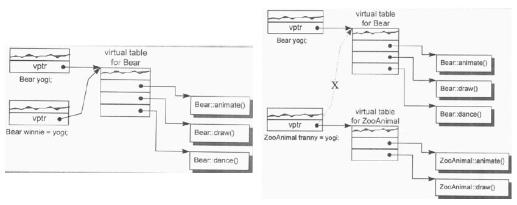 </div>

第4种情况不展现“位逐次拷贝”是因为虚基类子对象部分能够正确的初始化。1）如果使用虚基类子类的一个对象，初始化虚基类子类的另一个对象，那么“位逐次拷贝”绰绰有余；2）但是如企图以一个虚基类子类的子类的对象，初始化一个虚基类子类的对象，编译器就必须判断“后续当程序员企图存取其虚基类子对象时能否正确执行”，因此必须合成一个拷贝构造函数，安插一些代码以设定虚基类指针和偏移量的初值（或只是简单地确定它没有被抹消）

<div align="center"> 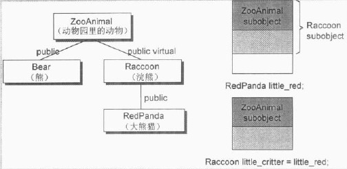 </div>

在下面的情况下，编译器无法知道“位逐次拷贝”是否还保持着，因为它无法知道Raccoon指针是否指向一个真正的Raccoon对象或是指向一个Raccoon的子类对象：

```c++
Raccoon *ptr;
Raccoon little_critter = *ptr;
```

> 总的来说就是，按照C++ Standrand，如果用户没有声明，那么会隐式的声明一个，但是会不会合成取决于声明出的是trivial还是nontrivial

## 2.3 程序转换语意学

```c++
class Test
{
public:
    Test() { cout << "默认构造函数" << endl;}
    Test(const Test &t) { cout << "拷贝构造函数" << endl;}
};

Test foo(){
    Test t;
    return t;
}

int main(){
    //输出：默认构造函数
    Test t = foo();
    return 0;
}
```

拷贝构造函数的应用，迫使编译器多多少少对程序代码做部分转化。尤其是当一个函数以传值的方式传回一个类对象，而该类有一个拷贝构造函数(无论是显式定义出来的还是合成的)时，这将导致深奥的程序转化——无论在函数的定义上还是在使用上。此外，编译器将拷贝构造的调用操作优化，以一个额外的第一参数(数值被直接存放于其中)取代NRV(named return value)。如果了解那些转换，已经拷贝构造函数优化后的可能状态，就比较能够控制程序的执行效率

## 2.4 成员初始化列表

下列情况下，必须使用成员初始化列表：

1. **当初始化一个引用成员时**
2. **当初始化一个常量成员时**
3. **当调用一个基类的构造函数，而它拥有一组参数时**
4. **当调用一个类类型成员的构造函数，而它拥有一组参数时**

**编译器会对初始化列表一一处理并可能重新排序，以反映出成员的声明顺序。它会安插一些代码到构造函数体内，并置于任何显示用户代码(explicit user code)之前**

<br>

> 和默认构造函数、拷贝构造函数相关的问题：是否可以使用memset来初始化一个对象、使用memcpy来拷贝一个对象？只有在”class不含任何由编译器产生的内部members“时才能有效运行。如果class声明一个或一个以上的virtual functions，或内含一个virtual base class，那么使用上述函数将会导致那些”被编译器产生的内部members“的初值被改写
> 
> ```c++
> class Shape{
> public:
>   //会改变内部的vptr
>   Shape() {memset(this,0,sizeof(Shape));}
>   //当传入一个子类对象的地址时，vptr会指向子类的虚函数表
>   Shape(const Shape &rhs) {memcpy(this,&rhs,sizeof(Shape));}
>   virtual ~Shape();
> };
> ```

<br>
<br>

# 第3章 Data语意学

类X、Y、Z、A具有如下关系：

<div align="center"> 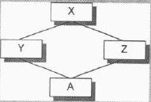 </div>

使用sizeof打印大小有如下结果：

```c++
class X { };
class Y : public virtual X { };
class Z : public virtual X { };
class A : public Y, public Z { };

int main(){
    cout << "X:" << sizeof(X);                //X:1
    cout << "  Y:" << sizeof(Y);              //Y:8，和机器，编译器有关
    cout << "  Z:" << sizeof(Z);              //Z:8，和机器，编译器有关
    cout << "  A:" << sizeof(A) << endl;      //A:16，和机器，编译器相关
    return 0;
}
```

* **对于X**：编译器安插进一个char，使得类X的对象得以在内存中配置独一无二的地址
* **对于Y和Z**：Y和Z的大小受3个因素的影响
	* **虚继承所造成的额外负担**：这种额外负担反映在某种形式的**指针**身上，它或者指向“虚基类子对象”，或者指向一个相关表格（表格中存放的不是“虚基类子对象”的地址，就是其偏移位置）
	* **编译器对于特殊情况所提供的优化处理**：
		* 传统上，虚基类X的1 byte大小也出现在Y和Z中，被放在子类的固定(不变动)部分的尾端（**下图左**）
		* “某些”编译器会对“空虚基类”提供特殊支持，“空虚基类”被视为子类对象最开头的一部分，即不花费任何空间。因此节省了传统情况下的1 byte，因为既然有了成员，就不需要原本为了“空类”而安插的一个char（**下图右**）
	* **对齐的限制**：类Y和Z的大小截至目前为止是5 bytes，在大部分机器上，聚合的结构体大小会受到对齐的限制，为了能够更有效地在内存中存放，会进行字节填充
* **对于A**：类A的大小由下列因素决定
	* **被共享的唯一一个类X实例**，大小为1 byte（对于那些对“空虚基类”提供支持的编译器，这1 byte被拿掉）
	* **类Y的大小减去“因虚基类而配置的大小”**
	* **类Z的大小减去“因虚基类而配置的大小”**
	* **类A自己的大小**（这里是0 byte）
	* **对齐的要求**

<div align="center"> 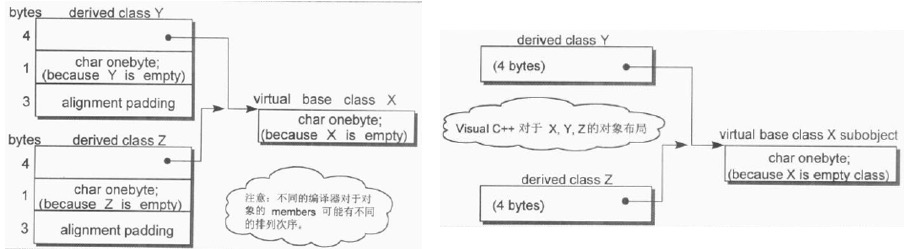 </div>

<br>

> C++标准并不强制规定如“基类子对象的排列顺序”或“不同存取层级的数据成员的排列顺序”这种琐碎细节。它也不规定“虚函数”或“虚基类”的实现细节。C++标准只说：这些细节由各家厂商自定

**C++对象模型尽量以空间优化和存取速度优化的考虑来表现nonstatic data members，并且保持和C语言struct数据配置的兼容性。它把数据直接存放在每一个class object之中。对于继承而来的nonstatic data members（不管是虚继承还是一般继承）也是如此。不过并没有强制定义期间的排列顺序。至于static data memebers，则被放置在程序的一个全局数据段中，不会影响个别的class object的大小**

## 3.1 Data Member的绑定

* **成员函数体内的名字解析直到类的声明都出现了才开始**
* **成员函数的参数列表不符合上一条规则，名字解析从参数第一次出现开始**

```c++
/*******************************************************
 * 成员函数体内的名字解析，x为Point3D的成员
 *******************************************************/
extern int x;

class Point3d{
public:
	...
	//对于函数本体的解析将延迟，直至class声明的右大括号出现才开始
	float X() const {return x;}
	//...
private:
	float x;
	...
};

/*******************************************************
 * 成员函数参数列表的名字解析
 *******************************************************/
 typedef int length;
 
 class Point3d{
 public:
 	//length被解析为int，_val被解析为类的成员变量
 	void mumble(length val) {_val = val;}
 	length mumble() {return _val;}
 	//...
 private:
 	//这里的length应该在类对它的第一个参考操作之前被看到，这样的声明将使先前的参考操作不合法
 	//请总是把“内嵌的类型声明”放在class的起始处
 	typedef float length;
 	length _val;
 	//...
 }
```

## 3.2 Data Member的布局

> access section：private、public、protected等区段

* **同一access section中的Nonstatic data members在class object中的排列顺序将和其被声明的顺序一样**
	* **C++标准要求，同一access section中，members的排列只需符合“较晚出现的members在class object中有较高的地址”即可，各个members并不一定得连续排列**：
		* **对齐可能会填充一些字节**
		* **编译器可能会合成一些内部使用的data members**，如vptr（vptr传统上被放在所有显式声明的members的最后，如今有一些编译器把vptr放在一个class object的最前端。C++标准允许这些内部产生出来的members自由地放在任何位置上，甚至放在那些被程序员声明出来的members之间）
* **C++标准允许多个access sections之中的data memebers自由排列，不必在乎它们出现在class声明中的顺序**

## 3.3 Data Member的存取

考虑下列代码：

```c++
Point3d origin,*pt = &origin;

origin.x = 0.0;
pt->x = 0.0;
```

通过origin存取和通过pt存取有什么差异？对x是静态数据成员与不是静态成员时进行分析

* **Static Data Members**：这是C++中“通过一个指针和通过一个对象来存取member，结论完全相同”的唯一一种情况。这是因为“经由'.'对一个static data member进行存取操作”只是文法上的一种便宜行事。member其实并不在class object之中，因此存取static member并不需要通过class object（如果有两个类，每一个都声明了一个同名的static member，那么当它们都被放在程序的data segment时，就会导致命名冲突。编译器的解决方法是暗中对每一个static member编码，以获得一个独一无二的程序识别代码）
* **Nonstatic Data Members**：欲对一个nonstatic data member进行存取操作，编译器需要把class object的起始位置加上data member的偏移位置。每一个nonstatic data member的偏移位置在编译时期即可获知，甚至如果member属于一个“基类子对象”也是一样，因此，存取一个nonstatic data member的效率和存取一个C struct member或一个非派生类的member是一样的。**但是，虚继承将为“经由基类子对象存取class members”导入一层新的间接性，如果通过指针存取，这个存取操作必须延迟至执行期，经由一个额外的间接引导才能解决**（原因在于，在继承体系中，”虚基类子对象“在不同派生类中的偏移量不同，指针所指的对象类型需要在运行时确定，因此只能在运行时得到”虚基类子对象“确切的偏移量）

假设，x是一个Nonstatic Data Members，那么地址 ```&origin.x``` 将等于：

```c++
//关于指向Data Members的指针以及为什么要减1，见3.5
&origin + (&Point3d::x - 1);
```

## 3.4 继承与Data Member

继承体系中类成员的布局分为以下几种情况来讨论：

* 1）不使用继承
* 2）不含多态的继承
* 3）含多态的继承
* 4）多重继承
* 5）虚继承

#### 1）不使用继承

<div align="center"> 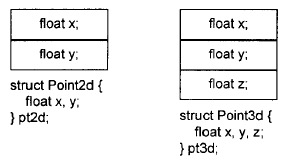 </div>

#### 2）不含多态的继承

C++标准并未强制指定派生类和基类成员的排列顺序；理论上编译器可以自由安排。在大部分编译器上，基类成员总是先出现（属于虚基类的除外）

<div align="center"> 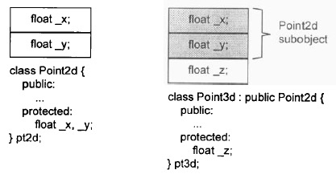 </div>

将两个原本独立不相干的类凑成一对“类型/子类型”，并带有继承关系，需要注意两点

1. 可能会重复设计一些相同操作的函数
2. 把一个类分成两层或更多层，出现在派生类中的基类子对象具有完整原样性，因此可能会导致对象空间膨胀

对于第2点，考虑下面的例子：

```c++
/****************************************************
 * 不使用继承
 ****************************************************/
class Concrete{
public:
	//...
private:
	int val;
	char c1;
	char c2;
	char c3;
};


/****************************************************
 * 使用继承，设计成多层
 ****************************************************/
class Concrete1{
public:
	//...
private:
	int val;
	char bit1;
};

class Concrete2 : public Concrete1{
public:
	//...
private:
	char bit2;
};

class Concrete3 : public Concrete2{
public:
	//...
private:
	char bit3;
};
```

<div align="center"> 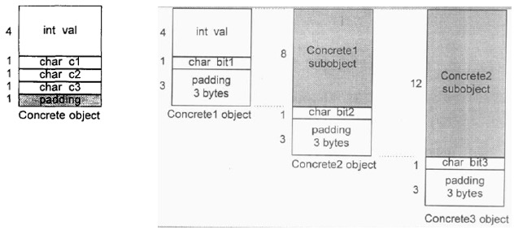 </div>

在使用继承时，派生类中的基类子对象具有完整原样性，派生类部分的成员不直接使用基类子对象的填充部分是因为：如果将一个父类对象拷贝给一个派生类对象，派生类对象的派生类成员会被覆盖：

<div align="center"> 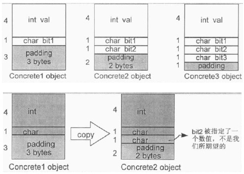 </div>

#### 3）含多态的继承

相比于不含多态的继承，这种情况下，每一个class object内含一个额外的vptr member；多了一个virtual table；此外每一个virtual member function的调用也比以前复杂了

某些编译器会把vptr放置在class object的尾端，另一些编译器会把vptr放置在class object的首端

* 把vptr放在class object的尾端，可以保留base class C struct的对象布局，因而允许在C程序代码中也能使用。这种做法在C++最初问世时，被许多人采用
<div align="center"> 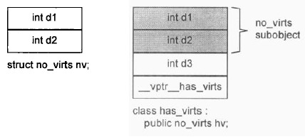 </div>

* 把vptr放在class object的首端，对于“在多重继承之下，通过指向class members的指针调用virtual function”，会带来一些帮助。否则，不仅“从class object起始点开始量起”的offset必须在执行期备妥，甚至与class vptr之间的offset也必须备妥。当然，vptr放在前端，代价就是丧失了C语言兼容性（但是似乎并没有多少程序会从一个C struct派生出一个具有多态性质的class）
<div align="center"> 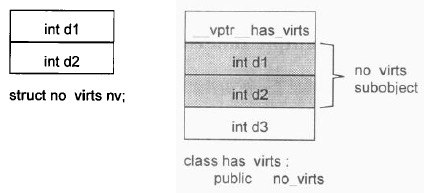 </div>

假设把vptr放在**base class**的尾端，则Point2d和Point3d的成员布局如下：

<div align="center"> 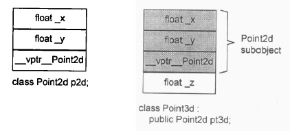 </div>

#### 4）多重继承

* 将vptr放在class object的尾端，提供了一种“自然多态”形式，基类和派生类的object都是从相同的地址开始，因此把一个派生类对象的地址指定给基类的指针或引用时，不需要编译器去调停或修改地址。它很自然地可以发生，提供了最佳执行效率
* 将vptr放在class object的首端，如果基类没有virtual function而派生类有，那么单一继承的“自然多态”就会被打破。这种情况下把一个派生类object转换为其基类型，就需要编译器的介入，用以调整地址

**多重继承的问题主要发生于派生类和其第二或后继基类object之间的转换**

**对一个多重派生对象，将其地址指定给“最左端基类的指针”，情况将和单一继承时相同，因为二者都指向相同的起始地址。需付出的成本只有地址的指定操作而已；至于第二个或后继的基类的地址指定操作，则需要将地址修改过：加上(或减去，如果downcast的话)介于中间的基类子对象大小**

```c++
class Point2d{
public:
	//...（拥有virtual接口，所以Point2d对象之中会有vptr）
protected:
	float _x,_y;
};

class Point3d : public Point2d{
public:
	//...
protected:
	float _z;
};

class Vertex{
public:
	//...（拥有virtual接口，所以Point2d对象之中会有vptr）
protected:
	Vertex *next;
};

class Vertex3d : public Point3d , public Vertex{
public:
	//...
protected:
	float mumble;
};
```


假设将vptr放在class object的尾端，类的继承关系和members的布局如下：

<div align="center"> 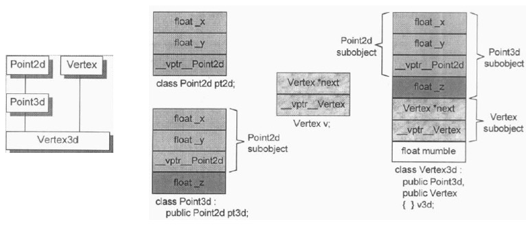 </div>

C++标准并未要求Vertex3d中的基类Point3d和Vertex有特定的排列顺序。原始的cfront编译器是根据声明顺序来排列的。因此cfront编译器创作出来的Vertex3d对象，将被视为一个Point3d子对象（其中又有一个Point2d子对象）加上一个Vertex子对象，最后再加上Vertex3d自己的部分。目前各编译器仍然以此方式完成多重基类的布局（但如果加上虚拟继承，就不一样了）

在这个例子中：

* **如果将一个Vertex3d类的对象的地址指定给Vertex类的指针，那么需要编译器介入，执行相应的地址转换**
* **如果指定给Point2d或Point3d类的指针，则不要编译器介入**

```c++
Vertex3d v3d;
Vertex *pv;
Point2d *p2d;
Point3d *p2d;
```

那么 ```pv = &v3d;``` 需要类似这样的转换：

```c++
pv = (Vertex*)(((char*)&v3d) + sizeof(Point3d));
```

而 ```p2d = &v3d;``` 或 ```p3d = &v3d;``` 只需要简单地拷贝其地址就好

作为补充，必须提及下面一种情况：

```c++
Vertex3d *pv3d;
//一系列操作，使得pv3d可能指向NULL或者一个Vertex3d对象
Vertex *pv;
```

此时 ```pv = pv3d;``` 不能只是简单的被转换，因为如果pv3d为0，pv将获得sizeof(Point3d)的值。这明显是错误的，因此需要增加一个条件测试：

```c++
pv = pv3d ? (Vertex*)(((char*)pv3d) + sizeof(Point3d)) : 0;
```

#### 5）虚继承

要在编译器中实现多继承，实在是难度颇高。以iostream继承体系为例，实现技术的挑战在于，要找到一个足够有效的方法，将istream和ostream各自维护的一个ios子对象，折叠成为一个由iostream维护的单一ios子对象，并且还可以保持基类和派生类的指针之间的多态指定操作

**一般的实现方法是，如果一个类内含有一个或多个虚基类子对象，将被分割为2部分：一个不变区域和一个共享区域**

* **不变区域**：不管后接如何衍化，总是拥有固定的offset(从object的开头算起)，所以这一部分数据可以被直接存取
* **共享区域**：所表现的就是“虚基类子对象”，这一部分的数据的位置会因为每次的派生操作而有变化，所以它们只可以被间接存取（**各家编译器实现技术之间的差异就在于间接存取的方法不同**）

**一般的布局策略是先安排好派生类的不变部分，然后再建立其共享部分**（对于共享部分的存取，cfront编译器会在每一个派生类对象中安插一些指针，每个指针指向一个虚基类。要存取继承得来的虚基类成员。可以通过相关指针间接完成）

<div align="center"> 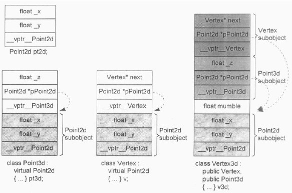 </div>

这样的实现模型有两个主要的缺点：

1. 每一个对象必须针对其每一个virtual base class背负一个额外的指针（然而理想上我们希望class object有固定的负担，不因为其virtual base class的个数而有所变化）
	* 1）Microsoft编译器引入所谓的vitual base class table。每一个class object如果有一个或多个virtual base classes，就会由编译器安插一个指针，指向virtual base class table。至于真正的virtual base class指针，当然是放在该表格中 
	* 2）在virtual  function table中放置virtual base class的offset(而不是地址)，将virtual base class offset和virtual function entries混杂在一起（**下图展示了这种模型**）
2. 由于虚拟继承串链的加长，导致间接存取层次的增加（意思是，如果有3层虚拟派生，就需要经由3个virtual base class指针进行3次间接存取。然而理想上却希望固定的存取时间，不因为虚拟派生的深度而改变）
	* MetaWare和其它编译器仍然使用cfront的原始实现模型来解决这个问题，他们经由拷贝操作取得所有的nested virtual base class指针，放到派生类object之中。从而解决了“固定存取时间”的问题，虽然付出了一些空间上的代价
	
<div align="center"> 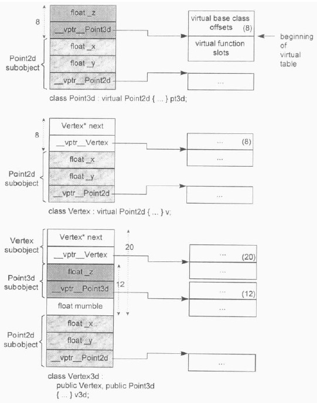 </div>

> 一般而言，virtual base class最有效的一种运用形式就是：一个抽象的virtual base class，没有任何data members

## 3.5 指向Data Members的指针

```c++
class Point3d{
 public:
    virtual void print() {}
    float x,y,z;
};

int main(){
    //Point3d::*的意思是：“指向Point3d data member”的指针类型
    float Point3d::*p1 = &Point3d::x;
    float Point3d::*p2 = &Point3d::y;
    float Point3d::*p3 = &Point3d::z;
    //不可以用cout
    printf("&Point3d::x = %p\n" , p1);   //0x8，根据机器和编译器决定
    printf("&Point3d::y = %p\n" , p2);   //0xc，根据机器和编译器决定
    printf("&Point3d::z = %p\n" , p3);   //0x10，根据机器和编译器决定
    
    Point3d p;
    p.x = 1.1;
    p.y = 2.2;
    p.z = 3.3;
    //x:1.1 y:2.2 z:3.3
    cout << "x:" << p.*p1 << " y:" << p.*p2 << " z:" << p.*p3 << endl;
    
    return 0;
}
```

**&Point3d::z**将得到z坐标在class object中的偏移位置。最低限度其值将是x和y的大小总和，因为C++要求同一access section中的members的排列顺序应该和其声明顺序相同

如果vptr放在对象的尾端，三个坐标值在对象的布局中的偏移量分别是0，4，8。如果vptr放在对象的头部，三个坐标值在对象的布局中的offset分别是8，12，16（64位机器）。然后**结果可能会加1，即1，5，9或者9，13，17。这是为了区分一个“没有指向任何data member”的指针，和一个指向“第一个data member”的指针（对象的内存分布并没有增加1，这里只是编译器可能对指针的处理）**：

```c++
float Point3d::*p1 = 0;
float Point3d::*p2 = &Point3d::x;
```

为了区分p1和p2，每一个真正的member offset的值都被加上1（如我测的结果所示，**如果没有增加1，可能是编译器做了特殊处理**）。因此，无论编译器或使用者都必须记住，在真正使用该值以指出一个member之前请减掉1

<br>
<br>

# 第4章 Function语意学

假设有一个Point3d的指针和对象：

```c++
Point3d obj;
Point3d *ptr = &obj;
```

这一章主要讨论，在进行如下调用时，会发生什么：

```c++
obj.normalize();
ptr->normalize();

//normalize函数的定义
Point3d Point3d::normalize() const
{
    register float mag = magnitude();
    Point3d normal;

    normal._x = _x/mag;
    normal._y = _y/mag;
    normal._z = _z/mag;

    return normal;
}

//magnitude函数的定义
float Point3d::magnitude() const
{
    return sqrt(_x * _x + _y * _y + _z * _z);
}
```

## 4.1 Member的各种调用方式

#### 1）Nonstatic Member Functions(非静态成员函数)

C++的设计准则之一就是：nonstatic member function至少必须和一般的nonmember function有相同的效率。因此编译器内部会将”member函数实例“转换为对等的”nonmember函数实例“

member function按照下列步骤转化为nonmember function：

1. 改写函数原型，安插一个额外的参数到member function中，提供一个存取管道，使class object得以将此函数调用。额外参数被称为this指针：

```c++
Point3d Point3d::magnitude(Point3d *const this)
//如果member function是const，则变成
Point3d Point3d::magnitude(const Point3d *const this)
```
 
2. 将每一个”对nonstatic data member的存取操作“改为经由this指针来存取：

```c++
{
    return sqrt(
        this->_x * this->_x +
        this->_y * this->_y +
        this->_z * this->_z );
}
```

3. 将member function重新写成一个外部函数。将函数名称经过”mangling“处理，使其在程序中成为独一无二的语汇：

```c++
extern magnitude__7Point3dFv(register Point3d *const this);
```

函数转换好之后，每一个调用操作也会进行转换：

```c++
obj.magnitude();
magnitude__7Point3dFv(&obj);

ptr->magnitude();
magnitude__7Point3dFv(ptr);
```

#### 名称的特殊处理

一般而言，member的名称前会被加上class名称，形成独一无二的命名：

```c++
class Bar {public: int ival; ...};
//ival有可能变成：ival__3Bar

class Foo:public Bar {public: int ival; ...};
//可能会变成这样：
class Foo{
public:
    int ival__3Bar;
    int ival_3Foo;
}
```

#### 成员函数重载的处理

为了支持重载，“mangling”处理肯定不能只使用函数名和类名

```c++
class Point {
public:
    void x(float newX);
    float x();
    ...
};

//Point中重载的x函数，可能会变成这样：
class Point{
public:
    void x__5PointFf(float newX);
    float x__5PointFv();
}
```

#### 2）Static Member Functions(静态成员函数)

static member function也会被转换成一般的nonmember function，但是不同于普通的member function，static member function没有this指针，因此差不多等同于nonmember function。每一个调用操作会进行类似如下转换：

```c++
//obj.normalize();
normalize__7Point3dSFv();
//ptr->normalize();
normalize__7Point3dSFv();
```

假设Point3d类存在一个名为object_count的static member function：

```c++
unsigned int Point3d::object_count()
{
    return _object_count;
}

//会被cfront转化为：
unsigned int object_count__5Point3dSFv()
{
    return _object_count__5Point3d;
}
```

SFv表示它是一个static member function，拥有一个void参数链表

如果取一个static member function的地址，获得的将是其在内存中的位置，也就是其地址。由于static member function没有this指针，所以其地址的类型并不是一个“指向class member function的指针”，而是一个"nonmember函数指针"：

```c++
&Point3d::object_count();
//会得到一个数值，类型是：
unsigned int(*)();
//而不是
unsigned int (Point3d::*)();
```

#### 3）Virtual Member Functions(虚函数)

还是考虑以下两种调用会如何转换：

```c++
ptr->normalize();
obj.normalize();
```

通过ptr调用时，会被转化为：

```c++
/****************************************************
 * 1是virtual table slot的索引值，关联到normalize()函数
 * 第二个ptr表示this指针
 ****************************************************/
(*ptr->vptr[1])(ptr);
```

那么通过obj调用时，会如何转化？如果类似ptr，虽然语意正确，却没有必要。上述经由obj调用的函数实例只可能是Point3d::normalize()。**“经由一个class object调用一个virtual function”，这种操作应该总是被编译器像对待一般nonstatic member function一样地解析**，因此转化如下：

```c++
normalize__7Point3dFv
```

## 4.2 Virtual Member Functions虚函数

#### 1）单继承中的虚函数

考虑下面3个类：

```c++
class Point{
public:
    virtual ~Point();
    virtual Point& mult(float) = 0;

    float x() const {return _x;}
    virtual float y() const {return 0;}
    virtual float z() const {return 0;}
protected:
    Point(float x = 0.0);
    float _x;
};

class Point2d : public Point{
public:
    Point2d(float x = 0.0,float y = 0.0) : Point(x),_y(y) {}
    ~Point2d();

    //改写base class virtual functions
    Point2d& mult(float);
    float y() const {return _y;}
protected:
    float _y;
};

class Point3d : public Point2d{
public:
    Point3d(float x = 0.0,float y = 0.0,float z = 0.0) : Point2d(x,y),_z(z) {}
    ~Point3d();

    //改写base class virtual functions
    Point3d& mult(float);
    float z() const {return _z;}
protected:
    float _z;
};
```

3个类的虚函数表如下：

<div align="center"> 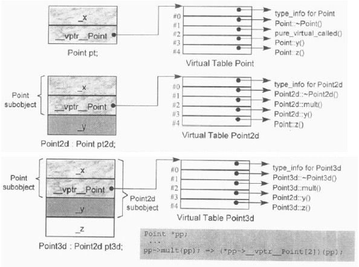 </div>

对于如下调用：

```c++
ptr->z();
```

如何有足够的信息在编译时期设定virtual function的调用呢？

* 一般而言，每次调用z()时，并不知道ptr所指的真正类型。然而却知道经由ptr可以存取到该对象的virtual table
* 虽然不知道哪一个z()函数实例会被调用，但却知道每一个z()函数地址都放在slot4中

这些信息使得编译器可以将该调用转化成：

```c++
(*ptr->vptr[4])(ptr);
```

唯一一个在执行期才能知道的东西是：slot4所指的到底是哪一个z()函数实例

> 在一个单一继承体系中，virtual function机制的行为十分良好，不但有效率而且很容易塑造出模型来。但是在多重继承和虚拟继承之中，对virtual functions的支持就没有那么好了

#### 2）多继承中的虚函数

**在多重继承中支持virtual functions，其复杂度围绕在第二个及后继的base classes身上，以及“必须在执行期调整this指针”这一点**

```c++
class Base1{
public:
    Base1();
    virtual ~Base1();
    virtual void speakClearly();
    virtual Base1 *clone() const;
protected:
    float data_Base1;
};

class Base2{
public:
    Base2();
    virtual ~Base2();
    virtual void mumble();
    virtual Base2 *clone() const;
protected:
    float data_Base2;
};

class Derived : public Base1 , public Base2{
public:
    Derived();
    virtual ~Derived();
    virtual Derived *clone() const;
protected:
    float data_Derived;
};
```

在多重继承下，一个derived class内含n-1个"额外"的virtual tables，n表示其上一层base classes的个数（因此，单一继承将不会有额外的virtual tables）。对于上面的Derived类而言，会有2个virtual tables被编译器产生出来：

1. 一个主要实例，与Base1(最左端base class)共享
2. 一个次要实例，与Base2(第二个base class)有关

针对每一个virtual tables，Derived对象中有对应的vptr

用以支持“一个class拥有多个virtual tables”的传统方法是，将每一个tables以外部对象的形式产生出来，并给予独一无二的名称。例如，Derived所关联的两个tables可能有这样的名称：

```c++
vtbl__Derived;          //主要表格
vtbl__Base2__Derived;   //次要表格
```

* 将一个Derived对象地址指定给一个Base1指针或Derived指针时，被处理的virtual table是主要表格vtbl__Derived
* 将一个Derived对象地址指定给一个Base2指针时，被处理的virtual table是次要表格vtbl__Base2__Derived

<div align="center"> 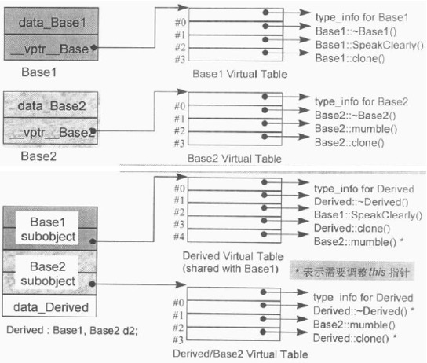 </div>

**有3种情况，第二或后继的base class会影响对virtual functions的支持**：

1. **通过一个“指向第二个base class”的指针，调用derived class virtual function**

```c++
Base2 *ptr = new Derived;
//调用Derived::~Derived，ptr必须被向后（实际是向上）调整sizeof(Base1)个bytes
delete ptr;
```

ptr指向Derived对象中的Base2 subobject；为了能够正确执行，ptr必须调整指向Derived对象的起始处

2. **通过一个“指向derived class”的指针，调用一个从第二个base class中继承而来的virtual function**：

```c++
Derived *pder = new Derived;
//调用Base2::mumble()，pder必须被向前（实际是向下）调整sizeof(Base1)个bytes
pder->mumble();
```

在这种情况下，pder必须调整，指向第二个base subobject

3. **允许一个virtual function的返回值类型有所变化，可能是base type，也可能是derived type。clone函数的Derived版本传回一个Derived class指针**：

```c++
Base2 *pb1 = new Derived;
//调用Derived* Derived::clone()，返回值必须被调整，以指向Base2 subobject
Base2 *pb2 = pb1->clone();
```

当进行pb1->clone()时，pb1会被调整指向Derived对象的起始地址，于是clone()的Derived版会被调用。它会传回一个新的Derived对象。该对象的地址在被指定给pb2之前，必须先经过调整，以指向Base2 subobject

#### 3）虚继承下的虚函数

```c++
class Point2d{
public:
    Point2d(float = 0.0,float = 0.0);
    virtual ~Point2d();

    virtual void mumble();
    virtual float z();
    //...
protected:
    float _x,_y;
};

class Point3d : public virtual Point2d {
public:
    Point3d(float = 0.0,float = 0.0,float = 0.0);
    ~Point3d();

    float z();
protected:
    float _z;
};
```

virtual table布局如下：

<div align="center"> 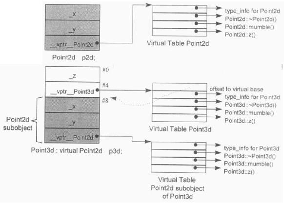 </div>

虽然Point3d有唯一一个base class，即Point2d，但Point3d和Point2d的起始部分并不像“非虚拟的单一继承”情况那样一致。如上图所示，由于Point2d和Point3d的对象不再相符，两者之间的转换也就需要调整this指针。至于在虚拟继承的情况下要消除thunks，一般而言已经被证明是一项高难度技术

## 4.3 指向Member Function的指针

```c++
class Point3d{
 public:
    Point3d(float x = 0.0,float y = 0.0,float z = 0.0) : _x(x),_y(y),_z(z) {}
    float x()   {return _x;}
    float y()   {return _y;}
    float z()   {return _z;}
private:
    float _x,_y,_z;
};

int main(){
    Point3d p;
    Point3d *pp = &p;

    //定义并初始化Member Function指针
    float (Point3d::*pmf1)() = &Point3d::x;

    //调用
    (p.*pmf1)();    //会被编译器转换为：(pmf1)(&p);
    (pp->*pmf1)();  //会被编译器转换为：(pmf1)(pp);

    //地址
    printf("&Point3d::x = %p\n" , &Point3d::x);   //0x10d81fec0
    printf("&Point3d::y = %p\n" , &Point3d::y);   //0x10d81fee0
    printf("&Point3d::z = %p\n" , &Point3d::z);   //0x10d81ff00

    return 0;
}
```

取一个nonstatic memeber function的地址，如果函数非虚，得到的结果是它在内存中真正的地址

static member functions(没有this指针)的类型是“函数指针”，而不是“指向member function的指针”

使用一个“member function指针”，如果并不用于virtual function、多重继承、virtual base class等情况的话，并不会比使用一个“nonmember function指针”的成本更高，对于那些没有virtual functions、virtual base class或多重继承的类而言，编译器可以为它们提供相同的效率

#### 1）支持指向Virtual Member Functions的指针

将上面的x()、y()、z()函数换成虚函数：

```c++
class Point3d{
 public:
    Point3d(float x = 0.0,float y = 0.0,float z = 0.0) : _x(x),_y(y),_z(z) {}
    virtual float x()   {return _x;}
    virtual float y()   {return _y;}
    virtual float z()   {return _z;}

private:
    float _x,_y,_z;
};

int main(){
    Point3d p;
    Point3d *pp = &p;

    //定义并初始化Member Function指针
    float (Point3d::*pmf1)() = &Point3d::x;

    //调用
    (pp->*pmf1)();//会被编译器转换为：(*pp->vptr[(int)pmf1])(pp);

    printf("&Point3d::x = %p\n" , &Point3d::x);   //0x1
    printf("&Point3d::y = %p\n" , &Point3d::y);   //0x9
    printf("&Point3d::z = %p\n" , &Point3d::z);   //0x11

    return 0;
}
```

结果显示，对虚函数取值得到的不是该函数在内存中的地址，而是一个索引值（或偏移量）

pmf1能够指向一般成员函数和虚拟成员函数，因此编译器必须定义pmf1，使它能够：1）持有两种数值；2）其数值可以被区别代表内存地址还是virtual table中的索引值（或偏移量）。在cfront2.0非正式版中，这两个值都被内含在一个普通的指针内。cfront使用如下技巧识别两种数值：

```c++
(((int)pmf1) & ~127) ? (*pmf1)(ptr) : (*pp->vptr[(int)pmf1](ptr));
```

这种实现技巧必须假设继承体系中最多只有128个virtual functions，这并不是我们所希望的，但却证明是可行的。然而多重继承的引入，导致需要更多一般化的实现模式，并趁机除去对virtual functions的个数限制

#### 2）多重继承下，指向Member Functions的指针

为了让指向member functions的指针也能够支持多重继承和虚拟继承，Stroustrup设计了下面一个结构体：

```c++
//一般结构，用以支持在多重继承之下指向member functions的指针
struct __mptr{
    int delta;              //this指针的偏移
    int index;              //virtual table索引（不指向virtual table时，会被设为-1）
    union{
        ptrtofunc faddr;    //nonvirtual member function的地址
        int v_offset;       //virtual base class的vptr的位置
    }
};
```

此模型下，像下面的调用：

```c++
(ptr->*pmf)();
```

会变成：

```c++
(pmf.index < 0) ? (*pmf.faddr)(ptr) : (*ptr->vptr[pmf.index](ptr));
```

这种方法存在下面两个问题：

* 每一个调用操作都得付出上述成本，检查其是否为virtual或nonvirtual
* 当传入一个不变值的指针给member function时，需要产生一个临时性对象

<br>

## 4.4 Inline Functions

暂略

<br>
<br>

# 第5章 构造、析构、拷贝语意学

## 5.1 无继承情况下的对象构造

#### 1）C struct的Point声明

```c++
/*
 * C++称这是一种所谓的Plain O1' Data声明形式。如果以C++来编译，观念上，编译器会为
 * Point声明一个trivial default construct、一个trivial destructor、一个
 * trivial copy constructor，以及一个trivial copy assignment operator。
 * 但实际上，编译器会分析这个声明，并为它贴上Plain OI' Data标签
 */
typedef struct
{
    float x,y,z;
}Point;

/*
 * 观念上Point的trivial constructor和destructor都会被产生并被调用，constructor
 * 在程序起始处被调用而destructor在程序的exit()处被调用。然而，事实上那些
 * trivial members要不是没被定义，就是没被调用，程序的行为一如它在C中的表现一样
 * 
 * 那么在C和C++中有什么区别？
 * 1）在C中，global被视为一个“临时性的定义”，因为它没有显式的初始化操作。一个“临时性的定义”
 * 可以在程序中发生多次。那些实例会被链接器折叠起来，只留下单独一个实例，被放在程序
 * data segment中一个“特别保留给未初始化之global objects使用”的空间。由于历史的原因，
 * 这块空间被称为BSS
 * 2）C++并不支持“临时性的定义”，这是因为class构造行为的隐式应用的缘故。虽然大家公认这个语言
 * 可以判断一个class objects或是一个Plain O1' Data，但似乎没有必要搞这么复杂。因此，
 * global在C++中被视为完全定义（它会阻止第二个或更多的定义）。C和C++的一个差异就在于，
 * BSS data segment在C++中相对地不重要。C++的所有全局对象都被以“初始化过的数据”来对待
 */
Point global;

Point foobar()
{
    //既没有被构造也没有被析构
    Point local;
    //没有default constructor实施于new运算符所传回的Point object身上
    Point *heap = new Point;
    //如果local曾被适当初始化过，一切就没问题，否则会产生编译警告
    //观念上，这样的指定操作会触发trivial copy assignment operator做拷贝搬运操作。
    //然而实际上该object是一个Plain OI' Data，所以赋值操作将只是像C那样的纯粹位搬移操作
    *heap = local;
    //观念上，会触发trivial destructor，但实际上destructor要不是没有被产生就是没有被调用
    delete heap;
    //观念上会触发trivial copy constructor，不过实际上return操作只是一个简单的位拷贝操作，
    //因为对象是个Plain O1' Data
    return local;
}
```

上面的global在C和C++中的区别：

<div align="center"> 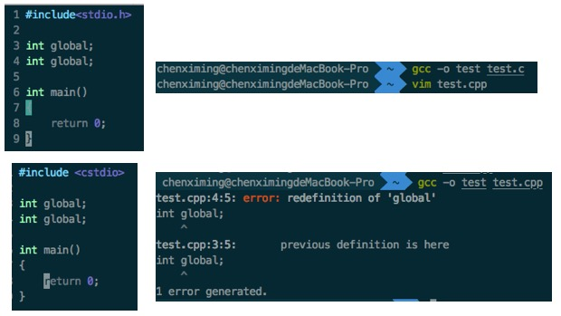 </div>

#### 2）抽象数据类型

```c++
/*
 * 提供了完整的封装性，但没有提供任何virtual function
 * 这个经过封装的Point class，其大小并没有改变，还是三个连续的float
 */
class Point{
public:
    //定义了一个构造函数
    Point(float x = 0.0,float y = 0.0,float z = 0.0)
        : _x(x) , _y(y) , _z(z) {}
    //除此之外，没有定义其它成员函数
private:
    float _x , _y , _z;
};

//现在有了default constructor作用于其上。由于global被定义在全局范畴中，其初始化操作
//在程序启动时进行
Point global;

Point foobar()
{
    /*
     * local的定义会被附上default Point constructor的inline expansion:
     * Point local;
     * local._x = 0.0, local._y = 0.0, local._z = 0.0;
     */
    Point local;
    /*
     * 现在则被附加一个“对default Point constructor的有条件调用操作”：
     * Point *heap = __new(sizeof(Point));
     * if(heap != 0)
     *     heap->Point::Point();
     * 在条件内才又被编译器进行inline expansion操作
     */
    Point *heap = new Point;
    //保持着简单的位拷贝操作
    *heap = local;
    //并不会导致destructor被调用
    delete heap;
    //return时，同样保持着简单的位拷贝操作，并没有拷贝构造
    return local;
}
```

总的来说，观念上，Point class有一个相关的default copy constructor、copy operator、和destructor。然而它们都是无关痛痒的，而且编译器实际上根本没有产生它们

#### 3）包含虚函数的Point声明

包含虚函数时，除了每一个class object多负担一个vptr之外，virtual function的导入也引发编译器对于Point class产生膨胀作用（如，编译器会在构造函数中插入初始化vptr的代码）

```c++
class Point{
public:
    Point(float x = 0.0,float y = 0.0) : _x(x) , _y(y) {}
    virtual float z();
private:
    float _x , _y;
}
```

* 自定义构造函数中会安插初始化vptr的代码
* 因为需要处理vptr，所以会合成一个copy constructor和一个copy assignment operator，这两个函数不再是trivial（但隐式的destructor任然是trivial）

```c++
Point * Point::Point(Point *this,float x,float y) : _x(x) , _y(y)
{
    //设定object的virtual table pointer(vptr)
    this->__vptr_Point = __vtbl__Point;

    //扩展member initialization list
    this->_x = x;
    this->_y = y;

    //传回this对象
    return this;
}

inline Point* Point::Point(Point *this,const Point &rhs)
{
    //设定object的virtual table pointer(vptr)
    this->__vptr_Point = __vtbl__Point;

    //将rhs左边中的连续位拷贝到this对象，
    //或是经由member assignment提供一个member...

    return this;
}

//编译器在优化状态下可能会把object的连续内容拷贝到另一个object身上，
//而不会实现一个精确地“以成员为基础的赋值操作”
```

```c++
//和前一版本相同
Point global;

Point foobar()
{
    //和前一版本相同
    Point local;
    //和前一版本相应
    Point *heap = new Point;
    //这里可能触发copy assignment operator的合成，及其调用操作的一个
    //inline expansion（行内扩张），以this取代heap，而以rhs取代local
    *heap = local;
    //和前一版本相同
    delete heap;
    //最具戏剧性的改变在这，下面讨论
    return local;
}
```

由于copy constructor的出现，foobar很可能被转化为下面这样：

```c++
Point foobar(Point &__result)
{
    Point local;
    local.Point::Point(0.0,0.0);

    //heap的部分与前面相同

    //copy constructor的应用
    __result.Point::Point(local);

    //销毁local对象

    return;
}
```

如果支持named return value(NRV)优化，会进一步被转化：

```c++
Point foobar(Point &__result)
{
    __result.Point::Point(0.0,0.0);

    //heap的部分与前面相同...

    return;
}
```

> 一般而言，如果设计之中有许多函数都需要以传值方式传回一个local class object，那么提供一个copy constructor就比较合理——甚至即使default memberwise语意已经足够。它的出现会触发NRV优化。然而，就像前面例子展现的那样，NRV优化后将不再需要调用copy constructor，因为运算结果已经被直接计算于“将被传回的object”内了

## 5.2 继承体系下的对象构造

```c++
class Point{
public:
    Point(float x = 0.0,float y = 0.0);
    Point(const Point&);
    Point& operator=(const Point&);

    virtual ~Point();
    virtual float z() {return 0.0;}
protected:
    float _x,_y;
};
```

#### 虚拟继承

假设具有如下继承体系：

<div align="center"> 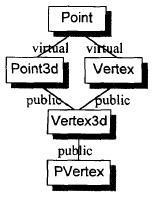 </div>

```c++
class Point{
public:
    Point(float x = 0.0,float y = 0.0);
    Point(const Point&);
    Point3d& operator=(const Point&);

    virtual ~Point();
    virtual float z() {return 0.0;}
protected:
    float _x,_y;
};

class Point3d : public virtual Point{
public:
    Point3d(float x = 0.0,float y = 0.0,float z = 0.0) : Point(x,y),_z(z) {}
    Point3d(const Point3d &rhs) : Point(rhs),_z(rhs._z) {}
    ~Point3d();
    Point3d& operator=(const Point3d&);

    virtual float z() {return _z;}
protected:
    float _z;
};

class Vertex : virtual public Point {...};
class Vertex3d : public Point3d,public Vertex {...};
class PVertex : public Vertex3d {...};
```

**在虚拟继承下，一个主要的问题是如何初始化“虚基类子对象”，调用虚基类的构造函数初始化”虚基类子对象“应该在最底层的派生类中进行**

因此，Point3d的构造函数可能被编译器扩充成如下形式：

```c++
Point3d* Point3d::Point3d(Point3d *this,bool __most_derived,float x,float y,float z)
{
    if(__most_derived != false)
        this->Point::Point(x,y);

    this->__vptr_Point3d = __vtbl__Point3d;
    this->__vptr_Point3d__Point = __vtbl_Point3d__Point;
    
    this->_z = rhs._z;
    return this;
}
```

在更深层的继承情况下，例如Vertex3d，调用Point3d和Vertex的constructor时，总是会把__most_derived参数设为false，于是就压制了两个constructors中对Point constructor的调用操作：

```c++
Vertex3d* Vertex3d::Vertex3d(Vertex3d *this,bool __most_derived,float x,float y,float z)
{
    if(__most_derived != false)
        this->Point::Point(x,y);

    //调用上一层base classes设定__most_derived为false
    this->Point3d::Point3d(false,x,y,z);
    this->Vertex::Vertex(false,x,y);

    //设定vptrs，安插user code

    return this;
}
```

这样，```Point3d origin;``` 和 ```Vertex3d cv;``` 都能正确的调用Point constructor

> 某些新进的编译器把每个constructor分裂为二，一个针对完整的object，另一个针对subobject。”完整object“版无条件地调用virtual base constructor，设定所有的vptrs等。”subobject“版则不调用virtual base constructors，也可能不设定vptrs等。constructor的分裂可带来程序速度的提升，但是使用这个技术的编译器似乎很少，或者说没有

#### vptr的设置

**vptr会在构造函数中进行初始化，关键是vptr应该在构造函数中何时执行初始化。考虑这个问题是因为：如果在构造函数中调用虚拟函数，那么vptr的初始化时机可能会给使得程序产生不一致的表现**

当定义一个PVertex object时，constructors的调用顺序如下：

```c++
Point(x,y);         //1
Point3d(x,y,z);     //2
Vertex(x,y,z);      //3
Vertex3d(x,y,z);    //4
PVertex(x,y,z);     //5
```

假设这个继承体系中的每一个class都定义了一个virtual function size()，函数负责传回class的大小，并且在每一个构造函数中调用这个size()函数。那么当定义PVertex object时，5个constructors会如何？每一次size()都是调用PVertex::size()？或者每次调用会被决议为”目前正在执行的constructor所对应的class“的size()函数实例？答案是后者，关键是编译器如何处理，来实现这一点

* 如果调用操作限制必须在constructor中直接调用，那么将每一个调用操作以静态方式决议，而不使用虚拟机制。例如，在Point3d constructor中，就显式调用Point3d::size()。然而，如果size()之中又调用一个virtual function，会发生什么？这种情况下，这个调用也必须决议为Point3d的函数实例。而在其它情况下，这个调用是纯正的virtual，必须经由虚拟机制来决定其归向。也就是说，虚拟机制本身必须知道是否这个调用源自于一个constructor之中
* **根本的解决之道是，在执行一个constructor时，必须限制一组virtual functions候选名单**。因此需要处理virtual table，而处理virtual table又需要通过vptr。所以为了控制一个class中有所作用的函数，编译系统只要简单地控制vptr的初始化和设定操作即可

**vptr应该在base class constructors调用之后，在程序员提供的代码及member initialization list中所列的members初始化操作之前进行初始化**

* 如果每一个constructor都一直等待到其base class constructors执行完毕之后才设定其对象的vptr，那么每次都能调用正确的virtual function实例
* 在程序员提供的代码之前设定vptr是因为程序员提供的代码中可能会调用virtual function，因此必须先设定
* 在member initialization list之前设定是因为member initialization list中也可能调用virtual function。因此需要先进行设定

那么这种方式是否安全？考虑下列两种情况：

* **在class的constructor的member initialization list中调用该class的一个虚函数**：vptr能在member initialization list被扩展之前由编译器正确设定好。而虚函数本身可能还得依赖未被设立初值的members，所以语意上可能是不安全的。然而从vptr的整体角度来看，是安全的
* **在member initialization list中使用虚函数为base class constructor提供参数**：这是不安全的，由于base class constructor的执行在vptr的设定之前，因此，此时vpt若不是尚未被设定好，就是被设定指向错误的class。更进一步地说，该函数所存取的任何class's data members一定还没有被初始化

## 5.3 对象拷贝语意学

一个class对于默认的copy assignment operator，在以下情况，不会表现出bitwise copy语意：

1. 当class内含有一个member object，而其class有一个copy assignment operator时
2. 当一个class的base class有一个copy assignment operator时
3. 当一个class声明了任何virtual functions时（一定不要拷贝右端class object的vptr地址，因为它可能是一个derived class object）
4. 当class继承自一个virtual base class时（无论此base class有没有copy operator）时

C++标准上说，copy assignment operator在不表现出bitwise copy semantics时，是nontrivial的，只有nontrivial的实例才会被合成出来 

以上面的2.为例子看看编译器合成的copy assignment operator是什么样子，在为Point类显式定义一个copy assignment operator，然后Point3d继承类Point，但是不显式定义copy assignment operator：

```c++
inline Point& Point::operator=(const Point &p)
{
    _x = p._x;
    _y = p._y;

    return *this;
}

class Point3d::virtual public Point{
public:
    Point3d(float x = 0.0,float y = 0.0,float z = 0.0);
protected:
    float _z;
};
```

编译器为Point3d合成的copy assignment operator，类似如下形式：

```c++
inline Point3d& Point3d::operator=(Point3d* const this,const Point3d &p)
{
    //调用base class的函数实例
    this->Point::operator=(p);  //或(*(Point*)this) = p;

    //逐成员拷贝派生类的成员
    _z = p._z;
    return *this;
}
```

> copy assignment operator是一个非正交性情况，它缺乏一个member assignment list（平行于member initialization list的东西）

#### 虚继承中的拷贝赋值

假设编译器按上面的形式合成子类的copy assignment operator，现在假设另一个类Vertex，和Point3d一样，派生自Point，那么编译器为Vertex合成的copy assignment operator，类似如下形式：：

```c++
inline Vertex& Vertex::operator=(const Vertex &v)
{
    this->Point::operator=(v);
    _next = v._next;
    return *this;
}
```

那么现在又从Point3d和Vertex中派生出Vertex3d。编译器也会为Vertex3d合成copy assignment operator：

```c++
inline Vertex3d& Vertex3d::operator=(const Vertex3d &v)
{
    this->Point::operator=(v);
    this->Point3d::operator=(v);
    this->Vertex::operator=(v);
    ...
}
```

在执行Point3d和Vertex的copy assignment operator时，会重复调用Point的copy assignment operator

事实上，copy assignment operator在虚拟继承情况下行为不佳，需要小心地设计和说明。许多编译器甚至并不尝试取得正确的语意，它们在每一个中间的copy assignment operator中调用每一个base class instance，于是造成virtual base class copy assignment operator的多个实例被调用。cfront、Edison Design Group的前端处理器、Borland C++ 4.5以及Symantec最新版C++编译器都这么做，而C++标准对此其实也并没有做限制

## 5.4 析构语意学

如果class没有定义destructor，那么只有在class内含的member object（抑或class自己的base class）拥有destructor的情况下，编译器才会自动合成出一个来

一个destructor被扩展的方式类似constructor被扩展的方式，但是顺序相反：

1. destructor的函数本体首先被执行
2. 如果class拥有member class object，而后者拥有destructors，那么它们会以其声明顺序的相反顺序被调用
3. 如果object内含一个vptr，现在被重新设定，指向适当base class的virtual table
4. 如果有任何直接的（上一层）nonvirtual base classes拥有destructors，那么它们会以其声明顺序的相反顺序被调用
5. 如果有任何virtual base classes拥有destructor，而目前讨论的这个class是最尾端的class，那么它们会以其原来的构造顺序的相反顺序被调用

> 就像constructor一样，目前对于destructor的一种最佳实现策略就是维护两份destructor实例：
> * 一个complete object实例，总是设定好vptr(s)，并调用virtual base class destructor
> * 一个base class subobject实例；除非在destructor函数中调用一个virtual function，否则它绝不会调用virtual base class destructors并设定vptr（因为如果不调用虚函数就没必要修改vptr）
> 
> 一个object的生命结束于其destructor开始执行之时。由于每一个base class destructor都轮番被调用，所以derived object实际上变成了一个完整的object。例如一个PVertex对象归还其内存空间之前，会依次变成一个Vertex3d对象、一个Vertex对象，一个Point3d对象，最后成为一个Point对象。当我们在destructor中调用member functions时，对象的蜕变会因为vptr的重新设定（在每一个destructor中，在程序员所提供的代码执行之前）而受到影响

<br>
<br>

# 第6章 执行期语意学

## 6.1 静态对象的构造和析构

#### 1）全局对象

```c++
Matrix identity;

main()
{
    //identity必须在此处被初始化
    Matrix m1 = identity;
    ...
    return 0;
}
```

C++保证，一定会在main()函数中第一次用到identity之前，把identity构造出来，而在main()函数结束之前吧identity摧毁掉。像identity这样的所谓global object如果有constructor和destructor的话，我们说它需要**静态的初始化操作和内存释放操作**

当cfront还是唯一的C++编译器，而且跨平台移植性比效率的考虑更重要的时候，有一个可移植但成本颇高的**静态初始化(以及内存释放)**方法，称为munch策略：

1. 为每一个需要静态初始化的文件产生一个_sti()函数，内含必要的constructor调用操作或inline expansions。例如前面的identity对象会在matrix.c中产生出下面的__sti()函数：

```c++
__sti__matrix_c__identity()
{
    identity.Matrix::Matrix();  //静态初始化
}
```

2. 在每一个需要静态的内存内存释放操作的文件中，产生一个__std()函数，内含必要的destructor调用操作，或是其inline expansions

3. 提供一组runtime library "munch"函数；一个_main()函数（用以调用可执行文件中的所有__sti()函数）,以及一个exit()函数（以类似方式调用所有的__std()函数）

<div align="center">  </div>

cfront2.0版之前并不支持noclass object的静态初始化操作；也就是说C语言的限制仍然残留着。所以下面的每一个初始化操作都被标为不合法：

```c++
extern int i;

//全部都要求静态初始化，在2.0版之前的C和C++中，都是不合法的
int j = i;
int *pi = new int(i);
double sal = compute_sal(get_employee(i));
```

使用被静态初始化的objects，有下列缺点：

* 如果exception handling被支持，那些objects将不能够被放置于try区段之内。这对于被静态调用的constructors可能是特别无法接受的，因为任何的throw操作将必然触发exception handling library默认的terminate()函数
* 为了控制”需要跨越模块做静态初始化“的objects的相依顺序，而扯出来的复杂度

> 作者建议根本就不要用那些需要静态初始化的global objects（虽然这项建议几乎普遍不为C程序员所接受）

#### 2）局部静态对象

```c++
const Matrix& identity()
{
    static Matrix mat_identity;
    //...
    return mat_identity;
}
```

* mat_identity的constructor必须只能执行一次，虽然上述函数可能被调用多次
* mat_identity的destructor必须只能执行一次，虽然上述函数可能会被调用多次

编译器的**策略之一**是，无条件地在程序起始时构造出对象来。然而这会导致所有的local static class objects都在程序起始时被初始化，即使它们所在的那个函数从不曾被调用过

**实际上identity()被调用时才把mat_identity构造起来是一种更好的做法，现在的C++标准已经强制要求这一点了**。
cfront实现的方法是：首先，导入一个临时性对象以保护mat_identity的初始化操作。第一次处理identity()时，这个临时对象被评估为false，于是constructor会被调用，然后临时对象被改为true。这样就解决了构造的问题。而在相反的一端，destructor也需要有条件地实施于mat_identity身上，只有在mat_identity已经被构造起来才调用，可以通过临时对象是否为true来判断mat_identity是否已经构造

#### 3）对象数组

```c++
Point knots[10];
```

如果Point没有定义一个constructor和destructor，那么上述代码执行的工作不会比建立一个”内建类型所组成的数组“更多（即，不会调用下面所要讲到的vec_new()），也就是说只要配置足够内存以存储10个连续的Point元素即可

在cfront中，使用一个命名为vec_new()的函数，产生出以class objects构造而成的数组。（比较新的编译器，则是提供两个函数，一个用来处理”没有virtual base class“的class，另一个用来处理”内含virtual base class“的class，后一个函数通常被称为vec_vnew()）函数vec_new()类型通常如下：

```c++
void* vec_new(
    void *array,                        //数组起始地址
    size_t elem_size,                   //每一个class object的大小
    int elem_count,                     //数组中的元素个数
    void (*constructor)(void*),
    void (*destructor)(void*,char)
    )
```

* constructor是class的default constructor的函数指针
* destructor是class的default destructor的函数指针
* array持有的若不是具名数组的地址，就是0。如果是0，那么数组将经由应用程序的new运算符被动态配置于heap中

假设Point定义了一个constructor，以下是编译器可能对10个Point元素所做的vec_new()调用操作：

```c++
Point knots[10];
vec_new(&knots,sizeof(Point),10,&Point::Point,0);
```

如果Point也定义了一个destructor，当knots的生命结束时，该destructor也必须实施于10个Point元素身上，经由一个类似的vec_delete()的runtime library函数完成：

```c++
void* vec_delete(
    void *array,                        //数组起始地址
    size_t elem_size,                   //每一个class object的大小
    int elem_count,                     //数组中的元素个数
    void (*destructor)(void*,char)
    )
```

## 6.2 new和delete运算符

#### 1）new

```c++
int *pi = new int(5);
```

实际上是由两个步骤完成的：

1. 通过适当的new运算符函数实例，配置所需内存：```int *pi = __new(sizeof(int));```
2. 将配置得来的对象设置初值：```*pi = 5;```

更进一步，初始化操作应该在内存配置成功后才执行：

```c++
int *pi;
if(pi = __new(sizeof(int))) //（__new即下面会说到的operator new）
    *pi = 5;
```

> 以constructor来配置一个class object的情况类似

#### 2）delete

```c++
delete pi;
```

delete pi时，如果pi是0，C++要求delete运算符不要有操作。因此”编译器“必须为此调用构造一层保护：

```c++
if(pi != 0)
    __delete(pi);   //（__delete即下面会说到的operator delete）释放内存，但是pi并不会设为为0
```

> destructor的应用极为相似，在__delete前会调用destructor

#### 3）operator new和operator delete的实现

一般的library对于new运算符的实现操作都很直截了当，但有两个精巧之处值得斟酌（以下版本并未考虑exception handling）：

```c++
extern void* operator new(size_t size)
{
    if(size == 0)
        size = 1;

    void *last_alloc;
    while(!(last_alloc = malloc(size))){
        if(_new_handler)
            (*_new_handler)();
        else
            return 0;
    }
    return last_alloc;
}
```

这虽然这样是合法的：

```c++
new T[0];
```

但语言要求每一次对new的调用都必须传回一个独一无二的指针。解决此问题的传统方法是传回一个指针，指向一个默认为1 byte的内存区块（上述代码中将size设为1的原因）

上述实现允许使用者提供一个属于自己的_new_handler()函数

> operator new实际上总是以标准的C malloc完成，虽然并没有规定一定得这么做

operator delete也总是以标准的C free()完成：

```c++
extern void operator delete(void *ptr)
{
    if(ptr)
        free((char*)ptr);
}
```

#### 4）针对数组的new语意

```c++
int *p_array = new int[5];
```

vec_new()不会真正被调用，因为它的主要功能是把default constructor施行于class objects所组成的数组的每一个元素身上，倒是operator new会被调用：

```c++
int *p_array = (int*)__new(5 * sizeof(int));
```

相同的情况：

```c++
//struct simple_aggr{float f1,f2;};
simple_aggr *p_aggr = new simple_aggr[5];
```

vec_new()也不会被调用。因为simple_aggr并没有定义一个constructor或destructor，所以配置数组以及清除p_aggr数组的操作，只是单纯地获得内存和释放内存而已。由operator new和operator delete来完成绰绰有余

如果class定义了一个default constructor，某些版本的vec_new()就会被调用

当 ```delete``` 一个指向数组的指针时，C++2.0版之前，需要提供数组的大小。而2.1版后，不需要提供数组大小，只有在 ```[]``` 出现时，编译器才寻找数组的维度。否则它便假设只有单独一个object要被删除：

```c++
//正确的代码应该是delete [] p_array;
delete p_array;
```

只有第一个元素会被析构。其它元素仍然存在——虽然相关的内存已经被要求归还了

由于新版可以不提供数组大小，那么如何记录数组的元素，以便在 ```delete [] arr;``` 时使用？

* 一个明显的方法是为vec_new()所传回的每一个内存区块配置一个额外的word，然后把元素个数包藏在这个word之中，通常这种被包藏的数值称为cookie
* Jonathan和Sun编译器决定维护一个”联合数组“，防止指针及大小。Sun也把destructor的地址维护于此数组之中

cookie策略有一个普遍引起忧虑的话题，如果一个坏指针被交给delete_vec()，取出来的cookie自然是不合法的。一个不合法的元素个数和一个坏指针的起始地址，会导致destructor以非预期的次数被实施于一段非预期的区域。然而在”联合数组“的策略下，坏指针的可能结果就只是取出错误的元素个数而已

**避免以一个base class指针指向一个derived class objects所组成的数组**：

```c++
Point *ptr = new Point3d[10];
```

实施于数组上的destructor，是根据交给vec_delete()函数的”被删除的指针类型的destructor“——在本例中就是Point destructor，与我们的期望不符。此外，每一个元素的大小也一并被传递过去（本例中是Point class object的大小）。这就是vec_delete()如何迭代走过每一个数组元素的方式。因此整个过程失败了，不只是因为执行了错误的destructor，而且自从第一个元素之后，该destructor即被施行于不正确的内存区块中

测试程序：

```c++
class base{
public:
    base() {cout << "base constructor" << endl;}
    virtual ~base() {cout << "base destructor" << endl;}
};

class derived : public base{
public:
    derived() {cout << "derived constructor" << endl;}
    virtual ~derived() {cout << "derived destructor" << endl;}
};

int main()
{
    base *arr = new derived[5];
    delete [] arr;
    return 0;
}
```

输出如下：

```
//new时构造出了5个子类对象，delete时，调用的是基类的析构函数
base constructor
derived constructor
base constructor
derived constructor
base constructor
derived constructor
base constructor
derived constructor
base constructor
derived constructor
base destructor
base destructor
base destructor
base destructor
base destructor
```

## 6.3 临时性对象

分析下列3个语句产生的临时对象：

1. ```T c = a + b;```
2. ```c = a + b;```
3. ```a + b;```

对于 ```T c = a + b;``` C++标准允许编译器厂商有完全的自由度：

* 编译器可以产生一个临时对象，放置a+b的结果，然后再使用T的copy constructor，把该临时性对象当作C的初始值
* 编译器也可以直接以拷贝构造的方式，将a+b的值放到C中（2.3节），于是不需要临时对象，以及对其的constructor和destructor
* 视operator+()的定义而定，NRV(named return value)优化也可能实施，这将导致直接在c对象中求表达式结果，避免执行copy constructor和具名对象的destructor

实际上，由于市场竞争，几乎保证任何表达式```T c = a + b;``` 背后的operator+()的实现都不会产生一个临时对象

对于 ```c = a + b;``` ，不能忽略临时对象，它将会导致下面的结果：

```c++
//T temp = a + b;
T temp;
temp.operator+(a,b);
//c = temp
c.operator=(temp);
temp.T::~T();
```

直接传递c到运算符函数中都是有问题的。由于运算符函数并不为其外加参数调用一个destructor（它期望一块”新鲜的“内存），所以必须在此调用之前先调用destructor

对于 ```a + b;```，没有出现目标对象，这时候有必要产生一个临时对象以外置运算后的结果。这种情况在子表达式中十分普遍。**这种情况下的一个问题是何时销毁临时对象，C++标准规定，临时对象的被销毁，应该是对完整表达式求值过程中的最后一个步骤，该完整表达式造成临时对象的产生**，但是，这个规则也存在2个例外：

1. 发生在表达式被用来初始化一个object时，此时在object初始化完成后才销毁临时对象：

```c++
bool verbose;
...
String progNameVersion = !verbose ? 0 : progName + progVersion;
```

如果在完整的”? : 表达式“结束后就销毁临时的progName + progVersion对象，那么就无法正确初始化progNameVersion

但是，即使遵守这个规则，程序员还是可能让一个临时对象在控制中被摧毁，最终初始化操作失败：

```c++
const char *progNameVersion = progName + progVersion;
```

产生的临时对象会调用转换函数转换为char\*，然后赋值给progNameVersion，在初始化完成后，临时对象的销毁会使得指针指向未定义的内存

2. ”当一个临时对象被一个reference绑定“时，临时对象应该在reference的生命结束后才销毁

```c++
const String &space = " ";
```

如果临时对象在初始化space后就销毁，那么reference也就没用了

> 在类似 ```if(s + t || u + v)``` 这种表达式中，临时对象是根据程序的执行期语意，有条件地被产生出来的，如果把临时对象的destructor放在每一个子算式的求值过程中，可以免除”努力追踪第二个子算式是否真的需要被评估“。然后现在C++标准以及要求这类表达式在整个完整表达式结束后才销毁临时对象，因此某些形式的测试会被安插进来，以决定是否要摧毁和第二算式有关的临时对象

<br>
<br>

# 附：使用gdb分析对象模型

[gdb的使用](https://github.com/arkingc/note/blob/master/Linux/Linux%E5%B8%B8%E7%94%A8%E5%91%BD%E4%BB%A4.md#3%E8%B0%83%E8%AF%95%E5%B7%A5%E5%85%B7gdb)

环境信息：

<div align="center"> 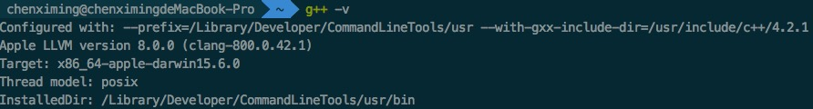 </div>

代码如下：

```c++
#include <iostream>

using namespace std;

class Base{
public:
    virtual void f() {cout << "Base::f()" << endl;}
    virtual void g() {cout << "Base::g()" << endl;}
    virtual void h() {cout << "Base::h()" << endl;}
};

class Derived : public Base{
public:
    void print() {cout << "Derived::print" << endl;}
};

int main()
{
    typedef void (*func)();

    Derived d;

    func pFunc1 = (func)(*(long *)*(long *)(&d));
    func pFunc2 = (func)(*((long *)*(long *)(&d) + 1));
    func pFunc3 = (func)(*((long *)*(long *)(&d) + 2));

    pFunc1();   //Base::f()
    pFunc2();   //Base::g()
    pFunc3();   //Base::h()

    return 0;
}
```

查看**对象的内存布局**：

* 可以使用`p 对象`直接打印对象：
<div align="center"> 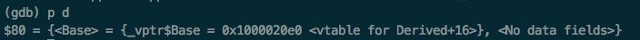 </div>

* 可以通过打印对象地址查看虚函数表：
<div align="center"> 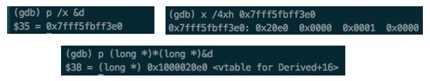 </div>

查看**虚函数表**：

* 通过虚函数表的地址打印出每个虚函数的地址
<div align="center"> 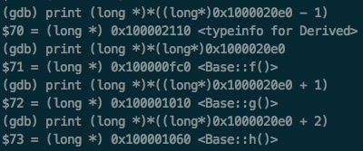 </div>

* 使用`info line 行号`打印出虚函数的地址，使用`x`命令核对虚函数表中虚函数指针的布局：
<div align="center">  </div>

画图表示如下（typeinfo在虚函数表上方）：

<div align="center"> 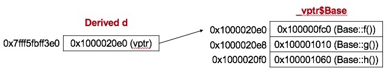 </div>