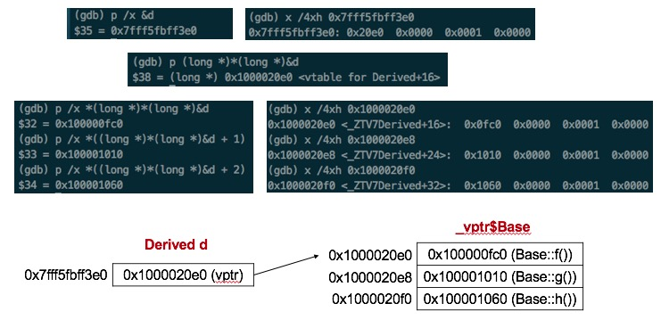

> 记录gdb调试打印一个类对象的内存分布的方法，方便回顾

<div align="center">  </div>

<br>

代码如下：

```c++
#include <iostream>

using namespace std;

class Base{
public:
    virtual void f() {cout << "Base::f" << endl;}
    virtual void g() {cout << "Base::g" << endl;}
    virtual void h() {cout << "Base::h" << endl;}
};

class Derived : public Base{
public:
    void print() {cout << "Derived::print" << endl;}
};

int main()
{
    cout << sizeof(Derived) << endl;
    Derived d;//断点设在这
    cout << sizeof(d) << endl;

    return 0;
}
```

[gdb的使用](https://github.com/arkingc/note/blob/master/Linux/Linux%E5%B8%B8%E7%94%A8%E5%91%BD%E4%BB%A4.md#3%E8%B0%83%E8%AF%95%E5%B7%A5%E5%85%B7gdb)

对象的内存模型，虚函数表，已经虚函数指针信息：

<div align="center">  </div>