* [一.让自己习惯C++](#一让自己习惯c)
    - [条款02：尽量以const,enum,inline替换\#define](#条款02尽量以constenuminline替换define)
    - [条款03：尽可能使用const](#条款03尽可能使用const)
* [二.构造/析构/赋值运算](#二构造析构赋值运算)
    - [条款04：确定对象被使用前已先被初始化](#条款04确定对象被使用前已先被初始化)
    - [条款05：了解C++默默编写并调用哪些函数](#条款05了解c默默编写并调用哪些函数)
    - [条款06：若不想使用编译器自动生成的函数，就该明确拒绝](#条款06若不想使用编译器自动生成的函数就该明确拒绝)
    - [条款07：为多态基类声明virtual析构函数](#条款07为多态基类声明virtual析构函数)
    - [条款08：别让异常逃离析构函数](#条款08别让异常逃离析构函数)
    - [条款09：绝不在构造和析构过程中调用virtual函数](#条款09绝不在构造和析构过程中调用virtual函数)
    - [条款10：令operator=返回一个reference to \*this](#条款10令operator返回一个reference-to-this)
    - [条款11：在operater=中处理“自我赋值”](#条款11在operater中处理自我赋值)
    - [条款12：复制对象时勿忘其每一个成分](#条款12复制对象时勿忘其每一个成分)
* [三.资源管理](#三资源管理)
    - [条款13：以对象管理资源](#条款13以对象管理资源)
    - [条款14：在资源管理类中小心copying行为](#条款14在资源管理类中小心copying行为)
    - [条款15：在资源管理类中提供对原始资源的访问](#条款15在资源管理类中提供对原始资源的访问)
    - [条款16：成对使用new和delete时要采取相同形式](#条款16成对使用new和delete时要采取相同形式)
    - [条款17：以独立语句将newed对象置入智能指针](#条款17以独立语句将newed对象置入智能指针)
* [四.设计与声明](#四设计与声明)
    - [条款18：让接口容易被正确使用，不易被误用](#条款18让接口容易被正确使用不易被误用)
    - [条款19：设计class犹如设计type](#条款19设计class犹如设计type)
    - [条款20：宁以pass-by-reference-to-const替换pass-by-value](#条款20宁以pass-by-reference-to-const替换pass-by-value)
    - [条款21：必须返回对象时，别妄想返回其reference](#条款21必须返回对象时别妄想返回其reference)
    - [条款22：将成员变量声明为private](#条款22将成员变量声明为private)
    - [条款23：宁以non-member、non-friend替换member函数](#条款23宁以non-membernon-friend替换member函数)
    - [条款24：若所有参数皆需类型转换，请为此采用non-member函数](#条款24若所有参数皆需类型转换请为此采用non-member函数)
    - [条款25：考虑写出一个不抛出异常的swap函数](#条款25考虑写出一个不抛出异常的swap函数)
* [五.实现](#五实现)
    - [条款26：尽可能延后变量定义式的出现时间](#条款26尽可能延后变量定义式的出现时间)
    - [条款27：尽量少做转型动作](#条款27尽量少做转型动作)
    - [条款28：避免返回handles指向对象内部成分](#条款28避免返回handles指向对象内部成分)
    - [条款29：为“异常安全”而努力是值得的](#条款29为异常安全而努力是值得的)
    - [条款30：透彻了解inlining的里里外外](#条款30透彻了解inlining的里里外外)
    - [条款31：将文件间的编译依存关系将至最低](#条款31将文件间的编译依存关系将至最低)
* [六.继承与面向对象设计](#六继承与面向对象设计)
    - [条款32：确定你的public继承塑模出is-a关系](#条款32确定你的public继承塑模出is-a关系)
    - [条款33：避免遮掩继承而来的名称](#条款33避免遮掩继承而来的名称)
    - [条款34：区分接口继承和实现继承](#条款34区分接口继承和实现继承)
    - [条款35：考虑virtual函数以外的其他选择](#条款35考虑virtual函数以外的其他选择)
    - [条款36：绝不重新定义继承而来的non-virtual函数](#条款36绝不重新定义继承而来的non-virtual函数)
    - [条款37：绝不重新定义继承而来的缺省参数值](#条款37绝不重新定义继承而来的缺省参数值)
    - [条款38：通过复合塑模出has-a或“根据某物实现出”](#条款38通过复合塑模出has-a或根据某物实现出)
    - [条款39：明智而审慎地使用private继承](#条款39明智而审慎地使用private继承)
    - [条款40：明智而审慎地使用多重继承](#条款40明智而审慎地使用多重继承)
* [七.模板与泛型编程](#七模板与泛型编程)
    - [条款41：了解隐式接口和编译器多态](#条款41了解隐式接口和编译器多态)
    - [条款42：了解typename的双重意义](#条款42了解typename的双重意义)
    - [条款43：学习处理模板化基类内的名称](#条款43学习处理模板化基类内的名称)
    - [条款44：将与参数无关的代码抽离templates](#条款44将与参数无关的代码抽离templates)
    - [条款45：运用成员函数模板接受所有兼容类型](#条款45运用成员函数模板接受所有兼容类型)
    - [条款46：需要类型转换时请为模板定义非成员函数](#条款46需要类型转换时请为模板定义非成员函数)
    - [条款47：请使用traits classes表现类型信息](#条款47请使用traits-classes表现类型信息)
    - [条款48：认识template元编程](#条款48认识template元编程)
* [八.定制new和delete](#八定制new和delete)
    - [条款49：了解new-handler的行为](#条款49了解new-handler的行为)
    - [条款50：了解new和delete的合理替换时机](#条款50了解new和delete的合理替换时机)
    - [条款51：编写new和delete时需固守常规](#条款51编写new和delete时需固守常规)
    - [条款52：写了placement new也要写placement delete](#条款52写了placement-new也要写placement-delete)

<br>
<br>
<br>

# 一.让自己习惯C++

## 条款02：尽量以const,enum,inline替换\#define

**这个条款或许改为“宁可以编译器替换预处理器”比较好**

### 1）以const替换\#define

```c++
#define ASPECT_RATIO 1.653
替换为：
const double AspectRatio = 1.653
```

* **调试的需要**：#define的记号会被预处理器移走，记号名称可能没进入记号表内。因此当#define的宏名称获得一个编译错误时，会引起困惑，浪费大量时间追踪错误。而AspectRatio肯定会被编译器看到
* **更小的代码量**：对浮点数而言，使用常量可能比使用#define导致较小量的代码，因为预处理器“盲目地将ASPECT_RATIO替换为1.653”可能导致目标码出现多份1.653

但是，以常量替换#define时要注意：

* **定义常量指针时：由于常量定义式通常被定义在头文件内，因此有必要将指针声明为const**。如：
    ```c++
    const char* const authorName = "Scott Meyers";
    ```
* **class专属常量**：class专属常量需要声明在class内部，并且被class使用：
    ```c++
    class GamePlayer{
        static const int NumTurns = 5; //常量声明式
        int scores[NumTurns];          //使用该常量
    };
    //通常定义出现在头文件中
    const int GamePlayer::NumTurns;    //NumTurns的定义
    ```
    对于static修饰的class专属整形常量，如果需要对该常量取地址或编译器坚持要看到一个定义式。那么必须提供类外定义。如果类内声明时提供了初始值，类外定义就不能再设初值。但是某些编译器可能不支持类内初始值，因此需要在类外定义时提供初始值，但是这样就不能像scores成员一样，在类内使用该常量。因此，如果需要使用class专属常量，最好改用“**enum hack**”

### 2）以enum替换\#define

正如上面所提到的，编译器可能不支持类内初始值，因此改用"**enum hack**"：

```c++
class GamePlayer{
    enum {NumTurns = 5};
    int scores[NumTurns];   //这就没问题了
};
```

**enum hack**的行为比较像#define而不像const。例如取一个const的地址时合法的，但取一个enum的地址就不合法，而取一个#define的地址通常也不合法

### 3）以inline替换\#define

以#define实现宏看起来像函数，并且不会导致函数调用带来的开销，但是可能引发错误：

```c++
#define CALL_WITH_MAX(a,b) f((a) > (b) ?  (a) : (b))

int a = 5,b = 0;
CALL_WITH_MAX(++a,b);       //a被累加2次
CALL_WITH_MAX(++a,b + 10);  //a被累加1次
```

使用inline函数可以减轻为参数加上括号以及参数被核算多次等问题。同时，inline可以实现一个“类内的private inline函数”，但一般而言宏无法完成此事

<br>

## 条款03：尽可能使用const

### 1）const修饰变量

如果变量本身不应该被修改，应该使用const修饰。这样编译器可以进行保护，确保这个变量不会被修改

```c++
char greeting[] = "Hello";
char *p = greeting;                    // non-const pointer, non-const data
const char *p = greeting;              // non-const pointer, const data
char * const p = greeting;             // const pointer, non-const data
const char * const p = greeting;       // const pointer, const data 
```

* 如果关键字const出现在星号左边，表示被指物是常量
* 如果出现在星号右边，表示指针自身是常量

### 2）const修饰函数

* 修饰参数时，和修饰一般变量相同
* **修饰返回值，可以降低因客户错误而造成的意外**

```c++
Rational a, b, c;
...
if (a * b = c){ //其实是想做一个比较动作，使用const修饰返回值可以避免这种错误
    ...
}
```

如果a和b都是内置类型。这样的代码直截了当就是不合法。而一个“良好的用户自定义类型”的特征是他们避免与内置类型不兼容。因此对operator\*的定义应该如下：

```c++
const Rational operator*(const Rational& lhs, const Rational& rhs);
```

### 3）const修饰成员函数

const修饰成员函数有2个好处：

1. **可读性**：使得接口容易被理解，可以知道哪个函数可以改动对象哪个函数不行
2. **const修饰的成员函数可以作用于const对象**

但是，使用const修饰成员函数时需要注意，C++对常量性的定义是bitwise constness，即函数const成员函数不应该修改对象的任何成员变量。因此，如果成员变量是一个指针，那么不修改指针而修改指针所指之物，也符合bitwise constness，因此如果不是从bitwise constness的角度，这样也是修改了对象：

```c++
class CTextBlock {
public:
  char& operator[](std::size_t position) const   // bitwise constness声明
  { return pText[position]; }                    // 但其实不恰当
private:
   char* pText;
};

const CTextBlock cctb("Hello"); //声明一个常量对象
char *pc = &cctb[0];            //调用const operator[]取得一个指针，
                                //指向cctb的数据
*pc = 'J';                      //cctb现在有了“Jello”这样的内容
```

还有一种logical constness：一个const成员函数可以修改它所处理的对象内的某些bits，但只有在客户端侦测不出的情况下才行：

```c++
class CTextBlock {
public:
  std::size_t length() const;

private:
  char *pText;
  std::size_t textLength;         // 最近一次计算的文本区块长度
  bool lengthIsValid;             // 目前的长度是否有效
};                                     

std::size_t CTextBlock::length() const{
  if (!lengthIsValid) {                 
    textLength = std::strlen(pText);    //错误！在const成员函数内不能复制给
    lengthIsValid = true;               //textLength和lengthIsValid
  }
  return textLength;
}
```

但是，C++对常量性的定义是bitwise constness的，所以这样的操作非法。解决办法是使用mutable:

```c++
class CTextBlock {
public:
  std::size_t length() const;

private:
  char *pText;
  mutable std::size_t textLength;         // 这些成员变量可能总是会被更改
  mutable bool lengthIsValid;             // 即使在const成员函数内
};                                     

std::size_t CTextBlock::length() const{
  if (!lengthIsValid) {                 
    textLength = std::strlen(pText);    //现在可以这样
    lengthIsValid = true;               //也可以这样
  }
  return textLength;
}
```

总的来说，上面提到了2种“修改”const成员函数中修改对象（修改const对象）的方法

最后，const和non-const版本的函数可能含有重复的代码，如果抽离出来单独成为一个成员函数还是有重复。如果希望去重，可以使用“运用const成员函数实现出其non-const孪生兄弟”的技术：

```c++
class CTextBlock {
public:
    const char& operator[](size_t pos) const{
        ...
    }

    char& operator[](size_t pos){
        return const_cast<char&>(
            static_cast<const TextBlock&>(*this)
                [pos]   
        );
    }
};
```

<br>

## 条款04：确定对象被使用前已先被初始化

**读取未初始化对象的后果**：读取未被初始化的值会导致不明确的行为。在某些平台上，仅仅只是读取未初始化的值就可能让程序终止，更可能的情况是读入一些“半随机”bits，污染了正在进行读取动作的那个对象，最终导致不可预知的程序行为，以及许多令人不愉快的调试过程

按对象的类型划分：

* **对于内置类型的对象**：永远在使用前初始化
* **类类型的对象**：初始化责任落在构造函数身上
    - **效率上的问题**：
        + 类类型成员的初始化动作发生在构造函数本体之前。比起先调用default构造函数然后再调用copy assignment操作符，单只调用一次copy构造函数比较高效。因此，善用初始化列表有助于提升效率
        + 内置类型成员的初始化不一定发生在赋值动作的的时间点之前
    。对于内置类型成员，一般为了保持一致也在初始化列表中给出初始值
    - **初始化顺序**：成员的初始化顺序与类内声明顺序相同

 按对象的作用域与生命周期划分

* **static对象**
    - **non-local static对象**：C++对“定义于不同的编译单元内的non-local static对象”的初始化相对次序并无明确定义
        + global对象
        + 定义于namespace作用域内的对象
        + classes内、file作用域内被声明为static的对象
    - **local static对象**：函数内的local static对象会在“该函数被调用期间、首次遇上该对象的定义式”时被初始化
        + 函数内被声明为static的对象

因此，如果一个non-local static对象的初始化依赖于另外一个non-local static的初始化，那么可能造成错误。解决方法是使用local static对象替换non-local static对象（参考单例模式）

<br>
<br>

# 二.构造/析构/赋值运算

## 条款05：了解C++默默编写并调用哪些函数

一般情况下，编译器会为类合成下列函数：

* **default构造函数**
* **copy构造函数**：编译器生成的版本只是单纯地将来源对象的每一个non-static成员变量拷贝到目标对象
* **copy assignment操作符**：编译器生成的版本只是单纯地将来源对象的每一个non-static成员变量拷贝到目标对象
* **析构函数**：编译器生成的版本是**non-virtual**的

[更深层次的理解](C++对象模型.md#第2章-构造函数语意学)（对象模型第2章、第5章）

以下情况编译器不会合成**copy assignment操作符**：

* **含有引用成员**：原因在于这种情况下，赋值的目的不明确。是修改引用还是修改引用的对象？如果是修改引用，这是被禁止的。因此编译器干脆拒绝这样的赋值行为
* **含有const成员**：const对象不应该修改
* **父类的copy assignment操作符被声明为private**：无法处理基类子对象，因此也就无法合成

<br>

## 条款06：若不想使用编译器自动生成的函数，就该明确拒绝

**为什么要拒绝**？比如，房产应该是独一无二的，这种情况下应该拒绝对象拷贝动作

一般情况下，不声明相应函数即可拒绝。但是编译器会为类合成一些函数，因此需要显式拒绝

还是以拒绝对象拷贝为例子，拒绝方法包括：

1. **将copy构造函数或copy assignment操作符声明为private，并且不定义**（这被用于C++ iostream程序库中）
    + 这种情况下member函数和friend函数还是可以调用，如果member函数或friend函数中执行了复制，会引发**链接错误**。可以使用一个基类，在基类中将copy构造函数或copy assignment操作符声明为private，并且继承这个基类。这样可以将**链接错误**移至**编译期**，因为尝试拷贝时，编译器会试着生成一个copy构造函数和一个copy assignment操作符，这些函数的“编译器合成版”会尝试调用其基类的对应兄弟，而那些调用会被编译器拒绝，因为private
2. **使用delete**（这个在书中没有提到）

<br>

## 条款07：为多态基类声明virtual析构函数

* **为基类声明virtual析构函数**：当派生类对象经由一个基类指针被删除，而该基类带有一个non-virtual析构函数，结果未定义——实际执行时通常发生的是对象的derived成分没有销毁，即“局部销毁”，造成资源泄露（因为存在这个问题，所以不要继承一个不被用作基类的类）
* **class不用作基类时，不要将析构函数声明为virtual**：virtual会引入虚函数指针，这会增加空间开销，使得类无法被C函数使用，从而不再具有移植性

<br>

## 条款08：别让异常逃离析构函数

**C++并不禁止析构函数吐出异常，但是并不鼓励这样做**

### 1）原因

如果析构函数吐出异常，程序可能过早结束（比如某个函数调用发生异常，在回溯寻找catch过程中，每离开一个函数，这个函数内的局部对象会被析构，如果此时析构函数又抛出异常，前一个异常还没得到处理又来一个，因此一般会引起程序过早结束）。异常从析构函数中传播出去，可能会导致不明确的行为

[知乎相关描述](https://www.zhihu.com/question/28592504)

### 2）如何解决

1. **在析构函数中catch异常**，然后调用**abort终止**程序。通过abort抢先置“不明确行为”于死地
2. **在析构函数中catch异常**，然后记录该失败，即**吞掉异常**（通常是个坏主意，因为这样压制了“某些动作失败”的重要信息。但是也比负担“草率结束程序”或”不明确行为带来的风险“好）
3. 重新设计接口，让客户能够在析构前主动调用可能引起异常的函数，然后析构函数中使用一个bool变量，根据用户是否主动调用来决定析构函数中是否应该调用可能引起异常的函数，**让客户拥有主动权**（如果客户没有主动调用，那么当发生异常时也不应该抱怨，因为已经给出了客户自己处理异常的机会）

<br>

## 条款09：绝不在构造和析构过程中调用virtual函数

如果希望在继承体系中根据类型在构建对象时表现出不同行为，可以会想到在基类的构造函数中调用一个虚函数：

```c++
class Transaction {                           //所有交易的基类
public:                                           
    Transaction(){           
        ...                           
        logTransaction();                         
    }
    virtual void logTransaction() const = 0;  //做出一份因类型不同而不同的日志记录
};

class BuyTransaction: public Transaction {        //派生类
public:
    virtual void logTransaction() const;          
};

class SellTransaction: public Transaction {      //派生类
public:
    virtual void logTransaction() const;          
};

```

但是最终调用的virtual函数都是基类的版本。同时，因为是纯虚函数，除非定义该函数，否则将报链接错误

**在子类构造期间，virtual函数绝不会下降到派生类阶层。取而代之的是，对象的作为就像隶属基类类型一样。即派生类对象的基类构造期间，对象的类型是基类而不是派生类；除此之外，若使用运行期类型信息**（如dynamic_cast和typeid），也会把对象视为基类类型（这样对待是合理的：因为子类部分尚未初始化，如果调用的是子类的虚函数，通常会访问子类部分的数据，会引发安全问题）

**同样的道理也适用于析构函数。一旦派生类析构函数开始执行，对象内的派生类成员变量便呈现未定义值，所以C++视它们仿佛不再存在。进入基类析构函数后对象就成为一个基类对象**

如果希望实现最初的功能，即根据类型产生不同日志记录，那么可以在派生类的成员初始化列表中，向基类传递一些类型相关的信息，基类构造函数根据这些信息生成不同的日志记录，此时日志记录的生成函数不再是virtual函数

<br>

## 条款10：令operator=返回一个reference to \*this

这是为了实现“连锁赋值”。这个协议除了适用于operator=，还适用于+=、-=、\*=

> 这只是个协议，并无强制性，如果不遵循，代码一样可通过编译

<br>

## 条款11：在operater=中处理“自我赋值”

考虑如下Widget类：

```c++
class Bitmap {...};
class Widget{
    ...
private:
    Bitmap *pb;
};
```

下面的operator=实现是一份不安全的实现，在自赋值时会出现问题：

```c++
Widget& 
Widget::operator=(const Widget& rhs){
    delete pb;                   // stop using current bitmap
    pb = new Bitmap(*rhs.pb);    // start using a copy of rhs's bitmap
    return *this;                // see Item 10
}
```

要处理自赋值，可以有以下几种方式：

1. **在开头添加“证同测试”**
    ```c++
    Widget& Widget::operator=(const Widget& rhs){
        if (this == &rhs) return *this;
        delete pb;                   // stop using current bitmap
        pb = new Bitmap(*rhs.pb);    // start using a copy of rhs's bitmap
        return *this;                // see Item 10
    }
    ```
    这样做虽然能处理自赋值，但不是异常安全的，如果new时发生异常，对象的pb将指向一块被删除的内存
2. **通过确保异常安全来获得自赋值的回报**
    ```c++
    Widget& Widget::operator=(const Widget& rhs){
        Bitmap *pOrig = pb;               // remember original pb
        pb = new Bitmap(*rhs.pb);         // make pb point to a copy of *pb
        delete pOrig;                     // delete the original pb
        return *this;
    }
    ```
    现在，如果new失败，pb会保持原状。同时也能处理自赋值。如果担心效率可以在开头加上“证同测试”。但是if判断也会引入开销，因此需要权衡自赋值发生的频率
3. **使用copy and swap技术**
    ```c++
    //参数为pass by reference
    Widget& Widget::operator=(const Widget &rhs){
        Widget temp(rhs);
        swap(temp);               // swap *this's data with
        return *this;             // the copy's
    }
    //参数为pass by value
    //这种方式的缺点是代码不够清晰，但是将“copying动作“从函数本体内移至”函数参数构造阶段”
    //却可令编译器有时生成更高效的代码
    Widget& Widget::operator=(Widget rhs){
        swap(rhs);                // swap *this's data with
        return *this;             // the copy's
    }
    ```

<br>

## 条款12：复制对象时勿忘其每一个成分

如果声明自己的copying函数，意思就是告诉编译器你并不喜欢缺省实现中的某些行为。编译器仿佛被冒犯似的，会以一种奇怪的方式回敬：如果你自己写出的copying函数代码不完全，它也不会告诉你

* **copy构造函数**
    - **非继承中**：当为类添加一个新成员时，copy构造函数也需要为新成员添加拷贝代码。否则会调用新成员的默认构造函数初始化新成员
    - **继承中**：在派生类的copy构造函数中，不要忘记调用基类的copy构造函数拷贝基类部分。否则会调用基类的默认构造函数初始化基类部分
* **copy赋值运算符**
    - **非继承中**：当为类添加一个新成员时，copy赋值运算符中也需要为新成员添加赋值代码，否则新成员会保持不变
    - **继承中**：在派生类的copy赋值运算符中，不要忘记调用基类的copy赋值运算符，否则基类部分会保持不变

<br>
<br>

# 三.资源管理

## 条款13：以对象管理资源

当申请一块动态内存时，可能会发生泄漏：

* **忘记delete**
* **有delete，但是delete之前跳出控制流**：在代码的维护过程中，动态分配内存和delete之间可能会加入return之类的控制流变更语句，或者是可能引发异常的代码，这样可能会使程序执行不到delete从而造成资源泄露

**总结起来就是，手工delete一个是需要时刻记住delete，增加编码负担，另一个是即使明确delete，在delete之前控制流可能发生改变从而还是会造成资源泄露**

因此，**一个好的办法是使用对象管理资源，包括下列两个关键想法**：

* **获得资源后立刻放进管理对象**：”以对象管理资源“的观念常被称为”资源取得时机便是初始化时机“(**RAII**)
* **管理对象运用析构函数确保资源被释放**

一个对象管理资源的例子是auto_ptr:

```c++
void f()
{
    std::auto_ptr<Investment> pIntv(createInvestment());    
    ...     
}           //经由auto_ptr的析构函数自动删除pInv
```

对于**对象管理资源，需要注意对象的复制行为**：例如，复制逻辑可能是多个对象管理相同的资源，那么析构时就会重复delete。因此，如果是这种复制逻辑，那么应该引入引用计数，析构时根据引用计数决定是否delete。否则，一个资源就应该只由一个对象来管理，那么复制时就原来对象管理的资源就应该修改成null，而复制所得的新对象将取得资源的唯一拥有权（如auto_ptr）

> C++没有特别针对”动态分配数组“而设计的类似auto_ptr或tr1::shared_ptr那样的东西，甚至TR1中也没有。那是因为vector和string几乎总是可以取代动态分配而得的数组。因此当需要动态分配数组时，提倡使用vector（[可以使用unique_ptr管理动态数组](C++Primer.md#23-unique_ptr)）

<br>

## 条款14：在资源管理类中小心copying行为

并非所有资源都是动态内存，除此之外还有锁等资源，也应该通过”对象管理资源“来确保获取资源后能够正确的释放，**根据资源的类型，和不同的需求，可能需要定义不同的copy行为**：

1. **禁止复制**：比方说锁资源，管理锁资源的对象复制通常并不合理。因此应该禁止这类对象的复制，可以通过继承一个copying操作被声明为private的基类来禁止复制，这点在条款06中有提到
2. **对底层资源使用”引用计数法“**：如果希望保有资源，直到它的最后一个使用者（某对象）被销毁。这种情况下复制RAII对象时，应该将资源的”被引用数“递增。tr1::shared_ptr便是如此（当资源引用计数减为0时，如果不希望删除资源，比方说锁资源，可以使用shared_ptr的“删除器”）
3. **复制底部资源**：这种情况下，希望在复制RAII对象时，同时复制其关联的底层资源。展现出一种“深拷贝”的行为
4. **转移底部资源的拥有**：如果希望任一时刻一个资源只由一个RAII对象管理，那么在复制RAII对象时，应该实现拥有权的“转移”，原RAII对象拥有的资源设为null（如auto_ptr）

<br>

## 条款15：在资源管理类中提供对原始资源的访问

**API往往要求访问原始资源（即被RAII对象管理的资源，而不是直接访问RAII对象），所以每一个RAII类应该提供一个“取得其所管理的资源”的办法**

取得RAII对象所管理资源的办法可以通过显式转换或隐式转换：

* **显式转换(比较安全，但不易用)**：如shared_ptr的get()方法
* **隐式转换(比较易用，但不安全)**：如shared_ptr的operator\*和operator->

如果通过实现隐式转换（比如，实现operator()）来提供对元素资源的访问，可能不安全：

```c++
//以下，Font是一个RAII对象，FontHandle是一个原始资源

Font f1(getFont());  
...
FontHandle f2 = f1; //原意是想使用Font，复制一个RAII对象
```

在上面的例子中，如果实现了隐式转换，底层资源会被复制，如果f1销毁，f2会成为“虚吊的”（dangle）

是否该提供一个显式转换函数将RAII转换为其底层资源，或是应该提供隐式转换，答案主要取决于RAII被设计执行的特定工作，以及它被使用的情况

<br>

## 条款16：成对使用new和delete时要采取相同形式

当使用new和delete时，发生2件事

* new
    - 内存被分配出来（通过名为operator new的函数）
    - 针对此内存会有一个（或更多）构造函数被调用
* delete
    - 针对此内存会有一个（或更多）析构函数被调用
    - 内存被释放（通过名为operator delete的函数）

单一对象的内存布局一般而言不同于数组的内存布局。更明确地说，数组所用的内存通常还包括“数组大小”的记录，以便delete知道需要调用多少次析构函数，布局可能像下面这个样子：

<div align="center"> 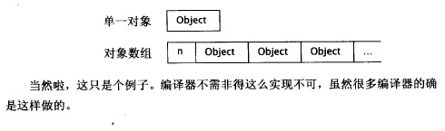 </div>

**当使用delete时，唯一能够让delete知道内存中是否存在一个“数组大小记录”的办法是，由你来告诉它。即加上\[\]，delete便认为指针指向一个数组，否则它便认为指针指向单一对象**

因此，应该像这样使用new和delete

```c++
std::string* stringPtr1 = new std::string;
std::string* stringPtr2 = new std::string[100];
...
delete stringPtr1;
delete [] stringPtr2;
```

* 如果对stringPtr1使用“delete \[\]”形式，结果未定义，但不太可能让人愉快。假设内存布局上，delete会读取若干内存并将它解释为“数组大小”，然后开始多次调用析构函数，浑然不知它所处理的那块内存不但不是个数组，也或许并未持有它正忙着销毁的那种类型的对象
* 如果没有对stringPtr2使用“delete \[\]”形式，结果亦未定义，但可以猜想可能导致太少的析构函数被调用。犹有进者，这对内置类型如int者亦未定义，即使这类类型并没有析构函数

因此，**如果调用new时使用了\[\]，必须在对应调用delete时也使用\[\]；如果调用new时没使用\[\]，那么也不该在对应调用delete时使用\[\]**

这点在typedef中尤其需要注意：

```c++
typedef std::string AddressLines[4];        //每个人的地址有4行，每行是一个string

std::string *pa1 = new AddressLines;        //就像new string[4]一样

delete pa1;             //错误！行为未定义
delete [] pa1;          //很好
```

为避免这类错误，最好尽量不要对数组形式做typedef动作

<br>

## 条款17：以独立语句将newed对象置入智能指针

考虑如下情况：

```c++
func1(std::tr1::shared_ptr<原始资源类>(new 原始资源类),func2());
```

在调用func1之前，编译器必须创建代码，做以下3件事

* 执行func2
* 执行"new 原始资源类"创建一个原始资源
* 调用tr1::shared_ptr构造函数

但是执行顺序弹性很大。如果执行顺序如下；

1. 执行"new 原始资源类"创建一个原始资源
2. 执行func2
3. 调用tr1::shared_ptr构造函数

现在，如果2发生异常，那么因为1创建的资源未被置入tr1::shared_ptr内，因此会发生内存泄露。也就是说，在“资源被创建”和“资源被转换为资源管理对象”两个时间点之间有可能发生异常干扰。因此，应该使用独立语句

```c++
std::tr1::shared_ptr<原始资源类>(new 原始资源类) p;

func1(p,func2());
```

<br>
<br>

# 四.设计与声明

## 条款18：让接口容易被正确使用，不易被误用

1. **通过引入新类型来防止误用**
    ```c++
    class Date{
    public:
        Date(int month,int day,int year);
        ...
    }
    ```
    上面日期类的构造函数中，年月日都是int，那么很容易传入顺序错误的参数。因此，可以因为3个表示年月日的新类：Year、Month、Day。从而防止这种问题。更进一步，为了使得传入的数据有效，比如月份，可以设计生成12个月份对象的static成员函数，并将构造函数声明为explicit强制要求通过调用static成员函数得到月份对象。使用enums没有那么安全，enums可被拿来当作一个ints使用
2. **除非有好的理由，否则应该尽量让你的type的行为与内置类型一致**：如```if(a * b = c)```对内置类型来说不合法，那么你的type在实现operator\*时就应该返回一个const对象
3. **提供一致的接口**：如C++ STL容器都提供size()返回容器大小，但是Java和.Net对于不同容器大小接口可能不同，这会增加使用负担
4. **返回“资源管理对象”而不是原始资源**：如用shared_ptr管理资源时，客户可能会忘记使用智能指针，从而开启了忘记释放和重复释放的大门。通过修改接口的返回类型为智能指针，从而确保元素资源处于“资源管理对象”的掌控之中

<br>

## 条款19：设计class犹如设计type

在设计class时，下列问题将导致class你的设计规范：

* 新type的对象应该如何被创建和销毁？
* 对象的初始化和对象的赋值该有什么样的差别？
* 新type的对象如果被passed by value，意味着什么？
* 什么是新type的“合法值”？
* 你的新type需要配合某个继承体系吗？
* 你的新type需要什么样的转换？
* 什么样的操作符和函数对此新type而言是合理的？
* 什么样的标准函数应该驳回？
* 谁该取用新type的成员？
* 什么是新type的“未声明接口”？
* 你的新type有多么一般化？
* 你真的需要一个新type吗？

<br>

## 条款20：宁以pass-by-reference-to-const替换pass-by-value

pass-by-reference-to-const有下列好处：

* **更高的效率**：如果一个类处于继承体系的底部，并且包含大量成员，pass-by-value会导致大量的构造函数被调用，在函数调用完成后，又有大量的析构函数被调用
* **防止继承中的对象切割**：如果是pass-by-value，并且传入一个子类对象时，传入的子类对象会被切割，只保有基类对象的部分，从而无法表现多态

references往往以指针实现出来，因此pass by reference通常意味真正传递的是指针。因此，对于**内置类型**，pass by value往往比pass by reference的效率更高。pass by value同样适用于**STL的迭代器**和**函数对象**

并不是所有小型对象都是pass-by-value的合格候选者：

* 对象小并不意味着copy构造函数不昂贵。许多对象——包括大多数STL容器——内含的东西比一个指针多一些，但是复制这种对象却需承担“复制那些指针所指的每一样东西”。那将非常昂贵
* 即使copy构造函数不昂贵，还是可能有效率上的争议。某些编译器对待“内置类型”和“用户自定义类型”的态度截然不同，纵使两者拥有相同的底层表述，“用户自定义类型”也不会被编译器放入缓存器，因此pass by reference更适合

> 可以合理假设“pass-by-value并不昂贵”的唯一对象就是内置类型和STL的迭代器和函数对象。其它任何时候，宁以pass-by-reference-to-const替换pass-by-value

<br>

## 条款21：必须返回对象时，别妄想返回其reference

必须返回对象的最常见例子是运算符函数：

```c++
const Rational operator*(const Rational &lhs,const Rational &rhs);
```

在必须返回对象时，不要企图返回reference，可以通过反面来说，也就是如果返回reference会是什么情况？

* **使用stack构造一个局部对象，返回局部对象的reference**
    ```c++
    const Rational& operator*(const Rational &lhs,const Rational &rhs)
    {
        Rational result(lhs.n * rhs.n,lhs.d * rhs.d);
        return result;
    }
    ```
    注意！使用reference的本意是避免构造新对象，但是一个新的对象result还是经由构造函数构造。更严重的是，这个局部对象在函数调用完成后就被销毁了，reference将指向一个被销毁的对象
* **使用heap构造一个局部对象，返回这个对象的reference**
    ```c++
    const Rational& operator*(const Rational &lhs,const Rational &rhs)
    {
        Rational *result = new Rational(lhs.n * rhs.n,lhs.d * rhs.d);
        return *result;
    }
    Rational w,x,y,z;
    w = x * y *z;
    ```
    这样虽然reference不再引用一个被销毁的对象，但是因为了动态内存分配的开销，而且谁该为delete负责也成为问题。同时，在上面的连乘例子中，会多次动态分配内存，但是只返回最后一次的指针，因此会造成资源泄露
* **构造一个static局部对象，每次计算结果保存在这个对象中，返回其reference**
    ```c++
    const Rational& operator*(const Rational &lhs,const Rational &rhs)
    {
        static Rational result
        result = ...;
        return result;
    }
    Rational w,x,y,z;
    if((w * x) == (y * z)){...}
    ```
    首先，显而易见的问题是这个函数在多线程情况下是不安全的，多个线程会修改相同的static对象；除此之外，在上面的if判断中，不管传入的w,x,y,z是什么，由于operator\*传回的reference都指向同一个static对象，因此上面的判断永远都会为true

<br>

## 条款22：将成员变量声明为private

### 1）为什么不能是public

3个原因：

1. **语法一致性**：如果成员变量和成员函数一样，都是public，那么调用时会困惑于该不该使用括号。如果想获取大小时使用size，但是这到底是一个成员变量还是一个成员函数？
2. **更精准的控制**：通过将成员变量声明为private，通过成员函数提供访问，可以实现更精准的访问控制
    ```c++
    class AccessLevels{
    public:
        ...
        int getReadOnly() const   {return readOnly;}
        void setReadWrite(int value)    {readWrite = value;}
        int getReadWrite() const    {return readWrite;}
        void setWriteOnly(int value)    {writeOnly = value;}
    private:
        int noAccess;   //对此int无访问动作
        int readOnly;   //对此int做只读访问
        int readWrite;  //对此int做读写访问
        int writeOnly;  //对此int做只写访问
    };
    ```
3. **封装(主要)**：private将成员变量封装，如果通过public暴露，在需要改成员变量的大量实现代码中，会直接使用当这个成员变量被修改或删除时，所有直接访问该成员变量的代码将会变得不可用

### 2）那么protected行不行

protected成员变量和public成员变量的论点十分相同。“语法一致性”和“细微划分的访问控制”等理由也适用于protected数据。同时，protected也并不具备良好的封装性

假设有一个public成员变量，而我们最终取消了它。所以使用它的客户代码都会被破坏。因此，public成员变量完全没有封装性。假设有一个protected变量，而我们最终取消了它，所有使用它的派生类都会被破坏。因此，protected成员变量也缺乏封装性

因此，从封装的角度看，只有private能提供封装性

<br>

## 条款23：宁以non-member、non-friend替换member函数

假设有个浏览器类，包含一些功能用来清除下载元素高速缓冲区、清除访问过的URLs的历史记录、以及移除系统中的所有cookies：

```c++
class WebBrowser{
public:
  ...
  void clearCache();
  void clearCookies();
  void clearHistory();
  ...
};
```

此时，如果想整个执行所有这些动作，那么有两种选择，一种实现成member函数，一种实现成non-member函数：

```c++
class WebBrowser{
public:
  //实现成成员函数，能访问private成员
  void clearEverything(){
    clearCache();
    clearCookies();
    clearHistory();
  }
}
//或者实现成非成员函数，不能访问private成员
void clearEverything(WebBrowser& wb){
  wb.clearCache();
  wb.clearCookies();
  wb.clearHistory();
}
```

问题是应该如何选择？这个问题主要在于**封装性**

如果某些东西被封装，它就不再可见。越多东西被封装，越少人可以看到它。越少人看到它，就有越大的弹性去变化它，因为我们的改变仅仅直接影响看到改变的那些人事物

因此，对于对象内的代码。越少代码可以看到数据（也就是访问它），越多的数据可被封装，我们也就越能自由地改变对象数据。作为一种粗糙的测量，越多函数可访问它，数据的封装性就越低

条款22所说，成员变量应该是private。能够访问private成员变量的函数只有class的member函数加上friend函数而已。**如果要在一个member函数和一个non-member，non-friend函数之间做选择，而且两者提供相同机能，那么，导致较大封装性的是non-member，non-friend函数**，也就是本条款这样选择的原因

一个扩展性的问题是——这些non-member，non-friend函数应该实现于何处?

一个像WebBrowser这样的class可能拥有大量便利函数，某些与书签有关，某些与打印有关，还有一些与cookie的管理有关...通常客户只对其中某些感兴趣。没道理一个只对书签相关便利函数感兴趣的客户却与一个cookie相关便利函数发生编译相依关系。分离它们的最直接做法就是将书签相关便利函数声明于一个头文件，将cookie相关便利函数声明于另一个头文件，再将打印相关...以此类推：

<div align="center"> 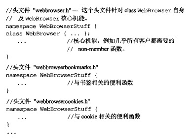 </div>

这正是C++标准库的组织方式。标准库并不是拥有单一、整体、庞大的<C++StandardLibrary>头文件并在其中内含std命名空间内的每一样东西，而是有数十个头文件（\<vector\>,\<algorithm\>,...），每个头文件声明std的某些机能。客户可以根据需要使用的机能选择性的包含头文件

<br>

## 条款24：若所有参数皆需类型转换，请为此采用non-member函数

为class支持隐式类型转换不是个好主意，但是在数值类型之间颇为合理。考虑有理数和内置整形之间的相乘运算。具有如下有理数：

```c++
class Rational{
public: 
    Rational(int n = 0, int d = 1); //构造函数刻意不为explicit，提供了Int-to-Rational的隐式转换
    int numerator() const;      //分子的访问函数
    int denominator() const;    //分母的访问函数
private:
...
};
```

现在，有理数提供了Int-to-Rational的隐式转换方式，那么operator\*应该实现成member，还是non-member？

```c++
class Rational{
public: 
    //实现为member
    const Rational operator*(const Rational& rhs) const;
}

//实现为non-member
const Rational operator*(const Rational& lhs, const Rational& rhs);
```

问题发生在混合运算上。如果实现成member，那么下面的混合运算只有一半行得通：

```c++
result = oneHalf * 2;                  // OK
result = 2 * oneHalf;                  // Error
```

因为内置类型int并没有相应的class，也就没有operator\*成员函数。所以后者会出错。但是当实现为non-member时，具有2个参数，都能通过int转换为Rational，所以上面2行代码都能运行。因此，若所有参数皆需类型转换，请为此采用non-member函数

<br>

## 条款25：考虑写出一个不抛出异常的swap函数

”以指针指向一个对象，内含真正数据“。这种设计的常见表现形式是所谓的”pimpl手法“。如下，WidgetImpl包含了Widget的真正数据，而Widget只包含一个WidgetImpl类型的指针，指向一个WidgetImpl对象。这种设计特点，决定了Widget的copying行为应该表现出一种”深拷贝“的行为：

<div align="center"> 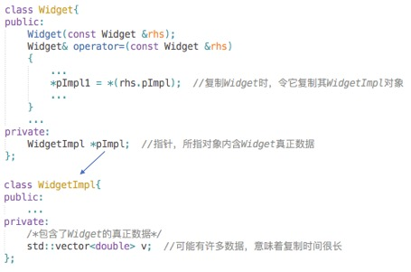 </div>

因此，如果使用标准库的swap交换2个Widget对象，会引起WidgetImpl对象的拷贝，由于其内含有Widget的大量数据，因此效率可能十分低。实际上这种情况下，交换2个指针就可以了。为此，我们可能实现出下图右边中间的swap特化版来提升效率，但是由于其内直接访问Widget的private成员，因此无法通过编译。所以我们采用下图右下角的方案，在Widget类内实现一个public的swap函数，然后特化版的swap调用这个public的swap函数：

<div align="center"> 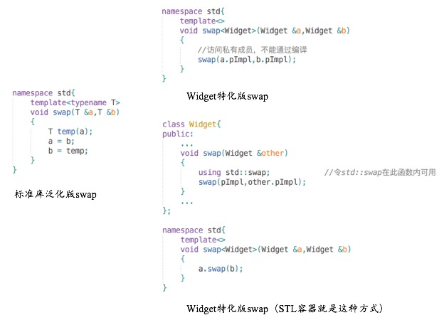 </div>

当问题更进一步发展时，即Widget和WidgetImpl为class template时，可能会将相同的思想迁移过来，实现出下图右边左上角的偏特化版本。但是问题是：**C++只允许偏特化class template，而不允许偏特化function template**。所以行不通，因此可以使用下图右下角的重载方式，但是**客户可以全特化std内的模板，但是不能添加新的模板到std内**，因此正确的做法是下图左下角

<div align="center"> 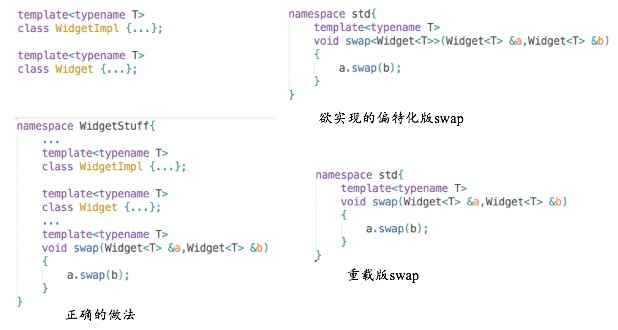 </div>

总结起来就是：

* 首先，如果swap的缺省实现对你的class或class template提供可接受的效率，那不需要做额外的事
* 否则，如果swap的缺省实现效率不足（那几乎总是意味着你的class或template使用了某种pimpl手法），试着做以下事情：
    - 提供一个public swap成员函数，让它高效地置换你的类型的两个对象的值（**这个public swap成员函数绝不应该抛出异常。这个约束不可施行于非成员版，因为swap缺省版是以copy构造函数和copy assignment操作符为基础，而一般情况下两者都允许抛出异常。因此当你写下一个自定义版本的swap，往往提供的不只是高效置换对象值的方法，而且不抛出异常。一般而言这两个swap特性是连在一起的，因为高效的swap几乎总是基于对内置类型的操作，而内置类型上的操作绝对不会抛出异常**）
    - 在你的class或template所在的命名空间内提供一个non-member swap，并令它调用上述swap成员函数
    - 如果你正编写一个class（而非class template），为你的class特化std::swap。并令它先调用你的swap成员函数
* 最后，如果你调用swap，请确定包含一个using声明，以便让std::swap在你的函数内曝光可见，然后不加任何namespace修饰符地调用swap

<br>
<br>

# 五.实现

## 条款26：尽可能延后变量定义式的出现时间

只要定义了一个变量而其类型带有一个构造函数或析构函数，那么

* 当程序的控制流到达这个变量定义式时，你便得承受构造成本
* 当这个变量离开作用域时，你便得承受析构成本

即使这个变量最终并未被使用，仍需耗费这些成本，所以你应尽可能避免这种情形，即延后变量的定义，直到非得使用该变量的前一刻为止，甚至应该尝试延后这份定义直到能够给它初值实参为止

当考虑循环时，有下列2种情况：

<div align="center"> 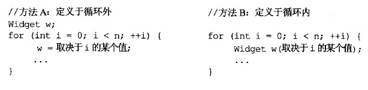 </div>

2种写法的成本如下；

* 做法A：1个构造函数 + 1个析构函数 + n个赋值操作
* 做法B：n个构造函数 + n个析构函数

**从效率上看**：如果class的一个赋值成本低于一组构成+析构成本，做法A大体而言比较高效，尤其当n比较大时。否则做法B或许更好

**从可理解性和维护性上看**：A造成名称w的作用域比做法B更大，可理解性和维护性相对较差

因此，除非

1. 你知道赋值成本比”构造 + 析构“成本低
2. 你正在处理代码中效率高度敏感的部分

否则，应该使用做法B

<br>

## 条款27：尽量少做转型动作

转型分类：

* C风格的转型
    ```c++
    (T)expression   //将expression转型为T
    T(expression)   //将expression转型为T
    ```
* C++提供的新式转型
    ```c++
    const_cast<T>(expression)
    dynamic_cast<T>(expression)
    reinterpret_cast<T>(expression)
    static_cast<T>(expression)
    ```
    - **static_cast**：只要不包含底层const，都可以使用。适合将较大算术类型转换成较小算术类型
    - **const_cast**：只能改变底层const，例如指向const的指针(指向的对象不一定是常量，但是无法通过指针修改)​，如果指向的对象是常量，则这种转换在修改对象时，结果未定义
    - **reinterpret_cast**：通常为算术对象的位模式提供较低层次上的重新解释。如将int\*转换成char\*。很危险！
    - **dynamic_cast**：一种动态类型识别。转换的目标类型，即type，是指针或者左右值引用，主要用于基类指针转换成派生类类型的指针(或引用)，通常需要知道转换源和转换目标的类型。如果​​转换失败，返回0（转换目标类型为指针类型时）或抛出bad_cast异常（转换目标类型为引用类型时）

应该尽可能使用新式转型：

1. 它们很容易在代码中被辨别出来（无论是人工还是使用工具如grep），因而得以简化”找出类型系统在哪个地点被破坏“的过程
2. 各转型动作的目标越窄化，编译器越可能诊断出错误的运用

**尽量少做转型**：

1. **转型不只是告诉编译器把某种类型视为另一种类型这么简单。任何一个转型动作往往令编译器编译出运行期间执行的代码**
    ```c++
    //示例一
    int x,y;
    ...
    double d = static_cast<double>(x)/y;
    //示例二
    class Base {...};
    class Derived : public Base {...};
    Derived d;
    Base *pd = &d;  //隐式地将Derived*转换为Base*
    ```
    * 在示例一中：int转型为double几乎肯定会产生一些代码，因为在大部分体系结构中，int的底层表述不同于double的底层表述
    * 在示例二中：会有个偏移量在运行期被实施于Derived\*指针身上，用以取得正确的Base\*地址
2. **很容易写出似是而非的代码**
    ```c++
    class Window{
    public:
        virtual void onResize() {...}
        ...
    }
    //错误的做法
    class SpecialWindow: public Window{
    public:
        virtual void onResize(){
            static_cast<Window>(*this).onResize();  
            ...  //这里进行SpecialWindow专属行为
        }
        ...
    }
    //正确的做法
    class SpecialWindow: public Window{
    public:
        virtual void onResize(){
            Window::onResize();  //调用Window::onResize作用于*this身上
            ...  //这里进行SpecialWindow专属行为
        }
        ...
    }
    ```
    上面的例子中，派生类的虚函数可能希望调用基类虚函数的版本执行一些固定操作，然后再执行一些专属行为。在前面的做法中，转型并非在当前对象身上调用Window::onResize之后又在该对象身上执行SpecialWindow专属动作。而是在”当前对象的base class成分“的副本上调用Window::onResize，然后在当前对象身上执行SpecialWindow专属动作。如果Window::onResize修改了对象内容，当前对象其实没被改的，改的是副本。如果专属动作也修改对象，那么当前对象会进入一种”伤残“状态：其base class成分的更改没有落实，derived class成分的更改倒是落实了
3. **继承中的类型转换效率低**
    * C++通过dynamic_cast实现继承中的类型转换，dynamic_cast的大多数实现效率都是相当慢的。因此，应该避免继承中的类型转换。一般需要dynamic_cast，通常是因为想在一个认定为derived class对象身上执行derived class操作，但是拥有的是一个”指向base“的指针或引用。这种情况下有2种办法可以避免转型：
        - **使用容器并在其中存储直接指向derived class对象的指针**：这种做法无法在同一个容器内存储指针”指向所有可能的各种派生类“。如果真要处理多种类型，可能需要多个容器，它们都必须具备类型安全性
        - **将derived class中的操作上升到base class内，成为virtual函数，base class提供一份缺省实现**：缺省实现代码可能是个馊主意，条款34中有分析，但是也比使用dynamic_cast来转型要好

<br>

## 条款28：避免返回handles指向对象内部成分

> References、指针和迭代器统统都是所谓的handles

### 1）增加封装性

如果成员函数返回handles，那么相当于成员变量的封装性从private上升到public。这与[条款22](#条款22将成员变量声明为private)相悖

### 2）使得“通过const修改对象的数据”成为可能

在[条款25](#条款25考虑写出一个不抛出异常的swap函数)提到过”pimpl手法“，即：“以指针指向一个对象，内含真正数据”，也就是对象只包含指针成员，实际数据通过这个指针指向。而在[条款3](#条款03尽可能使用const)中也提到，C++对const成员函数的要求是，符合bitwise constness。因此，const成员函数返回一个这个指针所指对象的引用，并不会造成指针被修改，也就符合bitwise constness，但是通过这个引用却可以改变对象实际的数据

### 3）防止“虚吊”(dangle)发生

如果返回的handles指向一个临时对象，那么返回后临时对象销毁，handles会成为“虚吊的”。只要handle被传出去，就会面临“handle比其所指对象更长寿”的风险

<br>

## 条款29：为“异常安全”而努力是值得的

考虑下面例子，有一个菜单类，changeBg函数可以改变它的背景，切换背景计数，同时提供线程安全：

```c++
class Menu{
    Mutex mutex;            //提供多线程互斥访问
    Image *bg;          //背景图片
    int changeCount;    //切换背景计数
public:
    void changeBg(istream& sr);
};

void Menu::changeBg(istream& src){
    lock(&mutex);
    delete bg;
    ++changeCount;
    bg = new Image(src);
    unlock(&mutex);
}
```

### 1）异常安全的2个条件

**异常安全有2个条件**：

1. **不泄露任何资源**：即发生异常时，异常发生之前获得的资源都应该释放，不会因为异常而泄露。在上面的例子中，如果new Image发生异常，那么unlock就不会调用，因此锁资源会泄露
2. **不允许数据败坏**：上面的例子也不符合，如果new Image异常，背景图片会被删除，计数也会改变。但是新背景并未设置成功

**对于资源泄露**，[条款13]()讨论过以对象管理资源。锁资源也可以为shared_ptr指定“删除器”，当引用为0时，即异常发生，管理所资源的对象被销毁后，删除器会调用unlock

**对于数据败坏**：见下文

### 2）异常安全函数的3个保证

1. **基本承诺**：抛出异常后，对象仍然处于合法（valid）的状态。但不确定处于哪个状态（对于前面的例子，如果发生异常，PrettyMenu可以继续拥有原背景图像，或是令它拥有某个“缺省”的背景图像，但客户无法确定）
2. **强烈保证**：如果抛出了异常，状态并不会发生发生任何改变。就像没调用这个函数一样
3. **不抛掷保证**：这是最强的保证，函数总是能完成它所承诺的事情（作用于内置类型身上的所有操作都提供nothrow保证。这是异常安全代码中一个必不可少的关键基础）

对于前面的PrettyMenu对象，可以通过使用智能指针，以及重排changeBg的语句顺序来满足“强烈保证”：

```c++
class Menu{
    shared_ptr<Image> bg;
    ...
};
void Menu::changeBg(istream& src){
    Lock m1(&mutex);    //Lock以对象管理资源
    bg.reset(new Image(src));
    ++changeCount;
}
```

注意，上述实现只能为PrettyMenu对象提供“强烈保证”，不能提供完美（即全局状态）的“强烈保证”。比如Image构造函数中移动了istream& src的读指针然后再抛出异常，那么系统还是处于一个被改变的状态。 这是一种对整个系统的副作用，类似的副作用还包括数据库操作，因为没有通用的办法可以撤销数据库操作。 不过这一点可以忽略，我们暂且认为它提供了完美的强烈保证

**copy and swap策略**

"copy and swap"设计策略通常能够**为对象**提供异常安全的“强烈保证”。当我们要改变一个对象时，先把它复制一份，然后去修改它的副本，改好了再与原对象交换。关于swap的详细讨论可以参见[条款25](#条款25考虑写出一个不抛出异常的swap函数)。这种策略用在前面的例子中会像这样：

```c++
class Menu{
    ...
private:
    Mutex mutex;
    std::shared_ptr<MenuImpl> pImpl;
};
Menu::changeBg(std::istream& src){
    using std::swap;            // 见 Item 25
    Lock m1(&mutex);            // 获得mutex的副本数据

    std::shared_ptr<MenuImpl> copy(new MenuImpl(*pImpl));
    copy->bg.reset(new Image(src)); //修改副本数据
    ++copy->changeCount;

    swap(pImpl, copy);              //置换数据，释放mutex
}
```

copy and swap策略能够**为对象**提供异常安全的“强烈保证”。但是一般而言，它并不保证整个函数有“强烈保证”。也就是说，如果某个函数使用copy and swap策略为某个对象提供了异常安全的“强烈保证”。但是这个函数可能调用其它函数，而这些函数可能改变一些全局状态（如数据库状态），那么”整个函数“就不是”强烈保证“

> 函数提供的”异常安全保证“通常最高只等于其所调用的各个函数的”异常安全保证“中的最弱者

除此之外，copy and swap必须为每一个即将被改动的对象作出一个副本，从而可能造成时间和空间上的问题

### 3）最终目标是什么

当”强烈保证“不切实际时（比如前面提到的全局状态改变难以保证，或者效率问题），就必须提供”基本保证“。现实中你或许会发现，可以为某些函数提供强烈保证，但效率和复杂度带来的成本会使它对许多人而言摇摇欲坠。只要你曾经付出适当的心力试图提供强烈保证，万一实际不可行，使你退而求其次地只提供基本保证，任何人都不该因此责难你。对许多函数而言，”异常安全性的基本保证“是一个绝对同情达理的选择

总的来说就是，应该为自己的函数努力实现尽可能高级别的异常安全，但是由于种种原因并不是说一定需要实现最高级别的异常安全，而是应该以此为目标而努力

<br>

## 条款30：透彻了解inlining的里里外外

**inline的优劣**：

* **优**：
    - **较少函数调用的开销**
    - **编译器对inline的优化**
* **劣**：
    - **目标代码的增加，程序体积增大，导致额外的换页行为，降低指令高速缓存装置的命中率**

inline提出方式包括2种：1）显式提出；2）隐式提出（类内实现成员函数）

inline在大多数C++程序中是**编译期行为**。inline只是对编译器的一个申请，不是强制命令。大多数编译器提供了一个诊断级别：如果它们无法将你要求的函数inline化，会给出一个警告

**对virtual函数的调用也都会使inlining落空。因为virtual意味着”等待，直到运行期才确定调用哪个函数“，而inline意味着”执行前，先将调用动作替换为被调用函数的本体**“

如果程序要取某个inline函数的地址，编译器通常必须为此函数生成一个outlined函数本体。毕竟编译器没有能力提出一个指针指向并不存在的函数

**构造函数和析构函数往往是inlining的糟糕候选人**。C++对于”对象被创建和被销毁时发生什么事“做了各式各样的保证。在对象构造期间如果抛出异常，该对象已经构造好的部分会被自动销毁...，因此，对于下列代码：

```c++
class Base{
public:
    ...
private:
    std::string bm1,bm2;    //base成员1和2
};

class Derived:public Base{
public:
    Derived()  {}
    ...
private:
    std::string dm1,dm2,dm3; //derived成员1-3
};
```

虽然看上去Derived的构造函数为空，符合一个函数成为inline的的特性。但是为了确保C++对于”对象被创建和被销毁时发生什么事“做出的各式各样的保证，编译器会在其中安插代码，因此实际的Derived构造函数可能是这个样子：

```c++
Derived::Derived()
{
    Base::Base();
    try{dm1.std::string::string();}
    catch(...){
        Base::~Base();
        throw;
    }
    try{dm2.std::string::string();}
    catch(...){
        dm1.std::string::~string();
        Base::~Base();
        throw;
    }
    try{dm3.std::string::string();}
    catch(...){
        dm2.std::string::~string();
        dm1.std::string::~string();
        Base::~Base();
        throw;
    }
}
```

大部分的调试器面对inline函数都束手无策。因为无法在一个不存在的函数内设立断点。因此，一个合乎逻辑的策略是，一开始先不要将任何函数声明为inline，或至少将inlining施行范围局限在那些“一定称为inline”或“十分平淡无奇”的函数身上

<br>

## 条款31：将文件间的编译依存关系将至最低

C++并没有把“将接口从实现中分离”这件事做得很好。例如：

```c++
#include<string>
#include "date.h"
#include "address.h"

class Person{
public:
    ...
private:
    std::string theName;    //实现细目
    Date    theBirthDate;   //实现细目
    Address theAddress;     //实现细目
};
```

如果没有前面3行引入头文件，那么编译无法通过。但是如此却**会在Person定义文件和其含入文件之间形成了一种编译依存关系。如果这些头文件中有任何一个被改变，或这些文件所依赖的其它头文件有任何改变。那么每个含入Person class的文件就得重新编译，任何使用Person class的文件也必须重新编译**。这样的连串编译依存关系会对许多项目造成难以形容的灾难

你可能会想着将实现细目分开：

```c++
namespace std{
    class string;   //前置声明，但不正确
}
class Date;         //前置声明
class Address;      //前置声明

class Person{
public:
    ...
};
```

如果可以这么做，Person的客户就只需要在Person接口被修改过时才重新编译。但是这种想法存在2个问题：

* string并不是个class，它是个typedef，上述前置声明不正确，正确的前置声明比较复杂
* 重点是，**编译器必须在编译期间知道对象的大小**：
    ```c++
    int main(){
        int x;           //定义一个int
        Person p(...);   //定义一个Person
    }
    ```
    这和Java，Smalltalk中不同，因为它们在定义对象时，编译器只分配足够空间给一个指针使用。也就是说，它们将上述代码视为这样：
    ```c++
    int main(){
        int x;          //定义一个int
        Person* p;      //定义一个指针指向Person对象
    }
    ```

**1）一个办法是，可以把Person分割为两个类：1）一个只提供接口(Person)；2）一个负责实现接口(PersonImpl)；就是使用[条款25](#条款25考虑写出一个不抛出异常的swap函数)中的”pimpl手法“：接口class中只包含一个负责实现接口的class的指针，因此任何改变都只是在负责实现接口的class中进行。那么Person的客户就完全与Date,Address,以及Person的实现细目分离了。那些classes的任何实现修改都不需要Person客户端重新编译。此外，由于客户无法看到Person的实现细目，也就不可能写出什么“取决于那些细目的代码”。这正是接口与实现分类。这种情况下，像Person这样使用pimpl的classes往往被称为handle classes**

```c++
class Person{
public:
    Person(string& name);
    string name() const;
private:
    shared_ptr<PersonImpl> pImpl;
};
Person::Person(string& name): pImpl(new PersonImpl(name)){}
string Person::name(){
    return pImpl->name();
}
```

**2）另一种制作Handle class的办法是，令Person成为一种特殊的abstract base class，称为interface class**。其目的是详细描述derived classes的接口，因此它通常不带成员变量，也没有构造函数，只有一个virtual析构函数以及一组pure virtual函数，用来叙述整个接口

```c++
class Person{
public:
    virtual ~Person();
    virtual string name() const = 0;
    virtual string birthday() const = 0;
};
```

客户不能实例化它，只能使用它的引用和指针。然而客户一定需要某种方法来获得一个实例，比如工厂方法：

```c++
class Person{
public:
    static shared_ptr<Person> create(string& name);
};
shared_ptr<Person> Person::create(string& name){
    return shared_ptr<Person>(new RealPerson(name));
}
...
shared_ptr<Person> p(Person::create("alice"));
```

**应该让头文件自我满足**，万一做不到，则让它与其他头文件内的声明式相依。其他每一件事都源自于这个简单的设计策略：

* **如果使用object references或object pointers可以完成任务，就不要使用objects**
* **如果能够，尽量以class声明式替换class定义式**：
    ```
    class Date;
    Date today();
    void clearAppointments(Date d);
    ```
* **为声明式和定义式提供不同的头文件**。为了促使这个准则，需要两个头文件：一个用于声明式，一个用于定义式。因此，上面的例子应该是这样：
    ```
    #include "datefwd.h"    //包含了class Date的声明
    Date today();
    void clearAppointments(Date d);
    ```

<br>
<br>

# 六.继承与面向对象设计

## 条款32：确定你的public继承塑模出is-a关系

**public隐含的寓意**：每个派生类对象同时也是一个基类对象(反之不成立)，只不过基类比派生类表现出更一般化的概念，派生类比基类表现出更特殊化的概念。

可以举一个例子验证一下上面的说法。例如：

```c++
class Person {...};
class Student : public Person {...};
```

显然，每个学生都是人，但并非每个人都是学生。对人可以成立的每一件事对学生也都成立（例如每个人都有生日），但对学生都成立的每件事并不一定对每个人也成立(例如注册于某个学校)

因此，C++中，任何函数如果期望获得一个类型为基类的实参，都也愿意接收一个派生类对象。但是反之不成立：

```c++
void eat(const Person &p);
void study(const Student &s);
Person p;
Student s;
eat(p);     //正确
eat(s);     //正确
study(s);   //正确
study(p);   //错误
```

谨记这种is-a关系以及背后隐藏的规则可以防止因为“经验主义”而使用不合理的继承：

* 从“经验主义”上看，企鹅也是鸟，如果为鸟定义了虚拟(virtual)的飞的方法，然后企鹅类以public继承鸟类，那么是不合理的方式。这种情况下，可以设计一个会飞的鸟的类，虚拟(virtual)的飞的方法声明在这个类中，而鸟类里面没有声明飞的方法。或者根本不声明飞的方法
* 从“经验主义”上看，正方形也是长方形，如果长方形有成员方法会修改长或宽，那么正方形以public继承长方形就显得不合理

软件世界不同于现实世界。对于上面的鸟的设计，某些软件系统可能不需要区分会飞的鸟和不会飞的鸟。那么即使鸟类声明了飞的方法，然后企鹅类以public继承，也不会有多大问题。也就是说，不存在一个适用于所有软件的设计。最佳的设计取决于系统希望做什么事。如果程序对飞行一无所知，而且也不打算未来对飞行有所知，那么不去区分会飞的鸟和不会飞的鸟不失为一个完美而有效的设计。实际上可能比对两者做出隔离的设计更受欢迎，因为这样的区隔在你企图塑模的世界中并不存在。因此，**应该根据实际软件需求，合理使用public**

<br>

## 条款33：避免遮掩继承而来的名称

### 1）继承中的作用域嵌套

<div align="center"> 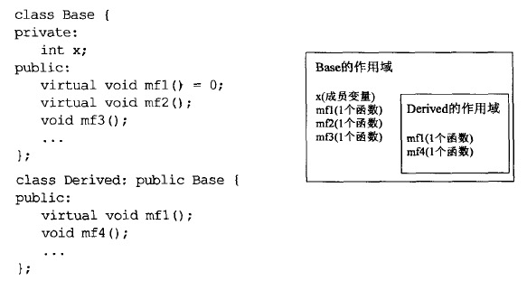 </div>

名字查找会从内层作用域向外层作用域延伸

### 2）名称遮掩会遮掩基类所有重载版本

<div align="center"> 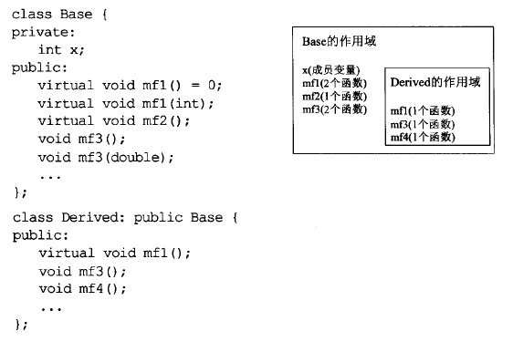 </div>

派生类中同名的名称会遮掩基类中相同的名称，如果基类包含重载函数，所有重载函数都会被遮掩

解决办法是使用using引入被遮掩的名字：

<div align="center"> 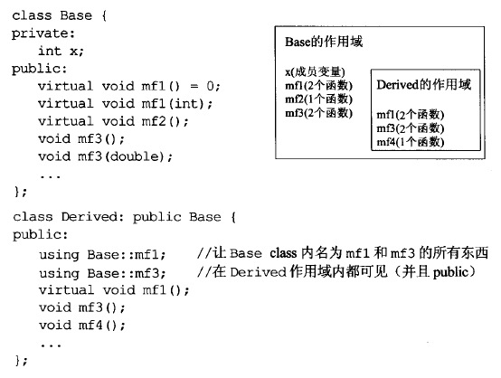 </div>

如果只想引入基类被遮掩函数中某个版本（注意，这种需求一般只在private继承中出现，因为如果只继承基类的部分操作，违背了[条款32](#条款32确定你的public继承塑模出is-a关系)），可以直接定义一个同名同参的函数，然后在这个函数内调用基类的版本，做一个转调用。这实际上称为一种实现技术(而不是引入)更为恰当：

<div align="center"> 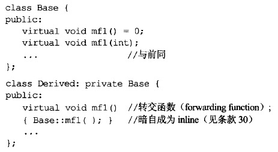 </div>

<br>

## 条款34：区分接口继承和实现继承

> 纯虚函数一般作为接口，基类一般不提供定义，但是基类可以为纯虚函数提供定义。派生类必须声明纯虚函数，如果想要使用纯虚函数，派生类必须提供一份定义，即使基类已经为该纯虚函数提供了定义。如果派生类不提供定义，仍然是一个抽象基类

1. **声明一个pure virtual函数的目的是为了让derived classes只继承函数接口**
2. **声明(非纯)impure virtual函数的目的，是让derived classes继承该函数的接口和缺省实现**
3. **声明non-virtual函数的目的是为了令derived classes继承函数的接口及一份强制性实现** 

### 1）pure virtual函数

如果某个操作不同派生类应该表现出不同行为，并且没有相同的缺省实现，那么应该使用pure virtual函数，此时派生类只继承接口

### 2）impure virtual函数

如果某个操作不同派生类应该表现出不同行为，并且具有相同的缺省实现，那么应该使用impure virtual函数，此时派生类继承接口和缺省实现

**但是，允许impure virtual函数同时指定函数声明和缺省行为，却可能造成危险：假设引入了一个新的派生类，但是缺省行为并不适用于新的派生类，而新的派生类忘记重新定义新的行为，那么调用该操作将表现出缺省行为，这是不合理的**

例如，某个航空公司有A,B两种类型的飞机，他们有相同的fly行为，这个fly行为在基类Airplane中声明为impure virtual函数，并且具有缺省的飞行实现。现在引入了一种新机型C，但是这个缺省的fly行为并不适合C，如果C忘记重新定义fly，那么它将按照A,B缺省的行为飞行

```c++
class Airplane{
public:
    virtual void fly(){
        // 缺省的fly代码
    }
};
class ModelA: public Airplane{...};
class ModelB: public Airplane{...};

class ModelC: public Airplane{...};
Airplane* p = new ModelC;
p->fly();   //调用Airplane::fly
```

a）要避免这种错误，可以将fly改为pure virtual函数，并且将缺省的飞行行为实现为一个protected函数：

```c++
class Airplane{
public:
    virtual void fly() = 0;
//这是合理的，因为它是Airplane及其derived classes的实现细目。乘客应该只在意飞机能不能飞，不在意它怎么飞
protected:
    //non-virtual函数，因为没有任何一个派生类应该重新定义缺省行为
    void defaultFly(){...}
}
class ModelA: public Airplane{
public:
    virtual void fly(){defaultFly();}
}
class ModelB: public Airplane{
public:
    virtual void fly(){defaultFly();}
}
```

此时，fly变成了pure virtual函数，首先，飞机C必须声明fly函数，如果需要使用，必须为其定义。那么就可以防止因为忘记重新定义而引起的错误

b）有些人反对以不同函数分别提供接口和缺省实现，像上面的fly和defaultFly。因为他们关心因过渡雷同函数名称而引起的class命名空间污染问题。那么可以将缺省的行为定义在fly中，即为fly实现一份缺省的定义：

```c++
class Airplane{
public:
    virtual void fly() = 0;
};
void Airplane::fly(){
    // 缺省的fly代码
}

class ModelA: public Airplane{
public:
    virtual void fly(){
        Airplane::fly();
    }
};
```

由于任何派生类想要使用pure virtual函数都必须提供一份定义，那么如果想要使用缺省行为，可以直接在定义中转调用基类的实现。否则，可以定制特殊的行为。因为是纯虚函数，只要不定义就无法使用，因此也可以避免前面的问题

### 3）non-virtual函数

如果某个操作在整个体系中，应该表现出一致的行为，那么应该使用non-virtual函数。此时派生类继承接口和一份强制性实现

<br>

## 条款35：考虑virtual函数以外的其他选择

> 在面向对象中，如果希望某个操作存在缺省算法，并且各派生类可以定制适合自己的操作。可以使用public virtual函数，这是最简单直白且容易想到的方法，但是除此之外，也存在其它可替代的方案。它们有各自的优缺点，应该将所有方案全部列入考入

以一个例子来介绍其它几种可替代方案。在一个游戏人物的类中，存在一个健康值计算的函数，不同的角色可以提供不同的健康值计算方法，并且存在一个缺省实现。以传统的public virtual函数实现如下：

```c++
class GameCharacter{
public:
    virtual int healthValue() const;    //健康值计算函数，派生类可以重新定义
};
```

### 1）藉由Non-Virtual Interface手法实现Template Method模式

这种方案的主要思想是：保留healthValue为public成员，但是让其成为non-virtual，并调用一个private(也可以是protected) virtual函数进行实际工作：

```c++
class GameCharacter{
public:
    //non-virtual函数，virtual函数的包裹器(wrapper)
    int healthValue() const
    {
        ...                             //做一些事前工作
        int retVal = doHealthValue();   //负责真正的健康值计算
        ...                             //做一些事后工作
        return retVal;
    }
    ...
private:
    virtual int doHealthValue() const   //派生类可以重新定义
    {
        ...     //缺省的健康值计算方法
    }
};
```

NVI手法的一个优点是可以在真正操作进行的前后保证一些“事前”和“事后”工作一定会进行。如“事前”进行一些锁的分配，日志记录。“事后”进行解锁等操作

### 2）藉由Function Pointers实现Strategy模式

上面的方案本质还是使用virtual函数，人物的健康值计算(操作)还是与人物(类)相关。后面这几种方案，都是将任务的健康值计算(操作)与具体的每个人(对象)相关，并且可以每个人(对象)的健康值计算(操作)可以修改

```c++
class GameCharacter;    //前置声明
//健康值计算的缺省函数
int defaultHealthCalc(const GameCharacter &gc);
class GameCharacter{
public:
    typedef int (*HealthCalcFunc)(const GameCharacter&);
    explicit GameCharacter(HealthCalcFunc hcf = defaultHealthCalc) : healthFunc(hcf) {}
    //non-virtual函数，virtual函数的包裹器(wrapper)
    int healthValue() const
    {
        return healthFunc(*this);
    }
    ...
private:
    HealthCalcFunc healthFunc;
};
```

每个人物(类)包含一个计算健康值的函数指针，每创建一个人(对象)时，可以为其指定不同的健康值计算函数。因此将操作和类分离。同时，如果提供修改函数指针成员的方法，每个对象还能使用不同的计算方法

### 3）藉由tr1::function完成Strategy模式

这种方案是前一种的加强，将函数指针改成任何可调用对象。因此允许任何与可调用声明相兼容(即可以通过类型转换与声明相符)的可调用物

```c++
class GameCharacter;    //前置声明
//健康值计算的缺省函数
int defaultHealthCalc(const GameCharacter &gc);
class GameCharacter{
public:
    //现在，类型HealthCalcFunc从函数指针变成了可调用物
    typedef std::tr1::function<int (const GameCharacter&)> HealthCalcFunc;
    explicit GameCharacter(HealthCalcFunc hcf = defaultHealthCalc) : healthFunc(hcf) {}
    //non-virtual函数，virtual函数的包裹器(wrapper)
    int healthValue() const
    {
        return healthFunc(*this);
    }
    ...
private:
    HealthCalcFunc healthFunc;
};
```

### 4）传统的Stategy模式

传统的Stategy模式做法会将健康计算函数做成一个分离的继承体系中的virtual成员函数，设计结果看起来像这样:

<div align="center"> 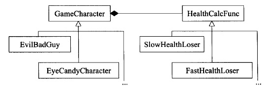 </div>

<br>

```c++
class GameCharacter;    //前置声明
class HealthCalcFunc{
public:
    ...
    virtual int cacl(const GameCharacter &gc) const {...}
    ...
};
//创建一个HealthCalcFunc对象，可以通过它调用缺省的健康值计算方法
HealthCalcFunc defaultHealthCalc;

class GameCharacter{
public:
    explicit GameCharacter(HealthCalcFunc *phcf = &defaultHealthCalc) : pHealthCalc(phcf) {}
    //non-virtual函数，virtual函数的包裹器(wrapper)
    int healthValue() const
    {
        return pHealthCalc->cacl(*this);
    }
    ...
private:
    HealthCalcFunc *pHealthCalc;
};
```

这个方案的吸引力在于，熟悉标准Strategy模式的人很容易辨认它，而且它还提供“将一个既有的健康算法纳入使用”的可能性——只要为HealthCalcFunc继承体系添加一个derived class即可

<br>

## 条款36：绝不重新定义继承而来的non-virtual函数

从规范上说，[条款34](#条款34区分接口继承和实现继承)提到，如果某个操作在整个继承体系应该是不变的，那么使用non-virtual函数，此时派生类从基类继承接口以及一份强制实现。如果派生类希望表现出不同行为，那么应该使用virtual函数

另一方面，假设真的重新定义了继承而来的non-virtual函数，会表现出下列令人困惑的情况：

```c++
class B{
public:
    void mf();
    ...
};

class D : public B{
public:
    void mf();  //重新定义了继承而来的non-virtual函数
};

D x;
B *pB = &x;
D *pD = &x;

pB->mf();       //调用B::mf
pD->mf();       //调用D::mf
```

你可能会觉得因为pB和pD指向的是相同的对象，因此调用的non-virtual函数也应该相同，但是事实并非如此。因为**non-virtual函数是静态绑定**，因此实际上调用的函数由指针或引用决定

<br>

## 条款37：绝不重新定义继承而来的缺省参数值

[条款36](#条款36绝不重新定义继承而来的non-virtual函数)论述了non-virtual函数不应该被重新定义，那么non-virtual函数中的参数也就不存在被重新定义的机会。因此这里主要针对的是virtual函数

**原因就在于，virtual函数是动态绑定，而缺省参数值却是静态绑定**。所以你可能调用了一个派生类的virtual函数，但是使用到的缺省参数，却是基类的

```c++
class Shape{
public:
    enum ShapeColor {Red,Green,Blue};
    virtual void draw(ShapeColor color = Red) const = 0;
    ...
};

class Rectangle : public Shape {
public:
    virtual void draw(ShapeColor color = Green) const;
    ...
};

class Circle : public Shape {
public:
    virtual void draw(ShapeColor color) const;
    ...
};

Rectangle r;
Circle c;

r.draw();           //调用Rectangle::draw，静态类型为Rectangle，所以缺省参数为Shape::Green
//c.draw();         //调用Circle::draw，静态类型为Circle，没有缺省参数，因此错误，必须显式指定！

Shape *pr = &r;
Shape *pc = &c;

//以下为容易引起困惑的地方，函数与参数不一致
pr->draw();         //调用Rectangle::draw，但是静态类型为Shape，所以缺省参数Shape::Red
pc->draw();         //调用Shape::draw，但是静态类型为Shape，所以缺省参数Shape::Red
```

但是，即使派生类严格遵循基类的缺省参数，也存在问题：当基类的缺省参数发生变化时，派生类的所有缺省参数也需要跟着修改。因此，**本质在于，不应该在virtual函数中使用缺省参数**，如果有这样的需求，那么这种场景就适合使用[条款35](#)中，public virtual函数的几种替代方案，比如NVI手法：

```c++
class Shape{
public:
    enum ShapeColor {Red,Green,Blue};
    //此时，带缺省参数的已经不是virtual函数
    void draw(ShapeColor color = Red) const
    {
        doDraw(color);  //调用一个virtual
    }
    ...
private:
    //而完成真正工作的virtual函数已经不带缺省参数
    virtual void doDraw(ShapeColor color) const = 0;  //完成真正的工作
};

class Rectangle : public Shape {
public:
    ...
private:
    //而完成真正工作的virtual函数已经不带缺省参数
    virtual void doDraw(ShapeColor color) const;
    ...
};

class Circle : public Shape {
public:
    ...
private:
    //而完成真正工作的virtual函数已经不带缺省参数
    virtual void doDraw(ShapeColor color) const;
    ...
};
```

## 条款38：通过复合塑模出has-a或“根据某物实现出”

> 复合是类型间的一种关系，当某种类型的对象含有另一种类型的对象，便是这种关系

复合意味着has-a(有一个)或is-implemented-in-terms-of(根据某物实现出)

* has-a：
    ```c++
    class Address {...};
    class PhoneNumber {...};
    class Person{
    public:
        ...
    private:
        std::string name;
        Address address;
        PhoneNumber voiceNumber;
        PhoneNumber faxNumber;
    };
    ```
* 根据某物实现出：
    ```c++
    template <class T, class Sequence = deque<T> >
    class stack {
    ...
    protected:
      Sequence c;   //底层容器
    ...
    };
    ```

上面两者情况都应该使用复合，而不是public继承。在has-a中，每个人肯定不是一个地址，或者电话。显然不能是is-a的关系。而对于后者，由于每个栈只能从栈顶压入弹出元素，而队列不同，is-a的性质是所有对基类为true的操作，对派生类也应该为true。所以stack也不应该通过public继承deque来实现，因此使用复合

<br>

## 条款39：明智而审慎地使用private继承

**private继承和public继承的不同之处**：

* **编译器不会把子类对象转换为父类对象**
    ```c++
    class Person { ... };
    class Student: private Person { ... };     // private继承
    void eat(const Person& p);                 // 任何人都会吃
    Person p;                                  // p是人
    Student s;                                 // s是学生
    eat(p);                                    // 没问题，p是人，会吃
    eat(s);                                    // 错误！难道学生不是人？！
    ```
    如果使用public继承，编译器在必要的时候可以将Student隐式转换成Person，但是private继承时不会，所以eat(s)调用失败。从这个例子中表达了，private继承并不表现出is-a的关系。实际上**private表现出的是"is-implemented-in-terms-of"的关系**
* **父类成员（即使是public、protected）都变成了private**

[条款38](#条款38通过复合塑模出has-a或根据某物实现出)提到，复合也是可以表现出"is-implemented-in-terms-of"的关系，那么两者有什么区别？

### 1）private继承

假设Widget类需要执行周期性任务，于是希望继承Timer的实现。 因为Widget不是一个Timer，所以选择了private继承：

```c++
class Timer {
public:
   explicit Timer(int tickFrequency);
   virtual void onTick() const;          // 每滴答一次，该函数就被自动调用一次
};
class Widget: private Timer {
private:
  virtual void onTick() const;           // 查看Widget的数据...等等
};
```

在Widget中重写虚函数onTick，使得Widget可以周期性地执行某个任务

通过private继承来表现"is-implemented-in-terms-of"关系实现非常简单，而且下列情况也只能使用这种方式：

* 当Widget需要访问Timer的protected成员时。因为对象组合后只能访问public成员，而private继承后可以访问protected成员。
* 当Widget需要重写Timer的虚函数时。比如上面的例子中，需要重写onTick。单纯的复合是做不到的

### 2）复合

如果使用复合，上面的例子可以这样实现：

```c++
class Widget {
private:
    class WidgetTimer: public Timer {
    public:
        virtual void onTick() const;
    };
    WidgetTimer timer;
};
```

通过复合来表现"is-implemented-in-terms-of"关系，实现较为复杂，但是具有下列优点：

* 如果希望禁止Widget的子类重定义onTick。因为派生类无法访问私有的WidgetTimer类
* 可以减小Widget和Timer的编译依赖。如果是private继承，在定义Widget的文件中势必需要引入#include"timer.h"。 但如果采用复合的方式，可以把WidgetTimer放到另一个文件中，在Widget中使用WidgetTimer\*并声明WidgetTimer即可

总的来说，在需要表现"is-implemented-in-terms-of"关系时。如果一个类需要访问基类的protected成员，或需要重新定义其一个或多个virtual函数，那么使用private继承。否则，在考虑过所有其它方案后，仍然认为private继承是最佳办法，才使用它

<br>

## 条款40：明智而审慎地使用多重继承

使用多继承时，一个问题是不同基类可能具有相同名称，产生歧义（即使一个名字可访问，另一个不可访问）

一般有两种方式使用多继承：

* 一般的多重继承
    - 如果某个基类到派生类之间存在多条路径，那么派生类会包含重复的基类成员
    <div align="center"> 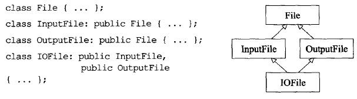 </div>
* 虚继承（此时基类是虚基类）
    - 如果某个基类到派生类之间存在多条路径，派生类只包含一份基类成员，但是这会带来额外开销
        + 为避免重复，编译器必须提供一些机制，后果就是virtual继承的那些classes所产生的对象往往比non-virtual继承的体积大，访问virtual base classes的成员变量时，速度也更慢
        + virtual base的初始化由继承体系中的最底层class负责，这会带来开销
            * classes若派生自virtual bases而需要初始化，必须认知其virtual bases——无论那些bases距离多远
            * 当一个新derived class加入继承体系中，它必须承担其virtual bases的初始化责任
    <div align="center"> 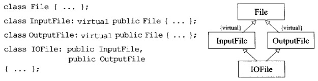 </div>

如果你有一个单一继承的设计方案，而它大约等价于一个多重继承方案，那么单一继承设计方案几乎一定比较受欢迎。如果你唯一能够提出的设计方案涉及多重继承，你应该更努力想一想——几乎可以说一定会有某些方案让单一继承行得通。然而多重继承有时候是完成任务的最简洁、最易维护、最合理的做法，果真如此就别害怕使用它。只要确定，你的确是在明智而审慎的情况下使用它

<br>
<br>

# 七.模板与泛型编程

## 条款41：了解隐式接口和编译器多态

面向对象设计中的类（class）考虑的是显式接口（explicit interface）和运行时多态， 而模板编程中的**模板（template）考虑的是隐式接口（implicit interface）和编译期多态**。

* 对类而言，显式接口是由函数签名表征的，运行时多态由虚函数实现
* 对模板而言，隐式接口是由表达式的合法性表征的，编译期多态由模板初始化和函数重载的解析实现

## 条款42：了解typename的双重意义

以下代码中，typename和class等价：

```c++
template<class T> class Widget;
template<typename T> class Widget;
```

但是如果在template中，遇到嵌套从属名称，需要明确声明是一种类型时，必须使用typename。考虑如下例子：

```c++
template<typename C>
void print2nd(const C& container)
{
    C::const_iterator *x;
    ...
}
```

我们认为C::const_iterator表示容器C的迭代器类型，因此上述代码定义一个该迭代器类型的指针。但是这是一种先入为主的思想。如果C::const_iterator不是一个类型呢？比如恰巧有个static成员变量被命名为const_iterator，或如果x碰巧是个global变量名称？那样的话上述代码就不再是声明一个local变量，而是一个相乘动作

因此，C++有个规则解决这种歧义：如果解析器在template中遭遇一个嵌套从属名称，它便假设这个名称不是个类型，除非你告诉它是。所以缺省情况下嵌套从属名称不是类型。那么怎么告诉它是一个类型，当然就是typename了，所以上述代码应该像这样：

```c++
template<typename C>
void print2nd(const C& container)
{
    typename C::const_iterator *x;
    ...
}
```

因此，**规则是：除了下面2个例外，任何时候当你想要在template中指涉一个嵌套从属类型名称，就必须在紧临它的前一个位置放上关键字typename：**

1. **typename不可出现在base classes list内的嵌套从属名称之前**
2. **typename也不可出现在成员初始值列表中作为base class修饰符**

```c++
template<typename T>
class Derived : public Base<T>::Nested{ //typename不可出现在此
public:
    explict Derived(int x) : Base<T>::Nested(x) //typename也不可出现在此
    {
        typename Base<T>::Nested temp;  //这里必须使用typename
    }
};
```

typename相关规则在不同的编译器上有不同的实践。某些编译器接收的代码原本该有typename却遗漏了；原本不该有typename却出现了；还有少数编译器（通常是较旧版本）根本就拒绝typename。这意味typename和“嵌套从属名称”之间的互动，也会在移植性方面给你带来一些麻烦

<br>

## 条款43：学习处理模板化基类内的名称

假设以下MsgSender类可以通过两种方式发送信息到各个公司：

```c++
template<typename Company>
class MsgSender{
public:
    ...
    //1.发送原始文本
    void sendClear(...)
    {
        ...
        Company c;
        c.sendCleartext(...);   
    }
    //2.发送加密后的文本
    void sendSecret(...) {...}
    ...
};
```

假设我们有时候想要在每次送出信息时志记(log)某些信息。因此有了以下派生类：

```c++
template<typename Company>
class LoggingMsgSender : public MsgSender<Company>{
public:
    ...
    void sendClearMsg(...)
    {
        //将“传送前“的信息写至log；
        sendClear(...);             //调用base class函数，无法通过编译
        //将”传送后“的信息写至log；
    }
    ...
};
```

现在问题是，如果有一个公司CompanyZ只支持加密传送，那么泛化的MsgSender就不适合，因此需要为其产生一个特化版的MsgSender：

```c++
template<>
class MsgSender<CompanyZ>{
public:
    ...
    //只支持发送加密后的文本
    void sendSecret(...) {...}
    ...
};
```

因此，当base class被指定为MsgSender<CompanyZ>时，其内不包含sendClear方法，那么derived class LoggingMsgSender的sendClearMsg方法就会调用不存在sendClear

**因此，正是因为知道base class templates有可能被特化，而那么特化版本可能不提供和一般性template相同的接口。因此C++往往拒绝在templatized base classes（模板化基类，本例的MsgSender\<Company\>）内寻找继承而来的名称（本例的SendClear）**

**解决办法有3个，它们会通知编译器:进入base class作用域查找继承而来的名称**：

1. **使用this->**
    ```c++
    template<typename Company>
    class LoggingMsgSender : public MsgSender<Company>{
    public:
        ...
        void sendClearMsg(...)
        {
            //将“传送前“的信息写至log；
            this->sendClear(...);     //成立，假设sendClear将被继承
            //将”传送后“的信息写至log；
        }
        ...
    };
    ```
2. **使用using**
    ```c++
    template<typename Company>
    class LoggingMsgSender : public MsgSender<Company>{
    public:
        //告诉编译器，请它假设sendClear位于base class内
        using MsgSender<Company>::sendClear;
        ...
        void sendClearMsg(...)
        {
            //将“传送前“的信息写至log；
            sendClear(...);     //成立，假设sendClear将被继承
            //将”传送后“的信息写至log；
        }
        ...
    };
    ```
3. **通过作用域符明确指出**
    ```c++
    template<typename Company>
    class LoggingMsgSender : public MsgSender<Company>{
    public:
        ...
        void sendClearMsg(...)
        {
            //将“传送前“的信息写至log；
            MsgSender<Company>::sendClear(...);  //成立，假设sendClear将被继承
            //将”传送后“的信息写至log；
        }
        ...
    };
    ```
    这种方法往往最不让人满意，因为如果被调用的是virtual函数，这样会关闭”virtual绑定行为“

要注意的是，它们只是通知编译器进去查找。如果找到了自然是没问题。但是如同上面的CompanyZ，如果基类还是不存在相应名称，编译器还是会报错

<br>

## 条款44：将与参数无关的代码抽离templates

模板提供的是编译期的多态， 即使你的代码看起来非常简洁短小，生成的二进制文件也可能包含大量的冗余代码。 因为模板每次实例化都会生成一个完整的副本，所以其中与模板参数无关的部分会造成代码膨胀

把模板中参数无关的代码重构到模板外便可以有效地控制模板产生的代码膨胀：

* **对于非类型模板参数产生的代码膨胀，用函数参数或成员变量来替换模板参数即可消除冗余**
    ```c++
    //非类型模板参数造成代码膨胀
    template<typename T, int n>
    class Square{
    public:
        void invert();  //求逆矩阵
    };
    //以下会实例化两个类：Square<double, 5>和Square<double, 10>
    //会具现化两份invert。除了常量5和10，两个函数的其它部分完全相同
    Square<double, 5> s1;
    Square<double, 10> s2;
    s1.invert();
    s2.invert();
    //以下，使用函数参数消除重复
    template<typename T>
    class SquareBase{
    protected:  
        //以下函数只是作为避免代码重复的方法，并不应该被外界调用，
        //同时，该函数希望被子类调用，因此使用protected
        void invert(int size);
    };
    template<typename T, int n>
    class Square:private SquareBase<T>{//只要T相同，都会使用同一份父类实例，
    private:                           //因此，只有一份invert(int size)
        using SquareBase<T>::invert;
    public:
        //调用父类invert的代价为零，因为Square::invert是隐式的inline函数
        void invert(){ this->invert(n); }
    }
    ```
    最后是父类如何访问矩阵数据。原本这些数据在派生类中，但是因为invert核心代码转移到了父类，那么父类必须有办法访问这些数据。可以在调用SquareBase::invert时把内存地址也一起告知父类，但如果矩阵类中有很多函数都需要这些信息就需要为每个函数添加一个这样的参数。因此，可以把数据地址直接放在父类中
* **对于类型模板参数产生的代码膨胀，可以让不同实例化的模板类共用同样的二进制表示**
    - int和long在多数平台都是一样的底层实现，然而模板却会实例化为两份，因为它们类型不同
    - List<int *>, List<const int *>, List<double *>的底层实现也是一样的。但因为指针类型不同，也会实例化为多份模板类
    如果某些成员函数操作强型指针(T\*)，应该令它们调用另一个操作无类型指针(void\*)的函数，后者完成实际工作

<br>

## 条款45：运用成员函数模板接受所有兼容类型

需要使用成员函数模板的一个例子是构造函数和copying赋值运算符。例如，假设SmartPtr是一种智能指针，并且它是一个template class。现在有一个继承体系：

```c++
class Top {...};
class Middle : public Top {...};
class Bottom : public Middle {...};
```

现在希望通过一个SmartPtr\<Bottom\>或SmartPtr\<Middle\>来初始化一个SmartPtr\<Top\>。如果是指针，即Middle\*和Bottom\*可以隐式转换成Top\*，问题是：**同一个template的不同具现体之间不存在什么与生俱来的固有关系，即使具现体之间具有继承关系**。因此，SmartPtr\<Bottom\>或SmartPtr\<Middle\>并不能隐式转化成SmartPtr\<Top\>。因此，我们需要一个构造函数模板，来实现这种转换：

```c++
template<typename T>
class SmartPtr{
public:
    //构造函数模板
    //意思是：对任何类型T和任何类型U，可以根据SmartPtr<U>生成一个SmartPtr<T>
    template<typename U>
    SmartPtr(const SmartPtr<U> &other)
     : heldPtr(other.get()) {...}
    //原始指针为private成员，需要一个接口来获取
    T* get() const {return heldPtr;}
    ...
private:
    T* heldPtr;   //智能指针所持有的原始指针
};
```

我们当然不希望一个SmartPtr\<Top\>可以转化成SmartPtr\<Bottom\>或SmartPtr\<Middle\>，
```heldPtr(other.get())```为次提供了保证。这个行为只有当“存在某个隐式转换可将一个U\*指针转为一个T\*指针”时才能通过编译

最后需要指明的是：**member templates并不改变语言规则**，而语言规则说，如果程序需要一个copy构造函数，你却没声明它，编译器会为你暗自生成一个。因此，使用member templates实现一个泛化版的copy构造函数时，编译器也会合成一个“正常的”copy构造函数

<br>

## 条款46：需要类型转换时请为模板定义非成员函数

**template实参推导过程中从不将隐式类型转换函数纳入考虑**，下列将[条款24](#条款24若所有参数皆需类型转换请为此采用non-member函数)中的Rational和operator\*改成了template，混合运算会编译错误：

```c++
template<typename T>
class Rational{
public:
    Rational(const T &numerator = 0, const T &denominator = 1);
    const T numerator() const;
    const T denominator() const;
    ...
};

template<typename T>
const Rational<T> operator*(const Rational<T> &lhs,const Rational<T> &rhs)
{ ... }

Rational<int> oneHalt(1,2);
Rational<int> result = oneHalf * 2   //编译错误
```

将oneHalf传递给operator\*时，它将T推断为int，因此期待第二个参数也为Rational，但是第二个参数为int，前面我们说了，template实参推导过程中从不将隐式类型转换函数纳入考虑。因此编译错误

那么解决办法是什么？在class template将其声明为friend，从而具现化一个operator\*，具现化后就可以不受template的限制了：

```c++
template<typename T>
class Rational{
public:
    ...
    //也可以是Rational<T>，但是省去<T>更简洁
    friend const Rational operator*(const Rational &lhs,const Rational &rhs)
    {
        return Rational(lhs.numerator() * rhs.numerator,
                         lhs.denominator() * rhs.denominator());
    }
};
```

如果上面只有函数声明，而函数定义在类外，那么会报链接错误。当传入第一个参数oneHalt时，会具现化Rational\<int\>，编译器也就知道了我们要调用传入两个Rational\<int\>的版本，但是那个函数只在类中进行了声明，并没有定义，不能依赖类外的operator\* template提供定义，我们必须自己定义，所以会出现链接错误。解决方法就是像上面一样定义与类内

这样看起来有点像是member函数，但是因为friend关键字，所以实际是non-member函数，如果去掉friend关键字，就成了member函数，但是此时参数也只能有1个，就不能实现所有参数的隐式转换

上面的代码可能还有一个问题，虽然有friend，上述函数仍是隐式的inline。如果函数实体代码量较大，可以令operator\*不做任何事，只调用一个定义与class外部的辅助函数（当然这里没必要，因为本身只有1行）

```c++
template<typename T> class Rational;

//helper template
template<typename T>
const Rational<T> doMultiply(const Rational<T>& lhs, const Rational<T>& rhs);

template<typename T>
class Rational{
public:
    friend Rational<T> operator*(const Rational<T>& lhs, const Rational<T>& rhs)
    {
        return doMultiply(lhs, rhs);
    }
};
```

<br>

## 条款47：请使用traits classes表现类型信息

* Traits classes使得“类型相关信息”在编译期可用。它们以templates和“templates特化”完成实现
* 整合重载技术后，traits classes有可能在编译期对类型执行if...else测试

详细可参考[STL源码分析中对traits的介绍](https://github.com/arkingc/note/blob/master/C++/STL%E6%BA%90%E7%A0%81%E5%89%96%E6%9E%90.md#2traits%E7%BC%96%E7%A8%8B%E6%8A%80%E6%B3%95)

<br>

## 条款48：认识template元编程

* Template metaprogramming(TMP)是编写template-based C++程序并执行于编译期的过程
* Template metaprogram(模板元程序)是以C++写成、执行于C++编译器内的程序

**TMP的两个重要特点：1）基于template；2）编译期执行**

TMP有2个伟大的效力：

1. 它让某些事情更容易。如果没有它，那些事情将是困难的，甚至不可能的
2. 执行于编译期，因此可将工作从运行期转移到编译期。会导致以下几个结果
    + 某些原本在运行期才能侦测到的错误现在可在编译期找出来
    + 使用TMP的C++程序可能在每一方面都更高效：较小的可执行文件、较短的运行期、较少的内存需求
    + 编译时间变长了

traits解法就是TMP，traits引发“编译器发生于类型身上的if...else计算”

另一个TMP的例子是循环，TMP并没有真正的循环构件，所以循环效果藉由递归完成。TMP的递归甚至不是正常种类，因为TMP循环并不涉及递归函数调用，而是涉及“递归模板具现化”。以计算阶乘为例子：

```c++
template<unsigned n>
struct Factorial{    //一般情况，Factorial<n>的值是n乘以Factorial<n-1>
    enum {value = n * Factorial<n-1>::value};
};

template<>
struct Factorial<0>{    //特殊情况：Factorial<0>的值是1
    enum {value = 1;}
};

int main()
{
    std::cout << Factorial<5>::value;    //打印120
    std::cout << Factorial<10>::value;   //打印3628800
}
```

TMP能够达到以下目标（这部分可以等有实际需求了再去详细了解）：

* 确保量度单位正确
* 优化矩阵运算
* 可以生成客户定制的设计模式实现品

<br>
<br>

# 八.定制new和delete

* operator new 和 operator delete用来分配单一对象
* Arrays所用的内存由operator new\[\]分配出来，并由operator delete\[\]归还
* STL容器使用的heap内存由容器所拥有的分配器对象管理

## 条款49：了解new-handler的行为

operator new抛出异常以反映一个未获满足的内存需求之前，会先调用一个客户指定的错误处理函数，new-handler，可以通过调用```std::set_new_handler()```来设置，```std::set_new_handler()```定义在\<new\>中：

```c++
namespace std{
    typedef void (*new_handler)();
    new_handler set_new_handler(new_handler p) throw(); 
    //以上，throw()是一个异常声明，括号内无任何内容，表示不抛任何异常
}
```

当operator new无法满足内存申请时，它会不断调用new-handler函数，直到找到足够内存。一个设计良好的new-handler函数必须做以下事情；

* **让更多内存可被使用**：一个做法是程序一开始执行就分配一大块内存，而后当new-handler第一次被调用，将它们还给程序使用。这便造成operator new内的下一次内存分配动作可能成功
* **安装另一个new-handler**：如果当前new-handler无法取得更多可用内存，可用安装另一个，下次operator new时会调用新的new-handler
* **卸除new-handler**：将null指针传给set_new_handler
* **抛出bad_alloc(或派生自bad_alloc)的异常**：这样的异常不会被operator new捕获，因此会被传播到内存索求处
* **不返回**：通常调用abort或exit（abort会设置程序非正常退出，exit会设置程序正常退出，当存在未处理异常时C++会调用terminate， 它会回调由std::set_terminate设置的处理函数，默认会调用abort）

### 实现class专属的new-handlers

```c++
class NewHandlerHolder{
public:
    explicit NewHandlerHolder(std::new_handler nh): handler(nh){}
    ~NewHandlerHolder(){ std::set_new_handler(handler); }
private:
    std::new_handler handler;
    NewHandlerHolder(const HandlerHolder&);     // 禁用拷贝构造函数
    const NewHandlerHolder& operator=(const NewHandlerHolder&); // 禁用赋值运算符
};

template<typename T>
class NewHandlerSupport{
public:
    static std::new_handler set_new_handler(std::new_handler p) throw();
    static void * operator new(std::size_t size) throw(std::bad_alloc);
private:
    static std::new_handler current;   //class专属的new-handlers
};

//class专属的new-handlers初始化为null
template<typename T>
std::new_handler NewHandlerSupport<T>::current = 0;

template<typename T>
std::new_handler NewHandlerSupport<T>::set_new_handler(std::new_handler p) throw(){
    std::new_handler old = current;
    current = p;    //将class专属的new-handlers设置为新的new_handler
    return old;     //返回旧的class专属的new-handlers
}

//new时会调用该operator new
//它会设置全局的new-handlers为该class专属的new-handlers，然后调用全局operator new申请内存
//h对象销毁后，其析构函数会将全局new-handlers恢复为调用前的状态
template<typename T>
void * NewHandlerSupport<T>::operator new(std::size_t size) throw(std::bad_alloc){
    NewHandlerHolder h(std::set_new_handler(current));
    return ::operator new(size);
}
```

有了```NewHandlerSupport```这个模板基类后，给Widget添加”new-handler”支持只需要public继承即可:

```c++
class Widget: public NewHandlerSupport<Widget>{ ... };
```

```NewHandlerSupport```的实现和模板参数T完全无关，添加模板参数是因为handler是静态成员，这样编译器才能为每个类型生成一个handler实例

### nothrow new

1993年之前C++的operator new在失败时会返回null而不是抛出异常。如今的C++仍然支持这种nothrow的operator new

```c++
Widget *p1 = new Widget;    // 失败时抛出 bad_alloc 异常
if(p1 == 0) ...             // 这个测试一定失败

Widget *p2 = new (std::nothrow) Widget;
if(p2 == 0) ...             // 这个测试可能成功
```

nothrow new只能保证所调用的nothrow版的operator new不抛出异常，但是构造也属于new的一个步骤，而它没法强制构造函数不抛出异常，所以并不能保证```new (std::nothrow) Widget```这样的表达式绝不导致异常

<br>

## 条款50：了解new和delete的合理替换时机

一般出于下列原因可能想要替换编译器提供的operator new或operator delete：

* 为了检测运用错误
* 为了收集动态分配内存的使用统计信息
* 为了增加分配和归还的速度
* 为了降低缺省内存管理器带来的空间额外开销
* 为了弥补缺省分配器中的非最佳齐位
* 为了将相关对象成簇集中
* 为了获得非传统的行为

下面是一个”为了检测运用错误“而实现的简单的operator new的例子，通过在首部和尾部插入一个签名，返回中间内存块给程序使用，如果程序在使用内存时发生过在区块前或区块后写入的行为，那么签名就会被修改，因此可以检测这种行为：

```c++
static const int signature = 0xDEADBEEF;    // 边界符
typedef unsigned char Byte; 

void* operator new(std::size_t size) throw(std::bad_alloc) {
    // 多申请一些内存来存放占位符 
    size_t realSize = size + 2 * sizeof(int); 

    // 申请内存
    void *pMem = malloc(realSize);
    if (!pMem) throw bad_alloc(); 

    // 写入边界符
    *(reinterpret_cast<int*>(static_cast<Byte*>(pMem)+realSize-sizeof(int))) 
        = *(static_cast<int*>(pMem)) = signature;

    // 返回真正的内存区域
    return static_cast<Byte*>(pMem) + sizeof(int);
}
```

这个例子主要是展示，它存在很多错误：

1. 所有的operator new都应该内含一个循环，反复调用某个new-handling函数，这里却没有
2. C++要求所有operator new返回的指针都有适当的对齐。这里malloc返回的指针是满足要求的，但是因为上述实现并不是直接返回malloc的结果，而是返回一个int偏移后的地址，因此无法保证它的安全

<br>

## 条款51：编写new和delete时需固守常规

前一条款是解释什么时候会想实现自己的 operator new 和 operator delete，这个条款是解释当实现自己的 operator new 和 operator delete 时，必须遵守的规则

### 1）operator new

实现一致性的operator new必得返回正确的值，内存不足时必得调用new-handling函数，必须有对付零内存需求的准备，还需避免不慎掩盖正常形式的new

下面是non-member operator new的伪码：

```c++
void* operator new(std::size_t size) throw(std::bad_alloc)
{
    using namespace std;
    if(size == 0){          //处理0-byte申请
        size = 1;           //将它视为1-byte
    }
    while(true){
        尝试分配size bytes
        if (分配成功)
        return (一个指针，指向分配得来的内存)

        //分配失败：找出目前的new-handling函数
        new_handler globalHandler = set_new_handler(0);
        set_new_handler(globalHandler);
        
        if(globalHandler) (*globalHandler)();
        else throw std::bad_alloc();
    }
}
```

在继承中定制member operator new时，一般是针对某特定class的对象分配行为提供最优化，此时，并不是为了该class的任何derived classes。也就是说，针对class X而设计的operator new，其行为很典型地只为大小刚好为sizeof(X)的对象而设计。然而一旦被继承下去，有可能base class的operator new被调用用以分配derived class对象：

```c++
class Base{
public:
    static void* operator new(std::size_t size) throw(std::bad_alloc);
    ...
};

class Derived : public Base  //假设Derived未声明operator new
{...};

Derived *p = new Derived;    //这里调用的是Base::operator new
```

如果Base class专属的operator new并没有设计上述问题的处理方法，那么最佳做法是将“内存申请量错误”的调用行为改采标准operator new，像这样：

```c++
void* Base::operator new(std::size_t size) throw(std::bad_alloc)
{
    if(size != sizeof(Base))            //如果大小错误
        return ::operator new(size);    //交给标准的operator new处理
    ...
}
```

### 2）operator delete

operator delete比起operator new更简单，需要记住的唯一事情就是C++保证“删除null指针永远安全”：

```c++
void operator delete(void* rawMemory) throw()
{
    if(rawMemory == 0)  return;  //如果将被删除的是个null指针，那就什么都不做
    现在，归还rawMemory所指的内存；
}
```

member版本也很简单，只需要多一个动作检查删除数量。万一class专属的operator new将大小有误的分配行为转交::operator new执行，你也必须将大小有误的删除行为转交::operator delete执行

```c++
void* Base::operator delete(void* rawMemory,std::size_t size) throw()
{
    if(rawMemory == 0)  return;         //检查null指针
    if(size != sizeof(Base)){           //如果大小错误，令标准版
        ::operator delete(rawMemory);   //operator delete处理此一申请
        return;
    }
    现在，归还rawMemory所指的内存
    return;
}
```

如果即将被删除的对象派生自某个base class，而后者欠缺virtual析构函数，那么C++传给operator delete的size_t数值可能不正确。这是“让你的base classes拥有virtual析构函数”的一个够好的理由

<br>

## 条款52：写了placement new也要写placement delete

placement new是带有额外参数的operator new，但是通常都指“接受一个指针指向对象该被构造之处”的operator new。这个版本被纳入了C++标准程序库，只要#include\<new>\就可以使用：

```c++
void* operator new(std::size_t,void* pMemory) throw();
```

new会先调用operator new，然后构造对象。如果对象构造过程中发生异常，那么需要调用相应的operator delete，否则会发生内存泄露。而operator delete必须和相应的operator new匹配

* 对于正常版本的operator new，匹配的operator delete就是不带额外参数的版本
* 对于非正常版本的operator new(placement new)，匹配的operator delete是带相应参数的版本(placement delete)

**placement delete只有在“伴随placement new调用而触发的构造函数”出现异常时才会被调用。对着一个指针施行delete绝不会导致调用placement delete**

这意味着如果要对所有与placement new相关的内存泄露宣战，我们必须同时提供一个正常的operator delete（用于构造期间无任何异常被抛出）和一个placement版本（用于构造期间有异常被抛出）。后者的额外参数必须和operator new一样。只要这样做，就再也不会因为难以察觉的内存泄露而失眠

还需要注意名称掩盖的问题：

* 成员函数的名称会掩盖外围作用域中的相同名称
* 子类的名称会掩盖所有父类相同的名称

一个比较好的方法是：

```c++
class StandardNewDeleteForms{
public:
    //正常的 new/delete
    static void* operator new(std::size_t size) throw(std::bad_alloc)
    {return ::operator new(size);}
    static void operator delete(void* pMemory) throw()
    {::operator delete(pMemory);}

    //placement new/delete
    static void* operator new(std::size_t size, void *ptr) throw() 
    { return ::operator new(size, ptr); }
    static void operator delete(void *pMemory, void *ptr) throw() 
    { return ::operator delete(pMemory, ptr); }

    // nothrow new/delete
    static void* operator new(std::size_t size, const std::nothrow_t& nt) throw() 
    { return ::operator new(size, nt); }
    static void operator delete(void *pMemory, const std::nothrow_t&) throw() 
    { ::operator delete(pMemory); }
};

class Widget: public StandardNewDeleteForms {      //继承标准形式
public:
   using StandardNewDeleteForms::operator new;     //让这些形式可见
   using StandardNewDeleteForms::operator delete;

   static void* operator new(std::size_t size, std::ostream& log) throw(std::bad_alloc);    // 自定义 placement new
   static void operator delete(void *pMemory, std::ostream& logStream) throw();            // 对应的 placement delete
};
```
