* [一.简介](#一简介)
    * [1.GNU源代码开发精神](#1gnu源代码开放精神)
    * [2.STL版本](#2stl版本)
    * [3.SGI STL头文件分布](#3sgi-stl头文件分布)
    * [4.STL六大部件](#4stl六大部件)
* [二.空间分配器](#二空间分配器)
    * [1.空间分配器的标准接口](#1空间分配器的标准接口)
    * [2.SGI标准的空间分配器std::allocator](#2sgi标准的空间分配器stdallocator)
    * [3.SGI特殊的空间分配器std::alloc](#3sgi特殊的空间分配器stdalloc)
        - [3.1 对象构造与析构](#31-对象构造与析构)
        - [3.2 内存分配与释放](#32-内存分配与释放)
            + [1）两级分配器](#1两级分配器)
            + [2）第一级分配器__malloc_alloc_template](#2第一级分配器__malloc_alloc_template)
            + [3）第二级分配器__default_alloc_template](#3第二级分配器__default_alloc_template)
        - [3.3 内存基本处理工具](#33-内存基本处理工具)
* [三.迭代器与traits编程技法](#三迭代器与traits编程技法)
    - [1.迭代器相应类型](#1迭代器相应类型)
    - [2.traits编程技法](#2traits编程技法)
    - [3.std::iterator的保证](#3stditerator的保证)
    - [4.SGI STL的__type_traits](#4sgi-stl的__type_traits)
* [四.顺序容器](#四顺序容器)
    - [1.vector](#1vector)
    - [2.list](#2list)
    - [3.deque](#3deque)
    - [4.stack](#4stack)
    - [5.queue](#5queue)
    - [6.heap](#6heap)
    - [7.priority_queue](#7priority_queue)
    - [8.slist](#8slist)
* [五.关联容器](#五关联容器)
    - [1.RB-tree](#1rb-tree)
    - [2.set](#2set)
    - [3.map](#3map)
    - [4.multiset](#4multiset)
    - [5.multimap](#5multimap)
    - [6.hashtable](#6hashtable)
    - [7.hash_set](#7hash_set)
    - [8.hash_map](#8hash_map)
    - [9.hash_multiset](#9hash_multiset)
    - [10.hash_multimap](#10hash_multimap)
* [六.算法](#六算法)
    - [1.区间拷贝](#1区间拷贝)
    - [2.set相关算法](#2set相关算法)
    - [3.排序sort](#3排序sort)
    - [4.其它算法](#4其它算法)
* [七.仿函数](#七仿函数)
    - [1.仿函数的相应类型](#1仿函数的相应类型)
    - [2.算术类仿函数](#2算术类仿函数)
    - [3.关系运算类仿函数](#3关系运算类仿函数)
    - [4.逻辑运算类仿函数](#4逻辑运算类仿函数)
    - [5.证同，选择与投射](#5证同选择与投射)
* [八.适配器](#八适配器)
    - [1.容器适配器](#1容器适配器)
    - [2.迭代器适配器](#2迭代器适配器)
        + [2.1 insert iterators](#21-insert-iterators)
        + [2.2 reverse iterators](#22-reverse-iterators)
        + [2.3 iostream iterators](#23-iostream-iterators)
    - [3.函数适配器](#3函数适配器) 
        + [3.1 not1和not2](#31-not1和not2)
        + [3.2 bind1st和bind2st](#32-bind1st和bind2st)
        + [3.3 compose1和compose2](#33-compose1和compose2)
        + [3.4 用于函数指针的ptr_fun](#34-用于函数指针的ptr_fun)
        + [3.5 用于成员函数指针的mem_fun和mem_fun_ref](#35-用于成员函数指针的mem_fun和mem_fun_ref)

<br>
<br>
<br>

# 一.简介

## 1.GNU源代码开放精神

全世界所有的STL实现版本，都源于Alexander Stepanov和Meng Lee完成的原始版本，这份原始版本有Hewlett-Packard Compant(惠普公司)拥有。每一个头文件都有一份声明，允许任何人任意运用、拷贝、修改、传播、贩卖这些代码，无需付费，唯一的条件是必须将声明置于使用者新开发的文件内

这份开放源代码的精神，一般统称为**open source**

**GNU**(音译为“革奴”)，代码**G**UN is **N**ot **U**nix。当时Unix是计算机界主流操作系统，由AT&T Bell实验室的Ken Thompson和Dennis Ritchie创造。原本只是学术上的一个练习产品，AT&T将它分享给许多研究人员。但是当所有研究与分享使这个产品越来越美好时，AT&T开始思考是否应该追加投资，从中获利。于是开始要求大学校园内的相关研究人员签约，要求他们不得公开或透露UNIX源代码，并赞助Berkeley大学继续强化UNIX，导致后来发展出BSD(Berkeley Software Distribution)版本，以及更后来的FreeBSD、OpenBSD、NetBSD...，**Stallman将AT&T的这种行为视为思想禁锢，以及一种伟大传统的沦丧，于是进行了他的反奴役计划，称之为GNU:GUN is Not Unix**，**GNU计划中，早期最著名的软件包括Emacs和GCC，晚期最著名的是Linux操作系统**

**GNU以所谓的GPL(General Public License，广泛开放授权)来保护(或说控制)其成员**：使用者可以自由阅读与修改GPL软件的源码，但如果使用者要传播借助GPL软件而完成的软件，必须也同意GPL规范。这种精神主要是强迫人们分享并回馈他们对GPL软件的改善。得之于人，舍于人

**Cygnus是一家商业公司**，包装并出售自由软件基金会所构造的软件工具，并贩卖各种服务。他们协助芯片厂商调整GCC，在GPL的精神和规范下将GCC源代码的修正公布于世；他们提供GCC运作信息，提升其运行效率，并因此成为GCC技术领域的最佳咨询对象。Cygnus公司之于GCC，地位就像Red Hat公司之于Linux

## 2.STL版本

* **HP实现版本**(HP STL)
    - **所有STL实现版本的始祖**
    - 运行任何人免费使用、拷贝、修改、传播、贩卖这份软件及其说明文件
    - 唯一需要遵守的是：必须在所有文件中加上HP的版本声明和运用权限声明
    - 这种授权不属于GNU GPL范畴，但属于open source范畴
* **P.J. Plauger实现版本**(PJ STL)
    - 继承自HP版本，所有每一个头文件都有HP的版本说明
    - 此外还加上P.J. Plauger的个人版权声明
    - 不属于GNU GPL范畴，也不属于open source范畴
    - **被Visual C++采用**
    - 符号命名不讲究、可读性较低
* **Rouge Wave实现版本**(RW STL)
    - 继承自HP版本，所以每一个头文件都有HP的版本说明
    - 此外还加上Rouge Wave的公司版权声明
    - 不属于GNU GPL范畴，也不属于open source范畴
    - **被C++Builder采用**（C++Builder对C++语言特性支持不错，连带给予了RW版本正面的影响）
    - 可读性不错
* **STLport实现版本**
    - 以SGI STL为蓝本的高度可移植性实现版本
* **SGI STL实现版本**
    - 继承自HP版本，所以每一个头文件都有HP的版本说明
    - 此外还加上SGI的公司版权声明
    - 不属于GNU GPL范畴，但属于open source范畴
    - **被GCC采用**（GCC对C++语言特性支持很好，连带给予了SGI STL正面影响）
    - 可读性很高
    - 为了具有高度移植性，考虑了不同编译器的不同编译能力

## 3.SGI STL头文件分布

1. **C++标准规范下的C头文件**：cstdio，csyflib，cstring，...
2. **C++标准程序库中不属于STL范畴者**：stream，string，...
3. **STL标准头文件(无扩展名)**：vector，deque，list，map，...
4. **C++标准定案前，HP所规范的STL头文件**：vector.h，deque.h，list.h，...
5. **SGI STL内部文件**(**STL真正实现与此**)：stl_vector.h，stl_deque.h，stl_algo.h，...

不同的编译器**对C++语言的支持程度**不尽相同。作为一个希望具备广泛移植能力的程序库，SGI STL准备了一个**环境组态文件**[<stl_config.h>](tass-sgi-stl-2.91.57-source/stl_config.h)，其中定义了许多常量，标示某些组态的成立与否，所有STL头文件都会直接或间接包含这个组态文件，并以条件式写法，让预处理器根据各个常量决定取舍哪一段程序代码，例如：

<div align="center"> 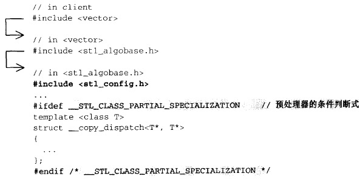 </div>

**组态测试程序**：

* [编译器对组态的支持](stlbookcode/c1/1config.cpp)
* [组态3：__STL_STATIC_TEMPLATE_MEMBER_BUG](stlbookcode/c1/1config3.cpp)
* [组态5：__STL_CLASS_PARTIAL_SPECIALIZATION](stlbookcode/c1/1config5.cpp)
* [组态6：__STL_FUNCTION_TMPL_PARTIAL_ORDER](stlbookcode/c1/1config6.cpp)
* 组态7：__STL_EXPLICIT_FUNCTION_TMPL_ARGS（整个SGI STL内都没有用到这一常量定义）
* [组态8：__STL_MEMBER_TEMPLATES](stlbookcode/c1/1config8.cpp)
* [组态10：__STL_LIMITED_DEFAULT_TEMPLATES](stlbookcode/c1/1config10.cpp)
* [组态11：__STL_NON_TYPE_TMPL_PARAM_BUG](stlbookcode/c1/1config11.cpp)
* [组态：__STL_EXPLICIT_FUNCTION_TMPL_ARGS](stlbookcode/c1/1config-null-template-arguments.cpp)（**bound friend templates**）
* [组态：__STL_TEMPLATE_NULL](stlbookcode/c1/1config-template-exp-special.cpp)（**class template explicit specialization**）

## 4.STL六大部件

<div align="center"> 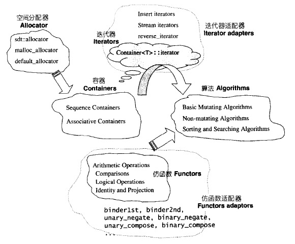 </div>

最重要的2个是**容器**与**算法**

* **容器**(container)
* **分配器**(Allocator)
* **算法**(Algorithms)
* **迭代器**(Iterrators)
* **适配器**(Adaptors)
* **仿函数**(Functors)

<br>

# 二.空间分配器

在运用层面，不需要关注空间分配器。但是在容器背后，空间分配器负责容器中元素空间的分配

不称作”内存分配器“，是因为分配的空间不一定是内存，可以是磁盘或其它辅助存储介质。可以实现一个获取磁盘空间的allocator。不过这里介绍的空间分配器获取的空间是内存

## 1.空间分配器的标准接口

通常，C++内存分配和释放的操作如下：

```c++
class Foo {...};
Foo *pf = new Foo;
delete pf;
```

* **new内含2阶段操作**：
    - 调用::operator new分配内存
    - 调用构造函数构造对象
* **delete也含2阶段操作**：
    - 调用析构函数析构对象
    - 调用::operator delete释放内存

STL allocator将new和delete的2阶段操作进行了分离：

* 内存分配：由alloc::allocate()负责
* 内存释放：由alloc::deallocate()负责
* 对象构造：由alloc::construct()负责
* 对象析构：由alloc::destroy负责

根据**STL的规范**，以下是allocator的必要接口：

```c++
allocator::value_type
allocator::pointer
allocator::const_pointer
allocator::reference
allocator::const_reference
allocator::size_type
allocator::difference_type

//一个嵌套的class template，class rebind<U> 拥有唯一成员other,是一个typedef，代表allocator<U> 
allocator::rebind

//构造函数
allocator::allocator()
//拷贝构造函数
allocator::allocator(const allocator&)  
template <class U> allocator::allocator(const allocator<U>&)
//析构函数
allocator::~allocator

//返回某个对象的地址，等同于&x
pointer allocator::address(reference x) const   
const_pointer allocator::address(const_reference x) const

//分配空间，足以容纳n个元素
pointer allocator::allocate(size_type n,const void* = 0)
//归还之前分配的空间
void allocator::deallocate(pointer p,size_type n)
//可分配的最大空间
size_type allocator::max_size() const

//通过x，在p指向的地址构造一个对象。相当于new((void*)p) T(x)
void allocator::construct(pointer p,const T& x)
//析构地址p的对象
void allocator::destroy(pointer p)
```

* **只能有限度搭配PJ STL**，因为PJ STL未完全遵循STL规格，其所供应的许多容器都需要一个非标准的空间分配器接口
* **只能有限度地搭配RW STL**，因为RW STL在很多容器身上运用了缓冲区，情况复杂很多
* **完全无法应用于SGI STL**，因为SGI STL在这个项目上根本就脱离了STL标准规格，使用一个专属的、拥有次层配置能力的、效率优越的特殊分配器。但提供了一个对其进行了封装的名为simple_alloc的分配器，符合部分标准

## 2.SGI标准的空间分配器std::allocator

虽然SGI也定义有一个**符合”部分“标准**、名为[allocator](tass-sgi-stl-2.91.57-source/defalloc.h)的分配器，但SGI自己从未用过它，也**不建议我们使用**。**主要原因是效率不佳**，只把C++的::operator new和::operator delete做一层薄薄的包装而已

## 3.SGI特殊的空间分配器std::alloc

STL标准规定分配器定义于```<memory>```中，SGI```<memory>```内含两个文件，负责分离的2阶段操作

<div align="center"> 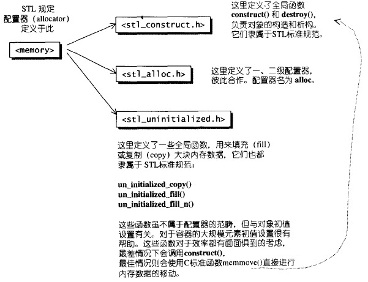 </div>

> 真正在SGI STL中大显身手的分配器（即SGI特殊的空间分配器std::alloc）或为第一级分配器，或为第二级分配器

### 3.1 对象构造与析构

[<stl_construct.h>](tass-sgi-stl-2.91.57-source/stl_construct.h)

<div align="center"> 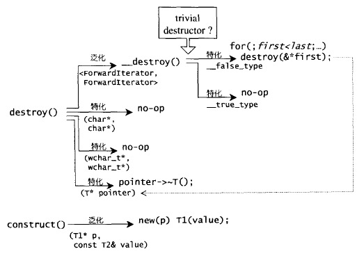 </div>

> STL规定分配器必须拥有名为construct()和destroy()的两个成员函数，然而SGI特殊的空间分配器std::alloc并未遵守这一规则，所以实际上这部分属于STL allocator，但不属于std::alloc。换句话说，SGI特殊的空间分配器std::alloc不包含”3.1 对象构造与析构“，只包含”3.2 内存分配与释放“

### 3.2 内存分配与释放

SGI对内存分配与释放的设计哲学如下：

* 向system heap申请空间
* 考虑多线程状态
* 考虑内存不足时的应变措施
* 考虑过多“小型区块”可能造成的内存碎片问题（**SGI设计了双层级分配器**）

**C++的内存分配基本操作是::operator new(),内存释放基本操作是::operator delete()。这两个全局函数相当于C的malloc()和free()函数。SGI正是以malloc和free()完成内存的分配与释放**

#### 1）两级分配器

考虑到小型区块所可能造成的内存碎片问题，SGI设计了双层级分配器：

<div align="center"> 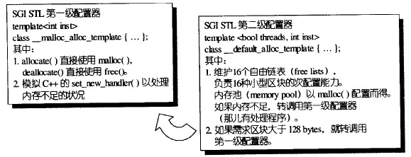 </div>

* 第一级分配器
    - 直接使用malloc()和free()
* 第二级分配器
    - 当分配区块超过128bytes时，视为“足够大”，调用第一级分配器
    - 当分配区块小于128bytes时，视为“过小”，为了降低额外负担，采用复杂的memory pool整理方式，不再求助于第一级分配器

无论alloc被定义为第一级或第二级分配器，SGI还为它再包装一个接口，使分配器的接口能够符合STL规格：

```c++
template<class T, class Alloc>
class simple_alloc {

public:
    static T *allocate(size_t n)
                { return 0 == n? 0 : (T*) Alloc::allocate(n * sizeof (T)); }
    static T *allocate(void)
                { return (T*) Alloc::allocate(sizeof (T)); }
    static void deallocate(T *p, size_t n)
                { if (0 != n) Alloc::deallocate(p, n * sizeof (T)); }
    static void deallocate(T *p)
                { Alloc::deallocate(p, sizeof (T)); }
};
```

内部4个函数都是转调用分配器的成员函数。**这个接口使分配器的分配单位从bytes转为个别元素的大小**

<div align="center"> 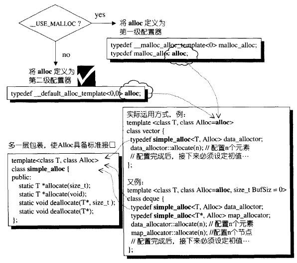 </div>

> 上图中Alloc=alloc中的缺省alloc可以是第一级分配器，也可以是第二级分配器。SGI STL已经把它设为第二级分配器

两级分配器都定义在头文件[<stl_alloc.h>](tass-sgi-stl-2.91.57-source/stl_alloc.h)中

#### 2）第一级分配器__malloc_alloc_template

```c++
//一般而言是线程安全，并且对于空间的运用比较高效
//无“template型别参数”，至于”非型别参数“inst，则完全没派上用场
template <int inst>
class __malloc_alloc_template {

private:
//oom：out of memory ，用来处理内存不足的情况
static void *oom_malloc(size_t);

static void *oom_realloc(void *, size_t);

#ifndef __STL_STATIC_TEMPLATE_MEMBER_BUG
    static void (* __malloc_alloc_oom_handler)();
#endif

public:

static void * allocate(size_t n)
{
    void *result = malloc(n);//第一级分配器直接使用malloc()
    //以下无法满足需求时，改用oom_malloc()
    if (0 == result) result = oom_malloc(n);
    return result;
}

static void deallocate(void *p, size_t /* n */)
{
    free(p);//第一级分配器直接使用free()
}

static void * reallocate(void *p, size_t /* old_sz */, size_t new_sz)
{
    void * result = realloc(p, new_sz);//第一级分配器直接使用realloc()
    //以下无法满足需求时，改用oom_realloc()
    if (0 == result) result = oom_realloc(p, new_sz);
    return result;
}

//以下仿真C++的set_new_handler()。可以通过它指定自己的
//out-of-memory handler
//不能直接运用C++ new-handler机制，因为它并非使用::operator new来分配内存
static void (* set_malloc_handler(void (*f)()))()
{
    void (* old)() = __malloc_alloc_oom_handler;
    __malloc_alloc_oom_handler = f;
    return(old);
}

};

// malloc_alloc out-of-memory handling

#ifndef __STL_STATIC_TEMPLATE_MEMBER_BUG
//初值为0，有待客户设定
template <int inst>
void (* __malloc_alloc_template<inst>::__malloc_alloc_oom_handler)() = 0;
#endif

template <int inst>
void * __malloc_alloc_template<inst>::oom_malloc(size_t n)
{
    void (* my_malloc_handler)();
    void *result;

    for (;;) {//不断尝试释放、分配、再释放、再分配...
        my_malloc_handler = __malloc_alloc_oom_handler;
        if (0 == my_malloc_handler) { __THROW_BAD_ALLOC; }
        (*my_malloc_handler)(); //调用处理例程，企图释放内存
        result = malloc(n);     //再次尝试分配内存
        if (result) return(result);
    }
}

template <int inst>
void * __malloc_alloc_template<inst>::oom_realloc(void *p, size_t n)
{
    void (* my_malloc_handler)();
    void *result;

    for (;;) {//不断尝试释放、分配、再释放、再分配...
        my_malloc_handler = __malloc_alloc_oom_handler;
        if (0 == my_malloc_handler) { __THROW_BAD_ALLOC; }
        (*my_malloc_handler)(); //调用处理例程，企图释放内存
        result = realloc(p, n); //再次尝试分配内存
        if (result) return(result);
    }
}
```

* 以malloc()、free()、realloc()等C函数执行实际的内存分配、释放、重分配操作
* 实现出类似C++ new-handler的机制（**C++ new-handler机制是，可以要求系统在内存分配需求无法被满足时，调用一个你所指定的函数。换句话说，一旦::operator new无法完成任务，在丢出std::bad_alloc异常状态之前，会先调用由客户指定的处理例程，该处理例程通常即被称为new-handler**），不能直接运用C++ new-handler机制，因为它并非使用::operator new来分配内存（[operator new的实现](C++对象模型.md#3operator-new和operator-delete的实现)）

#### 3）第二级分配器__default_alloc_template

第二级分配器多了一些机制，避免太多小额区块造成内存的碎片，小额区块存在下列问题：

* 产生内存碎片
* 额外负担。额外负担是一些区块信息，用以管理内存。区块越小，额外负担所占的比例就越大，越显浪费

<div align="center"> 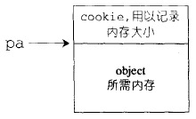 </div>

* 当区块大于128bytes时，视为大区块
    - 转交第一级分配器处理
* 当区块小于128bytes时，视为小额区块
    - 以**内存池管理(也称为次层分配)**：每次分配一大块内存，并维护对应的自由链表(free-list)，下次若载有相同大小的内存需求，就直接从free-list中拨出。如果客户释放小额区块，就由分配器回收到free-list中。**维护有16个free-list**，各自管理大小分别为8，16，24，32，40，48，56，64，72，80，88，96，104，112，120，128bytes的小额区块
    - SGI第二级分配器会主动将任何小额区块的内存需求量上调至8的倍数

free-list使用如下结构表示：

```c++
//使用union解决free-list带来的额外负担：维护链表所必须的指针而造成内存的另一种浪费
union obj{
    union obj * free_list_link; //系统视角
    char client_data[1];        //用户视角
}
```

下图是free-list的实现技巧：

<div align="center"> 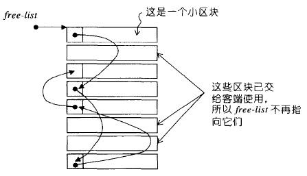 </div>

第二级分配器__default_alloc_template也定义在头文件[<stl_alloc.h>](tass-sgi-stl-2.91.57-source/stl_alloc.h)中，以下为部分实现：

```c++
#ifdef __SUNPRO_CC
// breaks if we make these template class members:
  enum {__ALIGN = 8};                           //小型区块的上调边界
  enum {__MAX_BYTES = 128};                     //小型区块的上限
  enum {__NFREELISTS = __MAX_BYTES/__ALIGN};    //free-list的个数
#endif

//第二级分配器的定义
//无”template型别参数“，第一个参数用于多线程环境，第二参数完全没派上用场
template <bool threads, int inst>
class __default_alloc_template {

private:
    //将bytes上调至8的倍数
    static size_t ROUND_UP(size_t bytes) {
        return (((bytes) + __ALIGN-1) & ~(__ALIGN - 1));
    }
private:
    //free-list
    union obj {
        union obj * free_list_link;
        char client_data[1];    /* The client sees this.        */
    };
private:
    //16个free-list
    static obj * volatile free_list[__NFREELISTS]; 
    //根据区块大小，决定使用第n号free-list。n从0算起
    static  size_t FREELIST_INDEX(size_t bytes) {
        return (((bytes) + __ALIGN-1)/__ALIGN - 1);
    }

    //返回一个大小为n的对象，并可能加入大小为n的其它区块到free-list
    static void *refill(size_t n);
    //分配一大块空间，可容纳nobjs个大小为”size“的区块
    //如果分配nobjs个区块有所不便，nobjs可能会降低
    static char *chunk_alloc(size_t size, int &nobjs);

    // Chunk allocation state.
    static char *start_free;  //内存池起始位置。只在chunk_alloc()中变化
    static char *end_free;    //内存池结束位置。只在chunk_alloc()中变化
    static size_t heap_size;

public:
    static void * allocate(size_t n){ /*详述于后*/ }
    static void deallocate(void *p, size_t n){ /*详述于后*/ }
    static void * reallocate(void *p, size_t old_sz, size_t new_sz);
};

/*以下是static data member的定义与初始值*/

template <bool threads, int inst>
char *__default_alloc_template<threads, inst>::start_free = 0;

template <bool threads, int inst>
char *__default_alloc_template<threads, inst>::end_free = 0;

template <bool threads, int inst>
size_t __default_alloc_template<threads, inst>::heap_size = 0;

template <bool threads, int inst>
__default_alloc_template<threads, inst>::obj * volatile
__default_alloc_template<threads, inst> ::free_list[__NFREELISTS] = 
    {0, 0, 0, 0, 0, 0, 0, 0, 0, 0, 0, 0, 0, 0, 0, 0, };
```

* 空间分配函数[allocate()](tass-sgi-stl-2.91.57-source/stl_alloc.h#L403)
    - 若区块大于128bytes，就调用第一级分配器
    - 若区块小于128bytes，检查对应的free-list
        + 若free-list之内有可用的区块，则直接使用
        + 若free-list之内没有可用区块，将区块大小调至8倍数边界，调用refill()，准备为free-list重新填充空间

<div align="center"> 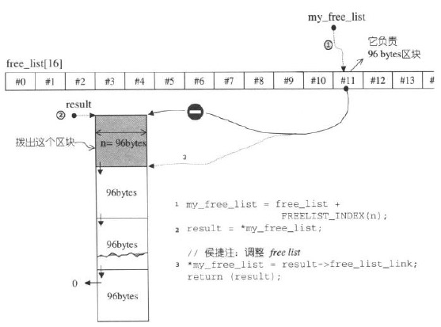 </div>

 * 空间释放函数[deallocate()](tass-sgi-stl-2.91.57-source/stl_alloc.h#L433)
     - 若区块大于128bytes，就调用第一级分配器
     - 若区块小于128bytes，找出对应的free-list，将区块回收
     
<div align="center"> 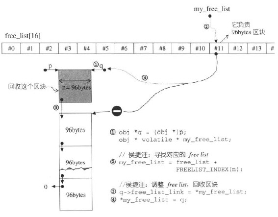 </div>

* 重新填充free-list的函数[refill()](tass-sgi-stl-2.91.57-source/stl_alloc.h#L537)
    - 若free-list中没有可用区块时，会调用chunk_alloc**从内存池**中申请空间重新填充free-list。缺省申请20个新节点(新区块)，如果内存池空间不足，获得的节点数可能小于20

* [chunk_alloc()](tass-sgi-stl-2.91.57-source/stl_alloc.h#L465)函数从内存池申请空间，根据end_free-start_free判断内存池中剩余的空间
    - 如果剩余空间充足
        + 直接调出20个区块返回给free-list
    - 如果剩余空间不足以提供20个区块，但足够供应至少1个区块
        + 拨出这不足20个区块的空间
    - 如果剩余空间连一个区块都无法供应
        + 利用malloc()从heap中分配内存（大小为需求量的2倍，加上一个随着分配次数增加而越来越大的附加量），为内存池注入新的可用空间（**详细例子见下图**）
        + 如果malloc()获取失败，chunk_alloc()就四处寻找有无”尚有未用且区块足够大“的free-list。找到了就挖出一块交出
        + 如果上一步仍未成功，那么就调用第一级分配器，第一级分配器有out-of-memory处理机制，或许有机会释放其它的内存拿来此处使用。如果可以，就成功，否则抛出bad_alloc异常
    
    <div align="center"> 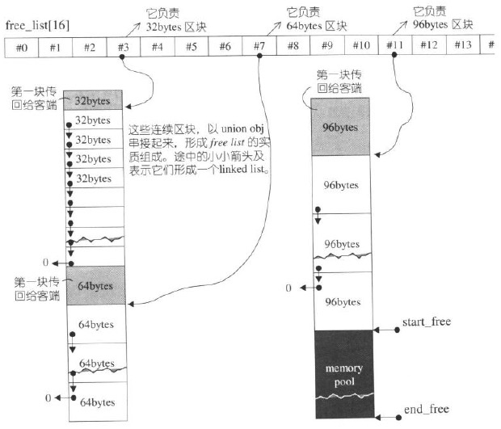 </div>

    上图中，一开始就调用chunk_alloc(32,20)，于是malloc()分配40个32bytes区块，其中第1个交出，另19个交给free-list[3]维护，余20个留给内存池；接下来客户调用chunk_alloc(64,20)，此时free_list[7]空空如也，必须向内存池申请。内存池只能供应(32\*20)/64=10个64bytes区块，就把这10个区块返回，第1个交给客户，余9个由free_list[7]维护。此时内存池全空。接下来再调用chunk_alloc(96,20)，此时free-list[11]空空如也，必须向内存池申请。而内存池此时也为空，于是以malloc()分配40+n(附加量)个96bytes区块，其中第1个交出，另19个交给free-list[11]维护，余20+n(附加量)个区块留给内存池...

### 3.3 内存基本处理工具

STL定义了5个全局函数，作用于未初始化空间上，有助于容器的实现：

* 作用于单个对象（见[3.1 对象构造与析构](#31-对象构造与析构)，SGI STL定义在头文件[<stl_construct.h>](tass-sgi-stl-2.91.57-source/stl_construct.h)中）
    - construct()函数（构造单个对象）
    - destroy()函数（析构单个对象）
* 作用于容器的区间（本节，SGI STL定义在头文件[<stl_uninitialized.h>](tass-sgi-stl-2.91.57-source/stl_uninitialized.h)中，是高层copy()、fill()、fill_n()的底层函数）
    - [uninitialized_copy()](tass-sgi-stl-2.91.57-source/stl_uninitialized.h#L76)函数
    - [uninitialized_fill()](tass-sgi-stl-2.91.57-source/stl_uninitialized.h#L171)函数
    - [uninitialized_fill_n()](tass-sgi-stl-2.91.57-source/stl_uninitialized.h#L218)函数

容器的全区间构造函数通常分2步：

1. 分配内存区块，足以包含范围内的所有元素
2. 调用上述3个函数在全区间范围内构造对象（因此，这3个函数使我们能够将内存的分配与对象的构造行为分离；并且3个函数都具有”commit or rollback“语意，要么所有对象都构造成功，要么一个都没有构造）

<div align="center"> 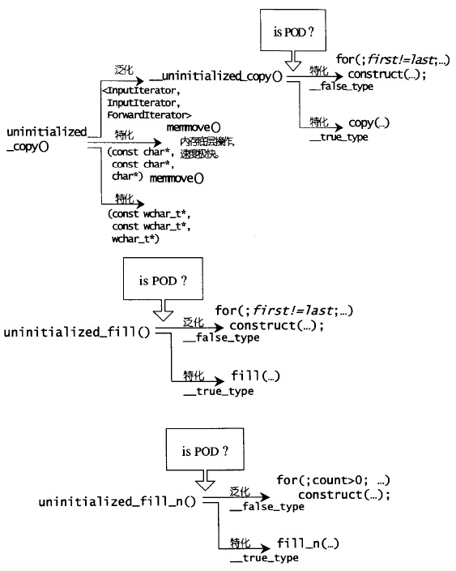 </div>

<br>

# 三.迭代器与traits编程技法

## 1.迭代器相应类型

在算法中运用迭代器时，很可能会用到其相应类型。所谓相应类型，迭代器所指之物的类型便是其中之一，算法可以在函数体中使用迭代器所指之物的类型来定义变量，也可能将迭代器所指之物的类型作为算法的返回值：

<div align="center"> 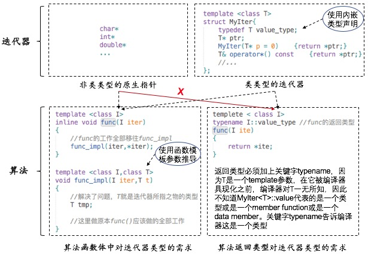 </div>

* **在函数体中使用迭代器所指之物的类型**
    - C++支持sizeof()，但并未支持typeof()。即便动用RTTI性质中的typeid()，获得的也只是类型名称，不能拿来做变量声明
    - 这里利用函数模板的参数推导机制解决。算法func()作为对外接口，算法的所有逻辑另外封装在一个实现函数func_impl()中，由于它是一个函数模板，一旦被调用，编译器就会自动进行参数推导，导出类型T
* **迭代器所指之物的类型作为算法的返回类型**
    - 函数模板的参数推导机制推导的是参数，无法推导函数的返回类型
    - 这里使用嵌套类型声明解决。但是，对于类类型的迭代器，可以正常工作，但是**非类类型的原生指针无法处理**

通过上图，可以了解到在算法中对迭代器相应类型的需求。除了迭代器所指之物的类型(value type)，迭代器相应类型还包括另外4种，在traits编程技法中将会介绍，并且会提到如何使用traits来解决上面的问题（这也是STL中实际使用的方法）

## 2.traits编程技法

上一节所使用的方法，在value type作为返回类型时，无法处理非类类型的原生指针。下图使用traits来解决，使用了模板偏特化来处理非类类型的原生指针：

<div align="center"> 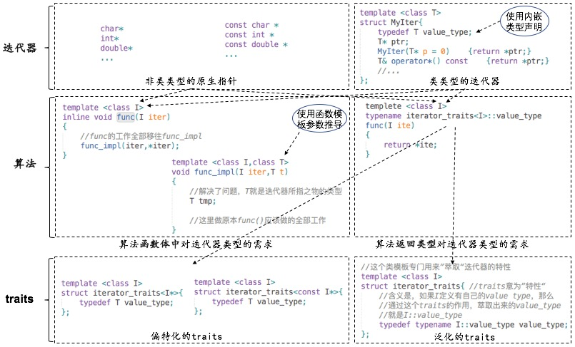 </div>

<br>

现在，不论面对的是迭代器MyIter，或是原生指针int\*或const int\*，都可以通过traits取出正确的value type

<div align="center"> 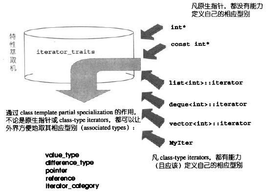 </div>

> 当然，若要“特性萃取机”traits能够有效运作，每一个迭代器必须遵循约定，自行以内嵌类型定义的方式定义出相应类型。这是一个约定，谁不遵守这个约定，谁就不能兼容于STL这个大家庭

**根据经验，最常用到的迭代器相应类型有5种**：

1. **value type**：指迭代器所指对象的类型
2. **difference type**：用以表示两个迭代器之间的距离
3. **pointer**：如果value type是T，那么pointer就是指向T的指针
4. **reference**：如果value type是T，那么reference就是T的引用
5. **iterator category**：迭代器的类型（[详见](#21-迭代器类型)）

    <div align="center"> 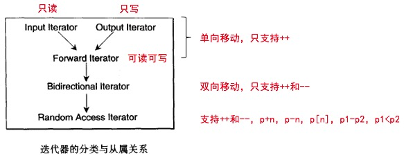 </div>

如果希望开发的容器能与STL相容，一定要为容器定义这5种相应类型。“特性萃取机”traits会很忠实地将特性萃取出来：

```c++
template <class Iterator>
struct iterator_traits{
    typedef typename Iterator::iterator_category   iterator_category;
    typedef typename Iterator::value_type          value_type;
    typedef typename Iterator::difference_type     difference_type;
    typedef typename Iterator::pointer             pointer;
    typedef typename Iterator::reference           reference;
};
```

iterator_traits必须针对传入的类型为pointer及pointer-to-const者设计偏特化版本：

```c++
//以C++内建的ptrdiff_t（定义于<cstddef>头文件）作为原生指针的difference type

//针对原生指针的偏特化版本
template <class T>
struct iterator_traits<T*>{
    //原生指针是一种Random Access Iterator
    typedef random_access_iterator_tag   iterator_category;
    typedef T                            value_type;
    typedef ptrdiff_t                    difference_type;
    typedef T*                           pointer;
    typedef T&                           reference;
};

//针对原生pointer-to-const的偏特化版本
template <class T>
struct iterator_traits<const T*>{
    //原生指针是一种Random Access Iterator
    typedef random_access_iterator_tag   iterator_category;
    typedef T                            value_type;
    typedef ptrdiff_t                    difference_type;
    typedef const T*                     pointer;
    typedef const T&                     reference;
};
```

STL提供以下函数，简化迭代器相应类型的萃取：

```c++
//这个函数可以很方便地萃取category
template <class Iterator>
inline typename iterator_traits<Iterator>::iterator_category
iterator_category(const Iterator&) {
  typedef typename iterator_traits<Iterator>::iterator_category category;
  return category();
}

//这个函数可以很方便地萃取distance type
template <class Iterator>
inline typename iterator_traits<Iterator>::difference_type*
distance_type(const Iterator&) {
  return static_cast<typename iterator_traits<Iterator>::difference_type*>(0);
}

//这个函数可以很方便地萃取value type
template <class Iterator>
inline typename iterator_traits<Iterator>::value_type*
value_type(const Iterator&) {
  return static_cast<typename iterator_traits<Iterator>::value_type*>(0);
}
```

### 2.1 迭代器类型

设计算法时，如果可能，尽量针对某种迭代器提供一个明确定义，并针对更强化的某种迭代器提供另一种定义，这样才能在不同情况下提供最大效率，如下图的advanced()函数，用于移动迭代器：

<div align="center"> 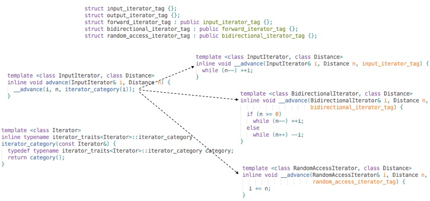 </div>

在上图中，每个__advance()的最后一个参数都只声明类型，并未指定参数名称，因为它纯粹只是用来激活重载机制，函数之中根本不使用该参数。如果加上参数名称也没有错，但是没必要

将advance()中的iterator_category(i)展开得到iterator_traits\<InputIterator\>::iterator_category()，这会产生一个临时对象，其类型隶属于几种迭代器中的一种。然后，根据这个类型，编译器才决定调用哪一个__advance()重载函数

**上图以class来定义迭代器的各种分类标签，有下列好处**：

* 可以促成重载机制的成功运作
* **通过继承，可以不必再写“单纯只做传递调用”的函数（如__advance()的Forward Iterator版只是单纯的调用Input Iterator版，因此可以省略）,可以通过[这个例子](stlbookcode/c3/3tag-test.cpp)来模拟证实**


## 3.std::iterator的保证

为了符合规范，任何迭代器都应该提供5个内嵌相应类型，以便于traits萃取，否则便是自别于整个STL架构，可能无法与其它STL组件顺利搭配。然而，写代码难免会有遗漏。因此，STL提供了一个iterators class如下，如果每个新设计的迭代器都继承自它，就可保证符合STL所需的规范；

```c++
template <class Category,
          class T,
          class Distance = ptrdiff_t,
          class Pointer = T*,
          class Reference = T&>
struct iterator{
    typedef Category    iterator_category;
    typedef T           value_type;
    typedef Distance    difference_type;
    typedef Pointer     pointer;
    typedef Reference   reference;
};
```

iterator class不含任何成员，存粹只是类型定义，所以继承它不会导致任何额外负担。由于后3个参数皆有默认值，故新的迭代器只需提供前2个参数即可。以下为一个继承示例：

```c++
template <class Item>
struct ListIter : public std::iterator<std::forword_iterator_tag, Item>{
    ...
};
```

## 4.SGI STL的__type_traits

SGI将STL的traits进一步扩大到迭代器以外，于是有了所谓的__type_traits，它属于SGI STL，不属于STL标准规范

* iterator_traits：负责萃取迭代器的特性
* __type_traits：负责萃取类型的特性，包括：
    - 该类型是否具备non-trivial default ctor
    - 该类型是否具备non-trivial copy ctor
    - 该类型是否具备non-trivial assignment operator
    - 该类型是否具备non-trivial dtor

通过使用__type_traits，在对某个类型进行构造、析构、拷贝、赋值等操作时，就可以采用最有效率的措施。这对于大规模而操作频繁的容器，有着显著的效率提升

萃取类型的特性时，我们希望得到一个”真“或”假“（以便决定采取什么策略），但其结果不应该只是个bool值，应该是个有着真/假性质的”对象”，因为我们希望利用响应的结果来进行参数推导，而编译器只有面对class object形式的参数，才会做参数推导，所以萃取类型的特性时，返回__true_type或__false_type：

```c++
struct __true_type { };
struct __false_type { };
```

模板类__type_traits的泛化与特化/偏特化见下图：

<div align="center"> 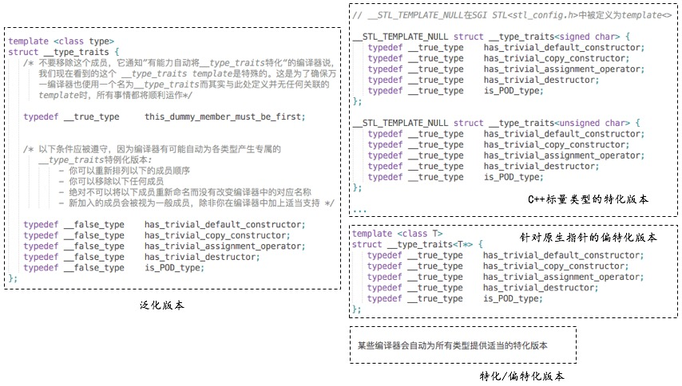 </div>

<br>

# 四.顺序容器

<div align="center"> 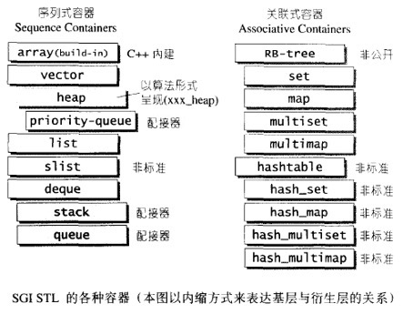 </div>

上图中的“衍生”并非“派生”，而是内含关系。例如heap内含一个vector，priority-queue内含一个heap，stack和queue都含一个deque，set/map/multiset/multimap都内含一个RB-tree，has_x都内含一个hashtable

## 1.vector

array是静态空间，一旦配置了就不能改变；vector与array非常相似，但是vector是动态空间，随着元素的加入，内部机制会自动扩充以容纳新元素

SGI STL中[vector的定义](tass-sgi-stl-2.91.57-source/stl_vector.h#L12)

<div align="center"> 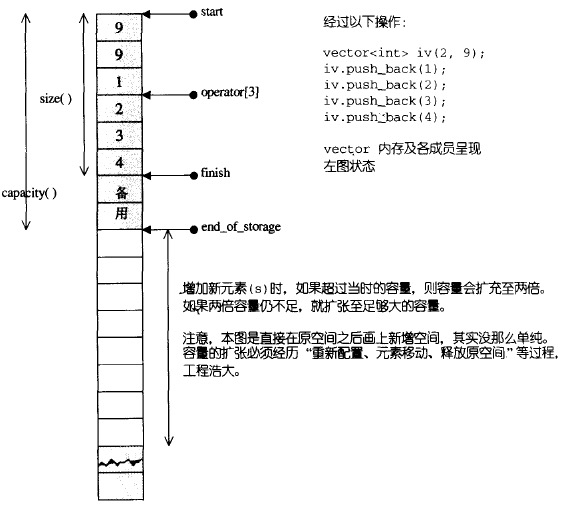 </div>

### 1.1 迭代器

vector维护的是一个连续线性空间，所以不论其元素类型为何，普通指针都可以作为vector的迭代器而满足所有必要条件，因为vector迭代器所需要的操作行为，如operator\*，operator->，operator++，operator--，operator+，operator-，operator+=，operator-=，普通指针天生就具备。vector支持随机存取，而普通指针正有着这样的能力。所以，vector提供的是Random Access Iterators：

```c++
template <class T,class Alloc = alloc>
class vector{
public:
    typedef T               value_type;
    typedef value_type*     iterator;   //vector的迭代器时普通指针
...
};
```

### 1.2 分配器

vector缺省使用alloc作为空间分配器，并据此另外定义了一个data_allocator，为的是更方便以元素大小为配置单位：

```c++
template<class T,class Alloc = alloc>
class vector{
protected:
    typedef simple_alloc<value_type,Alloc> data_allocator;
...
};
```

因此，data_allocator::allocate(n)表示分配n个元素空间

### 1.3 vector操作的实现

常见的vector操作包括：

* [vector(size_type n,const T &value)](tass-sgi-stl-2.91.57-source/stl_vector.h#L98)
    - [fill_initialize(size_type n,const T &value)](tass-sgi-stl-2.91.57-source/stl_vector.h#L98)
        + [allocate_and_fill(size_type n, const T& x)](tass-sgi-stl-2.91.57-source/stl_vector.h#L213)
* [push_back(const T &x)](tass-sgi-stl-2.91.57-source/stl_vector.h#L144)
    - [insert_aux(iterator position,const T &x)](tass-sgi-stl-2.91.57-source/stl_vector.h#L323)
* [pop_back()](tass-sgi-stl-2.91.57-source/stl_vector.h#L186)
* [erase(iterator first, iterator last)](tass-sgi-stl-2.91.57-source/stl_vector.h#L197)
* [erase(iterator position)](tass-sgi-stl-2.91.57-source/stl_vector.h#L190)
* [insert(iterator position, size_type n, const T& x)](tass-sgi-stl-2.91.57-source/stl_vector.h#L361)

**插入操作可能造成vector的3个指针重新配置，导致原有的迭代器全部失效**

## 2.list

SGI STL中[list的定义](tass-sgi-stl-2.91.57-source/stl_list.h#L124)

### 2.1 节点

<div align="center"> 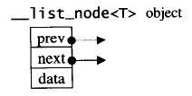 </div>

```c++
template <class T>
struct __list_node{
    typedef void* void_pointer;
    void_pointer prev;  //类型为void*
    void_pointer next;
    T data;
};
```

### 2.2 迭代器

list不再能够像vector一样以普通指针作为迭代器，因为其节点不保证在存储空间中连续存在

list迭代器必须有能力指向list的节点，并有能力进行正确的递增、递减、取值、成员存取等操作。list中，迭代器与节点的关系见下图：

<div align="center"> 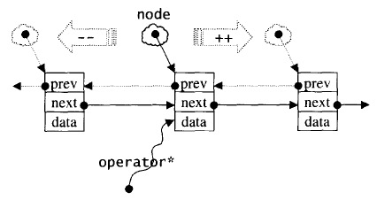 </div>

由于STL list是一个双向链表，迭代器必须具备前移、后移的能力，所以list提供的是Bidirectional Iterators

**list的插入和接合操作都不会造成原有的list迭代器失效，对于删除操作，也只有”指向被删除元素“的那个迭代器失效，其它迭代器不受任何影响**

```c++
template<class T, class Ref, class Ptr>
struct __list_iterator {
  typedef __list_iterator<T, T&, T*>             iterator;
  typedef __list_iterator<T, const T&, const T*> const_iterator;
  typedef __list_iterator<T, Ref, Ptr>           self;

  typedef bidirectional_iterator_tag iterator_category;
  typedef T value_type;
  typedef Ptr pointer;
  typedef Ref reference;
  typedef __list_node<T>* link_type;//节点指针类型link_type
  typedef size_t size_type;
  typedef ptrdiff_t difference_type;

  link_type node;//迭代器内部的指针，指向list的节点

  __list_iterator(link_type x) : node(x) {}
  __list_iterator() {}
  __list_iterator(const iterator& x) : node(x.node) {}

  bool operator==(const self& x) const { return node == x.node; }
  bool operator!=(const self& x) const { return node != x.node; }
  //对迭代器取值，取的是节点的数据值
  reference operator*() const { return (*node).data; }

#ifndef __SGI_STL_NO_ARROW_OPERATOR
  //以下是迭代器的成员存取运算子的标准做法
  pointer operator->() const { return &(operator*()); }
#endif /* __SGI_STL_NO_ARROW_OPERATOR */

  //对迭代器累加1，就是前进一个节点
  self& operator++() { 
    node = (link_type)((*node).next);
    return *this;
  }
  self operator++(int) { 
    self tmp = *this;
    ++*this;
    return tmp;
  }

  //对迭代器递减1，就是后退一个节点
  self& operator--() { 
    node = (link_type)((*node).prev);
    return *this;
  }
  self operator--(int) { 
    self tmp = *this;
    --*this;
    return tmp;
  }
};
```

### 2.3 list的数据结构

SGI list不仅是一个双向链表，还是一个环状双向链表。所以它只需要一个指针，便可完整表现整个链表：

```c++
template <class T, class Alloc = alloc>
class list {
protected:
    typedef __list_node<T> list_node;
public:
    typedef list_node* link_type;

protected:
    link_type node; //只要一个指针，便可表示整个环状双向链表
};

iterator begin() { return (link_type)((*node).next); }
iterator end() { return node; }
size_type size() const {
    size_type result = 0;
    distance(begin(), end(), result);
    return result;
}
```

<div align="center"> 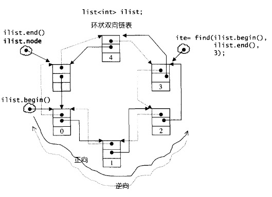 </div>

### 2.4 分配器

list缺省使用alloc作为空间分配器，并据此另外定义了一个list_node_allocator，为的是更方便以节点大小为配置单位：

```c++
template <class T, class Alloc = alloc>
class list {
protected:
    typedef simple_alloc<list_node, Alloc> list_node_allocator;
...
};
```

因此，list_node_allocator::allocate(n)表示分配n个节点空间

### 2.5 list操作的实现

* 节点操作
    - 分配一个节点：[get_node](tass-sgi-stl-2.91.57-source/stl_list.h#L156)
    - 释放一个节点：[put_node](tass-sgi-stl-2.91.57-source/stl_list.h#L157)
    - 生成（分配并构造）一个节点：[create_node](tass-sgi-stl-2.91.57-source/stl_list.h#L159)
    - 销毁（析构并释放）一个节点：[destroy_node](tass-sgi-stl-2.91.57-source/stl_list.h#L167)
    - 节点插入：[push_back](tass-sgi-stl-2.91.57-source/stl_list.h#L269)和[push_front](tass-sgi-stl-2.91.57-source/stl_list.h#L268)
        + [insert](tass-sgi-stl-2.91.57-source/stl_list.h#L243)
    - 节点移除：[erase](tass-sgi-stl-2.91.57-source/stl_list.h#L270),[pop_front](tass-sgi-stl-2.91.57-source/stl_list.h#L283)和[pop_back](tass-sgi-stl-2.91.57-source/stl_list.h#L284)
    - 移除某一数值的所有节点：[remove](tass-sgi-stl-2.91.57-source/stl_list.h#L468)
    - 移除数值相同的连续节点：[unique](tass-sgi-stl-2.91.57-source/stl_list.h#L480)
* 链表操作
    - 创建一个空链表：[list()](tass-sgi-stl-2.91.57-source/stl_list.h#L217)
        + [empty_initialize](tass-sgi-stl-2.91.57-source/stl_list.h#L173)
    - 链表清空：[clear](tass-sgi-stl-2.91.57-source/stl_list.h#L438)
* 链表拼接：[splice](tass-sgi-stl-2.91.57-source/stl_list.h#L328)
    - 将[first,last)内的元素移动到position之前：[transfer](tass-sgi-stl-2.91.57-source/stl_list.h#L315)（[first,last)区间可以在同一个list之中，transfer并非公开接口，公开的是splice）
    
    <div align="center"> 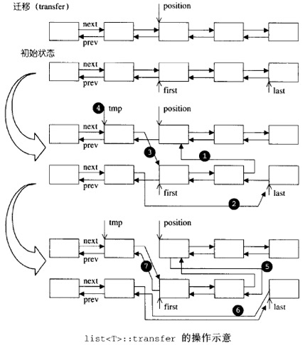 </div>

## 3.deque

deque是一种双向开口的连续线性空间

deque和vector最大的差异：

1. deque允许于常数时间内对起头端进行元素的插入或移除操作
2. deque没有所谓容量观念，因为它是动态地以分段连续空间组合而成，随时可以增加一段新的空间并链接起来（deque没有必要提供所谓的空间保留功能）

### 3.1 迭代器

deque是分段连续空间。维持其”整体连续“假象的任务，落在了迭代器的operator++和operator--两个运算子身上

deque迭代器必须能够指出分段连续空间（即缓冲区）在哪；必须能够判断自己是否已经处于其所在缓冲器的边缘。为了能够正确跳跃，迭代器必须随时掌握中控器map

```c++
template <class T, class Ref, class Ptr, size_t BufSiz>
struct __deque_iterator {   //未继承std::iterator
  typedef __deque_iterator<T, T&, T*, BufSiz>             iterator;
  typedef __deque_iterator<T, const T&, const T*, BufSiz> const_iterator;
  static size_t buffer_size() {return __deque_buf_size(BufSiz, sizeof(T)); }

  //为继承std::iterator，所以必须自行撰写5个必要的迭代器相应类型
  typedef random_access_iterator_tag iterator_category; // (1)
  typedef T value_type;                                 // (2)
  typedef Ptr pointer;                                  // (3)
  typedef Ref reference;                                // (4)
  typedef size_t size_type;
  typedef ptrdiff_t difference_type;                    // (5)
  typedef T** map_pointer;

  typedef __deque_iterator self;

  //保持与容器的联结
  T* cur;           //此迭代器所指缓冲区中的当前元素
  T* first;         //此迭代器所指缓冲区的头
  T* last;          //此迭代器所指缓冲区的尾(含备用空间)
  map_pointer node; //指向中控器map
...
};
```

迭代器操作：

* 更新迭代器指向的缓冲区：set_node
* [解引用\*](tass-sgi-stl-2.91.57-source/stl_deque.h#L130) 
* [成员选择->](tass-sgi-stl-2.91.57-source/stl_deque.h#L132)
* [迭代器相减-](135)
* [前置++](tass-sgi-stl-2.91.57-source/stl_deque.h#L140)和[后置++](tass-sgi-stl-2.91.57-source/stl_deque.h#L148)
* [前置--](tass-sgi-stl-2.91.57-source/stl_deque.h#L154)和[后置--](tass-sgi-stl-2.91.57-source/stl_deque.h#L162)
* 复合赋值[+=](tass-sgi-stl-2.91.57-source/stl_deque.h#L168)和[-=](tass-sgi-stl-2.91.57-source/stl_deque.h#L187)
* 迭代器[+n](tass-sgi-stl-2.91.57-source/stl_deque.h#L182)和[-n](tass-sgi-stl-2.91.57-source/stl_deque.h#L189)
* 随机存取[\[\]](tass-sgi-stl-2.91.57-source/stl_deque.h#L194)
* 相等判断[==](tass-sgi-stl-2.91.57-source/stl_deque.h#L196)，[!=](tass-sgi-stl-2.91.57-source/stl_deque.h#L197)和[<](tass-sgi-stl-2.91.57-source/stl_deque.h#L198)

### 3.3 deque的数据结构

deque采用一块所谓的map作为**主控(中控器)**。这里所谓的map是指一小块连续空间，其中每个元素都是一个指针，指向另一段（较大的）连续线性空间，称为缓冲区。缓冲区才是deque的存储空间主体。SGI STL允许我们指定缓冲区大小，默认值0表示使用512bytes缓冲区

<div align="center"> 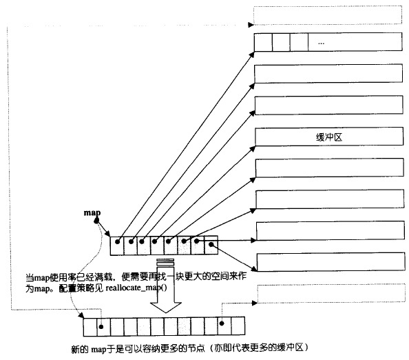 </div>

deque除了维护一个指向map的指针外，也维护start，finish两个迭代器。分别指向第一缓冲区的第一个元素和最后缓冲区的最后一个元素（的下一位置）。此外，也必须记住目前的map大小。因为一旦map所提供的节点不足，就必须重新配置更大的一块map

```c++
temlate <class T,class Alloc = alloc,size_t BufSiz = 0>
class deque{
public:     //Basic types
    typedef T value_type;
    typedef value_type* pointer;
    typedef size_t size_type;
    ...

public:
    typedef __deque_iterator<T,T&.T*,BufSiz> iterator;  //迭代器类型

protected:  //Internal typedefs
    //元素的指针的指针
    typedef pointer* map_pointer;

protected:  //Data members
    iterator start;         //第一个节点的迭代器
    iterator finish;        //最后一个节点的迭代器

    map_pointer map;        //指向map，map是块连续空间
                            //其每个元素都是个指针，指向一个节点(缓冲区)
    size_type map_size;     //map的大小，即内有多少个指针
...
};
```

deque的中控器、缓冲区、迭代器的关系如下图：

<div align="center">  </div>

### 3.4 分配器

deque自行定义了2个专属的空间配置器：

```c++
protected:
    //专属的空间分配器，每次分配一个元素大小
    typedef simple_alloc<value_type,Alloc> data_allocator;
    //专属的空间分配器，每次分配一个指针大小
    typedef simple_alloc<pointer,Alloc> map_allocator;
```

### 3.5 deque操作的实现

* deque构造与初始化：[deque](tass-sgi-stl-2.91.57-source/stl_deque.h#L360)
    - 元素初始化[fill_initialize](tass-sgi-stl-2.91.57-source/stl_deque.h#L847)
        + 空间分配与成员设定[create_map_and_nodes](tass-sgi-stl-2.91.57-source/stl_deque.h#L797)
* 插入操作：
    - 在队列末尾插入：[push_back](tass-sgi-stl-2.91.57-source/stl_deque.h#L439)
        + 最后缓冲区只有1个可用空间时：[push_back_aux](tass-sgi-stl-2.91.57-source/stl_deque.h#L898)
            * map不足时：[reserve_map_at_back](tass-sgi-stl-2.91.57-source/stl_deque.h#L632)
                - [reallocate_map](tass-sgi-stl-2.91.57-source/stl_deque.h#L1289)
    - 在队列首部插入：[push_front](tass-sgi-stl-2.91.57-source/stl_deque.h#L448)
        + 第一个缓冲区没有可用空间时：[push_front_aux](tass-sgi-stl-2.91.57-source/stl_deque.h#L912)
            * map不足时：[reserve_map_at_front](tass-sgi-stl-2.91.57-source/stl_deque.h#L639)
                - [reallocate_map](tass-sgi-stl-2.91.57-source/stl_deque.h#L1289)
    - 指定位置插入一个元素：[insert](tass-sgi-stl-2.91.57-source/stl_deque.h#L447)
        + 在首部插入：push_front
        + 在尾部插入：push_back
        + 在中间插入：[insert_aux](tass-sgi-stl-2.91.57-source/stl_deque.h#L994)
* 弹出操作：
    - 弹出队列末尾元素：[pop_back](tass-sgi-stl-2.91.57-source/stl_deque.h#L457)
        + 最后缓冲区没有元素时：[pop_back_aux](tass-sgi-stl-2.91.57-source/stl_deque.h#L933)
    - 弹出队列首部元素：[pop_front](tass-sgi-stl-2.91.57-source/stl_deque.h#L466)
        + 第一个缓冲区仅有一个元素时：[pop_front_aux](tass-sgi-stl-2.91.57-source/stl_deque.h#L945)
* 清除所有元素：[clear](tass-sgi-stl-2.91.57-source/stl_deque.h#L774)
* 清除某个区间的元素：[erase](tass-sgi-stl-2.91.57-source/stl_deque.h#L743)

## 4.stack

具有”修改某物接口，形成另一种风貌“的性质者，称为适配器。因此，STL stack往往不被归类为容器，而被归类为容器适配器

SGI STL以deque作为缺省情况下的stack底部结构，定义如下：

```c++
template <class T, class Sequence = deque<T> >
class stack {
  //以下__STL_NULL_TMPL_ARGS会展开为 <>
  friend bool operator== __STL_NULL_TMPL_ARGS (const stack&, const stack&);
  friend bool operator< __STL_NULL_TMPL_ARGS (const stack&, const stack&);
public:
  typedef typename Sequence::value_type value_type;
  typedef typename Sequence::size_type size_type;
  typedef typename Sequence::reference reference;
  typedef typename Sequence::const_reference const_reference;
protected:
  Sequence c;   //底层容器
public:
  //以下完全利用Sequence c的操作，完成stack的操作
  bool empty() const { return c.empty(); }
  size_type size() const { return c.size(); }
  reference top() { return c.back(); }
  const_reference top() const { return c.back(); }
  //deque是两头可进出，stack是后进后出
  void push(const value_type& x) { c.push_back(x); }
  void pop() { c.pop_back(); }
};

template <class T, class Sequence>
bool operator==(const stack<T, Sequence>& x, const stack<T, Sequence>& y) {
  return x.c == y.c;
}

template <class T, class Sequence>
bool operator<(const stack<T, Sequence>& x, const stack<T, Sequence>& y) {
  return x.c < y.c;
}
```

只有stack顶端的元素有机会被外界取用，stack不提供遍历功能，也**不提供迭代器**

**指定其它容器作为stack的底层容器的方法：**

```c++
stack<int,list<int> > istack;
```

## 5.queue

queue（队列）是一种先进先出的数据结构，尾端插入，首部移出

SGI STL以deque作为缺省情况下的queue底部结构，定义如下：

```c++
template <class T, class Sequence = deque<T> >
class queue {
  //以下__STL_NULL_TMPL_ARGS会展开为 <>
  friend bool operator== __STL_NULL_TMPL_ARGS (const queue& x, const queue& y);
  friend bool operator< __STL_NULL_TMPL_ARGS (const queue& x, const queue& y);
public:
  typedef typename Sequence::value_type value_type;
  typedef typename Sequence::size_type size_type;
  typedef typename Sequence::reference reference;
  typedef typename Sequence::const_reference const_reference;
protected:
  Sequence c;   //底层容器
public:
  //以下完全利用Sequence c的操作，完成stack的操作
  bool empty() const { return c.empty(); }
  size_type size() const { return c.size(); }
  reference front() { return c.front(); }
  const_reference front() const { return c.front(); }
  reference back() { return c.back(); }
  const_reference back() const { return c.back(); }
  //deque是两头可进出，queue是尾端进、首部出
  void push(const value_type& x) { c.push_back(x); }
  void pop() { c.pop_front(); }
};

template <class T, class Sequence>
bool operator==(const queue<T, Sequence>& x, const queue<T, Sequence>& y) {
  return x.c == y.c;
}

template <class T, class Sequence>
bool operator<(const queue<T, Sequence>& x, const queue<T, Sequence>& y) {
  return x.c < y.c;
}
```

只有首部元素才有机会被外界取用，queue不提供遍历功能，也**不提供迭代器**

**指定其它容器作为queue的底层容器的方法：**

```c++
queue<int,list<int> > iqueue;
```

## 6.heap

heap并不归属与STL容器组件，它是个幕后英雄，扮演priority queue的助手

heap是一颗完全二叉树，完全二叉树使用数组实现，因此使用一个vector作为heap的结构，然后通过一组xxx_heap算法，使其符合heap的性质

* 上溯（在此之前应该push_back）：[push_heap](tass-sgi-stl-2.91.57-source/stl_heap.h#L60)
    - [__push_heap_aux](tass-sgi-stl-2.91.57-source/stl_heap.h#L53)
        + [__push_heap](tass-sgi-stl-2.91.57-source/stl_heap.h#L40)
    
    <div align="center"> 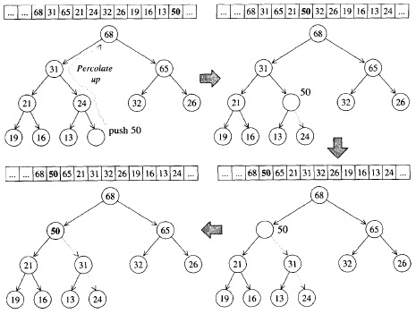 </div>

* [pop_heap](tass-sgi-stl-2.91.57-source/stl_heap.h#L124)（在此之后应该pop_back）
    - [__pop_heap_aux](tass-sgi-stl-2.91.57-source/stl_heap.h#L118)
        + [__pop_heap](tass-sgi-stl-2.91.57-source/stl_heap.h#L110)
            * [__adjust_heap](tass-sgi-stl-2.91.57-source/stl_heap.h#L91)
    
    <div align="center"> 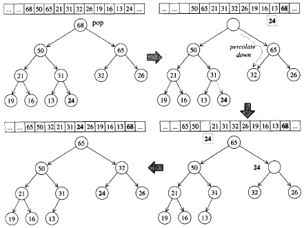 </div>

* [sort_heap](tass-sgi-stl-2.91.57-source/stl_heap.h#L209)
    
    <div align="center"> 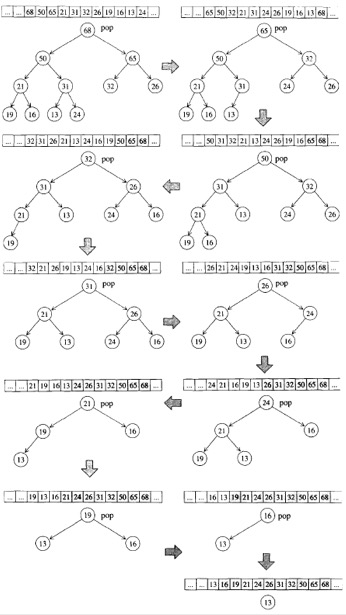 </div>

* [make_heap](tass-sgi-stl-2.91.57-source/stl_heap.h#L184)
    - [__make_heap](tass-sgi-stl-2.91.57-source/stl_heap.h#L189)

## 7.priority_queue

顾名思义，priority_queue就是具有优先级的queue，允许首部移出，尾端插入。缺省情况下利用一个max-heap完成，因此首部元素优先级最高

以下为SGI STL中priority_queue的定义：

```c++
template <class T, class Sequence = vector<T>, 
          class Compare = less<typename Sequence::value_type> >
class  priority_queue {
public:
  typedef typename Sequence::value_type value_type;
  typedef typename Sequence::size_type size_type;
  typedef typename Sequence::reference reference;
  typedef typename Sequence::const_reference const_reference;
protected:
  Sequence c;       //底层容器
  Compare comp;     //元素大小比较标准
public:
  priority_queue() : c() {}
  explicit priority_queue(const Compare& x) :  c(), comp(x) {}

  //以下用到的make_heap()、push_heap()、pop_heap()都是泛型算法
  //构造一个priority queue，首先根据传入的迭代器区间初始化底层容器c，然后调用
  //make_heap()使用底层容器建堆
  template <class InputIterator>
  priority_queue(InputIterator first, InputIterator last, const Compare& x)
    : c(first, last), comp(x) { make_heap(c.begin(), c.end(), comp); }
  template <class InputIterator>
  priority_queue(InputIterator first, InputIterator last) 
    : c(first, last) { make_heap(c.begin(), c.end(), comp); }

  bool empty() const { return c.empty(); }
  size_type size() const { return c.size(); }
  const_reference top() const { return c.front(); }
  void push(const value_type& x) {
    //先利用底层容器的push_back()将新元素推入末端，再重排heap
    __STL_TRY {
      c.push_back(x); 
      push_heap(c.begin(), c.end(), comp);
    }
    __STL_UNWIND(c.clear());
  }
  void pop() {
    //从heap内取出一个元素。但不是真正弹出，而是重排heap，然后以底层容器的pop_back()
    //取得被弹出的元素
    __STL_TRY {
      pop_heap(c.begin(), c.end(), comp);
      c.pop_back();
    }
    __STL_UNWIND(c.clear());
  }
};
```

和queue一样，priority queue只有首部的元素有机会被外界取用。不提供遍历功能，也**不提供迭代器**

## 8.slist

slist**并不在标准规格之内**，由SGI STL提供，slist和list不同的是slist是单链表

单链表每个节点的消耗更小，但是只支持单向遍历，所以功能会受到许多限制

SGI STL中[slist的定义](tass-sgi-stl-2.91.57-source/stl_slist.h#L175)

### 8.1 slist的节点

<div align="center"> 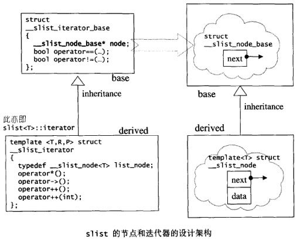 </div>

节点相关的结构：

```c++
//单向链表的节点基本结构
struct __slist_node_base
{
    __slist_node_base *next;
};

//单向链表的节点结构
template <class T>
struct __slist_node : public __slist_node_base
{
    T data;
}
```

节点相关的全局函数：

```c++
//已知某一节点prev_node，将新节点new_node插入其后
inline __slist_node_base* __slist_make_link(
    __slist_node_base *prev_node,
    __slist_node_base *new_node)
{
    //令new节点的下一节点为prev节点的下一节点
    new_node->next = prev_node->next;
    prev_node->next = new_node; //令prev节点的下一节点指向new节点
    return new_node;
}

//单向链表的大小（元素个数）
inline size_t __slist_size(__slist_node_base *node)
{
    size_t result = 0;
    for(;node != 0;node = node->next)
        ++result;   //一个个累计
    return result;
}
```

### 8.2 slist的迭代器

<div align="center"> 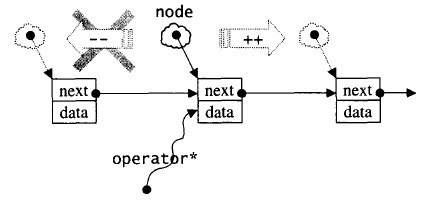 </div>

迭代器的定义如下：

```c++
//单向链表的迭代器基本结构
struct __slist_iterator_base
{
  typedef size_t size_type;
  typedef ptrdiff_t difference_type;
  typedef forward_iterator_tag iterator_category;   //单向

  __slist_node_base* node;  //指向节点基本结构

  __slist_iterator_base(__slist_node_base* x) : node(x) {}

  void incr() { node = node->next; }    //前进一个节点

  bool operator==(const __slist_iterator_base& x) const {
    return node == x.node;
  }
  bool operator!=(const __slist_iterator_base& x) const {
    return node != x.node;
  }
};

//单向链表的迭代器结构
template <class T, class Ref, class Ptr>
struct __slist_iterator : public __slist_iterator_base
{
  typedef __slist_iterator<T, T&, T*>             iterator;
  typedef __slist_iterator<T, const T&, const T*> const_iterator;
  typedef __slist_iterator<T, Ref, Ptr>           self;

  typedef T value_type;
  typedef Ptr pointer;
  typedef Ref reference;
  typedef __slist_node<T> list_node;

  __slist_iterator(list_node* x) : __slist_iterator_base(x) {}
  __slist_iterator() : __slist_iterator_base(0) {}
  __slist_iterator(const iterator& x) : __slist_iterator_base(x.node) {}

  reference operator*() const { return ((list_node*) node)->data; }
  pointer operator->() const { return &(operator*()); }

  self& operator++()
  {
    incr(); //前进一个节点
    return *this;
  }
  self operator++(int)
  {
    self tmp = *this;
    incr(); //前进一个节点
    return tmp;
  }
};
```

<br>

# 五.关联容器

<div align="center">  </div>

标准的STL关联容器分为set(集合)和map(映射表)两大类，以及这两大类的衍生体multiset(多键集合)和multimap(多键映射表)。这些容器的底层机制均以RB-tree(红黑树)完成。RB-tree也是一个独立容器，但并不开放给外界使用

此外，SGI STL还提供了一个不在标准规格之列的关联容器：hash table，以及以此hash table为底层机制而完成的hash_set(散列集合)、hash_map(散列映射表)、hash_multiset(散列多键集合)、hash_multimap(散列多键映射表)

## 1.RB-tree

### 1.1 RB-tree的节点

```c++
typedef bool __rb_tree_color_type;
const __rb_tree_color_type __rb_tree_red = false;   //红色为0
const __rb_tree_color_type __rb_tree_black = true;  //黑色为1

//RB-tree节点的基类
struct __rb_tree_node_base
{
  typedef __rb_tree_color_type color_type;
  typedef __rb_tree_node_base* base_ptr;

  color_type color; //颜色
  base_ptr parent;  //指向父节点的指针
  base_ptr left;    //指向左子节点的指针
  base_ptr right;   //指向右子节点的指针

  //静态函数，获取以x为根节点的RB-tree最小节点的指针
  static base_ptr minimum(base_ptr x)
  {
    while (x->left != 0) x = x->left;
    return x;
  }

  //静态函数，获取以x为根节点的RB-tree最大节点的指针
  static base_ptr maximum(base_ptr x)
  {
    while (x->right != 0) x = x->right;
    return x;
  }
};

//RB-tree节点类
template <class Value>
struct __rb_tree_node : public __rb_tree_node_base
{
  typedef __rb_tree_node<Value>* link_type;
  Value value_field;    //RB-tree节点的value
};
```

**键和值都包含在value_field中**

### 1.2 RB-tree的迭代器

SGI将RB-tree迭代器实现为两层：

<div align="center"> 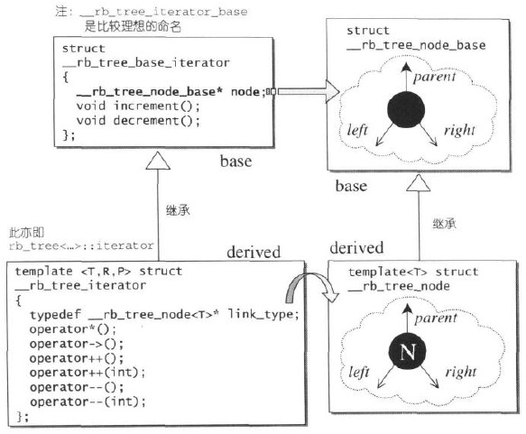 </div>

RB-tree迭代器属于双向迭代器，但不具备随机定位能力。前进操作operator++()调用了基类迭代器的increment()，后退操作operator--()调用了基类迭代器的decrement()。前进或后退的举止行为完全依据二叉搜索树的节点排列法则

```c++
//迭代器基类
struct __rb_tree_base_iterator
{
  typedef __rb_tree_node_base::base_ptr base_ptr;
  typedef bidirectional_iterator_tag iterator_category;
  typedef ptrdiff_t difference_type;

  base_ptr node;    //节点基类类型的指针，将迭代器连接到RB-tree的节点

  void increment()
  {
    if (node->right != 0) {//如果node右子树不为空，则找到右子树的最左子节点
      node = node->right;
      while (node->left != 0)
        node = node->left;
    }
    else {//如果node右子树为空，则找到第一个“该节点位于其左子树”的节点
      base_ptr y = node->parent;
      while (node == y->right) {
        node = y;
        y = y->parent;
      }
      if (node->right != y)
        node = y;
    }
  }

  void decrement()
  {
    if (node->color == __rb_tree_red &&
        node->parent->parent == node)//这种情况发生于node为header时（亦即node为
      node = node->right;            //end()时）header右子节点即mostright，指向max节点
    else if (node->left != 0) {//如果左子树不为空，则找到左子树的最右子节点
      base_ptr y = node->left;
      while (y->right != 0)
        y = y->right;
      node = y;
    }
    else {//如果左子树为空，则找到第一个“该节点位于其右子树”的节点
      base_ptr y = node->parent;
      while (node == y->left) {
        node = y;
        y = y->parent;
      }
      node = y;
    }
  }
};

//迭代器类
template <class Value, class Ref, class Ptr>
struct __rb_tree_iterator : public __rb_tree_base_iterator
{
  typedef Value value_type;
  typedef Ref reference;
  typedef Ptr pointer;
  typedef __rb_tree_iterator<Value, Value&, Value*>             iterator;
  typedef __rb_tree_iterator<Value, const Value&, const Value*> const_iterator;
  typedef __rb_tree_iterator<Value, Ref, Ptr>                   self;
  typedef __rb_tree_node<Value>* link_type; //指向RB-tree节点的指针类型

  __rb_tree_iterator() {}
  __rb_tree_iterator(link_type x) { node = x; }
  __rb_tree_iterator(const iterator& it) { node = it.node; }

  //解引用操作为获取所指RB-tree节点的value
  reference operator*() const { return link_type(node)->value_field; }
#ifndef __SGI_STL_NO_ARROW_OPERATOR
  pointer operator->() const { return &(operator*()); }
#endif /* __SGI_STL_NO_ARROW_OPERATOR */

  //调用父类的increment()，函数会修改node成员，使其指向后一个RB-tree节点
  self& operator++() { increment(); return *this; }
  self operator++(int) {
    self tmp = *this;
    increment();
    return tmp;
  }
    
  //调用父类的decrement()，函数会修改node成员，使其指向前一个RB-tree节点
  self& operator--() { decrement(); return *this; }
  self operator--(int) {
    self tmp = *this;
    decrement();
    return tmp;
  }
};
```

### 1.3 RB-tree操作的实现

SGI STL中[RB-tree的定义](tass-sgi-stl-2.91.57-source/stl_tree.h#L428)

* **节点操作**：
    - 涉及内存管理的操作
        + 分配节点：[get_node](tass-sgi-stl-2.91.57-source/stl_tree.h#L447)
        + 释放节点：[put_node](tass-sgi-stl-2.91.57-source/stl_tree.h#L449)
        + 创建节点：[create_node](tass-sgi-stl-2.91.57-source/stl_tree.h#L452)
        + 拷贝节点：[clone_node](tass-sgi-stl-2.91.57-source/stl_tree.h#L462)
        + 销毁节点：[destroy_node](tass-sgi-stl-2.91.57-source/stl_tree.h#L471)
    - [获取节点成员](tass-sgi-stl-2.91.57-source/stl_tree.h#L489)：
        + left
        + right
        + parent
        + value
        + key
        + color
* **RB-tree操作**
    - 创建空RB-tree：[rb_tree](tass-sgi-stl-2.91.57-source/stl_tree.h#L542)
        + 初始化：[init](tass-sgi-stl-2.91.57-source/stl_tree.h#L532)
    - 获取root节点：[root](tass-sgi-stl-2.91.57-source/stl_tree.h#L485)
    - 获取最左子节点：[leftmost](tass-sgi-stl-2.91.57-source/stl_tree.h#L486)
    - 获取最右子节点：[rightmost](tass-sgi-stl-2.91.57-source/stl_tree.h#L487)
    - 获取起始节点：[begin](tass-sgi-stl-2.91.57-source/stl_tree.h#L575)
    - 获取末尾节点：[end](tass-sgi-stl-2.91.57-source/stl_tree.h#L577)
    - 是否为空：[empty](tass-sgi-stl-2.91.57-source/stl_tree.h#L587)
    - 大小：[size](tass-sgi-stl-2.91.57-source/stl_tree.h#L588)
    - **插入节点**：
        + 节点值独一无二：[insert_unique](tass-sgi-stl-2.91.57-source/stl_tree.h#L753)
            * [__insert](tass-sgi-stl-2.91.57-source/stl_tree.h#L698)
                - [__rb_tree_rebalance](tass-sgi-stl-2.91.57-source/stl_tree.h#L249)
                    + [__rb_tree_rotate_left](tass-sgi-stl-2.91.57-source/stl_tree.h#L210)
                    + [__rb_tree_rotate_right](tass-sgi-stl-2.91.57-source/stl_tree.h#L229) 
        + 允许节点值重复：[insert_equal](tass-sgi-stl-2.91.57-source/stl_tree.h#L736)
            * __insert（同上）
                - __rb_tree_rebalance（同上）
                    + __rb_tree_rotate_left（同上）
                    + __rb_tree_rotate_right（同上）
    - **元素搜索**：
        + [find](tass-sgi-stl-2.91.57-source/stl_tree.h#L964)

## 2.set

SGI STL中[set的定义](tass-sgi-stl-2.91.57-source/stl_set.h#L45)

set的所有元素都会根据元素的键值自动被排序。元素的键值就是实值，实值就是键值、set不允许两个元素具有相同的键值

```c++
template <class Key, class Compare = less<Key>, class Alloc = alloc>
class set {
public:
    ...
    //键值和实值类型相同，比较函数也是同一个
    typedef Key key_type;
    typedef Key value_type;
    typedef Compare key_compare;
    typedef Compare value_compare;
private:
    ...
    typedef rb_tree<key_type, value_type, 
                  identity<value_type>, key_compare, Alloc> rep_type;
    rep_type t;  // 内含一棵RB-tree，使用RB-tree来表现set
public:
    ...
    //iterator定义为RB-tree的const_iterator，表示set的迭代器无法执行写操作
    typedef typename rep_type::const_iterator iterator;
    ...
};
```

set的元素值就是键值，关系到set元素的排列规则。因此不能通过set的迭代器改变set的元素值。set将其迭代器定义为RB-tree的const_iterator以防止修改

set所开放的各种操作接口，RB-tree也提供了，所以几乎所有的set操作行为，都只是转调用RB-tree的操作行为而已

## 3.map

SGI STL中[map的定义](tass-sgi-stl-2.91.57-source/stl_map.h#L58)

map的所有元素会根据元素的键值自动被排序。所有元素都是pair，同时拥有键值和实值，第一个元素被视为键值，第二个元素被视为实值。map不允许两个元素拥有相同的键值

```c++
template <class Key, class T, class Compare = less<Key>, class Alloc = alloc>
class map {
public:
  typedef Key key_type;     //键值类型
  typedef T data_type;      //实值类型
  typedef T mapped_type;    
  typedef pair<const Key, T> value_type;    //键值对，RB-tree节点中的value类型
  typedef Compare key_compare;  //键值比较函数

  ...

private:
  typedef rb_tree<key_type, value_type, 
                  select1st<value_type>, key_compare, Alloc> rep_type;
  rep_type t;  // 内含一棵RB-tree，使用RB-tree来表现map
public:
  ...
  //迭代器和set不同，允许修改实值
  typedef typename rep_type::iterator iterator;
  ...

  //下标操作
  T& operator[](const key_type& k) {
    return (*((insert(value_type(k, T()))).first)).second;
  }

  //插入操作
  pair<iterator,bool> insert(const value_type& x) { return t.insert_unique(x); }

  ...
};
```

可以通过map的迭代器修改元素的实值，不能修改元素的键值

map所开放的各种操作接口，RB-tree也都提供了，所以几乎所有的map操作行为，都只是转调用RB-tree的操作行为而已

## 4.multiset

SGI STL中[set的定义](tass-sgi-stl-2.91.57-source/stl_multiset.h#L45)

multiset的特性及用法和set完全相同，唯一的差别在于它允许键值重复，插入操作采用的是底层机制RB-tree的insert_equal()而非insert_unique()

## 5.multimap

SGI STL中[map的定义](tass-sgi-stl-2.91.57-source/stl_multimap.h#L45)

multimap的特性及用法和map完全相同，唯一的差别在于它允许键值重复，插入操作采用的是底层机制RB-tree的insert_equal()而非insert_unique()

## 6.hashtable

<div align="center"> 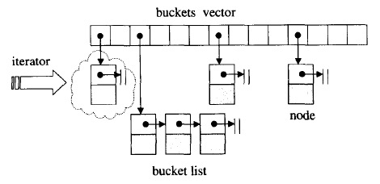 </div>

SGI STL中以开哈希实现hash table，hash table表格中的元素为桶，每个桶中包含了哈希到这个桶中的节点，节点定义如下：

```c++
template <class Value>
struct __hashtable_node
{
    __hashtable_node *next;
    Value val;
};
```

### 6.1 hashtable的迭代器

```c++
template <class Value, class Key, class HashFcn,
          class ExtractKey, class EqualKey, class Alloc>
struct __hashtable_iterator {
  typedef hashtable<Value, Key, HashFcn, ExtractKey, EqualKey, Alloc>
          hashtable;
  typedef __hashtable_iterator<Value, Key, HashFcn, 
                               ExtractKey, EqualKey, Alloc>
          iterator;
  typedef __hashtable_const_iterator<Value, Key, HashFcn, 
                                     ExtractKey, EqualKey, Alloc>
          const_iterator;
  typedef __hashtable_node<Value> node;

  typedef forward_iterator_tag iterator_category;
  typedef Value value_type;
  typedef ptrdiff_t difference_type;
  typedef size_t size_type;
  typedef Value& reference;
  typedef Value* pointer;

  node* cur;        //迭代器目前所指的节点
  hashtable* ht;    //指向相应的hashtable

  __hashtable_iterator(node* n, hashtable* tab) : cur(n), ht(tab) {}
  __hashtable_iterator() {}
  reference operator*() const { return cur->val; }
  pointer operator->() const { return &(operator*()); }
  iterator& operator++();
  iterator operator++(int);
  bool operator==(const iterator& it) const { return cur == it.cur; }
  bool operator!=(const iterator& it) const { return cur != it.cur; }
};
```

前进操作首先尝试从目前所指的节点出发，前进一个位置(节点)，由于节点被安置于list内，所以利用节点的next指针即可轻易完成。如果目前节点正好是list的尾端，就跳至下一个bucket身，它正好指向下一个list的头部节点：

```c++
template <class V, class K, class HF, class ExK, class EqK, class A>
__hashtable_iterator<V, K, HF, ExK, EqK, A>&
__hashtable_iterator<V, K, HF, ExK, EqK, A>::operator++()
{
  const node* old = cur;
  cur = cur->next;  //如果存在，就是它。否则进入以下if流程
  if (!cur) {
    //根据元素值，定位出下一个bucket，其起头处就是我们的目的地
    size_type bucket = ht->bkt_num(old->val);
    while (!cur && ++bucket < ht->buckets.size())
      cur = ht->buckets[bucket];
  }
  return *this;
}

template <class V, class K, class HF, class ExK, class EqK, class A>
inline __hashtable_iterator<V, K, HF, ExK, EqK, A>
__hashtable_iterator<V, K, HF, ExK, EqK, A>::operator++(int)
{
  iterator tmp = *this;
  ++*this;
  return tmp;
}
```

hashtable的迭代器没有后退操作，hashtable也没有定义所谓的逆向迭代器

### 6.2 hashtable的实现

SGI STL中[hashtable的定义](tass-sgi-stl-2.91.57-source/stl_hashtable.h#L165)

```c++
template <class Value, class Key, class HashFcn,
          class ExtractKey, class EqualKey, class Alloc = alloc>
class hashtable;

...

template <class Value, class Key, class HashFcn,
          class ExtractKey, class EqualKey,
          class Alloc> //先前声明时，已给出Alloc默认值alloc
class hashtable {
public:
  typedef HashFcn hasher;
  typedef EqualKey key_equal;
  ...
private:
  //以下3者都是function  objects
  hasher hash;
  key_equal equals;
  ExtractKey get_key;

  typedef __hashtable_node<Value> node;  //hashtable节点类型
  typedef simple_alloc<node, Alloc> node_allocator;

  vector<node*,Alloc> buckets; //hashtable的桶数组，以vector完成
  size_type num_elements;      //元素个数
  ...
};
```

SGI STL以质数来设计表格大小，并且先将28个质数（逐渐呈现大约2倍的关系）计算好，以备随时访问，同时提供一个函数，用来查询在这28个质数中，“最接近某数并大于某数”的质数：

```c++
static const int __stl_num_primes = 28;
static const unsigned long __stl_prime_list[__stl_num_primes] =
{
  53,         97,           193,         389,       769,
  1543,       3079,         6151,        12289,     24593,
  49157,      98317,        196613,      393241,    786433,
  1572869,    3145739,      6291469,     12582917,  25165843,
  50331653,   100663319,    201326611,   402653189, 805306457, 
  1610612741, 3221225473ul, 4294967291ul
};

//该函数被next_size()所调用
inline unsigned long __stl_next_prime(unsigned long n)
{
  const unsigned long* first = __stl_prime_list;
  const unsigned long* last = __stl_prime_list + __stl_num_primes;
  const unsigned long* pos = lower_bound(first, last, n);
  return pos == last ? *(last - 1) : *pos;
}
```

### 6.3 hashtable操作的实现

* **节点操作**
    - 涉及内存管理
        + 创建节点：[new_node](tass-sgi-stl-2.91.57-source/stl_hashtable.h#L477)
        + 销毁节点：[delete_node](tass-sgi-stl-2.91.57-source/stl_hashtable.h#L488)
* **hashtable操作**
    - 创建满足n个bucket的hashtable：[hashtable](tass-sgi-stl-2.91.57-source/stl_hashtable.h#L217)
        + [initialize_buckets](tass-sgi-stl-2.91.57-source/stl_hashtable.h#L499)
    - 插入节点
        + 不允许键值重复： [insert_unique](tass-sgi-stl-2.91.57-source/stl_hashtable.h#L296)
            * 判断和重新分配bucket：[resize](tass-sgi-stl-2.91.57-source/stl_hashtable.h#L841)
            * [insert_unique_noresize](tass-sgi-stl-2.91.57-source/stl_hashtable.h#L624)
        + 允许键值重复：[insert_equal](tass-sgi-stl-2.91.57-source/stl_hashtable.h#L302)
            * 判断和重新分配bucket：resize（同上）
            * [insert_equal_noresize](tass-sgi-stl-2.91.57-source/stl_hashtable.h#L647)
    - 哈希映射寻找bucket
        + 接受实值和buckets个数：[bkt_num](tass-sgi-stl-2.91.57-source/stl_hashtable.h#L472)
        + 只接受实值：[bkt_num](tass-sgi-stl-2.91.57-source/stl_hashtable.h#L462)
        + 只接受键值：[bkt_num_key](tass-sgi-stl-2.91.57-source/stl_hashtable.h#L457)
        + 接受键值和buckets个数：[bkt_num_key](tass-sgi-stl-2.91.57-source/stl_hashtable.h#L467)
    - 清除：[clear](tass-sgi-stl-2.91.57-source/stl_hashtable.h#L917)
    - 复制：[copy_from](tass-sgi-stl-2.91.57-source/stl_hashtable.h#L934)
    - 查找元素：[find](tass-sgi-stl-2.91.57-source/stl_hashtable.h#L400)
    - 统计元素个数：[count](tass-sgi-stl-2.91.57-source/stl_hashtable.h#L422)

### 6.4 hash functions

hash function是计算元素位置的函数，SGI将这项任务赋予了bkt_num()，再由它来调用这里提供的hash function，取得一个可以对hashtable进行模运算的值。针对char，int，long等整数类型，大部分的hash functions什么也没做，只是忠实返回原值

```c++
inline size_t __stl_hash_string(const char* s)
{
  unsigned long h = 0; 
  for ( ; *s; ++s)
    h = 5*h + *s;
  
  return size_t(h);
}

__STL_TEMPLATE_NULL struct hash<char*>
{
  size_t operator()(const char* s) const { return __stl_hash_string(s); }
};

__STL_TEMPLATE_NULL struct hash<const char*>
{
  size_t operator()(const char* s) const { return __stl_hash_string(s); }
};

__STL_TEMPLATE_NULL struct hash<char> {
  size_t operator()(char x) const { return x; }
};
__STL_TEMPLATE_NULL struct hash<unsigned char> {
  size_t operator()(unsigned char x) const { return x; }
};
__STL_TEMPLATE_NULL struct hash<signed char> {
  size_t operator()(unsigned char x) const { return x; }
};
__STL_TEMPLATE_NULL struct hash<short> {
  size_t operator()(short x) const { return x; }
};
__STL_TEMPLATE_NULL struct hash<unsigned short> {
  size_t operator()(unsigned short x) const { return x; }
};
__STL_TEMPLATE_NULL struct hash<int> {
  size_t operator()(int x) const { return x; }
};
__STL_TEMPLATE_NULL struct hash<unsigned int> {
  size_t operator()(unsigned int x) const { return x; }
};
__STL_TEMPLATE_NULL struct hash<long> {
  size_t operator()(long x) const { return x; }
};
__STL_TEMPLATE_NULL struct hash<unsigned long> {
  size_t operator()(unsigned long x) const { return x; }
};
```

## 7.hash_set

SGI STL中[hash_set的定义](tass-sgi-stl-2.91.57-source/stl_hash_set.h#L47)

hash_set以hashtable为底层机制，由于hash_set所供应的操作接口hashtable都提供了，所以几乎所有的hash_set操作行为，都只是转调用hashtable的操作行为而已

## 8.hash_map

SGI STL中[hash_map的定义](tass-sgi-stl-2.91.57-source/stl_hash_map.h#L49)

hash_map以hashtable为底层机制，由于hash_map所供应的操作接口hashtable都提供了，所以几乎所有的hash_map操作行为，都只是转调用hashtable的操作行为而已

## 9.hash_multiset

SGI STL中[hash_multiset的定义](tass-sgi-stl-2.91.57-source/stl_multiset.h#L45)

hash_multiset和hash_set实现上的唯一差别在于，前者的元素插入操作采用底层机制hashtable的insert_equal()，后者则是采用insert_unique()

## 10.hash_multimap

SGI STL中[hash_multimap的定义](tass-sgi-stl-2.91.57-source/stl_multimap.h#L45)

hash_multimap和hash_map实现上的唯一差别在于，前者的元素插入操作采用底层机制hashtable的insert_equal()，后者则是采用insert_unique()

<br>

# 六.算法

<div align="center"> 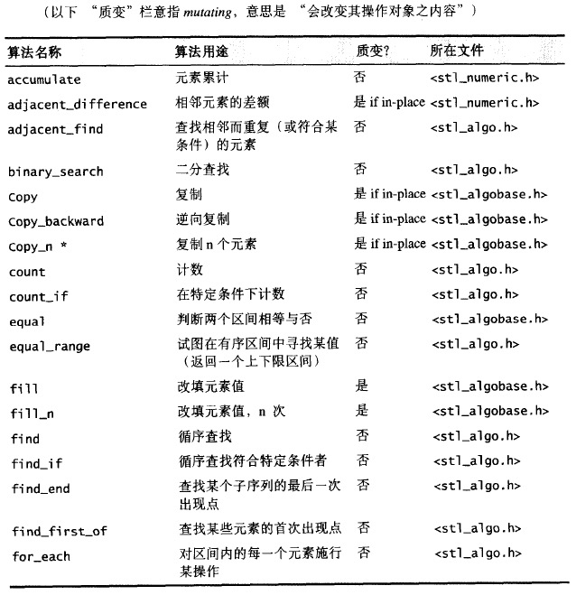 </div>
<div align="center"> 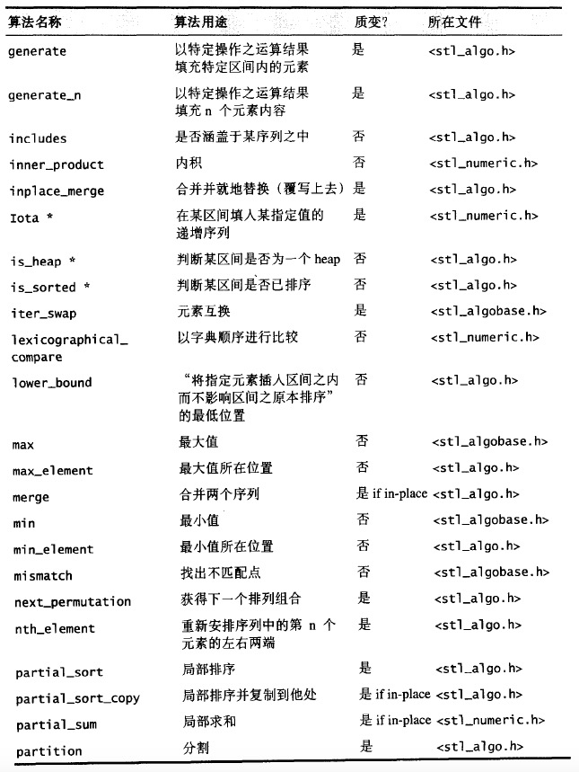 </div>
<div align="center"> 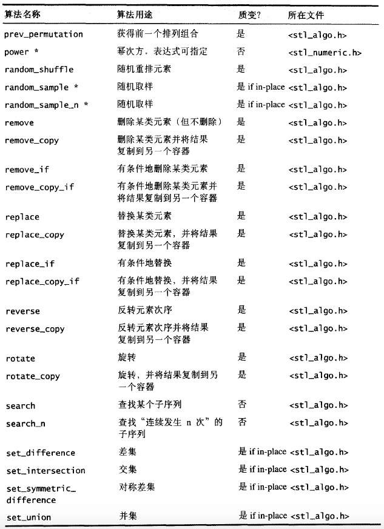 </div>
<div align="center"> 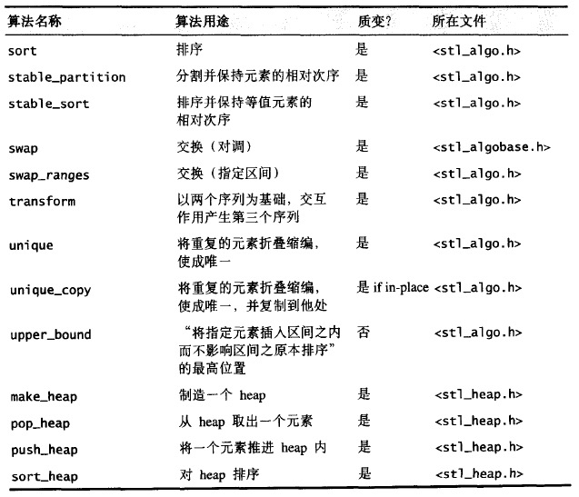 </div>

## 1.区间拷贝

### 1.1 copy

SGI STL的copy算法用尽各种办法，包括函数重载、类型特性、偏特化等编程技巧来尽可能地加强效率

<div align="center"> 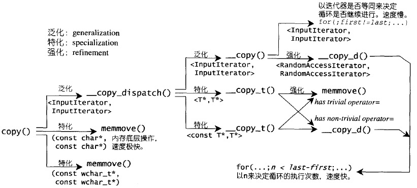 </div>

* 泛化版本
    - [copy](tass-sgi-stl-2.91.57-source/stl_algobase.h#L177)
        + 泛化版本：[__copy_dispatch](tass-sgi-stl-2.91.57-source/stl_algobase.h#L135)
            * 版本一：[__copy](tass-sgi-stl-2.91.57-source/stl_algobase.h#L108)
            * 版本二：[__copy](tass-sgi-stl-2.91.57-source/stl_algobase.h#L128)
                - [__copy_d](tass-sgi-stl-2.91.57-source/stl_algobase.h#L118)
        + 偏特化版本：[__copy_dispatch](tass-sgi-stl-2.91.57-source/stl_algobase.h#L157)
            * [__copy_t](tass-sgi-stl-2.91.57-source/stl_algobase.h#L146)（指针所指对象具有trivial...）
            * [__copy_t](tass-sgi-stl-2.91.57-source/stl_algobase.h#L152)（指针所指对象具有non-trivial...）
        + 偏特化版本：[__copy_dispatch](tass-sgi-stl-2.91.57-source/stl_algobase.h#L166)
            * __copy_t（同上）

* 特化版本
    - [copy](tass-sgi-stl-2.91.57-source/stl_algobase.h#L183)（针对const char\*）
    - [copy](tass-sgi-stl-2.91.57-source/stl_algobase.h#L188)（针对const wchar_t\*）

copy将输入区间```[first,last)```内的元素复制到输出区间```[result,result+(last-first))```内，也就是说，它会执行赋值操作```*result = *first,*(result+1) = *(first+1),...```依次类推。返回一个迭代器：```result+(last-first)```。copy对其template参数所要求的条件非常宽松。其输入区间只需由inputIterators构成即可，输出区间只需要由OutputIterator构成即可。这**意味着可以使用copy算法，将任何容器的任何一段区间的内容，复制到任何容器的任何一段区间上**

<div align="center"> 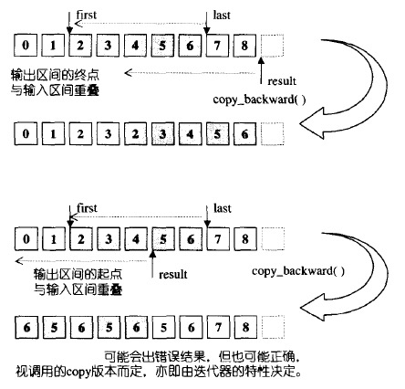 </div>

由于拷贝的顺序，对于没有使用memmove()的版本，要特别注意目的区间与源区间重合的情况。memmove()能处理区间重合的情况

copy会为输出区间内的元素赋予新值，而不是产生新的元素。它不能改变输出区间的迭代器个数。换句话说，copy不能直接用来将元素插入空容器中。如果想将元素插入序列之内，要么使用序列容器的insert成员函数，要么使用copy算法并搭配insert_iterator

### 1.2 copy_backward

copy_backward将```[first,last)```区间的每一个元素，以逆行的方向复制到以result-1为起点，方向亦为逆行的区间上。换句话说，copy_backward算法会执行赋值操作```*(result-1) = *(last - 1),*(result-2) = *(last - 2),...```以此类推，返回一个迭代器：```result-(last-first)```

<div align="center"> 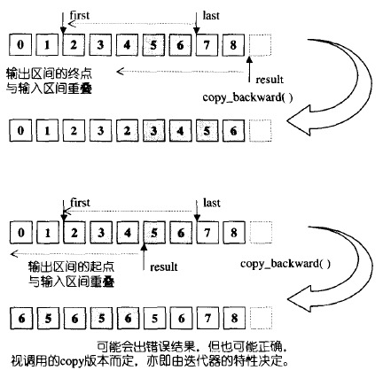 </div>

copy_backward所接受的迭代器必须是BidirectionalIterators，才能够“倒行逆施”

## 2.set相关算法

这部分介绍的4个算法所接受的set，必须是有序区间，元素可能重复。换句话说，它们可以接受STL的set/multiset容器作为输入区间。hash_set/hash_multiset两种容器，以hashtable为底层机制，其内的元素并未呈现排序状态，所以虽然名称中也有set字样，却不可应用于这里的4个算法

### 2.1 set_union

这个函数求集合s1和s2的并集。s1和s2及其并集都是以排序区间表示。函数返回一个迭代器，指向输出区间的尾端

s1和s2内的每个元素都不需要唯一，因此，如果某个值在s1出现n此，在s2出现m次，那么该值在输出区间中会出现max(m,n)次

SGI SLT中[set_union的实现](tass-sgi-stl-2.91.57-source/stl_algo.h#L2104)，操作示例如下：

<div align="center"> 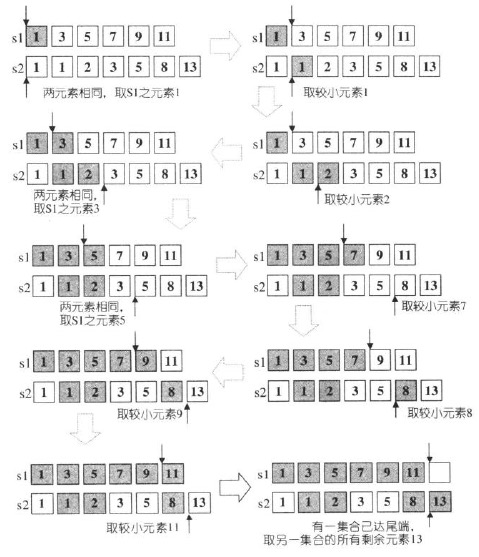 </div>

### 2.2 set_intersection

这个函数求集合s1和s2的交集。s1和s2及其交集都是以排序区间表示。函数返回一个迭代器，指向输出区间的尾端

SGI SLT中[set_intersection的实现](tass-sgi-stl-2.91.57-source/stl_algo.h#L2155)，操作示例如下：

<div align="center"> 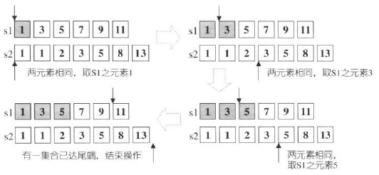 </div>

### 2.3 set_difference

该函数计算两个集合的差集，即当s1为第一个参数，s2为第二个参数时，计算s1-s2。内含“出现于s1但不出现于s2”的每一个元素。s1和s2及其差集都是以排序区间表示。函数返回一个迭代器，指向输出区间的尾端

SGI SLT中[set_difference的实现](tass-sgi-stl-2.91.57-source/stl_algo.h#L2195)，操作示例如下：

<div align="center"> 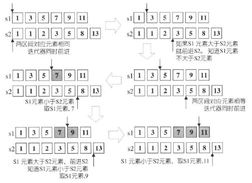 </div>

### 2.4 set_symmetric_difference

这个函数求集合s1和s2的对称差集，也就是说，它能构造出集合s1-s2与集合s2-s1的并集，内含“出现于s1但不出现于s2”以及“出现于s2但不出现于s1”的每一个元素。s1、s2及其对称差集都是以排序区间表示，返回值是一个迭代器，指向输出区间的尾端

由于s1和s2内的每个元素不需要唯一，因此如果某个值在s1出现n此，在s2出现m次，那么该值在输出区间中会出现|n-m|次

SGI SLT中[set_symmetric_difference的实现](tass-sgi-stl-2.91.57-source/stl_algo.h#L2235)，操作示例如下：

<div align="center"> 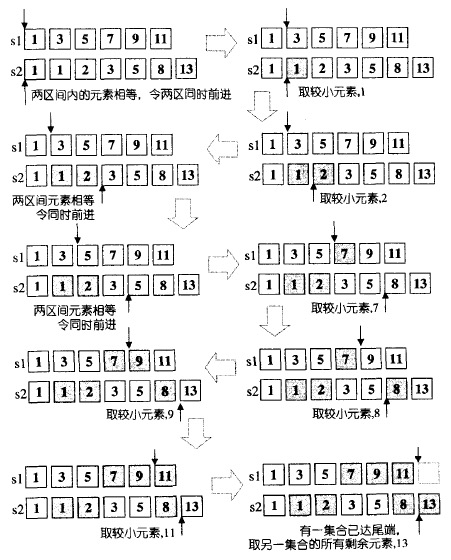 </div>

## 3.排序sort

sort要求传入的迭代器为随机迭代器，因此只能对vector和deque进行排序

STL的sort算法，数据量大时采用Quick Sort，分段递归排序。一旦分段后的数据量小于某个门槛，为避免Quick Sort的递归调用带来过大的额外负荷，就改用Insertion Sort。如果递归层次过深，还会改用Heap Sort

以下为SGI SLT的sort实现：

* [sort](tass-sgi-stl-2.91.57-source/stl_algo.h#L1048)
    - [__lg](tass-sgi-stl-2.91.57-source/stl_algo.h#L1005)
    - [__introsort_loop](tass-sgi-stl-2.91.57-source/stl_algo.h#L1012)
        + 当子区间大于__stl_threshold(16)时才运行，否则直接返回
            - 当深度限制为0时，使用堆排序
            - 当深度限制大于0时，继续递归排序
    - [__final_insertion_sort](tass-sgi-stl-2.91.57-source/stl_algo.h#L983)（此时，已经基本有序）
        + 当数组区间大于__stl_threshold(16)时
            - 对前面大小为16的区间调用：[__insertion_sort](tass-sgi-stl-2.91.57-source/stl_algo.h#L940)
                * [__linear_insert](tass-sgi-stl-2.91.57-source/stl_algo.h#L916)
                    + [__unguarded_linear_insert](tass-sgi-stl-2.91.57-source/stl_algo.h#L891)
            - 对后面的区间调用：[__unguarded_insertion_sort](tass-sgi-stl-2.91.57-source/stl_algo.h#L962)
                * [__unguarded_insertion_sort_aux](tass-sgi-stl-2.91.57-source/stl_algo.h#L955)
                    + [__unguarded_linear_insert](tass-sgi-stl-2.91.57-source/stl_algo.h#L891)
        + 当数组区间小于等于__stl_threshold(16)时
            - 调用：__insertion_sort（同上）

## 4.其它算法

**相对简单的算法**：

* **查找**
    - adjacent_find（查找第一对满足条件的相邻元素，返回第一个元素的迭代器）
        + [版本一](tass-sgi-stl-2.91.57-source/stl_algo.h#L97)
        + [版本二](tass-sgi-stl-2.91.57-source/stl_algo.h#L108)
    - [find](tass-sgi-stl-2.91.57-source/stl_algo.h#L84)
    - [find_if](tass-sgi-stl-2.91.57-source/stl_algo.h#L90)（可以指定操作）
    - find_end（在区间一中查找区间二最后一次出现的位置）
        + [版本一](tass-sgi-stl-2.91.57-source/stl_algo.h#L2557)
            * 单向迭代器版：[__find_end](tass-sgi-stl-2.91.57-source/stl_algo.h#L2457)
            * 双向迭代器版：[__find_end](tass-sgi-stl-2.91.57-source/stl_algo.h#L2507)
        + [版本二](tass-sgi-stl-2.91.57-source/stl_algo.h#L2575)（可以指定操作）
            * 单向迭代器版：[__find_end](tass-sgi-stl-2.91.57-source/stl_algo.h#L2480)
            * 双向迭代器版：[__find_end](tass-sgi-stl-2.91.57-source/stl_algo.h#L2530)
    - find_first_of（在区间一中查找区间二中任一元素第一次出现点）
        + [版本一](tass-sgi-stl-2.91.57-source/stl_algo.h#L2430)
        + [版本二](tass-sgi-stl-2.91.57-source/stl_algo.h#L2441)（允许指定操作）
    - max_element
        + [版本一](tass-sgi-stl-2.91.57-source/stl_algo.h#L2284)
        + [版本二](tass-sgi-stl-2.91.57-source/stl_algo.h#L2293)（允许指定比较操作）
    - min_element
        + [版本一](tass-sgi-stl-2.91.57-source/stl_algo.h#L2303)
        + [版本二](tass-sgi-stl-2.91.57-source/stl_algo.h#L2312)（允许指定比较操作）
    - search（在序列一的区间中查找序列二的首次出现点）
        + [版本一](tass-sgi-stl-2.91.57-source/stl_algo.h#L193)
        + [版本二](tass-sgi-stl-2.91.57-source/stl_algo.h#L234)（允许指定操作）
    - search_n（在序列一中查找连续n个满足条件的元素的起点）
        + [版本一](tass-sgi-stl-2.91.57-source/stl_algo.h#L242)
        + [版本二](tass-sgi-stl-2.91.57-source/stl_algo.h#L266)
* **统计**
    - count（统计等于某值的个数）
        + [版本一](tass-sgi-stl-2.91.57-source/stl_algo.h#L139)
        + [版本二](tass-sgi-stl-2.91.57-source/stl_algo.h#L120)（计数变量作为参数传入）
    - count_if（可以指定操作）
        + [版本一](tass-sgi-stl-2.91.57-source/stl_algo.h#L149)
        + [版本二](tass-sgi-stl-2.91.57-source/stl_algo.h#L128)（计数变量作为参数传入）
* **单区间操作**
    - [for_each](tass-sgi-stl-2.91.57-source/stl_algo.h#L77)（将仿函数f施行于指定区间，f不允许修改元素，因为迭代器类型是InputIterators）
    - [generate](tass-sgi-stl-2.91.57-source/stl_algo.h#L357)（将仿函数gen的运算结果赋值到指定区间的所有元素上）
    - [generate_n](tass-sgi-stl-2.91.57-source/stl_algo.h#L363)（将仿函数gen的运算结果赋值到迭代器first开始的n个元素上）
    - [partition](tass-sgi-stl-2.91.57-source/stl_algo.h#L752)（不保证元素的原始相对位置）

    <div align="center"> 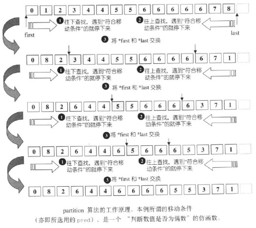 </div>

    - [stable_partition](tass-sgi-stl-2.91.57-source/stl_algo.h#L849)（保留元素的原始相对位置）
    - [remove](tass-sgi-stl-2.91.57-source/stl_algo.h#L392)（区间大小并不发送变化，需要移除的元素会被后面的覆盖，区间尾部会有残余，返回指向第一个残余元素的迭代器）
        + [remove_copy](tass-sgi-stl-2.91.57-source/stl_algo.h#L370)
    - [remove_if](tass-sgi-stl-2.91.57-source/stl_algo.h#L400)
        + [remove_copy_if](tass-sgi-stl-2.91.57-source/stl_algo.h#L381)

    <div align="center"> 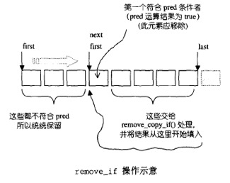 </div>

    - [replace](tass-sgi-stl-2.91.57-source/stl_algo.h#L325)
    - [replace_copy](tass-sgi-stl-2.91.57-source/stl_algo.h#L339)
    - [repalce_if](tass-sgi-stl-2.91.57-source/stl_algo.h#L332)
    - [replace_copy_if](tass-sgi-stl-2.91.57-source/stl_algo.h#L348)
    - [reverse](tass-sgi-stl-2.91.57-source/stl_algo.h#L516)
        + 迭代器为双向迭代器：[__reverse](tass-sgi-stl-2.91.57-source/stl_algo.h#L500)
        + 迭代器为随机迭代器：[__reverse](tass-sgi-stl-2.91.57-source/stl_algo.h#L510)
    - [reverse_copy](tass-sgi-stl-2.91.57-source/stl_algo.h#L521)
    - [rotate]()（将[first,middle)和[middle,last)的元素互换，middle所指元素将成为容器第一个元素）
        + 迭代器为向前迭代器：[__rotate](tass-sgi-stl-2.91.57-source/stl_algo.h#L533)

        <div align="center"> 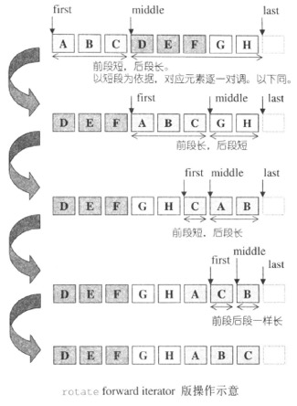 </div>

        + 迭代器为双向迭代器：[__rotate](tass-sgi-stl-2.91.57-source/stl_algo.h#L549)

        <div align="center"> 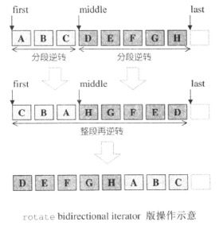 </div>

        + 迭代器为随机迭代器：[__rotate](tass-sgi-stl-2.91.57-source/stl_algo.h#L586)
            * [__gcd](tass-sgi-stl-2.91.57-source/stl_algo.h#L558)
            * [__rotate_cycle](tass-sgi-stl-2.91.57-source/stl_algo.h#L569)
    - [rotate_copy](tass-sgi-stl-2.91.57-source/stl_algo.h#L604)
    - transform
        + [版本一](tass-sgi-stl-2.91.57-source/stl_algo.h#L307)
        + [版本二](tass-sgi-stl-2.91.57-source/stl_algo.h#L316)
    - unique（移除相邻的重复元素，必须相邻，所以要先排序。和remove一样，会有残余）
        + [版本一](tass-sgi-stl-2.91.57-source/stl_algo.h#L487)
        + [版本二](tass-sgi-stl-2.91.57-source/stl_algo.h#L493)（允许指定操作）
    - [unique_copy](tass-sgi-stl-2.91.57-source/stl_algo.h#L438)
        + 迭代器为向前迭代器：[__unique_copy](tass-sgi-stl-2.91.57-source/stl_algo.h#L408)
        + 迭代器为输出迭代器(不能读)：[__unique_copy](tass-sgi-stl-2.91.57-source/stl_algo.h#L431)
            * [__unique_copy](tass-sgi-stl-2.91.57-source/stl_algo.h#L418)
* **双区间操作**
    - includes（判断区间二是否“涵盖于”区间一，两个区间必须有序）
        + [版本一](tass-sgi-stl-2.91.57-source/stl_algo.h#L2076)
        + [版本二](tass-sgi-stl-2.91.57-source/stl_algo.h#L2090)

    <div align="center"> 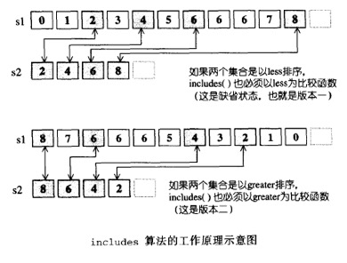 </div>

    - merged（合并两个区间，置于另一段空间，返回指向结果序列最后元素下一位位置的迭代器）
        + [版本一](tass-sgi-stl-2.91.57-source/stl_algo.h#L1761)
        + [版本二](tass-sgi-stl-2.91.57-source/stl_algo.h#L1780)（允许指定操作）

    <div align="center"> 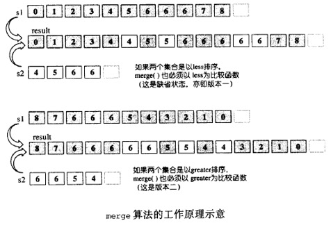 </div>
    
    - [swap_ranges](tass-sgi-stl-2.91.57-source/stl_algo.h#L242)（将区间一的元素与first2开始等个数的元素互换）

**较为复杂的算法**：

* **查找**
    - lower_bound（查找等于value的第一个元素的位置，不存在则返回第一个插入点）
        + [版本一](tass-sgi-stl-2.91.57-source/stl_algo.h#L1452)
            * 迭代器是向前迭代器：[__lower_bound](tass-sgi-stl-2.91.57-source/stl_algo.h#L1407)
            * 迭代器是随机迭代器：[__lower_bound](tass-sgi-stl-2.91.57-source/stl_algo.h#L1431)
        + [版本二](tass-sgi-stl-2.91.57-source/stl_algo.h#L1505)（允许指定比较操作）
    - upper_bound（查找value的最后一个插入点，即如果存在元素等于value，那么插入最后一个等于value的元素之后）
        + [版本一](tass-sgi-stl-2.91.57-source/stl_algo.h#L1557)
            * 迭代器是向前迭代器：[__upper_bound](tass-sgi-stl-2.91.57-source/stl_algo.h#L1512)
            * 迭代器是随机迭代器：[__upper_bound](tass-sgi-stl-2.91.57-source/stl_algo.h#L1536)
        + [版本二](tass-sgi-stl-2.91.57-source/stl_algo.h#L1610)（允许指定比较操作）
    - binary_search
        + [版本一](tass-sgi-stl-2.91.57-source/stl_algo.h#L1747)
        + [版本二](tass-sgi-stl-2.91.57-source/stl_algo.h#L1757)（允许指定比较操作）
    - equal_range（返回一对迭代器i和j，i是lower_bound的结果，j是upper_bound的结果）
        + [版本一](tass-sgi-stl-2.91.57-source/stl_algo.h#L1675)
            * 迭代器是向前迭代器：[__equal_range](tass-sgi-stl-2.91.57-source/stl_algo.h#L1618)
            * 迭代器是随机迭代器：[__equal_range](tass-sgi-stl-2.91.57-source/stl_algo.h#L1648)
* **单区间操作**
    - next_permutation（按字典序计算下一个排列组合。算法思想：从最尾端开始往前寻找两个相邻元素，令第一个元素为\*i，第二个元素为\*ii，且满足\*i<\*ii。找到这样一组相邻元素后，再从最尾端开始往前检验，找到第一个大于\*i的元素，设为\*j，将i，j元素对调，再将ii之后的所有元素颠倒排列。就是下一个排列组合）
        + [版本一](tass-sgi-stl-2.91.57-source/stl_algo.h#L2322)
        + [版本二](tass-sgi-stl-2.91.57-source/stl_algo.h#L2349)
    - prev_permutation（按字典序计算上一个排列组合。算法思想：从最尾端开始往前寻找两个相邻元素，令第一个元素为\*i，第二个元素为\*ii，且满足\*i>\*ii。找到这样一组相邻元素后，再从最尾端开始往前检验，找到第一个小于\*i的元素，设为\*j，将i，j元素对调，再将ii之后的所有元素颠倒排列。就是下一个排列组合）
        + [版本一](tass-sgi-stl-2.91.57-source/stl_algo.h#L2376)
        + [版本二](tass-sgi-stl-2.91.57-source/stl_algo.h#L2403)
    - random_shuffle
        + [版本一](tass-sgi-stl-2.91.57-source/stl_algo.h#L622)（使用内部随机数产生器）
            [__random_shuffle](tass-sgi-stl-2.91.57-source/stl_algo.h#L610)
        + [版本二](tass-sgi-stl-2.91.57-source/stl_algo.h#L628)（使用一个会产生随机数的仿函数）
    - partial_sort（将middle-first个最小元素排序并置于[first,middle)，其余元素放在middle开始的后半部）
        + [版本一](tass-sgi-stl-2.91.57-source/stl_algo.h#L1272)
            * [__partial_sort](tass-sgi-stl-2.91.57-source/stl_algo.h#L1262)
        + [版本二](tass-sgi-stl-2.91.57-source/stl_algo.h#L1289)（运行指定比较操作）
            * [__partial_sort](tass-sgi-stl-2.91.57-source/stl_algo.h#L1279)
        
        <div align="center">  </div>

    - partial_sort_copy
        + [版本一](tass-sgi-stl-2.91.57-source/stl_algo.h#L1322)
        + [版本二](tass-sgi-stl-2.91.57-source/stl_algo.h#L1357)（允许指定比较操作）
    - [inplace_merge](tass-sgi-stl-2.91.57-source/stl_algo.h#L2058)
        + [inplace_merge_aux](tass-sgi-stl-2.91.57-source/stl_algo.h#L2022)
            * 有额外的缓冲区辅助：[__merge_adaptive](tass-sgi-stl-2.91.57-source/stl_algo.h#L1982)
                - 当序列1较小，且缓冲区足够容纳序列1

                <div align="center"> 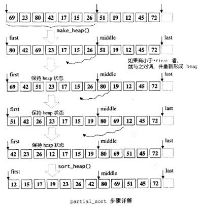 </div>

                - 当序列2较小，且缓冲区足够容纳序列2

                <div align="center"> 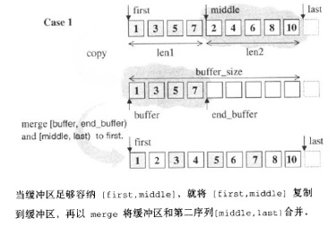 </div>

                - 当缓冲区不足以容纳序列1和序列2
                    [__rotate_adaptive](tass-sgi-stl-2.91.57-source/stl_algo.h#L1867)

                <div align="center"> 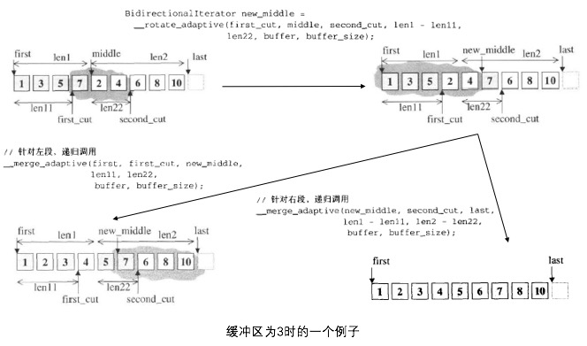 </div>

    - [nth_element](tass-sgi-stl-2.91.57-source/stl_algo.h#L1380)
        + [__nth_element](tass-sgi-stl-2.91.57-source/stl_algo.h#L1365)

    <div align="center"> 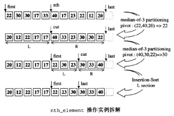 </div>

    <br>

# 七.仿函数

在STL标准规格定案后，仿函数采用**函数对象**作为新名称

函数指针的缺点在于：不能满足STL对抽象性的要求，也不能满足软件积木的要求——函数指针无法和STL其它组件（如适配器）搭配，产生更灵活的变化

就实现而言，仿函数其实就是一个“行为类似函数”的对象，为了能够“行为类似函数”，其类别定义中必须自定义function call运算子。拥有这样的运算子后，就可以在仿函数的对象后面加上一对小括号，以此调用仿函数所定义的operator()

<div align="center"> 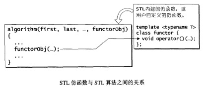 </div>

STL仿函数的分类，若以操作数的个数划分，可分为一元和二元仿函数，若以功能划分，可分为算术运算，关系运算，逻辑运算三大类

任何应用程序欲使用STL內建的仿函数，都必须含入<functional>头文件，SGI则将它们实际定义于<stl_function.h>头文件

## 1.仿函数的相应类型

STL仿函数应该有能力被函数适配器修饰，彼此像积木一样地串接。为了拥有适配能力，每一个仿函数必须定义自己的相应类型。就像迭代器如果要融入整个STL大家庭，也必须依照规定定义自己的5个相应类型一样。这些相应类型是为了让适配器能够取出，获得仿函数的某些信息

仿函数的相应类型主要用来表现**函数参数类型**和**传回值类型**

为方便起见，<stl_function.h>定义了两个classes，分别代表一元仿函数和二元仿函数（STL不支持三元仿函数），其中没有任何data members或member functions，唯有一些类型定义。任何仿函数只要依据需求选择继承其中一个class，就自动拥有了那些相应类型，也就拥有了适配能力

### 1.1 unary_function

unary_function用来呈现一元函数的参数类型和返回值类型：

```c++
template <class Arg, class Result>
struct unary_function {
    typedef Arg argument_type;
    typedef Result result_type;
};
```

### 1.2 binary_function 

binary_function用来呈现二元函数的第一参数类型，第二参数类型，以及返回值类型：

```c++
template <class Arg1, class Arg2, class Result>
struct binary_function {
    typedef Arg1 first_argument_type;
    typedef Arg2 second_argument_type;
    typedef Result result_type;
};  
```

## 2.算术类仿函数

以下为STL内建的“算术类仿函数”，除了“否定”运算为一元运算，其它都是二元运算：

* 加法：plus\<T\>
* 减法：minus\<T\>
* 乘法：multiplies\<T\>
* 除法：divides\<T\>
* 取模：modulus\<T\>
* 否定：negate\<T\>

```c++
template <class T>
struct plus : public binary_function<T, T, T> {
    T operator()(const T& x, const T& y) const { return x + y; }
};

template <class T>
struct minus : public binary_function<T, T, T> {
    T operator()(const T& x, const T& y) const { return x - y; }
};

template <class T>
struct multiplies : public binary_function<T, T, T> {
    T operator()(const T& x, const T& y) const { return x * y; }
};

template <class T>
struct divides : public binary_function<T, T, T> {
    T operator()(const T& x, const T& y) const { return x / y; }
};

template <class T>
struct modulus : public binary_function<T, T, T> {
    T operator()(const T& x, const T& y) const { return x % y; }
};

template <class T>
struct negate : public unary_function<T, T> {
    T operator()(const T& x) const { return -x; }
};
```

## 3.关系运算类仿函数

以下为STL内建的“关系运算类仿函数”，每一个都是二元运算：

* 等于：equal_to\<T\>
* 不等于：not_equal_to\<T\>
* 大于：greater\<T\>
* 大于或等于：greater_equal\<T\>
* 小于：less\<T\>
* 小于或等于：less_equal\<T\>

```c++
template <class T>
struct equal_to : public binary_function<T, T, bool> {
    bool operator()(const T& x, const T& y) const { return x == y; }
};

template <class T>
struct not_equal_to : public binary_function<T, T, bool> {
    bool operator()(const T& x, const T& y) const { return x != y; }
};

template <class T>
struct greater : public binary_function<T, T, bool> {
    bool operator()(const T& x, const T& y) const { return x > y; }
};

template <class T>
struct less : public binary_function<T, T, bool> {
    bool operator()(const T& x, const T& y) const { return x < y; }
};

template <class T>
struct greater_equal : public binary_function<T, T, bool> {
    bool operator()(const T& x, const T& y) const { return x >= y; }
};

template <class T>
struct less_equal : public binary_function<T, T, bool> {
    bool operator()(const T& x, const T& y) const { return x <= y; }
};
```

## 4.逻辑运算类仿函数

以下为STL内建的“逻辑运算类仿函数”，其中And和Or是二元运算，Not为一元运算：

* 逻辑运算 And：logical_and\<T\>
* 逻辑运算 Or：logical_or\<T\>
* 逻辑运算 Not：logical_not\<T\>

```c++
template <class T>
struct logical_and : public binary_function<T, T, bool> {
    bool operator()(const T& x, const T& y) const { return x && y; }
};

template <class T>
struct logical_or : public binary_function<T, T, bool> {
    bool operator()(const T& x, const T& y) const { return x || y; }
};

template <class T>
struct logical_not : public unary_function<T, bool> {
    bool operator()(const T& x) const { return !x; }
};
```

## 5.证同，选择与投射

C++标准并未涵盖这里介绍的任何一个仿函数，不过它们常常存在于各个实现品中作为内部运用。在SGI STL中的实现如下：

```c++
//证同函数。任何数值通过此函数后，不会有任何改变
//此函数运用于<stl_set.h>，用来指定RB-tree所需的KeyOfValue op
//那是因为set元素的键值即实值，所以采用identity
template <class T>
struct identity : public unary_function<T, T> {
  const T& operator()(const T& x) const { return x; }
};

//选择函数：接受一个pair，传回其第一元素
//此函数运用于<stl_map.h>，用来指定RB-tree所需的KeyOfValue op
//由于map系以pair元素的第一元素为其键值，所以采用select1st
template <class Pair>
struct select1st : public unary_function<Pair, typename Pair::first_type> {
  const typename Pair::first_type& operator()(const Pair& x) const
  {
    return x.first;
  }
};

//选择函数：接受一个pair,传回其第二元素
//SGI STL并未运用此函数
template <class Pair>
struct select2nd : public unary_function<Pair, typename Pair::second_type> {
  const typename Pair::second_type& operator()(const Pair& x) const
  {
    return x.second;
  }
};

//投射函数：传回其第一参数，忽略第二参数
template <class Arg1, class Arg2>
struct project1st : public binary_function<Arg1, Arg2, Arg1> {
  Arg1 operator()(const Arg1& x, const Arg2&) const { return x; }
};

//投射函数：传回第二参数，忽略第一参数
template <class Arg1, class Arg2>
struct project2nd : public binary_function<Arg1, Arg2, Arg2> {
  Arg2 operator()(const Arg1&, const Arg2& y) const { return y; }
};
```

<br>

# 八.适配器

适配器在STL组件的灵活组合运用功能上，扮演着轴承、转换器的角色

STL所提供的各种适配器中：1）改变仿函数接口者，称为函数适配器；2）改变容器接口者，称为容器适配器；3）改变迭代器接口者，称为迭代器适配器

## 1.容器适配器

STL提供两个容器适配器：queue和stack，它们修饰deque的接口而生成新的容器风貌

stack的底层由deque构成。stack封锁住了所有的deque对外接口，只开放符合stack原则的几个函数

queue的底层也由deque构成。queue封锁住了所有的deque对外接口，只开放符合queue原则的几个函数

> stack和queue的具体详见第四章

## 2.迭代器适配器

STL提供了许多应用于迭代器身上的适配器，包括：

1. [insert iterators](#21-insert-iterators)：可以将一般迭代的赋值操作转变为插入操作，可以分为下面几个
    * [back_insert_iterator](#1back_insert_iterator)：专门负责尾端的插入操作
    * [front_insert_iterator](#2front_insert_iterator)：专门负责首部的插入操作
    * [insert_iterator](#3insert_iterator)：可以从任意位置执行插入操作

    由于上面3个迭代器的使用接口不是十分直观，因此，STL提供了三个相应函数用以获取相应迭代器：

    <div align="center"> 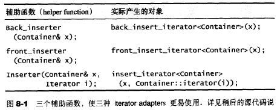 </div>

2. [reverse iterators](#22-reverse-iterators)：可以将一般迭代器的行进方向反转
3. [iostream iterators](#23-iostream-iterators)：可以将迭代器绑定到某个iostream对象身上
    * 绑定到istream对象身上的，称为istream_iterator，拥有输入功能
    * 绑定到ostream对象身上的，称为ostream_iterator，拥有输出功能

**C++ Standard规定它们的接口可以藉由<iterator>获得**，SGI STL将它们实际定义于<stl_iterator.h>

### 2.1 insert iterators

**insert iterators实现的主要观念是**：每一个insert iterators内部都维护有一个容器（必须由用户指定）；容器当然有自己的迭代器，于是，当客户端对insert iterators做赋值操作时，就在insert iterators中被转为对该容器的迭代器做插入操作（也就是说，调用底层容器的push_front()或push_back()或insert()）

其它迭代器惯常的行为如：operator++、operator++(int)、operator\*都被关闭，更没有提供operator--或operator--(int)或operator->等功能，因此类型被定义为output_iterator_tag

#### 1）back_insert_iterator

```c++
template <class Container>
class back_insert_iterator {
protected:
  Container* container; //底层容器
public:
  typedef output_iterator_tag iterator_category;    //迭代器类型
  typedef void                value_type;
  typedef void                difference_type;
  typedef void                pointer;
  typedef void                reference;

  //构造函数。传入一个容器，使back_insert_iterator与容器绑定起来
  explicit back_insert_iterator(Container& x) : container(&x) {}
  //赋值操作
  back_insert_iterator<Container>&
  operator=(const typename Container::value_type& value) { 
    container->push_back(value);  //赋值操作的关键是转调用容器的push_back()
    return *this;
  }
  //以下3个操作对back_insert_iterator不起作用（关闭功能）
  //三个操作符返回的都是back_insert_iterator自己
  back_insert_iterator<Container>& operator*() { return *this; }
  back_insert_iterator<Container>& operator++() { return *this; }
  back_insert_iterator<Container>& operator++(int) { return *this; }
};

//这是一个辅助函数，帮助我们方便使用back_insert_iterator
template <class Container>
inline back_insert_iterator<Container> back_inserter(Container& x) {
  return back_insert_iterator<Container>(x);
}
```

#### 2）front_insert_iterator

```c++
template <class Container>
class front_insert_iterator {
protected:
  Container* container; //底层容器
public:
  typedef output_iterator_tag iterator_category;   //迭代器类型
  typedef void                value_type;
  typedef void                difference_type;
  typedef void                pointer;
  typedef void                reference;

  //构造函数。传入一个容器，使front_insert_iterator与容器绑定起来
  explicit front_insert_iterator(Container& x) : container(&x) {}
  //赋值操作
  front_insert_iterator<Container>&
  operator=(const typename Container::value_type& value) { 
    container->push_front(value);  //赋值操作的关键是转调用容器的push_front()
    return *this;
  }
  //以下3个操作对front_insert_iterator不起作用（关闭功能）
  //三个操作符返回的都是front_insert_iterator自己
  front_insert_iterator<Container>& operator*() { return *this; }
  front_insert_iterator<Container>& operator++() { return *this; }
  front_insert_iterator<Container>& operator++(int) { return *this; }
};

//这是一个辅助函数，帮助我们方便使用front_insert_iterator
template <class Container>
inline front_insert_iterator<Container> front_inserter(Container& x) {
  return front_insert_iterator<Container>(x);
}
```

#### 3）insert_iterator

```c++
template <class Container>
class insert_iterator {
protected:
  Container* container;                 //底层容器
  typename Container::iterator iter;    //底层容器的迭代器（前2个插入迭代器没有）
public:
  typedef output_iterator_tag iterator_category;    //迭代器类型
  typedef void                value_type;
  typedef void                difference_type;
  typedef void                pointer;
  typedef void                reference;

  //构造函数。传入一个容器，使insert_iterator与容器和容器迭代器绑定起来
  insert_iterator(Container& x, typename Container::iterator i) 
    : container(&x), iter(i) {}
  //赋值操作
  insert_iterator<Container>&
  operator=(const typename Container::value_type& value) { 
    iter = container->insert(iter, value);  //赋值操作的关键是转调用容器的insert()
    ++iter; //使insert iterator永远随其目标贴身移动
    return *this;
  }
  //以下3个操作对insert_iterator不起作用（关闭功能）
  //三个操作符返回的都是insert_iterator自己
  insert_iterator<Container>& operator*() { return *this; }
  insert_iterator<Container>& operator++() { return *this; }
  insert_iterator<Container>& operator++(int) { return *this; }
};

//这是一个辅助函数，帮助我们方便使用insert_iterator
//和前2个插入迭代器不容，这里还需额外传入一个底层容器的迭代器
template <class Container, class Iterator>
inline insert_iterator<Container> inserter(Container& x, Iterator i) {
  typedef typename Container::iterator iter;
  return insert_iterator<Container>(x, iter(i));
}
```

### 2.2 reverse iterators

可以通过一个**双向顺序容器**调用rbegin()，和rend()来获取相应的逆向迭代器。只要双向顺序容器提供了begin(),end()，它的rbegin()和rend()就如同下面的形式。单向顺序容器slist不可使用reserve iterators。有些容器如stack、queue、priority_queue并不提供begin()，end()，当然也就没有rbegin()和rend()：

```c++
template <class T, class Alloc = alloc>
class vector {
public:
  typedef T value_type;
  typedef value_type* iterator; //容器迭代器类型
  typedef reverse_iterator<iterator> reverse_iterator; //逆向迭代器类型
  reverse_iterator rbegin() { return reverse_iterator(end()); }
  reverse_iterator rend() { return reverse_iterator(begin()); }
...
};

template <class T, class Alloc = alloc>
class list {
public:
    typedef __list_iterator<T, T&, T*>   iterator; //容器迭代器类型
    typedef reverse_iterator<iterator> reverse_iterator;  //逆向迭代器类型
    reverse_iterator rbegin() { return reverse_iterator(end()); }
    reverse_iterator rend() { return reverse_iterator(begin()); }
...
};

template <class T, class Alloc = alloc, size_t BufSiz = 0> 
class deque {
public:
    typedef __deque_iterator<T, T&, T*, BufSiz>   iterator;  //容器迭代器类型
    typedef reverse_iterator<iterator> reverse_iterator; //逆向迭代器类型
    iterator begin() { return start; }
    iterator end() { return finish; }
    reverse_iterator rbegin() { return reverse_iterator(finish); }
    reverse_iterator rend() { return reverse_iterator(start); }
```

正向迭代器和逆向迭代器的逻辑位置如下图：

<div align="center"> 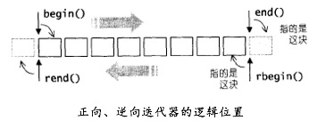 </div>

具有这样的逻辑位置关系，当我们将一个正向迭代器区间转换为一个逆向迭代器区间后，不必再有任何额外处理，就可以让接受这个逆向迭代器区间的算法，以相反的元素次序处理区间中的每一个元素

reverse_iterator实现如下：

```c++
template <class Iterator>
class reverse_iterator 
{
protected:
  Iterator current; //对应的正向迭代器
public:
  //迭代器的5种相应类型都和其对应的正向迭代器相同
  typedef typename iterator_traits<Iterator>::iterator_category
          iterator_category;
  typedef typename iterator_traits<Iterator>::value_type
          value_type;
  typedef typename iterator_traits<Iterator>::difference_type
          difference_type;
  typedef typename iterator_traits<Iterator>::pointer
          pointer;
  typedef typename iterator_traits<Iterator>::reference
          reference;

  typedef Iterator iterator_type;              //代表正向迭代器
  typedef reverse_iterator<Iterator> self;     //代表逆向迭代器

public:
  reverse_iterator() {}
  //下面这个构造函数将逆向迭代器与正向迭代器x关联起来
  explicit reverse_iterator(iterator_type x) : current(x) {}
  reverse_iterator(const self& x) : current(x.current) {}
  
  //base()成员函数返回相应的正向迭代器
  iterator_type base() const { return current; }

  //对逆向迭代器取值，就是将“对应的正向迭代器”后退一步后取值ßßßß
  reference operator*() const {
    Iterator tmp = current;
    return *--tmp;
  }

  //前置++，++变为--
  self& operator++() {
    --current;
    return *this;
  }
  //后置++，++变--
  self operator++(int) {
    self tmp = *this;
    --current;
    return tmp;
  }
  //前置--，--变++
  self& operator--() {
    ++current;
    return *this;
  }
  //后置--，--变++
  self operator--(int) {
    self tmp = *this;
    ++current;
    return tmp;
  }

  //前进与后退方向完全逆转
  self operator+(difference_type n) const {
    return self(current - n);
  }
  self& operator+=(difference_type n) {
    current -= n;
    return *this;
  }
  self operator-(difference_type n) const {
    return self(current + n);
  }
  self& operator-=(difference_type n) {
    current += n;
    return *this;
  }
  //第一个*会调用本类的operator*，第二个不会
  reference operator[](difference_type n) const { return *(*this + n); }  
}; 
```

### 2.3 iostream iterators

#### 1）istream_iterator

所谓绑定一个istream object，其实就是在istream iterator内部维护一个istream member，客户端对于这个迭代器所做的operator++操作，会被引导调用迭代器内部所含的那个istream member的输入操作(operator>>)。这个迭代器是个input iterator，不具备operator--

```c++
//此版本是旧有的HP规格，未符合标准接口：istream_iterator<T,charT,traits,Distance>
//然而一般使用input iterators时都只使用第一个template参数、此时以下仍适用
//SGI STL 3.3已实现出符合标准接口的istream_iterator，做法与本版大同小异
template <class T, class Distance = ptrdiff_t> 
class istream_iterator {
  friend bool
  operator== __STL_NULL_TMPL_ARGS (const istream_iterator<T, Distance>& x,
                                   const istream_iterator<T, Distance>& y);
protected:
  istream* stream;
  T value;
  bool end_marker;
  void read() {
    end_marker = (*stream) ? true : false;
    if (end_marker) *stream >> value;       //关键
    //输入后，stream的状态可能改变，所以下面再判断一次以决定end_marker
    //当读到eof或读到类型不符的数据，stream即处于false状态
    end_marker = (*stream) ? true : false;
  }
public:
  typedef input_iterator_tag iterator_category; //迭代器类型
  typedef T                  value_type;
  typedef Distance           difference_type;
  typedef const T*           pointer;
  typedef const T&           reference;

  istream_iterator() : stream(&cin), end_marker(false) {}
  istream_iterator(istream& s) : stream(&s) { read(); }
  //以上两行的用法：
  // istream_iterator<int> eos;         造成end_marker为false
  // istream_iterator<int> initer(cin)  引发read()，程序至此会等待输入
  
  reference operator*() const { return value; }
  pointer operator->() const { return &(operator*()); }

  //迭代器前进一个位置，就代表要读取一次数据
  istream_iterator<T, Distance>& operator++() { 
    read(); 
    return *this;
  }
  istream_iterator<T, Distance> operator++(int)  {
    istream_iterator<T, Distance> tmp = *this;
    read();
    return tmp;
  }
};
```

下图展示了copy()和istream_iterator共同合作的例子：

<div align="center"> 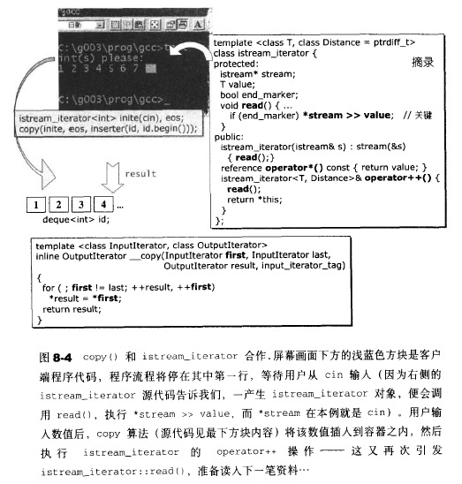 </div>

#### 2）ostream_iterator

所谓绑定一个ostream object，其实就是在oßstream iterator内部维护一个ostream member，客户端对于这个迭代器所做的operator=操作，会被引导调用迭代器内部所含的那个ostream member的输出操作(operator<<)。这个迭代器是个Onput iterator

```c++
//此版本是旧有的HP规格，未符合标准接口：istream_iterator<T,charT,traits>
//然而一般使用onput iterators时都只使用第一个template参数、此时以下仍适用
//SGI STL 3.3已实现出符合标准接口的ostream_iterator，做法与本版大同小异
template <class T>
class ostream_iterator {
protected:
  ostream* stream;
  const char* string;   //每次输出后的间隔符号
public:
  typedef output_iterator_tag iterator_category;    //迭代器类型
  typedef void                value_type;
  typedef void                difference_type;
  typedef void                pointer;
  typedef void                reference;

  ostream_iterator(ostream& s) : stream(&s), string(0) {}
  ostream_iterator(ostream& s, const char* c) : stream(&s), string(c)  {}
  //对迭代器做赋值操作，就代表要输出一笔数据
  ostream_iterator<T>& operator=(const T& value) { 
    *stream << value;               //关键，输出数值
    if (string) *stream << string;  //如果间隔符号不为空，输出间隔符号
    return *this;
  }
  ostream_iterator<T>& operator*() { return *this; }
  ostream_iterator<T>& operator++() { return *this; } 
  ostream_iterator<T>& operator++(int) { return *this; } 
};
```

下图展示了copy()和ostream_iterator共同合作的例子：

<div align="center"> 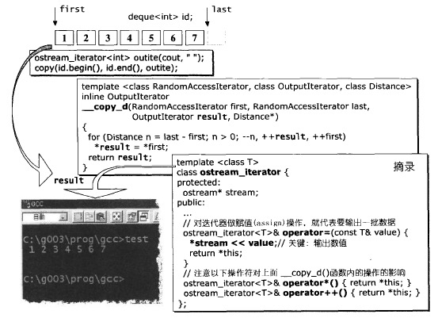 </div>

## 3.函数适配器

函数适配器(functor adapters，亦即function adapters)是所有适配器中数量最庞大的一个族群，其适配灵活度也是前2者所不能及，可以适配、适配、再适配

**函数适配器的价值**：通过它们之间的绑定、组合、修饰能力，几乎可以无限制地创造出各种可能的表达式，搭配STL算法一起演出。下表是STL函数适配器一览表：

<div align="center"> 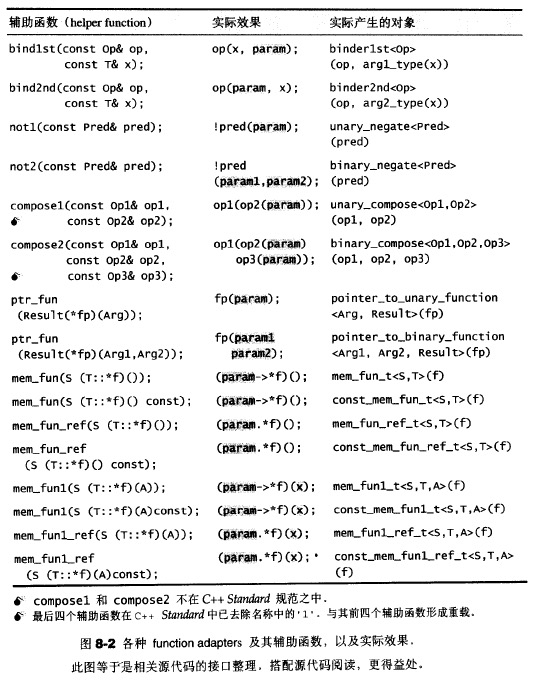 </div>

**适配操作包括**：

* **bind、negate、compose**
* **对一般函数或成员函数的修饰**

**C++标准规定，这些适配器的接口可由\<functional\>获得**，SGI STL将它们定义于\<stl_function.h\>

**注意，所有期望获得适配能力的组件，本身都必须是可适配的。换句话说，1）一元仿函数必须继承自unary_function；2）二元仿函数必须继承自binary_function；3）成员函数必须以mem_fun处理过；4）一般函数必须以ptr_fun处理过。一个未经ptr_fun处理过的一般函数，虽然也能以函数指针的形式传给STL算法使用，却无法拥有任何适配能力**

下图是count_if()和bind2nd(less<int>(),12)的搭配实例；

<div align="center"> 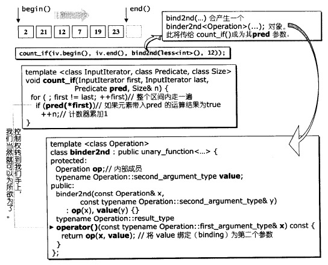 </div>

### 3.1 not1和not2

#### 1）not1

```c++
//以下适配器用来表示某个 "可适配 predicate" 的逻辑负值
template <class Predicate>
class unary_negate
  : public unary_function<typename Predicate::argument_type, bool> {
protected:
  Predicate pred;   //内部成员
public:
  explicit unary_negate(const Predicate& x) : pred(x) {}
  bool operator()(const typename Predicate::argument_type& x) const {
    return !pred(x); //将pred的运算结果加上否定运算
  }
};

//辅助函数，使我们得以更方便使用unary_negate
template <class Predicate>
inline unary_negate<Predicate> not1(const Predicate& pred) {
  return unary_negate<Predicate>(pred);
}
```

#### 2）not2

```c++
//以下适配器用来表示某个 "可适配 binary predicate" 的逻辑负值
template <class Predicate> 
class binary_negate 
  : public binary_function<typename Predicate::first_argument_type,
                           typename Predicate::second_argument_type,
                           bool> {
protected:
  Predicate pred;   //内部成员
public:
  explicit binary_negate(const Predicate& x) : pred(x) {}
  bool operator()(const typename Predicate::first_argument_type& x, 
                  const typename Predicate::second_argument_type& y) const {
    return !pred(x, y);  //将pred的运算结果加上否定运算
  }
};

//辅助函数，使我们得以更方便使用binary_negate
template <class Predicate>
inline binary_negate<Predicate> not2(const Predicate& pred) {
  return binary_negate<Predicate>(pred);
}
```

### 3.2 bind1st和bind2st

#### 1）bind1st

```c++
//以下适配器用来表示某个 "可适配 binary function" 转换为 “unary function”
template <class Operation> 
class binder1st
  : public unary_function<typename Operation::second_argument_type,
                          typename Operation::result_type> {
protected:
  Operation op;     //内部成员
  typename Operation::first_argument_type value;    //内部成员
public:
  binder1st(const Operation& x,
            const typename Operation::first_argument_type& y)
      : op(x), value(y) {}  //将表达式和第一参数记录于内部成员
  typename Operation::result_type
  operator()(const typename Operation::second_argument_type& x) const {
    return op(value, x);    //实际调用表达式，并将value绑定为第一参数
  }
};

//辅助函数，使我们得以更方便使用binder1st
template <class Operation, class T>
inline binder1st<Operation> bind1st(const Operation& op, const T& x) {
  //先把x转型为op的第一参数类型
  typedef typename Operation::first_argument_type arg1_type;
  return binder1st<Operation>(op, arg1_type(x));
}
```

#### 2）bind2st

```c++
//以下适配器用来表示某个 "可适配 binary function" 转换为 “unary function”
template <class Operation> 
class binder2nd
  : public unary_function<typename Operation::first_argument_type,
                          typename Operation::result_type> {
protected:
  Operation op;     //内部成员
  typename Operation::second_argument_type value;   //内部成员
public:
  binder2nd(const Operation& x,
            const typename Operation::second_argument_type& y) 
      : op(x), value(y) {}  //将表达式和第二参数记录于内部成员
  typename Operation::result_type
  operator()(const typename Operation::first_argument_type& x) const {
    return op(x, value);  //实际调用表达式，并将value绑定为第二参数
  }
};

//辅助函数，使我们得以更方便使用binder2nd
template <class Operation, class T>
inline binder2nd<Operation> bind2nd(const Operation& op, const T& x) {
  //先把x转型为op的第一参数类型
  typedef typename Operation::second_argument_type arg2_type;
  return binder2nd<Operation>(op, arg2_type(x));
}
```

### 3.3 compose1和compose2

#### 1）compose1

```c++
//已知两个 "可适配 unary function" f(),g()，以下适配器用来产生一个h()，
//使 h(x) = f(g(x))
template <class Operation1, class Operation2>
class unary_compose : public unary_function<typename Operation2::argument_type,
                                            typename Operation1::result_type> {
protected:
  Operation1 op1;   //内部成员
  Operation2 op2;   //内部成员
public:
  //构造函数，将两个表达式记录于内部成员
  unary_compose(const Operation1& x, const Operation2& y) : op1(x), op2(y) {}
  
  typename Operation1::result_type
  operator()(const typename Operation2::argument_type& x) const {
    return op1(op2(x));     //函数合成
  }
};

//辅助函数，让我们得以方便运用unary_compose
template <class Operation1, class Operation2>
inline unary_compose<Operation1, Operation2> compose1(const Operation1& op1, 
                                                      const Operation2& op2) {
  return unary_compose<Operation1, Operation2>(op1, op2);
}
```

#### 2）compose2

```c++
//已知一个 “可适配 binary function” f 和 两个 "可适配 unary function" g1,g2，
//以下适配器用来产生一个h，使 h(x) = f(g1(x),g2(x))
template <class Operation1, class Operation2, class Operation3>
class binary_compose
  : public unary_function<typename Operation2::argument_type,
                          typename Operation1::result_type> {
protected:
  Operation1 op1;   //内部成员
  Operation2 op2;   //内部成员
  Operation3 op3;   //内部成员
public:
  //构造函数，将三个表达式记录于内部成员
  binary_compose(const Operation1& x, const Operation2& y, 
                 const Operation3& z) : op1(x), op2(y), op3(z) { }
  typename Operation1::result_type
  operator()(const typename Operation2::argument_type& x) const {
    return op1(op2(x), op3(x));     //函数合成
  }
};

//辅助函数，让我们得以方便运用binary_compose
template <class Operation1, class Operation2, class Operation3>
inline binary_compose<Operation1, Operation2, Operation3> 
compose2(const Operation1& op1, const Operation2& op2, const Operation3& op3) {
  return binary_compose<Operation1, Operation2, Operation3>(op1, op2, op3);
}
```

### 3.4 用于函数指针的ptr_fun

```c++
//以下适配器其实就是把一个一元函数指针包起来
//当仿函数被动调用时，就调用该函数指针
template <class Arg, class Result>
class pointer_to_unary_function : public unary_function<Arg, Result> {
protected:
  Result (*ptr)(Arg);   //内部成员，一个函数指针
public:
  pointer_to_unary_function() {}
  //构造函数，将函数指针记录于内部成员中
  explicit pointer_to_unary_function(Result (*x)(Arg)) : ptr(x) {}
  //通过函数指针指向函数
  Result operator()(Arg x) const { return ptr(x); }
};

//辅助函数，让我们得以方便使用pointer_to_unary_function 
template <class Arg, class Result>
inline pointer_to_unary_function<Arg, Result> ptr_fun(Result (*x)(Arg)) {
  return pointer_to_unary_function<Arg, Result>(x);
}

//以下适配器其实就是把一个二元函数指针包起来
//当仿函数被动调用时，就调用该函数指针
template <class Arg1, class Arg2, class Result>
class pointer_to_binary_function : public binary_function<Arg1, Arg2, Result> {
protected:
    Result (*ptr)(Arg1, Arg2);  //内部成员，一个函数指针
public:
    pointer_to_binary_function() {}
    //构造函数，将函数指针记录于内部成员中
    explicit pointer_to_binary_function(Result (*x)(Arg1, Arg2)) : ptr(x) {}
    //通过函数指针指向函数
    Result operator()(Arg1 x, Arg2 y) const { return ptr(x, y); }
};

//辅助函数，让我们得以方便使用pointer_to_binary_function 
template <class Arg1, class Arg2, class Result>
inline pointer_to_binary_function<Arg1, Arg2, Result> 
ptr_fun(Result (*x)(Arg1, Arg2)) {
  return pointer_to_binary_function<Arg1, Arg2, Result>(x);
}
```

### 3.5 用于成员函数指针的mem_fun和mem_fun_ref

假设Shape是一个继承体系中的基类，并且具有虚函数display()，有一个vector<Shape*> V，那么可以给for_each()传入一个以适配器mem_fun修饰的display()：

```c++
for_each(V.begin(),V.end(),mem_fun(&Shape::display));
```

不能写成：

```c++
for_each(V.begin(),V.end(),&Shape::display);
for_each(V.begin(),V.end(),Shape::display);
```

以下是用于成员函数的适配器的实现：

```c++
//“无任何参数”、“通过pointer调用”、“non-const成员函数”
template <class S, class T>
class mem_fun_t : public unary_function<T*, S> {
public:
  explicit mem_fun_t(S (T::*pf)()) : f(pf) {}       //构造函数
  S operator()(T* p) const { return (p->*f)(); }    //转调用
private:
  S (T::*f)();
};

//“无任何参数”、“通过pointer调用”、“const成员函数”
template <class S, class T>
class const_mem_fun_t : public unary_function<const T*, S> {
public:
  explicit const_mem_fun_t(S (T::*pf)() const) : f(pf) {} //构造函数
  S operator()(const T* p) const { return (p->*f)(); }    //转调用
private:
  S (T::*f)() const;
};

//“无任何参数”、“通过reference调用”、“non-const成员函数”
template <class S, class T>
class mem_fun_ref_t : public unary_function<T, S> {
public:
  explicit mem_fun_ref_t(S (T::*pf)()) : f(pf) {}   //构造函数
  S operator()(T& r) const { return (r.*f)(); }     //转调用
private:
  S (T::*f)();
};

//“无任何参数”、“通过reference调用”、“const成员函数”
template <class S, class T>
class const_mem_fun_ref_t : public unary_function<T, S> {
public:
  explicit const_mem_fun_ref_t(S (T::*pf)() const) : f(pf) {}  //构造函数
  S operator()(const T& r) const { return (r.*f)(); }          //转调用
private:
  S (T::*f)() const;
};

//“有1个参数”、“通过pointer调用”、“non-const成员函数”
template <class S, class T, class A>
class mem_fun1_t : public binary_function<T*, A, S> {
public:
  explicit mem_fun1_t(S (T::*pf)(A)) : f(pf) {}         //构造函数
  S operator()(T* p, A x) const { return (p->*f)(x); }  //转调用
private:
  S (T::*f)(A);
};

//“有1个参数”、“通过pointer调用”、“const成员函数”
template <class S, class T, class A>
class const_mem_fun1_t : public binary_function<const T*, A, S> {
public:
  explicit const_mem_fun1_t(S (T::*pf)(A) const) : f(pf) {}  //构造函数
  S operator()(const T* p, A x) const { return (p->*f)(x); } //转调用
private:
  S (T::*f)(A) const;
};

//“有1个参数”、“通过reference调用”、“non-const成员函数”
template <class S, class T, class A>
class mem_fun1_ref_t : public binary_function<T, A, S> {
public:
  explicit mem_fun1_ref_t(S (T::*pf)(A)) : f(pf) {}     //构造函数
  S operator()(T& r, A x) const { return (r.*f)(x); }   //转调用
private:
  S (T::*f)(A);
};

//“有1个参数”、“通过reference调用”、“const成员函数”
template <class S, class T, class A>
class const_mem_fun1_ref_t : public binary_function<T, A, S> {
public:
  explicit const_mem_fun1_ref_t(S (T::*pf)(A) const) : f(pf) {} //构造函数
  S operator()(const T& r, A x) const { return (r.*f)(x); }     //转调用
private:
  S (T::*f)(A) const;
};

/*********************************************************
 * 下面的8个辅助函数简化了上面8个类的使用
 * mem_fun 与 mem_fun_ref
 * mem_fun1 与 mem_fun1_ref：C++标准已经去掉了1，改成和上面2个
                            函数重载的形式
 *********************************************************/

template <class S, class T>
inline mem_fun_t<S,T> mem_fun(S (T::*f)()) { 
  return mem_fun_t<S,T>(f);
}

template <class S, class T>
inline const_mem_fun_t<S,T> mem_fun(S (T::*f)() const) {
  return const_mem_fun_t<S,T>(f);
}

template <class S, class T>
inline mem_fun_ref_t<S,T> mem_fun_ref(S (T::*f)()) { 
  return mem_fun_ref_t<S,T>(f);
}

template <class S, class T>
inline const_mem_fun_ref_t<S,T> mem_fun_ref(S (T::*f)() const) {
  return const_mem_fun_ref_t<S,T>(f);
}

template <class S, class T, class A>
inline mem_fun1_t<S,T,A> mem_fun1(S (T::*f)(A)) { 
  return mem_fun1_t<S,T,A>(f);
}

template <class S, class T, class A>
inline const_mem_fun1_t<S,T,A> mem_fun1(S (T::*f)(A) const) {
  return const_mem_fun1_t<S,T,A>(f);
}

template <class S, class T, class A>
inline mem_fun1_ref_t<S,T,A> mem_fun1_ref(S (T::*f)(A)) { 
  return mem_fun1_ref_t<S,T,A>(f);
}

template <class S, class T, class A>
inline const_mem_fun1_ref_t<S,T,A> mem_fun1_ref(S (T::*f)(A) const) {
  return const_mem_fun1_ref_t<S,T,A>(f);
}

```