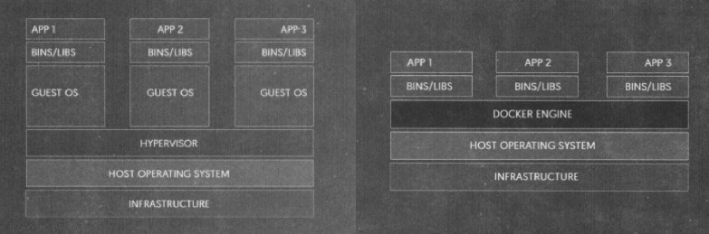
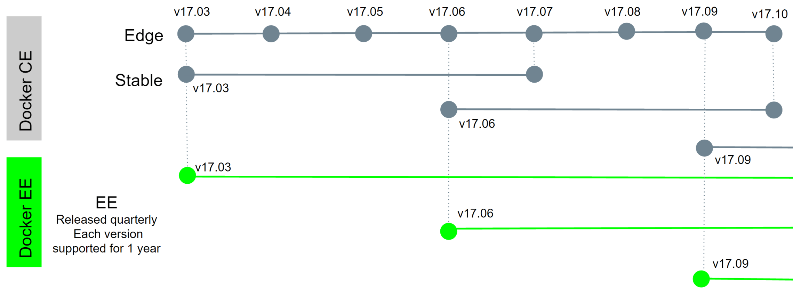
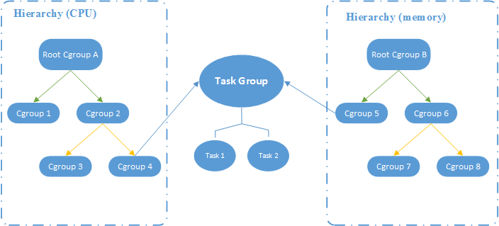
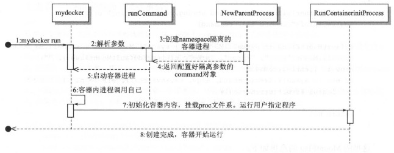
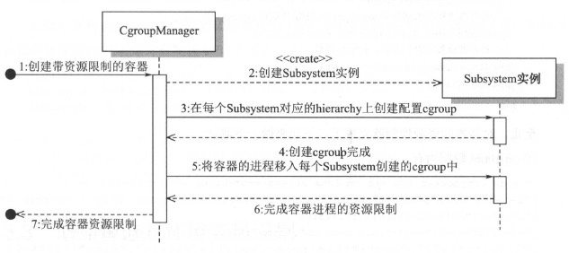
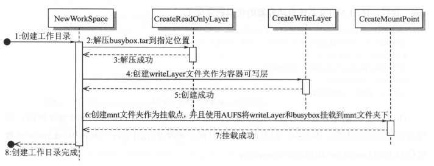
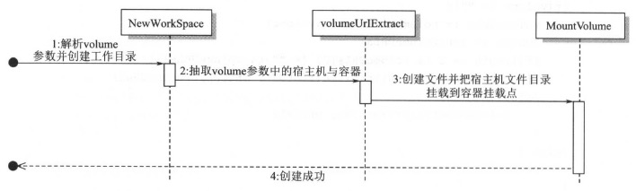

* [一.容器简介](#一容器简介)
    - [1.容器与虚拟机](#1容器与虚拟机)
    - [2.容器的用途](#2容器的用途)
    - [3.Docker版本](#3docker版本)
* [二.基础技术](#二基础技术)
    - [1.Namespace](#1namespace)
        + [1.1 UTS Namespace](#11-uts-namespace)
        + [1.2 IPC Namespace](#12-ipc-namespace)
        + [1.3 PID Namespace](#13-pid-namespace)
        + [1.4 Mount Namespace](#14-mount-namespace)
        + [1.5 User Namesapce](#15-user-namesapce)
        + [1.6 Network Namespace](#16-network-namespace)
    - [2.Cgroups](#2cgroups)
        + [2.1 Cgroups中的3个组件](#21-cgroups中的3个组件)
        + [2.2 Cgroup文件系统](#22-cgroup文件系统)
* [三.构造容器](#三构造容器)
    - [1.proc文件系统](#1proc文件系统)
    - [2.mydocker文件分布结构](#2mydocker文件分布结构)
    - [3.实现run命令](#3实现run命令)
    - [4.增加容器资源限制](#4增加容器资源限制)
        + [4.1 子系统限制资源](#41-子系统限制资源)
        + [4.2 查找cgroup路径](#42-查找cgroup路径)
        + [4.3 管理每个cgroup](#43-管理每个cgroup)
        + [4.4 带资源限制的容器](#44-带资源限制的容器)
* [四.构造镜像](#四构造镜像)
    - [1.联合挂载与volume挂载](#1联合挂载与volume挂载)
    - [2.volume卸载与容器文件系统卸载](#2volume卸载与容器文件系统卸载)
    - [3.简单的镜像打包](#3简单的镜像打包)

<br>
<br>
<br>
<br>
<br>
<br>

# 一.容器简介

## 1.容器与虚拟机

<div align="center">  </div>

* **虚拟机**：包含用户程序、必要的函数库、整个客户操作系统，所有这些差不多需要占用几个GB的空间
* **容器**：：包含用户程序和所有的依赖，但是容器之间共享内核。各个容器在宿主机上相互隔离，在用户态下运行

<br>

## 2.容器的用途

1. **加速开发效率**
    * 不需要耗费大量时间设置开发环境
    * 隔离性使得开发者可以为自己的应用选择最好的语言和工具，不要担心产生内部工具的冲突
    * 将应用程序的配置和所有依赖打包成镜像，可以保证应用在任何环境中都能按预期来运行
2. **合作开发**
    * 使用Docker Hub管理分享镜像
3. **快速扩容**
    * Docker容器可以秒级启动和停止，因此，可以在需要的时候快速扩容出大量的应用程序，抗住并发的压力

<br>

## 3.Docker版本

Docker从1.13.x版本开始，版本分为企业版EE和社区版CE，版本号也改为按照时间线来发布。比如17.03就是2017年3月，有点类似于ubuntu的版本发布方式

<div align="center">  </div>

<br>
<br>

# 二.基础技术

## 1.Namespace

* kernel的一个功能
* 可以隔离一系列系统资源：比如PID(Process ID)，User ID, Network等等

当前Linux一共实现了6种不同类型的Namespace：

| Namespace类型        | 系统调用参数           | 内核版本 |
| :-------------: |:-------------:| :-----:|
| [Mount namespaces](#14-mount-namespace)      | CLONE_NEWNS | 2.4.19 |
| [UTS namespaces](#11-uts-namespace)      | CLONE_NEWUTS   |   2.6.19 |
| [IPC namespaces](#12-ipc-namespace) | CLONE_NEWIPC    |    2.6.19 |
| [PID namespaces](#13-pid-namespace) | CLONE_NEWPID | 2.6.24 |
| [Network namespaces](#16-network-namespace) | CLONE_NEWNET |  2.6.29 |
| [User namespaces](#15-user-namesapce) | CLONE_NEWUSER | 3.8 |

Namesapce 的API主要使用三个系统调用

* **clone()**：创建新进程。根据系统调用参数来判断哪种类型的namespace被创建，而且它们的子进程也会被包含到namespace中
* **unshare()**：将进程**移出**某个namespace
* **setns()**：将进程**加入**到namespace中

### 查看进程的namespace信息

```bash
#1.ls -l
[root@303f9007851f mnt]# ls -l /proc/1/ns/
total 0
lrwxrwxrwx 1 root root 0 Jul 16 08:05 cgroup -> cgroup:[4026531835]
lrwxrwxrwx 1 root root 0 Jul 16 08:05 ipc -> ipc:[4026532243]
lrwxrwxrwx 1 root root 0 Jul 16 08:05 mnt -> mnt:[4026532241]
lrwxrwxrwx 1 root root 0 Jul 16 08:05 net -> net:[4026532246]
lrwxrwxrwx 1 root root 0 Jul 16 08:05 pid -> pid:[4026532244]
lrwxrwxrwx 1 root root 0 Jul 16 08:05 user -> user:[4026531837]
lrwxrwxrwx 1 root root 0 Jul 16 08:05 uts -> uts:[4026532242]

#2.readlink
[root@303f9007851f mnt]# readlink /proc/1/ns/cgroup
cgroup:[4026531835]
[root@303f9007851f mnt]# readlink /proc/1/ns/ipc
ipc:[4026532243]
[root@303f9007851f mnt]# readlink /proc/1/ns/mnt
mnt:[4026532241]
[root@303f9007851f mnt]# readlink /proc/1/ns/net
net:[4026532246]
[root@303f9007851f mnt]# readlink /proc/1/ns/pid
pid:[4026532244]
[root@303f9007851f mnt]# readlink /proc/1/ns/user
user:[4026531837]
[root@303f9007851f mnt]# readlink /proc/1/ns/uts
uts:[4026532242]
```

### 1.1 UTS Namespace

> UTS是UNIX Timesharing System的简称

主要隔离nodename和domainname两个系统标识。在UTS namespace里面，每个 namespace 允许有自己的**主机名**

以下程序执行的命令会创建一个新的UTS Namespace：

```go
package main

import (
    "os/exec"
    "syscall"
    "os"
    "log"
)

func main() {
    cmd := exec.Command("sh") //指定执行的命令
    //设置系统调用参数
    cmd.SysProcAttr = &syscall.SysProcAttr{
        Cloneflags: syscall.CLONE_NEWUTS,  //创建一个UTS Namespace
    }
    cmd.Stdin = os.Stdin
    cmd.Stdout = os.Stdout
    cmd.Stderr = os.Stderr

    if err := cmd.Run(); err != nil {
        log.Fatal(err)
    }
}
```

查看父子进程是否在同一个UTS Namespace中：

```bash
sh-4.1# pstree -lp
bash(1)───go(17)─┬─main(36)─┬─sh(40)───pstree(43)
                 │          ├─{main}(37)
                 │          ├─{main}(38)
                 │          └─{main}(39)
                 ├─{go}(18)
                 ├─{go}(19)
                 ├─{go}(20)
                 ├─{go}(21)
                 └─{go}(22)
sh-4.1# pstree -lp
bash(1)───go(17)─┬─main(36)─┬─sh(40)───pstree(44)
                 │          ├─{main}(37)
                 │          ├─{main}(38)
                 │          └─{main}(39)
                 ├─{go}(18)
                 ├─{go}(19)
                 ├─{go}(20)
                 ├─{go}(21)
                 └─{go}(22)
sh-4.1# echo $$
40
sh-4.1# readlink /proc/36/ns/uts
uts:[4026532242]
sh-4.1# readlink /proc/40/ns/uts
uts:[4026532328]
```

测试在子进程中修改主机名是否会影响父进程：

```bash
sh-4.1# hostname
c74daf96aad0
sh-4.1# hostname chenximing
sh-4.1# hostname
chenximing

[root@c74daf96aad0 /]# hostname
c74daf96aad0
```

### 1.2 IPC Namespace

IPC Namespace 是用来隔离 System V IPC 和POSIX message queues.每一个IPC Namespace都有他们自己的System V IPC 和POSIX message queue

以下程序执行的命令会创建一个新的IPC Namespace：

```go
package main

import (
    "log"
    "os"
    "os/exec"
    "syscall"
)

func main() {
    cmd := exec.Command("sh") //指定执行的命令
    //设置系统调用参数
    cmd.SysProcAttr = &syscall.SysProcAttr{
        Cloneflags: syscall.CLONE_NEWUTS | syscall.CLONE_NEWIPC,
    }
    cmd.Stdin = os.Stdin
    cmd.Stdout = os.Stdout
    cmd.Stderr = os.Stderr

    if err := cmd.Run(); err != nil {
        log.Fatal(err)
    }
}
```

测试父子进程是否拥有独立的IPC：

```bash
# 以下查看、然后在父进程中创建一个message queue
[root@c74daf96aad0 mnt]# ipcs -q

------ Message Queues --------
key        msqid      owner      perms      used-bytes   messages

[root@c74daf96aad0 mnt]# ipcmk -Q
Message queue id: 0
[root@c74daf96aad0 mnt]# ipcs -q

------ Message Queues --------
key        msqid      owner      perms      used-bytes   messages
0x58f3f100 0          root       644        0            0

# 以下运行前面的go程序，子进程会创建新的IPC Namespace
[root@c74daf96aad0 mnt]# go run main.go
sh-4.1# ipcs -q

------ Message Queues --------
key        msqid      owner      perms      used-bytes   messages
```

### 1.3 PID Namespace

PID namespace是用来隔离进程 id。同样的一个进程在不同的 PID Namespace 里面可以拥有不同的 PID。这样就可以理解，在 docker container 里面，我们使用ps -ef 经常能发现，容器内在前台跑着的那个进程的 PID 是1，但是我们在容器外，使用ps -ef会发现同样的进程却有不同的 PID，这就是PID namespace 干的事情

以下程序执行的命令会创建一个新的PID Namespace：

```go
package main

import (
    "log"
    "os"
    "os/exec"
    "syscall"
)

func main() {
    cmd := exec.Command("sh") //指定执行的命令
    //设置系统调用参数
    cmd.SysProcAttr = &syscall.SysProcAttr{
        Cloneflags: syscall.CLONE_NEWUTS | syscall.CLONE_NEWIPC | syscall.CLONE_NEWPID,
    }
    cmd.Stdin = os.Stdin
    cmd.Stdout = os.Stdout
    cmd.Stderr = os.Stderr

    if err := cmd.Run(); err != nil {
        log.Fatal(err)
    }
}
```

查看相同子进程在不同PID Namespace中pid：

```bash
# 子进程sh在父进程PID Namespace中的pid为163
[root@c74daf96aad0 /]# pstree -pl
bash(1)───go(140)─┬─pid(159)─┬─sh(163)
                  │          ├─{pid}(160)
                  │          ├─{pid}(161)
                  │          └─{pid}(162)
                  ├─{go}(141)
                  ├─{go}(142)
                  ├─{go}(143)
                  ├─{go}(144)
                  └─{go}(145)

# 子进程在新建的PID Namespace中的pid为1，如果没有创建新PID Namespace，这里会显示163
sh-4.1# echo $$
1
```

### 1.4 Mount Namespace

> mount namespace是Linux 第一个实现的namesapce 类型，因此它的系统调用参数是CLONE_NEWNS(new namespace 的缩写)

mount namespace 是用来隔离各个进程看到的挂载点视图。在不同namespace中的进程看到的文件系统层次是不一样的。在mount namespace 中调用mount()和umount()仅仅只会影响当前namespace内的文件系统，而对全局的文件系统是没有影响的

### 1.5 User Namesapce

User namespace 主要是隔离用户的用户组ID。也就是说，一个进程的User ID 和Group ID 在User namespace 内外可以是不同的。比较常用的是，在宿主机上以一个非root用户运行创建一个User namespace，然后在User namespace里面却映射成root 用户。这样意味着，这个进程在User namespace里面有root权限，但是在User namespace外面却没有root的权限。从Linux kernel 3.8开始，非root进程也可以创建User namespace ,并且此进程在namespace里面可以被映射成 root并且在 namespace内有root权限

以下程序执行的命令会创建一个新的User Namespace：

```go
package main

import (
    "log"
    "os"
    "os/exec"
    "syscall"
)

func main() {
    cmd := exec.Command("sh") //指定执行的命令
    //设置系统调用参数
    cmd.SysProcAttr = &syscall.SysProcAttr{
        Cloneflags: syscall.CLONE_NEWUTS | syscall.CLONE_NEWIPC | syscall.CLONE_NEWPID | syscall.CLONE_NEWNS | syscall.CLONE_NEWUSER,
    }
    cmd.Stdin = os.Stdin
    cmd.Stdout = os.Stdout
    cmd.Stderr = os.Stderr

    if err := cmd.Run(); err != nil {
        log.Fatal(err)
    }
}
```

查看当前用户在不同User Namespace下的id：

```bash
[root@c74daf96aad0 mnt]# id
uid=0(root) gid=0(root) groups=0(root)

# 如果没有创建新的User Namespace，以下仍会是root
[root@c74daf96aad0 mnt]# go run namespace/user.go
sh-4.1$ id
uid=65534 gid=65534 groups=65534
```

### 1.6 Network Namespace

Network namespace 是用来隔离网络设备，IP地址端口等网络栈的namespace。Network namespace 可以让每个容器拥有自己独立的网络设备（虚拟的），而且容器内的应用可以绑定到自己的端口，每个 namesapce 内的端口都不会互相冲突。在宿主机上搭建网桥后，就能很方便的实现容器之间的通信，而且每个容器内的应用都可以使用相同的端口

以下程序执行的命令会创建一个新的User Namespace：

```go
import (
    "log"
    "os"
    "os/exec"
    "syscall"
)

func main() {
    cmd := exec.Command("sh") //指定执行的命令
    //设置系统调用参数
    cmd.SysProcAttr = &syscall.SysProcAttr{
        Cloneflags: syscall.CLONE_NEWUTS | syscall.CLONE_NEWIPC | syscall.CLONE_NEWPID | syscall.CLONE_NEWNS | syscall.CLONE_NEWUSER | syscall.CLONE_NEWNET,
    }
    cmd.Stdin = os.Stdin
    cmd.Stdout = os.Stdout
    cmd.Stderr = os.Stderr

    if err := cmd.Run(); err != nil {
        log.Fatal(err)
    }
}
```

使用`ifconfig`可以查看到新的User Namespace中没有网络设备

<br>

## 2.Cgroups

Linux Cgroups(Control Groups) 提供了对一组进程及将来的子进程的资源的限制，控制和统计的能力，这些资源包括CPU，内存，存储，网络等。通过Cgroups，可以方便的限制某个进程的资源占用，并且可以实时的监控进程的监控和统计信息

### 2.1 Cgroups中的3个组件

1. **cgroup(控制组)**：控制组就是一组按照某种标准划分的进程。Cgroups 中的资源控制都是以控制族群为单位实现。一个进程可以加入到某个控制组,也从一个进程组迁 移到另一个控制组。一个进程组的进程可以使用 cgroups 以控制族群为单位分配的资源, 同时受到 cgroups 以控制组为单位设定的限制
2. **subsystem(子系统)**：一个子系统就是一个资源控制器。比如 cpu 子系统就是控制 cpu 时 间分配的一个控制器。子系统必须附加(attach)到一个hierarchy上才能起作用,一个子系统附 加到某个hierarchy以后,这个hierarchy上的所有控制族群都受到这个子系统的控制，一般包含有：
    * **blkio** 设置对块设备（比如硬盘）的输入输出的访问控制
    * **cpu** 设置cgroup中的进程的CPU被调度的策略
    * **cpuacct** 可以统计cgroup中的进程的CPU占用
    * **cpuset** 在多核机器上设置cgroup中的进程可以使用的CPU和内存（此处内存仅使用于NUMA架构）
    * **devices** 控制cgroup中进程对设备的访问
    * **freezer** 用于挂起(suspends)和恢复(resumes) cgroup中的进程
    * **memory** 用于控制cgroup中进程的内存占用
    * **net_cls** 用于将cgroup中进程产生的网络包分类(classify)，以便Linux的tc(traffic controller) 可以根据分类(classid)区分出来自某个cgroup的包并做限流或监控。
    * **net_prio** 设置cgroup中进程产生的网络流量的优先级
    * **ns** 这个subsystem比较特殊，它的作用是cgroup中进程在新的namespace fork新进程(NEWNS)时，创建出一个新的cgroup，这个cgroup包含新的namespace中进程
    
    这些subsystem是逐步合并到内核中的，可以安装cgroup的命令行工具(apt-get install cgroup-bin)，然后通过lssubsys看到kernel支持的subsystem

    ```bash
    # -m同时列出子系统的挂载点
    root@068ca8da6d06:/# lssubsys -m
    cpuset /sys/fs/cgroup/cpuset
    cpu /sys/fs/cgroup/cpu
    cpuacct /sys/fs/cgroup/cpuacct
    blkio /sys/fs/cgroup/blkio
    memory /sys/fs/cgroup/memory
    devices /sys/fs/cgroup/devices
    freezer /sys/fs/cgroup/freezer
    net_cls /sys/fs/cgroup/net_cls
    perf_event /sys/fs/cgroup/perf_event
    net_prio /sys/fs/cgroup/net_prio
    hugetlb /sys/fs/cgroup/hugetlb
    pids /sys/fs/cgroup/pids
    ```

3. **hierarchy(层级)**：控制族群可以组织成 hierarchical 的形式,既一颗控制族群树。控制族群树上的子节点控制族群是父节点控制族群的孩子,继承父控制族群的特定的属性

<div align="center">  </div>

### 2.2 Cgroup文件系统

把cgroup文件系统挂载（mount）上以后，就可以像操作文件一样对cgroups的hierarchy进行浏览和操作管理（包括权限管理、子文件管理等等）

**`/sys/fs/cgroup`是cgroup文件系统的挂载点**：

```bash
root@068ca8da6d06:/# df -a | grep cgroup
tmpfs            1023468       0   1023468   0% /sys/fs/cgroup
cpuset                 0       0         0    - /sys/fs/cgroup/cpuset
cpu                    0       0         0    - /sys/fs/cgroup/cpu
cpuacct                0       0         0    - /sys/fs/cgroup/cpuacct
blkio                  0       0         0    - /sys/fs/cgroup/blkio
memory                 0       0         0    - /sys/fs/cgroup/memory
devices                0       0         0    - /sys/fs/cgroup/devices
freezer                0       0         0    - /sys/fs/cgroup/freezer
net_cls                0       0         0    - /sys/fs/cgroup/net_cls
perf_event             0       0         0    - /sys/fs/cgroup/perf_event
net_prio               0       0         0    - /sys/fs/cgroup/net_prio
hugetlb                0       0         0    - /sys/fs/cgroup/hugetlb
pids                   0       0         0    - /sys/fs/cgroup/pids
cgroup                 0       0         0    - /sys/fs/cgroup/systemd
```

* `/sys/fs/cgroup`下的每个目录及其子目录构成了一个**hierarchy(层级)**
* 在每个**root cgroup(根控制组)**下可以创建目录，比如在`blkio`目录下新建一个`docker`，每个创建的目录就对应一个**cgroup(控制组)**
* 每个**root cgroup**(**根控制组**)下的`tasks`文件包含了创建**root cgroup**(**根控制组**)时，系统中的所有进程。新建一个**cgroup**(**控制组**)时，新**cgroup**(**控制组**)中`tasks`文件中不包含任务

<br>
<br>

# 三.构造容器

## 1.proc文件系统

Linux下的`/proc`文件系统是由内核提供的，它其实不是一个真正的文件系统，只包含了系统运行时的信息（比如内存、mount设备信息、一些硬件配置等），它只存在于内存中，不占用外存空间。它以文件系统的形式，为访问内核数据的操作提供接口

| | |
|:--:|:--:|
|`/proc/N`|PID为N的进程信息 |
|`/proc/N/cmdline` |进程启动命令 |
|`/proc/N/cwd` |进程的当前工作目录 |
|`/proc/N/environ` |进程环境变量列表 |
|`/proc/N/exe` |进程的执行命令文件 |
|`/proc/N/fd` |包含进程相关的所有文件描述符 |
|`/proc/N/maps` |与进程相关的内存映射信息 |
|`/proc/N/mem` |指代进程持有的内存，不可读 |
|`/proc/N/root` |进程的根目录 |
|`/proc/N/stat` |进程的状态 |
|`/proc/N/statm` |进程使用的内存状态 |
|`/proc/N/status` |进程状态信息，比`stat`/`statm`更具可读性 |
|`/proc/N/self` |当前正在运行的进程 |

<br>

## 2.mydocker文件分布结构

```
mydocker
   |------- container
   |            |-------- container_process.go  //包含了Run函数需要执行的NewParentProcess函数
   |            |-------- init.go  //包含了容器的init进程需要执行的RunContainerInitProcess函数
   |
   |------- Godeps
   |           |--------- Godeps.json
   |           |--------- Readme
   |
   |------- cgroups
   |           |-------- cgroup_manager.go      //包含了cgroup管理类的定义
   |           |---------subsystems
   |                         |
   |                         |---- cpu.go       //包含了cpu子系统结构体的定义
   |                         |---- cpuset.go    //包含了cpuset子系统结构体的定义
   |                         |---- memory.go    //包含了memory子系统结构体的定义
   |                         |---- subsystem.go //定义了用于cgroups的结构体和接口
   |                         |---- utils.go     //包含了一些工具函数
   |
   |------- main_command.go   //包含了mydocker各种命令（run、list、exec等）的定义
   |------- main.go           //程序入口
   |------- run.go            //包含了run命令执行的Run函数的定义
   |------- vendor
```

<br>

## 3.实现run命令

run命令的执行流程：

<div align="center">  </div>

1. [mydocker run](#1main)
2. 执行[runCommand命令](#2runcommand)（run命令）、解析命令行参数，调用[Run函数](#run)
3. [Run函数](#run)调用[NewParentProcess函数](#newparentprocess)，创建一个执行自身的命令，传递给该命令一个字符串`"init"`参数（因此，该命令执行时，也就是执行`mydocker init`），同时，该命令会创建隔离的Namespace
4. 完成3中的部分工作
5. 在[Run函数](#run)中，使用3和4返回的命令`parent`，通过`parent.Start()`函数来执行命令，也就是执行`mydocker init`，得到容器init进程，它会调用[initCommand命令](#initcommand)，
6. [initCommand命令](#initcommand)中会调用[RunContainerInitProcess函数](runcontainerinitprocess)
7. [RunContainerInitProcess函数](runcontainerinitprocess)调用[setUpMount函数](#setupmount)，该函数会调用[pivotRoot函数](#pivotroot)完成类型chroot的功能，然后挂载proc和tmpfs文件系统、[RunContainerInitProcess函数](runcontainerinitprocess)最后调用syscall.Exec将容器init进程替换成用户指定的程序
8. 创建完成，容器开始运行
9. 5中调用`parent.Start()`函数后，进程会创建容器的cgroup，并使用`CgroupManager`将容器的cgroup限制信息写入配置文件，然后将容器的进程id添加到tasks文件中

### 1）main

```go
func main() {
    app := cli.NewApp()
    app.Name = "mydocker"
    app.Usage = usage

    // 定义mydocker的一些基本命令
    app.Commands = []cli.Command{
        initCommand,
        runCommand, //run命令
        listCommand,
        logCommand,
        execCommand,
        stopCommand,
        removeCommand,
        commitCommand,
        networkCommand,
    }

    app.Before = func(context *cli.Context) error {
        // Log as JSON instead of the default ASCII formatter.
        log.SetFormatter(&log.JSONFormatter{})

        log.SetOutput(os.Stdout)
        return nil
    }

    if err := app.Run(os.Args); err != nil {
        log.Fatal(err)
    }
}
```

### 2）runCommand

```go
//run命令的定义
var runCommand = cli.Command{
    Name:  "run",
    Usage: `Create a container with namespace and cgroups limit ie: mydocker run -ti [image] [command]`,
    Flags: []cli.Flag{
        cli.BoolFlag{
            Name:  "ti",
            Usage: "enable tty",
        },
        cli.BoolFlag{
            Name:  "d",
            Usage: "detach container",
        },
        cli.StringFlag{
            Name:  "m",
            Usage: "memory limit",
        },
        cli.StringFlag{
            Name:  "cpushare",
            Usage: "cpushare limit",
        },
        cli.StringFlag{
            Name:  "cpuset",
            Usage: "cpuset limit",
        },
        cli.StringFlag{
            Name:  "name",
            Usage: "container name",
        },
        cli.StringFlag{
            Name:  "v",
            Usage: "volume",
        },
        cli.StringSliceFlag{
            Name:  "e",
            Usage: "set environment",
        },
        cli.StringFlag{
            Name:  "net",
            Usage: "container network",
        },
        cli.StringSliceFlag{
            Name:  "p",
            Usage: "port mapping",
        },
    },
    /*
     * 以下为run命令执行的真正函数
     */
    Action: func(context *cli.Context) error {
        if len(context.Args()) < 1 {
            return fmt.Errorf("Missing container command")
        }
        var cmdArray []string
        for _, arg := range context.Args() {
            cmdArray = append(cmdArray, arg)
        }

        /*
         * 解析参数
         */

        imageName := cmdArray[0]
        cmdArray = cmdArray[1:]

        createTty := context.Bool("ti")
        detach := context.Bool("d")

        if createTty && detach {
            return fmt.Errorf("ti and d paramter can not both provided")
        }
        //cgroup配置参数
        resConf := &subsystems.ResourceConfig{
            MemoryLimit: context.String("m"),
            CpuSet:      context.String("cpuset"),
            CpuShare:    context.String("cpushare"),
        }
        log.Infof("createTty %v", createTty)
        containerName := context.String("name")
        volume := context.String("v")
        network := context.String("net")

        envSlice := context.StringSlice("e")
        portmapping := context.StringSlice("p")

        //调用Run函数
        Run(createTty, cmdArray, resConf, containerName, volume, imageName, envSlice, network, portmapping)
        return nil
    },
}
```

### 3）Run

```go
func Run(tty bool, comArray []string, res *subsystems.ResourceConfig, containerName, volume, imageName string,
    envSlice []string, nw string, portmapping []string) {
    containerID := randStringBytes(10)
    if containerName == "" {
        containerName = containerID
    }

    parent, writePipe := container.NewParentProcess(tty, containerName, volume, imageName, envSlice)
    if parent == nil {
        log.Errorf("New parent process error")
        return
    }
    //执行NewParentProcess返回的命令它首先会clone 出来一个Namespace 隔离的
    //进程，然后在子进程中，调用 /proc/self/exe ，也就是调用自己，发送init 参数，
    //调用我们写的init 方法，去初始化容器的一些资源。
    if err := parent.Start(); err != nil {
        log.Error(err)
    }

    //record container info
    containerName, err := recordContainerInfo(parent.Process.Pid, comArray, containerName, containerID, volume)
    if err != nil {
        log.Errorf("Record container info error %v", err)
        return
    }

    /*
     * 下面由当前进程（容器的外部进程）设置容器的cgroup限制
     */
    
    // CgroupManager对象管理容器的cgroup
    cgroupManager := cgroups.NewCgroupManager(containerID)
    defer cgroupManager.Destroy()
    //调用set方法将容器的资源限制写入到3个子系统中容器cgroup下的配置文件中
    cgroupManager.Set(res)
    //将容器的进程id添加到3个子系统中容器cgroup下的tasks文件中
    cgroupManager.Apply(parent.Process.Pid)

    if nw != "" {
        // config container network
        network.Init()
        containerInfo := &container.ContainerInfo{
            Id:          containerID,
            Pid:         strconv.Itoa(parent.Process.Pid),
            Name:        containerName,
            PortMapping: portmapping,
        }
        if err := network.Connect(nw, containerInfo); err != nil {
            log.Errorf("Error Connect Network %v", err)
            return
        }
    }

    //对容器设置完限制之后，通过该函数将用户命令通过管道的写端发送给容器进程
    sendInitCommand(comArray, writePipe)

    if tty {
        parent.Wait() //等待容器从终端结束
        deleteContainerInfo(containerName)
        container.DeleteWorkSpace(volume, containerName)
    }
}

func sendInitCommand(comArray []string, writePipe *os.File) {
    command := strings.Join(comArray, " ")
    log.Infof("command all is %s", command)
    writePipe.WriteString(command)
    writePipe.Close()
}
```

### 4）NewParentProcess

```go
func NewParentProcess(tty bool, containerName, volume, imageName string, envSlice []string) (*exec.Cmd, *os.File) {
    readPipe, writePipe, err := NewPipe()
    if err != nil {
        log.Errorf("New pipe error %v", err)
        return nil, nil
    }
    //这里的 /proc/self/exe 调用中，/proc/self/ 指的是当前运行进程自己的环境， exec 其实就是自己
    //调用了自己，使用这种方式对创建出来的进程进行初始化
    initCmd, err := os.Readlink("/proc/self/exe")
    fmt.Println(initCmd)
    if err != nil {
        log.Errorf("get init process error %v", err)
        return nil, nil
    }
    //init 是传递给本进程的第一个参数，在本例中，其实就是会去调用initCommand
    //去初始化进程的一些环境和资源
    cmd := exec.Command(initCmd, "init")
    cmd.SysProcAttr = &syscall.SysProcAttr{
        //clone 参数指定了新进程需要创建哪些新的Namespace，即哪些环境需要隔离
        Cloneflags: syscall.CLONE_NEWUTS | syscall.CLONE_NEWPID | syscall.CLONE_NEWNS |
            syscall.CLONE_NEWNET | syscall.CLONE_NEWIPC,
    }
    //如果用户指定了－ti 参数，就需要把当前进程的输入输出导入到标准输入输出上
    if tty {
        cmd.Stdin = os.Stdin
        cmd.Stdout = os.Stdout
        cmd.Stderr = os.Stderr
    } else {
        dirURL := fmt.Sprintf(DefaultInfoLocation, containerName)
        if err := os.MkdirAll(dirURL, 0622); err != nil {
            log.Errorf("NewParentProcess mkdir %s error %v", dirURL, err)
            return nil, nil
        }
        stdLogFilePath := dirURL + ContainerLogFile
        stdLogFile, err := os.Create(stdLogFilePath)
        if err != nil {
            log.Errorf("NewParentProcess create file %s error %v", stdLogFilePath, err)
            return nil, nil
        }
        cmd.Stdout = stdLogFile
    }

    //在调用cmd命令时，会外带将管道的读句柄传递给子进程，因此容器内可以通过管道的读端从父进程读取信息
    //外带是因为标准输入、标准输出、标准错误3个文件句柄是子进程一创建就有的
    cmd.ExtraFiles = []*os.File{readPipe}

    cmd.Env = append(os.Environ(), envSlice...)
    NewWorkSpace(volume, imageName, containerName)
    cmd.Dir = fmt.Sprintf(MntUrl, containerName)
    return cmd, writePipe
}
```

### 5）initCommand

```go
//init命令的定义，此操作为内部方法，禁止外部调用
var initCommand = cli.Command{
    Name:  "init",
    Usage: "Init container process run user's process in container. Do not call it outside",
    Action: func(context *cli.Context) error {
        log.Infof("init come on")
        //调用container/init.go中的RunContainerInitProcess函数
        err := container.RunContainerInitProcess()
        return err
    },
}
```

### 6）RunContainerInitProcess

```go
//这里的init 函数是在容器内部执行的，也就是说， 代码执行到这里后，容器所在的进程其实就已经创建出来了，
//这是本容器执行的第一个进程。使用mount 先去挂载proc 文件系统，以便后面通过ps 等系统命令去查看当前进
//程资源的情况。
func RunContainerInitProcess() error {
    cmdArray := readUserCommand() //容器进程会在此等待父进程传递来的用户命令
    if cmdArray == nil || len(cmdArray) == 0 {
        return fmt.Errorf("Run container get user command error, cmdArray is nil")
    }

    setUpMount()
    //调用exec.LookPath ，可以在系统的PATH 里面寻找命令的绝对路径
    //因此可以不必麻烦的将命令写完整。比如“docker run ... /bin/ls” 
    //可以改成“docker run ... ls” 
    path, err := exec.LookPath(cmdArray[0])
    if err != nil {
        log.Errorf("Exec loop path error %v", err)
        return err
    }
    log.Infof("Find path %s", path)
    if err := syscall.Exec(path, cmdArray[0:], os.Environ()); err != nil {
        log.Errorf(err.Error())
    }
    return nil
}

func readUserCommand() []string {
    //uintptr(3）就是指index为3 的文件描述符，也就是传递进来的管道的一端
    pipe := os.NewFile(uintptr(3), "pipe")
    defer pipe.Close()
    //通过管道从父进程读取传递来的参数
    msg, err := ioutil.ReadAll(pipe)
    if err != nil {
        log.Errorf("init read pipe error %v", err)
        return nil
    }
    msgStr := string(msg)
    return strings.Split(msgStr, " ")
}
```

### 7）setUpMount

```go
func setUpMount() {
    pwd, err := os.Getwd()
    if err != nil {
        log.Errorf("Get current location error %v", err)
        return
    }
    log.Infof("Current location is %s", pwd)
    pivotRoot(pwd)  //相当于chroot的功能

    //mount proc
    //MS_NOEXEC在本文件系统中不允许允许其他程序
    //MS_NOSUID在本系统中运行程序的时候，不允许ser-user-ID或set-group-ID
    //MS_NODEV是自从Linux2.4以来，所有mount的系统都会都会默认设定的参数
    defaultMountFlags := syscall.MS_NOEXEC | syscall.MS_NOSUID | syscall.MS_NODEV
    syscall.Mount("proc", "/proc", "proc", uintptr(defaultMountFlags), "")

    //mount tmpfs
    syscall.Mount("tmpfs", "/dev", "tmpfs", syscall.MS_NOSUID|syscall.MS_STRICTATIME, "mode=755")
}
```

### 8）pivotRoot

```go
func pivotRoot(root string) error {
    /**
      为了使当前root的老 root 和新 root 不在同一个文件系统下，我们把root重新mount了一次
      bind mount是把相同的内容换了一个挂载点的挂载方法
    */
    if err := syscall.Mount(root, root, "bind", syscall.MS_BIND|syscall.MS_REC, ""); err != nil {
        return fmt.Errorf("Mount rootfs to itself error: %v", err)
    }
    // 创建 rootfs/.pivot_root 存储 old_root
    pivotDir := filepath.Join(root, ".pivot_root")
    if err := os.Mkdir(pivotDir, 0777); err != nil {
        return err
    }
    // pivot_root 到新的rootfs, 现在老的 old_root 是挂载在rootfs/.pivot_root
    // 挂载点现在依然可以在mount命令中看到
    if err := syscall.PivotRoot(root, pivotDir); err != nil {
        return fmt.Errorf("pivot_root %v", err)
    }
    // 修改当前的工作目录到根目录
    if err := syscall.Chdir("/"); err != nil {
        return fmt.Errorf("chdir / %v", err)
    }

    pivotDir = filepath.Join("/", ".pivot_root")
    // umount rootfs/.pivot_root
    if err := syscall.Unmount(pivotDir, syscall.MNT_DETACH); err != nil {
        return fmt.Errorf("unmount pivot_root dir %v", err)
    }
    // 删除临时文件夹
    return os.Remove(pivotDir)
}
```

<br>

## 4.增加容器资源限制

### 4.1 子系统限制资源

> 总的来说就是通过在子系统的层级下，使用文件操作来创建删除cgroup目录，读写配置文件进行控制

目前主要包括**cpu**、**cpuset**和**memory**三种限制，即实现了3个子系统，每个子系统实现了`Subsystem`接口，它要求子系统具有4个操作

```go
type Subsystem interface {
    //返回子系统的名字
    Name() string
    //设置某个cgroup 在这个Subsystem 中的资源限制
    Set(path string, res *ResourceConfig) error
    //将迸程添加到某个cgroup 中
    Apply(path string, pid int) error
    //移除某个cgroup
    Remove(path string) error
}
```

1. **Name**：返回子系统的名字
2. **Set**：在`path`表示的`cgroup`中，将`res`资源限制写入配置文件。资源限制使用结构体`ResourceConfig`记录
    ```go
    //用于传递资源限制配置的结构体
    type ResourceConfig struct {
        MemoryLimit string
        CpuShare    string
        CpuSet      string
    }
    ```
3. **Apply**：将`pid`进程添加到`path`表示的`cgroup`中
4. **Remove**：将`path`表示的`cgroup`删除

每个子系统定义在`mydocker/cgroups/subsystems`目录下，如`mydocker/cgroups/subsystems/memory.go`中定义的**memory**子系统：

```go
//子系统结构体并没有多余的成员，仅仅通过实现接口Subsystem的4个函数来实现继承
type MemorySubSystem struct {
}

//设置cgroupPath对应的cgroup的内存资源限制
func (s *MemorySubSystem) Set(cgroupPath string, res *ResourceConfig) error {
    //GetCgroupPath获取相对于s.Name()子系统的cgroupPath cgroup的路径
    //如果cgroup不存在（即没有相应目录），GetCgroupPath可能创建cgroup，
    //GetCgroupPath函数的最后一个bool参数就是用于指示是否需要创建
    if subsysCgroupPath, err := GetCgroupPath(s.Name(), cgroupPath, true); err == nil {
        if res.MemoryLimit != "" {
            //设置这个cgroup的内存限制，即将限制写入到cgroup对应目录的memory.limit_in_bytes文件中
            if err := ioutil.WriteFile(path.Join(subsysCgroupPath, "memory.limit_in_bytes"), []byte(res.MemoryLimit), 0644); err != nil {
                return fmt.Errorf("set cgroup memory fail %v", err)
            }
        }
        return nil
    } else {
        return err
    }

}

//删除cgroupPath对应的cgroup
func (s *MemorySubSystem) Remove(cgroupPath string) error {
    //GetCgroupPath获取相对于s.Name()子系统的cgroupPath cgroup的路径
    //如果cgroup不存在（即没有相应目录），GetCgroupPath可能创建cgroup，
    //GetCgroupPath函数的最后一个bool参数就是用于指示是否需要创建
    if subsysCgroupPath, err := GetCgroupPath(s.Name(), cgroupPath, false); err == nil {
        //调用RemoveAll删除目录
        return os.RemoveAll(subsysCgroupPath)
    } else {
        return err
    }
}

//将一个迸程加入到cgroupPath 对应的cgroup 中
func (s *MemorySubSystem) Apply(cgroupPath string, pid int) error {
    //GetCgroupPath获取相对于s.Name()子系统的cgroupPath cgroup的路径
    //如果cgroup不存在（即没有相应目录），GetCgroupPath可能创建cgroup，
    //GetCgroupPath函数的最后一个bool参数就是用于指示是否需要创建
    if subsysCgroupPath, err := GetCgroupPath(s.Name(), cgroupPath, false); err == nil {
        //将进程号写入到tasks文件中
        if err := ioutil.WriteFile(path.Join(subsysCgroupPath, "tasks"), []byte(strconv.Itoa(pid)), 0644); err != nil {
            return fmt.Errorf("set cgroup proc fail %v", err)
        }
        return nil
    } else {
        return fmt.Errorf("get cgroup %s error: %v", cgroupPath, err)
    }
}

func (s *MemorySubSystem) Name() string {
    return "memory"
}
```

整个系统创建一个数组`SubsystemsIns`，该数组包含了**cpu**、**cpuset**和**memory**3个子系统：

```go
var (
    SubsystemsIns = []Subsystem{
        &CpusetSubSystem{},
        &MemorySubSystem{},
        &CpuSubSystem{},
    }
)
```

### 4.2 查找cgroup路径

在子系统实现设置cgroup的资源控制、将进程添加到cgroup、创建cgroup等操作中，都要先获取cgroup的路径，通过GetCgroupPath函数来完成

```go
//GetCgroupPath获取相对于subsystem子系统的cgroupPath cgroup的路径
func GetCgroupPath(subsystem string, cgroupPath string, autoCreate bool) (string, error) {
    //找到子系统的根路径
    cgroupRoot := FindCgroupMountpoint(subsystem)
    //判断相对于子系统根路径的cgroupPath cgroup是否已经存在
    if _, err := os.Stat(path.Join(cgroupRoot, cgroupPath)); err == nil || (autoCreate && os.IsNotExist(err)) {
        if os.IsNotExist(err) {
            //cgroup不存在则通过创建一个目录来创建cgroup
            if err := os.Mkdir(path.Join(cgroupRoot, cgroupPath), 0755); err == nil {
            } else {
                return "", fmt.Errorf("error create cgroup %v", err)
            }
        }
        //返回cgroup的路径
        return path.Join(cgroupRoot, cgroupPath), nil
    } else {
        return "", fmt.Errorf("cgroup path error %v", err)
    }
}

//该函数查看/proc/self/mountinfo文件，找到并返回子系统的根路径，即整个层级的根
//对于memory来说，就是/sys/fs/cgroup/memory
func FindCgroupMountpoint(subsystem string) string {
    f, err := os.Open("/proc/self/mountinfo")
    if err != nil {
        return ""
    }
    defer f.Close()

    scanner := bufio.NewScanner(f)
    for scanner.Scan() {
        txt := scanner.Text()
        fields := strings.Split(txt, " ")
        for _, opt := range strings.Split(fields[len(fields)-1], ",") {
            if opt == subsystem {
                return fields[4]
            }
        }
    }
    if err := scanner.Err(); err != nil {
        return ""
    }

    return ""
}
```

### 4.3 管理每个cgroup

每个cgroup通过一个`CgroupManager`类型的对象来管理

```go
type CgroupManager struct {
    Path     string                     // cgroup相对于子系统根cgroup的路径
    Resource *subsystems.ResourceConfig // 资源配置
}
```

可以使用`NewCgroupManager`函数，通过传入cgroup的路径来创建一个管理该cgroup的对象：

```go
//根据cgroup的路径，创建一个关联这个cgroup的对象
func NewCgroupManager(path string) *CgroupManager {
    return &CgroupManager{
        Path: path,
    }
}
```

`CgroupManager`实现了3个管理cgroup的方法，它们都是通过遍历3个子系统组成的数组，然后调用每个子系统的相应方法，实现在相应子系统中设置限制、将进程添加到cgroup的tasks文件中、从子系统删除该cgroup

> 感觉这种实现是，每个cgroup同时关联到3个子系统，要么cgroup同时存在于3个子系统，要么同时不存在

```go
//将进程pid加入到这个cgroup中
func (c *CgroupManager) Apply(pid int) error {
    for _, subSysIns := range subsystems.SubsystemsIns {
        subSysIns.Apply(c.Path, pid)
    }
    return nil
}

//设置cgroup资源限制
func (c *CgroupManager) Set(res *subsystems.ResourceConfig) error {
    for _, subSysIns := range subsystems.SubsystemsIns {
        subSysIns.Set(c.Path, res)
    }
    return nil
}

//释放cgroup
func (c *CgroupManager) Destroy() error {
    for _, subSysIns := range subsystems.SubsystemsIns {
        if err := subSysIns.Remove(c.Path); err != nil {
            logrus.Warnf("remove cgroup fail %v", err)
        }
    }
    return nil
}
```

### 4.4 带资源限制的容器

<div align="center">  </div>

`CgroupManager`在配置容器资源限制时，首先会初始化子系统的实例（3个子系统组成的数组？），然后遍历调用子系统实例的set方法，创建和配置不同子系统挂载的层级中cgroup，最后再通过调用子系统实例的Apply方法将容器的进程分别加入到那些cgroup中，实现容器中的资源限制

具体步骤在run命令执行的[Run函数](#3run)中

<br>
<br>

# 四.构造镜像

## 1.联合挂载与volume挂载

**使用tar格式的镜像文件，挂载时解压镜像到一层镜像层目录，然后创建容器的读写层目录，最后创建容器的挂载目录，调用mount将镜像层和容器层进行联合挂载**

整个联合挂载通过函数 NewWorkSpace 完成

```go
//Create a AUFS filesystem as container root workspace
func NewWorkSpace(volume, imageName, containerName string) {
    CreateReadOnlyLayer(imageName)
    CreateWriteLayer(containerName)
    CreateMountPoint(containerName, imageName)
    if volume != "" {
        volumeURLs := strings.Split(volume, ":")
        length := len(volumeURLs)
        if length == 2 && volumeURLs[0] != "" && volumeURLs[1] != "" {
            MountVolume(volumeURLs, containerName)
            log.Infof("NewWorkSpace volume urls %q", volumeURLs)
        } else {
            log.Infof("Volume parameter input is not correct.")
        }
    }
}
```

它又调用了下面4个函数：

* 处理镜像层和容器层
    - CreateReadOnlyLayer：解压tar镜像到镜像层目录
    - CreateWriteLayer：创建容器的读写层目录
    - CreateMountPoint：创建容器的挂载目录，进行联合挂载
* 处理volume卷
    - MountVolume

以tar格式的busybox镜像为例，容器文件系统的创建流程如下图：

<div align="center">  </div>

下图是volume的挂载流程，volumeUrlExtract函数实现在了NewWorkSpace函数中：

<div align="center">  </div>

#### 1）处理镜像层和容器层

```bash
/root
  |
  |-------/镜像1      #镜像层
  |-------/镜像2      #镜像层
  |--------镜像3.tar  #原始镜像
  |--------...
  |
  |-------/writeLayer
  |           |
  |           |--------/容器1  #读写层
  |           |--------/容器2  #读写层
  |           |--------...
  |
  |------/mnt    
  |        |
  |        |----------/容器1  #联合挂点点
  |        |----------/容器2  #联合挂载点
```

```go
//解压tar镜像到/root/imageName/目录，以该目录作为容器的只读层（镜像层）
func CreateReadOnlyLayer(imageName string) error {
    //RootUrl：/root
    unTarFolderUrl := RootUrl + "/" + imageName + "/" //解压目录
    imageUrl := RootUrl + "/" + imageName + ".tar"    //待解压的镜像压缩包
    exist, err := PathExists(unTarFolderUrl)
    if err != nil {
        log.Infof("Fail to judge whether dir %s exists. %v", unTarFolderUrl, err)
        return err
    }
    if !exist { //如果以前没有解压过（即使用过）该镜像
        if err := os.MkdirAll(unTarFolderUrl, 0622); err != nil {
            log.Errorf("Mkdir %s error %v", unTarFolderUrl, err)
            return err
        }
        //调用tar解压
        if _, err := exec.Command("tar", "-xvf", imageUrl, "-C", unTarFolderUrl).CombinedOutput(); err != nil {
            log.Errorf("Untar dir %s error %v", unTarFolderUrl, err)
            return err
        }
    }
    return nil
}

//创建目录/root/writeLayer/containerName，作为容器的读写层（容器层）
func CreateWriteLayer(containerName string) {
    //WriteLayerUrl: /root/writeLayer/%s
    writeURL := fmt.Sprintf(WriteLayerUrl, containerName)
    if err := os.MkdirAll(writeURL, 0777); err != nil {
        log.Infof("Mkdir write layer dir %s error. %v", writeURL, err)
    }
}

//创建容器的挂载目录，调用mount进行挂载
func CreateMountPoint(containerName, imageName string) error {
    //MntUrl：/root/mnt/%s
    mntUrl := fmt.Sprintf(MntUrl, containerName)
    if err := os.MkdirAll(mntUrl, 0777); err != nil {
        log.Errorf("Mkdir mountpoint dir %s error. %v", mntUrl, err)
        return err
    }
    tmpWriteLayer := fmt.Sprintf(WriteLayerUrl, containerName) //读写层目录
    tmpImageLocation := RootUrl + "/" + imageName              //镜像层目录
    mntURL := fmt.Sprintf(MntUrl, containerName)               //挂载目录
    dirs := "dirs=" + tmpWriteLayer + ":" + tmpImageLocation   //联合挂载目录字符串
    //执行挂载，aufs
    _, err := exec.Command("mount", "-t", "aufs", "-o", dirs, "none", mntURL).CombinedOutput()
    if err != nil {
        log.Errorf("Run command for creating mount point failed %v", err)
        return err
    }
    return nil
}
```

#### 2）处理volume卷

```go
func MountVolume(volumeURLs []string, containerName string) error {
    //volume目录
    parentUrl := volumeURLs[0]
    //创建卷目录
    if err := os.Mkdir(parentUrl, 0777); err != nil {
        log.Infof("Mkdir parent dir %s error. %v", parentUrl, err)
    }
    //volume在容器内的挂载点
    containerUrl := volumeURLs[1]
    //MntUrl：/root/mnt/%s
    mntURL := fmt.Sprintf(MntUrl, containerName)
    //挂载点的绝对路径
    containerVolumeURL := mntURL + "/" + containerUrl
    //创建挂载点的目录
    if err := os.Mkdir(containerVolumeURL, 0777); err != nil {
        log.Infof("Mkdir container dir %s error. %v", containerVolumeURL, err)
    }
    dirs := "dirs=" + parentUrl
    //调用mount进行挂载，这里也是使用aufs，由于parentUrl只包含volume一个目录，所以是读写挂载
    _, err := exec.Command("mount", "-t", "aufs", "-o", dirs, "none", containerVolumeURL).CombinedOutput()
    if err != nil {
        log.Errorf("Mount volume failed. %v", err)
        return err
    }
    return nil
}
```

<br>

## 2.volume卸载与容器文件系统卸载

容器停止时会卸载容器文件系统，在mydocker的实现中，卸载完成后同时删除容器的挂载目录和读写层目录。主要通过 DeleteWorkSpace 函数完成：

```go
//Delete the AUFS filesystem while container exit
func DeleteWorkSpace(volume, containerName string) {
    if volume != "" {
        volumeURLs := strings.Split(volume, ":")
        length := len(volumeURLs)
        if length == 2 && volumeURLs[0] != "" && volumeURLs[1] != "" {
            DeleteVolume(volumeURLs, containerName)
        }
    }
    DeleteMountPoint(containerName)
    DeleteWriteLayer(containerName)
}
```

基本上和联合挂载是一个相反的过程。它又调用了下面3个函数：


* 处理volume卷
    - DeleteVolume
* 处理镜像层和容器层
    - DeleteMountPoint：调用umount卸载已挂载到容器挂载目录下的联合文件系统，然后删除容器的挂载目录
    - DeleteWriteLayer：删除容器的读写（层）目录

#### 1）处理volume卷

```go
func DeleteVolume(volumeURLs []string, containerName string) error {
    mntURL := fmt.Sprintf(MntUrl, containerName)
    containerUrl := mntURL + "/" + volumeURLs[1]
    if _, err := exec.Command("umount", containerUrl).CombinedOutput(); err != nil {
        log.Errorf("Umount volume %s failed. %v", containerUrl, err)
        return err
    }
    return nil
}
```

#### 2）处理镜像层和容器层

```go
//调用umount卸载已挂载到容器挂载目录下的联合文件系统，然后删除容器的挂载目录
func DeleteMountPoint(containerName string) error {
    mntURL := fmt.Sprintf(MntUrl, containerName)
    //调用umount卸载已挂载到容器挂载目录下的联合文件系统
    _, err := exec.Command("umount", mntURL).CombinedOutput()
    if err != nil {
        log.Errorf("Unmount %s error %v", mntURL, err)
        return err
    }
    //删除容器的挂载目录
    if err := os.RemoveAll(mntURL); err != nil {
        log.Errorf("Remove mountpoint dir %s error %v", mntURL, err)
        return err
    }
    return nil
}

//删除容器的读写（层）目录
func DeleteWriteLayer(containerName string) {
    ////WriteLayerUrl: /root/writeLayer/%s
    writeURL := fmt.Sprintf(WriteLayerUrl, containerName)
    if err := os.RemoveAll(writeURL); err != nil {
        log.Infof("Remove writeLayer dir %s error %v", writeURL, err)
    }
}
```

<br>

## 3.简单的镜像打包

镜像打包通过commit命令完成：

```go
var commitCommand = cli.Command{
    Name:  "commit",
    Usage: "commit a container into image",
    Action: func(context *cli.Context) error {
        if len(context.Args()) < 2 {
            return fmt.Errorf("Missing container name and image name")
        }
        containerName := context.Args().Get(0)      //需要打包成镜像的容器名
        imageName := context.Args().Get(1)          //打包成的镜像名
        commitContainer(containerName, imageName)   //调用该函数打包
        return nil
    },
}
```

commit命令通过commitContainer函数实现打包：

```go
func commitContainer(containerName, imageName string){
    //container.MntUrl：/root/mnt/%s
    mntURL := fmt.Sprintf(container.MntUrl, containerName)
    mntURL += "/"

    //container.RootUrl：/root
    //打包成的镜像的路径
    imageTar := container.RootUrl + "/" + imageName + ".tar"

    //调用tar命令打包，由于是对容器的挂载目录进行打包，所以镜像包含了容器层和镜像层
    if _, err := exec.Command("tar", "-czf", imageTar, "-C", mntURL, ".").CombinedOutput(); err != nil {
        log.Errorf("Tar folder %s error %v", mntURL, err)
    }
}
```