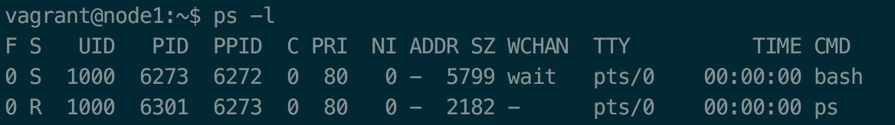
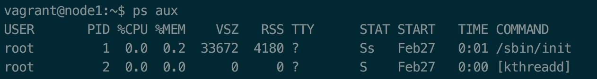

> 参考
> * [linw7的github](https://github.com/linw7/Skill-Tree/blob/master/Linux%E5%B7%A5%E5%85%B7.md)
> * 《鸟哥的Linux私房菜》

<br>

<!-- GFM-TOC -->
* [一.文件处理](#一文件处理)
    * [1.文件查找：find](#1文件查找find)
    * [2.(显示行号)查看文件：nl](#2显示行号查看文件nl)
    * [3.文本查找：grep](#3文本查找grep)
    * [4.排序：sort](#4排序sort)
    * [5.转换：tr](#5转换tr)
    * [6.切分文本：cut](#6切分文本cut)
    * [7.拼接文本：paste](#7拼接文本paste)
    * [8.统计：wc](#8统计wc)
    * [9.数据处理：sed](#9数据处理sed)
    * [10.数据处理：awk](#10数据流处理awk)
* [二.性能分析](#二性能分析)
    * [1.进程查询：ps](#1进程查询ps)
    * [2.进程监控：top](#2进程监控top)
    * [3.打开文件查询：lsof](#3打开文件查询lsof)
    * [4.内存使用量：free](#4内存使用量free)
    * [5.监控性能指标：sar](#5监控性能指标sar)
* [三.网络工具](#三网络工具)
    * [1.网卡配置：ifconfig](#1网卡配置ifconfig)
    * [2.查看当前网络连接：netstat](#2查看当前网络连接netstat)
    * [3.查看路由表：route](#3查看路由表route)
    * [4.检查网络连通性：ping](#4检查网络连通性ping)
    * [5.转发路径：traceroute](#5转发路径traceroute)
    * [6.网络Debug分析：nc](#6网络debug分析nc)
    * [7.命令行抓包：tcpdump](#7命令行抓包tcpdump)
    * [8.域名解析工具：dig](#8域名解析工具dig)
    * [9.网络请求：curl](#9网络请求curl)
* [四.开发及调试](#四开发及调试)
    * [1.编辑器：vim](#1编辑器vim)
    * [2.编译器：gcc和g++](#2编译器gcc和g++)
    * [3.调试工具：gdb](#3调试工具gdb)
    * [4.查看依赖库：ldd](#4查看依赖库ldd)
    * [5.二进制文件分析：objdump](#5二进制文件分析objdump)
    * [6.ELF文件格式分析：readelf](#6elf文件格式分析readelf)
    * [7.跟踪进程中系统调用：strace](#7跟踪进程中系统调用strace)
    * [8.跟踪进程栈：pstack](#8跟踪进程栈pstack)
    * [9.进程内存映射：pmap](#9进程内存映射pmap)
* [五.其他](#五其他)
    * [1.终止进程：kill](#1终止进程kill)
    * [2.修改文件权限：chmod](#2修改文件权限chmod)
    * [3.创建链接：ln](#3创建链接ln)
    * [4.显示文件尾：tail](#4显示文件尾tail)
    * [5.版本控制：git](#5版本控制git)
    * [6.设置别名：alias](#6设置别名alias)
<!-- GFM-TOC -->


<br>

# 一.文件处理

## 1.文件查找：find

#### 使用方法

```bash
find [查找目录] [查找条件]

查找目录：
    .：在当前目录及子目录下查找（默认）
    A：在目录A及A的子目录下查找
查找条件：
    -name：根据文件名查找
    -regex：使用正则表达式匹配
    -type：按类型查找（f:文件，d:目录，l:链接...）
    -atime：按访问时间查找（n:n天前的一天内，+n:n天前(不含n天本身)，-n:n天内(不含n天)）
    -mtime：按修改时间查找（n:n天前的一天内，+n:n天前(不含n天本身)，-n:n天内(不含n天)）
    -size：按大小查找（单位k，+nk:"比nk更大"，-nk:"比nk更小"）
    -perm：按权限查找（644：权限等于644的文件）
    -user/-nouser：用户名等于/用户名不等于
    -group/-nogroup：组名等于/组名不等于
```

#### 示例

```bash
#1.在当前目录及子目录下查找后缀为cpp的文件
find . -name *.cpp

#2.使用正则表达式查找
find -regex ".*.cpp$"
```


## 2.(显示行号)查看文件：nl

行号计算不包括空行

## 3.文本查找：grep

#### 使用方法

```bash
grep [选项] 模式串 文件
输出 | grep [选项] 模式串

选项
    -e：使用多个模式串
    -i：忽略大小写
    -n：打印行号
    -c：统计次数（一行算一次）
```

#### 示例

```bash
#1.在test.c中搜索包含字符串”printf“或”count“的行
grep -e "printf" -e "count" test.c
```

## 4.排序：sort

#### 使用方法

```bash
sort [选项] 文件
输出 | sort [选项]

选项
    -d：按字典序排序（默认）
    -n：按数字排序
    -k："-k n"表示按各行第n列进行排序
    -r：反序
```

## 5.转换：tr

#### 使用方法

```bash
#set1、set2为字符集，可以是单个字符，也可以是字符串
输出 | tr [选项] set1 set2

选项：
    -d：删除字符
    -s：字符压缩
```

#### 示例

```bash
#1.删除字符':'
cat /etc/passwd | tr -d ':'

#2.将小写字母替换成大写字母
last | tr '[a-z]' 'A-Z'

#3.将'a'、'b'、'c'替换成'z'
#cat test | tr “abc” 'z'

#4.将连续的'a'压缩成'b'（单个或连续出现的多个‘a’会压缩成一个‘b’）
cat test | tr -s 'a' 'b'
```

## 6.切分文本：cut

#### 使用方法

```bash
cut [选项] 文件
输出 | cut [选项]

选项：
    -d：分隔符（-d ':' 以’:‘为分隔符）
    -f：选择域（-f 1,2 输出分隔后第1列和第2列）
    -c：字符范围（-c n-m 输出第n到m个字符。如果没有m，输出到末尾）
```

#### 示例

```bash
#1.按’:‘分隔$PATH，输出第3个和第5个
echo $PATH | cut -d ':' -f 3,5

#2.输出export运行结果每行的第12-20个字符
export | cut -c 12-20
```

## 7.拼接文本：paste

#### 使用方法

```bash
paste [选项] file1 file2

选项：
    -d：指定拼接时使用的分隔符（默认使用tab作为分隔符）
```

## 8.统计：wc

#### 使用方法

```bash
wc [选项] 文件
输出 | wc [选项]

选项：
    -c：统计字符数
    -w：统计单词数
    -l：统计行数
```

## 9.数据处理：sed

>sed常用于一整行的处理。如果有一个100万行的文件，要在第100行加某些文字，此时由于文件太大，不适合用vim处理。因此使用sed是个很好的选择

#### 使用方法

```bash
sed [选项] '[动作]' 文件
输入 | sed [选项] '[动作]'

选项：
    -n：安静模式，只输出sed处理过的行（否则未处理行也会输出）
    -i：结果直接作用到文件（没指定时不会修改文件）
    -e：在命令行模式上输入动作
    -f：从文件中读取动作

动作：[n1[,n2]] function
function:
    a/i：在后插入/在前插入
    d：删除
    p：打印
    s：替换
```

#### 示例

```bash
#1.插入
nl /etc/passwd | sed '2a drink tea' #在第2行后插入一行："drink tea"
nl /etc/passwd | sed '2a aaa \
> bbb' #在第2行后插入两行："aaa"和"bbb"

#2.删除
nl /etc/passwd | sed '2,5d' #删除2\~5行
sed '/^$/d' ip #将ip文件中的空行删除

#3.打印2\~5行（安静模式，不使用安静模式2\~5行会打印2次）
nl /etc/passwd | sed -n '2,5p'

#4.替换
nl /etc/passwd | sed '2s/daemon/root/g' #将第二行的daemon替换成root
ifconfig | grep 'inet addr' | sed 's/^.*addr://g' #将所有开头的“inet addr:”删除
```

## 10.数据处理：awk

>相比于sed常用于一整行的处理，awk则比较倾向于将一行分成数个“字段”来处理。因此，相当适合小型的数据处理

**awk处理步骤**：

1. 读入第一行，并将第一行的数据填入$0,$1,$2等变量当中
2. 依据条件类型的限制，判断是否需要进行后面的动作
3. 做完所有的动作与条件类型
4. 若还有后续的“行”的数据，则重复1~3步，直到所有的数据都读完为止

#### 使用方法

```bash
awk '条件类型1{动作1} 条件类型2{动作2} ...' filename
输出 | awk '条件类型1{动作1} 条件类型2{动作2} ...'

变量：
    $0：整行
    $1：按分隔符分隔后的第1列
    $2：按分隔符分隔后的第2列
    $k：按分隔符分隔后的第k列
    NF：每一行拥有的字段数
    NR：目前所处理的行数
    FS：目前的分隔字符（默认是空格或tab）
条件判断：>、<、>=、<=、==、!=
命令分隔：使用';'或Enter
```

#### 示例

```bash
#1.打印last -n 5结果中每行经过分隔符(默认情况下为空格或tab)分隔后的第1列和第3列
last -n 5 | awk '{print $1 "\t" $3}'

#2.以':'作为分隔符，打印第3列小于10的所有行的第1列和第3列
cat /etc/passwd | awk '{FS=":"} $3<10{print $1 "\t" $3}'      #（第一行不会处理）
cat /etc/passwd | awk 'BEGIN{FS=":"} $3<10{print $1 "\t" $3}' #（第一行会处理）

#3.假设test文件由3列数字组成，以空格分隔。该命令会计算每行的和然后打印
awk '{total=$1+$2+$3;printf "%10d %10d %10d %10.2f\n",$1,$2,$3,total}' test
```

注意上面的示例2，awk首先是读取一行，分隔后的数据填入$0,$1,$2等变量中才开始进行条件判断和执行动作。因此第一条命令在按空格或tab分隔后才将分隔符换成':'，所以第一行显示结果不对

# 二.性能分析

## 1.进程查询：ps

man ps手册非常庞大，不是很好查阅，因此主要记住几个命令

#### 示例

```bash
#1.列出仅与自身环境有关的进程，最上层的父进程是允许该ps命令的bash而没有扩展到init进程中去
ps -l

#2.列出系统所有进程的信息
ps aux
ps -ef    #aux会截断COMMAND列，-ef不会。aux是BSD风格，-ef是System V风格
ps axjf   #以"进程树"的方式显示所有进程
ps -lA    #输出格式同ps -l
```



* **F**：进程标志，说明进程的权限
    - 4：root权限
    - 1：仅能fork而不能exec
    - 0：既非4也非1
* **S**：进程的状态
    - R(running)：正在运行
    - S(Sleep)：可被唤醒的睡眠
    - D：不可被唤醒的睡眠（通常可能在等待I/O）
    - T：停止，可能是在后台暂停
    - Z(Zombie)：僵尸进程
* **C**：CPU使用率
* **PRI/NI**：Priority/Nice的缩写，CPU优先级(越小越高)
* **ADDR/SZ/WCHAN**：内存相关，ADDR指出进程在内存的哪个部分，running进程一般显示'-'。SZ为进程使用的内存。WCHAN表示进程当前是否运行中'-'
* **TTY**：进程运行的终端机
* **TIME**：进程用掉的CPU时间



* **USER**：进程所属用户
* **%CPU/%MEM**：进程销毁的CPU百分比和内存百分比
* **VSZ**：进程用掉的虚拟内存(KB)
* **RSS**：进程占用的固定内存(KB)
* **TTY**：进程运行的终端机，与终端机无关则显示'?'。tty1~tty6是本机的登陆者程序，pts/0等表示由网络连接进主机的进程
* **STAT**：进程目前的状态，与```ps -l```结果中的**S**等同
* **START**：进程启动的时间
* **TIME**：进程实际使用的CPU运行时间

## 2.进程监控：top

## 3.打开文件查询：lsof

## 4.内存使用量：free

## 5.监控性能指标：sar

# 三.网络工具

## 1.网卡配置：ifconfig

## 2.查看当前网络连接：netstat

## 3.查看路由表：route

## 4.检查网络连通性：ping

## 5.转发路径：traceroute

## 6.网络Debug分析：nc

## 7.命令行抓包：tcpdump

## 8.域名解析工具：dig

## 9.网络请求：curl

# 四.开发及调试

## 1.编辑器：vim

## 2.编译器：gcc和g++

## 3.调试工具：gdb

## 4.查看依赖库：ldd

## 5.二进制文件分析：objdump

## 6.ELF文件格式分析：readelf

## 7.跟踪进程中系统调用：strace

## 8.跟踪进程栈：pstack

## 9.进程内存映射：pmap

# 五.其他

## 1.终止进程：kill

## 2.修改文件权限：chmod

## 3.创建链接：ln

## 4.显示文件尾：tail

## 5.版本控制：git

## 6.设置别名：alias
