> 内容源自[廖雪峰的Git教程](https://www.liaoxuefeng.com/wiki/0013739516305929606dd18361248578c67b8067c8c017b000)

* [一.git配置](#一git配置)
	- [1.配置git用户名和邮箱](#1配置git用户名和邮箱)
* [二.仓库](#二仓库)
	- [1.创建git仓库](#1创建git仓库)
	- [2.查看仓库状态](#2查看仓库状态)
	- [3.远程仓库](#3远程仓库)
    - [4.协同工作](#4协同工作)
    - [5.使用GitHub](#5使用github)
* [三.版本控制](#三版本控制)
    - [1.添加或删除修改](#1添加或删除修改)
    - [2.提交版本](#2提交版本)
    - [3.文件删除](#3文件删除)
    - [4.工作现场保存与恢复](#4工作现场保存与恢复)
    - [5.改动查询](#5改动查询)
    - [6.版本回退](#6版本回退)
    - [7.查看历史提交](#7查看历史提交)
* [四.分支管理](#四分支管理)
    - [1.创建与合并分支](#1创建与合并分支)
    - [2.分支合并冲突](#2分支合并冲突)
    - [3.分支管理策略](#3分支管理策略)

<br>
<br>

# 一.git配置

优先级：`--local > --global > --system`

> 用了`--global`这个参数，表示你这台机器上所有的Git仓库都会使用这个配置

### 1.配置git用户名和邮箱

```bash
git config --global user.name        # 查看
git config --global user.name 用户名  # 修改
git config --global user.email       # 查看
git config --global user.email 邮箱   # 修改
```

<br>

# 二.仓库

### 1.创建git仓库

```bash
git init 仓库名  #创建一个git仓库
git init        #将一个项目转化为使用git管理（创建.git目录）
```

示例：

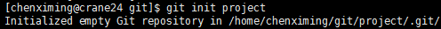

目录结构：

```bash
project
   |------.git
            |--------branches
            |--------config        #仓库的配置文件
            |--------description
            |--------HEAD
            |--------hooks
            |--------info
            |--------objects
            |--------refs
```

> 隐藏目录`.git`不算工作区，而是Git的版本库

### 2.查看仓库状态

```bash
git status
```

### 3.远程仓库

> 最早，肯定只有一台机器有一个原始版本库，此后，别的机器可以“克隆”这个原始版本库，而且每台机器的版本库其实都是一样的，并没有主次之分
> 
> 实际情况往往是这样，找一台电脑充当服务器的角色，每天24小时开机，其他每个人都从这个“服务器”仓库克隆一份到自己的电脑上，并且各自把各自的提交推送到服务器仓库里，也从服务器仓库中拉取别人的提交
> 
> GitHub就是提供Git仓库托管服务的，所以，只要注册一个GitHub账号，就可以免费获得Git远程仓库，即Github为我们的git仓库提供了一个远程仓库，有了这个远程仓库，妈妈再也不用担心我的硬盘了

#### 1）为本地与GitHub的通信配置ssh

**本地git仓库和GitHub上的远程仓库之间的传输是通过SSH加密的，所以，需要一点设置**：

1. **创建ssh key**：
    ```bash
    ssh-keygen -t rsa -C "youremail@example.com"
    ```
2. **登录你的GitHub帐号，`Settings -> SSH and GPG keys -> new SSH key` ，将id_rsa.pub的内容复制进去**

> 为什么GitHub需要SSH Key呢？因为GitHub需要识别出你推送的提交确实是你推送的，而不是别人冒充的，而Git支持SSH协议，所以，GitHub只要知道了你的公钥，就可以确认只有你自己才能推送

#### 2）让本地git仓库和远程仓库同步

> 在有了本地git仓库后，还需创建对应的远程仓库

1. **在GitHub上创建远程仓库**（如果已有则省略）
2. **为本地仓库设置远程仓库信息**（如果同时需要为本地仓库添加多个远程仓库（如果github+码云），则可以将`origin`分别换成`github`和`gitee`，推送操作时也要修改`origin`。添加后，远程库的名字就是`origin`，这是Git默认的叫法，也可以改成别的，但是`origin`这个名字一看就知道是远程库）
    ```bash
    git remote add origin https://github.com/用户名/仓库名
    ```
    * **删除本地仓库的远程仓库信息**：`git remote remove origin`
    * **修改远端地址**：`git remote set-url 新地址`
    * **查看远程仓库信息**：`git remote -v`
3. **将本地git仓库push到远程仓库**
    ```bash
    # 由于远程库是空的，我们第一次推送master分支时，加上了-u参数,Git不但会把本地的
    # master分支内容推送的远程新的master分支，还会把本地的master分支和远程的master
    # 分支关联起来，在以后的推送或者拉取时就可以简化命令
    git push [-u] origin 分支名
    ```

并不是一定要把本地分支往远程推送。哪些分支需要推送、哪些不需要呢？

* `master`：主分支，要时刻与远程同步
* `dev`：开发分支，团队所有成员都需要在上面工作，所有也需要与远程同步
* `bug`：只用于在本地修复bug，就没必要推送到远程了，除非老板要看看你每周修复了几个bug

### 4.协同工作

拉取分支：

```bash
git pull
```

`git clone`时，默认情况下只能看到本地的`master`分支。如果要在`dev`分支上开发，就必须创建远程`origin`的`dev`分支到本地，可以使用如下命令创建本地`dev`分支：

```bash
git checkout -b dev
```

将本地`dev`分支与远程`origin/dev`分支关联起来：

```bash
git branch --set-upstream dev origin/dev
```

### 5.使用GitHub

Bootstrap的官方仓库twbs/bootstrap、你在GitHub上克隆的仓库my/bootstrap，以及你自己克隆到本地电脑的仓库，他们的关系就像下图显示的那样：

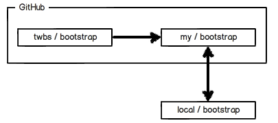

如果你想修复bootstrap的一个bug，或者新增一个功能，立刻就可以开始干活，干完后，往自己的仓库推送

**如果你希望bootstrap的官方库能接受你的修改，你就可以在GitHub上发起一个pull request。当然，对方是否接受你的pull request就不一定了**

<br>

# 三.版本控制

隐藏目录`.git`不算工作区，而是Git的版本库。版本库里存了很多东西，其中最重要的就是**称为stage（或者叫index）的暂存区**。还有Git为我们自动创建的第一个分支`master`，以及指向`master`的一个指针叫`HEAD`

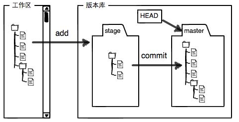

### 1.添加或删除修改

将修改添加到暂存区：

```bash
git add 文件/目录
```

从暂存区删除修改：

```bash
git rm --cached 文件/目录
```

以下命令可以将暂存区的修改重置，暂存区的改变会被移除到工作区：

```bash
git reset HEAD [文件名]
```

以下命令可以丢弃工作区的修改：

```bash
git checkout -- [文件名]
```

如果刚对一个文件进行了编辑，可以撤销文件的改变，回到编辑开始。命令其实起到“一键恢复”的作用，还可用于“误删恢复”。可以在 `git reset HEAD [文件名]` 后使用

### 2.提交版本

如果修改了readme.txt，添加了文件LICENSE，并将2者添加到暂存区后，暂存区的状态就变成这样：

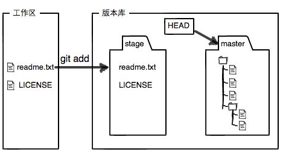

使用commit提交修改，实际上就是把暂存区的所有内容提交到当前分支：

```bash
git commit -m '信息'
```

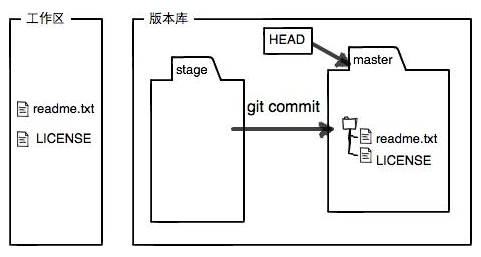

> commit相当于游戏里面一次存档。对应一个版本

### 3.文件删除

`rm`做出的删除不会被暂存，`git rm`做出的改变会被暂存。如果使用`rm`删除掉，能使用`git rm`来暂存。`git rm`不在意文件已经不存在了

* 删除(暂存)单个文件

    ```bash
    git rm
    ```

* 删除(暂存)多个文件（一般情况下，更可能是对大量文件进行管理。可能同时会删除很多文件，不可能使用`git rm`一个个删除）

    ```bash
    # 它会变量当前目录，将所有删除暂存
    git add -u .
    ```

如果有文件被误删，可以使用`git checkout -- 文件名`恢复

### 4.工作现场保存与恢复

有时候在修复bug或某项任务还未完成，但是需要紧急处理另外一个问题。此时可以先保存工作现场，当问题处理完成后，再恢复bug或任务的进度

* 保存工作现场：`git stash`
* 查看保存的工作现场：`git stash list`
* 恢复工作现场：`git stash apply`
* 删除stash内容：`git stash drop`
* 恢复工作现场并删除stash内容（相当于上面2步合并）：`git stash pop`


### 5.改动查询

```bash
git diff [选项]           # 查看工作区中的修改
git diff [选项] --staged   # 查看已添加到暂存区的修改
git diff [选项] HEAD       # 查看当前所有未提交的修改

选项：
    --color-words： 颜色
    --stat：        不显示具体修改，只显示修改了的文件
```

### 6.版本回退

```bash
git reset --hard 版本ID/HEAD形式的版本

git reset --hard HEAD      # 当前版本
git reset --hard HEAD^     # 上一个版本
git reset --hard HEAD^^    # 上上个版本
git reset --hard HEAD~n    # 前n个版本
```

如果回到过去的版本，想要回到原来新的版本：

* 如果终端未关，可以找到新版本的id，通过上述命令回去新版本
* 如果终端已关，`git reflog`查看版本，再通过上述命令回去新版本

### 7.查看历史提交

```bash
git log [选项]

选项：
    --online：只显示提交提示信息
    --stat：添加每次提交包含的文件信息
    --path：查看每次提交改变的内容
    --graph
```

**加文件名可以显示具体文件相关的所有提交信息**

<br>

# 四.分支管理

### 1.创建与合并分支

每次`commit`相当于一次存档，对应一个版本。Git都把它们串成一条时间线，这条时间线就是一个分支。`master`就是主分支。`HEAD`指向当前分支，而`master`指向主分支的最近提交。每次提交，`master`分支都会向前移动一步

当创建一个分支时，如`dev`，Git创建一个指针`dev`，指向`master`相同的提交，再把`HEAD`指向`dev`，就表示当前分支在`dev`上：

<div align="center"> 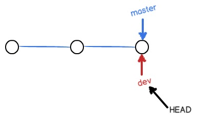 </div>

从现在开始，对工作区的修改和提交就是针对`dev`分支了，比如新提交一次后，`dev`指针往前移动一步，而`master`指针不变：

<div align="center"> 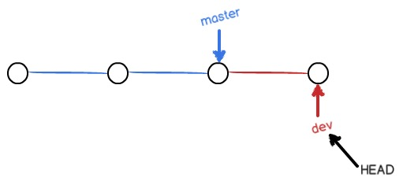 </div>

假如我们在`dev`上的工作完成了，就可以把`dev`合并到`master`上。最简单的方法，就是直接把`master`指向`dev`的当前提交，就完成了合并：

<div align="center"> 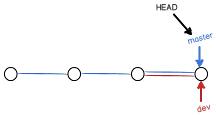 </div>

合并完分支后，甚至可以删除`dev`分支。删除`dev`分支就是把`dev`指针给删掉，删掉后，我们就剩下了一条`master`分支：

<div align="center"> 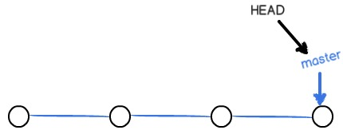 </div>

上面的合并使用的是**Fast forward**。这种模式下，删除分支后，会丢掉分支信息。如果要强制禁用**Fast forward**模式，Git就会在merge时生成一个新的提交，这样，从分支历史上就可以看出分支信息。通过在`git merge`命令中使用`--no-ff`选项禁用**Fast forward**模式。比如在合并`dev`时：

```bash
git merge --no-ff -m "merge with no-ff" dev
```

由于会生成一个新的提交，所以需要使用`-m`指明新提交的信息。此时分支情况如下：

<div align="center"> 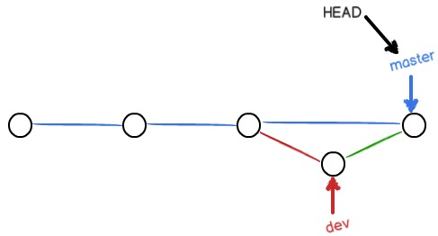 </div>

相关命令如下：

* (创建分支并)切换到新分支：`git checkout -b 新分支`
* 创建分支：`git branch 新分支`
* 切换分支：`git checkout 欲切换到的分支`
* 查看当前分支：`git branch`
* 合并某分支到当前分支：`git merge 欲合并到当前分支的分支`
* 查看历史分支情况：`git log --graph --pretty=oneline --abbrev-commit`
* 删除未合并的分支：`git branch -D 分支`

### 2.分支合并冲突

如果两个分支修改了同一文件，合并时会发生冲突。比如`master`分支和`feature1`分支都修改了`readme.txt`文件，各自都有新的提交：

<div align="center"> 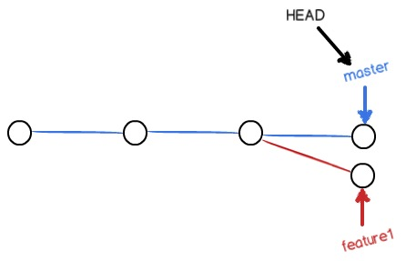 </div>

这种情况下，Git无法执行“快速合并”，只能试图把各自的修改合并起来，但这种合并就可能会有冲突。此时`readme.txt`文件会变成如下形式：

```
Git is a distributed version control system.
Git is free software distributed under the GPL.
Git has a mutable index called stage.
Git tracks changes of files.
<<<<<<< HEAD
Creating a new branch is quick & simple.
=======
Creating a new branch is quick AND simple.
>>>>>>> feature1
```

Git用`<<<<<<<`，`=======`，`>>>>>>>`标记出不同分支的内容，此时需要手动修改后保存。然后再使用`git commit`进行一次提交。分支会变成如下：

<div align="center"> 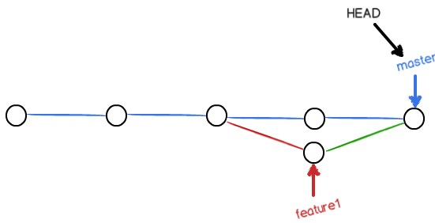 </div>

### 3.分支管理策略

在实际开发中，我们应该按照几个基本原则进行分支管理

首先，`master`分支应该是非常稳定的，也就是仅用来发布新版本，平时不能在上面干活

干活都在`dev`分支上，也就是说，`dev`分支是不稳定的，到某个时候，比如1.0版本发布时，再把`dev`分支合并到`master`上，在`master`分支发布1.0版本

你和你的小伙伴们每个人都在`dev`分支上干活，每个人都有自己的分支，时不时地往`dev`分支上合并就可以了

所以，团队合作的分支看起来就像这样：

<div align="center"> 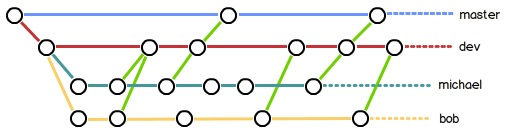 </div>

当你从远程仓库克隆时，实际上Git自动把本地的`master`分支和远程的`master`分支对应起来了，并且，远程仓库的默认名称是`origin`

要查看远程库的信息，用`git remote`：

```bash
$ git remote
origin
```

或者，用`git remote -v`显示更详细的信息：

```bash
$ git remote -v
origin  git@github.com:michaelliao/learngit.git (fetch)
origin  git@github.com:michaelliao/learngit.git (push)
```

上面显示了可以抓取和推送的`origin`的地址。如果没有推送权限，就看不到push的地址

#### 推送分支

```bash
git push origin 欲推送的分支
```

* `master`分支是主分支，因此要时刻与远程同步
* `dev`分支是开发分支，团队所有成员都需要在上面工作，所以也需要与远程同步
* `bug`分支只用于在本地修复bug，就没必要推到远程了，除非老板要看看你每周到底修复了几个bug
* `feature`分支是否推到远程，取决于你是否和你的小伙伴合作在上面开发
