## 1.为什么要内存对齐

1. **性能原因**：内存对齐可以提高存取效率（例如，有些平台每次读都是从偶地址开始，如果一个int型存放在偶地址开始的地方，那么一个读周期就可以读出这32bit，而如果存放在奇地址开始的地方，就需要2个读周期，并且要对两次读出的结果的高低字节进行拼凑才能得到这32bit的数据）
2. **平台原因**：各个硬件平台对存储空间的处理有很大的不同，一些平台对某些特定类型的数据只能从某些特定地址开始存取，例如，有些架构的CPU在访问一个没有对齐的变量时会发生错误，那么这时候编程必须保证字节对齐

<br>

## 2.valgrind

### 2.1 框架

<div align="center"> 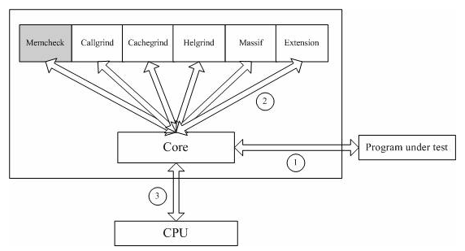 </div>

vagrind包括下列一些工具：

* **Memcheck**：valgrind应用最广泛的工具，一个重量级的**内存检查**器，能够发现开发中绝大多数内存错误使用情况，**我们主要使用即此工具，默认选项**。此工具检查下面的程序错误：
    - [使用未初始化的内存](#1使用未初始化内存)(Use of uninitialised memory)
    - [使用已经释放了的内存](#4动态内存管理错误)(Reading/writing memory after it has been free’d)
    - [使用超过malloc分配的内存空间](2内存越界访问)(Reading/writing off the endof malloc’d blocks)
    - **对堆栈的非法访问**(Reading/writing inappropriate areas on the stack)
    - [内存泄露](#5内存泄露)(Memory leaks – where pointers to malloc’d blocks are lost forever)
    - [malloc/free/new/delete申请和释放内存的匹配](#4动态内存管理错误)(Mismatched use of malloc/new/new \[\] vs free/delete/delete \[\])
    - [src和dst的重叠](#3内存覆盖)(Overlapping src and dst pointers inmemcpy() and related functions)
* **Callgrind**：主要用来检查程序中**函数调用过程**中出现的问题
* **Cachegrind**：它主要用来检查程序中**缓存使用**出现的问题
* **Helgrind**：它主要用来检查**多线程**程序中出现**的竞争**问题
* **Massif**：主要用来检查程序中**堆栈使用**中出现的问题
* **Extension**：可以利用core提供的功能，自己编写特定的内存调试工具

### 2.2 内存检测原理

<div align="center"> 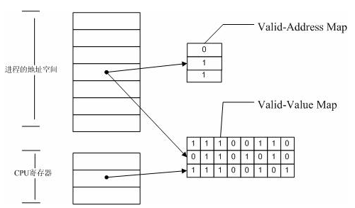 </div>

Memcheck 能够检测出内存问题，关键在于其建立了两个全局表：

* **Valid-Value 表**：对于进程的整个地址空间中的每一个字节(byte)，都有与之对应的 8 个 bits；对于 CPU 的每个寄存器，也有一个与之对应的 bit 向量。这些 bits 负责记录该字节或者寄存器值是否具有有效的、已初始化的值
* **Valid-Address 表**：对于进程整个地址空间中的每一个字节(byte)，还有与之对应的 1 个 bit，负责记录该地址是否能够被读写

**检测原理**：

* 当要读写内存中某个字节时，首先检查这个字节对应的 A bit。如果该A bit显示该位置是无效位置，memcheck 则报告读写错误
* 内核（core）类似于一个虚拟的 CPU 环境，这样当内存中的某个字节被加载到真实的 CPU 中时，该字节对应的 V bit 也被加载到虚拟的 CPU 环境中。一旦寄存器中的值，被用来产生内存地址，或者该值能够影响程序输出，则 memcheck 会检查对应的V bits，如果该值尚未初始化，则会报告使用未初始化内存错误

### 2.3 检测步骤与示例

**步骤**：

* **编译源文件获取可执行程序**：为了使valgrind发现的错误更精确，如能够定位到源代码行，建议在编译时加上-g参数
    ```
    gcc|g++ -g 源文件
    ```
* **在valgrind下，运行可执行程序**：
    - Valgrind 的参数分为两类：
        + 一类是 core 的参数，它对所有的工具都适用
        + 另外一类就是具体某个工具如 memcheck 的参数。Valgrind 默认的工具就是 memcheck，也可以通过“--tool=tool name”指定其他的工具
    ```
    valgrind [valgrind-options] program [program-options]
    ```

#### 1）使用未初始化内存

```c
#include <stdio.h>

int main()
{
    int s,i;
    printf("sum:%d\n",s);

    return 0;
}
```

程序：

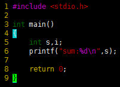

错误信息：

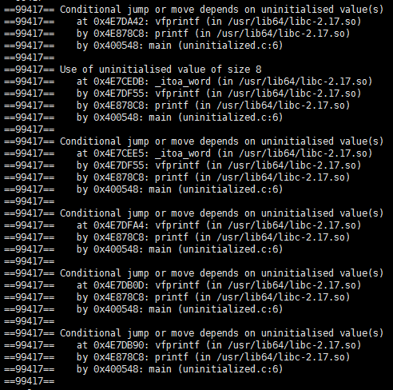

#### 2）内存越界访问

```c
#include <stdio.h>
#include <stdlib.h>

int main()
{
    int *arr = (int*)malloc(sizeof(int) * 4);
    arr[4] = 10;

    return 0;
}
```

程序：

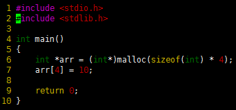

错误信息：

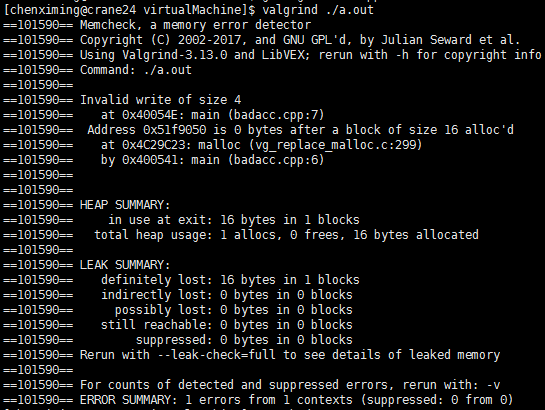

#### 3）内存覆盖

```c
#include <stdio.h>
#include <stdlib.h>
#include <string.h> //memcpy

int main()
{
    char buf[20];

    int i;
    for(i = 1;i <= 20;i++)
        buf[i - 1] = i;

    //(dst,src,size)
    memcpy(buf + 5,buf,10);
    memcpy(buf,buf + 5,10);

    return 0;
}
```

程序：

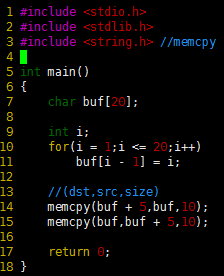

错误信息：

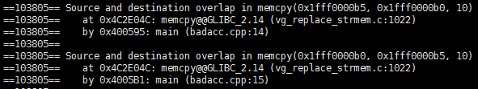

#### 4）动态内存管理错误

```c
#include <stdio.h>
#include <stdlib.h>

int main()
{
    char *buf = (char*)malloc(20);

    int i;
    for(i = 1;i <= 20;i++)
        buf[i - 1] = i;

    delete buf;     //1.申请与释放不匹配
    
    buf[1] = 'a';   //2.读写释放后的内存

    return 0;
}

```

程序：

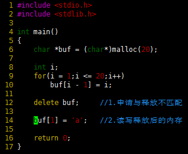

错误信息：

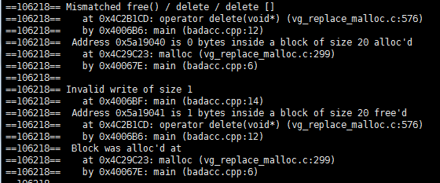

#### 5）内存泄露

```c++
#include <stdio.h>
#include <stdlib.h>

struct ListNode{
public:
    ListNode(int v,ListNode *n) : next(n),val(v) {}
private:
    ListNode *next;
    int val;
};

int main()
{
    //n2->n1->NULL
    ListNode *n1 = new ListNode(1,NULL);
    ListNode *n2 = new ListNode(2,n1);
    return 0;
}
```

程序：

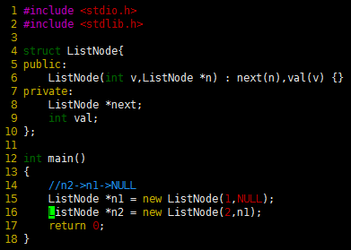

错误信息：

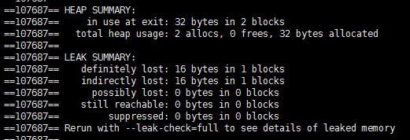

* **确定的内存泄露**
    - **直接的内存泄露**（**definitely lost**）：直接是没有任何指针指向该内存
    - **间接的内存泄露**（**indirectly lost**）：间接是指向该内存的指针都位于内存泄露处，即由直接内存泄露引起的内存泄露
* **可能的内存泄露**（**possibly lost**）：指仍然存在某个指针能够访问某块内存，但该指针指向的已经不是该内存首地址

<br>

## 3.访问控制说明符

1. **类的成员的访问控制说明符**用于控制**类的使用者**对类中成员的访问权限
2. **派生列表中的访问控制说明符**用于控制**派生类的使用者**对**派生类从基类继承的成员**的访问权限

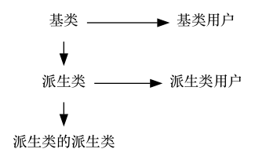

对应上图，基类中成员的访问控制说明符就是控制派生类与基类的用户对基类的访问权限。而派生类定义时使用的**派生列表中的访问控制说明符与派生类对基类成员的访问没有任何关系**，它控制的是派生类的派生类和派生类用户(即派生类的使用者)对派生类从基类继承的成员的访问权限

### 类的成员访问控制说明符

| 成员 | 派生类的成员和(派生类的)友元 | 类的用户 |
|:---:|:---:|:---:|
|public成员 | 可访问 | 可访问 |
|protected成员| **只能访问派生类对象中的基类部分的protected成员** | 不可访问 |
|private成员| 不可访问 | 不可访问 |

如果派生类的成员和友元能直接访问基类对象的protected成员，那么类的用户就可以定义一个继承基类的类，然后通过这个类来获得基类protected成员的访问。从而简单地规避掉protected提供的访问保护，违背基类只希望和派生类分享protected成员，而不想被其他公共访问的初衷了。

```c
struct Base {
public:
    string pub_string = "public string";
protected:
    string pro_string = "protected string";
private:
    string pri_string = "private string";//只有类自己能访问
};

struct Derived : public Base {
public:
    void access_parent_public(const Base &b){
        cout << b.pub_string << endl;
    }
    //不能直接访问基类对象的protected成员
    void access_parent_protected(const Base &b){
        //cout << b.pro_string << endl;
    }
    //派生类只能访问派生类对象中基类部分的protected成员
    void access_protected_in_derived(){
        cout << pro_string << endl;
    }
};
```

### 派生列表中的访问控制说明符

派生列表中的访问控制说明符控制**派生类的使用者(派生类的派生类和派生类的用户)**对**派生类继承自基类成员**的访问权限

* public继承：**遵循其原有的访问权限**
* protected继承：基类中所以public成员在派生类中”相当于“protected的
* private继承：所有成员都无法访问

**对于派生类的派生类(包括其成员和友元)**：

| 继承方式 | public成员 | protected成员 | private成员 |
|:---:|:---:|:---:|:---:|
|public继承 | 可访问 | **只能访问继承到的受保护成员** | 不可访问 |
|protected继承 | **只能访问继承到的public成员** | 不可访问? | 不可访问 |
|private继承 | 不可访问 | 不可访问 | 不可访问 |

**对于派生类的用户**：

| 继承方式 | public成员 | protected成员 | private成员 |
|:---:|:---:|:---:|:---:|
|public继承 | 可访问 | 不可访问 | 不可访问 |
|protected继承 | 不可访问 | 不可访问 | 不可访问 |
|private继承 | 不可访问 | 不可访问 | 不可访问 |

### (另)派生类向基类转换的可行性

受两个因素影响：

1. 使用该转换的代码
2. 派生类的派生访问说明符

假定D继承自B（B<--D）：

* **对于D的成员及友元**：不论以什么方式继承，都能使用派生类向基类的转换
* **对于D的派生类的成员及友元**：只有当D以public或protected方式继承时能使用
* **对于用户代码**：只有当D以public继承B时，才能使用派生类向基类的转换

>总的来说，对于代码中的某个给定节点来说，如果基类的公用成员是可访问的，则派生类向基类的类型转换也是可性的

<br>

## 4.static函数与普通函数的区别

* static函数与普通函数作用域不同,仅在本文件。只在当前源文件中使用的函数应该说明为内部函数(static修饰的函数)，内部函数应该在当前源文件中说明和定义。对于可在当前源文件以外使用的函数，应该在一个头文件中说明，要使用这些函数的源文件要包含这个头文件
* static函数在内存中只有一份，普通函数在每个被调用中维持一份拷贝（这里暂时不理解）