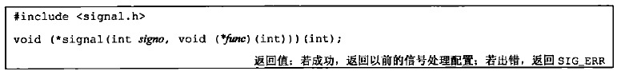
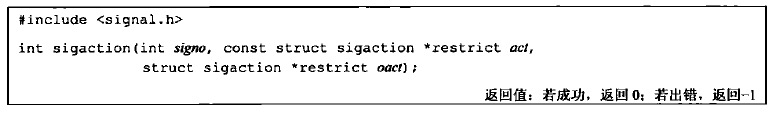
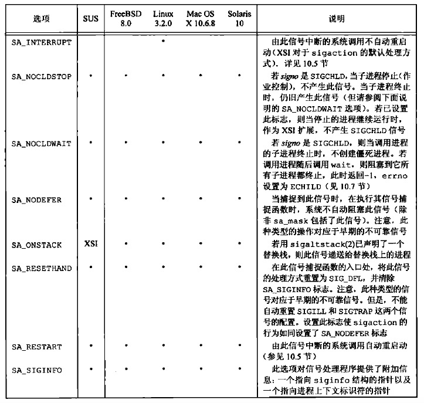

## 1.信号

### 1）2种信号处理方式

这种方式已被废弃

* 主要原因是在UNIX实现中，收到信号之后，会重置回默认的信号处理行为
* 同时，该行为是不跨平台的

<div align="center">  </div>

* 参数
    - `signo`：信号
    - `func`：信号处理函数（捕捉函数）
        + `SIG_IGN`：忽略此信号
        + `SIG_DFL`：默认处理动作
            * 默认处理通常是收到信号后终止进程
            * `SIGCHLD`和`SIGURG`(带外数据到达时发送)的默认处理是忽略信号

推荐使用**sigaction函数**

<div align="center">  </div>

* 参数
    - `signo`：信号
    - `act`：非空则表示修改信号的处理配置
    - `oact`：非空则表示关心信号旧的处理配置
    
信号处理配置使用一个`sigaction`结构：

```c
struct sigaction {
    void (*sa_handler)(int);    
    sigset_t sa_mask;           
    int sa_flags;               
    void (*sa_sigaction)(int,siginfo_t *,void *);
}
```

* `sa_handler`：信号处理函数
    - `SIG_IGN`：忽略此信号
    - `SIG_DFL`：默认处理动作
        + 默认处理通常是收到信号后终止进程
        + `SIGCHLD`和`SIGURG`(带外数据到达时发送)的默认处理是忽略信号
* `sa_mask`：信号集，在调用信号处理函数之前，这一信号集要加到进程的信号屏蔽字中。仅当从信号处理函数返回时再将进程的信号屏蔽字恢复为原先值。这样，在调用信号处理函数时就能阻塞某些信号。在信号处理程序被调用时，操作系统建立的新信号屏蔽字包括正被传递的信号。因此保证了在处理一个给定的信号时，如果这种信号再次发生，那么它会被阻塞到对前一信号的处理结束为止。如果一个信号在被阻塞期间产生了一次或多次，那么该信号被解阻塞之后通常只递交一次，也就是说UNIX信号默认是不排队的
* `sa_flags`：信号标志（详见下图）
* `sa_sigaction`：替代的信号处理函数。在当使用了`SA_SIGINFO`标志时，使用该信号处理函数

<div align="center">  </div>

### 2）常见信号

| 信号 | 描述 |
|:--:|:--:|
|SIGHUP|挂起进程，当父进程退出时，所有子进程都会收到SIGHUP信号|
|SIGINT|终止进程（CTRL + C）|
|SIGQUIT|终止前台进程组并产生一个core文件（CTRL + \）|
|SIGCHLD|子进程终止时给父进程发送的信号，如果父进程没有捕获代码，则这个信号被忽略|
|SIGTERM|关机时，init进程向系统中进程发出的信号，提示进程即将关机，进程可以捕获然后执行一些清理|
|SIGKILL(不能捕获或忽略)|杀掉进程|
|SIGSTOP(不能捕获或忽略)|停止进程，但不终止进程|
|SIGTSTP|停止或暂停进程，但不终止进程（CTRL + Z）|
|SIGCONT|继续运行停止的进程|

* `Ctrl + C`组合键会发送`SIGINT`信号，终止shell中当前运行的进程
* `Ctrl + Z`组合键会发送`SIGTSTP`信号，停止shell中运行的进程，停止的进程会继续保留在保存在内存中，并能够从上次停止的位置继续运行
    - 使用`jobs`命令查看后台任务，通过`fg %jobnumber`将用`CTRL + Z`暂停的后台任务放到前台继续执行

<br>

## 2.线程与信号

* 信号处理函数是进程层面的概念，或者说是线程组层面的概念，线程组内所有线程共享对信号的处理函数
* 对于发送给进程的信号，内核会任选一个线程来执行信号处理函数，执行完后，会将其从挂起信号队列中去除，其他线程不会对一个信号重复响应
* 可以针对进程中的某个线程发送信号，那么只有该线程能响应，执行相应的信号处理函数
* 信号掩码是线程层面的概念，信号处理函数在线程组内是统一的，但是信号掩码是各自独立可配置的，各个线程独立配置自己要阻止或放行的信号集合
* 挂起信号（内核已经收到，但尚未递送给线程处理的信号）既是针对进程的，又是针对线程的。内核维护两个挂起信号队列，一个是线程共享的挂起信号队列，一个是线程特有的挂起信号队列

[线程和信号](https://github.com/arkingc/note/blob/master/%E6%93%8D%E4%BD%9C%E7%B3%BB%E7%BB%9F/UNIX%E7%8E%AF%E5%A2%83%E9%AB%98%E7%BA%A7%E7%BC%96%E7%A8%8B.md#5%E7%BA%BF%E7%A8%8B%E5%92%8C%E4%BF%A1%E5%8F%B7)