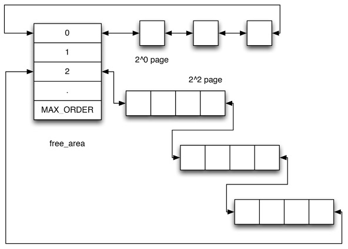
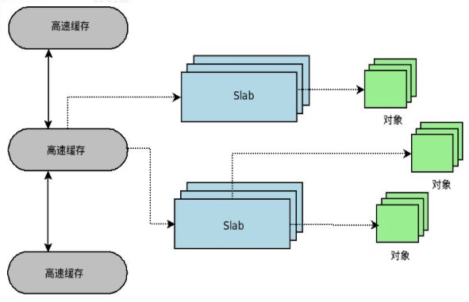
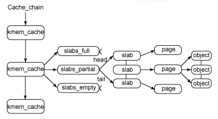

## 1.内核内存分配

1. **vmalloc()**
    * 内核用于申请大块内存，特点是虚拟地址空间连续，物理地址不一定连续，不能直接用于DMA
    * vmalloc()分配比kmalloc()慢
    * 对应释放函数是vfree()
2. **kmalloc()**
    * 内核用于申请小块内存，保证分配的内存在物理地址上是连续的
    * 它基于slab分配器
    * 总是调用_get_free_pages()来进行实际分配，最多只能分配32个page大小的内存（128K）
    * 分配的是常驻内存，不会被交换到文件中
    * 对应的释放函数是kfree()

  

 
 

# 二.伙伴系统

## 1.通过伙伴系统申请内核内存的函数有哪些

在物理页面管理上实现了基于区的伙伴系统（zone based buddy system)，对不同区的内存使用单独的伙伴系统管理，而且独立地监控空闲页，相应接口：alloc_pages等

## 2.伙伴系统算法

在实际应用中，经常需要分配一组连续的页框，而频繁地申请和释放不同大小的连续页框，必然导致已分配的内存块中分散了很多小块的空闲页框

为了避免这种情况，Linux内核中引入了伙伴算法（buddy system），把所有的空闲页框分组为11个块链表，每个块链表包含大小为1，2，4，8，16，32，64，128，256，512和1024个连续页框的页框块，最大可以申请1024个连续页框块，对应4MB大小的连续内存（从小往大查找大小最合适的链表）。每个页框块的第一个页框的物理地址是这块大小的整数倍

  

* 假设要申请256个页框的块，先从256个页框的链表中查找空闲块，如果没有，就去512个页框的链表中查找，找到了则将页框分为2个256个页框的块，一个分配给应用，一个移动到256个页框的链表中，如果512个页框的链表中没有空闲块，则继续从1024个页框的链表中查找
* 页框块在释放的时候，会主动将两个连续的页框块合并为一个较大的页框块

[Linux内存管理伙伴算法](http://ilinuxkernel.com/?p=1029)

 
 

# 三.slab分配器

**工作于伙伴系统算法之上，其基本思想是将内核中经常使用的对象放到高速缓存中，并且由系统保持为初始的可用状态**

比如进程描述符，内核会频繁对此数据进行申请和释放，当一个新进程创建时，内核会直接从slab分配器的高速缓存中获取一个已经初始化了对象；当进程结束时，该结构所占的页框并不被释放，而是重新返回slab分配器中，如果没有基于对象的slab分配器，内核将花更多的时间去分配、初始化以及释放对象

**每种对象一个高速缓存**。这个缓存可以看做是同类型对象的一种储备，**每个高速缓存所占的内存区又被划分为多个slab，每个slab是由一个或多个连续的页框组成**（缺省情况下，一个slab最多由1024个页框构成），**每个页框中包含若干个对象，既有已经分配的对象，也包含空闲的对象**（处于对齐等其他方面的要求，slab中分配给对象的内存可能大于用户要求的对象实际大小，这会造成一定的内存浪费）

  

 

  

- slab结构的最高层是cache_chain，这是一个slab缓存的链接列表，可以用来最适合所需要的分配大小的缓存（伙伴系统算法）
- 每个缓存kmem_cache都包含了一个slabs列表，这是一段连续的内存块（通常是页面），存在3种slab
    + **slabs_full**：完全分配的slab
    + **slabs_partial**：部分分配的slab
    + **slabs_empty**：空slab，或者没有对象被分配（该列表中的slab是进行回收的主要备选对象）
- slab列表中的每个slab都是一个连续的内存块（一个或多个连续页），被划分成一个个对象，这些对象都是从特定缓存中进行分配和释放的基本元素
- 由于对象是从slab中进行分配和释放的，因此单个slab可以在slab列表之间进行移动（例如：当一个slab中所有对象都被使用完之后，就从slabs_partial列表中移动到slabs_full列表中。当一个slab完全被分配并且有对象被释放后，就从slab_full列表中移动到slab_partial列表中）

## 1.通过slab分配器申请内核内存的函数有哪些

kmem_cache_create/kmem_cache_alloc是基于slab分配器的一种内存分配方式，适用于反复分配同一大小内存块的场合，首先用kmem_cache_create创建一个高速缓冲区，然后用kmem_cache_alloc从高速缓存区中获取新的内存块

[Linux slab 分配器剖析](https://www.ibm.com/developerworks/cn/linux/l-linux-slab-allocator/)

> **slub分配器**：简化slab分配器的设计理念，同时保留slab分配器的基本思想：每个缓冲区由多个slab组成，同时每个slab包含固定数目的对象。简化了kmem_cache,slab等相关的管理数据结构，摒弃了slab分配器中众多的队列概念，并针对多处理器、NUMA系统进行了优化

 
 

# 四.Linux内核空间与用户空间

## 1.Linux内核空间与用户空间是如何划分的

* 内核将4G空间划分为2部分，最高的1G空间供内核使用，称为内核空间，较低的3G空间称为用户空间。每个进程通过系统调用进入内核，因此Linux内核由所有进程共享
* 从进程角度来看，每个进程可以拥有4G的虚拟空间
* Linux内核和用户程序都运行在虚拟地址模式