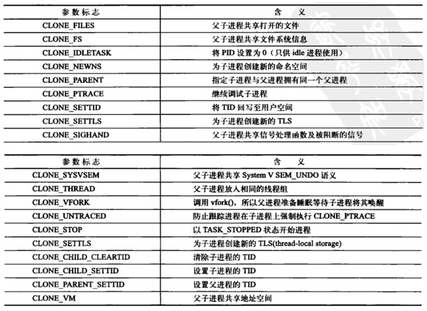

# 一.进程创建

## 1.fork、vfork、clone

三个函数分别调用了sys_fork、sys_vfork、sys_clone，最终都调用了do_fork函数

* **fork()函数**
    - 传统的fork()系统调用在Linux中是用clone()实现的，其中clone()的flags参数指定为SIGCHLD信号及所有清0的clone标志
    - 创建的子进程复制了父进程的资源，使用copy-on-write技术，子进程与父进程使用相同的物理页，只有子进程视图写一个物理页时，才copy这个物理页到一个新的物理页，子进程使用新的物理页，与父进程的内存地址分开，开始独立运行（[fork](https://github.com/arkingc/note/blob/master/%E6%93%8D%E4%BD%9C%E7%B3%BB%E7%BB%9F/UNIX%E7%8E%AF%E5%A2%83%E9%AB%98%E7%BA%A7%E7%BC%96%E7%A8%8B.md#21-fork)）
* **vfork()函数**
    - vfork()系统调用在Linux中也是用clone()实现的，其中clone()的参数flags指定为SIGCHLD信号和CLONE_VM和CLONE_VFORK标志，clone()的参数child_stack等于父进程当前的栈指针
    - 创建的子进程运行在父进程的地址空间上，子进程对虚拟地址空间数据的修改对父进程都可见，这与fork完全不同，fork是独立地址空间，而vfork是共享父进程空间，为了防止父进程重写子进程需要的数据，父进程被阻塞，直到子进程执行exec()或exit()。vfork是一个过时的应用,vfork最初是因为fork没有实现COW机制，而很多情况下fork之后会紧接着exec，而exec的执行相当于之前fork复制的空间全部变成了无用功，所以设计了vfork。现在fork使用了COW机制，唯一的代价仅仅是复制父进程页表的代价，所以vfork不应该出现在新的代码之中（[vfork](https://github.com/arkingc/note/blob/master/%E6%93%8D%E4%BD%9C%E7%B3%BB%E7%BB%9F/UNIX%E7%8E%AF%E5%A2%83%E9%AB%98%E7%BA%A7%E7%BC%96%E7%A8%8B.md#22-vfork)）
    - Linux内核使用进程描述符`task_struct`记录进程信息，每个Linux线程都有唯一隶属于自己的`task_struct`结构，所以在内核中，它看起来就像一个普通进程（只是和其它一些进程共享某些资源，如地址空间）。vfork创建的子进程作为父进程的一个单独的线程在它的地址空间运行。
* **clone()函数**可以有选择性地继承父进程的资源，如果选择共享父进程空间，那么创建的是一个线程，也可以选择不与父进程共享同一空间
    - `fn`：由新进程执行的函数
    - `arg`：指向传递给fn()函数的数据
    - `flags`：各种各样的信息。低字节指定子进程结束时发送到父进程的信号代码，通常选择SIGCHLD信号。剩余的3个字节给一clone标志组用于编码
    - `child_stack`：表示把用户态堆栈指针赋给子进程的esp寄存器。调用进程应该总是为子进程分配新的堆栈

<div align="center">  </div>

<br>
<br>

# 二.进程切换

## 1.Linux中的软中断和工作队列的作用

* 软中断一般是“可延迟函数”的总称，它不能睡眠、不能阻塞，处于中断上下文，不能进行进程切换，软中断不能被自己打断，只能被硬件中断打断，可以并发运行在多个cpu上，所以软中断必须设计为可重入函数（允许多个cpu同时操作），因此也需要自旋锁来保护其数据结构
* 工作队列中的函数处于进程上下文中，可以睡眠、阻塞。能够在不同进程间切换，以完成不同的工作

<br>
<br>

# 三.特殊进程

## 1.如何实现守护进程

* 守护进程独立于控制终端，并且周期性地执行某种任务或者等待处理某些发生的事件
* 要实现守护进程，需要将它从启动它的父进程的运行环境中隔离开来，需要处理的内容大致包括会话、控制终端、进程组、文件描述符、文件权限掩码以及工作目录等
    - 创建子进程，父进程退出（子进程继承了父进程的会话、进程组、控制终端等信息）
    - 调用setsid函数，创建一个新会话，使当前进程脱离原会话的控制，使当前进程脱离原进程组的控制，使当前进程脱离原控制终端的控制
    - 改变当前目录为根目录，直接调用chdir函数
    - 重设文件权限掩码
    - 关闭文件描述符

[参考](http://alfred-sun.github.io/blog/2015/06/18/daemon-implementation/)

<br>
<br>

# 四.进程与线程的限制

## 1.进程与线程数量的限制

### 1）线程数量的限制

**限制**

* 线程的数量取决于线程栈空间的大小（可以使用`ulimit -s`查看栈空间大小）
* 32位Linux下（**可以使用`getconf LONG_BIT`查看当前CPU运行在多少位的模式下**），用户空间是3G，因此可创建的线程数量为`3G/stack_size`，但是理论上除了栈空间每个线程还有线程控制块的开销，所以实际值会小一些

**修改限制**

1. 使用`ulimit -s 新栈空间大小`修改默认栈空间大小
    * 可以在`/etc/rc.local` 内 加入 `ulimit -s 新栈空间大小` 则可以开机就设置栈空间大小
2. 通过`/etc/security/limits.conf` 改变栈空间大小：
    ```
    #<domain> <type> <item> <value>
    #添加下列行
    * soft stack 新栈空间大小
    ```
    重新登录，执行ulimit -s 即可看到改为新栈空间大小

> `ulimit`命令只对当前终端生效。如果需要永久生效：1）将命令写至`profile`和`bashrc`中，相当于在登录时自动动态修改限制；2）在`/etc/security/limits.conf`中添加记录（需重启生效，并且在`/etc/pam.d`中的session有使用到limit模块）

* [linux下进程的最大线程数、进程最大数、进程打开的文件数](http://www.cnblogs.com/niocai/archive/2012/04/01/2428154.html)
* [linux查看修改线程默认栈空间大小](https://www.cnblogs.com/baiduboy/p/6121197.html)

> [线程的限制](https://github.com/arkingc/note/blob/master/%E6%93%8D%E4%BD%9C%E7%B3%BB%E7%BB%9F/UNIX%E7%8E%AF%E5%A2%83%E9%AB%98%E7%BA%A7%E7%BC%96%E7%A8%8B.md#1%E7%BA%BF%E7%A8%8B%E9%99%90%E5%88%B6)

### 2）进程数量的限制

* **最大理论数**
    - 每个进程都要在**全局段描述表GDT**中占据两个表项
        + 每个进程的**局部段描述表LDT**都作为一个独立的段而存在，在全局段描述表GDT中要有一个表项指向这个段的起始地址，并说明该段的长度以及其他一些参数
        + 每个进程还有一个**TSS结构**（**任务状态段**）也是一样
    所以，每个进程都要在全局段描述表GDT中占据两个表项
    - GDT容量？
        + 段寄存器中用作GDT表下标的位段宽度是13位，所以GDT中可以有2^13=8192个描述项
        + 除一些系统的开销(例如GDT中的第2项和第3项分别用于内核 的代码段和数据段，第4项和第5项永远用于当前进程的代码段和数据段，第1项永远是0，等等)以外，尚有8180个表项可供使用。**所以理论上系统中最大的进程数量是`8180/2=4090`**
* **可创建的实际数**
    - linux内核通过**进程标识符PID**来标识进程，为了与老版本的Unix或者Linux兼容，PID的最大值默认设置为32768。可以通过`cat /proc/sys/kernel/pid_max`查看PID的最大值：
        ```bash
        chenximing@chenximing-MS-7823:~$ cat /proc/sys/kernel/pid_max
        32768
        ```
    - 可以通过下面方式修改最大PID
        + 首先，`ulimit -u 新值`
        + 然后，还需设置内核参数`kernel.pid_max`：`sysctl -w kernel.pid_max=新值`

<br>
<br>
