> 内容源自《王道程序员求职宝典》

* **一.数学基础**
    - **进制及其应用**
    - [1.找出有毒的酒](#1找出有毒的酒) 🔥🔥
    - [2.状态切换](#2状态切换) 🔥🔥
    - [3.工人与金条](#3工人与金条) 🔥
    - [4.确定灯泡的开关](#4确定灯泡的开关)
    - [5.最后剩下的数](#5最后剩下的数)
    - **概率**
    - [1.中奖的概率](#1中奖的概率)
    - [2.两个实数和大于1的概率](#2两个实数和大于1的概率)
    - [3.打开宝箱的概率](#3打开宝箱的概率)
    - [4.随机选取m个查询](#4随机选取m个查询) 🔥
    - [5.使用rand5实现rand7](#5使用rand5实现rand7) 🔥
    - **排列与组合**
    - [1.矩阵中A到B的走法](#1矩阵中a到b的走法) 🔥
    - [2.糖果的分法](#2糖果的分法)
    - **计算题**
    - [1.容斥原理](#1容斥原理) 🔥
* **二.智力题**
    - [1.水果与标签](#1水果与标签) 🔥
    - [2.假币与损失](#2假币与损失)
    - [3.黑白帽子](#3黑白帽子) 🔥🔥
    - [4.囚犯猜帽子](#4囚犯猜帽子)
    - [5.重量不同的球](#5重量不同的球) 🔥🔥
    - [6.淘汰赛比赛次数](#6淘汰赛比赛次数)
    - [7.猴子分桃](#7猴子分桃) 🔥
    - [8.说真话和说假话](#8说真话和说假话)
    - [9.说实话的老鼠](#9说实话的老鼠)
    - [10.扔鸡蛋](#10扔鸡蛋) 🔥🔥

 
 
 

# 一.数学基础

## 1.找出有毒的酒

### 1）题目一

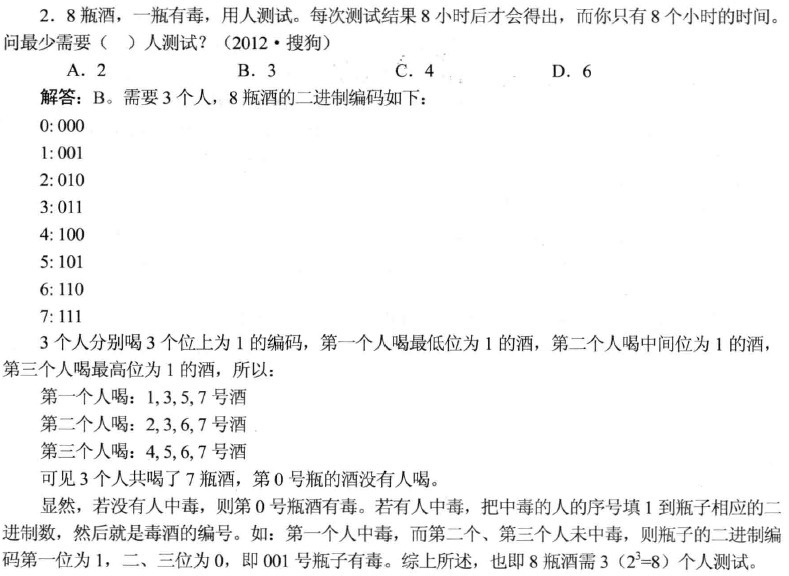

### 2）题目二

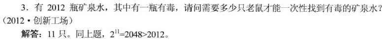

### 3）题目三

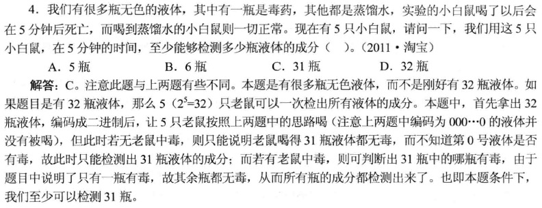

 

## 2.状态切换

### 1）题目一

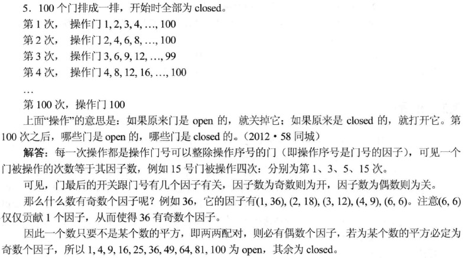

### 2）题目二

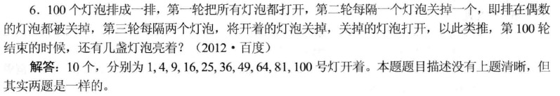

### 3）题目三

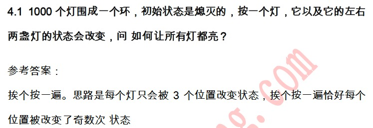

 

## 3.工人与金条

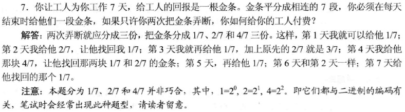

 

## 4.确定灯泡的开关

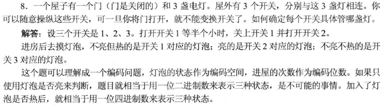

 

## 5.最后剩下的数

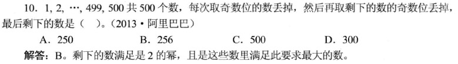

 

## 1.中奖的概率

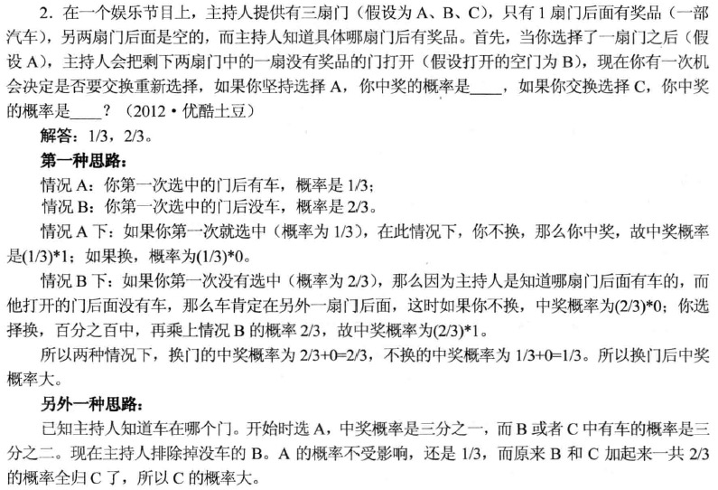

 

## 2.两个实数和大于1的概率

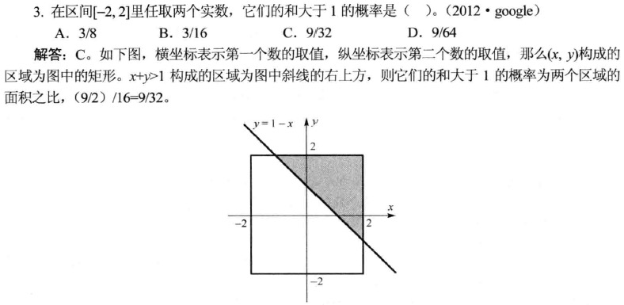

 

## 3.打开宝箱的概率

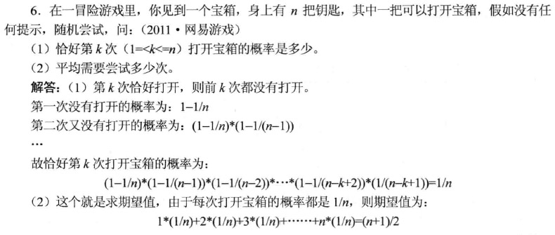

 

## 4.随机选取m个查询

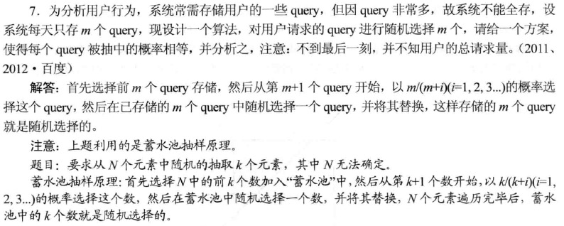

 

## 5.使用rand5实现rand7

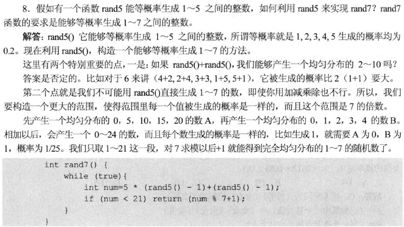

 

## 1.矩阵中A到B的走法

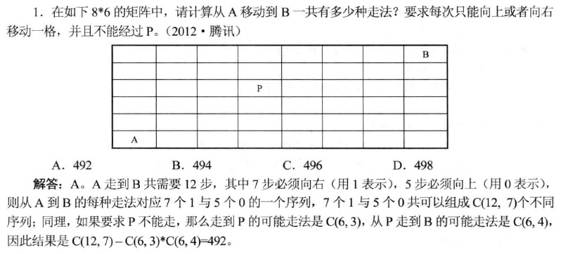

 

## 2.糖果的分法

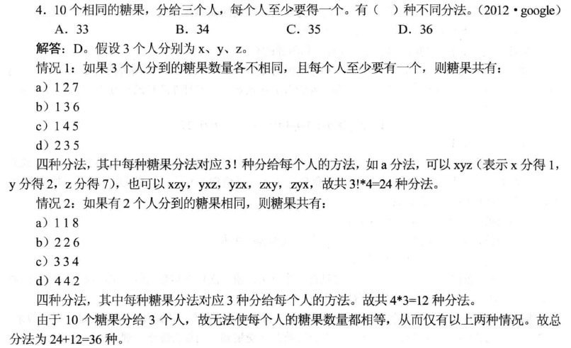

 

## 1.容斥原理

### 1）题目一

### 2）题目二

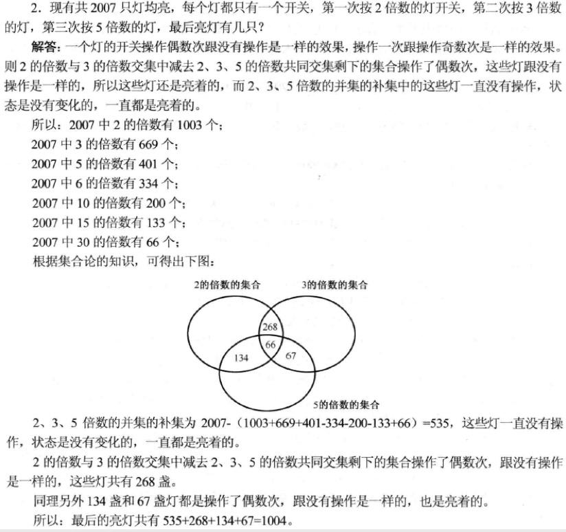

 
 

# 二.智力题

## 1.水果与标签

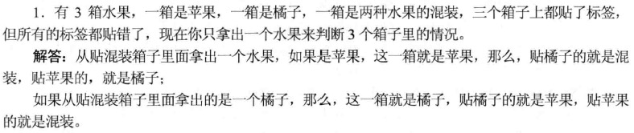

 

## 2.假币与损失

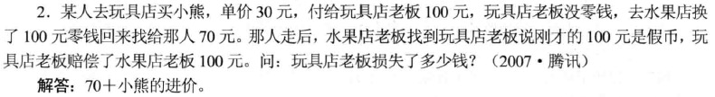

 

## 3.黑白帽子

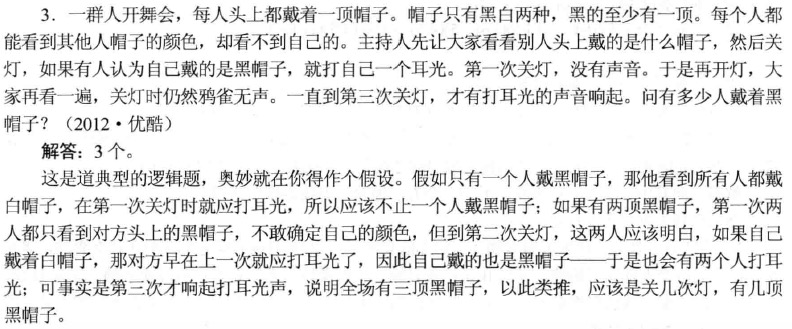

 

## 4.囚犯猜帽子

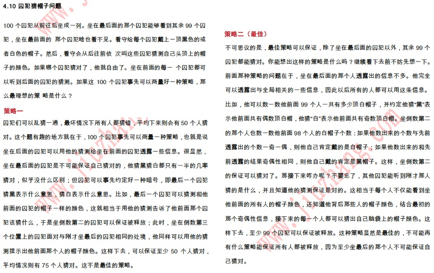

 

## 5.重量不同的球

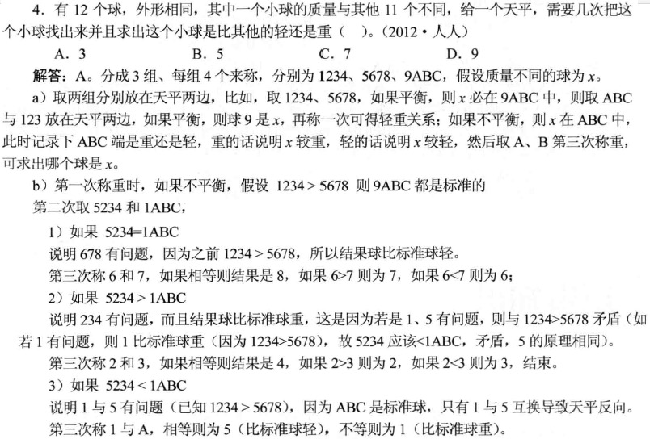

 

## 6.淘汰赛比赛次数

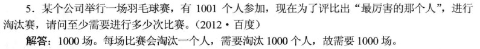

 

## 7.猴子分桃

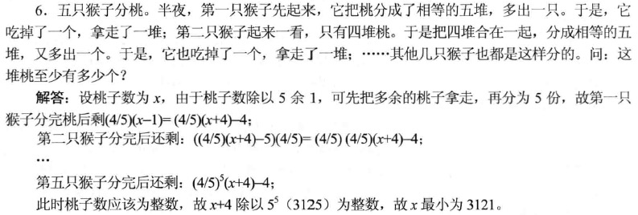

 

## 8.说真话和说假话

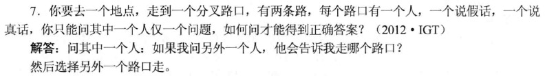

 

## 9.说实话的老鼠

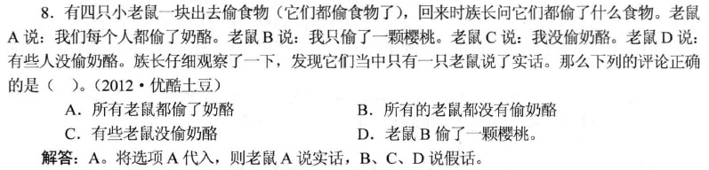

 

## 10.扔鸡蛋

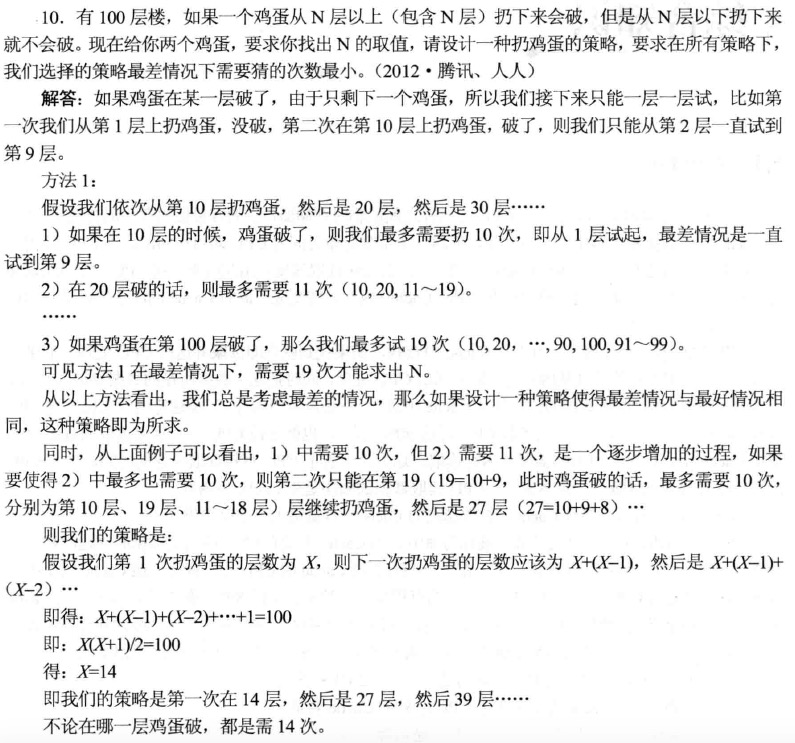