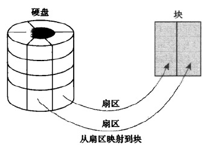
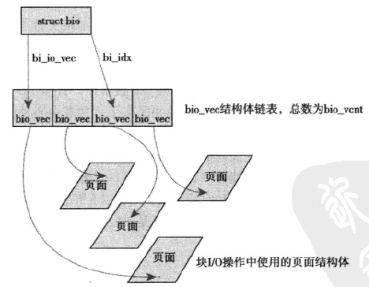
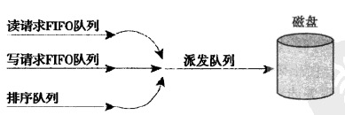

* [块I/O层](#块io层)
	* [1.I/O设备](#1io设备)
	* [2.扇区(sector)](#2扇区sector)
	* [3.块(block)](#3块block)
	* [4.buffer_head结构](#4buffer_head结构)
	* [5.bio结构](#5bio结构)
	* [6.I/O请求队列与I/O请求](#6io请求队列与io请求)
	* [7.调度算法](#7调度算法)
		* [1）Elevator(电梯)](#1elevator电梯)
		* [2）Deadline(截止日期)](#2deadline截止日期)
		* [3）Anticipatory(预测)](#3anticipatory预测)
		* [4）CFQ(完全公平队列)](#4cfq完全公平队列)
		* [5）Noop](#5noop)
		* [6）查看与选择可用的调度算法](#6查看与选择可用的调度算法)

# 块I/O层

## 1.I/O设备

设备类型大体上可以分为**块设备(block device)**和**字符设备(character device)**

块设备和字符设备关键的区别在于**数据访问的方式**：

* **块设备**：数据访问的方式为**随机访问**，可以在块设备的不同位置进行跳转，随机访问数据，并不需要遵循一定的顺序。（常见块设备包括：hard disk(最普遍)、floppy drivers、Blu-ray reader、flash memory）
* **字符设备**：数据访问的方式为**数据流**，拿键盘来说，如果键入“wolf”，驱动会严格按照字符串顺序返回字符流，如果乱序读取这个字符流，或者读取字符流中其它位置的字符，都会产生歧义。（常见字符设备包括：serial ports、keyboards）


因此，管理块设备通常会更复杂。因为字符设备只需要记录当前读取数据的位置就行了，而块设备在任何位置支持向前或者向后访问。加上块设备对性能十分敏感，因此内核为块设备单独提供了一个子系统**(块I/O层 block I/O layer)**进行管理

<br>

## 2.扇区(sector)

**块设备的最小可寻址单元**。最常见大小是**512B**(也有其它大小，如很多CD-ROM discs 的扇区为2KB)。尽管很多块设备能一次对多个扇区进行管理，但是无法对比块更小的单元进行寻找/操作

<br>

## 3.块(block)

块是**文件系统层面的一个抽象**。尽管块设备以扇区为单元进行寻址，但是文件系统操作的数据以块为单位。内核要求块**不能小于扇区，不能大于页(page)**。一般是`2^k`个扇区大小，常见大小为512B，1KB，4KB

扇区和块的关系下图：

<div align="center">  </div>

<br>

## 4.buffer_head结构

如果一个块被存进内存，那么就是说这个块存入了一个buffer。**每一个buffer和一个具体的块对应**。可以说，一个buffer是一个块的内存表示

由于块不能比page大，因此在内存中，一个page能容纳一个或多个块。内核需要一些**控制信息(buffer对应哪个设备的哪个块)来管理buffer**，因此设计了名为`buffer_head`的描述符。定义在`<linux/buffer_head.h>`中：

```c
struct buffer_head {
	unsigned long b_state;			/* buffer的状态位图 */
	struct buffer_head *b_this_page;	/* 该页buffer的循环链表 */
	struct page *b_page;			/* 该buffer_head映射到的page */

	sector_t b_blocknr;			/* 起始块号 */
	size_t b_size;				/* size of mapping */
	char *b_data;				/* pointer to data within the page */

	struct block_device *b_bdev;
	bh_end_io_t *b_end_io;			/* I/O completion */
 	void *b_private;			/* reserved for b_end_io */
	struct list_head b_assoc_buffers;	/* associated with another mapping */
	struct address_space *b_assoc_map;	/* mapping this buffer is
						   associated with */
	atomic_t b_count;			/* 引用计数 */
};
```

* `b_state`：buffer的状态。可能是下表中的值
* `b_count`：buffer的使用计数。这个值通过两个内联函数进行增加和减小，它们定义在`<linux/buffer_head.h>`中
	```c
	static inline void get_bh(struct buffer_head *bh) {
		atomic_inc(&bh->b_count);
	}
	static inline void put_bh(struct buffer_head *bh) {
		atomic_dec(&bh->b_count);
	}
	```
	在操作一个buffer前，需要调用`get_bh()`增加这个buffer的使用计数，确保buffer不会意外释放。当操作完成后，调用`put_bh()`函数减小使用计数
* `b_bdev`：buffer对应的块设备
* `b_blocknr`：buffer对应块的逻辑块号
* `b_page`：指向buffer对应的page
* `b_data`：直接指向具体的块（buffer对应的块位于内存`b_data`到`b_data+b_size`范围内）
* `b_size`：块的大小

| 标志值  |   描述 |
| :----: | :----: |
|BH_Uptodate|Buffer contains valid data|
|BH_Dirty|Buffer is dirty|
|BH_Lock|Buffer is undergoing disk I/O and is locked to prevent concurrent access|
|BH_Req|Buffer is involved in an I/O request|
|BH_Mapped|Buffer is a valid buffer mapped to an on-disk block|
|BH_New|Buffer is newly mapped via get_block() and not yet accessed|
|BH\_Async\_Read|Buffer is undergoing asynchronous read I/O via end\_buffer\_async\_read()|
|BH\_Async\_Write|Buffer is undergoing asynchronous write I/O via end\_buffer\_async\_write()|
|BH_Delay|Buffer does not yet have an associated on-disk block (delayed allocation)|
|BH_Boundary|Buffer forms the boundary of contiguous blocks—the next block is discontinuous|
|BH\_Write\_EIO|Buffer incurred an I/O error on write|
|BH_Ordered|Ordered write|
|BH_Eopnotsupp|Buffer incurred a “not supported” error|
|BH_Unwritten|Space for the buffer has been allocated on disk but the actual data has not yet been written out|
|BH_Quiet|Suppress errors for this buffer|


**总的来说，`buffer_head`包含内核操作buffer需要用到控制信息，它描绘了内存中buffer和磁盘块之间的映射关系**

<br>

## 5.bio结构

`bio`结构是内核中块I/O的基本容器，定义在`<linux/bio.h>`中。它**代表一个活动的块I/O操作**

这个块I/O操作的对象是以片段(segement)组织的链表。**片段(segement)是一个buffer在内存中连续的一块数据，用`bio_vec`结构表示**，因此，单个buffer不一定要在内存中连续（意思就是，可以由分散在内存中的多个连续的数据区——片段，组成一个buffer）。即使单个buffer的数据可能分散在内存中的多个位置，bio结构也提供了对这个buffer操作的能力(scatter-gather I/O)

```c
struct bio {
	sector_t		bi_sector;	/* device address in 512 byte
						   sectors */
	struct bio		*bi_next;	/* request queue link */
	struct block_device	*bi_bdev;
	unsigned long		bi_flags;	/* status, command, etc */
	unsigned long		bi_rw;		/* bottom bits READ/WRITE,
						 * top bits priority
						 */

	unsigned short		bi_vcnt;	/* how many bio_vec's */
	unsigned short		bi_idx;		/* current index into bvl_vec */

	/* Number of segments in this BIO after
	 * physical address coalescing is performed.
	 */
	unsigned short		bi_phys_segments;

	/* Number of segments after physical and DMA remapping
	 * hardware coalescing is performed.
	 */
	unsigned short		bi_hw_segments;

	unsigned int		bi_size;	/* residual I/O count */

	/*
	 * To keep track of the max hw size, we account for the
	 * sizes of the first and last virtually mergeable segments
	 * in this bio
	 */
	unsigned int		bi_hw_front_size;
	unsigned int		bi_hw_back_size;

	unsigned int		bi_max_vecs;	/* max bvl_vecs we can hold */

	struct bio_vec		*bi_io_vec;	/* the actual vec list */

	bio_end_io_t		*bi_end_io;
	atomic_t		bi_cnt;		/* pin count */

	void			*bi_private;

	bio_destructor_t	*bi_destructor;	/* destructor */
};
```

* `bi_io_vec`：指向片段组织的链表。每一个`bio_vec`（）表示一个片段，被看作是一个\<page,offset,len\>形式的矢量(vector)。`bio_vec`结构定义在`<linux/bio.h>`中：
	```c
	struct bio_vec {
		struct page	*bv_page;
		unsigned int	bv_len;
		unsigned int	bv_offset;
   };
	```
* `bi_vcnt`：链表的大小
* `bi_cnt`：这个bio的使用计数。当`bi_cnt=0`时，这个bio结构会被销毁，释放。在对bio进行操作前，需要调用bio_get增加使用计数，操作完成后，需要调用bio_put减小使用计数。下面两个功能用来更新`bi_cnt`的值：
	```c
	void bio_get(struct bio *bio) //增加使用计数
	void bio_put(struct bio *bio) //减小使用计数
	```
* `bi_private`域记录这个bio拥有者的私有信息，拥有者为分配这个bio结构的人

下图描绘了bio、bio_vec、page三者间的关系：

<div align="center">  </div>

**总之，每个块I/O请求用一个bio结构表示，每个请求由一个或多个块组成(对应一个或多个buffer)，这些块通过bi\_io\_vec指向的bio\_vec链表串连起来。随着块I/O层提交片段，bi_idx域被更新指向当前段。**

<br>

## 6.I/O请求队列与I/O请求

块设备维护一个请求队列来存放待处理的块I/O请求。这个**请求队列由`request_queue`结构表示**，定义在`<linux/blkdev.h>`中。请求队列包含了：

* 一个由请求组成的双链表
* 还有一些相关的控制信息

请求在内核上层(如文件系统层)被加入到队列。只要请求队列非空，块设备驱动就从队列头部提取I/O请求，然后提交到对应的块设备

**每个I/O请求用`request`结构表示**。定义在`<linux/blkdev.h>`中。**每个I/O请求可以由不止一个bio结构组成，因为单个请求可以操作多个磁盘上连续的块**

<br>

## 7.调度算法

> 调度算法就是控制I/O请求队列中I/O请求的合并方式与调用时机

如果只是简单的按I/O请求插入请求队列的顺序将I/O请求提交到对应的块设备，会导致非常差的性能。磁盘寻道是当今计算机最慢的操作之一。因此最小化寻道时间对于提升系统性能来说至关重要

为了最小化寻道时间，内核并不按I/O请求插入队列的顺序提交I/O请求。它们会对I/O请求进行**合并**和**排序**来提高系统的总体性能。**内核实现这两个操作的子系统就是调度算法**

通过合并和排序，I/O调度器在待处理的I/O请求之间划分磁盘I/O资源

1. **合并**：就是将多个请求合并成一个请求，举例来说，如果一个读取文件中一大块数据的请求被插入到请求队列，如果此时请求队列中已经存在一个读取磁盘中相邻扇区的请求。那么则两个请求能被合并成一个。这样的合并使得只需要提交一个命令到块设备就能完成多个请求的I/O操作，极大节省了寻道时间
2. **排序**：即使没有找到合适的请求进行合并，也不会简单的将新请求插入到队尾。而是按访问扇区的位置插入新请求。这样可以在磁头从一端移动到另一端的过程中，处理这条路径上的所以请求(就像电梯)。这样设计的目的是为了最小化总寻道时间，并不是最小化每一个请求的寻道时间(想一下，对于电梯最高层的人来说，如果电梯上升过程中有另外的人要上电梯——即有新请求要插队，那么肯定会延长电梯到达最高层的时间)

### 1）Elevator(电梯)

> 内核2.4的默认调度算法；内核2.6中，被换成了deadline调度算法；但是由于这个算法更简单，并且在功能上有很多相似的地方，因此是个很好的入门

Linux Elevator调度算法包括合并和排序操作

当有请求入队时：

1. 检索是否有可以合并的候选者。包括**向前合并(front merging)**和**向后合并(back merging)**
	* **如果新请求被合并到相邻请求前面，则是向前合并**（由于文件的布局方式(按扇区号增加的方向布局)以及一种典型负载的I/O操作特点(通常读文件从起始读到结尾，而不是反过来读)，向前合并相比于向后合并来说极少发生。但是尽管如此，Linux Elevator还是会对两种合并进行检查）
	* **如果新请求被合并到邻近请求的后面，则是向后合并**
2. 如果新请求没有合并，则在队列中寻找一个合适的位置插入新请求，未找到则将新请求插入队尾
3. 此外，如果在队列中存在驻留时间过长的请求(超过一个预定的阈值)，那么即使有适合新请求插入的位置，新请求也会被插入队尾。这是为了防止磁盘上邻近的大量请求饥饿其它位置的请求。但是这种时间检测并没有为驻留时间过长的请求提供服务，而是停止新请求的有序插入。虽然改善了延迟，但是仍然有可能导致饥饿。这是内核2.4的I/O调度算法必须修改的一点

总的来说，当一个被添加到队列时，可能会执行下列4个操作：

* 如果有合适的请求合并，则执行请求合并操作；
* 如果队列中存在驻留时间过长的请求，则将新请求插入队尾；
* 如果在队列中找到合适的插入位置，则将新请求插入该位置(使得所有请求按磁盘中的物理位置排序)；
* 如果没找到合适的位置插入，则将新请求插入队尾；

### 2）Deadline(截止日期)

这个调度算法尝试解决Linus Elevator中的饥饿问题。为了最小化寻道时间，相同位置的请求会插入请求队列，饥饿其它位置的请求

更坏的是，这个饥饿问题带来了一个特例：**写饥饿读**。写操作经常在内核空闲时被提交到磁盘，它和提交它(写操作)的程序完全异步执行。而读操作完全不同。一般情况下，当一个应用提交一个读请求后，它会被阻塞，直到读请求被满足。也就是说，读请求和提交它的程序同步执行。虽然写延迟和应用性能没有多大关系，但是对于读操作来说，应用必须等待读操作完成。因此，读延迟对系统性能来说十分重要

除此之外，读请求往往互相依赖。考虑读取一个大文件，如果前面一块数据没有读完，后面数据块的读取也无法执行。更糟的是，读和写操作都要求读取元素据(如inode)。这使得I/O更加串行化。因此，如果读请求饥饿，整个串行化累积起来的延迟将会异常巨大

需要注意的是，**减少请求饥饿必须以全局吞吐量为代价**。deadline调度算法非常努力地尝试在限制饥饿发生的同时，提供良好的全局吞吐量。但是不要搞错：要保证请求公平性的同时，最大化全局吞吐量仍然非常困难

在deadline调度算法中，每个请求有一个到期时间(expiration time)，默认为500ms(对于读请求)和5s(对于写请求)

* 和linux elevator类似，它有一个名为**sorted queue**的有序队列。这个队列按请求数据的物理磁盘位置对请求排序。当请求被提交到sorted queue时，deadline按照linus elevator的方式执行合并和插入操作
* 此外，它还根据请求的类型将读请求和写请求分别插入到**read FIFO queue**和**write FIFO queue**。虽然sorted queue是按照物理磁盘访问顺序对请求进行排序，但是**read FIFO queue**和**write FIFO queue**严格保持先进先出的顺序。正常情况下，deadline从sorted queue头部取出一个请求，提交到分发队列(dispatch queue)，分发队列进一步将请求提交给磁盘。这保证了最小化寻道时间
* 如果**read FIFO queue**或者**write FIFO queue**中的头部请求到期(也就是说，当前时间超过了请求的到期时间)，则deadline转为服务FIFO队列。这确保了不会有请求超过到期时间太多才完成

<div align="center">  </div>

> deadline并不保证请求的**完成**时间，它只保证在到期时间来临之前或者在到期时间来临时**提交**请求。这能够防止饥饿发生。同时，由于读请求的到期时间远小于写请求的到期时间，它也能防止写饥饿读。对读请求的照顾确保了最小化的读延迟

### 3）Anticipatory(预测)

deadline调度算法还是在全局吞吐量上做出了牺牲，考虑这种负载：一个应用在执行大量顺序写操作。在没有请求到期之前，按顺序满足这些顺序写请求。假设现在每隔一段时间有一个读请求到达，在读请求到期时间之前，会继续执行写请求。当读请求到期时，转而调度读请求。这里引入了磁盘寻道时间。在处理完读请求后，又回来出来顺序写，这里又引入了寻道开销。然后一段时间后下一个读请求到达，如此反复，每个读请求到来时，都会引入一定的寻道时间。导致全局吞吐量下降。因此，anticipatory调度算法试图保持读请求低延迟的同时，优化全局吞吐量

首先，anticipatory调度算法按照deadline的方式进行调度，**它也有3个队列，每个请求都有一个到期时间。主要改变是它引入了一个启发式预测**

继续用之前的例子说明。当一个读请求到达时，在到达日期来临前，会按照之前的方式进行处理。当这个读请求被提交后，anticipatory不会马上转回去处理顺序写请求，而是会等待一小段时间(可以设置，默认是6ms)。如果在这段时间内还有其它读请求到来，就可以较少来回寻道次数，提高吞吐量

当然，如果在等待时间内没有任何事发生，那么这段等待时间就浪费了。anticipatory调度算法的性能取决于能否准确预测等待时间内系统的I/O活动。这通过一系列统计以及启发式来完成。anticipatory跟踪并统计每个进程的块I/O操作行为

这个调度算法在大多数负载下都表现良好。对于服务器来说是个比较理想的算法，但是在一些不常见但是负载严格的场景中(包括 seek-happy databases)表现不好

### 4）CFQ(完全公平队列)

这个调度算法是为特定负载设计的，但是实际上在很多负载下它都能提供不错的性能。它和之前提到的算法有本质上的区别

cfq为每个进程维护一个I/O队列，新的I/O请求会插入到发起这个请求的进程的I/O队列中。在每个队列中，请求进行合并以及排序操作

cfq以轮询的方式服务每一个队列，每次从一个队列中选择一定数目的(默认4，可以设置)请求服务。因此提供了进程之间的公平性。确保每个进程得到公平的带宽。这个算法主要是为多媒体负载设计，实际上能在很多场景下工作良好。它被推荐用于桌面负载

### 5）Noop

noop调度算法仅仅只对新请求执行合并操作，除此之外它什么也不做。仅仅只是以near-FIFO的顺序维护一个请求队列

这种算法这样设计并不是没有原因的，它是考虑到如ssd这类在寻道上只有很小开销或者没有开销的设备，对于这些设备来说，不需要担心寻道延迟，因此也就不需要对请求进行排序。因此对于这类设备来说，noop是个理想的候选者

### 6）查看与选择可用的调度算法

可用通过如下命令查看linux中支持和当前使用的调度算法：

```bash
cat /sys/block/设备名/queue/scheduler

noop [deadline] cfq	#当前使用的调度算法为"deadline"
```

如果要切换调度算法，可用使用命令：

```bash
echo 算法名 >> /sys/block/设备名/queue/scheduler
```
