* [一.文件I/O](#一文件io)
    - [1.文件描述符](#1文件描述符)
    - [2.相关调用](#2相关调用)
        + [2.1 打开文件](#21-打开文件)
        + [2.2 创建文件](#22-创建文件)
        + [2.3 关闭文件](#23-关闭文件)
        + [2.4 定位读写位置](#24-定位读写位置)
        + [2.5 文件读](#25-文件读)
        + [2.6 文件写](#26-文件写)
        + [2.7 fcntl函数](#27-fcntl函数)
    - [3.进程间文件共享](#3进程间文件共享)
    - [4.原子操作](#4原子操作)
    - [5.数据同步](#5数据同步)
* [三.标准I/O库](#三标准io库)
    - [1.流](#1流)
        + [1.1 流的定向](#11-流的定向)
        + [1.2 3个标准流](#12-3个标准流)
    - [2.FILE对象](#2file对象)
    - [3.缓冲](#3缓冲)
        + [3.1 3种缓冲类型](#31-3种缓冲类型)
        + [3.2 缓冲区冲洗](#32-缓冲区冲洗)
        + [3.3 标准流与缓冲](#33-标准流与缓冲)
    - [4.相关调用](#4相关调用)
        + [4.1 打开流](#41-打开流)
        + [4.2 关闭流](#42-关闭流)
        + [4.3 读写流](#43-读写流)
        + [4.4 定位流](#44-定位流)
        + [4.5 格式化I/O](#45-格式化io)
        + [4.6 获取流相应的文件描述符](#46-获取流相应的文件描述符)
        + [4.7 创建临时文件](#47-创建临时文件)
    - [5.内存流](#5内存流)
* [四.进程环境](#四进程环境)
    - [1.进程的启动与终止](#1进程的启动与终止)
        + [1.1 main函数](#11-main函数)
        + [1.2 进程终止的方式](#12-进程终止的方式)
        + [1.3 终止函数](#13-终止函数)
        + [1.4 终止状态](#14-终止状态)
        + [1.5 登记终止处理程序](#15-登记终止处理程序)
    - [2.环境表](#2环境表)
        + [2.1 获取环境变量](#21-获取环境变量)
        + [2.2 修改环境变量](#22-修改环境变量)
    - [3.C程序的存储空间布局](#3c程序的存储空间布局)
    - [4.共享库](#4共享库)
    - [5.存储空间分配](#5存储空间分配)
    - [6.进程资源限制](#6进程资源限制)
* [五.进程控制](#五进程控制)
    - [1.进程标识](#1进程标识)
        + [1.1 2个特殊进程](#11-2个特殊进程)
        + [1.2 进程相关的ID获取函数](#12-进程相关的id获取函数)
    - [2.进程的创建](#2进程的创建)
        + [2.1 fork](#21-fork)
        + [2.2 vfork](#22-vfork)
    - [3.进程的终止](#3进程的终止)
        + [3.1 子进程向父进程传递状态](#31-子进程向父进程传递状态)
        + [3.2 父子进程以不同顺序终止](#32-父子进程以不同顺序终止)
    - [4.竞争条件](#4竞争条件)
    - [5.exec函数](#5exec函数)
    - [6.更改用户ID和更改组ID](#6更改用户id和更改组id)

<br>
<br>

<div align="center"> 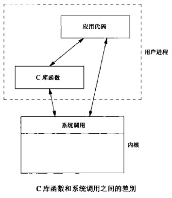 </div>

<br>
<br>
<br>

# 一.文件I/O
  
本章描述的函数经常被称为**不带缓冲的I/O**，不带缓冲值的是每个read和write都调用内核中的一个系统调用。这些不带缓冲的I/O函数不是ISO C的组成部分，它们是POSIX.1和Single UNIX Specification的组成部分

## 1.文件描述符

对于内核而言，所有打开的文件都通过文件描述符引用。文件描述符是一个非负数。范围是0~OPEN_MAX-1。当进程创建时，默认为它打开了3个文件描述符，它们都链接向终端：

* 0： 标准输入
* 1： 标准输出
* 2： 标准错误输出

通常使用`STDIN_FILENO`，`STDOUT_FILENO`和 `STDERR_FILENO`来替代这三个幻数，从而提高可读性。这三个常量位于`<unistd.h>`中

### 复制文件描述符

<div align="center"> 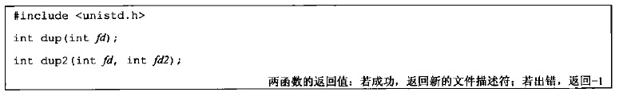 </div>

* 对于`dup`函数
    - 返回的新的文件描述符一定是当前可用的文件描述符中最小的数字
* 对于`dup2`函数：
    - 如果 `fd2`已经是被打开的文件描述符且不等于`fd`，则先将其关闭，然后再打开（<font color='red'>注意关闭再打开是一个原子操作</font>）
    - 如果 `fd2`等于`fd`，则直接返回`fd2`（也等于`fd`），而不作任何操作

这些函数返回的新文件描述符与参数fd共享同一个文件表项：

<div align="center"> 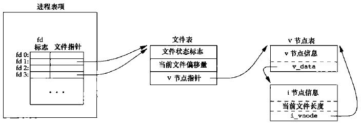 </div>

<br>

## 2.相关调用

### 2.1 打开文件

<div align="center"> 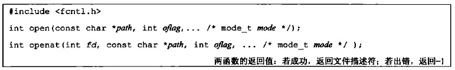 </div>

* 参数：
    * `path`:要打开或者创建文件的名字
    * `oflag`：用于指定函数的操作行为：
        * `O_RDONLY`常量：文件只读打开
        * `O_WRONLY`常量：文件只写打开
        * `O_RDWR`常量：文件读、写打开
        * `O_EXEC`常量：只执行打开
        * `O_SEARCH`常量：只搜索打开（应用于目录）。本书涉及的操作系统都没有支持该常量

        **以上五个常量必须且只能指定一个。下面的常量是可选的（进行或运算）**：
        * `O_APPEND`：每次写时都追加到文件的尾端
        * `O_CLOEXEC`：将`FD_CLOEXEC`常量设置为文件描述符标志
        * `O_CREAT`：若文件不存在则创建。使用此选项时，需要同时说明参数`mode`（指定该文件的访问权限）
        * `O_DIRECTORY`：若`path`引用的不是目录，则出错
        * `O_EXCL`：若同时指定了`O_CREAT`时，且文件已存在则出错。根据此可以测试一个文件是否存在。若不存在则创建此文件。这使得测试和创建两者成为一个原子操作
        * `O_NOCTTY`：若`path`引用的是终端设备，则不将该设备分配作为此进程的控制终端
        * `O_NOFOLLOW`：若`path`引用的是一个符号链接，则出错
        * `O_NONBLOCK`：如果`path`引用的是一个`FIFO`、一个块特殊文件或者一个字符特殊文件，则文件本次打开操作和后续的 I/O 操作设为非阻塞模式
        * `O_SYNC`：每次 `write` 等待物理 I/O 完成，包括由 `write` 操作引起的文件属性更新所需的 I/O 
        * `O_TRUNC`： 如果此文件存在，且为`O_WRONLY`或者`O_RDWR`成功打开，则将其长度截断为0
        * `O_RSYNC`：使每一个`read`操作等待，直到所有对文件同一部分挂起的写操作都完成
        * `O_DSYNC`：每次 `write` 等待物理 I/O 完成，但不包括由 `write` 操作引起的文件属性更新所需的 I/O 

    *  `mode`：文件访问权限。文件访问权限常量在 `<sys/stat.h>` 中定义，有下列九个：
        * `S_IRUSR`：用户读
        * `S_IWUSR`：用户写
        * `S_IXUSR`：用户执行
        * `S_IRGRP`：组读
        * `S_IWGRP`：组写          
        * `S_IXGRP`：组执行         
        * `S_IROTH`：其他读
        * `S_IWOTH`：其他写
        * `S_IXOTH`：其他执行 

对于`openat`函数，被打开的文件名由`fd`和`path`共同决定：

* 如果`path`指定的是绝对路径，此时`fd`被忽略。`openat`等价于`open`
* 如果`path`指定的是相对路径名，则`fd`是一个目录的文件描述符。被打开的文件的绝对路径由该`fd`描述符对应的目录加上`path`组合而成
* 如果`path`是一个相对路径名，而`fd`是常量`AT_FDCWD`，则`path`相对于当前工作目录。被打开文件在当前工作目录中查找。

由 `open/openat` 返回的文件描述符一定是**最小的未使用**的描述符数字

### 2.2 创建文件

<div align="center">  </div>

* 参数：
    * `path`:要创建文件的名字
    * `mode`：指定该文件的访问权限。文件访问权限常量在 `<sys/stat.h>` 中定义，有下列九个：
        * `S_IRUSR`：用户读
        * `S_IWUSR`：用户写
        * `S_IXUSR`：用户执行
        * `S_IRGRP`：组读
        * `S_IWGRP`：组写          
        * `S_IXGRP`：组执行         
        * `S_IROTH`：其他读
        * `S_IWOTH`：其他写
        * `S_IXOTH`：其他执行

该函数等价于`open(path,O_WRONLY|O_CREAT|O_TRUNC,mode)`

`creat`的存在一个不足是：**它以只写方式打开创建的文件**。如果要创建一个临时文件，并要先写该文件，然后又读该文件，则必须先调用`create`、`close`，然后再调用`open`，新版本`open`出来后，可以以下列方式实现：

`open(path,O_RDWR|O_CREAT|O_TRUNC,mode)`

### 2.3 关闭文件

<div align="center"> 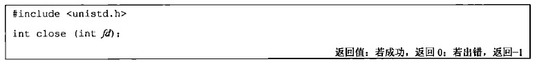 </div>

注意：

- 进程关闭一个文件会释放它加在该文件上的所有记录锁
- 当一个进程终止时，内核会自动关闭它所有的打开的文件

### 2.4 定位读写位置

<div align="center"> 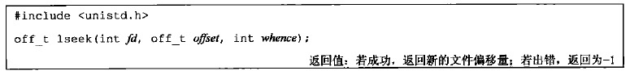 </div>

* 参数：
    * `fd`：打开的文件的文件描述符
    * `whence`：必须是 `SEEK_SET`、`SEEK_CUR`、`SEEK_END`三个常量之一
    * `offset`：
        * 如果 `whence`是`SEEK_SET`，则将该文件的偏移量设置为距离文件开始处`offset`个字节
        * 如果 `whence` 是 `SEEK_CUR`，则将该文件的偏移量设置为当前值加上`offset`个字节，`offset`可正，可负
        * 如果 `whence` 是 `SEEK_END`，则将该文件的偏移量设置为文件长度加上`offset`个字节，`offset`可正，可负

每个打开的文件都有一个与其关联的“当前文件偏移量”。它通常是个非负整数，用于度量从文件开始处计算的字节数。通常读、写操作都从当前文件偏移量处开始，并且使偏移量增加所读写的字节数。注意：

- 打开一个文件时，除非指定`O_APPEND`选项，否则系统默认将该偏移量设为0
- 如果文件描述符指定的是一个管道、FIFO、或者网络套接字，则无法设定当前文件偏移量，则`lseek`将返回 -1 ，并且将 `errno` 设置为 `ESPIPE`
- 对于普通文件，其当前文件偏移量必须是非负值。但是某些设备运行负的偏移量出现。因此比较`lseek`的结果时，不能根据它小于0 就认为出错。要根据是否等于 -1 来判断是否出错
- **`lseek` 并不会引起任何 I/O 操作，`lseek`仅仅将当前文件的偏移量记录在内核中**
- **当前文件偏移量可以大于文件的当前长度。此时对该文件的下一次写操作将家常该文件，并且在文件中构成一个空洞。空洞中的内容位于文件中但是没有被写过，其字节被读取时都被读为0（文件中的空洞并不要求在磁盘上占据存储区。具体处理方式与操作系统有关）**

### 2.5 文件读

<div align="center"> 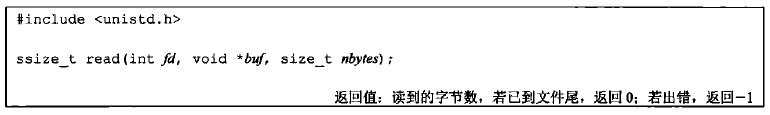 </div>

* 参数：
    * `fd`：打开的文件的文件描述符
    * `buf`：存放读取内容的缓冲区的地址（由程序员手动分配）
    * `nbytes`：期望读到的字节数

读操作从文件的当前偏移量开始，在成功返回之前，文件的当前偏移量会增加实际读到的字节数

有多种情况可能导致实际读到的字节数少于期望读到的字节数：

- 读普通文件时，在读到期望字节数之前到达了文件尾端
- 当从终端设备读时，通常一次最多读取一行（终端默认是行缓冲的）
- 当从网络读时，网络中的缓存机制可能造成返回值小于期望读到的字节数
- 当从管道或者`FIFO`读时，若管道包含的字节少于所需的数量，则 `read`只返回实际可用的字节数
- 当从某些面向记录的设备（如磁带）中读取时，一次最多返回一条记录
- 当一个信号造成中断，而已读了部分数据时

### 2.6 文件写

<div align="center"> 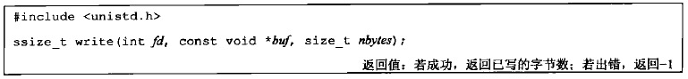 </div>

* 参数：
    * `fd`：打开的文件的文件描述符
    * `buf`：存放待写的数据内容的缓冲区的地址（由程序员手动分配）
    * `nbytes`：期望写入文件的字节数

`write`的返回值通常都是与`nbytes`相同。否则表示出错（出错的一个常见原因是磁盘写满，或者超过了一个给定进行的文件长度限制）

对于普通文件，写操作从文件的当前偏移量处开始。如果打开文件时指定了`O_APPEND`选项，则每次写操作之前，都会将文件偏移量设置在文件的当前结尾处。在一次成功写之后，该文件偏移量增加实际写的字节数

### 2.7 fcntl函数

fcntl可以改变已经打开文件的属性

<div align="center"> 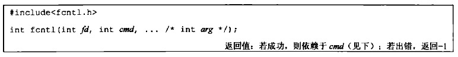 </div>

* 参数：
    * `fd`：已打开文件的描述符
    * `cmd`：有下列若干种：
        - **复制一个已有的描述符**（还可以使用`dup`或`dup2`）
            - `F_DUPFD`：复制文件描述符 `fd`。新文件描述符作为函数值返回。它是尚未打开的文件描述符中大于或等于`arg`中的最小值。新文件描述符与`fd`共享同一个文件表项，但是新描述符有自己的一套文件描述符标志，其中`FD_CLOEXEC`文件描述符标志被清除
            - `F_DUPFD_CLOEXEC`：复制文件描述符。新文件描述符作为函数值返回。它是尚未打开的个描述符中大于或等于`arg`中的最小值。新文件描述符与`fd`共享同一个文件表项，但是新描述符有自己的一套文件描述符标志，其中`FD_CLOEXEC`文件描述符标志被设置
        * **获取/设置文件描述符标志**
            - `F_GETFD`：对应于`fd`的文件描述符标志作为函数值返回。当前只定义了一个文件描述符标志`FD_CLOEXEC`
            - `F_SETFD`：设置`fd`的文件描述符标志为`arg`
        * **获取/设置文件状态标志**
            - `F_GETFL`：返回`fd`的文件状态标志。获得文件状态标志后，必须首先用屏蔽字 `O_ACCMODE` 取得访问方式位，然后与`O_RDONLY`、`O_WRONLY`、`O_RDWR`、`O_EXEC`、`O_SEARCH`比较（这5个值互斥，且并不是各占1位）。剩下的还有：`O_APPEND`、`O_NONBLOCK`、`O_SYNC`
        、`O_DSYNC`、`O_RSYNC`、`F_ASYNC`、`O_ASYNC`
            - `F_SETFL`：设置`fd`的文件状态标志为 `arg`。可以更改的标志是：
      `O_APPEND`、`O_NONBLOCK`、`O_SYNC`、`O_DSYNC`、`O_RSYNC`、`F_ASYNC`、`O_ASYNC`
        * **获取/设置异步I/O所有权**
            - `F_GETOWN`：获取当前接收 `SIGIO`和`SIGURG`信号的进程 `ID`或者进程组 `ID`
            - `F_SETOWN`：设置当前接收 `SIGIO`和`SIGURG`信号的进程 `ID`或者进程组 `ID`为`arg`。若 `arg`是个正值，则设定进程 `ID`；若 `arg`是个负值，则设定进程组`ID`
        * **获取/设置记录锁**
            - `F_GETLK`、`F_SETLK`、`F_SETLKW`
    * `arg`：依赖于具体的命令 

<br>

## 3.进程间文件共享

UNIX系统支持在不同进程间共享打开文件。内核使用3种数据结构描述打开文件。它们之间的关系决定了在文件共享方面一个进程对另一个进程可能产生的影响

* 内核为每个进程分配一个**进程表项**（所有进程表项构成进程表），进程表中都有一个打开的文件描述符表。每个文件描述符占用一项，其内容为：
    * 文件描述符标志
    * 指向一个文件表项的指针
* 内核为每个打开的文件分配一个**文件表项**（所有的文件表项构成文件表）。每个文件表项的内容包括：
    * 文件状态标志（读、写、添写、同步和阻塞等）
    * 当前文件偏移量
    * 指向该文件 v 结点表项的指针
* 每个打开的文件或者设备都有一个 **v 结点结构**。 v 结点结构的内容包括： 
    * 文件类型和对此文件进行各种操作函数的指针
    * 对于大多数文件， v 结点还包含了该文件的 i 结点
    **这些信息都是在打开文件时从磁盘读入内存的**。如 i 结点包含了文件的所有者、文件长度、指向文件实际数据在磁盘上所在位置的指针等等。 v 结点结构和 i 结点结构实际上代表了文件的实体（**Linux没有使用v节点，而是使用了通用i节点结构。虽然两种实现有所不同，但在概念上，v节点与i节点是一样的，两者都指向文件系统特有的i节点结构**）

<div align="center"> 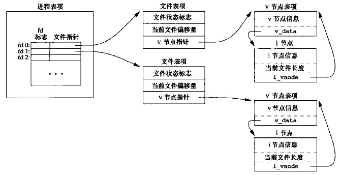 </div>

现在假设进程 A 打开文件 `file1`，返回文件描述符 3；进程 B 也打开文件 `file2`，返回文件描述符 4：

<div align="center"> 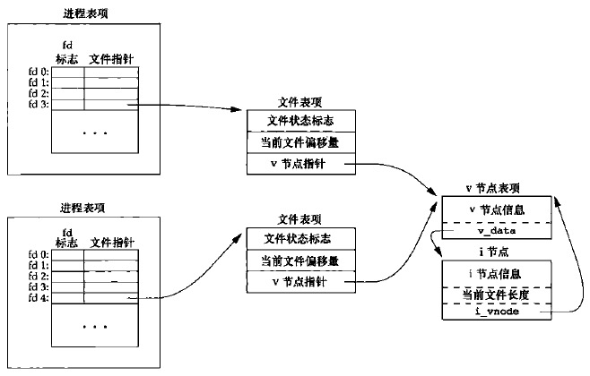 </div>

内核在文件表上新增两个表项：

- 这两个文件表项指向同一个 v 结点表项
- 进程 A 、B 各自的文件描述符表项分别指向这两个文件表项（因此每个进程都有自己的对该文件的当前偏移）

对文件的操作结果：

- 每次 `write` 之后，在文件表项中的当前文件偏移量即增加所写入的字节数
    - 若这导致当前文件偏移量超过当前文件长度，则修改 i 节点的当前文件长度，设为当前文件偏移量
- 如果用 `O_APPEND` 标志打开一个文件，则相应标志也设置到文件表项的文件状态标志中
    - 每次对具有追加写标志的文件执行写操作时，文件表项中的当前文件偏移量首先被置为 i 结点中的文件长度
- 若用 `lseek` 定位到文件当前的尾端，则文件表项中的当前文件偏移量设置为 i 结点中的文件长度
    - `lseek` 函数只是修改文件表项中的当前文件偏移量，不进行任何 I/O 操作

<br>

## 4.原子操作

> 多个进程写同一文件时，可能产生预想不到的结果。为了避免这种情况，需要理解原子操作

多个进程同时追加写一个文件时，如果通过 `lseek` 到末尾然后 `write` 可能出现问题：因为 “先定位到文件尾端，然后写” 并不是一个原子操作，如果先执行两个进程的 `lseek` ，然后执行 `write` ，就会出现问题

UNIX提供了一种原子操作方法：通过 `O_APPEND`选项打开文件。这样做使得内核在每次调用 `write` 执行写操作之前，都将进程的当前偏移量设置到该文件的末尾，于是就不需要执行`lseek`定位操作

### 定位读和定位写

<div align="center"> 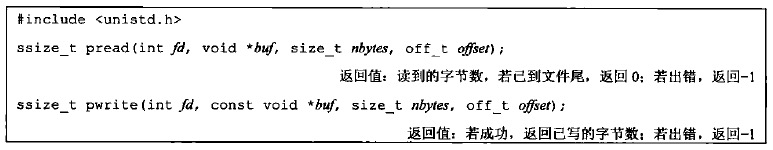 </div>

* 参数：
    * `fd`：打开的文件描述符
    * `buf`：读出数据存放的缓冲区/ 写到文件的数据的缓冲区
    * `nbytes`：预期读出/写入文件的字节数
    * `offset`：从文件指定偏移量开始执行`read/write`

调用`pread`相当于先调用`lseek`再调用`read`.但是调用`pread`时，无法中断其定位和读操作，并且不更新当前文件偏移量

调用`pwrite`相当于先调用`lseek`再调用`write`.但是调用`pwrite`时，无法中断其定位和写操作，并且不更新当前文件偏移量

<br>

## 5.数据同步

UNIX操作系统在内核中设有**缓冲区高速缓存**或**页高速缓存**，大多数磁盘 I/O 都通过缓冲区进行。当我们想文件写入数据时，内核通常都先将数据复制到缓冲区中，然后排入队列，晚些时候再写入磁盘。这种方式称为**延迟写**

以下2种情况会将缓冲区中的数据写回到磁盘：

- 当内核需要重用缓冲区来存方其他数据时，它会把所有延迟写的数据库写入磁盘
- 可以调用`sync`、`fsync`或`fdatasync`来显式的将所有延迟写的数据块写回磁盘

<div align="center"> 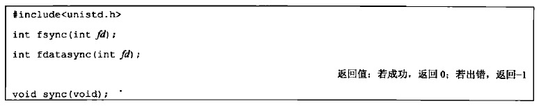 </div>

* 参数（前两个函数）：
    * `fd`：指定写回的文件

3个函数的区别：

- `sync`（`update` 守护进程会周期性(一般每隔30s)的调用`sync`函数。命令`sync`也会调用`sync`函数）：
    + 将所有修改过的块缓冲区排入写队列，然后返回
    + 它并不等待实际写磁盘操作结束
- `fsync`：
    + 只对由`fd`指定的单个文件起作用
    + 等待写磁盘操作结束才返回
- `fdatasync`：
    + 只对由`fd`指定的单个文件起作用，但是它只影响文件的数据部分（`fsync`会同步更新文件的属性）
    + 等待写磁盘操作结束才返回

<br>
<br>

# 二.文件和目录

<br>
<br>

# 三.标准I/O库

标准I/O库处理很多细节，如缓冲区分片、以优化的块长度执行I/O等。这些处理使用户不必担心如何选择使用正确的块长度。这使得它便于用户使用，但是如果不深入了解I/O库函数的操作，也会带来一些问题

## 1.流

标准I/O库与文件I/O区别：

- 标准I/O库处理很多细节，如缓冲区分片、以优化的块长度执行I/O等
- 文件I/O函数都是**围绕文件描述符**进行。首先打开一个文件，返回一个文件描述符；后续的文件IO操作都使用该文件描述符
- 标准I/O库是**围绕流**进行的

**当用标准I/O库打开或者创建一个文件时，就有一个内建的流与之相关联**

### 1.1 流的定向

> 流的定向决定了所处理的字符是单字节还是多字节的

对于ASCII字符集，一个字符用一个字节表示；对于国际字符集，一个字符可以用多个字节表示。标准I/O文件流可用于单字节或者多字节字符集。**流的定向**决定了所处理的字符是单字节还是多字节的

- **当一个流最初被创建时，它并没有定向**
    - 若在未定向的流上使用一个多字节I/O函数，则将该流的定向设置为宽定向的（即处理多字节）
    - 若在未定向的流上使用一个单字节I/O函数，则将该流的定向设置为字节定向的（即处理单字节）
- 只有两个函数可以改变流的定向
    - `freopen`：清除一个流的定向
    - `fwide`：设置流的定向（并不改变已定向流的定向）

<div align="center">  </div>

* 参数：
    * `fp`：`FILE`文件对象的指针
    * `mode`：流的定向模式。
        * 如果`mode`是**负数**，则函数试图使指定的流为**字节定向**（不保证成功，因为`fwide`不改变已定向流的定向）
        * 如果`mode`是**正数**，则函数试图使指定的流为**宽定向**的（不保证成功，因为`fwide`不改变已定向流的定向）
        * 如果`mode`为0，则函数不试图设置流的定向，而直接返回该流定向的值（可以用以获取流的定向）

注意：如果`fp`是无效流，由于`fwide`从返回值无法得知函数执行成功还是失败。那么我们必须采用这个方法：首先在调用`fwide`之前清除`errno`。然后在`fwide`之后检查`errno`的值。通过`errno`来检测`fwide`执行成功还是失败

### 1.2 3个标准流

操作系统对每个进程与定义了3个流，并且这3个流可以自动地被进程使用，他们都是定义在`<stdio.h>`中：

- **标准输入**：预定义的文件指针(FILE对象)为`stdin`，它内部的文件描述符就是`STDIN_FILENO`
- **标准输出**：预定义的文件指针(FILE对象)为`stdout`，它内部的文件描述符就是`STDOUT_FILENO`
- **标准错误**：预定义的文件指针(FILE对象)为`stderr`，它内部的文件描述符就是`STDERR_FILENO`

<br>

## 2.FILE对象

当使用`fopen`函数打开一个流时，它返回一个指向`FILE`对象的指针（书中称作**文件指针**）。该对象通常是一个结构，包含了标准I/O库为管理该流所需要的所有信息，包括：

* 用于实际I/O的文件描述符
* 指向用于该流缓冲区的指针
* 该流缓冲区的长度
* 当前在缓冲区中的字符数
* 出错标志

应用程序没必要检验`FILE`对象，只需要将`FILE`指针作为参数传递给每个标准I/O函数

<br>

## 3.缓冲

标准IO库提供缓冲的目的是：尽量减少使用`read`和`write`调用的次数。标准I/O库对每个I/O流自动地进行缓冲管理，从而避免了程序员需要手动管理这一点带来的麻烦

### 3.1 3种缓冲类型

标准I/O库提供了三种类型的缓冲：

- **全缓冲**：此时在标准I/O缓冲区被填满后，标准I/O库才进行实际的I/O操作
- **行缓冲**：此时当输入和输出中遇到换行符时，标准I/O库执行实际的I/O操作。但是注意：
    - 只要填满了缓冲区，即使还没有写一个换行符，也立即进行I/O操作
    - 任何时候只要通过标准I/O库，从一个不带缓冲的流或者一个行缓冲的流得到输入数据，则会冲洗所有行缓冲输出流。(<font color='red'>即要缓冲输入，先冲洗输出缓冲</font>)
- **不带缓冲**：标准I/O库不进行缓冲。此时任何I/O都立即执行实际的I/O操作

在一个流上执行第一次I/O操作时，相关标准的I/O函数通常调用 malloc 获取使用的缓冲区

下列函数可以**设置流的缓存类型**：

<div align="center"> 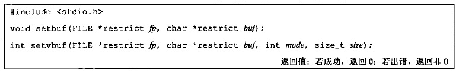 </div>

* 参数：
    * `fp`：被打开的文件对象的指针
    * `buf`：指向缓冲区的指针（如果是setbuf，长度就是BUFSIZ，定义在`<stdio.h>`中）
    * `mode`：指定缓冲类型。可以为：
        * `_IOFBF`：全缓冲。
        * `_IOLBF`：行缓冲
        * `_IONBF`：不带缓冲。此时忽略`buf`和`size`参数
    * `size`：缓冲的长度

<div align="center"> 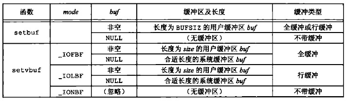 </div>

注意：

- 如果在一个函数内分配一个自动变量类型的标准I/O缓冲区，则从该函数返回之前，必须关闭流。因此自动变量是栈上分配，函数返回之后自动变量被销毁
- 某些操作系统将缓冲区的一部分存放它自己的管理操作信息，因此可以存放在缓冲区中的实际数据字节数将少于`size`
- 通常推荐利用操作系统自动选择缓冲区长度并自动分配缓冲区。在这种情况下若关闭此流，则标准I/O库会自动释放缓冲区

### 3.2 缓冲区冲洗

* 缓冲区可以由标准的I/O操作自动地冲洗（如，当填满一个缓冲区时）
* 也可以手动调用fflush函数冲洗一个流

<div align="center"> 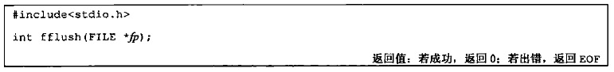 </div>

* 参数：
    * `fp`：被打开的文件对象的指针（`fp`为`NULL`时，此函数将导致所有输出流被冲洗）

冲洗是双向的：1）输出流 ---> 内核 ---> 磁盘或者终端； 2）输入流---> 用户缓冲区

冲洗并不是立即写到磁盘文件中。冲洗只是负责数据传到内核

### 3.3 标准流与缓冲

- **标准输入与标准输出**
    + 默认情况下，1）若是指向终端设备的流，则是**行缓冲**的；2）否则是**全缓冲**的
- **标准错误**
    + 默认情况下，是**不带缓冲**的
    + 不会是全缓冲

<br>

## 4.相关调用

### 4.1 打开流

<div align="center"> 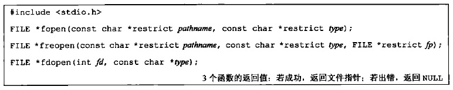 </div>

- 参数：
    + `type`：指定对该I/O流的读写方式（具体见下图）
        * 其中`b`用于区分二进制文件和文本文件。但是由于`UNIX`内核并不区分这两种文件，所以在UNIX环境中指定`b`并没有什么用
        * 对于`fdopen`，`type`意义稍微有点区别。因为该描述符已经被打开，所以`fdopen`为写而打开并不截断该文件。另外该文件既然被打开并返回一个文件描述符，则它一定存在。因此标准I/O追加写方式也不能创建文件
    + `pathname`：待打开文件的路径名
    + `fp`：指定的流（若`fp`已经打开，则先关闭该流；若`fp`已经定向，则清除该定向）
    + `fd`：指定的文件描述符。获得的标准I/O流将与该描述符结合

<div align="center"> 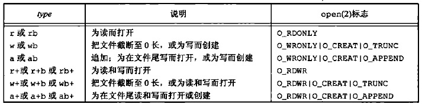 </div>

这几个函数的常见用途：

- `fopen`常用于打开一个指定的文件，返回一个文件指针
- `freopen`常用于在一个指定的流（标准输入、标准输出或者标准错误）上，打开一个指定的文件
- `fdopen`常用于将文件描述符包装成一个标准I/O流。因为某些特殊类型的文件（如管道、`socket`文件）不能用`fopen`打开，必须先获取文件描述符，然后对文件描述符调用`fdopen`

注意：当以读和写类型打开一个文件时(`type`中带`+`号的类型)，有下列限制：

- 如果写操作后面没有`fflush,fseek,fsetpos,rewind`操作之一，则写操作后面不能紧跟读操作
- 如果读操作后面没有`fseek,fsetpos,rewind`操作之一，也没有到达文件末尾，则在读操作之后不能紧跟写操作

**默认情况下，流被打开时是全缓冲的。但是如果流引用的是终端设备，则流被打开时是行缓冲的**

### 4.2 关闭流

<div align="center"> 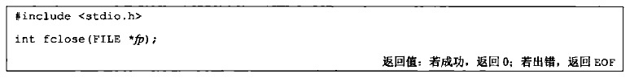 </div>

* 参数：
    * `fp`：待关闭的文件指针

* 在该文件被关闭之前：
    + `fclose`会自动冲洗缓冲中的输出数据，缓冲区中的任何输入数据被丢弃
    + 若该缓冲区是标准I/O库自动分配的，则释放此缓冲区
* 当一个进程正常终止时（直接调用`exit`函数，或者从`main`函数返回）：
    + 所有带未写缓存数据的标准I/O流都被冲洗
    + 所有打开的标准I/O流都被关闭

### 4.3 读写流

一旦打开了流，可以在3种不同类型的**非格式化I/O**中选择，对流进行读、写操作：

- **每次一个字符的I/O**。一次读、写一个字符。若流是带缓冲的，则标准I/O函数处理所有缓冲
    + [1）每次读一个字符](#1每次读一个字符)：`getc`、`fgetc`、`getchar`
    + [2）读取错误判断](#2读取错误判断)：`ferror`、`feof`、`clearerr`
    + [3）将读取字符压回流中](#3将读取字符压回流中)：`ungetc`
    + [4）每次写一个字符](#4每次写一个字符)：`putc`、`fputc`、`putchar`
- **每次一行的I/O**。一次读、写一行。每一行都以一个换行符终止
    + [5）每次读一行](#5每次读一行)
    + [6）每次写一行](#6每次写一行)
- **直接I/O(二进制I/O、一次一个对象I/O)**。每次I/O读、写某种数量的对象，每个对象具有指定的长度。常用于从二进制文件中每次读或写一个结构
    + [7）二进制I/O](#7二进制io)

> 格式化I/O由`printf`和`scanf`族函数完成

#### 1）每次读一个字符

<div align="center"> 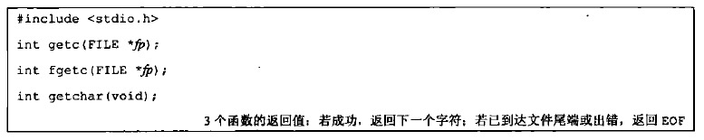 </div>

* 参数：
    * `fp`：文件对象指针

注意：

- `getchar()`等价于`getc(stdin)`。它从标准输入中读取一个字符
    - `getc`和`fgetc`的区别在于：`getc`可能通过宏定义来实现，而`fgetc`不能实现为宏。因此：
        - `getc`的参数不应该是具有副作用的表达式，因为它可能被计算多次
        - `fgetc`一定是个函数，因此可以得到其地址，这就允许将`fgetc`的地址作为参数传递。而`getc`不行
        - 调用`fgetc`所需的时间可能比调用`getc`长，因为函数调用所需时间通常比调用宏长
    - 这三个函数在返回下一个字符时，将`unsigned char`类型表示的字符转换成了`int`类型。（因为需要通过返回`EOF`来标记到达末尾或者出错。而`EOF`通常是常量 -1 。所以需要返回 `int`）

#### 2）读取错误判断

上述3个函数不管是出错还是到达文件尾端，都返回相同值，下面的函数可以进行区分

<div align="center"> 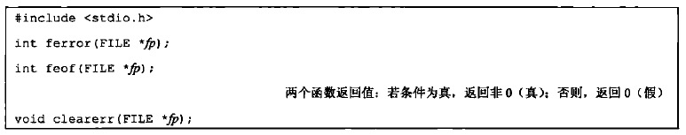 </div>

* 参数：
    * `fp`：文件对象指针

大多数实现中，为每个流在FILE对象中维护了两个标志：**文件出错标志和文件结束标志**。`clearerr`函数用来清除这两个标志

#### 3）将读取字符压回流中

<div align="center"> 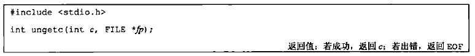 </div>

* 参数：
    * `c`：待压入字符转换成的整数值
    * `fp`：打开的文件对象指针

注意：

* 若根据某个序列向流中压入一串字符，则再从该流中读取的字符序列是逆序的。即最后压入的字符最先读出
* 可以执行任意次数的压入单个字符，但是不支持一次压入多个字符
* 不能压入 `EOF`。但是当已经读到文件尾端时，支持压入一个字符。下次读将返回该字符，再读则返回EOF

`ungetc`通常用于这样的情形：正在读取一个输入流，然后需要根据某个字符串（标记字符串）来对输入进行切分。那么我们就需要先看一看下一个字符，来决定如何处理当前字符。此时需要方便的将刚查看的字符回送

> `ungetc`只是将字符压入流缓冲区中，并没有压入底层的磁盘文件或者操作系统内核中

#### 4）每次写一个字符

<div align="center"> 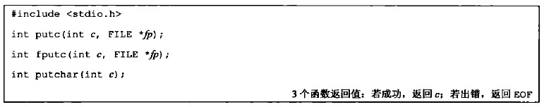 </div>

* 参数：
    * `c`：待写字符转换成的整数值
    * `fp`：文件对象指针

注意：

- `putchar(c)`等价于`putc(c,stdout)`。它向标准输出中写一个字符
- `putc`和`fputc`的区别在于：`putc`可能通过宏定义来实现，而`fputc`不能实现为宏

#### 5）每次读一行

<div align="center"> 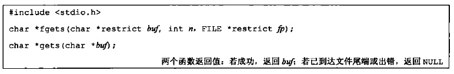 </div>

* 参数：
    * `buf`：存放读取到的字符的缓冲区地址
    * `n`：缓冲区长度
    * `fp`：文件对象指针

注意：

- 对于`fgets`函数，必须指定缓冲区的长度`n`。该函数一直读到下一个换行符为止，但是不超过`n-1`个字符
    - 无论读到多少个字符，缓冲区一定以`null`字节结尾
    - 若某一行包括换行符超过 `n-1`个字节，则`fgets`只返回一个不完整的行；下次调用`fgets`会继续读该行
- 对于`gets`函数，从标准输入总读取字符。由于无法指定缓冲区的长度，因此很可能造成缓冲区溢出漏洞，故该函数不推荐使用。gets与fgets的另一个区别是：gets并不将换行符存入缓冲区中
- 对于发生错误和读到末尾，都是返回`NULL`

#### 6）每次写一行

<div align="center"> 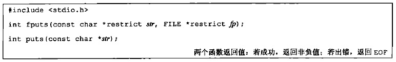 </div>

* 参数：
    * `str`：待写的字符串
    * `fp`：文件对象指针

注意：

- `fputs`和`puts`都是将一个以`null`字节终止的字符串写到流中，末尾的`null`字符不写出！<font color='red'>字符串不要求以换行符结尾！</font>
- `puts`将字符串写到标准输出，末尾的`null`字符不写出！<font color='red'>但是`puts`随后又将一个换行符写到标准输出中！</font>而`fputs`不会自动添加换行符（虽然`puts`不像`gets`那样不安全，但是我们也是要避免使用它，以免要记住它在最后是否添加了一个换行符）

#### 7）二进制I/O

<div align="center"> 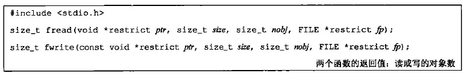 </div>

* 参数：
    * `ptr`:存放二进制数据对象的缓冲区地址
    * `size`：单个二进制数据对象的字节数（比如一个`struct`的大小）
    * `nobj`：二进制数据对象的数量
    * `fp`：打开的文件对象指针
* 返回值：
    * 成功或失败： 读/写的对象数
        * 对于读：如果出错或者到达文件尾端，则此数字可以少于`nobj`。此时应调用`ferror`或者`feof`来判断究竟是那种情况
        * 对于写：如果返回值少于`nobj`，则出错

使用二进制I/O的基本问题是：它只能用在读取同一个操作系统上已写的数据。如果跨操作系统读写，则很可能工作异常。因为：

* 同一个`struct`，可能在不同操作系统或者不同编译系统中，成员的偏移量不同
* 存储多字节整数和浮点数的二进制格式在不同的操作系统中可能不同

### 4.4 定位流

有3种方法定位标准I/O流：

1. `ftell`、`fseek`：它们都假定文件的位置可以存放在一个长整形中
2. `ftello`、`fseeko`：使文件偏移量可以不必一定使用长整型，使用off_t数据类型代替了长整型
3. `fgetpos`、`fsetpos`：由ISO C引入，使用一个抽象数据类型fpos_t记录文件位置。这种数据类型可以根据需要定义一个足够大的数，用以记录文件位置

> 需要移植到非UNIX系统上运行的应用程序应该使用`fgetpos`和`fsetpos`

#### 1）ftell与fseek

<div align="center">  </div>

* 对于二进制文件
    - 其文件位置指示器是从文件起始位置开始度量，并以字节为度量单位
    - `ftell`用于二进制文件时，返回这种字节位置
    - `fseek`可以定位位置，whence与[lseek中的whence相同](#24-定位读写位置)
* 对于文本文件
    - 它们的文件位置可能不以简单的字节偏移量来度量。因为在非Unix系统中，它们可能以不同的格式存放文本文件
    - 为了定位文本文件，whence一定要是SEEK_SET，而且offset只能是0或是对该文件的ftell所返回的值

rewind函数也可以将一个流设置到文件的起始位置

#### 2）ftello与fseeko

<div align="center"> 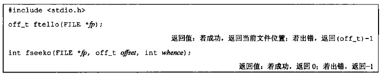 </div>

除了偏移量的类型是off_t而非long，`ftello`函数与`ftell`相同，`fseeko`函数与`fseek`相同

#### 3）fgetpos与fsetpos

<div align="center"> 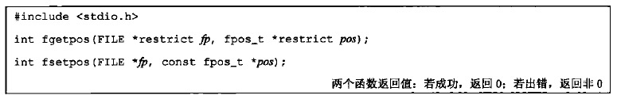 </div>

`fgetpos`和`fsetpos`都是ISO C标准引入的

`fgetpos`将文件位置指示器的当前值存入由pos指向的对象中，在以后调用`fsetpos`时，可以使用此值将流重新定位至该位置

### 4.5 格式化I/O

#### 1）格式化输出

<div align="center"> 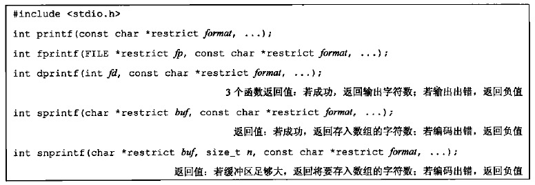 </div>

* `printf` 将格式化数据写到标准输出
* `fprintf` 写至指定的流
* `dprintf` 写至指定的文件描述符。使用该函数不需要调用fdopen将文件描述符转换为文件指针（fprintf需要）
* `sprintf` 将格式化的字符送入数组buf中，并自动在该数组尾端加一个null字节，但该字符不包括在返回值中
* `snprintf` sprintf可能会造成buf指向的缓冲区溢出，snprintf的参数`n`指明了缓冲区长度，超过缓冲区尾端写的所有字符都被丢弃，因此可以解决缓冲区溢出问题

**格式说明的格式**：`%[flags][fldwidth][precision][lenmodifier]convtype`

* 标志(flags)

<div align="center"> 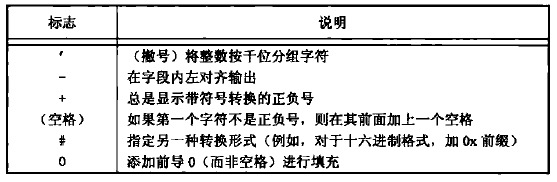 </div>

* 最小字段宽(fldwidth)
    - 说明最小字段宽度
    - 转换后参数字符如果小于宽度，则多余字符位置用空格填充
    - 字段宽度是一个非负十进制数，或者是一个星号 `*`
* 精度(precision)
    - 说明整型转换后最少输出数字位数
    - 说明浮点数转换后小数点后的最少位数
    - 说明字符串转换后最大字节数
    - 精度是一个点`.`后跟随一个可选的非负十进制数或者一个星号`*`
* 参数长度(lenmodifier)

<div align="center"> 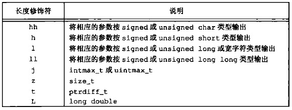 </div>

* 转换类型(convtype)

<div align="center"> 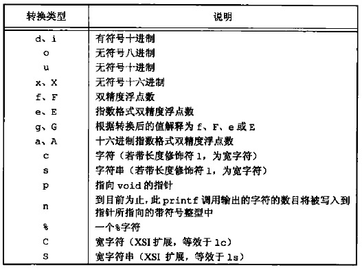 </div>

#### 2）格式化输出

<div align="center"> 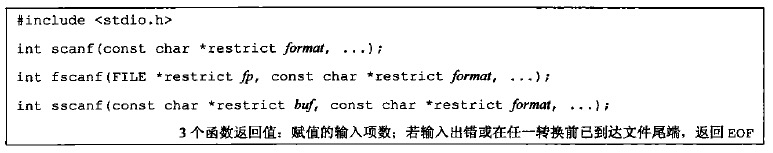 </div>

`scanf`族用于分析输入字符串，将字符序列转换成指定类型的变量。在格式之后的各参数中包含了变量的地址，用转换结果对这些变量赋值

除了转换说明和空白字符以外，格式字符串中的其他字符必须与输入匹配。如有一个字符不匹配，则停止后续处理，不再读输入的其余部分

**转换说明的格式**：`%[*][fldwidth][m][lenmodifier]convtype`

* `*`：用于抑制转换。按照转换说明的其余部分对输入进行转换，但是转换结果不存放在参数中
* `fldwidth`：说明最大宽度，即最大字符数
* `lenmodifier`：说明要转换结果赋值的参数大小。见前述说明
* `convtype`：类似于printf族的转换类型字段。但是稍有区别：输入中的带符号的数值可以赋给无符号类型的变量
* `m`：赋值分配符。用于强迫内存分配。当`%c,%s`时，如果指定了`m`，则会自动分配内存来容纳转换的字符串。同时该内存的地址会赋给指针类型的变量（即要求对应的参数必须是指针的地址）。同时要求程序员负责释放该缓冲区（通过`free`函数）

### 4.6 获取流相应的文件描述符

<div align="center"> 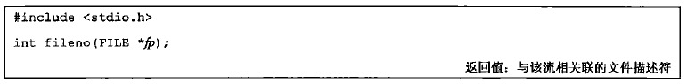 </div>

如果要调用dup或fcntl等函数，则需要此函数

> `fileno`不是ISO C标准部分，而是POSIX.1支持的扩展

### 4.7 创建临时文件

ISO C标准I/O库提供了2个函数以帮助创建临时文件

<div align="center"> 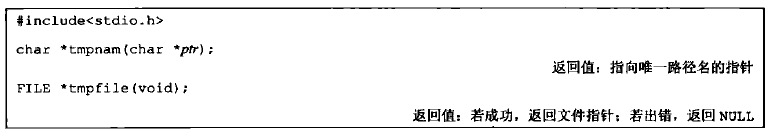 </div>

* `tmpnam` 产生一个与现有文件名不同的一个有效路径名字符串，每次调用都产生一个不同路径名。最多调用`TMP_MAX`次，定义在`<stdio.h>`中
    - `ptr`：指向存放临时文件名的缓冲区的指针
        + 若为NULL，则产生的路径名存放在一个静态区中，指向该静态区的指针作为函数值返回（下次再调用tmpnam时，会重写该静态区）
        + 如果为非NULL，则认为它指向长度至少为`L_tmpnam`个字符的数组，产生的路径名存放在该数组中，返回ptr。`L_tmpnam`常量定义在`<stdio.h>`头文件中
* `tmpfile` 创建一个临时二进制文件(类型`wb+`)，在关闭该文件或程序结束时将自动删除这种文件（注意，UNIX对二进制文件不进行区分） 

`tmpfile` 经常使用的标准UNIX技术是先调用`tmpnam`产生一个唯一的路径名，然后，用该路径名创建一个文件，并立即unlink它。对一个文件解除链接并不删除其内容，关闭该文件时才删除其内容。而关闭文件可以是显式的，也可以在程序终止时自动进行

<br>

Single UNIX Specification为处理临时文件定义了另外两个函数：`mkdtemp`和`mkstemp`，它们是XSI的扩展部分：

<div align="center"> 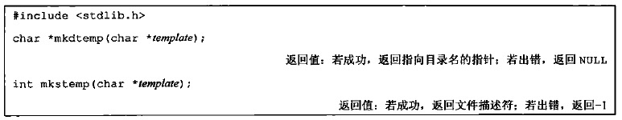 </div>

* `mkdtemp` 创建一个目录，该目录有一个唯一的名字
    - `mkdtemp`函数创建的目录具有权限位集： `S_IRUSR|S_IWUSR|S_IXUSR`。调用进程的文件模式创建屏蔽字可以进一步限制这些权限
    - `mkstemp`函数返回的文件描述符以读写方式打开。它创建的文件用访问权限位：`S_IRUSR|S_IWUSR`
* `mkstemp` 创建一个文件，该文件有一个唯一的名字
    - 与`tmpfile`不同，`mkstemp`创建的临时文件并不会自动删除。如果希望从文件系统命名空间中删除该文件，必须自己对它接触链接

名字是通过template字符串进行选择的。这个字符串是后6位设置为XXXXXX的路径名。函数将这些占位符替换成不同的字符来构建一个唯一的路径名。如果成功的话，这两个函数将修改template字符串反映临时文件名

<br>

## 5.内存流

**内存流**：一种标准IO流，虽然它通过 `FILE`指针来访问，但是并没有底层的文件 。所有的IO都是通过在缓冲区和主存之间来回传送字节来完成。虽然它看起来像是文件流，但是更适用于字符串操作

<div align="center"> 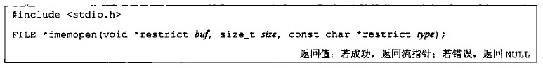 </div>

* 参数：
    + `buf`：内存流缓冲区的起始地址
    + `size`：内存流缓冲区的大小（字节数）
        + 若`buf`为`NULL`时，则函数负责分配`size`字节的缓冲区，并在流关闭时自动释放分配的缓冲区
    + `type`:控制如何使用流（即打开内存流的方式）

<div align="center"> 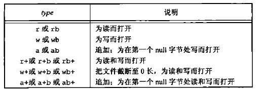 </div>

注意：

- 无论何时以追`a`方式打开内存流时，当前文件位置设为缓冲区中第一个`null`字节处。
    - 若缓冲区中不存在`null`字节，则当前位置设为缓冲结尾的后一个字节
- 当内存流不是`a`方式打开时，当前位置设置为缓冲区的开始位置
- 如果`buf`是`null`，则打开流进行读或者写都没有任何意义。因为此时缓冲区是通过`fmemopen`分配的，没办法找到缓冲区的地址。
- 任何时候需要增加流缓冲区中数据流以及调用`fclose、fflush、fseek、fseeko、fsetpos`时都会在当前位置写入一个`null`字节

<br>

创建内存流的其他两个函数：

<div align="center">  </div>

* 参数：
    + `bufp`：指向缓冲区地址的指针（用于返回缓冲区地址）
    + `sizep`:指向缓冲区大小的指针（用于返回缓冲区大小）

`open_memstream` 创建的流是面向字节的，`open_wmemstream` 创建的流是面向宽字节的

这两个函数与`fmemopen`的不同在于：

- 创建的流只能写打开
- 缓冲区由函数自动创建，不能指定自己的缓冲区
- 关闭流后需要程序员释放缓冲区
- 对流添加字节会增加缓冲区大小

在缓冲区地址和大小使用上要遵守规则：

- 缓冲区地址和长度只有在调用`fclose`或者`fflush`后才有效
- 这些值只有在下一次写入或者调用`fclose`之前才有效。因为缓冲区可能增长，也可能需要重新分配

> 因为避免了缓冲区溢出，内存流非常适用于创建字符串。因为内存流只访问主存，不访问磁盘上的文件，所以对于把标准I/O流作为参数用于临时文件的函数来说，会有很大的性能提升

<br>
<br>

# 四.进程环境

## 1.进程的启动与终止

<div align="center">  </div>

### 1.1 main函数

C程序总是从`main`函数开始执行的。`main`函数的原型是：

```
int main(int argc,char* argv[]);
```

* 参数：
    * `argc`：命令行参数的数目（ISO C和POSIX.1都要求argv\[argc\]是一个空指针）
    * `argv`：由指向各命令行参数的指针所组成的数组。`ISOC`和`POSIX`都要求`argv[argc]`是一个空指针

当内核通过`exec`函数执行 C 程序、在调用`main`之前先调用一个特殊的启动例程

* 可执行程序文件将此启动例程指定为程序的其实地址（这是由链接器设置的，而链接器由C编译器调用）
* 启动例程从内核取得命令行参数和环境变量值，为调用`main`函数做好安排

启动例程使得从main返回后立即调用exit函数。如果将启动例程以C代码形式表示（实际上该例程常常以汇编语言编写），则它调用main函数的形式可能是：

```c
exit(main(argc,argv));
```

### 1.2 进程终止的方式

有 8 种方式使得进程终止，其中 5 种为正常终止，3 种异常终止：

- **正常终止方式**：
    - 从`main`函数返回
    - 调用`exit`函数
    - 调用`_exit`函数或者`_Exit`函数
    - 多线程的程序中，最后一个线程从其启动例程返回
    - 多线程的程序中，从最后一个线程调用`pthread_exit`函数
- **异常终止方式**：
    - 调用`abort`函数
    - 接收到一个信号
    - 多线程的程序中，最后一个线程对取消请求作出响应

### 1.3 终止函数

下列3个函数正常终止一个程序

<div align="center"> 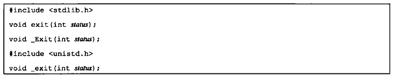 </div>

* 参数：
    * `status`：终止状态

三个终止函数的区别：

- `_exit`和`_Exit`函数：立即进入内核
- `exit`函数：先执行一些清理处理，然后进入内核

> `exit`和`_Exit`是由 ISO C 说明的， `_exit`是由 POSIX 说明的 ，因此头文件不同

### 1.4 终止状态

`exit`、`exit`、`_Exit` 都带有一个整型参数，称为终止状态（或称作退出状态）。大多数 UNIX 系统 shell 都提供检查进程终止状态的方法：

* 下列情况，进程的**终止状态是未定义**的：
    + 若调用`exit`、`exit`、`_Exit`时不带终止状态
    + 若`main`执行了一个无返回值的`return`语句
    + 若`main`没有声明返回类型为整型
* 下列情况，进程的**终止状态是0**： 
    + 若`main`声明返回类型为整型，并且`main`执行到最后一条语句时返回（隐式返回）

`main`函数返回一个整型值与用该值调用`exit`是等价的：

```
main 函数中: exit(100); 

等价于

return 100;
```

> 在LINUX中，退出状态码最高是255，一般自定义的代码值为0~255，如果超出255，则返回取模后的值

### 1.5 登记终止处理程序

<div align="center">  </div>

* 参数：
    * `func`：函数指针。它指向的函数的原型是：返回值为`void`，参数为`void`

按照ISO C的规定，一个进程可以登记最多32个函数（通常操作系统会提供多于32个的限制。可以用`sysconf`函数查询这个限制值），这些函数将由`exit`函数自动调用。这些函数称作**终止处理程序**

* `exit`调用这些终止处理程序的顺序与它们登记的时候顺序相反
* 如果同一个终止处理程序被登记多次，则它也会被调用多次

## 2.环境表

每个程序都会接收一张**环境表**

- 与参数表一样，环境表也是一个字符指针数组
    - 其中数组中的每个指针指向一个以`null`结束的 C 字符串，这些字符串称之为环境字符串
    - 数组的最后一项是`null`
- 全局变量`envrion`包含了该指针数组的地址：`extern char **envrion`。我们称`environ`为环境指针，它位于头文件`unistd.h`中
- 按照惯例，环境字符串由`name=value`这种格式的字符串组成

<div align="center">  </div>

> 环境表和环境字符串通常存放在进程存储空间的顶部（栈的上方）

### 2.1 获取环境变量

`getenv`由`ISO C`定义，可以用其获取环境变量值

<div align="center">  </div>

下图为一些环境变量和在不同系统上的支持情况：

<div align="center"> 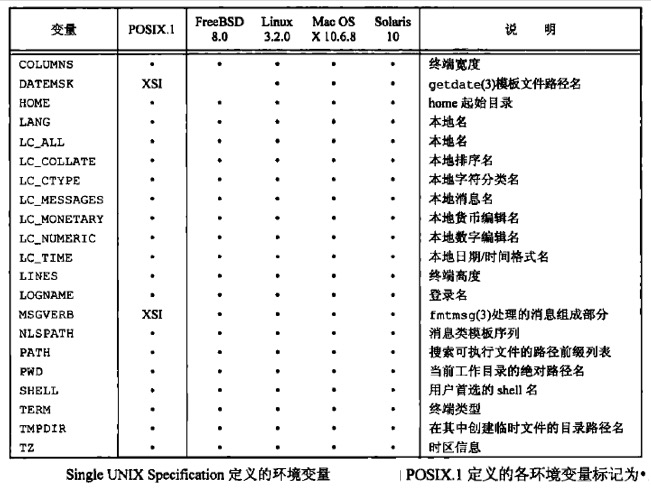 </div>

### 2.2 修改环境变量

并不是所有系统都支持修改环境变量：

<div align="center"> 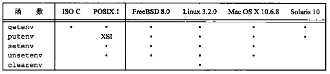 </div>

中间3个函数的原型如下：

<div align="center"> 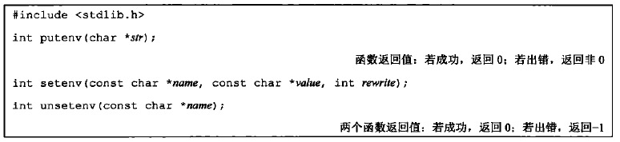 </div>

* `putenv` ：添加环境变量，将其放入环境表中。`str`为`name=value`形式的环境变量。如果已经存在，则先删除原有的定义
* `setenv` ：修改环境变量。如果环境变量已经存在，有下列2种可能：
    - 若`rewrite`非0，则先删除其现有定义，然后添加新定义
    - 若`rewrite`为0，则不删除其现有定义，并且不将`name`修改为新值`value`，而且也不出错
* `unsetenv` ：删除环境变量，即删除`name`的定义。即使不存在这种定义也不算出错

这些函数内部操作环境表非常复杂，下面是原理：

- **修改**：
    - 如果新的`value`长度少于或等于现有`value`的长度，则只需要将新字符串复制到原字符串所用的空间即可
    - 如果新的`value`长度大于现有`value`的长度，则必须调用`malloc`为新字符串分配空间，然后将新字符串复制到该空间，接着使环境表中对`name`的指针指向新分配区并释放旧分配区
- **增加**：
    - 如果这是第一次增加一个新的`name`：
        - 则必须调用`malloc`为新指针表分配空间
        - 然后将原来的环境表复制到新分配区
        - 并将新的`name=value`字符串的指针存放到该指针表的表尾，
        - 然后将一个空指针存放在其后
        - 然后使`environ`指向新指针表
        - 最后释放旧的指针表
    - 如果这不是第一次增加一个新的`name`，则可知以前已经调用了`malloc`：
        - 则只需要调用`realloc`，以分配比原空间多存放一个指针的空间
        - 并将新的`name=value`字符串的指针存放到该指针表的表尾，
        - 然后将一个空指针存放在其后
- **删除**：
    - 则只需要先在环境表中找到该指针，然后将所有的后续指针都向环境表的首部依次顺序移动一个位置即可

> 修改和增加复杂的原因在于：环境表和环境字符串通常占用的是进程地址空间的顶部，所以它不能再向高地址方向扩展；同时也不能移动在它之下的各栈帧，所以也不能向低地址方向扩展。两者组合使得该空间的长度不能再增加

<br>

## 3.C程序的存储空间布局

<div align="center"> 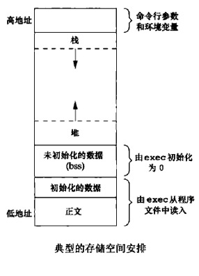 </div>

* **正文段**：这是由CPU执行的机器指令部分
    * 通常正文段是可以共享的。一个程序的可以同时执行`N`次，但是该程序的正文段在内存中只需要有一份而不是`N`份
    * 通常正文段是只读的，以防止程序由于意外而修改其指令
* **初始化数据段**：通常将它称作数据段
    * 它包含了程序中明确地赋了初值的变量：包括函数外的赋初值的全局变量、函数内的赋初值的静态变量
* **未初始化数据段**：通常将它称作`bss`段。在程序开始执行之前，内核将此段中的数据初始化为0或者空指针
    * 它包含了程序中未赋初值的变量：包括函数外的未赋初值的全局变量、函数内的未赋初值的静态变量
* **栈**：临时变量以及每次函数调用时所需要保存的信息都存放在此段中
    * 每次函数调用时，函数返回地址以及调用者的环境信息（如某些CPU 寄存器的值）都存放在栈中
    * 最新的正被执行的函数，在栈上为其临时变量分配存储空间（通过这种方式使用栈，C 递归函数可以工作。递归函数每次调用自身时，就创建一个新的栈帧，因此某一次函数调用中的变量不影响下一次调用中的变量）
* **堆**：通常在堆中进行动态存储分配
    * 由于历史习惯，堆位于未初始化数据段和栈段之间

注意：

1. 栈从高地址向低地址增长。堆顶和栈顶之间未使用的虚拟地址空间很大
2. 未初始化数据段的内容并不存放在磁盘程序文件中。需要**存放在磁盘文件中**的段只有**正文段**和**初始化数据段**（`size a.out`令可以查看程序的正文段、数据段 和`bss`段长度）

<br>

## 4.共享库

大多数UNIX系统支持共享库

* 共享库的优点
    - 使得可执行文件中不再需要包含公用的库函数，而只需在所有进程都可引用的存储区中保存这种库例程的一个副本。程序第一次执行或者第一次调用某个库函数时，用动态链接方法将程序与共享库函数相链接，减少了每个可执行文件的长度
    - 可以用库函数的新版本代替老版本而无需对使用该库的程序重新链接编辑（假定参数的数目和类型都没有改变）
* 共享库的缺点
    - 动态链接增加了一些运行时开销。这种时间开销发生在该程序第一次被执行时，或者每个共享库函数第一次被调用时

不同系统中，程序可能使用不同的方法说明是否要使用共享库。比较典型的有`cc(1)`：

```c
//以下阻止使用共享库
gcc -static hello1.c
//以下，gcc默认使用共享库
gcc hello1.c
```

可以使用`size a.out`观察上面两种情况下可执行文件正文和数据段的长度变化

<br>

## 5.存储空间分配

<div align="center"> 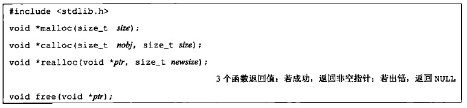 </div>

* `malloc` ：分配指定字节数的存储区。存储区中的初始值不确定
* `calloc` ：为指定数量指定长度的对象分配存储空间。空间中的每一位都初始化为0
* `realloc` ：增加或减少以前分配区的长度
    - 当增加长度时，可能需将以前分配区的内容移到另外一个足够大的区域，以便在尾端提供增加的存储区，而新增区域内的初始值则不确定
    - 函数调用前后可用是不同的存储区，所有调用前不应该有指针指向这段存储区，不然修改后，可能该指针会非法访问
    - 应该使用另一个指针保存`realloc`的返回值，因为如果使用传入的实参保存返回值，那么一旦`realloc`失败，则会传回NULL，原来的动态内存区再也无法访问，从而发生内存泄露
* `free` ：上述3个函数都需通过free释放，被释放的空间通常被送入可用存储区池，以便以后利用

**这3个分配函数所返回的指针一定是适当对齐的，使其可用于任何数据对象**

这些分配例程通常用`sbrk(2)`系统调用实现

* `sbrk`可以扩充或缩小进程的存储空间。但是大多数malloc和free的实现都不减小进程的存储空间：释放的空间可供以后再分配，但将它们保持在malloc池中而不返回给内核
* 大多数实现所分配的存储空间要比所要求的稍大一些，额外的空间用来记录管理信息，比如分配块的长度、指向下一个分配块的指针等等（如果在一个动态分配区的尾部之后或者在起始位置之前写操作会修改另一块的管理记录信息。这种类型的错误是灾难性的，但是由于这种错误不会立即暴露出来，因此很难被发现）
* `malloc`和`free`相关的致命性错误
    - 调用了`malloc`函数但是没有调用`free`函数：会发生内存泄漏，该进程占用的存储空间就会连续增加，直到不再有空闲空间。此时过度的换页开销会导致性能下降
    - free一个已经释放了的块
    - 调用free时所用的指针不是3个alloc函数的返回值

<br>

## 6.进程资源限制

每个进程都有一组资源限制，其中一些可以用getrlimit和setrlimit函数查询和更改：

<div align="center"> 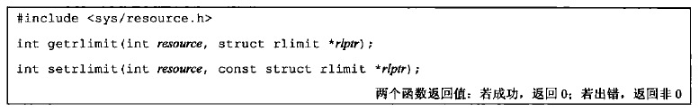 </div>

> 进程的资源限制通常是在系统初始化时由0进程建立的，然后由后续进程继承。每种实现都可以用自己的方法对资源限制做出调整

* 参数
    - `resource`：相应的资源。可以设置为下列值（不同系统支持不同）：
        + `RLIMIT_AS`：进程总的可用存储空间的最大长度(字节)（这会影响到`sbrk`函数和`mmap`函数）
        + `RLIMIT_CORE`：`core`文件的最大字节数。如果为0，则阻止创建`core`文件
        + `RLIMIT_CPU`：CPU时间的最大量值（秒），如果超过此软限制时，向该进程发送`SIGXCPU`信号
        + `RLIMIT_DATA`：数据段的最大字节长度（包括初始化数据、非初始以及堆的总和）
        + `RLIMIT_FSIZE`：可以创建的文件的最大字节长度。当超过此软限制时，向该进程发送`SIGXFSX`信号
        + `RLIMIT_MEMLOCK`：一个进程使用`mlock`能够锁定在存储空间中的最大字节长度
        + `RLIMIT_MSGQUEUE`：进程为`POSIX`消息队列可分配的最大存储字节数
        + `RLIMIT_NICE`：为了影响进程的调度优先级，`nice`值可设置的最大限制
        + `RLIMIT_NOFILE`：每个进程能打开的最多文件数。更改此限制将影响到`sysconf`函数在参数`_SC_OPEN_MAX`中返回的值
        + `RLIMIT_NPROC`：每个实际用户`ID`可以拥有的最大子进程数。更改此限制将影响到`sysconf`函数在参数`_SC_CHILD_MAX`中返回的值
        + `RLIMIT_RSS`：最大驻内存集字节长度
        + `RLIMIT_SIGPENDING`：一个进程可排队的信号的最大数量。这个限制是`sigqueue`函数实施的
        + `RLIMIT_STACK`：栈的最大字节长度
    <div align="center"> 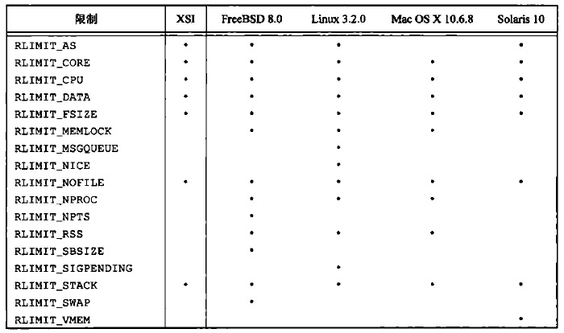 </div>
    
    - `rlptr`：包含该资源软限制和硬限制的结构体
        + `getrlimit`调用后，这个指针指向的结构中包含了欲获取的相应资源的限制信息
        + `setrlimit`调用时，这个指针指向的结构中包含了欲设置的相应资源的现在信息
            * 任何进程都可将一个软限制值更改为小于或者等于其硬限制值
            * 任何进程都可以降低其硬限制值，但是它必须大于或者等于其软限制值（这种降低，对普通用户而言不可逆，因为普通用户不可提高其硬限制值）
            * 只有超级用户进程才能够提高其硬限制值

```c
struct rlimit{
    rlim_t rlim_cur;    /* soft limit: current limit */
    rlim_t rlim_max;    /* hard limit: maximum value for rlim_cur */
};
```

**资源限制影响到调用进程并由其子进程继承**

<br>
<br>

# 五.进程控制

## 1.进程标识

进程通过进程ID进行标识

进程ID可以复用。大多数UNIX系统实现延迟复用算法，使得赋予新建进程的ID不同于最近终止进程所使用的ID，从而防止新进程被认为是使用同一ID的某个已终止进程

### 1.1 2个特殊进程

* **0号进程：调度进程(也被称为系统进程或交换进程)**
    - **性质**：内核的一部分，并不执行任何磁盘上的程序
* **1号进程：init进程**
    - **性质**：普通进程，但以超级用户特权运行。程序文件在早期版本中是`/etc/init`，新版本中是`/sbin/init`
    - **启动时机**：在自举（自举是什么鬼？）过程结束时由内核调用
    - **职责**：
        + 读取与系统有关的初始化文件，并将系统引导到一个状态（如多用户）
        + 成为所有孤儿进程的父进程
        + ...

### 1.2 进程相关的ID获取函数

<div align="center"> 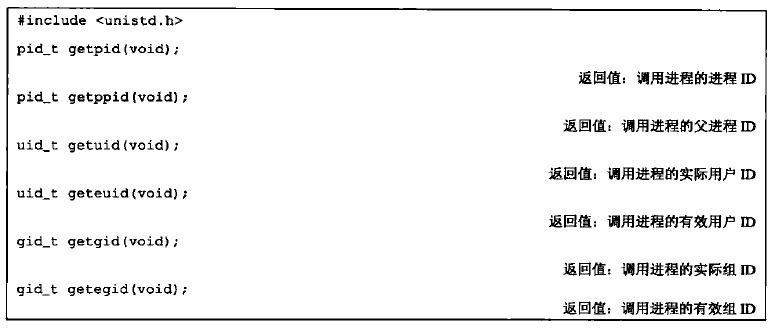 </div>

这些函数都没有出错返回

<br>

## 2.进程的创建

下列函数可以用来创建进程：

* [fork](#21-fork)
* [vfork](#22-vfork)（fork 4种变体的一种，另外3种支持的平台不多）

### 2.1 fork

<div align="center">  </div>

* 返回值：
    - **父进程返回子进程ID**：原因是，一个进程的子进程可以有多个，并且没有一个函数使一个进程可以获得其所有子进程的进程ID
    - **子进程返回0**：原因是，子进程总是可以调用`getppid`获得父进程的ID（0号进程总是由内核交换进程使用，所以一个子进程的进程ID不可能为0）

**子进程和父进程继续执行fork调用之后的指令**

#### 1）执行顺序

一般来说，fork后父子进程谁先执行是不确定的，取决于内核所用的调度算法

#### 2）数据共享

因为fork之后经常跟随着`exec`，所以很多实现中，子进程的**数据段**、**堆**和**栈**指向相应的父进程版本，因此父子进程共享使用，如果子进程有修改，会执行**写时复制**(**COW**)（通常将修改所在的一”页“进行复制）。从而不会影响父进程

* 注意父子进程之间**I/O缓冲区**的复制：
    + 文件I/O中write不带缓冲
    + 标准I/O库带缓冲。因此要特别注意父子进程间缓冲区的复制
* 注意父子进程的**文件描述符**：
    - **在重定向父进程的标准输出时，子进程的标准输出也会被重定向**
    + `fork`的一个特性是父进程的所有打开文件描述符都被”复制“（就好像执行了dup函数）到子进程中，**父子进程每个相同的打开描述符共享一个文件表项**（故**父子进程共享同一个文件偏移量**
    ）
    <div align="center"> 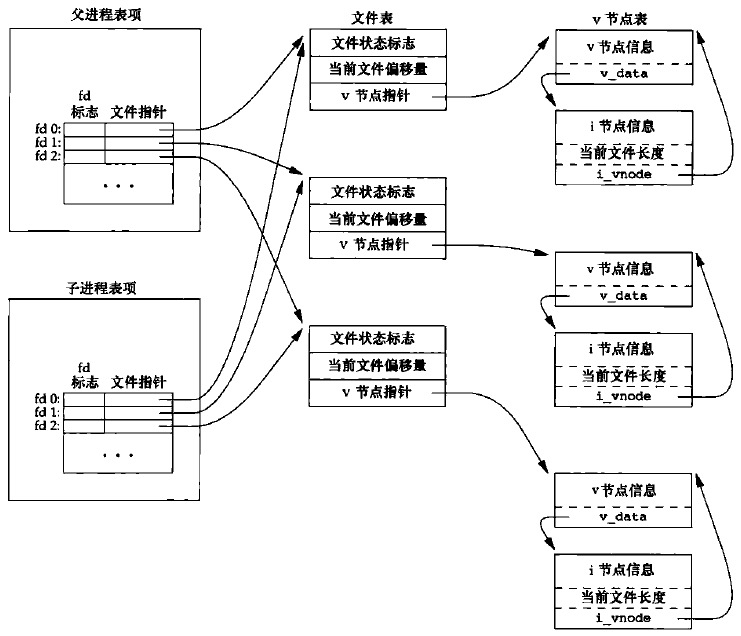 </div>

一个进程fork了一个子进程，然后等待子进程终止。假定，作为普通处理的一部分，父进程和子进程都向标准输出进行写操作。如果父进程的标准输出已重定向，那么子进程写到该标准输出时，它将更新与父进程共享的该文件的偏移量

除了打开的文件描述符之外，**子进程还继承了父进程的下列属性**：

+ 实际用户`ID`
+ 实际组`ID`
+ 有效用户`ID`
+ 有效组`ID`
+ 附属组`ID`
+ 进程组`ID`
+ 会话`ID`
+ 控制终端
+ 设置用户`ID`标志和设置组`ID`标志
+ 当前工作目录
+ 根目录
+ 文件模式创建屏蔽字
+ 信号屏蔽和信号处理
+ 对任一打开文件描述符的执行时关闭标志
+ 环境
+ 连接的共享存储段
+ 存储映像
+ 资源限制

**父子进程的区别**为：

- `fork`返回值不同
- 进程`ID`不同
- 进程父进程`ID`不同
- 子进程的`tms_utime,tms_stime,tms_cutime,tms_ustime`的值设置为0
- 子进程不继承父进程设置的文件锁
- 子进程的未处理闹钟被清除
- 子进程的未处理信号集设置为空集

#### 3）fork失败的主要原因

* 系统已经有了太多的进程
* 实际用户的进程总数超过了系统的限制（`CHILD_MAX`规定了每个实际用户在任一时刻拥有的最大进程数）

#### 4）fork的2种用法

1. 父进程希望复制自己，使父进程和子进程同时执行不同的代码段（在网络服务中很常见：父进程等待请求，然后调用`fork`并使子进程处理请求）
2. 父进程要执行一个不同的程序（在shell是很常见。此时子进程从`fork`返回之后立即调用`exec`）

### 2.2 vfork

vfork用于创建一个新进程，该新进程的目的是exec一个新程序，因此子进程并不将父进程的地址空间完全复制到子进程中

在子进程调用exec或exit之前，它在父进程的空间中运行。这种优化在某些UNIX系统的实现中提高了效率，但如果子进程修改数据、进程函数调用、或者没有调用exec或exit就返回都可能会带来未知的结果

`vfork`和`fork`之间的另一个区别是：**`vfork`保证子进程先运行**，在它调用exec或exit之后父进程才可能被调度运行（如果在调用这两个函数之前子进程依赖于父进程的进一步动作，则会导致死锁）

```c++
int globval =6;

int main(int argc,char ** argv) {
    int val;
    pid_t pid;
    val = 88;
    printf("before vfork\n");
    if ((pid = vfork()) < 0) {
        exit(1);
    } else if (pid == 0) {
        globval++;
        val++;
        _exit(0); //_exit并不执行标准I/O缓冲区的冲洗操作，如果调用的是exit，输出是不确定的
    }
    printf("pid=%ld,glob=%d,val=%d\n", (long) getpid(), globval, val);
    exit(0);
}
```

上述程序子进程会修改父进程地址空间中的数据，子进程修改变量后即退出，以下为父进程的输出：

```
before vfork
pid=30595,glob=7,val=89
```

<br>

## 3.进程的终止

[8种终止方式](#12-进程终止的方式)

不管进程如何终止，最后都会执行内核中的同一段代码。这段代码为相应进程关闭所有打开描述符，释放它所使用的存储器等

### 3.1 子进程向父进程传递状态

* **子进程正常终止**：子进程将其退出状态作为参数传给`exit`、`_exit`、`_Exit`
* **子进程异常终止**：内核会产生一个指示子进程异常终止原因的终止状态

不管正常终止或异常终止，内核都向父进程发送`SIGCHLD`信号，父进程可以选择忽略该信号(**默认动作**)，或者提供一个信号处理函数

父进程能通过`wait`、`waitpid`获取子进程的终止状态

<div align="center"> 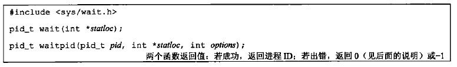 </div>

* 参数
    - `statloc`：如果关心终止状态就传入一个int变量的地址，终止状态将存于其中；不关心终止状态可以设为NULL。该整形状态字是由实现定义的：
        + 某些位表示退出状态（正常返回）
        + 某些位指示信号编号（异常返回）
        + 有一位指示是否产生了core文件
    可以使用POSIX.1规定，终止状态用定义在`<sys/wait.h>`中的宏来查看，下图4个互斥的宏可用来取得进程终止的原因。基于这4个宏中哪一个值为真，就可选用其它宏来取得退出状态，信号编号等：
    <div align="center"> 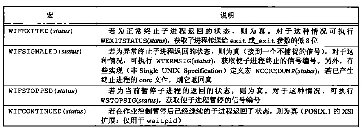 </div>

    - `pid`：`waitpid`可以指定等待哪个子进程终止，`wait`无法指定（`wait`和`waitpid`的区别）
        + `-1`：等待任一子进程，这种情况下与`wait`等效
        + `>0`：等待进程ID与pid相等的子进程
        + `0`：等待组ID等于调用进程组ID的任一子进程
        + `<-1`：等待组ID等于pid绝对值的任一子进程
    - `options`：`waitpid`可以通过该参数时调用不阻塞（`wait`和`waitpid`的区别）。可以为0，也可以是下图按位或运算的结果：
    <div align="center">  </div>

父进程调用`wait`、`waitpid`时可能出现几种情况：

- 如果所有子进程都还在运行，则阻塞
- 如果一个子进程已终止，正等待父进程获取其终止状态，则取得子进程的终止状态立即返回
- 如果没有任何子进程，则出错返回
- 对于`waitpid`，如果指定的进程或进程组不存在，或参数`pid`指定的进程不是调用进程的子进程，都可能出错

### 3.2 父子进程以不同顺序终止

* **父进程在子进程之前终止**：该进程的所有子进程会变成**孤儿进程**，这些孤儿进程会被init进程收养，作为新的父进程（过程大致是：在一个进程终止时，内核逐个检查所有活动进程，以判断它是否是正要终止进程的子进程，如果是，则该进程的父进程ID就更改为1）
* **子进程在父进程之前终止**：无法确保子进程终止时，父进程已经准备好了检查其终止状态。因此内核为每个终止子进程保存了一定量的信息。当父进程调用`wait`或`waitpid`时，可以得到这些信息。这些信息至少包括进程ID、进程的终止状态、进程使用的CPU时间总量。在父进程调用`wait`或`waitpid`之前，终止子进程被称为**僵死进程**（init的子进程终止时，init就会调用一个`wait`函数取得其终止状态）

<br>

## 4.竞争条件

**竞争条件是多个进程企图对共享数据进程某种处理，最终结果取决于进程运行的顺序**

如果fork之后的某种逻辑显示或隐式地依赖于在fork之后是父进程先运行还是子进程先运行，那么fork就会是竞争条件活跃的滋生地

防止竞争条件最简单的手段：

* 父进程可以通过`wait`等待子进程先运行完
* 子进程可以通过下列方式等待父进程先运行结束
    ```
    while(getppid() != 1)
        sleep(1);
    ```
    但是这种轮询方式会大量浪费CPU浪费

好的办法是使用信号进行通信，或者使用IPC

在父进程和子进程的关系中，常常出现下列情况：在fork之后，父进程和子进程都有一些事情要做。例如，，父进程可能要用子进程ID更新日志文件中的一个记录，而子进程则可能要为父进程创建一个文件。在本例中，要求每个进程在执行完它的一套初始化操作后要通知对方，并且在继续运行之前，要等待另一方完成其初始化操作：

```c
TELL_WAIT();    /* set things up for TELL_xxx & WAIT_xxx */
if ( (pid = fork()) < 0 ){
    err_sys("fork error");
} else if(pid == 0){        /* child */
    /* child does whatever is necessary ... */
    TELL_PARENT(getppid());    /* tell parent we're done */
    WAIT_PARENT();             /* and wait for parent */
    /* and the child continues on its way ... */
    exit(0);
}
/* parent does whatever is necessary ... */
TELL_CHILD(pid);    /* tell child we're done */
WAIT_CHILD();       /* and wait for child */
/* and the parent continues on its way ... */
exit(0);
```

## 5.exec函数
## 6.更改用户ID和更改组ID
当进程调用一种`exec`函数时，该进程执行的程序完全替换成新程序，而新程序则从`main`函数开始执行

- 调用`exec`前后，进程`ID`并未改变。因为`exec`并不创建新进程
- `exec`只是用磁盘上的一个新程序替换了当前进程的**正文段**、**数据段****、**堆**和**栈**

有7种不同的`exec`函数可以供使用，它们被统称称作`exec`函数：

<div align="center">  </div>

* **新程序指定方式**
    + **前四个**函数取**路径名**作为参数
    + **后两个**函数取**文件名**作为参数（**函数名中带`p`**）
        * 如果`filename`中包含`/`，则将其视为路径名
        * 否则，按`PATH`环境变量，在它所指定的各目录中搜寻可执行文件
    + **最后一个**取**文件描述符**做参数
* **新程序的命令行参数**
    - **函数名中的`l`**：表示列表。要求将新程序的每个命令行参数都说明为一个单独的参数，这种参数表以空指针结尾
    - **函数名中的`v`**：表示矢量。先构造一个指向各参数的指针数组，然后将该指针数组的地址作为参数
* **新程序的环境变量**
    - **函数名中的`e`**：可以传递一个指向环境字符串指针数组的指针，数组最后一个元素必须是空指针
    - **否则**：使用进程的`environ`变量为新程序复制现有环境

<div align="center">  </div>

7个函数之间的关系如下图：

<div align="center">  </div>

执行`exec`后，进程ID没有改变。新程序从调用进程继承了下列属性：

* 进程ID和父进程ID
* 实际用户ID和实际组ID
* 附属组ID
* 进程组ID
* 会话ID
* 控制终端
* 闹钟尚余留的时间
* 当前工作目录
* 根目录
* 文件模式创建屏蔽字
* 文件锁
* 进程信号屏蔽
* 未处理信号
* 资源限制
* nice值
* tms_utime、tms_stime、tms_cutime以及tms_cstime值

注意：

* 进程中每个打开的文件描述符都有一个执行时关闭标志。若设置了此标志，则执行`exec`时会关闭该文件描述符；否则该文件描述符仍然保持打开。**系统默认行为是不设置执行时关闭标志**
* 进程的 `实际用户ID` 和 `实际组ID` 不变，`有效用户ID` 和 `有效组ID` 是否改变取决于所执行程序文件的`设置用户ID位`和`设置组ID位`位是否设置
    - 1）若新程序的`设置用户ID位`已设置，则`有效用户ID`变成`程序文件所有者的ID`；2）否则`有效用户ID`不变
    - 1）若新程序的`设置组ID位`已设置，则`有效组ID`变成`程序文件所有组的 ID`；2）否则`有效组ID`不变

## 6.更改用户ID和更改组ID

> 用以修改进程的**特权**及**访问控制**

UNIX中，特权及访问控制，是基于用户ID和组ID的

* 当程序需要增加特权，或需要访问当前并不允许访问的资源时，需要更换自己的用户ID或组ID，使得新ID具有合适的特权或访问权限
* 当程序需要降低特权，或阻止对某些资源的访问时，也需要更换用户ID或组ID，新ID不具有相应特权或访问这些资源的能力

<div align="center">  </div>

### 6.1 setuid与setgid

<div align="center">  </div>

* `setuid`：设置`实际用户ID`和`有效用户ID`
* `setgid`：设置`实际组ID`和`有效组ID`

谁能更改ID需要遵循若干规则，以`用户ID`为例（针对`setgid`的讨论类似`setuid`）：

1. 如果**进程具有超级用户特权**，则`setuid`函数将`实际用户ID`，`有效用户ID`以及`保存的设置用户ID`(saved set-user-ID) 全部设置为`uid`（此时`uid`没有限制）
2. 如果**进程没有超级用户特权**，但是`uid`等于`实际用户ID`或者`保存的设置用户ID`，则`setuid`只会将`有效用户ID`设置为`uid`，不改变`实际用户ID`和`保存的设置用户ID`
3. 如果上面两个条件都不满足，则`errno`设置为`EPERM`并返回 -1

上述讨论中，假设`_POSIX_SAVED_IDS`为真。如果未提供此功能，则对于`保存的设置用户ID`部分都无效

操作系统内核为每个进程维护3个`用户ID`：`实际用户ID`、`有效用户ID`、`保存的设置用户ID`：

- **只有超级用户进程可以更改`实际用户ID`**。通常，`实际用户ID`是在用户登录时，由`login(1)`程序设置的，而且绝不会改变它。因为`login`是一个超级用户进程，当它调用`setuid`时，设置所有3个`用户ID`
- **仅当对程序文件设置了`设置用户ID位`时，`exec`函数才设置`有效用户ID`**。如果`设置用户ID位`没有设置，则`exec`函数不会改变`有效用户ID`，而是维持其现有值
    - 任何时候都可以调用`setuid`将`有效用户ID`设置为`实际用户ID`或者`保存的设置用户ID`
    - 调用`setuid`时，`有效用户ID`不能随意取值，只能从`实际用户ID`或者`保存的设置用户ID`中取得
- **`保存的设置用户ID`是由`exec`复制`有效用户ID`而得到**。如果设置了文件的`设置用户ID位`，则`exec`根据文件的`用户ID`设置了进程的`有效用户ID`之后，这个副本就保存起来

下图总结了更改这3个`用户ID`的不同方法：

<div align="center">  </div>

目前可以通过`getuid`获取进程的当前`实际用户ID`，可以通过`geteuid`获取进程的当前`有效用户ID`，但是没有函数获取进程当前的`保存的设置用户ID`

### 6.2 setreuid和setregid

历史上，BSD支持setreuid函数，其功能是交换`实际用户ID`和`有效用户ID`的值

<div align="center">  </div>

若其中任一参数为-1，则表示相应的ID应当保持不变

**一个非特权用户总能交换`实际用户ID`和`有效用户ID`**（这就允许一个设置用户ID程序交换用户的普通权限，以后又再次交换回设置用户ID权限。POSIX.1引进了保存的设置用户ID特性后，其规则也相应加强，它允许一个非特权用户将其有效用户ID设置为保存的设置用户ID）

### 6.3 seteuid和setegid

POSIX.1提供下列2个函数，类似于`setuid`和`setgid`，但是他们只更改`有效ID`，不更改`实际ID`：

<div align="center">  </div>

* 一个**非特权用户**可将其`有效用户ID`设置为其`实际用户ID`或其`保存的设置用户ID`
* 一个**特权用户**则可将`有效用户ID`设置为`uid`

<br>
<br>

# 六.进程关系

<br>
<br>

# 七.信号

<br>
<br>

# 八.线程

<br>
<br>

# 九.线程控制

<br>
<br>

# 十.进程间通信

<br>
<br>