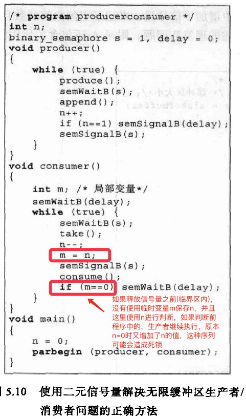

<!-- GFM-TOC -->
* [第一章.计算机系统概述](#第一章计算机系统概述)
    * [1.基本构成](#1基本构成)
    * [2.指令的执行](#2指令的执行)
    * [3.中断](#3中断)
        * [3.1 目的](#31-目的)
        * [3.2 类型](#32-类型)
        * [3.3 中断控制流](#33-中断控制流)
        * [3.4 中断处理](#34-中断处理)
        * [3.5 多个中断](#35-多个中断)
    * [4.存储器的层次结构](#4存储器的层次结构)
        * [4.1 高速缓存](#41-高速缓存)
    * [5.直接内存存取(DMA)](#5直接内存存取dma)
* [第二章.操作系统概述](#第二章操作系统概述)
    * [1.操作系统的目标和功能](#1操作系统的目标和功能)
    * [2.操作系统的发展](#2操作系统的发展)
    * [3.现代操作系统](#3现代操作系统)
* [第三章.进程](#第三章进程)
    * [1.进程的定义](#1进程的定义)
    * [2.进程的状态](#2进程的状态)
        * [2.1 进程的创建与终止](#21-进程的创建与终止)
        * [2.2 两状态进程模型](#22-两状态进程模型)
        * [2.3 五状态进程模型](#23-五状态进程模型)
        * [2.4 引入”挂起态“的进程模型](#24-引入”挂起态“的进程模型)
    * [3.进程的描述](#3进程的描述)
    * [4.进程控制](#4进程控制)
        * [4.1 执行模式](#41-执行模式)
        * [4.2 进程切换](#42-进程切换)
* [第四章.线程](#第四章线程)
    * [1.进程与线程](#1进程与线程)
    * [2.线程分类](#2线程分类)
        * [2.1 用户级线程](#21-用户级线程)
        * [2.2 内核级线程](#22-内核级线程)
        * [2.3 混合方案](#23-混合方案)
* [第五章.并发](#第五章并发)
    * [1.互斥](#1互斥)
        * [1.1 互斥的硬件支持](#11-互斥的硬件支持)
        * [1.2 互斥的软件支持](#12-互斥的软件支持)
        * [1.3 经典问题](#13-经典问题)
    * [2.死锁](#2死锁)
        * [2.1 死锁的条件](#21-死锁的条件)
        * [2.2 死锁预防](#22-死锁预防)
        * [2.3 死锁避免](#23-死锁避免)
        * [2.4 死锁检测](#24-死锁检测)
        * [2.5 死锁“预防/避免/检测”总结](#25-死锁“预防避免检测”总结)
        * [2.6 经典问题(哲学家就餐问题)](#26-经典问题哲学家就餐问题)
    * [3.UNIX并发机制](#3unix并发机制)
        * [3.1 管道](#31-管道)
        * [3.2 消息](#32-消息)
        * [3.3 共享内存](#33-共享内存)
        * [3.4 信号量](#34-信号量)
        * [3.5 信号](#35-信号)
    * [4.Linux内核并发机制](#4linux内核并发机制)
        * [4.1 原子操作](#41-原子操作)
        * [4.2 自旋锁](#42-自旋锁)
        * [4.3 信号量](#43-信号量)
        * [4.4 屏障](#44-屏障)
* [第六章.内存管理](#第六章内存管理)
* [第七章.虚拟内存](#第七章虚拟内存)
* [第八章.单处理器调度](#第八章单处理器调度)
* [第九章.I/O管理与磁盘调度](#第九章io管理与磁盘调度)
* [第十章.文件管理](#第十章文件管理)
<!-- GFM-TOC -->


# 第一章.计算机系统概述

## 1.基本构成

计算机的四个主要组件

* 处理器
* 内存
* I/O模块
* 系统总线


## 2.指令的执行

基本指令周期，指令处理包括2步：

* 处理器从存储器一次读一条指令
* 执行每条指令


处理器中的PC保存下一条指令的地址，IR保存当前即将执行的指令

## 3.中断

### 3.1 目的

提高CPU利用率，防止一个程序垄断CPU资源

### 3.2 类型

1）程序中断
2）时钟中断
3）I/O中断
4）硬件失效中断

### 3.3 中断控制流


I/O程序：

* 指令序列4：为实际I/O作准备
* I/O命令：如果不使用中断，执行命令时，程序必须等待I/O设备执行请求的函数
* 指令序列5：操作完成，包括设置成功或失败标签

中断：短I/O等待

* 用户程序可以与I/O命令的执行并发，只是在指令序列4和指令序列5中需要等待一小会

中断：长I/O等待

* 对于如打印机等较慢的设备来说，I/O操作比执行一系列用户指令的时间长得多，因此在下一次I/O操作时，前一次I/O可能还为执行完。在上图c)中，第二次WRITE调用时，第一次WRITE的I/O还为执行完，结果是用户程序会在这挂起，当前面I/O完成后，才能继续新的WRITE调用

### 3.4 中断处理

中断激活了很多事件，包括处理器硬件中的事件及软件中的事件


被中断程序的信息保存与恢复：


### 3.5 多个中断

在处理一个中断的过程中，可能会发生另一个中断，处理多个中断有2种方法

* **当正在处理一个中断时，禁止再发生中断**：如果有新的中断请求信号，处理器不予理睬。通常在处理中断期间发生的中断会被挂起，当处理器再次允许中断时再处理
*  **定义中断优先级**：允许高优先级的中断处理打断低优先级的中断处理程序的允许


## 4.存储器的层次结构


从上往下看，会出现以下情况：
* 每“位”的价格递减
* 容量递增
* 存取时间递增
* 处理器访问存储器的频率递减（有效的基础是访问的局部性原理）

### 4.1 高速缓存

内存的存储周期跟不上处理器周期，因此，利用局部性原理在处理器和内存间提供一个容量小而速度快的存储器，称为高速缓存


上图中高速缓存通常分为多级：L1、L2、L3

## 5.直接内存存取(DMA)

针对I/O操作有3种可能的技术
* 可编程I/O（需处理器干预）
* 中断驱动I/O（需处理器干预）
* 直接内存存取

当处理器正在执行程序并遇到一个I/O相关的指令时，它通过给相应的I/O模块发命令来执行这个指令：

1）使用可编程I/O时，I/O模块执行请求的动作并设置I/O状态寄存器中相应的位，**但它并不进一步通知处理器，尤其是它并不中断处理器**，因此处理器在执行I/O指令后，还需定期检查I/O模块的状态，确定I/O操作是否完成。为了确定I/O模块是否做好了接收或发送更多数据的准备，处理器等待期间必须不断询问I/O模块的状态，这会严重降低整个系统的性能

2）如果是中断驱动I/O，在给I/O模块发送I/O命令后，处理器可以继续做其它事。当I/O模块准备好与处理器交换数据时，会中断处理器并请求服务，处理器接着响应中断，完成后再恢复以前的执行过程

尽管中断驱动I/O比可编程I/O更有效，但是**处理器仍需要主动干预在存储器和I/O模块直接的数据传送，并且任何数据传送都必须完全通过处理器**。由于需要处理器干预，这两种I/O存在下列缺陷：

* I/O传送速度受限于处理器测试设备和提供服务的速度（数据传送受限于处理器）
* 处理器忙于管理I/O传送工作，必须执行很多指令以完成I/O传送（处理器为数据传送需要做很多事）

3）因此，当需要移动大量数据时，需要使用一种更有效的技术：直接内存存取。DMA功能可以由系统总线中一个独立的模块完成，也可以并入到一个I/O模块中。

DMA的工作方式如下，当处理器需要读写一块数据时，它给DMA模块产生一条命令，发送下列信息：

* 是否请求一次读或写
* 涉及的I/O设备的地址
* 开始读或写的存储器单元
* 需要读或写的字数

之后处理器继续其它工作。处理器将这个操作委托给DMA模块，DMA模块直接与存储器交互，这个过程不需要处理器参与。当传送完成后，DMA模块发送一个中断信号给处理器。因此只有在开始和结束时，处理器才会参与

# 第二章.操作系统概述

## 1.操作系统的目标和功能

操作系统是控制应用程序执行的程序，并充当应用程序和计算机硬件之间的接口

* 作为用户/计算机接口
* 作为资源管理器（操作系统控制处理器使用其他系统资源，并控制其他程序的执行时机）
* 易扩展性

## 2.操作系统的发展

1. **串行处理**：程序员直接与计算机硬件打交道，因为当时还没操作系统。这些机器在一个控制台上运行，用机器代码编写的程序通过输入设备载入计算机。如果发生错误使得程序停止，错误原因由显示灯指示。如果程序正常完成，输出结果出现在打印机中
2. **简单批处理系统**：中心思想是使用一个称为监控程序的软件。通过使用这类操作系统，用户不再直接访问机器，相反，用户把卡片或磁带中的作业提交给计算机操作员，由他把这些作业按顺序组织成一批，并将整个批作业放在输入设备上，供监控程序使用。每个程序完成处理后返回到监控程序，同时，监控程序自动加载下一个程序
3. **多道批处理系统**：简单批处理系统提供了自动作业序列，但是处理器仍经常空闲，因为对于I/O指令，处理器必须等到其执行完才能继续。内存空间可以保持操作系统和一个用户程序，假设内存空间容得下操作系统和两个用户程序，那么当一个作业需要等到I/O时，处理器可以切换到另一个可能不需要等到I/O的作业。进一步还可以扩展存储器保存三个、四个或更多的程序，并且在他们之间进行切换。这种处理称为多道程序设计或多任务处理，是现代操作系统的主要方案
4. **分时系统**：正如多道程序设计允许处理器同时处理多个批作业一样，它还可以用于处理多个交互作业。对于后一种情况，由于多个用户分享处理器时间，因而该技术称为分时。在分时系统中，多个用户可以通过终端同时访问系统，由操作系统控制每个用户程序以很短的时间为单位交替执行

以下为多道批处理系统与分时系统的比较

||批处理多道程序设计|分时|
|:--:|:--:|:--:|
|主要目标|充分使用处理器|减小响应时间|
|操作系统指令源|作业控制语言；作业提供的命令|终端输入的命令|

## 3.现代操作系统

对操作系统要求上的变化速度之快不仅需要修改和增强现有的操作系统体系结构，而且需要有新的操作系统组织方法。在实验用和商用操作系统中有很多不同的方法和设计要素，大致分为以下几类：

* 微内核体系结构
* 多线程
* 对称多处理
* 分布式操作系统
* 面向对象设计

**大内核**：至今为止大多数操作系统都有一个单体内核，操作系统应该提供的大多数功能由这些大内核提供，包括调度、文件系统、网络、设备管理器、存储管理等。典型情况下，这个大内核是作为一个进程实现的，所有元素共享相同的地址空间

**微内核**：微内核体系结构只给内核分配一些最基本的功能，包括地址空间，进程间通信和基本的调度。其它操作系统服务都是由运行在用户态下且与其他应用程序类似的进程提供，这些进程可以根据特定应用和环境定制。这种方法把内核和服务程序的开发分离开，可以为特定的应用程序或环境要求定制服务程序。可以使系统结构的设计更简单、灵活，很适合于分布式环境

# 第三章.进程

## 1.进程的定义

进程有以下定义：

* 一个正在执行中的程序
* 一个正在计算机上执行的程序实例
* 能分配给处理器并由处理器执行的实体
* 一个具有以下特征的活动单元：一组指令序列的执行、一个当前状态和相关的系统资源集

也可以把进程视为由**程序代码、和代码相关联的数据集、进程控制块**组成的实体

**进程控制块**：由操作系统创建和管理。进程控制块包含了充分的信息，这样就可以中断一个进程的执行，并且在后来恢复执行进程时就好像进程未被中断过一样。进程控制块是操作系统能够支持多进程和提供多重处理技术的关键，**进程控制块是操作系统中最重要的数据结构，每个进程控制块包含操作系统所需要的关于进程的所有信息**


* 内存指针：包括程序代码和进程相关数据的指针，还有和其他进程共享内存块的指针
* 上下文数据：进程执行时处理器寄存器中的数据

进程被中断时，操作系统会把程序计数器和上下文数据保存到进程控制块中的相应位置

**程序状态字(PSW)**：所有处理器设计都包括一个或一组通常称为程序状态字的寄存器，包含有进程的状态信息

## 2.进程的状态

### 2.1 进程的创建与终止

进程按以下步骤创建：

1. 给新进程分配一个唯一的进程标识符
2. 给新进程分配空间（包括进程映像中的所有元素）
3. 初始化进程控制块
4. 设置正确的连接（保存到相应队列）

会导致创建进程的事件：


会导致终止进程的事件：


### 2.2 两状态进程模型


### 2.3 五状态进程模型


**运行态->就绪态**：1）超时：即正在运行的进程到达了”允许不中断执行“的最大时间段（所有多道程序操作系统都实行了这类时间限定）2）优先级低的进程被优先级高进程抢占（并不是所有操作系统都实行了）


图b)中一个事件对应一个队列。当事件发生时，相应队列中的所有进程都转换到就绪态

除此之外，就绪队列也可以按照优先级组织成多个队列

### 2.4 引入”挂起态“的进程模型

#### 为何引入？

考虑一个没有使用虚拟内存的系统，每个被执行的进程必须完全载入内存，因此，2.3图b)中，所有队列中的所有进程必须驻留在内存中

所有这些设计机制的原因都是由于I/O活动比计算速度慢得多，因此在单道程序系统中的处理器大多数时候是空闲的。但是2.3图b)的方案并未完全解决这个问题。在这种情况下，内存保存有多个进程，当一个进程正在等待时，处理器可以转移到另一个进程，但是处理器比I/O要快的多，以至于内存中所有的进程都在等待I/O的情况很常见。因此，即使是多道程序设计，大多数时候处理器仍然处于空闲

因此，**可以把内存中某个进程的一部分或全部移出到磁盘中**。当内存中没有处于就绪状态的进程时，操作系统就把被阻塞的进程换出到磁盘中的”挂起队列“。操作系统在此之后取出挂起队列中的另一个进程，或者接受一个新进程的请求，将其纳入内存运行

#### 进程模型


* **就绪/挂起->就绪**：1）内存中没有就绪态进程，需要调入一个进程继续执行；2）处于就绪/挂起的进程具有更高优先级
* **就绪->就绪/挂起**：1）如果释放空间以得到足够空间的唯一方法是挂起一个就绪态的进程；2）如果操作系统确信高优先级的阻塞态进程很快将会就绪，那么可能会挂起一个低优先级的就绪态进程而不是一个高优先级的阻塞态进程
* **新建->就绪/挂起**：进程创建需要为其分配内存空间，如果内存中没有足够的空间分配给新进程，会使用”新建->就绪/挂起“转换
* **阻塞/挂起->阻塞**：比较少见。如果一个进程终止，释放了一些内存空间，阻塞/挂起队列中有一个进程比就绪/挂起队列中任何进程的优先级都要高，并且操作系统有理由相信阻塞进程的事件很快就会发生
* **运行->就绪/挂起**：如果位于阻塞/挂起队列中的具有较高优先级的进程变得不再阻塞，操作系统抢占这个进程，也可以直接把这个进程转换到就绪/挂起队列中，并释放一些内存

#### 导致进程挂起的原因


## 3.进程的描述

操作系统为了管理进程和资源，必须掌握关于每个进程和资源当前状态的信息。普遍使用的方法是：操作系统构造并维护它所管理的每个实体的信息表：


内存表用于跟踪内(实)存和外存(虚拟内存)

使用**进程映像**来描述一个进程，进程镜像包括：**程序、数据、栈和进程控制块(属性的集合)**：


下图为一个典型的**进程映像**结构：


## 4.进程控制

### 4.1 执行模式

大多数处理器至少支持两种执行模式：

* **用户态**
* **内核态(系统态、控制态)**：软件具有对处理器及所有指令、寄存器和内存的控制能力

使用两种模式的原因是很显然的，它可以包含操作系统和重要的操作系统表(如进程控制块)不受用户程序的干涉

**处理器如何知道它正在什么模式下执行及如何改变模式？**

程序状态字(PSW)中有一位表示执行模式，这一位应某些事件的要求而改变。在典型情况下，

* 当用户调用一个操作系统服务或中断触发系统例程的执行时，执行模式被设置为内核态
* 当从系统服务返回到用户进程时，执行模式被设为用户态

### 4.2 进程切换

在下列事件中，进程可能把控制权交给操作系统：


* 系统中断：
    * **中断**：与当前正在运行的进程无关的某种类型的外部事件相关。控制首先转移给中断处理器，做一些基本的辅助工作后，转到与已经发生的特定类型的中断相关的操作系统例程
    * **陷进**：与当前正在运行的进程所产生的错误或异常条件相关。操作系统首先确定错误或异常条件是否是致命的。1）如果是，当前进程被换到退出态，发生进程转换；2）如果不是，动作取决于错误的种类或操作系统的设计，可能会进行一次进程切换或者继续执行当前进程
* 系统调用：转移到作为操作系统代码一部分的一个例程上执行。通常，使用系统调用会把用户进程置位阻塞态

进程切换步骤如下：
1. 保存处理器上下文环境（包括程序计数器和其它寄存器）
2. 更新当前处于运行态进程的进程控制块（状态和其它信息）
3. 将进程控制块移到相应队列
4. 选择另一个进程执行
5. 更新所选择进程的进程控制块（包括将状态变为运行态）
6. 更新内存管理的数据结构
7. 恢复处理器在被选择的进程最近一次切换出运行状态时的上下文环境

>**进程切换一定有模式切换；模式切换不一定有进程切换**（中断会发生模式切换，但是在大多数操作系统中，中断的发生并不是必须伴随着进程的切换的。可能是中断处理器执行之后，当前正在运行的程序继续执行）；

# 第四章.线程

## 1.进程与线程

* **进程**是操作系统进行资源分配的基本单位
* **线程**是调度的基本单位

进程中的所有线程共享该进程的状态和资源，进程和线程的关系如下图：


从性能上比较，线程具有如下优点：

1. 在一个已有进程中创建一个新线程比创建一个全新进程所需的时间要少许多
2. 终止一个线程比终止一个进程花费的时间少
3. 同一进程内线程间切换比进程间切换花费的时间少
4. 线程提高了不同的执行程序间通信的效率（在大多数操作系统中，独立进程间的通信需要内核的介入，以提供保护和通信所需要的机制。但是，由于在同一个进程中的线程共享内存和文件，它们无须调用内核就可以互相通信）

## 2.线程分类

线程的实现可以分为两大类：

* **用户级线程**：有关线程管理的所有工作都由应用程序完成(使用线程库)，内核意识不到线程的存在
* **内核级线程**：有关线程管理的所有工作都由内核完成，应用程序部分没有进行线程管理的代码


### 2.1 用户级线程

在用户级线程中，进程和线程的状态可能有如下转换：


* a)->b)：**线程2中执行的应用程序代码进行系统调用，阻塞了进程B**。例如，进行一次I/O调用。这导致控制转移到内核，内核启动I/O操作，把进程B置于阻塞状态，并切换到另一个进程。在此期间，根据线程库维护的数据结构，进程B的线程2仍处于运行状态。值得注意的是，从处理器上执行的角度看，线程2实际上并不处于运行态，但是在线程库看来，它处于运行态
* a)->c)：**时钟中断把控制传递给内核**，内核确定当前正在运行的进程B已经用完了它的时间片。内核把进程B置于就绪态并切换到另一个进程。同时，根据线程库维护的数据结构，进程B的线程2仍处于运行态
* a)->d)：**线程2运行到需要进程B的线程1执行某些动作的一个点**。此时，线程2进入阻塞态，而线程1从就绪态转换到运行态。进程自身保留在运行态

在前两种情况中，当内核把控制切换回进程B时，线程2会恢复执行

还需注意，**进程在执行线程库中的代码时可以被中断**，或者是由于它的时间片用完了，或者是由于被一个更高优先级的进程所抢占。因此在中断时，进程可能处于线程切换的中间时刻。当该进程被恢复时，线程库得以继续运行，并完成线程切换和把控制转移给另一个线程

#### 用户级线程的优点

1. 由于所有线程管理数据结构都在一个进程的用户地址空间中，线程切换不需要内核态特权，节省了两次状态转换的开销
2. 调度可以是应用程序相关的（一个应用程序可能更适合简单的轮转调度，另一个可能更适合基于优先级的调度），可以为应用量身定做调度算法而不扰乱底层操作系统调度程序
3. 可以在任何操作系统中运行，不需要对底层内核进行修改以支持用户级线程

#### 用户级线程的缺点

1. 当用户级线程执行一个系统调用时，不仅这个线程会被阻塞，进程中的所有线程都会被阻塞
2. 一个多线程应用程序不能利用多处理技术。内核一次只把一个进程分配给一个处理器，因此一次进程中只有一个线程可以执行（事实上，在一个进程内，相当于实现了应用程序级别的多道程序）

### 2.2 内核级线程

**内核能意识到线程的存在**

#### 内核级线程的优点

1. 内核可以同时把同一进程中的多个线程调度到多个处理器中同时运行
2. 如果进程中一个线程被阻塞，内核可以调度其它线程
3. 内核例程自身也可以使用多线程

#### 内核级线程的缺点

1. 把控制从一个线程转移到用一进程的另一线程时，需要到内核的状态切换

### 2.3 混合方案

可以混合使用用户级和内核级线程。在混合方案中，同一应用程序中的多个线程可以在多个处理器上并行地运行，某个会引起阻塞的系统调用不会阻塞整个进程。

如果设计正确，该方法将会结合纯粹用户级线程和内核级线程方法的优点，同时克服它们的缺点

# 第五章.并发

并发相关的术语：


## 1.互斥

可以根据进程相互之间知道对方是否存在的程度，对**进程间的交互**进行分类：


* **进程间的资源竞争**：每个进程不影响它所使用的资源，这类资源包括I/O设备、存储器、处理器时间和时钟。首先需要提供互斥要求（比方说，如果不提供对打印机的互斥访问，打印结果会穿插）。实施互斥又产生了两个额外的控制问题：死锁和饥饿
* **进程间通过共享的合作**：进程可能使用并修改共享变量而不涉及其他进程，但却知道其他进程也可能访问同一数据。因此，进程必须合作，以确保共享的数据得到正确管理。由于数据保存在资源中（设备或存储器），因此再次涉及有关互斥、死锁、饥饿等控制问题，除此之外，还有一个新要求：数据的一致性
* **进程间通过通信的合作**：由于在传递消息的过程中，进程间未共享任何对象，因而这类合作不需要互斥，但是仍然存在死锁和饥饿问题（死锁举例：两个进程可能都被阻塞，每个都在等待来自对方的通信；饥饿举例：P1,P2,P3，P1不断试图与P2，P3通信，P2和P3都试图与P1通信，如果P1和P2不断交换信息，而P3一直被阻塞，等待与P1通信，由于P1一直是活跃的，P3处于饥饿状态）

### 1.1 互斥的硬件支持

**1) 中断禁用（只对单处理器有效）**：为保证互斥，只需保证一个进程不被中断即可

```c++
while(true){
    /* 禁用中断 */
    /*  临界区  */
    /* 启用中断 */
    /* 其余部分 */
}
```

**问题**：

* 处理器被限制于只能交替执行程序，因此执行的效率将会有明显的降低
* 该方法不能用于多处理器结构中

**2) 专用机器指令**

 * **比较和交换指令**
 * **交换指令**

在硬件级别上，对存储单元的访问排斥对相同单元的其它访问。基于这一点，处理器的设计者提出了一些机器指令，用于保证两个动作的原子性。在指令执行的过程中，任何其它指令访问内存将被阻止

```c++
/*比较和交换指令*/
int bolt;
void P(int i)
{
    while(true){
        while(compare_and_swap(bolt,0,1) == 1)
            /*不做任何事*/;
        /*临界区*/
        bolt = 0;
        /*其余部分*/
    }
}

int compare_and_swap(int *word,int testval,int newval)
{
    int oldval;
    oldval = *word;
    if(oldval == testval) *word = newval;
    return oldval;
}

/*交换指令*/
int bolt;
void P(int i)
{
    int keyi = 1;
    while(true){
        do exchange (&keyi,&bolt);
        while(keyi != 0);
        /*临界区*/
        bolt = 0;
        /*其余部分*/
    }
}

void exchange (int *register.int *memory)
{
    int temp;
    temp = *memory;
    *memory = *register;
    *register = temp;
}
```
**优点**

* 适用于单处理器或共享内存的多处理上的任何数目的进程
* 简单且易于证明
* 可用于支持多个临界区（每个临界区可以用它自己的变量定义）

**缺点**

* 使用了忙等待（进入临界区前会一直循环检测，会销毁处理器时间）
* 可能饥饿（忙等的进程中可能存在一些进程一直无法进入临界区）
* 可能死锁（P1在临街区中时被更高优先级的P2抢占，P2请求相同的资源）

### 1.2 互斥的软件支持

软件支持包括操作系统和用于提供并发性的程序设计语言机制，常见如下表：


**1）信号量**

通常称为计数信号量或一般信号量

可把信号量视为一个具有整数值的变量，在它之上定义三个操作：

1. 一个信号量可以初始化为非负数（表示发出semWait操作后可立即执行的进程数量）
2. semWait操作使信号量减1。若值为负数，执行该操作进程被阻塞。否则进程继续执行
3. semSignal操作使信号量加1。若值小于或等于0，则被semWait阻塞的进程被解除阻塞

信号量原语的定义：

```c++
struct semaphore{
    int count;
    queueType queue;
};

void semWait(semaphore s)
{
    s.count--;
    if(s.count < 0){
        /*把当前进程插入到队列当中*/;
        /*阻塞当前进程*/;
    }
}

void semSignal(semaphore s)
{
    s.count++;
    if(s.count <= 0){
        /*把进程P从队列中移除*/;
        /*把进程P插入到就绪队列*/;
    }
}
```

**2）二元信号量**

二元信号量是一种更特殊的信号量，它的值只能是0或1

可以使用下面3种操作：

1. 可以初始化为0或1
2. semWaitB操作检查信号的值，如果为0，该操作会阻塞进程。如果值为1，将其改为0后进程继续执行
3. semSignalB操作检查是否有任何进程在信号上阻塞。有则通过semWaitB操作，受阻进程会被唤醒，如果没有，那么设置值为1

二元信号量的原语定义：

```c++
struct binary_semaphore{
    enum {zero,one} value;
    queueType queue;
};

void semWaitB(binary_semaphore s)
{
    if(s.value == one)
        s.value = zero;
    else{
        /*把当前进程插入到队列当中*/;
        /*阻塞当前进程*/;
    }
}

void semSignalB(binary_semaphore s)
{
    if(s.queue is empty())
        s.value = one;
    else{
        /*把进程P从等待队列中移除*/;
        /*把进程P插入到就绪队列*/;
    }
}
```

> * 强信号量：队列设计为FIFO，被阻塞最久的进程最先从队列中释放（保证不会饥饿）
> * 弱信号量：没有规定进程从队列中移出顺序

**使用信号量的互斥**

```c++
const int n = /*进程数*/
semaphore s = 1;

void P(int i)
{
    while(true){
        semWait(s);
        /*临界区*/;
        semSignal(s);
        /*其它部分*/;
    }
}

void main()
{
    parbegin(P(1),P(2),...,P(n));
}
```

下图为三个进程使用了上述互斥协议后，一种可能的执行顺序：


>信号量为实施互斥及进程间合作提供了一种原始但功能强大且灵活的工具，但是，使用信号量设计一个正确的程序是很困难的，其难点在于semWait和semSignal操作可能分布在整个程序中，却很难看出这些在信号量上的操作所产生的整体效果（详见1.3 经典互斥问题中的“生产者/消费者“问题）

**3）互斥量**

互斥量和二元信号量关键的区别在于：互斥量加锁的进程和解锁的进程必须是同一进程

**4）管程**

管程是一个程序设计语言结构，它提供了与信号量同样的功能，但更易于控制。它是由**一个或多个过程**，**一个初始化序列**和**局部数据**组成的软件模块，主要特点如下：

1. 局部数据变量只能被管程的过程访问，任何外部过程都不能访问
2. 一个进程通过调用管程的一个过程进入管程
3. 在任何时候，只能有一个进程在管程中执行，调用管程的其它进程都被阻塞，等待管程可用

为进行并发处理，管程必须包含同步工具（例如：一个进程调用了管程，并且当它在管程中时必须被阻塞，直到满足某些条件。这就需要一种机制，使得该进程在管程内被阻塞时，能释放管程，以便其它进程可以进入。以后，当条件满足且管程在此可用时，需要恢复进程并允许它在阻塞点重新进入管程）

管程通过使用**条件变量**提供对同步的支持，这些条件变量包含在管程中，并且只有在管程中才能被访问。有2个操作：

* cwait(c)：调用进程的执行在条件c上阻塞，管程现在可被另一个进程使用
* csignal(c)：恢复执行在cwait后因某些条件被阻塞的进程。如果有多个则选择其一；如果没有则什么也不做

管程的结构如下：


>管程优于信号量之处在于，所有的同步机制都被限制在管程内部，因此，不但易于验证同步的正确性，而且易于检查出错误。此外，如果一个管程被正确编写，则所有进程对保护资源的访问都是正确的；而对于信号量，只有当所有访问资源的进程都被正确地编写时，资源访问才是正确的

**5）消息传递**

最小操作集：

* send(destination,message)
* receive(source,message)

阻塞：

* 当一个进程执行send原语时，有2种可能：
    * 发送进程被阻塞直到这个消息被目标进程接收
    * 不阻塞
* 当一个进程执行receive原语后，也有2种可能：
    * 如果一个消息在此之前被发送，该消息被正确接收并继续执行
    * 没有正在等待的消息，则a)进程阻塞直到等待的消息到达，b)继续执行，放弃接收的努力

消息传递过程中需要识别消息的源或目的地，这个过程称为**寻址**，可分为两类：
1. 直接寻址
    * 对于send：包含目标进程的标识号
    * 对于receive：1）进程显示指定源进程；2）不可能指定所希望的源进程时，通过source参数保存相应信息
2. 间接寻址（解除了发送者/接收者的耦合性，更灵活） 
    * 消息发送到一个共享数据结构，称为”信箱“。发送者和接收者直接有”一对一“、”多对一“、”一对多“和”多对多“的对应关系（典型的”多对一“如客户端/服务器，此时”信箱“就是端口）

消息传递实现互斥(消息函数可视为在进程直接传递的一个令牌)：

```c++
const int n = /*进程数*/;
void P(int i)
{
    message msg;
    while(true){
        receive(box,msg);
        /*临界区*/;
        send(box,msg);
        /*其它部分*/;
    }
}

void main()
{
    create mailbox (box);
    send(box,null);
    parbegin(P(1),P(2),...,P(n));
}
```

>可以使用消息传递处理”生产者/消费者问题“，可以有多个消费者和生产者，系统甚至可以是分布式系统，代码见1.3

### 1.3 经典问题

在设计同步和并发机制时，可以与一些经典问题联系起来，以检测该问题的解决方案对原问题是否有效

**1）生成者/消费者问题**

有一个或多个生产者生产某种类型的数据，并放置在缓冲区中；有一个消费者从缓冲区中取数据，每次取一项；

任何时候只有一个主体（生产者或消费者）可以访问缓冲区。要确保缓存满时，生产者不会继续添加，缓存为空时，消费者不会从中取数据

实现代码：

* **当缓冲无限大时**（二元信号量，对应图5.10；信号量，对应图5.11）
* **当缓冲有限时**（信号量，对应图5.13；管程，对应图5.16；消息传递，对应图5.21）




**2）读者/写者问题**

有一个由多个进程共享的数据区，一些进程只读取这个数据区中的数据，一些进程只往数据区中写数据；此外还满足以下条件：

* 任意多的读进程可以同时读
* 一次只有一个进程可以写
* 如果一个进程正在写，禁止所有读；

实现代码：

* **读优先**：只要至少有一个读进程正在读，就为进程保留对这个数据区的控制权（信号量，对应图5.22）
* **写优先**：保证当有一个写进程声明想写时，不允许新的读进程访问该数据区（信号量，对应图5.23）


## 2.死锁

**死锁定义**：一组进程中的每个进程都在等待某个事件，而只有在这种进程中的其他被阻塞的进程才可以触发该事件，这时就称这组进程发生死锁

假设两个进程的资源请求和释放序列如下：


下图是相应的**联合进程图**，显示了进程竞争资源的进展情况：


**敏感区域**：路径3，4进入的区域。敏感区域的存在依赖于两个进程的逻辑关系。然而，如果另个进程的交互过程创建了能够进入敏感区的执行路径，那么死锁就必然发生

**死锁问题中的资源分类**

* **可重用资源**：一次只能供一个进程安全地使用，并且不会由于使用而耗尽的资源（包括处理器、I/O通道、内外存、设备等）
* **可消耗资源**：可以被进程创建和消耗的资源。通常对某种类型可消耗资源的数目没有限制，一个无阻塞的生产进程可以创建任意数目的这类资源（包括中断、信号、消息和I/O缓冲中的信息）

**资源分配图**


* 进程到资源：进程请求资源但还没得到授权
* 资源到进程：请求资源已被授权
* 资源中的“点”：表示该类资源的一个实例

### 2.1 死锁的条件

死锁条件：

1. **互斥**：一次只有一个进程可以使用一个资源
2. **占有且等待**：当一个进程等待其他进程时，继续占有已经分配的资源
3. **不可抢占**：不能强行抢占进程已占有的资源
4. **循环等待**：存在一个封闭的进程链，使得每个进程至少占有此链中下一个进程所需的一个资源

条件1\~3是死锁的必要条件，条件4是前3个条件的潜在结果，即假设前3个条件存在，可能发生的一系列事件会导致不可解的循环等待。这个不可解的循环等待实际上就是死锁的定义。之所以不可解是因为有前3个条件的存在。因此，4个条件连在一起构成了死锁的充分必要条件


### 2.2 死锁预防

死锁预防是通过约束资源请求，使得4个死锁条件中的至少1个被破坏，从而防止死锁发生

* **间接的死锁预防（防止死锁条件1\~3）**
    * **预防互斥**：一般来说，不可能禁止
    * **预防占用且等待**：可以要求进程一次性地请求所有需要的资源，并且阻塞进程直到所有请求都同时满足。这种方法在两个方面是低效的：1）为了等待满足其所有请求的资源，进程可能被阻塞很长时间。但实际上只要有一部分资源，就可以继续执行；2）分配的资源有可能有相当长的一段时间不会被使用，且在此期间，这些资源不能被其它进程使用；除此之外，一个进程可能事先并不会知道它所需要的所有资源
    * **预防不可抢占**：有几种方法：1）如果占用某些资源的进程进一步申请资源时被拒，则释放其占用的资源；2）如果一个进程请求当前被另一个进程占有的一个资源，操作系统可以抢占另一个进程，要求它释放资源(方法2只有在任意两个进程优先级不同时，才能预防死锁)；此外，通过预防不可抢占来预防死锁的方法，只有在资源状态可以很容易保存和恢复的情况下才实用
* **直接的死锁预防（防止死锁条件4）** 
    * **预防循环等待**：可以通过定义资源类型的线性顺序来预防，如果一个进程已经分配到了R类型的资源，那么它接下来请求的资源只能是那些排在R类型之后的资源；这种方法可能是低效的，会使进程执行速度变慢，并且可能在没有必要的情况下拒绝资源访问

>都会导致低效的资源使用和低效的进程运行

### 2.3 死锁避免

死锁避免允许3个必要条件，但通过明智选择，确保永远不会到达死锁点

由于需要对是否会引起死锁进行判断，因此死锁避免需要知道将来的进程资源请求的情况

2种死锁避免的方法：

1. **进程启动拒绝**：如果一个进程的请求会导致死锁，则不启动此进程
2. **资源分配拒绝**：如果一个进程增加的资源请求会导致死锁，则不允许此分配

**1）进程启动拒绝**

一个有n个进程，m种不同类型资源的系统。定义如下向量和矩阵：


从中可以看出以下关系成立：


对于进程n+1，仅当对所以j，以下关系成立时，才启动进程n+1：


**2）资源分配拒绝(银行家算法)**

当进程请求一组资源时，假设同意该请求，从而改变了系统的状态，然后确定其结果是否还处于安全状态。如果是，同意这个请求；如果不是，阻塞该进程直到同意该请求后系统状态仍然是安全的

* 安全状态：至少有一个资源分配序列不会导致死锁(即所有进程都能运行直达结束)
* 不安全状态：非安全的一个状态(所有分配序列都不可行)

下图为一个安全序列：


下图为一个不安全序列：


这个不安全序列并不是一个死锁状态，仅仅是有可能死锁。例如，如果P1从这个状态开始运行，先释放一个R1和R3，后来又再次需要这些资源，一旦这样做，则系统将到达一个安全状态

**优点**

* 不需要死锁预防中的抢占和回滚进程，并且比死锁预防的限制少。比死锁预防允许更多的并发

**缺点**

* 必须事先声明每个进程请求的最大资源
* 所讨论的进程必须是无关的，也就是说，他们执行的顺序必须没有任何同步要求的限制
* 分配的资源数目必须是固定的
* 在占有资源时，进程不能退出

### 2.4 死锁检测

死锁检测不限制资源访问或约束进程行为。只要有可能，被请求的资源就被分配给进程。操作系统周期性地执行一个算法检测死锁条件4(循环等待)

**常见死锁检测算法**


这种算法的策略是查找一个进程，使得可用资源可以满足该进程的资源请求，然后假设同意这些资源，让该进程运行直到结束，再释放它的所有资源。然后算法再寻找另一个可以满足资源请求的进程

这个算法并不能保证防止死锁，释放死锁要取决于将来同意请求的次序，它所做的一切是确定当前是否存在死锁

**恢复**

一旦检测到死锁，就需要某种策略以恢复死锁，有下列方法(复杂度递增)：

* 取消所有死锁进程（操作系统最常用）
* 回滚每个死锁进程到前面定义的某些检测点
* 连续取消死锁进程直到不再存在死锁（基于某种最小代价原则）
* 连续抢占资源直到不再存在死锁（基于代价选择，每次抢占后需重新调用算法检测，被抢占的进程需回滚）

### 2.5 死锁“预防/避免/检测”总结


### 2.6 经典问题(哲学家就餐问题)


就餐需要使用盘子和两侧的叉子，设计一套算法以允许哲学家吃饭。算法必须保证互斥（没有两位哲学家同时使用同一把叉子），同时还要避免死锁和饥饿

**方法一(基于信号量，可能死锁)**：每位哲学家首先拿起左边的叉子，然后拿起右边的叉子。吃完面后，把两把叉子放回。如果哲学家同时拿起左边的叉子，会死锁


**方法二(基于信号量，不会死锁)**：增加一位服务员，只允许4位哲学家同时就座，因而至少有一位哲学家可以拿到两把叉子


**方法三(基于管程，不会死锁)**：和方法一类似，但和信号量不同的是，因为同一时刻只有一个进程进入管程，所以不会发生死锁


## 3.UNIX并发机制

UNIX为进程间的通信和同步，提供了下列几种重要的通信机制：

* 提供进程间传递数据的方法
    * 管道
    * 消息
    * 共享内存
* 触发其它进程的行为
    * 信号量
    * 信号

### 3.1 管道

管道是一个环形缓冲区，允许两个进程以生产者/消费者的模型进程通信

* 写管道：当一个进程试图写管道时，如果有足够的空间，则写请求被立即执行，否则进程被阻塞
* 读管道：当一个进程试图读管道时，如果读取字节数多于当前管道中的字节数，进程被阻塞

操作系统强制实施互斥，即一次只能有一个进程可以访问管道

**两类管道**

* 命名管道：共享的进程可以不相关
* 匿名管道：只有父子关系的进程才能共享

### 3.2 消息

每个进程都有一个关联的消息队列，功能类似于信箱

* 发送消息：发送者指定发送消息的类型。试图给一个满队列发送时进程会被阻塞
* 接收消息：接收者可以按先进先出的顺序接收信息；也可以按类型接收；试图从空队列读消息时，进程会被阻塞，试图读取某一类型消息，但是该类型消息不存在时，不会阻塞进程

### 3.3 共享内存

共享内存是UNIX提供的进程间通信手段中速度最快的一种。共享内存是虚存中由多个进程共享的一个公共内存块。互斥约束不属于共享内存机制的一部分，但必须由使用共享内存的进程提供

### 3.4 信号量

UNIX System V中的信号量**系统调用**是对semWait和semSignal原语的推广

### 3.5 信号

信号是用于向一个进程通知发生异步事件的机制。类似于硬件中断，但没有优先级，即内核平等地对待所有的信号。对于同时发生的信号，一次只给进程一个信号，而没有特定的次序

## 4.Linux内核并发机制

Linux包含了在其他UNIX系统中出现的所有并发机制，其中包括管道，消息，共享内存和信号。除此之外，还包括：

* 原子操作
* 自旋锁
* 信号量
* 屏障

### 4.1 原子操作

Linux提供了一组操作以保证对变量的原子操作。这些操作能够用来避免简单的竞争条件。原子操作执行时不会被打断或被干涉

* 在单处理器上：线程一旦启动原子操作，则从操作开始到结束的这段时间内，线程不能被中断
* 在多处理器上：原子操作所针对的变量是被锁住的，以免被其他的进程访问，直到原子操作执行完毕

Linux中定义了2种原子操作：

* 针对整数变量的整数操作：定义了一个特殊的数据类型atomic_t，原子整数操作仅能用在这个数据类型上，其它操作不允许用在这个数据类型上
* 针对位图中某一位的位图操作：操作由指针变量指定任意一块内存区域的位序列中的某一位。因此没有和原子整数操作中atomic_t等同的数据类型

Linux原子操作表：


### 4.2 自旋锁

自旋锁是Linux中包含临界区最常见的技术。同一时刻，只有一个线程能获得自旋锁。其它任何企图获得自旋锁的进程将一直进行尝试（忙等），直到获得了该锁

* 普通自旋锁
* 读者-写者自旋锁：允许多个线程同时以只读方式访问同一数据结构，只有当一个线程想要更新时，才会互斥访问

自旋锁操作表：


### 4.3 信号量

内核的信号量不能通过系统调用直接被用户程序访问。内核信号量是作为内核内部函数实现的，比用户可见的信号量更高效

* 二元信号量：在Linux中也称为互斥信号量MUTEX
* 计数信号量
* 读者-写者信号量：允许多个并发的读者，仅允许一个写者。事实上，对于读者使用的是一个计数信号量，而对于写者使用的是一个二元信号量

Linux提供3种版本的down操作：

1. down：对应于传统的semWait操作
2. down_interruptible：允许因down操作而被阻塞的线程在此期间接收并相应内核信号
3. down_trylock：可在不被阻塞的同时获得信号量，如果信号量不可用，返回非0值，不会阻塞

信号量操作表：


### 4.4 屏障

屏障用于保证指令执行的顺序。如，rmb()操作保证了之前和之后的代码都没有任何读操作会穿过屏障

对于屏障操作，需要注意2点：

1. 屏障和机器指令相关，也就是装载和存储指令（高级语言a=b会产生2个指令）
2. 编译方面，屏障操作指示编译器在编译期间不要重新排序指令；处理器方面，屏障操作指示流水线上任何屏障前的指令必须在屏障后的指令开始执行之前提交

barrier()操作是mb()操作的一个轻量版本，它仅仅控制编译器的行为

屏障操作表：


# 第六章.内存管理

# 第七章.虚拟内存

# 第八章.单处理器调度

# 第九章.I/O管理与磁盘调度

# 第十章.文件管理
