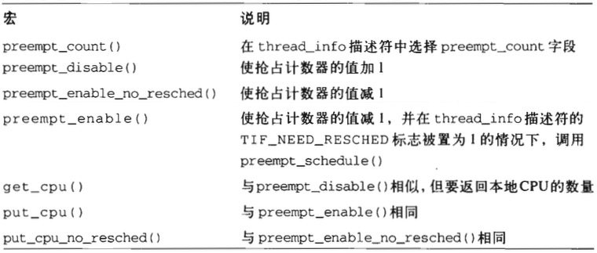

# 五.内核同步

> 可以把内核看作是不断对请求进行响应的服务器，这些请求可能来自在CPU上执行的进程，也可能来自发出中断请求的外部设备

## 1.内核如何为不同的请求提供服务

把内核看作必须满足2种请求的侍者：

1. 来自顾客的请求（相当于用户态进程发出的**系统调用**或**异常**，这章剩余部分将笼统地表示为“异常”）
2. 来自数量有限的几个不同老板的请求（相当于**中断**）

对不同请求，采用如下策略：

* 老板提出请求时，如果侍者正空闲，则为老板服务；
* 如果老板提出请求时侍者正在为顾客服务，那么停止为顾客服务，开始服务老板；
* 如果老板提出请求时侍者正在为另一个老板服务，那么停止为第一个老板服务，为第二个老板服务后再继续服务第一个老板；
* 一个老板可能命令侍者停止服务顾客。在完成对老板最近请求的服务后，可能暂时不理会原来的顾客而去为新选中的顾客服务

侍者提供的服务对应于CPU处于内核态时所执行的代码、如果CPU在用户态执行，则侍者被认为处于空闲状态

### 1.1 内核抢占

无论在抢占还是非抢占内核中，运行在内核态的进程都可以**自动放弃CPU**，比如，进程由于等待资源而不得不转入睡眠状态。我们将把这种进程切换称为**计划性进程切换**。但是，抢占式内核在响应引起进程切换的异步事件（如唤醒高优先权进程的中断处理程序）的方式上与非抢占内核有差别，我们将把这种进程切换称作**强制性进程切换**

**内核抢占的主要特点是：一个在内核态运行的进程，可能在执行内核函数期间被另外一个进程取代**

下面例子说明抢占内核与非抢占内核的区别：

* 当进程A执行异常处理程序时（肯定在内核态），一个具有较高优先级的进程B变为可执行状态。例如，发生了中断请求而且相应的处理程序唤醒了进程B
    * 如果内核是抢占的，就会发生强制性进程切换，让进程B取代进程A。异常处理程序的执行暂停，直到调度程序再次选择进程A才恢复执行
    * 如果内核是非抢占的，在进程A完成异常处理程序的执行之前是不会发生进程切换的，除非进程A自动放弃CPU
* 考虑一个执行异常处理程序的进程已经用完了它的时间配额
    * 如果内核是抢占的，进程可能会立即被取代
    * 如果内核是非抢占的，进程继续运行直到它执行完异常处理程序或自动放弃CPU

**使内核可抢占的目的是减少用户态进程的分派延迟，即从进程变为可执行状态到它实际开始运行之间的时间间隔**

使Linux2.6内核具有可抢占的特性无需对支持非抢占的旧内核在设计上做太大的改变，当被`current_thread_info()`宏所引用的`thread_info`描述符的`preempt_count`字段大于`0`时，就禁止内核抢占。下列宏处理`preempt_count`字段的抢占计数器：

  

**内核抢占会引起不容忽视的开销。Linux2.6独具特色地允许用户在编译内核时通过设置选项来禁用或启用内核抢占**