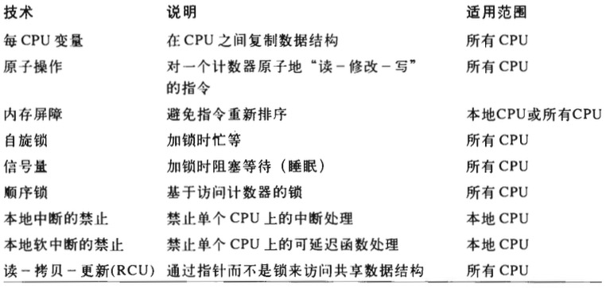

* [五.内核同步](#五内核同步)
    * [1.内核如何为不同的请求提供服务](#1内核如何为不同的请求提供服务)
        * [1.1 内核抢占](#11-内核抢占)
    * [2.同步原语](#2同步原语)
        * [2.1 每CPU变量](#21-每cpu变量)
        * [2.2 原子操作](#22-原子操作)
        * [2.3 优化和内存屏障](#23-优化和内存屏障)
        * [2.4 自旋锁](#24-自旋锁)
        * [2.5 读/写自旋锁](#25-读写自旋锁)
        * [2.6 顺序锁](#26-顺序锁)

 
 
 

# 五.内核同步

> 可以把内核看作是不断对请求进行响应的服务器，这些请求可能来自在CPU上执行的进程，也可能来自发出中断请求的外部设备

 

## 1.内核如何为不同的请求提供服务

把内核看作必须满足2种请求的侍者：

1. 来自顾客的请求（相当于用户态进程发出的**系统调用**或**异常**，这章剩余部分将笼统地表示为“异常”）
2. 来自数量有限的几个不同老板的请求（相当于**中断**）

对不同请求，采用如下策略：

* 老板提出请求时，如果侍者正空闲，则为老板服务；
* 如果老板提出请求时侍者正在为顾客服务，那么停止为顾客服务，开始服务老板；
* 如果老板提出请求时侍者正在为另一个老板服务，那么停止为第一个老板服务，为第二个老板服务后再继续服务第一个老板；
* 一个老板可能命令侍者停止服务顾客。在完成对老板最近请求的服务后，可能暂时不理会原来的顾客而去为新选中的顾客服务

侍者提供的服务对应于CPU处于内核态时所执行的代码、如果CPU在用户态执行，则侍者被认为处于空闲状态

### 1.1 内核抢占

无论在抢占还是非抢占内核中，运行在内核态的进程都可以**自动放弃CPU**，比如，进程由于等待资源而不得不转入睡眠状态。我们将把这种进程切换称为**计划性进程切换**。但是，抢占式内核在响应引起进程切换的异步事件（如唤醒高优先权进程的中断处理程序）的方式上与非抢占内核有差别，我们将把这种进程切换称作**强制性进程切换**

**内核抢占的主要特点是：一个在内核态运行的进程，可能在执行内核函数期间被另外一个进程取代**

下面例子说明抢占内核与非抢占内核的区别：

* 当进程A执行异常处理程序时（肯定在内核态），一个具有较高优先级的进程B变为可执行状态。例如，发生了中断请求而且相应的处理程序唤醒了进程B
    * 如果内核是抢占的，就会发生强制性进程切换，让进程B取代进程A。异常处理程序的执行暂停，直到调度程序再次选择进程A才恢复执行
    * 如果内核是非抢占的，在进程A完成异常处理程序的执行之前是不会发生进程切换的，除非进程A自动放弃CPU
* 考虑一个执行异常处理程序的进程已经用完了它的时间配额
    * 如果内核是抢占的，进程可能会立即被取代
    * 如果内核是非抢占的，进程继续运行直到它执行完异常处理程序或自动放弃CPU

**使内核可抢占的目的是减少用户态进程的分派延迟，即从进程变为可执行状态到它实际开始运行之间的时间间隔**

使Linux2.6内核具有可抢占的特性无需对支持非抢占的旧内核在设计上做太大的改变，当被`current_thread_info()`宏所引用的`thread_info`描述符的`preempt_count`字段大于`0`时，就禁止内核抢占。下列宏处理`preempt_count`字段的抢占计数器：

  

**内核抢占会引起不容忽视的开销。Linux2.6独具特色地允许用户在编译内核时通过设置选项来禁用或启用内核抢占**

 

## 2.同步原语

下表是Linux内核使用的同步技术。“适用范围”一栏表示同步技术是适用于系统中所有CPU还是单个CPU：

  

### 2.1 每CPU变量

**每CPU变量主要是数据结构的数组，系统的每个CPU对应数组的一个元素**

* 一个CPU不应该访问与其他CPU对应的数组元素，另外，它可以随意读或修改自己的元素而不用担心出现竞争条件，因为它是唯一有资格这么做的CPU
* 但是，这也意味着每CPU变量基本上只能在特殊情况下使用，也就是当它确定在系统的CPU上的数据在逻辑上是独立的时候

> 每CPU的数组元素在内存中被排列以使每个数据结构存放在硬件高速缓存的不同行，因此，对每CPU数组的并发访问不会导致cache-line的窃用和失效

**在单处理器和多处理器系统中，内核抢占都可能使每CPU变量产生竞争条件。总的原则是内核控制路径应该在禁用抢占的情况下访问每CPU变量**。考虑这种情况会产生什么后果——一个内核控制路径获得了它的每CPU变量本地副本的地址，然后它因被抢占而转移到另外一个CPU上，但仍然引用原来CPU元素的地址

### 2.2 原子操作

若干汇编语言指令具有“读—修改—写”类型。也就是说，它们访问存储器单元两次，第一次读原值，第二次写新值

为了避免由于“读—修改—写”指令引起的竞争条件，最容易的就是确保这样的操作在芯片级是原子的。任何一个这样的操作都必须以单个指令执行，

1. 中间不能中断
2. 且避免其他的CPU访问同一存储器单元

80x86指令：

* 进行零次或一次对齐内存访问的汇编指令是原子的
* 如果在读操作之后，写操作之前没有其他处理器占用内存总线，那么从内存中读取数据，更新数据并写回更新数据的这些“读—修改—写”汇编语言指令（如`inc`或`dec`）是原子的。当然，在单处理器系统中，永远都不会发生内存总线窃用的情况
* 操作码前缀是`lock`字节的“读—修改—写”汇编语言指令即使在多处理器系统中也是原子的。当控制单元检测到这个前缀时，就“锁定”内存总线，知道这条指令执行完成为止。所以加锁的指令执行时，其它处理器不能访问这个内存单元

C程序中，并不能保证编译器会为`a=a+1`或甚至像`a++`这样的操作使用一个原子指令。因此，Linux内核提供了一个专门的`atomic_t`类型（一个原子访问计数器）和一些专门的函数和宏，这些函数和宏作用于`atomic_t`类型的变量，并当作单独的、原子的汇编语言指令来使用。在多处理器系统中，每条这样的指令都有一个`lock`字节的前缀

### 2.3 优化和内存屏障

> 当使用优化的编译器时，不要认为指令会严格按照源代码中出现的顺序执行（例如，编译器可能重新安排汇编语言指令以使寄存器以最优的方式使用。此外，现代CPU通常并行地执行若干条指令，且可能重新安排内存访问。这种重新排序可以极大加速程序的执行）

所有的同步原语起优化和内存屏障的作用

**优化屏障**原语保证，编译程序不会混淆放在原语操作之前的汇编语言指令和放在原语操作之后的汇编语言指令

**内存屏障**原语保证，在原语之后的操作开始执行之前，原语之前的操作已经完成

### 2.4 自旋锁

自旋锁用在**多处理器环境中**

* 如果内核控制路径发现自旋锁“开着”，就获取锁并继续自己的执行
* 如果内核控制路径发现锁由运行在另一个CPU上的内核控制路径“锁着”，则反复执行一条紧凑的循环指令进行忙等，直到锁被释放

自旋锁通常非常方便，因为很多内核资源只锁1毫秒的时间片段；所以说，释放CPU和随后又获得CPU都不会消耗多少时间

一般来说，由自旋锁所保护的每个临界区都是禁止内核抢占的。在单处理系统上，这种锁本身并不起锁的作用，自旋锁的原语仅仅是禁止或启用内核抢占（注意，自旋锁忙等期间，内核抢占还是有效的，因此，等待自旋锁释放的进程有可能被更高优先级的进程替代）

### 2.5 读/写自旋锁

**只要没有内核控制路径对数据结构进行修改，读/写自旋锁就允许多个内核控制路径同时读同一数据结构。如果一个内核控制路径想对这个结构进行写操作，那么它必须首先获取读/写锁的写锁，写锁授权独占访问这个资源**

每个读/写自旋锁都是一个`rwlock_t`结构，其`lock`字段是一个32位的字段，分为两个不同的部分：

* **24位计数器**，表示对受保护的数据结构并发地进行读操作的内核控制路径的数目，这个计数器的二进制补码存放在这个字段的`0~23`位
* **“未锁”标志字段**，当没有内核控制路径在读或写时设置该位，否则清`0`.这个“未锁”标志存放在`lock`字段的第`24`位

注意：

* 如果自旋锁为空（设置了“未锁”标志且无读者），那么`lock`字段的值为`0x01000000`
* 如果写者已经获得自旋锁（“未锁”标志清`0`且无读者），那么`lock`字段的值为`0x00000000`
* 如果一个、两个或多个进程因为读获取了自旋锁，那么`lock`字段的值为`0x00ffffff`，`0x00fffffe`等

### 2.6 顺序锁

**当使用读/写锁时，内核控制路径发出的执行`read_lock`或`write_lock`操作的请求具有相同的优先权**。读者必须等待，直到写操作完成。同样地，写者也必须等待，直到读操作完成

Linux2.6引入了**顺序锁，它与读/写自旋锁非常相似，只是它为写者赋予了较高的优先级（事实上，即使在读者正在读的时候也允许写者继续运行。这种策略的好处是写者永远不会等待，除非另一个写者正在写，缺点是有些时候读者不得不反复多次读相同的数据直到它获得有效的副本）**

