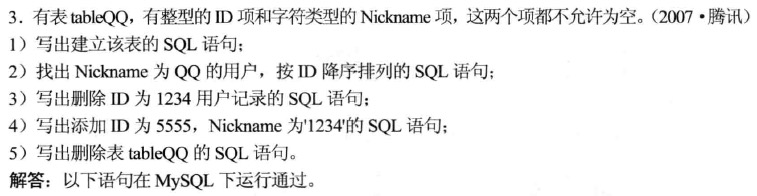
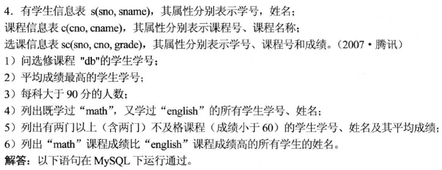

> 内容来源于《王道程序员求职宝典》

* [一.基本概念](#一基本概念)
    - [1.数据模型](#1数据模型)
    - [2.主键与外键](#2主键与外键)
    - [3.事务](#3事务)
    - [4.索引](#4索引)
    - [5.视图](#5视图)
* [二.SQL语句](#二sql语句)
    - [1.数据定义](#1数据定义)
        + 1）[CREATE TABLE](#1create-table)
        + 2）[ALTER TABLE](#2alter-table)
        + 3）[DROP TABLE](#3drop-table)
    - [2.数据查询](#2数据查询)
        + 1）[SELECT](#1select)
        + 2）[WHERE](#2where)
        + 3）[ORDER BY](#3order-by)
        + 4）[LIMIT](#4limit)
        + 5）[聚集函数](#5聚集函数)
        + 6）[GROUP BY](#6group-by)
        + 7）[连接查询](#7连接查询)
    - [3.数据操作](#3数据操作)
        + 1）[INSERT](#1insert)
        + 2）[UPDATE](#2update)
        + 3）[DELETE](#3delete)
* [三.例题](#三例题)

<br>
<br>
<br>
<br>
<br>
<br>

# 一.基本概念

## 1.数据模型

**数据库系统的核心和基础是数据模型**。一般来说，数据模型是严格定义的一组概念的集合。这些概念精确地描述了系统的静态特征、动态特征和完整性约束条件。因此**数据模型一般由数据结构、数据操作和完整性约束三部分组成**

1. **数据结构**：存储在数据库中对象类型的集合，作用是描述数据库组成对象以及对象之间的联系
2. **数据操作**：指对数据库中各种对象实例允许执行的操作的集合，包括操作及其相关的操作规则
3. **完整性约束**：指在给定的数据模型中，数据及其联系所遵守的一组通用的完整性规则，它能保证数据的正确性和一致性

根据模型应用目的的不同，数据模型分为2类：

* 第一类
    - 1）**概念模型**：也称为信息模型。它是按用户的观点来对数据和信息建模，主要用于数据库设计
* 第二类
    - 2）**逻辑模型**：主要包括层次模型、网状模型、**关系模型**、面向对象模型和对象关系模型等
    - 3）**物理模型**：是对数据最底层的抽象，它描述数据在系统内部的表示方法和存取方法，在磁盘或磁带上的存储方式和存取方法，是面向计算机系统的
    
**关系模型是目前最重要的一种数据类型**。关系数据库系统采用关系模型作为数据的组织方式

* 关系模型中数据的逻辑结构是一张*二维表*，或者说关系的数据结构就是一张表
* 关系数据模型的数据操作主要包含*查询*、*插入*、*删除*和*更新*数据
* 关系模型的完整性约束条件包含三大类：*实体完整性*、*参照完整性*和*用户自定义的完整性*
    - 关系模型的*实体完整性规则*：若属性（指一个或一组属性）A是基本关系R的主属性，则A不能取空值（由此规则可得一直接结论：主键不能为空）
    - 关系模型的*参照完整性规则*：若属性（或属性组）F是某基本关系R的外键，且它与基本关系R1的主键相对应，则对于R中，每个F上的值或为空值或者等于R1中的主键值

<br>

## 2.主键与外键

* **候选码**：关系（二维表）中能唯一标识一个元组的属性组
* **主键**：如果一张表有多个候选码，则选定其中一个为主键
* **外键**：如果关系模式R中的某属性集不是R的主键，而是另一个关系R1的主键，则该属性集是关系模式R的外键。外键表示了两个关系（表）之间的联系。以另一个关系的外键作主键的表被称为主表，具有此外键的表被称为主表的从表
* **主属性与非主属性**：候选码的诸属性称为主属性。不包含在任何候选码中的属性称为非主属性

<br>

## 3.事务

**事务**是指用户定义的一个数据库操作序列，这些操作要么全做要么全不做，是一个不可分割的工作单位

事务具有4个特性：**原子性**、**一致性**、**隔离性**、**持续性**。简称为**ACID**特性

<br>

## 4.索引

**索引**是对数据库中一列或多列的值进行排序的一种结构，使用索引可快速访问数据库表中的特定信息

为表设置索引的好处与坏处：

* 好处
    - 通过创建唯一性索引，可以保证数据库表中每一行数据的唯一性
    - 可以大大加快数据的检索速度（创建索引的主要原因）
    - 在使用分组（group by）和排序（order by）子句进行数据检索时，同样可以显著减少查询中分组和排序的时间
    - 可以加速表和表之间的连接，特别是在实现数据的参照完整性方面特别有意义
* 坏处
    - 一是增加了数据库的存储空间
    - 二是插入和删除数据时要花费较多时间（因为索引也要随之变动）

索引是建立在数据库表中的某些列的上面。在创建索引时，应该考虑在哪些列上可以创建索引，在哪些列上不能创建索引：

* 一般来说，应该在这些列上创建索引
    - 1）在经常需要搜索的列上创建索引，可以加快搜索的速度
    - 2）在作为主键的列上创建索引，强制该列的唯一性和组织表中数据的排列结构
    - 3）在经常用在连接的列上创建索引，这些列主要是一些外键，可以加快连接的速度
    - 4）在经常需要根据范围进行搜索的列上创建索引，因为索引已经排序，其指定的范围是连续的
    - 5）在经常需要排序的列上创建索引，因为索引已经排序，这样查询可以利用索引的排序，加快排序查询时间
    - 6）在经常使用在`WHERE`子句中的列上创建索引，加快条件的判断速度
* 一般来说，不应该创建索引的这些列具有下列特点
    - 1）那些在查询中很少使用的列不应该创建索引。很少使用故而即使创建索引也不会带来很大性能提升。索引又会带来空间和维护上的负担
    - 2）只有很少数据值的列也不应该创建索引。如性别，结果集的数据行占了表中数据行的很大比例，即需要在表中搜索的数据行的比例很大。增加索引并不能明显加快检索速度
    - 3）那些定义为text和bit等数据类型的列不应该创建索引。因为这些列的数据量要么相当大，要么取值很少，不利于使用索引
    - 4）当修改操作远远大于检索操作时，不应该创建索引。因为修改性能和检索性能互相矛盾。当增加索引时，会提高检索性能，但是会降低修改性能。当减少索引时，会提高修改的性能，降低检索的性能
    
<br>

## 5.视图

**视图**是从一个或几个基本表（或试图）导出的表。与基本表不同，它是一个虚表

数据库中只存放视图的定义，而不存放视图对应的数据，这些数据仍存放在原来的基本表中。所以基本表中的数据发生变化时，视图中查询出的数据也就随之改变了。从这个意义上讲，视图就像一个窗口，透过它可以看到数据库中自己感兴趣的数据及其变化

视图一经定义，就可以和基本表一样被查询、删除

<br>
<br>

# 二.SQL语句

SQL语句主要包括：

* [数据定义](#1数据定义)：create、drop、alter
* [数据查询](#2数据查询)：select
* [数据操作](#3数据操作)：insert、update、delete
* 数据控制：grant、revoke

## 1.数据定义

### 1）CREATE TABLE

> 定义基本表

```sql
CREATE TABLE <表名> (<列名> <数据类型> [列级完整性约束条件]
                     [, <列名> <数据类型> [列级完整性约束条件]]
                     ...
                     [, <表级完整性约束条件>]);
```

* `primary key (A1,A2,A3,...)`：指定主键属性集
* `foreign key (A1,A2,A3,...) references T2`：声明表示关系中任意元组在属性`(A1,A2,A3,...)`上的取值必须对应于`T2`中某元组在主码属性上的取值

**数据类型**：

* `int`：整形。等价于全称`integer`
* `smallint`：小整数型
* `real`，`double precision`：浮点数与双精度浮点数（精度与机器相关）
* `float(n)`：精度至少为n位的浮点数
* `char(n)`：固定长度的字符串
* `varchar(n)`：可变长度的字符串

例：建立一个“学生信息”表Student：

```sql
CREATE TABLE Student
(Sno CHAR(9) PRIMARY KEY,
 Sname CHAR(20) UNIQUE,
 Ssex CHAR(2),
 Sage SMALLINT,
 Sdept CHAR(20)
);
```

### 2）ALTER TABLE

> 修改基本表

```sql
ALTER TABLE <表名>
[ADD <新列名> <数据类型> [完整性约束]]
[DROP <完整性约束>]
[MODIFY COLUMN <列名> <数据类型>];
```

* `ADD`子句：增加新列和新的完整性约束
* `DROP`子句：删除指定的完整性约束
* `MODIFY COLUMN`子句：修改原有列的定义，包括列名和数据类型

例子：

```sql
ALTER TABLE Student ADD S_entrance DATE;     //向Student表增加“入学时间”列，其数据类型为日期型
ALTER TABLE Student MODITY COLUMN Sage INT;  //将年龄的数据类型由字符型改为整数
ALTER TABLE Student ADD UNIQUE(Sname);       //增加Student表Sname必须取唯一值的约束条件
```

### 3）DROP TABLE

> 删除基本表

```sql
DROP TABLE <表名> [RESTRICT | CASCADE];
```

* `RESTRICT`：删除是有限制条件的。欲删除的基本表不能被其他表的约束所引用（如：check、foreign key等约束），不能有视图，不能有触发器，不能有存储过程或函数等。如果存在这些依赖该表的对象，则该表不能被删除
* `CASCADE`：删除没有条件限制。在删除该表的同时，相关的依赖对象，例如视图，都将被一起删除

<br>

## 2.数据查询

### 1）SELECT

```sql
SELECT [ALL | DISTINCT] <目标列表达式> [, <目标列表达式>]...
FROM <表名或视图名> [, <表名或视图名>]...
[WHERE <条件表达式>]
[GROUP BY <列名1> [HAVING <条件表达式>]]
[ORDER BY <列名2> [ASC | DESC]]; 
```

* `ALL`：显示所有（不去重）
* `DISTINCT`：去除重复

整个`SELECT`语句的含义是：根据`WHERE`子句的条件表达式，从`FROM`子句指定的基本表或视图中找出满足条件的元组，再按`SELECT`子句中的目标列表达式，选出元组中的属性值形成结果表  
如果有`GROUP BY`子句，则将结果按`<列名1>`的值进行分组，该属性列值相等的元组为一个组。通常会在每组中作用聚合函数。如果`GROUP BY`子句带`HAVING`子句，则只有满足指定条件的组才予以输出  
如果有`ORDER BY`子句，则结果表还要按`<列名2>`的值的升序或降序排列

### 2）WHERE

`WHERE`子句可以使用下列一些条件表达式进行筛选：

* `=`：指定属性的值为给定值的
* `IS`：如`IS NULL`。不能被`=`代替
* `like`：字符串匹配
    - `%`：匹配任意子串
    - `_`：匹配任意一个字符
* `and`、`or`、`not`
* `BETWEEN AND`（`NOT BETWEEN AND`）：介于...之间的（不介于...之间的）
* `IN(...)`：指定属性的值为`IN`中给出的某个值的

```sql
SELECT * from Student WHERE Sname='Bill Gates';                   //名字是Bill Gates的
SELECT * from Student WHERE Sname like '%Bill%';                  //名字中包含有Bill的
SELECT * from Student WHERE Sage BETWEEN 20 AND 23;               //年龄20~23的
SELECT Sname , Ssex from Student WHERE Sdept IN('CS','IS','MA');  //CS、IS或MA系的
SELECT * FROM Student WHERE Sage IS NULL;                         //没有年龄信息的
```

### 3）ORDER BY

> 对查询结果按一个或多个属性列的升序(ACS)或降低(DESC)排序，默认为升序

例子：

```sql
SELECT * FROM Student ORDER BY Sage;
SELECT * FROM Student ORDER BY Sdept, Sage desc; //先按专业升序排序，然后同一专业按年龄降序排序
```

### 4）LIMIT

> 可以用于强制`SELECT`返回指定的记录数

接受1个或2个数字参数。参数必须是一个整数常量：

* 1个参数：表示返回最前面的记录行数目
* 2个参数：第一个指定第一个返回记录行的偏移量（从0开始算），第二个参数指定返回记录行的最大数目

例子：

```sql
SELECT * FROM Student LIMIT 5, 10;  //返回记录行6-15
SELECT * FROM Student LIMIT 5;      //返回前5个记录行
```

### 5）聚集函数

聚集函数有以下几种：`count`、`sum`、`avg`、`max`、`min`

* **总数**：`select count(*) as totalcount from table1;`
* **求和**：`select sum(field1) as sumvalue from table1;`
* **平均**：`select avg(field1) as avgvalue from table1;`
* **最大**：`select max(field1) as maxvalue from table1;`
* **最小**：`select min(field1) as minvalue from table1;`

### 6）GROUP BY

> 根据一个或多个属性的值对元组分组，值相同的为一组

分组后[聚集函数](#5聚集函数)将作用于每一个组，即每一组都有一个函数值

如果分组后还要求按一定的条件对这些分组进行筛选，最终只输出满足指定条件的组，则使用`HAVING`短语指定筛选条件

例子：

```sql
//按年龄分组，统计每个年龄的人数，并输出(年龄,该年龄的人数)
select Sage, count(*) from Student group by Sage;
//按年龄分组，统计每个年龄的人数，选出人数大于1的分组，输出(年龄,该年龄的人数)
select Sage, count(*) from Student group by Sage having count(*) > 1;
```

### 7）连接查询

> 一个查询涉及多个表

假设有2个表——Student表和SC表（选课表）：

* **内连接**（**自然连接**）：当使用内连接时，如果Student中某些学生没有选课，则在SC中没有相应元组。最终查询结果舍弃了这些学生的信息
* **外连接**：如果想以Student表为主体列出每个学生的基本情况及其选课情况。即使某个学生没有选课，依然在查询结果中显示（SC表的属性上填空值）。就需要使用外连接

例子：

```sql
//内连接：查询每个学生及其选修课程的情况（没选课的学生不会列出）
SELECT Student.*, SC.*
FROM Student , SC
WHERE Student.Sno=SC.Sno;

//外连接：查询每个学生及其选修课程的情况（没选课的学生也会列出）
SELECT Student.*, SC.*
FROM Student LEFT JOIN SC ON(Student.Sno=SC.Sno);
```

<br>

## 3.数据操作

### 1）INSERT

> 插入元组

```sql
INSERT
INTO table1(field1,field2...)
VALUES(value1,value2...);
```

如果`INTO`语句没有指定任何属性列名，则新插入的元组必须在每个属性列上均有值

例子：

```sql
INSERT INTO Student(Sno, Sname, Ssex, Sdept, Sage)
VALUES('201009013', '王明', 'M', 'CS', 23);
```

### 2）UPDATE

> 修改(更新)数据

```sql
UPDATE table1
SET field1=value1, field2=value2
WHERE 范围;
```

功能是修改指定表中满足`WHERE`子句条件的元组。如果省略`WHERE`子句，则表示要修改表中的所有元组

例子：

```sql
UPDATE Student
SET Sage=22
WHERE Sno='201009013';
```

### 3）DELETE

> 删除元素

```sql
DELETE
FROM table1
WHERE 范围;
```

功能是删除指定表中满足`WHERE`子句条件的元组。如果省略`WHERE`子句，则表示删除表中的所有元组。**但表仍存在**

例子：

```sql
DELETE
FROM Student
where Sno='201009013';
```

<br>

# 三.例题



```sql
1) CREATE TABLE tableQQ (
    ID INTEGER NOT NULL,
    Nickname Varchar(30) NOT NULL
   );
2) select * from tableQQ where Nickname='QQ' order by ID desc;
3) delete from tableQQ where ID=1234;
4) insert into tableQQ values(5555,'1234');
5) drop table tableQQ;
```

<br>



```sql
1) SELECT sc.sno from sc , c
    where sc.cno=c.cno and c.cname='db';
2) SELECT sno, avg(grade) as g from sc
    group by sno order by g desc limit 1;
3) SELECT cno, count(sno) from sc
    where grade > 90 group by cno;
4) SELECT s.sno, s.sname from s, (select sc.sno FROM sc, c where sc.cno=c.cno
          and c.cname in ('math', 'english') group by sno having count
          (DISTINCT c.cno)=2)x
    where s.sno=x.sno;
5) SELECT s.sno, s.sname , avg(sc.grade) as avggrade from s, sc, (select sno
        FROM sc where grade<60 group by sno having count(DISTINCT cno)>=2)x
    where s.sno=x.sno and sc.sno=x.sno group by s.sno;
6) SELECT s.sname from s,
  (select sno, grade from sc where cno in (select cno from c where
       cname='math'))A,
  (select sno, grade from sc where cno in (select cno from c where
       cname='english'))B
   where s.sno=A.sno and s.sno=B.sno and A.grade>B.grade;
```