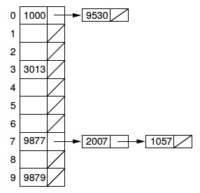
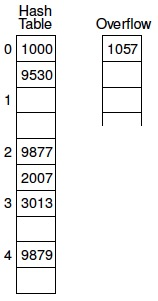
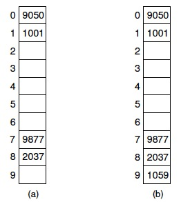

* [槽总数的选择](#槽总数的选择)
    - [关键码范围较小](#关键码范围较小)
    - [关键码范围较大](#关键码范围较大)
* [简单的哈希函数](#简单的哈希函数)
* [冲突解决策略](#冲突解决策略)
    * [开哈希法](#开哈希法)
    * [闭哈希法](#闭哈希法)

<br>
<br>

* **哈希**：把关键码值映射到表中的位置来访问记录的过程
* **哈希函数**：将关键码值映射到位置的函数
* **槽**：哈希表中的一个位置
* **冲突**：不同的关键码经过哈希函数哈希后，映射到相同槽的情况
* **探查序列**：冲突解决策略的闭哈希方法中，如果基位置冲突，需要根据探查函数查找下一个空槽，这个过程产生的序列加上基位置组成了某个关键码的探查序列
* **基本聚集**：在探查函数的设计中，如果不同基位置关键码产生的探查序列发生重合，会导致对剩余空槽的选择概率不均等
。产生的后果是会导致很长的探查序列。这种现象就是基本聚集
* **二次聚集**：基位置相同的关键码，产生的探查序列一样。如果哈希函数在某个基位置聚集，仍然会保持聚集

哈希方法不适用于下列场景：

* 不适用于范围检索
* 不能找到具有最大或最小关键码值的记录
* 不能按关键码值的顺序访问记录

>哈希方法既适合基于内存的检索，也适合基于磁盘的检索。是组织存储在磁盘上的大型数据库的主要方法之一（另一种是B树）

## 槽总数的选择

### 关键码范围较小

由于关键码范围比较小，可以使用一个槽总数大于关键码总数的表。直接使用槽的下标作为关键码值，此时，不需要将关键码值作为记录的一部分进行存储。哈希函数可以直接设计成```h(K)=K```，但是这种情况比较少见

### 关键码范围较大

**如果可能的关键码范围较大，而同一时间段内存储的记录总数较少时。如果槽数的设计和前者匹配通常意味着空间的浪费，而如果和后者匹配又容易导致冲突**

除此之外，如果对关键码值的分布特性不了解，也会使得哈希函数的设计更为困难。如果了解关键码值的分布特性，应对使用一个依赖于分布的哈希函数，避免把一组相关的关键码值映射到表的同一个槽中（例如，如果对英文单词进行哈希，就不应当对第一个字符的值哈希，因为这样很可能使分布不均）

## 简单的哈希函数

**关键码为数值**的哈希函数的设计：

* **取模**：哈希函数的返回值(槽的位置)只依赖于关键码的最低几位，由于这些位的分布可能很差，结果分布也就可能很差
* **平方取中**：一个很好的用于数值的哈希函数。对于长度为2^r的表，取出平方后结果的中间r位作为槽的位置。由于关键码值的大多数位或者所有位都对结果有所贡献，所有效果很好

**关键码为字符串**的哈希函数的设计：

* **所有字母ASCII值求和对M取模**

## 冲突解决策略

尽管哈希函数的目标是使冲突最少，但实际上冲突是无法避免的。**冲突解决技术可以分为两类**：

1. **开哈希(单链表)法**
2. **闭哈希(开放地址)法**

### 开哈希法

**开哈希(单链表)法把冲突记录存储在表外**，一种简单的形式是把哈希表中的每个槽定义为一个链表的表头，哈希到一个槽的所有记录都放到该槽的链表内，每个链表可以按如下方式组织记录：

<div align="center">  </div>

1. **按插入次序排序**：实现简单
2. **按关键码值次序排序**：一旦到达比要检索的关键码大的节点，说明不存在，就可以停止检索
3. **按访问频率次序排序**：访问较高的记录能快速检索到

>在磁盘中用一种很有效的方式存储一个开哈希表是很困难的，因为一个链表中的多个元素能存储在不同的磁盘块中。这就会导致检索一个关键码值需要多次磁盘访问，从而抵消了哈希方法的好处

### 闭哈希法

**闭哈希(开放地址)法把冲突记录存储在表中另一个槽内**。每条记录i有一个**基位置**，即由哈希函数计算出的槽。如果要插入一条记录R，而另一条记录已经占据了R的基位置，那么就把R存储在表中的其他槽内，由冲突解决策略决定应该是哪个槽。自然，检索时也要像插入一样，遵循同样的策略，以便重复进行冲突解决过程，找出在某位置没有找到的记录

#### 1）桶式哈希

* **插入**：将M个槽分成B个桶，每个桶中包含M/B个槽。哈希函数把每条记录分配到某个桶的第一个槽中。如果该槽被占用，就顺序地沿着桶查找，直到找到一个空槽。如果一个桶全部被占满，那么就把这条记录存储在表后具有无限容量的**溢出桶**中，所有桶共享一个溢出桶
* **检索**：确定桶，然后在桶中检索记录，如果没找到并且桶内有空槽，则检索结束。否则，检索溢出桶

<div align="center">  </div>

>桶式哈希适用于实现基于磁盘的哈希表，因为可以把桶的大小设置为磁盘块的大小。当检索时，就把整个桶读入内存。处理插入或检索操作只需进行一次磁盘访问，除非桶已经满了。如果桶满，需要从磁盘中检索溢出桶，自然应该使溢出很小，以最小化不必要的磁盘访问

#### 2）线性探查

**探查序列**：通过哈希函数计算出关键码的基位置，如果基位置发生冲突，根据**探查函数**去寻找下一个槽，直到找到一个空槽，这个过程产生的一组槽序列，就是探查序列

线性探查就是探查函数线性递增的冲突解决策略，如果基位置为30，整个探查序列会是30,31,32,33...

<div align="center">  </div>

线性探查的问题在于，会产生**基本聚集**，基本聚集是指不同基位置的关键码产生的探查序列会发生重合，导致对剩余空槽的选择概率不均等
。产生的后果是会导致很长的探查序列

在上图a）中，如果使用线性探查，基位置为0,1,2的关键码在探查后都会选择序号为2的槽，同样，基位置为7,8,9的关键码在探查后都会选择序号为9的槽，这就使得剩余槽被选择的概率不相等。在图b）中，这个问题会更明显，如果下一个记录插入了序号为9的槽，则序号为2的空槽被插入记录的概率将是6/10

**系数大于1的线性探查**(对线性探查函数添加**常数C**跳过一些槽)，即：`(h(K) + iC) mod M`

比如当C为2时，基位置为1和2产生的探查序列为1,3,5..和2,4,6..这个方法对于不同关键码，将关键码值分成了几个集合，每个集合中的关键码只会探查所有槽中的一个部分。同时，相同集合中的关键码还是可能聚集

**为了使探查序列走遍表中所有的槽，常数`C`必须与`M`互质（即`C`为质数或`M`为质数），如果`C`与`M`互质，那么任何关键码的探查序列都会走遍所有的槽**

#### 3）解决聚集的方法

* **二次探查**：探查函数为i的平方，即基位置为30的关键码，产生的探查序列为30,31,34,39..这种方法的缺陷在于并不是哈希表中所有的槽都在探查序列中

上述方法虽然能解决基本聚集，但是对于基位置相同的关键码，产生的探查序列还是一样。如果哈希函数在某个基位置聚集，那么上面的方法仍然会保持聚集。也就是所谓的**二次聚集**。解决二次聚集可以使用**双哈希**

* **双哈希**：要使具有相同基位置的关键码产生不同的探查序列，那么探查函数也应该是基于关键码的函数。假设这个函数为h2(K)，一种方式是根据这个函数产生线性探查序列，即i\*h2(K)。例如，如果h2(K)=2，那么基位置为30的关键码产生的探查序列是：30，32，34...，由于h2是基于关键码值的函数，所以基位置相同的不同关键码会产生不同的探查序列，因此可以解决二次聚集