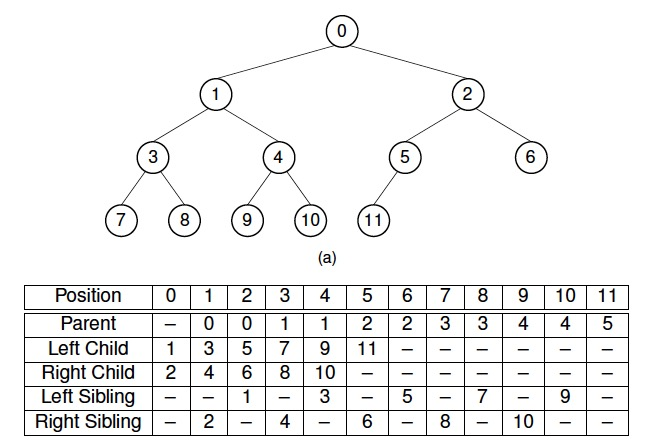

* [插入节点](#插入节点)
* [删除堆顶](#删除堆顶)
* [建堆](#建堆)
* [复杂度](#复杂度)

<br>
<br>

堆是一棵完全二叉树，使用数组实现堆，堆分为两种：

* 最大堆：父节点大于任意子节点（因此堆顶为最大值）
* 最小堆：父节点小于任意子节点（因此堆顶为最小值）

对于第i个节点（i从0开始计数）：

* 父节点：`(i-1)/2`
* 左子节点：`2i+1`
* 右子节点：`2i+2`

若包含`sz`个节点，则第一个非叶子节点的序号为`(sz - 2) / 2`



## 插入节点

插入节点时，进行下列操作：

1. 将元素添加到数组末尾；（相当于叶节点接入堆中）
2. 和父节点进行比较，如果大于父节点(以最大堆为例)，则与父节点交换，一直比较交换到根节点

```c++
/********************************************
 * 向堆中插入元素
 *  hole：新元素所在的位置
 ********************************************/
template <class value>
void _push_heap(vector<value> &arr,int hole){
    value v = arr[hole]; //取出新元素，从而产生一个空洞
    int parent = (hole - 1) / 2;
    //建最大堆，如果建最小堆换成 arr[parent] > value
    while(hole > 0 && arr[parent] < v){
        arr[hole] = arr[parent];
        hole = parent;
        parent = (hole - 1) / 2;
    }
    arr[hole] = v;
}
```

## 删除堆顶

删除实际上是将堆顶元素移入数组末尾，并不是真的删除。删除节点时，进行下列操作：

1. 保存数组末尾元素(存如临时变量`v`)，将堆顶元素存入数组末尾
2. 将原来堆顶元素的两个子节点中较大的一个移入堆顶(以最大堆为例)，填补空缺，此时产生新的空缺，继续此步骤，直到空缺为一个叶子节点
3. 将`v`中存储的值移到空缺叶子节点的位置
4. 对上一步中的新叶子节点完成向上比较交换操作

```c++
/********************************************
 * 删除堆顶元素
 ********************************************/
template <class value>
void _pop_heap(vector<value> &arr,int sz)
{
    value v = arr[sz - 1];
    arr[sz - 1] = arr[0];
    --sz;
    int hole = 0;
    int child = 2 * (hole + 1); //右孩子
    while(child < sz){
        if(arr[child] < arr[child - 1])
            --child;
        arr[hole] = arr[child];
        hole = child;
        child = 2 * (hole + 1);
    }
    if(child == sz){
        arr[hole] = arr[child - 1];
        hole = child - 1;
    }
    arr[hole] = v;
    _push_heap(arr,hole);
}
```

## 建堆

* **堆的大小固定(且所有元素已知)**：按“序号从大到小”的顺序遍历所有非叶子节点，将这些节点与左右子节点较大者(以最大堆为例)交换，执行siftdown一直到叶子节点，因此，每遍历到一个节点时，其左子树和右子树都已经是最大堆，只需对当前节点执行siftdown操作
* **堆的大小未知(如数据流)**：可以通过插入操作来构建堆

```c++
/********************************************
 * 建堆
 *  sz：删除堆顶元素后的大小
 *  v： 被堆顶元素占据的位置原来的元素的值
 ********************************************/
template <class value>
void _make_heap(vector<value> &arr)
{
    int sz = arr.size();
    int parent = (sz - 2) / 2;
    while(parent >= 0){
        int hole = parent;
        int child = 2 * (hole + 1); //右孩子
        value v = arr[hole];
        while(child < sz){
            if(arr[child] < arr[child - 1])
                --child;
            arr[hole] = arr[child];
            hole = child;
            child = 2 * (hole + 1);
        }
        if(child == sz){
            arr[hole] = arr[child - 1];
            hole = child - 1;
        }
        arr[hole] = v;
        _push_heap(arr,hole);
        --parent;
    }
}
```

## 复杂度

* **插入节点**：时间复杂度为O(logn)
* **删除堆顶**：时间复杂度为O(logn)
* **建堆**：
    - **堆的大小固定(且所有元素已知)**：每个siftdown操作的最大代价是节点被向下移动到树底的层数。在任意一棵完全二叉树中，大约有一半的节点是叶节点，因此不需要向下移动。四分之一的节点在叶节点的上一层，这样的节点最多只需要移动一层。每向上一层，节点的数目就为前一层的一般，而子树高度加1，因此移动层数加一。**时间复杂度为O(n)**
    - **堆的大小未知(如数据流)**：由于插入节点的时间代价为O(logn)，对于n个元素，每个执行一次插入操作，所以**时间复杂度为O(nlogn)**
