> 总结自《算法》(第4版)

<!-- GFM-TOC -->
* [平衡查找树](#平衡查找树)
    * [2-3查找树](#2-3查找树)
        * [1. 查找](#1-查找)
        * [2. 插入](#2-插入)
        * [3. 2-3树构造实例](#3-2-3树构造实例)
    * [红黑树](#红黑树)
        * [1. 保存颜色信息](#1-保存颜色信息)
        * [2. 旋转操作](#2-旋转操作)
        * [3. 插入](#3-插入)
        * [4. 颜色变换](#4-颜色变换)
        * [5. 旋转与颜色变换过程总结](#5-旋转与颜色变换过程总结)
        * [6. 红黑树的性质](#6-红黑树的性质)
<!-- GFM-TOC -->

 
 

# 平衡查找树

一般的二插查找树如果节点有序插入，树的高度会是n，因此无法实现logn的查找，平衡查找树保证树的高度平衡，因此不管节点插入顺序如何，都可以满足logn的查找

## 2-3查找树

 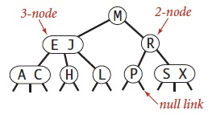 

一棵2-3查找树或为一棵空树，或由以下节点组成：

* **2-节点**：含有1个键（及其对应的值）和2条链接，左链接指向的2-3树中的键都小于该节点，右链接指向的2-3树中的键都大于该节点
* **3-节点**：含有2个键（及其对应的值）和3条链接，左链接指向的2-3树种的键都小于该节点，中 链接指向的2-3树中的键都位于该节点的两个键之间，右链接指向的2-3树中的键都大于该节点

### 1. 查找

先将查找的键与根节点中的键比较。如果和其中任意一个相等，则查找命中；否则根据比较的结果找到指向相应区间的链接，并在其指向的子树中递归地继续查找。如果这是个空链接，查找未命中

### 2. 插入

#### 1）向2-节点中插入新键

如果未命中的查找结束于一个2-节点，只要把这个2-节点替换为一个3-节点，将要插入的键保存在其中即可。由于整棵树的节点并未发生变化，所以这个插入操作并没有引起高度变化，如果原本树是平衡的，那么插入后也能保持平衡

 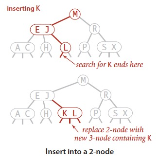 

#### 2）向3-节点中插入新键

* **整棵树只包含一个3-节点**（**情况一**）
* **整棵树包含多个节点**
	* **3-节点的父节点为2-节点**（**情况二**）
	* **3-节点的父节点为3-节点**（**情况三**）

**情况一**：先临时将新键存入该节点中，使之成为一个4-节点。然后将这个4-节点转换成一棵由3个2-节点组成的2-3树：其中一个节点(根)含有中键，一个节点含有3个键中的最小者(左子节点)，一个节点含有3个键中的最大者(右子节点)。**很容易看出插入后的树依然是平衡的**

 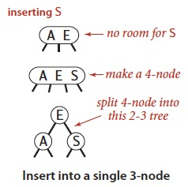 

**情况二**：先构造一个临时的4-节点并将其分解，但此时不会像情况一一样为中键创建一个新节点，而是将其移动至原来的父节点中。可以将这次转换看成将原3-节点的一条链接替换为新父节点中的原中键左右两边的两条链接，并分别指向两个新的2-节点。**插入后树仍是有序的，并且是完美平衡的**

 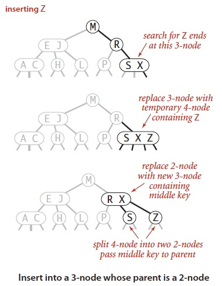 

**情况三**：和情况二一样，先构造一个临时的4-节点并分解，将它的中键插入到父节点中。但父节点也是一个3-节点，因此再用这个中键构造一个新的临时4-节点，然后在这个节点上进行相同的变换（即分解这个父节点并将它的中键插入到父节点中）。推广到一般情况，这样一直向上不断分解临时的4-节点并将中键插入更高层的父节点，直至遇到一个2-节点并将它替换为一个不需要继续分解的3-节点，或者是到达3-节点的根（这种情况下，按情况一进行处理，将临时的4-节点分解为3个2-节点，使得树高加一，因为变换的是根节点，所以**仍然保持树的完美平衡性**）

 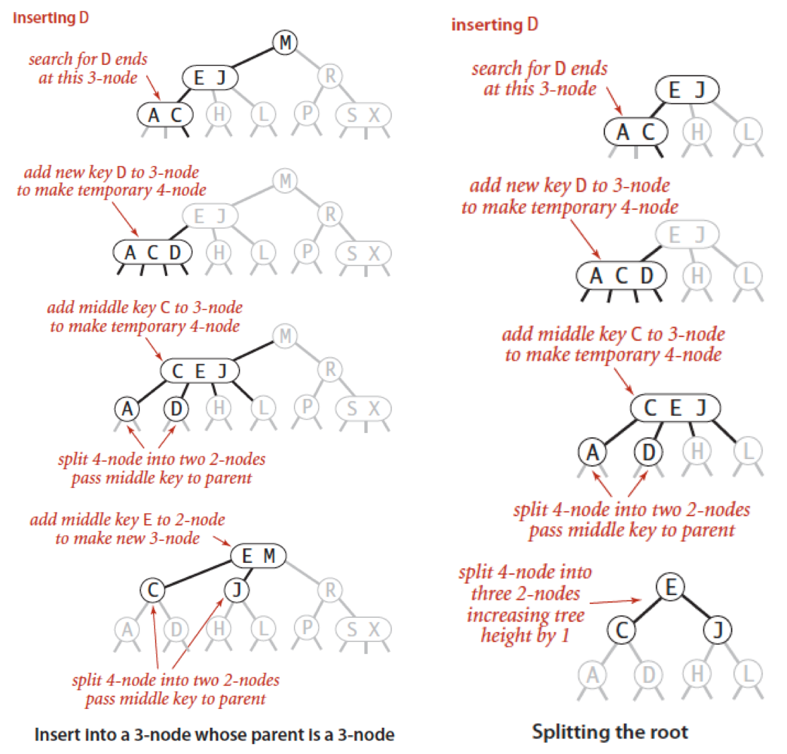 

### 3. 2-3树构造实例

下面是根据字符序列[S,E,A,R,C,H,X,M,P,L]构造一棵2-3树的过程。左边是乱序插入，右边是顺序插入

 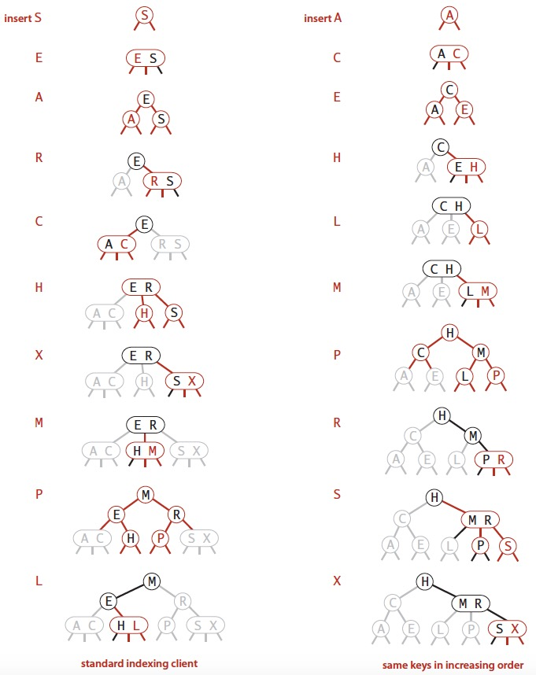 

可以发现，2-3树在最坏情况下（顺序插入）仍然可以保证平衡

每个操作中处理每个节点的时间都不会超过一个很小的常数，并且只会访问一条路径上的节点，所以任何查找或插入的成本都肯定不会超过对数级别。含有10亿个节点的一颗2-3树的高度仅在19到30之间，最多只需要访问30个节点就能够在10亿个键中进行查找和插入操作

 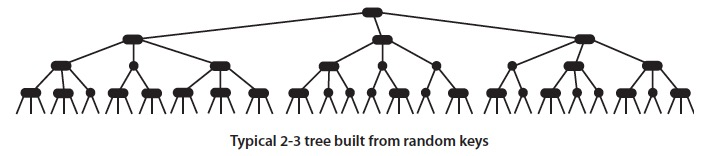 

## 红黑树

> 尽管可以用不同的数据类型表示2-节点和3-节点并写出转换所需的代码，但用这种直白的表示方法实现大多数的操作并不方便，因为**需要处理的情况实在太多**：需要维护两种不同类型的节点，将被查找的键和节点中的每个键进行比较，将链接和其它信息从一种节点复制到另一种节点，将节点从一种数据类型转换到另一种数据类型，等等。**实现这些不仅需要大量代码，而且它们产生的额外开销可能会使算法比标准的二插查找树更慢**。平衡二叉树的初衷是为了消除最坏情况，但我们希望这种保障所需的代码能够越少越好，因此有了红黑树

**红黑树背后的基本思想是：用标准的二插查找树（完全由2-节点构成）和一些额外的信息（替换3-节点）来表示2-3树**。将红黑树中的链接分为2种类型：

1. **红链接**：红链接将两个2-节点连接起来构成一个3-节点
2. **黑链接**：2-3树中的普通链接

将2-3树中的3-节点表示为由一条**左斜的红链接相连的两个2-节点**（优点是，无需修改就可以直接使用标准二插查找树的get方法）

 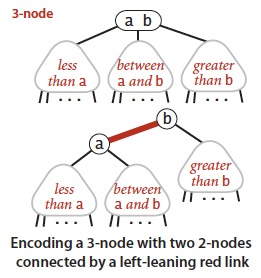 

**红黑树是满足下列条件的二叉查找树**：

1. **红链接均为左链接**
2. **没有任何一个节点同时和两个红链接相连**
3. **该树是完美”黑色“平衡的，即任意空链接到根节点的路径上的黑链接数量相同**

如果将一棵红黑树中的红链接画平，那么所有的空链接到根节点的距离都将是相同的。如果将由红链接相连的节点合并，得到的就是一棵2-3树。相反，如果将一棵2-3树中的3-节点画作由红色左链接相连的两个2-节点，那么不会存在能够和两条红链接相连的节点，且树必然是完美黑色平衡的

 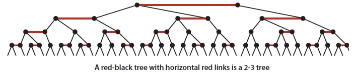 

### 1. 保存颜色信息

将链接的颜色保存在表示节点的Node数据类型的布尔变量color中。如果指向它的链接是红色的，那么该变量为true，黑色则为false

 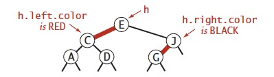 

### 2. 旋转操作

某些操作中可能会出现红色右链接或者两条连续的红链接，但在操作完成前这些情况都会被小心地旋转并修复。旋转包括2种：

* **左旋转**（下图左）
* **右旋转**（下图右）

  

> 插入新键时，可以使用旋转操作保证红黑树的**有序性**和**完美平衡性**

### 3. 插入

#### 1）向2-节点中插入新键

* **整棵树只有一个2-节点**（下图左）：
	* 插入根节点左侧时，直接插入并设置链接颜色即可，此时**父节点成为一个3-节点**
	* 插入根节点右侧时，需要进行左旋转操作，左旋转后的**父节点成为一个3-节点**
* **整棵树有多个节点**（下图右）：同上

 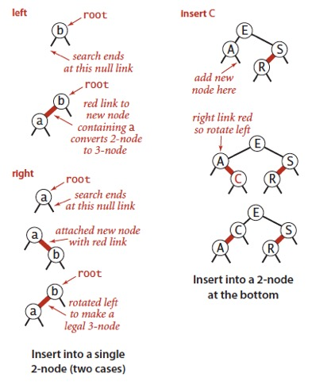 

#### 2）向3-节点中插入新建

分为下列3种情况，**每种情况都会产生一个同时连接到两条红链接的节点，需要使用旋转进行修正**：

* **新键大于3-节点的两个键**（下图左）：新键被连接到3-节点的右链接。如果将两条链接的颜色都由红变黑，就得到了一棵由三个节点组成、高度为2的平衡树（相当于2-3树4-节点的分解）
* **新键小于3-节点中的两个键**（下图中）：将上层的红链接右转得到情况1，然后按情况1进行处理
* **新键位于3-节点两个键之间**（下图右）：将下层红链接左旋转得到上一种情况2，然后按情况2进行处理

 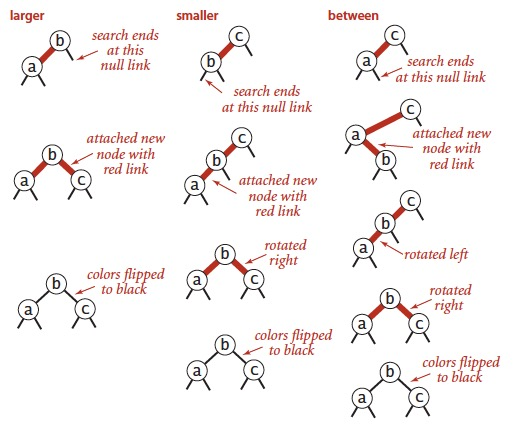 

### 4. 颜色变换

向3-节点插入新建的操作中，都涉及到将一个节点到两个子节点的红链接设置成黑链接的操作。在这个操作中，将两条红链接设置为黑链接使得左子树和右子树的高度都增加了1，因此还需要将父节点的颜色由黑变红，这样以父节点为根节点的这颗树的高度又减了1，从而保证整体平衡

 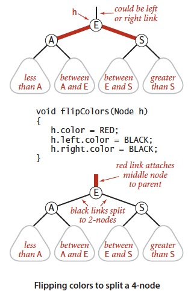 

如果父节点是整棵树的根节点，这个操作可能会将根节点设置为红，因此每次插入操作后会将根节点设为黑色，每当根节点由红变黑时树的黑链接高度就会加1

**红链接向上传递**：每次必要的旋转之后，都会进行颜色转换，这使得中节点变红。在父节点看来，处理这样一个红色节点的方式和处理一个新插入的红色节点完全相同，即继续把红链接转移到中节点上去

下图展示了向一个3-节点插入新键，红链接的向上传递过程：

 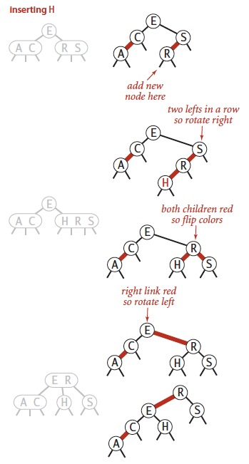 

### 5. 旋转与颜色变换过程总结

只要谨慎地使用左旋转、右旋转和颜色转换操作，就能够保证插入操作后红黑树和2-3树的一一对应关系。在沿着插入点到根节点的路径向上移动时，在所经过的每个节点中顺序完成以下操作，就能完成插入操作：

* 如果右子节点是红色的而左子节点是黑色的，进行左旋转
* 如果左子节点是红色的且它的左子节点也是红色的，进行右旋转
* 如果左右子节点均为红色，进行颜色转换

 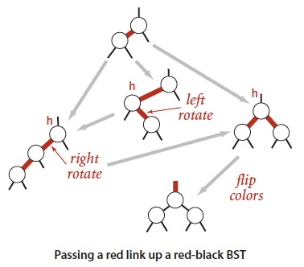 

### 6. 红黑树的性质

#### 1）一棵大小为N的红黑树的高度不会超过2lgN

* **简略的证明**：红黑树的最坏情况是它所对应的2-3树中构成最左边的路径节点全部都是3-节点而其余均为2-节点，最左边的路径长度是只包含2-节点的路径长度(\~lgN)的两倍（要按照某种顺序构造一棵平均路径长度为2lgN的最差红黑树虽然可能，但并不容易）

#### 2）一棵大小为N的红黑树中，根节点到任意节点的平均路径长度为\~1.00lgN

 

无论键的插入顺序如何，红黑树都”几乎是“完美平衡的(基本平衡):

  

 

 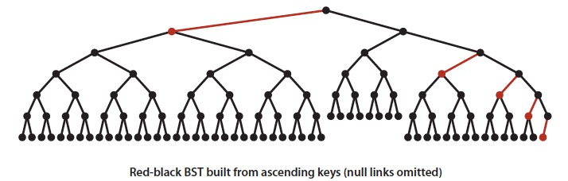 

