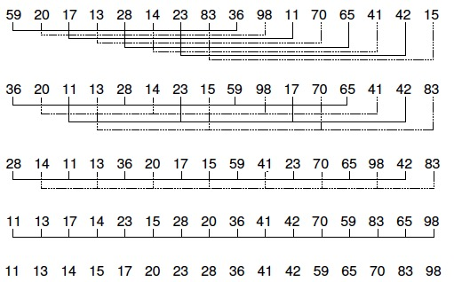
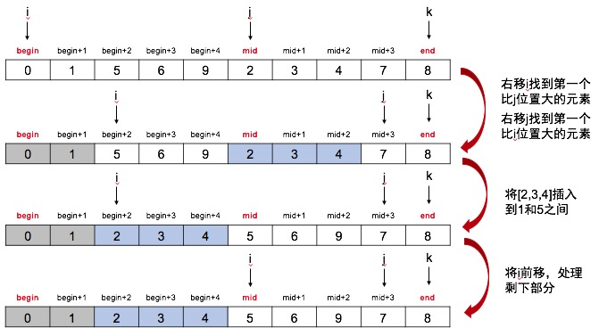
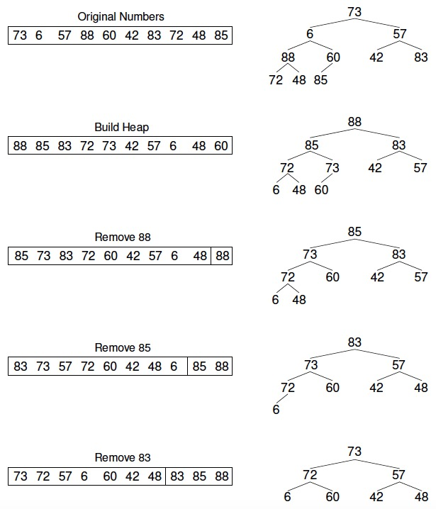
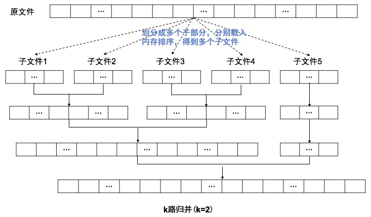

* **内排序**
    * [1.插入排序](#1插入排序)（稳定）
    * [2.冒泡排序](#2冒泡排序)（稳定）
    * [3.选择排序](#3选择排序)（不稳定）
    * [4.shell排序](#4shell排序)（不稳定）
    * [5.快速排序](#5快速排序)（不稳定）
    * [6.归并排序](#6归并排序)（稳定）
    * [7.堆排序](#7堆排序)（不稳定）
* **外排序**
    * [1.多路归并](#1多路归并)

> 稳定性：相同的元素在排序前和排序后的前后位置是否发生改变，没有改变则排序是稳定的，改变则排序是不稳定的 [——八大排序算法的稳定性](https://www.cnblogs.com/codingmylife/archive/2012/10/21/2732980.html)

<br>
<br>

## 1.插入排序

逐个处理待排序的记录，每个记录与前面已排序已排序的子序列进行比较，将它插入子序列中正确位置

### 代码

```c++
template<class Elem>
void inssort(Elem A[],int n)
{
    for(int i = 1;i < n;i++)
        for(int j = i;j >= 1 && A[j] < A[j-1];j--)
            swap(A,j,j-1);
}
```

### 性能

* 最佳：升序。时间复杂度为O(n)
* 最差：降序。时间复杂度为O(n^2)
* 平均：对于每个元素，前面有一半元素比它大。时间复杂度为O(n^2)

>如果待排序数据已经“基本有序”，使用插入排序可以获得接近O(n)的性能

### 优化

```c++
template<class Elem>
void inssort(Elem A[],int n)
{
    for(int i = 1;i < n;i++){
        int j = i;
        int tp = A[j];
        for(;j >= 1 && tp < A[j-1];j--)
            A[j] = A[j - 1];
        A[j] = tp;
    }
}
```

<br>

## 2.冒泡排序

从数组的底部比较到顶部，比较相邻元素。如果下面的元素更小则交换，否则，上面的元素继续往上比较。这个过程每次使最小元素像个“气泡”似地被推到数组的顶部

### 代码

```c++
template<class Elem>
void bubsort(Elem A[],int n)
{
    for(int i = 0;i < n - 1;i++)
        for(int j = n - 1;j > i;j--)
            if(A[j] < A[j-1])
                swap(A,j,j-1);
}
```

### 性能

冒泡排序是一种相对较慢的排序，没有较好的最佳情况执行时间。通常情况下时间复杂度都是O(n^2)

### 优化

增加一个变量flag，用于记录一次循环是否发生了交换，如果没发生交换说明已经有序，可以提前结束

<br>

## 3.选择排序

第i次“选择”数组中第i小的记录，并将该记录放到数组的第i个位置。换句话说，每次从未排序的序列中找到最小元素，放到未排序数组的最前面

### 代码

```c++
template<class Elem>
void selsort(Elem A[],int n)
{
    for(int i = 0;i < n - 1;i++){
        int lowindex = i;
        for(int j = i + 1;j < n;j++)
            if(A[j] < A[lowindex])
                lowindex = j;
        swap(A,i,lowindex);//n次交换
    }
}
```

### 性能

不管数组是否有序，在从未排序的序列中查找最小元素时，都需要遍历完最小序列，所以时间复杂度为O(n^2)

### 优化

每次内层除了找出一个最小值，同时找出一个最大值（初始为数组结尾）。将最小值与每次处理的初始位置的元素交换，将最大值与每次处理的末尾位置的元素交换。这样一次循环可以将数组规模减小2，相比于原有的方案（减小1）会更快

<br>

## 4.shell排序

shell排序在不相邻的元素之间比较和交换。利用了插入排序的最佳时间代价特性，它试图将待排序序列变成基本有序的，然后再用插入排序来完成排序工作

在执行每一次循环时，Shell排序把序列分为互不相连的子序列，并使各个子序列中的元素在整个数组中的间距相同，每个子序列用**插入排序**进行排序。每次循环增量是前一次循环的1/2，子序列元素是前一次循环的2倍

最后一轮将是一次“正常的”插入排序（即对包含所有元素的序列进行插入排序）



### 代码

```c++
const int INCRGAP = 3;

template<class Elem>
void shellsort(Elem A[],int n)
{
    for(int incr = n / INCRGAP;incr > 0;incr /= INCRGAP){//遍历所有增量大小
        for(int i = 0;i < incr;i++){
            /*对子序列进行插入排序，当增量为1时，对所有元素进行最后一次插入排序*/
            for(int j = i + incr;j < n;j += incr){
                for(int k = j; k > i && A[k] < A[k - incr];k -= incr){
                    swap(A,k,k - incr);
                }
            }
        }
    }
}
```

### 性能

选择适当的增量序列可使Shell排序比其他排序法更有效，一般来说，增量每次除以2时并没有多大效果，而“增量每次除以3”时效果更好

当选择“增量每次除以3”递减时，Shell排序的平均运行时间是O(n^(1.5))

<br>

## 5.快速排序

首先选择一个轴值，小于轴值的元素被放在数组中轴值左侧，大于轴值的元素被放在数组中轴值右侧，这称为数组的一个分割(partition)。快速排序再对轴值左右子数组分别进行类似的操作

选择轴值有多种方法。最简单的方法是使用首或尾元素。但是，如果输入的数组是正序或者逆序时，会将所有元素分到轴值的一边。较好的方法是随机选取轴值

### 代码

```c++
template <class Elem>
int partition(Elem A[],int i,int j)
{
    //这里选择尾元素作为轴值,轴值的选择可以设计为一个函数
    //如果选择的轴值不是尾元素，还需将轴值与尾元素交换
    int pivot = A[j];
    int l = i - 1;
    for(int r = i;r < j;r++)
        if(A[r] <= pivot)
            swap(A,++l,r);
    swap(A,++l,j);//将轴值从末尾与++l位置的元素交换
    return l;
}

template <class Elem>
void qsort(Elem A[],int i,int j)
{
    if(j <= i)  return;
    int p = partition<Elem>(A,i,j);
    qsort<Elem>(A,i,p - 1);
    qsort<Elem>(A,p + 1,j);
}
```

### 性能

* 最佳情况：O(nlogn)
* 平均情况：O(nlogn)
* 最差情况：每次处理将所有元素划分到轴值一侧，O(n^2)

> 快速排序平均情况下运行时间与其最佳情况下的运行时间很接近，而不是接近其最坏情况下的运行时间。**快速排序是所有内部排序算法中平均性能最优的排序算法**

### 优化

1. 最明显的改进之处是轴值的选取，如果轴值选取合适，每次处理可以将元素较均匀的划分到轴值两侧：

	**三者取中法**：三个随机值的中间一个。为了减少随机数生成器产生的延迟，可以选取首中尾三个元素作为随机值

2. 当n很小时，快速排序会很慢。因此当子数组小于某个长度（经验值：9）时，什么也不要做。此时数组已经基本有序，最后调用一次插入排序完成最后处理

<br>

## 6.归并排序

将一个序列分成两个长度相等的子序列，为每一个子序列排序，然后再将它们合并成一个序列。合并两个子序列的过程称为归并

### 代码

```c++
template<class Elem>
void mergesortcore(Elem A[],Elem temp[],int i,int j)
{
    if(i == j)  return;
    int mid = (i + j)/2;

    mergesortcore(A,temp,i,mid);
    mergesortcore(A,temp,mid + 1,j);

    /*归并*/
    int i1 = i,i2 = mid + 1,curr = i;
    while(i1 <= mid && i2 <= j){
        if(A[i1] < A[i2])
            temp[curr++] = A[i1++];
        else
            temp[curr++] = A[i2++];
    }
    while(i1 <= mid)
        temp[curr++] = A[i1++];
    while(i2 <= j)
        temp[curr++] = A[i2++];
    for(curr = i;curr <= j;curr++)
        A[curr] = temp[curr];
}

template<class Elem>
void mergesort(Elem A[],int sz)
{
    Elem *temp = new Elem[sz]();
    int i = 0,j = sz - 1;
    mergesortcore(A,temp,i,j);
    delete [] temp;
}
```

### 性能

logn层递归中，每一层都需要O(n)的时间代价，因此总的时间复杂度是O(nlogn)，该时间复杂度不依赖于待排序数组中数值的相对顺序。因此，是最佳，平均和最差情况下的运行时间

由于需要一个和带排序数组大小相同的辅助数组，所以空间代价为O(n)

### 优化

原地归并排序不需要辅助数组即可归并



```c++
void reverse(int *arr,int n)
{
    int i = 0,j = n - 1;
    while(i < j)
        swap(arr[i++],arr[j--]);
}

void exchange(int *arr,int sz,int left)
{
    reverse(arr,left);//翻转左边部分
    reverse(arr + left,sz - left);//翻转右边部分
    reverse(arr,sz);//翻转所有
}

void merge(int *arr,int begin,int mid,int end)
{
    int i = begin,j = mid,k = end;
    while(i < j && j <= k){
        int right = 0;
        while(i < j && arr[i] <= arr[j])
            ++i;
        while(j <= k && arr[j] <= arr[i]){
            ++j;
            ++right;
        }
        exchange(arr + i,j - i,j - i - right);
        i += right;
    }
}
```

<br>

## 7.堆排序

堆排序首先根据数组构建最大堆，然后每次“删除”堆顶元素（将堆顶元素移至末尾）。最后得到的序列就是从小到大排序的序列



### 代码

这里直接使用C++ STL中堆的构建与删除函数

```c++
template <class Elem>
void heapsort(Elem A[],int n)
{
    Elem mval;
    int end = n;
    make_heap(A,A + end);
    for(int i = 0;i < n;i++){
        pop_heap(A,A + end);
        end--;
    }
}
```

如果不能使用现成的库函数：

```c++
/********************************************
 * 向堆中插入元素
 *  hole：新元素所在的位置
 ********************************************/
template <class value>
void _push_heap(vector<value> &arr,int hole){
    value v = arr[hole];//取出新元素，从而产生一个空洞
    int parent = (hole - 1) / 2;
    //建最大堆，如果建最小堆换成 arr[parent] > value
    while(hole > 0 && arr[parent] < v){
        arr[hole] = arr[parent];
        hole = parent;
        parent = (hole - 1) / 2;
    }
    arr[hole] = v;
}

/********************************************
 * 删除堆顶元素
 ********************************************/
template <class value>
void _pop_heap(vector<value> &arr,int sz)
{
    value v = arr[sz - 1];
    arr[sz - 1] = arr[0];
    --sz;
    int hole = 0;
    int child = 2 * (hole + 1); //右孩子
    while(child < sz){
        if(arr[child] < arr[child - 1])
            --child;
        arr[hole] = arr[child];
        hole = child;
        child = 2 * (hole + 1);
    }
    if(child == sz){
        arr[hole] = arr[child - 1];
        hole = child - 1;
    }
    arr[hole] = v;
    _push_heap(arr,hole);
}

/********************************************
 * 建堆
 *  sz：删除堆顶元素后的大小
 *  v： 被堆顶元素占据的位置原来的元素的值
 ********************************************/
template <class value>
void _make_heap(vector<value> &arr)
{
    int sz = arr.size();
    int parent = (sz - 2) / 2;
    while(parent >= 0){
        int hole = parent;
        int child = 2 * (hole + 1); //右孩子
        value v = arr[hole];
        while(child < sz){
            if(arr[child] < arr[child - 1])
                --child;
            arr[hole] = arr[child];
            hole = child;
            child = 2 * (hole + 1);
        }
        if(child == sz){
            arr[hole] = arr[child - 1];
            hole = child - 1;
        }
        arr[hole] = v;
        _push_heap(arr,hole);
        --parent;
    }
}

template <class value>
void heap_sort(vector<value> &arr)
{
    _make_heap(arr);
    for(int sz = arr.size();sz > 1;sz--)
        _pop_heap(arr,sz);
}
```

### 性能

根据已有数组构建堆需要O(n)的时间复杂度，每次删除堆顶元素需要O(logn)的时间复杂度，所以总的时间开销为，O(n+nlogn)，平均时间复杂度为O(nlogn)

>注意根据已有元素建堆是很快的，如果希望找到数组中第k大的元素，可以用O(n+klogn)的时间，如果k很小，时间开销接近O(n)

<br>

## 1.多路归并

多路归并是**外部排序最常用**的算法：**将原文件分解成多个能够一次性装入内存的部分，分别把每一部分调入内存完成排序。然后，对已经排序的子文件进行归并排序**



### k的选择

假设总共m个子文件，每次归并k个子文件，那么一共需要归并  次（扫描磁盘），在k个元素中找出最小值（或最大值）需要比较k-1次。如果总记录数为N，所以时间复杂度就是 Nlog_km=\frac{(k-1)}{logk}Nlogm$)， 由于 }{logk}$) 随k的增大而增大，所以比较次数的增加会逐步抵消“低扫描次数”带来的性能增益，所以对于k值的选择，主要涉及两个问题：

1. **每一轮归并会将结果写回到磁盘，那么k越小，磁盘与内存之间数据的传输就会越多，增大k可以较少扫描次数**
2. **k个元素中选取最小的元素需要比较k-1次，如果k越大，比较的次数就会越大**

### 优化

可以利用下列方法**减少比较次数**：

1. **败者树**
2. **建堆**：使用一个k个元素的数组，第一次将k个文件中最小的元素读入数组（并且记录每个元素来自哪个文件），然后建最小堆，将堆顶元素删除，并从堆顶元素的源文件中取出下一个数，插入堆中，调整后重复上述操作。虽然第一次需要遍历k个文件取出最小元素，加上建堆需要一定时间，但是后续操作可以很快完成
