> 题目来源：《剑指offer》、leetcode、lintcode、hihocoder、《王道程序员求职宝典》

| 一 | 二 | 三  | 四 | 五 | 六 | 七  | 八 | 九 | 十 |
|:--:|:--:|:--:|:--:|:--:|:--:|:--:|:--:|:--:|:--:|
|[数组](#array)|[字符串](#string)|[链表](#list)|[树](#tree)|[栈和队列](#stackdeque)|[数学](#math)|[图](#graph)|[设计](#design)|[海量数据](#bigdata)|[C/C++基础](#cfunction)|

<h2 id="array"></h2>

* **一.数组**
    - *二分查找*
        + Leetcode35：[查找插入位置](#查找插入位置)（`二分查找` `easy`）
        + 《剑指offer》面试题11：[旋转数组的最小数字](#旋转数组的最小数字)（`二分查找`）
        + Leetcode33：[旋转数组中查找数字](#旋转数组中查找数字)（`二分查找` `medium`）
        + Leetcode81：[旋转数组中查找数字II](#旋转数组中查找数字ii)（`二分查找` `medium`）
        + 《剑指offer》面试题53(题目一)：[有序数组中查找数字的范围](#有序数组中查找数字的范围)（`二分查找`）
        + 《剑指offer》面试题53(题目二)：[缺失的数字](#缺失的数字)（`二分查找`）
        + 《剑指offer》面试题53(题目三)：[数组中数值和下标相等的元素](#数组中数值和下标相等的元素)（`二分查找`）
        + Leetcode162：[查找数组中任一峰值的下标](#查找数组中任一峰值的下标)（`二分查找` `medium`）
        + Leetcode4：[两个排序数组的中值](#两个排序数组的中值)（`二分查找` `hard`）
    - *其它查找*
        + Leetcode41：[缺失的第一个正数](#缺失的第一个正数)（`交换` `hard`）
        + Leetcode287：[寻找数组中重复的数](#寻找数组中重复的数)（`二分查找` `链表` `medium`）
        + Leetcode268：[0~n中缺失的数字](#0n中缺失的数字)（`位运算` `easy`）
        + Leetcode136：[只出现1次的数字](#只出现1次的数字)（`位运算` `easy`）
        + 《剑指offer》面试题56(题目一)：[数组中只出现1次的2个数](#数组中只出现1次的2个数)（`位运算`）
        + 《剑指offer》面试题56(题目二)：[数组中唯一只出现1次的数字](#数组中唯一只出现1次的数字)（`位运算`）
        + 《剑指offer》面试题41：[数据流的中位数](#数据流的中位数)（`堆`）
        + 《剑指offer》面试题57(题目一)：[和为s的两个数字](#和为s的两个数字)（`双指针`）
        + 《剑指offer》面试题57(题目二)：[和为s的连续正数序列](#和为s的连续正数序列)（`双指针`）
        + Leetcode217：[判断数组是否包含重复元素](#判断数组是否包含重复元素)（`哈希表` `easy`）
        + Leetcode1：[两数之和](#两数之和)（`哈希表` `easy`）
        + Leetcode15：[三数之和](#三数之和)（`排序` `双指针` `medium`）
        + Leetcode18：[四数之和](#四数之和)（`排序` `双指针` `medium`）
        + Leetcode454：[四数之和II](#四数之和ii)（`哈希表` `medium`）
        + 《剑指offer》面试题39：[数组中出现次数超过一半的数字](#数组中出现次数超过一半的数字)（`partition`）
        + 《剑指offer》面试题40：[数组中最小的k个数](#数组中最小的k个数)（`partition` `海量数据`）
        + Leetcode347：[出现频率最高的k个数字](#出现频率最高的k个数字)（`medium`）
        + Leetcode350：[两个数组的交集II](#两个数组的交集ii)（`easy`）
    - *数组操作*
        + Leetcode26：[删除排序数组中的重复项](#删除排序数组中的重复项)（`双指针` `easy`）
        + Leetcode27：[删除数组中值为val的元素](#删除数组中值为val的元素)（`双指针` `easy`）
        + Leetcode189：[旋转数组](#旋转数组)（`easy`）
        + Leetcode283：[将数组中的零移到尾部](#将数组中的零移到尾部)（`easy`）
    - *子数组与连续子数组*
        + 《剑指offer》面试题42：[连续子数组的最大和](#连续子数组的最大和)（`动态规划`）
        + Leetcode152：[连续子数组的最大积](#连续子数组的最大积)（`动态规划` `medium`）
        + Leetcode128：[最长连续序列](#最长连续序列)（`哈希表` `hard`）
        + Leetcode300：[最长升序子序列](#最长升序子序列)（`动态规划` `medium`）
        + Leetcode334：[数组的三元升序子序列](#数组的三元升序子序列)（`medium`）
    - *排列组合*
        + 《剑指offer》面试题38(相关题一)：[正方体顶点上放数字](#正方体顶点上放数字)（`全排列`）
        + 《剑指offer》面试题38(相关题二)：[八皇后](#八皇后)（`全排列`）
        + Leetcode52：[N皇后II](#n皇后ii)（`全排列` `hard`）
        + Leetcode51：[N皇后](#n皇后)（`全排列` `hard`）
        + Leetcode31：[下一个排列](#下一个排列)（`排列` `medium`）
        + Leetcode60：[第K个排列](#第k个排列)（`排列` `medium`）
        + Leetcode46：[不含重复元素数组的全排列](#不含重复元素数组的全排列)（`全排列` `medium`）
        + Leetcode47：[含重复元素数组的全排列](#含重复元素数组的全排列)（`全排列` `medium`）
        + Leetcode77：[1~n中所有k个数的组合](#1n中所有k个数的组合)（`组合` `medium`）
        + Leetcode78：[不含重复元素集合的所有子集](#不含重复元素集合的所有子集)（`组合` `medium`）
        + Leetcode90：[含重复元素集合的所有子集](#含重复元素集合的所有子集)（`组合` `medium`）
        + Leetcode39：[和为target的数字组合](#和为target的数字组合)（`组合` `medium`）
        + Leetcode40：[和为target的数字组合II](#和为target的数字组合ii)（`组合` `medium`）
    - *排序*
        + 《剑指offer》面试题21：[调整数组顺序使奇数位于偶数前面](#调整数组顺序使奇数位于偶数前面)（`partition`)
        + 《剑指offer》面试题61：[扑克牌中的顺子](#扑克牌中的顺子)
        + Leetcode75：[颜色分类](#颜色分类)（`medium`）
        + Leetcode179：[将一组数拼接成最大数字](#将一组数拼接成最大数字)（`medium`）
        + Leetcode88：[合并两个有序数组](#合并两个有序数组)（`归并` `easy`）
        + 《剑指offer》面试题51：[数组中的逆序对](#数组中的逆序对)（`归并`）
        + Leetcode315：[计算右侧小于当前元素的个数](#计算右侧小于当前元素的个数)（`归并` `BST` `hard`）
        + Leetcode324：[摆动排序](#摆动排序)（`medium`）
        + Leetcode384：[打乱数组](#打乱数组)（`Fisher–Yates shuffle洗牌算法` `medium`）
    - *场景*
        + Leetcode134：[加油站](#加油站)（`贪心` `medium`）
        + Leetcode121：[买卖股票的最佳时机](#买卖股票的最佳时机)（`easy`）
        + Leetcode122：[买卖股票的最佳时机II](#买卖股票的最佳时机ii)（`贪心` `easy`）
        + Leetcode123：[买卖股票的最佳时机III](#买卖股票的最佳时机iii)（`动态规划` `hard`）
        + Leetcode188：[买卖股票的最佳时机IV](#买卖股票的最佳时机iv)（`动态规划` `hard`）
        + Leetcode198：[打家劫舍](#打家劫舍)（`动态规划` `easy`）
        + Leetcode213：[打家劫舍II](#打家劫舍ii)（`动态规划` `medium`）
        + Leetcode337：[打家劫舍III](#打家劫舍iii)（`动态规划` `medium`）
        + Leetcode322：[找钱](#找钱)（`动态规划` `medium`）
        + 拼多多内推笔试：[装载货物的最少货车数量](#装载货物的最少货车数量)（`贪心`）
    - *二维数组*
        + 《剑指offer》面试题4：[二维数组中的查找](#二维数组中的查找)
        + Leetcode378：[有序矩阵中第K小的元素](#有序矩阵中第k小的元素)（`优先队列` `二分查找` `medium`）
        + 《剑指offer》面试题29：[顺时针打印矩阵](#顺时针打印矩阵)
        + Leetcode48：[90度旋转图片](#90度旋转图片)（`medium`）
        + 《剑指offer》面试题66：[构建乘积数组](#构建乘积数组)
        + Leetcode73：[矩阵置零](#矩阵置零)（`medium`）
        + Leetcode289：[细胞自动机的下一个状态](#细胞自动机的下一个状态)（`位运算` `medium`）

<h2 id="string"></h2>

* **二.字符串**
    - *字符串与数字*
        + 《剑指offer》面试题20：[判断字符串是否表示一个数值](#判断字符串是否表示一个数值)（`鲁棒性`）
        + 《剑指offer》面试题67：[把字符串转换成整数](#把字符串转换成整数)（`鲁棒性`）
    - *字符查找*
        + 《剑指offer》面试题50(题目一)：[字符串中第一个只出现一次的字符](#字符串中第一个只出现一次的字符)（`哈希表`）
        + 《剑指offer》面试题50(题目二)：[字符流中第一个只出现一次的字符](#字符流中第一个只出现一次的字符)（`哈希表`）
    - *翻转*
        + 《剑指offer》面试题58(题目一)：[翻转单词顺序](#翻转单词顺序)
        + 《剑指offer》面试题58(题目二)：[左旋转字符串](#左旋转字符串)
        + Leetcode344：[翻转字符串](#翻转字符串)（`双指针` `easy`）
    - *排列组合*
        + 《剑指offer》面试题38：[字符串的排列](#字符串的排列)（`排列`）
        + 《剑指offer》面试题38(扩展)：[求字符的所有组合](#求字符的所有组合)（`组合`）
    - *删除替换*
        + 《剑指offer》面试题5：[替换空格](#替换空格)
        + Leetcode71：[简化路径](#简化路径)（`medium`）
    - *异位词*
        + Leetcode49：[字母异位词分组](#字母异位词分组)（`排序` `哈希表` `medium`）
        + Leetcode242：[有效的字母异位词](#有效的字母异位词)（`排序` `哈希表` `easy`）
    - *单词查找*
        + 《剑指offer》面试题12：[单词搜索](#单词搜索)（`DFS`）
        + Leetcode212：[单词搜索II](#单词搜索ii)（`Trie` `DFS` `hard`）
    - *字符串转换*
        + Leetcode91：[数字字符串解码](#数字字符串解码)（`动态规划` `medium`）
        + Leetcode127：[单词阶梯](#单词阶梯)（`BFS` `medium`）
        + Lintcode119：[单词转换的最少次数](#单词转换的最少次数)（`动态规划` `medium`）
    - *子串与子序列*
        + Leetcode28：[子串查找](#子串查找)（`KMP` `easy`）
        + Leetcode3：[不含重复字符的最长子串](#不含重复字符的最长子串)（`滑动窗口` `哈希表` `medium`）
        + Leetcode395：[至少有K个重复字符的最长子串](#至少有k个重复字符的最长子串)（`二分法` `哈希表` `medium`）
        + Leetcode76：[最小覆盖子串](#最小覆盖子串)（`滑动窗口` `哈希表` `hard`）
        + Leetcode30：[所有单词相连的子串](#所有单词相连的子串)（`哈希表` `hard`）
        + Leetcode5：[最长回文子串](#最长回文子串)（`动态规划` `medium`）
        + Leetcode125：[判断字符串是否是回文串](#判断字符串是否是回文串)（`双指针` `easy`）
    - *字符串拆分*
        + Leetcode131：[分割回文串](#分割回文串)（`动态规划` `DFS` `medium`）
        + Leetcode139：[单词拆分I](#单词拆分i)（`动态规划` `medium`）
        + Leetcode140：[单词拆分II](#单词拆分ii)（`动态规划` `hard`）
    - *字符串匹配*
        + Leetcode10：[正则表达式匹配](#正则表达式匹配)（`动态规划` `hard`）
        + Leetcode44：[通配符匹配](#通配符匹配)（`动态规划` `hard`）
    - *最长公共问题*
        + Lintcode77：[两个字符串的最长公共子序列](#两个字符串的最长公共子序列)（`动态规划` `medium`）
        + Lintcode79：[两个字符串的最长公共子串](#两个字符串的最长公共子串)（`动态规划` `medium`）
        + Leetcode14：[多个字符串的最长公共前缀](#多个字符串的最长公共前缀)（`扫描` `分治` `二分查找` `Trie` `easy`）

<h2 id="list"></h2>

* **三.链表**
    - *遍历*
        + 《剑指offer》面试题6：[从尾到头打印链表](#从尾到头打印链表)（`栈`）
        + Leetcode234：[回文链表](#回文链表)（`栈` `easy`）
        + 《剑指offer》面试题22：[链表中倒数第k个节点](#链表中倒数第k个节点)（`双指针`）
        + Leetcode19：[删除链表倒数第n个节点](#删除链表倒数第n个节点)（`双指针` `鲁棒性` `medium`）
        + 《剑指offer》面试题22(相关题)：[链表的中间节点](#链表的中间节点)（`双指针`）
        + Leetcode141：[判断链表是否有环](#判断链表是否有环)（`双指针` `easy`）
        + 《剑指offer》面试题23：[链表中环的入口节点](#链表中环的入口节点)（`双指针`）
    - *节点删除*
        + 《剑指offer》面试题18(题目一)：[删除链表中的节点](#删除链表中的节点)
        + Leetcode203：[删除链表中等于给定值的所有节点](#删除链表中等于给定值的所有节点)（`鲁棒性` `easy`）
        + Leetcode83：[删除有序链表中的重复节点](#删除有序链表中的重复节点)（`easy`）
        + 《剑指offer》面试题18(题目二)：[删除有序链表中的重复节点II](#删除有序链表中的重复节点ii)（`鲁棒性` `medium`）
        + 《剑指offer》面试题62：[圆圈中最后剩下的数](#圆圈中最后剩下的数)
        + 腾讯面试题：[实现双链表节点删除函数](#实现双链表节点删除函数)（`鲁棒性`）
    - *单链表处理*
        + 《剑指offer》面试题24：[反转链表](#反转链表)（`栈`）
        + 《剑指offer》面试题35：[复杂链表的复制](#复杂链表的复制)
        + Leetcode61：[旋转链表](#旋转链表)（`medium`）
        + Leetcode24：[成对交换链表的节点](#成对交换链表的节点)（`鲁棒性` `medium`）
        + Leetcode25：[K个一组翻转链表](#k个一组翻转链表)（`鲁棒性` `hard`）
        + Leetcode148：[链表节点排序](#链表节点排序)（`分治归并` `medium`）
        + Leetcode328：[将链表偶数位置的节点移至尾部](#将链表偶数位置的节点移至尾部)（`medium`）
    - *多链表处理*
        + Leetcode2：[两数相加](#两数相加)（`数学` `medium`）
        + 《剑指offer》面试题25：[合并两个有序链表](#合并两个有序链表)
        + Leetcode23：[合并k个有序链表](#合并k个有序链表)（`多路归并` `堆` `分治` `hard`）
        + 《剑指offer》面试题52：[两个链表的第一个公共节点](#两个链表的第一个公共节点)（`双指针`）

<h2 id="tree"></h2>

* **四.树**
    - *遍历*
        + 《剑指offer》面试题7：[重建二叉树](#重建二叉树)（`前序` `中序`）
        + 《剑指offer》面试题8：[中序遍历的下一个节点](#中序遍历的下一个节点)（`中序`）
        + 《剑指offer》面试题26：[树的子结构](#树的子结构)（`前序`）
        + 《剑指offer》面试题37：[序列化二叉树](#序列化二叉树)（`前序`）
        + Leetcode94：[输出二叉树的中序遍历序列](#输出二叉树的中序遍历序列)（`中序` `递归` `迭代` `medium`）
        + Leetcode98：[判断一棵二叉树是否是BST](#判断一棵二叉树是否是bst)（`BST` `中序` `medium`）
        + 《剑指offer》面试题33：[BST的后序遍历序列](#bst的后序遍历序列)（`BST` `后序`）
        + 《剑指offer》面试题36：[BST转双链表](#bst转双链表)（`BST` `中序` `双链表`）
        + Leetcode108：[有序数组转BST](#有序数组转bst)（`BST` `分治` `easy`）
        + Leetcode109：[单链表转BST](#单链表转bst)（`BST` `中序` `单链表` `medium`）
        + 《剑指offer》面试题54：[BST第k小的节点](#bst第k小的节点)（`BST` `中序`）
        + Leetcode116：[填充同一层的兄弟节点](#填充同一层的兄弟节点)（`BFS` `前序` `medium`）
        + 《剑指offer》面试题32(题目一)：[按层不分行输出二叉树](#按层不分行输出二叉树)（`BFS`）
        + 《剑指offer》面试题32(题目二)：[按层分行输出二叉树](#按层分行输出二叉树)（`BFS`）
        + 《剑指offer》面试题32(题目三)：[之字形打印二叉树](#之字形打印二叉树)（`BFS` `栈`）
    - *对称二叉树*
        + 《剑指offer》面试题27：[二叉树的镜像](#二叉树的镜像)（`递归` `迭代`）
        + 《剑指offer》面试题28：[对称的二叉树](#对称的二叉树)（`递归` `迭代`）
    - *路径*
        + 《剑指offer》面试题34：[二叉树中和为某一值的路径](#二叉树中和为某一值的路径)（`回溯`）
        + Leetcode124：[二叉树的最大路径和](#二叉树的最大路径和)（`动态规划` `后序` `hard`）
        + Leetcode863：[二叉树中与target距离为K的结点](#二叉树中与target距离为k的结点)（`DFS(前序)` `BFS` `medium`）
    - *深度*
        + 《剑指offer》面试题55(题目一)：[二叉树的深度](#二叉树的深度)（`递归`）
        + 《剑指offer》面试题55(题目二)：[平衡二叉树AVL](#平衡二叉树avl)（`后序`）
    - *公共祖先*
        + 《剑指offer》面试题68：[两个节点的最低公共祖先](#两个节点的最低公共祖先)

<h2 id="stackdeque"></h2>

* **五.栈和队列**
    - *设计*
        + 《剑指offer》面试题9：[用两个栈实现队列](#用两个栈实现队列)（`栈` `队列`）
        + 《剑指offer》面试题9(相关题)：[用两个队列实现栈](#用两个队列实现栈)（`栈` `队列`）
        + 《剑指offer》面试题30：[包含min函数的栈](#包含min函数的栈)（`栈`）
        + 《剑指offer》面试题59(题目二)：[包含max函数的队列](#包含max函数的队列)（`队列`）
    - *其它*
        + 《剑指offer》面试题31：[栈的压入弹出序列](#栈的压入弹出序列)（`栈`）
        + Leetcode20：[有效的括号](#有效的括号)（`栈` `easy`）
        + Leetcode32：[最长有效括号](#最长有效括号)（`栈` `hard`）
        + 《剑指offer》面试题59(题目一)：[滑动窗口的最大值](#滑动窗口的最大值)（`队列`）

<h2 id="math"></h2>

* **六.数学**
    - *斐波那契数列*
        + 《剑指offer》面试题10(题目一)：[斐波那契数列](#斐波那契数列)（`动态规划`）
        + 《剑指offer》面试题10(题目二)：[跳台阶](#跳台阶)（`动态规划`）
        + 《剑指offer》面试题10(题目三)：[变态跳台阶](#变态跳台阶)（`动态规划`）
        + 《剑指offer》面试题10(题目四)：[矩形覆盖](#矩形覆盖)（`动态规划`）
    - *特殊*
        + 《剑指offer》面试题49：[丑数](#丑数)
        + Leetcode36：[有效数独](#有效数独)（`哈希表` `medium`）
        + Leetcode204：[计数质数](#计数质数)（`easy`）
        + Leetcode279：[完美平方数](#完美平方数)（`动态规划` `medium`）
    - *进制*
        + 《剑指offer》面试题15：[二进制中1的个数](#二进制中1的个数)（`位运算`）
        + Leetcode7：[反转整数](#反转整数)（`鲁棒性` `easy`）
        + Leetcode43：[字符串相乘](#字符串相乘)（`鲁棒性` `medium`）
        + Leetcode66：[数组表示的数字加1](#数组表示的数字加1)（`easy`）
        + Leetcode171：[Excel表列序号（26进制转10进制）](#excel表列序号)（`easy`）
        + Leetcode190：[颠倒二进制位](#颠倒二进制位)（`位运算` `easy`）
    - *倍数约数*
        + Leetcode412：[Fizz Buzz](#fizz-buzz)（`easy`）
    - *次方与小数*
        + 《剑指offer》面试题16：[数值的整数次方](#数值的整数次方)（`位运算` `鲁棒性`）
        + Leetcode69：[求x的平方根](#求x的平方根)（`二分查找` `鲁棒性` `easy`）
        + Leetcode166：[求分数的值](#求分数的值)（`鲁棒性` `medium`）
        + Leetcode326：[3的幂](#3的幂)（`easy`）
    - *找规律*
        + 《剑指offer》面试题43：[整数1~n中1出现的次数](#整数1n中1出现的次数)
        + Leetcode38：[报数](#报数)（`字符串` `easy`）
        + Leetcode172：[阶乘后的零](#阶乘后的零)（`鲁棒性` `easy`）
    - *条件限制*
        + 《剑指offer》面试题64：[求1~n的和](#求1n的和)
        + 《剑指offer》面试题65：[不用加减乘除做加法](#不用加减乘除做加法)（`位运算`）
        + Leetcode29：[不用乘除取模实现整数除法](#不用乘除取模实现整数除法)（`位运算` `medium`）
    - *表达式求值*
        + Leetcode150：[逆波兰表达式求值](#逆波兰表达式求值)（`栈` `medium`）
        + Leetcode227：[基础的计算器](#基础的计算器)（`medium`）
    - *几何*
        + Leetcode11：[盛最多水的容器](#盛最多水的容器)（`双指针` `medium`）
        + Leetcode42：[接雨水](#接雨水)（`hard`）
        + Leetcode55：[合并区间](#合并区间)（`medium`）
        + Leetcode84：[柱状图中最大的矩形](#柱状图中最大的矩形)（`栈` `hard`）
        + Leetcode149：[直线上最多的点数](#直线上最多的点数)（`哈希` `hard`）
        + Leetcode218：[天际线问题](#天际线问题)（`hard`）

<h2 id="graph"></h2>

* **七.图**
    - *遍历*
        + 《剑指offer》面试题13：[机器人的运动范围](#机器人的运动范围)（`DFS`）
        + Leetcode62：[左上角到右下角的路径数](#左上角到右下角的路径数)（`DFS` `动态规划` `medium`）
        + Leetcode63：[左上角到右下角的路径数II](#左上角到右下角的路径数ii)（`DFS` `动态规划` `medium` ）
        + Leetcode64：[左上角到右下角的最短路径](#左上角到右下角的最短路径)（`DFS` `动态规划` `medium` ）
        + Leetcode130：[被包围的区域](#被包围的区域)（`DFS` `medium`）
        + Leetcode200：[岛屿的数量](#岛屿的数量)（`DFS` `easy`）
        + Leetcode695：[岛屿的最大面积](#岛屿的最大面积)（`DFS` `easy`）
        + Leetcode329：[矩阵中的最长递增路径](#矩阵中的最长递增路径)（`DFS` `动态规划` `hard`）
        + Leetcode55：[跳步游戏](#跳步游戏)（`贪心` `medium`）
        + Leetcode45：[跳步游戏II](#跳步游戏ii)（`动态规划` `BFS` `hard`）
    - *拓扑排序*
        + Leetcode207：[课程安排](#课程安排)（`BFS` `DFS` `medium`）
        + Leetcode210：[课程安排II](#课程安排ii)（`BFS` `DFS` `medium`）
    - *最短路径*
        + hihoCoder1081：[Dijkstra算法](#dijkstra算法)（`dijkstra` `Lv.2`）
    - *最小生成树*
        + hihoCoder1097：[连通所有城市的最短道路](#连通所有城市的最短道路)（`prim` `Lv.2`）

<h2 id="design"></h2>

* **八.设计**
    - Leetcode146：[LRU缓存机制](#lru缓存机制)（`哈希表` `链表` `hard`）
    - Leetcode208：[实现Trie树(前缀树)](#实现trie树)（`Trie` `设计` `medium`）
    - Leetcode341：[扁平化嵌套列表迭代器](#扁平化嵌套列表迭代器)（`栈` `medium`）
    - Leetcode380：[实现O(1)的插入删除与随机获取](#实现o1的插入删除与随机获取)（`哈希表` `medium`）

<h2 id="bigdata"></h2>

* **九.海量数据**
    - *公共部分*
        + 《王道程序员求职宝典》：[两个文件共同的url](#两个文件共同的url)（`hash` `分治`）
    - *频率最高*
        + 《王道程序员求职宝典》：[按频率排序多个文件中的query记录](#按频率排序多个文件中的query记录)（`hash` `分治`）
        + 《王道程序员求职宝典》：[找出文件中频率最高的100个词](#找出文件中频率最高的100个词)（`Top K` `hash` `分治`）
        + 《王道程序员求职宝典》：[海量日志中提取访问百度次数最多的IP](#海量日志中提取访问百度次数最多的ip)（`Top K` `hash` `分治`）
    - *中位数*
        + BAT面试经典题：[100亿个整数的中位数](#100亿个整数的中位数)（`二分查找` `分桶`）
    - *位图*
        + 《王道程序员求职宝典》：[实现位图](#实现位图)（`位图`）
        + 《王道程序员求职宝典》：[统计不同号码的个数](#统计不同号码的个数)（`位图`）
        + 《王道程序员求职宝典》：[查找某个数是否在40亿个数当中](#查找某个数是否在40亿个数当中)（`位图`）
        + 《王道程序员求职宝典》：[2.5亿整数中只出现一次的整数](#25亿整数中只出现一次的整数)（`位图`）
    - *其它*
        + 《王道程序员求职宝典》：[布隆过滤器](#布隆过滤器)
        + 《王道程序员求职宝典》：[倒排索引法](#倒排索引法)

<h2 id="cfunction"></h2>

* **十.C/C++基础**
    - *C库函数*
        + [实现strlen](#1实现strlen)
        + [实现strcmp](#2实现strcmp)
        + [实现strcat](#3实现strcat)
        + [实现strcpy](#4实现strcpy)
        + [实现strstr](#子串查找)
        + [实现memcpy](#1实现memcpy)
    - *结构体与联合*
        + [实现一个函数确定主机字节序](#1实现一个函数确定主机字节序)
        + [实现计算结构体成员偏移量的宏](#2实现计算结构体成员偏移量的宏)
    - *动态内存管理*
        + [手写实现智能指针](#手写实现智能指针)

<br>
<br>
<br>
<br>
<br>
<br>
<br>

## 数组中重复的数字

[OJ链接](https://www.nowcoder.com/practice/623a5ac0ea5b4e5f95552655361ae0a8?tpId=13&tqId=11203&tPage=3&rp=2&ru=%2Fta%2Fcoding-interviews&qru=%2Fta%2Fcoding-interviews%2Fquestion-ranking)

在一个长度为n的数组里的所有数字都在`0~n-1`的范围内。 数组中某些数字是重复的，但不知道有几个数字是重复的。也不知道每个数字重复几次。请找出数组中任意一个重复的数字

例如，如果输入长度为7的数组`{2,3,1,0,2,5,3}`，那么对应的输出是第一个重复的数字`2`

### 解答

1. **排序**（时间:O(nlogn)，空间:O(1)：先排序，然后遍历数组找到第一个重复的数字即可
2. **哈希表**（时间:O(n)，空间:O(n)）：扫描数组，使用哈希表统计每个数字出现的次数，当统计到一个以前出现过的数字时，找到重复
3. **交换**（时间:O(n)，空间:O(1)）：如果位置i的数字m不等于i，与位置m的数字比较
    - 如果位置m的数字不等于m，那么交换，直到位置i的数字等于i或位置m的数字等于m
    - 如果位置m的数字等于m，说明数字m存在重复
    ```c++
    class Solution {
    public:
        // Parameters:
        //        numbers:     an array of integers
        //        length:      the length of array numbers
        //        duplication: (Output) the duplicated number in the array number
        // Return value:       true if the input is valid, and there are some duplications in the array number
        //                     otherwise false
        bool duplicate(int numbers[], int length, int* duplication) {
            if(length <= 2)
                return false;
            for(int i = 0;i < length;i++){
                while(numbers[i] != i){
                    int m = numbers[i];
                    if(m < 0 || m >= length)
                        return false;
                    if(m == numbers[m]){
                        *duplication = m;
                        return true;
                    }
                    numbers[i] = numbers[m];
                    numbers[m] = m;
                }
            }
            return false;
        }
    };
    ```
4. **位图**：当数据量特别大时可以使用位图，相比于哈希表，更节省空间

<br>
<br>

## 旋转数组的最小数字

[OJ链接](https://www.nowcoder.com/practice/9f3231a991af4f55b95579b44b7a01ba?tpId=13&tqId=11159&tPage=1&rp=2&ru=%2Fta%2Fcoding-interviews&qru=%2Fta%2Fcoding-interviews%2Fquestion-ranking)

把一个数组最开始的若干个元素搬到数组的末尾，我们称之为数组的旋转。 输入一个非递减排序的数组的一个旋转，输出旋转数组的最小元素

例如数组`{3,4,5,1,2}`为`{1,2,3,4,5}`的一个旋转，该数组的最小值为`1`

NOTE：给出的所有元素都大于`0`，若数组大小为`0`，请返回`0`

### 解答

```c++
class Solution {
public:
    int minNumberInRotateArray(vector<int> rotateArray) {
        if(rotateArray.size() == 0)
            return 0;
        if(rotateArray.size() == 1)
            return rotateArray[0];
        
        int sz = rotateArray.size();
        int l = 0,r = sz - 1;
        //如果没有旋转，不会进入循环，这样初始化会直接返回最左边元素
        int mid = l;
        while(rotateArray[r] <= rotateArray[l]){
            if(r - l == 1){
                mid = r;
                break;
            }
            mid = (l + r) >> 1;
            //如果首尾元素以及中间元素相等，那么没有办法判断中间元素到底是在左半部分还是右半部分，这时只能用顺序查找
            if(rotateArray[l] == rotateArray[r] && rotateArray[l] == rotateArray[mid]){
                int min = rotateArray[0];
                for(int i = 1;i < sz;i++){
                    if(rotateArray[i] < min) 
                        min = rotateArray[i];
                }
                return min;
            }
            if(rotateArray[mid] >= rotateArray[l])
                l = mid;
            else if(rotateArray[mid] <= rotateArray[r])
                r = mid;
        }
        return rotateArray[mid];
    }
};
```

<br>
<br>

## 旋转数组中查找数字

[OJ链接](https://leetcode.com/problems/search-in-rotated-sorted-array/description/)

假设按照升序排序的数组在预先未知的某个点上进行了旋转。

( 例如，数组 `[0,1,2,4,5,6,7]` 可能变为 `[4,5,6,7,0,1,2]` )。

搜索一个给定的目标值，如果数组中存在这个目标值，则返回它的索引，否则返回 `-1` 。

你可以假设数组中不存在重复的元素。

你的算法时间复杂度必须是 O(log n) 级别。

示例 1:

```
输入: nums = [4,5,6,7,0,1,2], target = 0
输出: 4
```

示例 2:

```
输入: nums = [4,5,6,7,0,1,2], target = 3
输出: -1
```

### 解答

* 首先，如果`nums[mid] == target`，那么找到目标元素，返回`mid`
* `如果nums[l] < nums[r]`，说明`l~r`范围的元素有序，那么执行正常的二分查找
* 否则，根据`mid`位置的值判断`mid`是在左半部分还是右半部分
    - 如果`nums[mid] ≥ nums[l]`，说明`mid`在左半部分
        - 当`target > nums[r] && target < nums[mid]`，那么`target`只可能出现在`mid`的左边，因此在`mid`左边继续查找
        - 否则，`target`只可能出现在`mid`的右边，因此在`mid`右边继续查找
    * 否则，`mid`在右半部分
        - 当`target > nums[mid] && target < nums[l]`，那么`target`只可能出现在`mid`的右边，因此在`mid`右边继续查找
        - 否则，`target`只可能出现在`mid`的左边，因此在`mid`左边继续查找

```c++
class Solution {
public:
    int search(vector<int>& nums, int target) {
        int l = 0,r = nums.size() - 1;
        while(l <= r){
            int mid = (l + r) / 2;
            if(nums[mid] == target) return mid;
            if(nums[l] < nums[r]){
                if(nums[mid] < target)   l = mid + 1;
                else                     r = mid - 1;
            }
            else{
                if(nums[mid] >= nums[l]){//mid在左边
                    if(target > nums[r] && target < nums[mid])  r = mid - 1;
                    else    l = mid + 1;
                }
                else{//mid在右边
                    if(target > nums[mid] && target < nums[l])  l = mid + 1;
                    else    r = mid - 1;
                }
            }
        }
        return -1;
    }
};
```

<br>
<br>

## 有序数组中查找数字的范围

[OJ链接](https://leetcode.com/problems/search-for-a-range/description/)

统计一个数字在排序数组中出现的次数

### 解答

使用二分查找，分别找到数字的下边界和上边界

```c++
class Solution {
public:
    vector<int> searchRange(vector<int>& nums, int target) {
        int l = searchRangel(nums,target);
        int r = searchRanger(nums,target);
        
        vector<int> v;
        v.push_back(l);
        v.push_back(r);
        return v;
    }
    
    int searchRangel(const vector<int> &nums,int target)
    {
        int l = 0,r = nums.size() - 1;
        int mid;
        
        while(l <= r){
            mid = (l + r) / 2;
            if(nums[mid] == target){
                if(mid == 0 || nums[mid - 1] != nums[mid])  return mid;
                else   r = mid - 1;
            }
            else if(nums[mid] > target) r = mid - 1;
            else    l = mid + 1;
        }
        
        return -1;
    }
    
    int searchRanger(const vector<int> &nums,int target)
    {
        int l = 0,r = nums.size() - 1;
        int mid,end = r;
        
        while(l <= r){
            mid = (l + r) / 2;
            if(nums[mid] == target){
                if(mid == end || nums[mid + 1] != nums[mid])  return mid;
                else   l = mid + 1;
            }
            else if(nums[mid] > target) r = mid - 1;
            else    l = mid + 1;
        }
        
        return -1;
    }
};
```

<br>
<br>

## 缺失的数字

一个长度为`n-1`的递增排序数组中的所有数字都是唯一的，并且每个数字都在范围`0~n-1`之内。在范围`0~n-1`内的`n`个数字中有且只有一个数字不在该数组中，请找出这个数字

### 解答

数组中开始的一些数字与它们的下标相同，如果m不在数组中，则下标m位置的元素是m+1...问题转换为找到数组中下标和元素值不相等的第一个元素

<br>
<br>

## 数组中数值和下标相等的元素

假设一个单调递增的数组里的每个元素都是整数并且是唯一的。请编程实现一个函数找出数组中任意一个数值等于其下标的元素。例如，在数组`{-3, -1, 1, 3, 5}`中，数字3和它的下标相等

<br>
<br>

## 查找数组中任一峰值的下标

[OJ链接](https://leetcode.com/problems/find-peak-element/description/)

峰值元素是指其值大于左右相邻值的元素。

给定一个输入数组 `nums`，其中 `nums[i] ≠ nums[i+1]`，找到峰值元素并返回其索引。

数组可能包含多个峰值，在这种情况下，返回任何一个峰值所在位置即可。

你可以假设 `nums[-1] = nums[n] = -∞`。

示例 1:

```
输入: nums = [1,2,3,1]
输出: 2
解释: 3 是峰值元素，你的函数应该返回其索引 2。
```

示例 2:

```
输入: nums = [1,2,1,3,5,6,4]
输出: 1 或 5 
解释: 你的函数可以返回索引 1，其峰值元素为 2；
     或者返回索引 5， 其峰值元素为 6。
```

说明:

你的解法应该是 O(logN) 时间复杂度的

### 解答

#### 1）线性查找

遍历数组，对于每个元素，如果该元素的前一元素和后一元素都小于该元素，那么该元素是一个峰值，返回

* 时间复杂度：O(n)
* 空间复杂度：O(1)

#### 2）二分查找

* 如果中间元素比右边的元素小，意味着当前处于一个“升序”中，那么右边(不含当前元素)将会出现一个峰值
* 如果中间元素比右边的元素大，意味着当前处于一个“降序”中，那么左边(包含当前元素)将会出现一个峰值
* 如果中间元素等于右边的元素，那么无法减小区间（所以题目给出了nums[i]不等于nums[i+1]）

使用上述判断一直减小区间，直到区间只有1个元素

* 时间复杂度：O(logn)
* 空间复杂度：O(1)

```c++
class Solution {
public:
    int findPeakElement(vector<int>& nums) {
        int ret = -1;
        int l = 0,r = nums.size() - 1,mid;
        while(l < r){
            mid = (l + r) >> 1;
            if(nums[mid] < nums[mid + 1])
                l = mid + 1;
            else if(nums[mid] > nums[mid + 1])
                r = mid;
            //假设输入合法，如果nums[mid] == nums[mid+1]会无限循环
            //为了代码的简洁性暂时不处理这种情况
        }
        return l == r ? l : -1;
    }
};
```

<br>
<br>

## 数组中只出现1次的2个数

[OJ链接](https://www.nowcoder.com/practice/e02fdb54d7524710a7d664d082bb7811?tpId=13&tqId=11193&tPage=2&rp=2&ru=%2Fta%2Fcoding-interviews&qru=%2Fta%2Fcoding-interviews%2Fquestion-ranking)

一个整型数组里除了两个数字之外，其他的数字都出现了两次。请写程序找出这两个只出现一次的数字

### 解答

可以先考虑如果只有1个数字出现1次，其余都2次，怎么找：

*  对所有数字异或，由于异或满足结合律交换律，结果就是所要查找的数字

对于存在2个出现1次的数字:

* 所有数字异或结果为这两个数字的异或值，如果能将数组分为2部分，每个数字属于其中一部分，则能求出这两个数字。可以找到这两个数字异或结果中第一个为1的位，根据该位将数组分成2个数组

```c++
class Solution {
public:
    void FindNumsAppearOnce(vector<int> data,int* num1,int *num2) {
        int num1xornum2 = 0;
        int sz = data.size();
        
        for(int i = 0;i < sz;i++)
            num1xornum2 ^= data[i];
        
        int idx = 0;
        while(((num1xornum2 & 1) == 0) && (idx < 32)){
            idx++;
            num1xornum2 = num1xornum2 >> 1;
        }
        
        *num1 = 0,*num2 = 0;
        for(int i = 0;i < sz;i++){
            if(isBit(data[i],idx))
                *num1 ^= data[i];
            else
                *num2 ^= data[i];
        } 
    }
    
    bool isBit(int num,int idx){
        while(idx){
            num = num >> 1;
            idx--;
        }
        return (num & 1);
    }
};
```

<br>
<br>

## 数组中唯一只出现1次的数字

在一个数组中除一个数字只出现一次之外，其他数字都出现了3次。请找出那个只出现一次的数字

### 解答

如果其余数字都出现2次，则使用异或很好解决，但是这里是3次，所以无法使用异或；但是还是可以沿用位运算的思路，如果一个数字出现3次，其二进制表示的每一位也出现3次，把所有出现3次的数字的二进制表示的每一位都分别加起来，每一位的和都能被3整除。我们把数组中所有数字的二进制表示的每一位都加起来。如果某一位的和能被3整除，那么只出现一次的数字二进制中对应的那一位是0，否则是1

<br>
<br>

## 数据流的中位数

[OJ链接](https://www.nowcoder.com/practice/9be0172896bd43948f8a32fb954e1be1?tpId=13&tqId=11216&tPage=4&rp=3&ru=%2Fta%2Fcoding-interviews&qru=%2Fta%2Fcoding-interviews%2Fquestion-ranking)

如何得到一个数据流中的中位数？如果从数据流中读出奇数个数值，那么中位数就是所有数值排序之后位于中间的数值。如果从数据流中读出偶数个数值，那么中位数就是所有数值排序之后中间两个数的平均值

### 解答

使用2个堆，每个堆保存一半的元素。最大堆保存较小一半的数，最小堆保存较大一半的数，使用一个变量判断当前读入元素的个数，根据元素个数的奇偶来求中位数

```c++
class Solution {
public:
    void Insert(int num)
    {
        if(index % 2 == 0){
            if(min.size() > 0 && num > min[0]){
                min.push_back(num);
                push_heap(min.begin(),min.end(),greater<int>());
                
                num = min[0];
                
                pop_heap(min.begin(),min.end(),greater<int>());
                min.pop_back();
            }
            max.push_back(num);
            push_heap(max.begin(),max.end(),less<int>());
        }
        else{
            if(max.size() > 0 && num < max[0]){
                max.push_back(num);
                push_heap(max.begin(),max.end(),less<int>());
                
                num = max[0];
                pop_heap(max.begin(),max.end(),less<int>());
                max.pop_back();
            } 
            min.push_back(num);
            push_heap(min.begin(),min.end(),greater<int>());
        }
        
        index++;
    }

    double GetMedian()
    {
        double median = 0;
        if(index % 2 == 1){
            median = max[0];
        }
        else{
            median = (min[0] + max[0])/(2.0);
        }
        return median;
    }

private:
    vector<int> max;
    vector<int> min;
    int index = 0;
};
```

<br>
<br>

## 和为s的两个数字

[OJ链接](https://www.nowcoder.com/practice/390da4f7a00f44bea7c2f3d19491311b?tpId=13&tqId=11195&tPage=3&rp=1&ru=%2Fta%2Fcoding-interviews&qru=%2Fta%2Fcoding-interviews%2Fquestion-ranking)

输入一个递增排序的数组和一个数字S，在数组中查找两个数，使得他们的和正好是S，如果有多对数字的和等于S，输出两个数的乘积最小的

### 解答

首尾两个下标，向中间靠拢，如果和小于s，则移动首下标，大于s，则移动尾下标

```c++
class Solution {
public:
    vector<int> FindNumbersWithSum(vector<int> array,int sum) {
        if(array.size() < 2)    return vector<int>();
        
        vector<int> res(2);
        int min = INT_MAX;
        int l = 0,r = array.size() - 1;
        while(l < r){
            if(array[l] + array[r] < sum)         l++;
            else if(array[l] + array[r] > sum)    r--;
            else{
                if(array[l] * array[r] < min){
                    min = array[l] * array[r];
                    res[0] = array[l];
                    res[1] = array[r];
                }
                l++; // or r--
            }
        }
        
        if(min == INT_MAX)    return vector<int>();
        return res;
    }
};
```

<br>
<br>

## 和为s的连续正数序列

[OJ链接](https://www.nowcoder.com/practice/c451a3fd84b64cb19485dad758a55ebe?tpId=13&tqId=11194&tPage=3&rp=1&ru=%2Fta%2Fcoding-interviews&qru=%2Fta%2Fcoding-interviews%2Fquestion-ranking)

小明很喜欢数学,有一天他在做数学作业时,要求计算出9~16的和,他马上就写出了正确答案是100。但是他并不满足于此,他在想究竟有多少种连续的正数序列的和为100(至少包括两个数)。没多久,他就得到另一组连续正数和为100的序列:18,19,20,21,22。现在把问题交给你,你能不能也很快的找出所有和为S的连续正数序列? Good Luck!

### 解答

使用2个指针small和big，small初始化为1，big初始化为2

* 如果从small到big的序列的和大于s,则从序列中去掉较小的值，也就是增大small的值
* 如果从small到big的序列和小于s，则增大big，让序列包含更多的数字
* 如果正好等于s，则增大small（或增大big），继续处理

因为至少含2个数字，一直增加small到(1+s)/2

```c++
class Solution {
public:
    vector<vector<int> > FindContinuousSequence(int sum) {
        int small = 1,big = 2,s = 3;
        vector<vector<int> > res;
        
        while(small <= sum/2){
            if(s < sum)         s += ++big;
            else if(s > sum)    s -= small++;
            else{
                vector<int> seq;
                for(int i = small;i <= big;i++)
                    seq.push_back(i);
                res.push_back(seq);
                s -= small++;
            }
        }
        
        return res;
    }
};
```

<br>
<br>

## 数组中出现次数超过一半的数字

OJ链接：[牛客](https://www.nowcoder.com/practice/e8a1b01a2df14cb2b228b30ee6a92163?tpId=13&tqId=11181&tPage=2&rp=2&ru=%2Fta%2Fcoding-interviews&qru=%2Fta%2Fcoding-interviews%2Fquestion-ranking)、Leetcode（[求众数](https://leetcode.com/problems/majority-element/description/)）

数组中有一个数字出现的次数超过数组长度的一半，请找出这个数字

例如输入一个长度为9的数组`{1,2,3,2,2,2,5,4,2}`。由于数字`2`在数组中出现了`5`次，超过数组长度的一半，因此输出`2`

如果不存在则输出`0`

### 解答

1. 基于partition的方法
2. 该数字出现的次数超过其它数字出现的次数之和（因此，考虑使用2个变量，一个保存数字，一个保存次数。当遍历到下一个数字时，如果下一数字和之前保存的数字相同，则次数加1，如果下一数字和之前保存的数字不同，则次数减1。如果次数为0，则需保存下一个数字，并把次数设为1，最后一次把次数设为1时对应的数字就是结果）​

```c++
class Solution {
public:
    int MoreThanHalfNum_Solution(vector<int> numbers) {
        if(numbers.size() == 0)
            return 0;
        
        int count = 0;
        int res = numbers[0];
        for(int e : numbers){
            if(e == res)
                count++;
            else{
                if(count == 0)
                    res = e;
                else
                    count--;
            }
        }
        
        count = 0;
        for(int i = 0;i < numbers.size();i++){
            if(numbers[i] == res)
                count++;
        }
        if(count * 2 <= numbers.size())
            return 0;
        return res;
    }
};
```

<br>
<br>

## 数组中最小的k个数

[OJ链接](https://www.nowcoder.com/practice/6a296eb82cf844ca8539b57c23e6e9bf?tpId=13&tqId=11182&tPage=2&rp=2&ru=/ta/coding-interviews&qru=/ta/coding-interviews/question-ranking)

输入`n`个整数，找出其中最小的`K`个数。例如输入`4,5,1,6,2,7,3,8`这8个数字，则最小的`4`个数字是`1,2,3,4`

### 解答

1. 基于partition函数的方法（不适合海量数据）
2. 使用容器(最大堆)存储最小的k个数，遍历数组，当有更小的数时替换掉原容器中最大的（适合处理海量数据，即数组不能一次载入内存）​

> 这个题改成求(从小到大)第k大的数也是这两种方法

<br>
<br>

## 连续子数组的最大和

[OJ链接](https://www.nowcoder.com/practice/459bd355da1549fa8a49e350bf3df484?tpId=13&tqId=11183&tPage=2&rp=2&ru=/ta/coding-interviews&qru=/ta/coding-interviews/question-ranking)

给定一个整数数组 `nums`，找到一个具有最大和的连续子数组（子数组最少包含一个元素），返回其最大和。

示例:

```
输入: [-2,1,-3,4,-1,2,1,-5,4],
输出: 6
解释: 连续子数组 [4,-1,2,1] 的和最大，为 6。
```

进阶:

如果你已经实现复杂度为 O(n) 的解法，尝试使用更为精妙的分治法求解。

### 解答

令sum[i]表示所有以位置i的元素结尾的连续子数组的最大和，状态转移方程如下：

* 当 `sum[i] <= 0` 时，`sum[i+1] = array[i + 1]`
* 当 `sum[i] > 0` 时，`sum[i+1] = sum[i] + array[i + 1]`

那么连续子数组的最大和，就是`max{sum[0],sum[1],...,sum[n-1]}`

```c++
class Solution {
public:
    int FindGreatestSumOfSubArray(vector<int> array) {
        if(array.size() == 0)   return 0;

        int sum = array[0],res = array[0];
        int sz = array.size();
        for(int i = 1;i < sz;i++){
            if(sum > 0)    sum += array[i];
            else           sum = array[i];
            if(sum > res)  res = sum;
        }
        
        return res;
    }
};
```

<br>
<br>

## 连续子数组的最大积

[OJ链接](https://leetcode.com/problems/maximum-product-subarray/description/)

给定一个整数数组 `nums` ，找出乘积最大的连续子数组（该数组至少包含一个数）

示例 1:

```
输入: [2,3,-2,4]
输出: 6
解释: 子数组 [2,3] 有最大乘积 6。
```

示例 2:

```
输入: [-2,0,-1]
输出: 0
解释: 结果不能为 2, 因为 [-2,-1] 不是连续子数组。
```

### 解答

假设`max_local[i]`表示以`nums[i]`结尾的连续子数组的最大积，如果能求出所有`max_local`，那么最大者就是答案

现在看怎么求`max_local[i]`：

* 如果`max_local[i - 1]`为`0`
    - 当`nums[i]`大于等于`0`时，`max_local[i] = nums[i]`，与前面的子数组无关
    - 当`nums[i]`小于`0`时，`max_local[i] = 0`
* 否则，如果`nums[i]`与`max_local[i - 1]`符号相同，那么`max_local[i] = nums[i] * max_local[i - 1]`，此时将前面的连续子数组并入
* 否则，如果`nums[i]`与`max_local[i - 1]`符号不同，那么`nums[i] * max_local[i - 1]`是以`nums[i]`结尾的连续子数组的最小积，设为`min_local[i]`，如果知道`min_local[i - 1]`，那么就能求出`max_local[i]`：`max_local[i] = min_local[i - 1] * nums[i]`

因此，要求出max_local[i]，同时需要维护连续子数组的最小积——`min_local`数组，对上面的分析进行总结：因为`nums[i]`可能与`max_local[i - 1]`同号，可能异号，`max_local[i - 1]`也可能为`0`。所以`max_local[i]`取决于3个值：`max_local[i - 1]*nums[i]`、`min_local[i - 1]*nums[i]`、`nums[i]`（隐含了状态转移方程）

```c++
class Solution {
public:
    int maxProduct(vector<int>& nums) {
        if(nums.empty())    return 0;
        
        int max_global = nums[0];
        int max_local = nums[0],min_local = nums[0];
        
        for(int i = 1;i < nums.size();i++){
            int _max = max(max_local * nums[i],min_local * nums[i],nums[i]);
            int _min = min(max_local * nums[i],min_local * nums[i],nums[i]);
            max_local = _max;
            min_local = _min;
            if(max_local > max_global)  max_global = max_local;
        }
        
        return max_global;
    }
private:
    int max(int num1,int num2,int num3){
        return num1 > num2 ? (num1 > num3 ? num1 : num3) : (num2 > num3 ? num2 : num3); 
    }
    
    int min(int num1,int num2,int num3){
        return num1 < num2 ? (num1 < num3 ? num1 : num3) : (num2 < num3 ? num2 : num3);
    }
};
```

<br>
<br>

## 正方体顶点上放数字 

输入一个含有8个数字的数组，判断有没有可能把这8个数字分别放到正方体的8个顶点上，使得正方体上三组相对的面上的4个顶点的和都相等

### 解答

相当于先得到`a1、a2、a3、a4、a5、a6、a7`和`a8`这`8`个数字的所有排列，然后判断有没有某一个排列符合题目给定的条件，即`a1+a2+a3+a4=a5+a6+a7+a8`，`a1+a3+a5+a7=a2+a4+a6+a8`，并且`a1+a2+a5+a6=a3+a4+a7+a8`

<br>
<br>

## 八皇后

在8\*8的国际象棋上摆放8个皇后，使其不能相互攻击，即任意两个皇后不得处在同一行、同一列或者同一对角线上。问总共有多少种符合条件的摆法？

### 解答

由于`8`个皇后的任意两个不能处在同一行，那么肯定是每一个皇后占据一行。于是可以定义一个数组`ColumnIndex[8]`，数组中第`i`个数字表示位于第`i`行的皇后的列号。先把数组`ColumnIndex`的`8`个数字分别用`0~7`初始化，然后对数组`ColumnIndex`进行全排列。因为用不同的数字初始化了数组，所以任意两个皇后肯定不同列。只需判断每一个排列对应的8个皇后是不是在同一条对角线上，也就是对于数组的两个下标`i`和`j`，是否有`i-j==ColumnIndex[i]-ColumnIndex[j]`或者`j-i==ColumnIndex[i]-ColumnIndex[j]`

<br>
<br>

## 不含重复元素集合的所有子集

[OJ链接](https://leetcode.com/problems/subsets/description/)

给定一组不含重复元素的整数数组 nums，返回该数组所有可能的子集（幂集）

说明：解集不能包含重复的子集

示例:

```
输入: nums = [1,2,3]
输出:
[
  [3],
  [1],
  [2],
  [1,2,3],
  [1,3],
  [2,3],
  [1,2],
  []
]
```

### 解答

对于每个元素，可以选择要或者不要

#### 1）方法一

使用DFS，每次将一个元素添加到路径中，递归DFS返回后从路径中删除元素

```c++
class Solution {
public:
    vector<vector<int>> subsets(vector<int>& nums) {
        vector<int> subset;
        vector<vector<int>> res;
        dfs(nums,0,res,subset);
        return res;
    }
    
private:
    void dfs(const vector<int> &nums,int idx,vector<vector<int>> &res,vector<int> subset){
        if(idx < 0) return;
        else if(idx == nums.size()){
            res.push_back(subset);
            return;
        }
        
        subset.push_back(nums[idx]);
        dfs(nums,idx + 1,res,subset);
        subset.pop_back();
        dfs(nums,idx + 1,res,subset);
    }
};
```

#### 2）方法二

假设已经处理过的元素组合为`{s}`，对于每个新的元素num，可以选择要或者不要，因此，新的组合为{{s},{s}+num}

```c++
class Solution {
public:
    vector<vector<int>> subsets(vector<int>& nums) {
        if(nums.empty())    return vector<vector<int>>();
        
        vector<vector<int>> res;
        res.push_back(vector<int>());
        subsets(nums,0,res);
        return res;
    }
    
private:
    void subsets(const vector<int> &nums,int idx,vector<vector<int>> &res){
        if(idx < 0 || idx == nums.size()) return;
        
        vector<vector<int>> v = res;
        for(int i = 0;i < v.size();i++)
            v[i].push_back(nums[idx]);
        
        res.insert(res.end(),v.begin(),v.end());
        
        subsets(nums,idx + 1,res);
    }
};
```

<br>
<br>

## 调整数组顺序使奇数位于偶数前面

[OJ链接](https://www.nowcoder.com/practice/beb5aa231adc45b2a5dcc5b62c93f593?tpId=13&tqId=11166&tPage=1&rp=2&ru=%2Fta%2Fcoding-interviews&qru=%2Fta%2Fcoding-interviews%2Fquestion-ranking)

输入一个整数数组，实现一个函数来调整该数组中数字的顺序，使得所有的奇数位于数组的前半部分，所有的偶数位于位于数组的后半部分，并保证奇数和奇数，偶数和偶数之间的相对位置不变

> 可以将判断元素是否满足条件的表达式设计为函数指针以满足扩展性：1）负数位于前面，正数位于后面；3）能被3整除的位于前面，不能的位于后面

### 解答

1. 基于快排的partition方法
2. 如果要求保证奇数的原有相对顺序、偶数的原有相对顺序，那么使用一个临时数组保存原数组，然后统计奇数或偶数元素的个数，使用两个指针(下标)分别指向奇数和偶数的起始位置，遍历临时数组如果是奇数则在原数组中记录并移动奇数指针，如果是偶数...

```c++
class Solution {
public:
    /*
     * 剑指offer中的题没有要求“必须保证原有顺序”
     * 如果要保证顺序，在i后面的j位置找到一个奇数时，需要把[i,...,j-1]的元素往后移动，然后把j交换到i位置，这样复杂度为O(n^2)
     * 则使用插入排序编码更简洁，如果要实现O(n)时间复杂度，必须使用一个辅助数组（空间换时间）
     * 总的来说，要求“必须保证原有顺序”比起不要求时，整个解法可以很不一样
     */
    void reOrderArray(vector<int> &array) {
        vector<int> tp = array;
        int oddcount = 0;
        for(int i : tp)
            if (i % 2 == 1)
                oddcount++;
        int m = 0,n = oddcount;
        for(int i : tp){
            if(i % 2 == 1)
                array[m++] = i;
            else
                array[n++] = i;
        }
    }
};
```

<br>
<br>

## 将一组数拼接成最大数字

* 排成最大数字：[OJ链接](https://leetcode.com/problems/largest-number/description/)（Leetcode）
* 排成最小数字：[OJ链接](https://www.nowcoder.com/practice/8fecd3f8ba334add803bf2a06af1b993?tpId=13&tqId=11185&tPage=2&rp=2&ru=%2Fta%2Fcoding-interviews&qru=%2Fta%2Fcoding-interviews%2Fquestion-ranking)（牛客网）

给定一组非负整数，重新排列它们的顺序使之组成一个最大的整数。

示例 1:

```
输入: [10,2]
输出: 210
```

示例 2:

```
输入: [3,30,34,5,9]
输出: 9534330
```

说明: 输出结果可能非常大，所以你需要返回一个字符串而不是整数

### 解答

给出数字`m`和`n`，需要确定一个规则判断`m`和`n`哪个应该排在前面，如果`mn>nm`，那么`m`应该排在`n`前面，此时定义`m>n`...

根据这个规则对数组中的数字进行排序，排序后的序列就是最大的数；

#### 1）使用函数

```c++
class Solution {
public:
    string largestNumber(vector<int>& nums) {
        sort(nums.begin(),nums.end(),comp);
        
        //处理所有元素都是0的情况
        if(!nums.empty() && nums[0] == 0)   return "0";
        
        string res = "";
        for(int num : nums) res = res + to_string(num);
        
        return res;
    }
private:
    static bool comp(int num1,int num2){
        string s1 = to_string(num1) + to_string(num2);
        string s2 = to_string(num2) + to_string(num1);
        
        return s2 < s1;
    }
};
```

#### 2）使用lambda

```c++
class Solution {
public:
    string largestNumber(vector<int>& nums) {
        sort(nums.begin(),nums.end(),[](const int &num1,const int &num2){
            return to_string(num2) + to_string(num1) < to_string(num1) + to_string(num2);
        });
        
        //处理所有元素都是0的情况
        if(!nums.empty() && nums[0] == 0)   return "0";
        
        string res = "";
        for(int num : nums) res = res + to_string(num);
        
        return res;
    }
};
```

<br>
<br>

## 打乱数组

[OJ链接](https://leetcode.com/problems/shuffle-an-array/description/)

打乱一个没有重复元素的数组

示例：

```c++
// 以数字集合 1, 2 和 3 初始化数组。
int[] nums = {1,2,3};
Solution solution = new Solution(nums);

// 打乱数组 [1,2,3] 并返回结果。任何 [1,2,3]的排列返回的概率应该相同。
solution.shuffle();

// 重设数组到它的初始状态[1,2,3]。
solution.reset();

// 随机返回数组[1,2,3]打乱后的结果。
solution.shuffle();
```

### 解答

> 洗牌中“乱”的定义应该是：对于一副54张牌的扑克，有54!种排序方式。洗牌算法应该能等概率地生成这54!种结果中的一种

Fisher–Yates shuffle洗牌算法的思想是，每次从未处理的牌中随机选择一个，与未处理牌中最后一张牌交换，从而打乱顺序。算法本身没有保证在取每个随机数的时候是等概率的，它保证的是可以等概率的生成给定数组的任一排列。对于n张牌的数组，处理过程如下：

* 第一次：从[0,n-1]中，随机选择一个位置k1，交换位置k1和位置n-1的元素
* 第二次：从[0,n-2]中，随机选择一个位置k2，交换位置k2和位置n-2的元素
* ...

当需要将一个数组(整形,字符...)中元素的顺序打乱时，可以使用Fisher–Yates shuffle洗牌算法

```c++
class Solution {
public:
    Solution(vector<int> nums) : _nums(nums) {
        srand(time(0));
    }
    
    /** Resets the array to its original configuration and return it. */
    vector<int> reset() {
        return _nums;
    }
    
    /** Returns a random shuffling of the array. */
    vector<int> shuffle() {
        vector<int> res = _nums;
        
        for(int i = res.size() - 1;i >= 1;i--){
            int random = rand() % (i + 1);
            int tp = res[i];
            res[i] = res[random];
            res[random] = tp;
        }
        
        return res;
    }
private:
    vector<int> _nums;
};
```

测试：

```c++
#include <iostream>
#include <vector>

using namespace std;

const int number = 54;  //牌总数

void shuffle(vector<unsigned int> &plates){
    //根据时间设置随机数种子
    srand(time(0));

    int k,tp;
    for(int i = number - 1;i >= 1;i--){
        //在0~i中得到一个随机数
        k = rand() % (i + 1);
        //交换plates[i]和plates[k]
        tp = plates[i];
        plates[i] = plates[k];
        plates[k] = tp;
    }
}

int main()
{
    vector<unsigned int> plates;
    for(int i = 1;i <= number;i++)
        plates.push_back(i);

    shuffle(plates);//洗牌

    for(auto e : plates)
        cout << e << " ";
    cout << endl;
}
```

<br>
<br>

## 数组中的逆序对

[OJ链接](https://www.nowcoder.com/practice/96bd6684e04a44eb80e6a68efc0ec6c5?tpId=13&tqId=11188&tPage=2&rp=2&ru=/ta/coding-interviews&qru=/ta/coding-interviews/question-ranking)

在数组中的两个数字，如果前面一个数字大于后面的数字，则这两个数字组成一个逆序对。输入一个数组,求出这个数组中的逆序对的总数`P`。并将`P`对`1000000007`取模的结果输出。 即输出`P%1000000007`

### 解答

1. 遍历每个元素，在这个元素的后面剩余元素中查找比该元素小的元素，每找到一个组成一个逆序对；（O(n^2)）
2. 基于归并排序的方法；（O(nlogn)）

```c++
class Solution {
public:
    int InversePairs(vector<int> data) {
       if(data.size() < 2)
           return 0;
        
        vector<int> tp = data;
        int count = 0,sz = data.size();
        InversePairs(data,tp,count,0,sz - 1);
        
        return count;
    }
    
    void InversePairs(vector<int> &data,vector<int> &tp,int &count,int l,int r){
        if(l >= r)
            return;
        
        int mid = (l + r)/2;
        InversePairs(data,tp,count,l,mid);
        InversePairs(data,tp,count,mid + 1,r);
        
        //归并
        int idx1 = mid,idx2 = r,curr = r;
        while(idx1 >= l && idx2 >= mid + 1){
            if(data[idx1] > data[idx2]){//有逆序对
                count = (idx2 - mid + count) % 1000000007;
                tp[curr--] = data[idx1--];
            }
            else{
                tp[curr--] = data[idx2--];
            }
        }
        while(idx1 >= l)
            tp[curr--] = data[idx1--];
        while(idx2 >= mid + 1)
            tp[curr--] = data[idx2--];
        
        for(int i = l;i <= r;i++)
            data[i] = tp[i];
    }
};
```

<br>
<br>

## 计算右侧小于当前元素的个数

[OJ链接](https://leetcode.com/problems/count-of-smaller-numbers-after-self/description/)

给定一个整数数组 nums，按要求返回一个新数组 counts。数组 counts 有该性质： counts[i] 的值是  nums[i] 右侧小于 nums[i] 的元素的数量。

示例:

```
输入: [5,2,6,1]
输出: [2,1,1,0] 
解释:
5 的右侧有 2 个更小的元素 (2 和 1).
2 的右侧仅有 1 个更小的元素 (1).
6 的右侧有 1 个更小的元素 (1).
1 的右侧有 0 个更小的元素.
```

### 解答

#### 1）归并(分治)

其实就是类似[求逆序对](#数组中的逆序对)的方法，不过求逆序对这个题是求出逆序对的总数即可，但是这里实际是求数组中每个元素和其后元素的数构成多少个逆序对，所以会复杂一些，但是方法一样

假设有2个数组num1（假设下标为l1-r1）和num2（假设下标为l2-r2），满足下列性质：

* num1和num2已经按照**降序**排好序
* l1 <= r1 < l2 <= r2

因为num1中的每个元素都在num2的前面，因此很好统计有多少个逆序对，归并过程如下：

* 对于num1中的元素m和num2中的元素n，有：
    - 如果m大于n，那么m元素的逆序对增加的数量为num2中n及n以后所有元素的数量，然后继续处理num1中m后方的元素
    - 如果m小于等于n，m及num1中m后方的元素，都不可能与n构成逆序对，因此处理num2中n后方的元素
* 上面的过程可以统计出逆序对，但是在该次归并后，下一次归并时，我们需要保证新的更大的数组依然满足降序的顺序，因此在统计逆序对的过程中需要进行归并排序
* 最后一个问题是，在统计逆序对的过程中，如果m比n大，那么需要增加m的逆序对的数量，但是在归并过程中，m的位置可能不断发生变化，同时数组中可能包含相同的值，即多个m，那么如何根据m定位到需要增加逆序对的位置？答案是使用下标，在归并和排序的过程中，使用的是一个下标数组idx，根据这个数组可以定位到元素在最初数组中的位置，同时，即使不断移动，也能索引到其值

```c++
class Solution {
public:
    vector<int> countSmaller(vector<int>& nums) {
        vector<int> idx;
        for(int i = 0;i < nums.size();i++)  idx.push_back(i);
        vector<int> res(nums.size(),0);
        vector<int> tmp(nums.size(),0);
        countSmallerCore(nums,idx,tmp,res,0,nums.size() - 1);
        return res;
    }
private:
    void countSmallerCore(vector<int> &nums,vector<int> &idx,vector<int> &tmp,vector<int> &res,int l,int r){
        if(l >= r)  return;

        int mid = (l + r) >> 1;
        countSmallerCore(nums,idx,tmp,res,l,mid);
        countSmallerCore(nums,idx,tmp,res,mid + 1,r);
        merge(nums,idx,tmp,res,l,mid,mid + 1,r);
    }

    void merge(vector<int> &nums,vector<int> &idx,vector<int> &tmp,vector<int> &res,int l1,int r1,int l2,int r2){
        int p1 = l1,p2 = l2,p = l1;
        while(p1 <= r1 && p2 <= r2){
            if(nums[idx[p1]] > nums[idx[p2]]){
                res[idx[p1]] += r2 - p2 + 1;
                tmp[p++] = idx[p1++];
            }
            else
                tmp[p++] = idx[p2++];
        }
        while(p1 <= r1) tmp[p++] = idx[p1++];
        while(p2 <= r2) tmp[p++] = idx[p2++];

        p = l1;
        while(p <= r2){
            idx[p] = tmp[p];
            p++;
        }
    }

};
```

#### 2）BST

假设从数组右边往左构建BST，每当遍历到一个元素时，其右边节点已经构成了一棵BST，对于当前节点，如果能在将其插入BST的过程中同时得到BST中小于该元素的节点个数，那么每个元素就能实现O(logn)的查找，总的时间复杂度就是O(nlogn)

为了能够在BST中快速得到比新插入元素小的节点个数，肯定需要在节点中维护除节点值以外的其它信息。因为数组中可能包含相同元素，那么BST节点中添加一个`count`变量统计相同元素的个数，那么再添加一个`left_count`变量表示BST中比当前节点值小的节点总数（**这种假设是一种全局性质**），假设这样行的通，那么只要找到新节点插入点的父节点，那么就可以根据父节点判断比新值小的元素有多少个

但是这样行不通，因为在插入节点时，需要更新BST中已有节点的`left_count`，如果`left_count`表示BST中比当前节点值小的节点总数，那么无法实现O(logn)的查找，考虑如下例子：

```
       a
      / \
     b   c 
```


* 如果新节点比a小，如果`left_count`表示BST中比当前节点值小的节点总数，那么在新节点插入时，需要递增a节点的`left_count`
* 如果新节点比a大，a节点的`left_count`不变，继续往a节点的右子树处理

注意，问题出在新节点比a小时！此时只能更新a，如果`left_count`表示BST中比当前节点值小的节点总数，那么所有a节点右子树中的节点都应该递增其`left_count`

那么到底应该赋予`left_count`什么样的意义？现在不管a节点的左子树和右子树长什么样，并且假设a是BST中任意节点。每当一个节点需要插入a节点的左边时，a的左子树节点总数就加1，这是肯定没问题的。所以我们**只能保证一种局部性质，即`left_count`表示该节点左子树的节点总数**

那么如果`left_count`表示该节点左子树的节点总数，有没有办法在插入一个节点时获取整棵BST中比新节点小的节点总是？答案是肯定的，从根节点开始遍历，查找新节点的插入位置：

* 如果新节点大于某个节点a，那么小于新节点的节点个数就增加`a->left_count+a->count`
* 如果新节点等于某个节点a，那么小于新节点的节点个数就增加`a->left_count`
* 如果新节点小于某个节点a，此时只能知道新节点在a的左子树中，但是无法知道a的左子树中有多少节点小于新节点，所以暂时无法得出应该增加多少，因此增加`0`

```c++
class Solution {
public:
    vector<int> countSmaller(vector<int>& nums) {
        if(nums.size() <= 0)    return vector<int>();
        
        vector<int> res;
        BSTNode *root = new BSTNode(nums.back());
        res.push_back(0);
        for(int i = nums.size() - 2;i >= 0;i--)
            res.push_back(insertBSTNode(root,nums[i]));
        
        delete root;
    
        reverse(res.begin(),res.end());
        
        return res;    
    }
private:
    struct BSTNode{
        int val;        //节点的值
        int count;      //相同值的个数
        int left_count; //左子树节点的个数
        BSTNode *left;
        BSTNode *right;
        BSTNode(int v) : val(v) , count(1) , left_count(0) , left(NULL) , right(NULL) {}
        ~BSTNode() {delete left;delete right;}
    };

    int insertBSTNode(BSTNode *root,int val){
        int res = 0;
        BSTNode *p = root,*pp;
        while(p){
            if(val < p->val){
                (p->left_count)++;
                res += 0;
                pp = p;
                p = p->left;
            }
            else if(val > p->val){
                res += p->count + p->left_count;
                pp = p;
                p = p->right;
            }
            else{
                (p->count)++;
                res += p->left_count;
                break;
            }
        }
        BSTNode *node = p;
        if(!p){ //说明不是一个以前出现过的值，因此需要插入
            node = new BSTNode(val);
            if(val < pp->val)   pp->left = node;
            else    pp->right = node;
        }
        return res;
    }
};
```

#### 3）树状数组

* [树状数组(Binary Index Tree)介绍](https://www.youtube.com/watch?v=WbafSgetDDk)
* [树状数组的解法](https://www.youtube.com/watch?v=2SVLYsq5W8M)

```c++
// Author: Huahua
// Runnning time: 32 ms
// Time complexity: O(nlogn)
// Space complexity: O(k), k is the number unique elements
class FenwickTree {    
public:
    FenwickTree(int n): sums_(n + 1, 0) {}
    
    void update(int i, int delta) {
        while (i < sums_.size()) {
            sums_[i] += delta;
            i += lowbit(i);
        }
    }
    
    int query(int i) const {        
        int sum = 0;
        while (i > 0) {
            sum += sums_[i];
            i -= lowbit(i);
        }
        return sum;
    }
private:
    static inline int lowbit(int x) { return x & (-x); }
    vector<int> sums_;
};
 
class Solution {
public:
    vector<int> countSmaller(vector<int>& nums) {
        // Sort the unique numbers
        set<int> sorted(nums.begin(), nums.end());
        // Map the number to its rank
        unordered_map<int, int> ranks;
        int rank = 0;
        for (const int num : sorted)
            ranks[num] = ++rank;
        
        vector<int> ans;
        FenwickTree tree(ranks.size());
        // Scan the numbers in reversed order
        for (int i = nums.size() - 1; i >= 0; --i) {
            // Chechk how many numbers are smaller than the current number.
            ans.push_back(tree.query(ranks[nums[i]] - 1));
            // Increse the count of the rank of current number.
            tree.update(ranks[nums[i]], 1);
        }
        
        std::reverse(ans.begin(), ans.end());
        return ans;
    }
};
```

<br>
<br>

## 二维数组中的查找

[OJ链接](https://www.nowcoder.com/practice/abc3fe2ce8e146608e868a70efebf62e?tpId=13&tqId=11154&tPage=1&rp=2&ru=%2Fta%2Fcoding-interviews&qru=%2Fta%2Fcoding-interviews%2Fquestion-ranking)

在一个二维数组中，每一行都按照从左到右递增的顺序排序，每一列都按照从上到下递增的顺序排序。请完成一个函数，输入这样的一个二维数组和一个整数，判断数组中是否含有该整数

### 解答

选取右上角或左下角的元素，以左下角为例：

* 如果左下角元素大于查找元素，则删除所在行
* 如果左上角元素小于查找元素，则删除所在列

```c++
class Solution {
public:
    bool Find(int target, vector<vector<int> > array) {
        int rows = array.size();
        int columns = array[0].size();
         
        int r = rows - 1,c = 0;
        while(r >= 0 && c < columns){
            if(array[r][c] < target)
                c++;
            else if(array[r][c] > target)
                r--;
            else
                return true;
        }
         
        return false;
    }
};
```

<br>
<br>

## 顺时针打印矩阵

[OJ链接](https://www.nowcoder.com/practice/9b4c81a02cd34f76be2659fa0d54342a?tpId=13&tqId=11172&tPage=1&rp=3&ru=%2Fta%2Fcoding-interviews&qru=%2Fta%2Fcoding-interviews%2Fquestion-ranking)

输入一个矩阵，按照从外向里以顺时针的顺序依次打印出每一个数字

例如，如果输入如下矩阵： 

```
1  2  3  4 
5  6  7  8 
9  10 11 12 
13 14 15 16 
```

则依次打印出数字 `1,2,3,4,8,12,16,15,14,13,9,5,6,7,11,10`

### 解答

* 按圈打印，每圈左上角的坐标中行标和列标总是相同的
* 循环继续的条件是`columns > startX * 2`且`rows > startY * 2`

```c++
class Solution {
public:
    vector<int> printMatrix(vector<vector<int> > matrix) {
        vector<int> res;
        if(matrix.size() == 0 || matrix[0].size() == 0)
            return res;
        
        int rows = matrix.size();
        int columns = matrix[0].size();
        
        int i = 0;
        while( (i * 2) < rows && (i * 2) < columns){
            int endX = columns - 1 - i;
            int endY = rows - 1 - i;
            for(int idx = i;idx <= endX;idx++){
                res.push_back(matrix[i][idx]);
            }
            
            if(i < endY){
                for(int idx = i + 1;idx <= endY;idx++){
                    res.push_back(matrix[idx][endX]);
                }
            }
            
            if(i < endX && i < endY)
                for(int idx = endX - 1;idx >= i;idx--){
                    res.push_back(matrix[endY][idx]);
                }
            
            if(i < endX && i < endY - 1)
                for(int idx = endY - 1;idx > i;idx--){
                    res.push_back(matrix[idx][i]);
                }
            
            i++;
        }
        
        return res;
    }
};
```

<br>
<br>

## 90度旋转图片

[OJ链接](https://leetcode.com/problems/rotate-image/description/)

给定一个 n × n 的二维矩阵表示一个图像。

将图像顺时针旋转 90 度。

说明：

你必须在原地旋转图像，这意味着你需要直接修改输入的二维矩阵。请不要使用另一个矩阵来旋转图像。

示例 1:

```
给定 matrix = 
[
  [1,2,3],
  [4,5,6],
  [7,8,9]
],

原地旋转输入矩阵，使其变为:
[
  [7,4,1],
  [8,5,2],
  [9,6,3]
]
```

示例 2:

```
给定 matrix =
[
  [ 5, 1, 9,11],
  [ 2, 4, 8,10],
  [13, 3, 6, 7],
  [15,14,12,16]
], 

原地旋转输入矩阵，使其变为:
[
  [15,13, 2, 5],
  [14, 3, 4, 1],
  [12, 6, 8, 9],
  [16, 7,10,11]
]
```

### 解答

这个题的主要问题是不能分配额外的矩阵，必须在原矩阵上修改。那么必须保证在将一个元素移动到旋转后的正确位置上之前，目的地位置的元素必须已经旋转至正确位置

比如元素`matrix[i][j]`，需要旋转至`matrix[j][n-i-1]`，而`matrix[j][n-i-1]`又需要旋转至`matrix[n-i-1][n-j-1]`，`matrix[n-i-1][n-j-1]`需要旋转至`matrix[n-j-1][i]`，`matrix[n-j-1][i]`需要旋转至`matrix[i][j]`，整个坐标旋转映射关系如下：

`(i,j) -> (j,n-i-1) -> (n-i-1,n-j-1) -> (n-j-1,i) -> (i,j)`

这个旋转轨迹涉及到以`(i,i)`为左上角，以`(n-i-1,n-i-1)`为右下角的正方形的4条边上的元素，所以可以使用上面的旋转轨迹，由外向内，每次旋转一个正方形4条边上的所有元素

```c++
class Solution {
public:
    void rotate(vector<vector<int>>& matrix) {
        int n = matrix.size();
        
        for(int i = 0;i <= (n-1)/2;i++){
            for(int j = i;j < n - 1 - i;j++){
                int tp = matrix[i][j];
                matrix[i][j] = matrix[n-j-1][i];
                matrix[n-j-1][i] = matrix[n-i-1][n-j-1];
                matrix[n-i-1][n-j-1] = matrix[j][n-i-1];
                matrix[j][n-i-1] = tp;
            }
        }
    }
};
```

<br>
<br>

## 构建乘积数组

[OJ链接](https://www.nowcoder.com/practice/94a4d381a68b47b7a8bed86f2975db46?tpId=13&tqId=11204&tPage=3&rp=2&ru=%2Fta%2Fcoding-interviews&qru=%2Fta%2Fcoding-interviews%2Fquestion-ranking)

给定一个数组`A[0,1,...,n-1]`,请构建一个数组`B[0,1,...,n-1]`,其中`B`中的元素`B[i]=A[0]*A[1]*...*A[i-1]*A[i+1]*...*A[n-1]`。不能使用除法

### 解答

可以将`B[i]`的乘积分为两部分，左边为`A[0]*A[1]*...*A[i-1]`，右边为`A[i+1]，A[i+2]...A[n-1]`

先按自上而下为每个B[i]获得左边部分的乘积，然后自下而上获得右边部分的乘积

```c++
class Solution {
public:
    vector<int> multiply(const vector<int>& A) {
        vector<int> B;
        if(A.size() < 2)
            return B;
        
        int value = 1;
        B.push_back(1);
        for(int i = 1;i < A.size();i++){
            B.push_back(B.back() * A[i - 1]);
        }
        
        int tp = 1;
        for(int j = A.size() - 2;j >= 0;j--){
            tp = tp * A[j+1];
            B[j] *= tp;
        }
        
        return B;
    }
};
```

<br>
<br>

## 扑克牌中的顺子

[OJ链接](https://www.nowcoder.com/practice/762836f4d43d43ca9deb273b3de8e1f4?tpId=13&tqId=11198&tPage=3&rp=1&ru=%2Fta%2Fcoding-interviews&qru=%2Fta%2Fcoding-interviews%2Fquestion-ranking)

LL今天心情特别好,因为他去买了一副扑克牌,发现里面居然有2个大王,2个小王(一副牌原本是54张)

他随机从中抽出了5张牌,想测测自己的手气,看看能不能抽到顺子,如果抽到的话,他决定去买体育彩票,嘿嘿！！“红心A,黑桃3,小王,大王,方片5”,“Oh My God!”不是顺子.....LL不高兴了,他想了想,决定大小 王可以看成任何数字,并且A看作1,J为11,Q为12,K为13。上面的5张牌就可以变成“1,2,3,4,5”(大小王分别看作2和4),“So Lucky!”。LL决定去买体育彩票啦

现在,要求你使用这幅牌模拟上面的过程,然后告诉我们LL的运气如何。为了方便起见,你可以认为大小王是0

### 解答

首先把数组排序，然后统计数组中0的个数，最后统计排序之后的数组中相邻数字之间的空缺总数，如果空缺的总数小于或等于0的个数，那么这个数组就是连续的

还需注意，除0以外，不能包含相同数字，否则不是顺序

> 这里排序的元素个数很小，所以使用什么排序算法不是特别重要

```c++
class Solution {
public:
    bool IsContinuous( vector<int> numbers ) {
        if(numbers.size() == 0)
            return false;
        
        sort(numbers.begin(),numbers.end());
        
        int numOfZero = 0;
        for(int e : numbers){
            if(e == 0)
                numOfZero++;
            else if(e < 0 || e > 13)
                return false;
        }
        if(numOfZero > 4)
            return false;
        
        int bgidx = numOfZero;
        for(int i = bgidx + 1;i < numbers.size();i++){
            if(numbers[i] - numbers[i - 1] == 0)
                return false;
            else if(numbers[i] - numbers[i - 1] > 1){
                if(numOfZero >= (numbers[i] - numbers[i - 1] -1))
                    numOfZero -= numbers[i] - numbers[i - 1] - 1;
                else
                    return false;
            }
        }
        
        return true;
    }
};
```

<br>
<br>

## 正则表达式匹配

[OJ链接](https://leetcode.com/problems/regular-expression-matching/description/)

给定一个字符串 (s) 和一个字符模式 (p)。实现支持 '.' 和 '*' 的正则表达式匹配。

```
'.' 匹配任意单个字符。
'*' 匹配零个或多个前面的元素。
匹配应该覆盖整个字符串 (s) ，而不是部分字符串。
```

说明:

* s 可能为空，且只包含从 a-z 的小写字母。
* p 可能为空，且只包含从 a-z 的小写字母，以及字符 . 和 *。

示例 1:

```
输入:
s = "aa"
p = "a"
输出: false
解释: "a" 无法匹配 "aa" 整个字符串。
```

示例 2:

```
输入:
s = "aa"
p = "a*"
输出: true
解释: '*' 代表可匹配零个或多个前面的元素, 即可以匹配 'a' 。因此, 重复 'a' 一次, 字符串可变为 "aa"。
```

示例 3:

```
输入:
s = "ab"
p = ".*"
输出: true
解释: ".*" 表示可匹配零个或多个('*')任意字符('.')。
```

示例 4:

```
输入:
s = "aab"
p = "c*a*b"
输出: true
解释: 'c' 可以不被重复, 'a' 可以被重复一次。因此可以匹配字符串 "aab"。
```

示例 5:

```
输入:
s = "mississippi"
p = "mis*is*p*."
输出: false
```

## 解答

**动态规划**

创建一个二维矩阵记录状态。`state[i][j]`表示`s[0~i-1]`能否和`p[0~j-1]`匹配：

* 如果`p[j - 1] == '*'`，此时`p[j - 2]`可以使用也可以不使用
    - 如果使用，`state[i][j] = ((p[j - 2] == '.' || p[j - 2] == s[i - 1]) && state[i - 1][j])`
    - 如果不使用，`state[i][j] = state[i][j - 2]`
* 如果`p[j - 1] == '.'`，此时`state[i][j] = state[i - 1][j - 1]`
* 否则，`state[i][j] = p[j - 1] == s[i - 1] && state[i - 1][j - 1]`

**注意二维bool矩阵的创建方法，这里不要使用vector**

```c++
class Solution {
public:
    bool isMatch(string s, string p) {
        int len1 = s.length(),len2 = p.length();
        
        bool **state = new bool*[len1 + 1];
        for(int i = 0;i <= len1;i++)
            state[i] = new bool[len2 + 1];
        
        //第一列，p = ""
        state[0][0] = true;
        for(int i = 1;i <= len1;i++)    state[i][0] = false;
        
        //第一行，s = ""
        state[0][1] = false;
        for(int j = 2;j <= len2;j++)    state[0][j] = (p[j - 1] == '*') ? (state[0][j - 2]) : false;
        
        for(int i = 1;i <= len1;i++)
            for(int j = 1;j <= len2;j++){
                if(p[j - 1] == '*')
                    state[i][j] = state[i][j - 2] || ((p[j - 2] == '.' || p[j - 2] == s[i - 1]) && state[i - 1][j]);
                else if(p[j - 1] == '.')
                    state[i][j] = state[i - 1][j - 1];
                else
                    state[i][j] = (p[j - 1] == s[i - 1]) && state[i - 1][j - 1];
            }
        
        return state[len1][len2];
    }
};
```

<br>
<br>

## 通配符匹配

[OJ链接](https://leetcode.com/problems/wildcard-matching/description/)

给定一个字符串 (s) 和一个字符模式 (p) ，实现一个支持 '?' 和 '*' 的通配符匹配。

```
'?' 可以匹配任何单个字符。
'*' 可以匹配任意字符串（包括空字符串）。
```

两个字符串完全匹配才算匹配成功。

说明:

* s 可能为空，且只包含从 a-z 的小写字母。
* p 可能为空，且只包含从 a-z 的小写字母，以及字符 ? 和 *。

示例 1:

```
输入:
s = "aa"
p = "a"
输出: false
解释: "a" 无法匹配 "aa" 整个字符串。
```

示例 2:

```
输入:
s = "aa"
p = "*"
输出: true
解释: '*' 可以匹配任意字符串。
```

示例 3:

```
输入:
s = "cb"
p = "?a"
输出: false
解释: '?' 可以匹配 'c', 但第二个 'a' 无法匹配 'b'。
```

示例 4:

```
输入:
s = "adceb"
p = "*a*b"
输出: true
解释: 第一个 '*' 可以匹配空字符串, 第二个 '*' 可以匹配字符串 "dce".
```

示例 5:

```
输入:
s = "acdcb"
p = "a*c?b"
输入: false
```

### 解答

使用动态规划

给出字符串s，和字符串模板p。假设matches\[0\]\[0\]表示s和p是否能匹配。可以根据p[0]进行分析：

* 如果p[0]==‘\*’，那么可以选择\*匹配一个字符，或者不匹配。如果匹配一个字符，那么matches\[0\]\[0\]取决于s.substr[1]与p是否匹配；如果\*不匹配一个字符，那么matches\[0\]\[0\]取决于s与p.substr[1]是否匹配。即matches\[0\]\[0\] = matches\[1\]\[0\] || matches\[0\]\[1\]
* 如果p[0]=='?'，那么必须匹配一个字符，因此matches\[0\]\[0\] = matches\[1\]\[1\]
* 否则，matches\[0\]\[0\] = s\[0\] == p\[0\] && matches\[1\]\[1\]

因此可以根据上面3种情况得到状态转移方程

```c++
class Solution {
public:
    bool isMatch(string s, string p) {
        int len1 = s.length(),len2 = p.length();
        
        vector<vector<char>> matches(len1 + 1,vector<char>(len2 + 1));
        for(int i = 0;i < len1;i++)  // p == ""
            matches[i][len2] = 0;
        matches[len1][len2] = 1;       // p == "" && s == ""
        for(int j = len2 - 1;j >= 0;j--) // s == ""
            matches[len1][j] = (p[j] == '*' && matches[len1][j + 1]);
        
        for(int i = len1 - 1;i >= 0;i--){ // s.substr[i] match p.substr[j] ?
            for(int j = len2 - 1;j >= 0;j--){
                if(p[j] == '?')
                    matches[i][j] = matches[i + 1][j + 1];
                else if(p[j] == '*')
                    matches[i][j] = matches[i + 1][j] || matches[i][j + 1];
                else
                    matches[i][j] = (s[i] == p[j] && matches[i + 1][j + 1]);
            }
        }
        
        return matches[0][0];
    }
};
```

<br>
<br>

## 两个字符串的最长公共子序列

[OJ链接](https://www.lintcode.com/problem/longest-common-subsequence/description)

给出2个字符串，找出它们的最长公共子序列（LCS）。返回其长度

例子：

* For `"ABCD"` and `"EDCA"`, the LCS is `"A"` (or `"D"`, `"C"`), return `1`.
* For `"ABCD"` and `"EACB"`, the LCS is `"AC"`, return `2`.

### 解答

假设两个字符串序列为`X`和`Y`，从结尾字符进行分析（设`n`和`m`为两个字符串的长度）：

* 如果结尾字符相等，那么问题转换为求序列`X(n-1)`和`Y(m-1)`的最长公共子序列，即：`LCS(X(n-1),Y(m-1)) + 1`
* 如果结尾字符不相等，那么问题转换成求`max(LCS(X(n-1),Y(m)),LCS(X(n),Y(m-1)))`

为了防止求重复子问题，可以使用二维矩阵state保存状态（即每个LCS），从左上角往右下角进行求解

复杂度：

* **时间复杂度**：`O(n * m)`
* **空间复杂度**：
    - 无状态压缩：`O(n * m)`
    - 状态压缩：`O(n)`或`O(m)`

> 也可以从起始字符进行分析

#### 1）无状态压缩

```c++
class Solution {
public:
    /**
     * @param A: A string
     * @param B: A string
     * @return: The length of longest common subsequence of A and B
     */
    int longestCommonSubsequence(string &A, string &B) {
        // write your code 
        if(A == "" || B == "")  return 0;
        int len1 = A.length();
        int len2 = B.length();
        vector<vector<int> > state(len1,vector<int>(len2,0));
        state[0][0] = A[0] == B[0] ? 1 : 0;
        //DP
        for(int i = 1;i < len1;i++) //第一列
            state[i][0] = A[i] == B[0] ? 1 : state[i - 1][0];
        for(int j = 1;j < len2;j++) //第一行
            state[0][j] = A[0] == B[j] ? 1 : state[0][j - 1];
        for(int i = 1;i < len1;i++)
            for(int j = 1;j < len2;j++)
                state[i][j] = A[i] == B[j] ? 1 + state[i - 1][j - 1] : max(state[i - 1][j],state[i][j - 1]);
                
        return state[len1 - 1][len2 - 1];
    }
};
```

#### 2）状态压缩

```c++
class Solution {
public:
    /**
     * @param A: A string
     * @param B: A string
     * @return: The length of longest common subsequence of A and B
     */
    int longestCommonSubsequence(string &A, string &B) {
        // write your code 
        if(A == "" || B == "")  return 0;
        int len1 = A.length();
        int len2 = B.length();
        vector<int> state(len2,0);
        state[0] = A[0] == B[0] ? 1 : 0;
        //DP
        for(int j = 1;j < len2;j++) //第一行
            state[j] = A[0] == B[j] ? 1 : state[j - 1];
        for(int i = 1;i < len1;i++){
            int tmp = state[0],tmp2;
            state[0] = A[i] == B[0] ? 1 : state[0];
            for(int j = 1;j < len2;j++){
                tmp2 = state[j];
                state[j] = A[i] == B[j] ? 1 + tmp : max(state[j],state[j - 1]);
                tmp = tmp2;
            }
        }        
        return state[len2 - 1];
    }
};
```

<br>
<br>

## 两个字符串的最长公共子串

[OJ链接](https://www.lintcode.com/problem/longest-common-substring/description)

给出2个字符串，找出它们的最长公共子串，返回其长度

例子：

* Given A = `"ABCD"`, B = `"CBCE"`, return 2

> 子串和子序列的不同在于：子串连续，子序列可以不连续

### 解答

对于字符串序列`X`和`Y`，设`state[i,j]`表示以`X[i]`和`Y[j]`开头的最长公共子串。从`X`和`Y`的起始字符分析：

* 如果起始字符相同，那么`state[0,0] = 1 + state[1,1]`
* 如果起始字符不同，那么`state[0,0] = 0`

因此，创建一个二维矩阵，可以求出所有`state[i][j]`的值，最长公共子串就是其中最大的一个

* 时间复杂度：`O(n * m)`
* 空间复杂度：`O(n * m)`

> 也可以从结尾字符开始分析；最终结果取决于每一个`state[i][j]`，所以这里不能用状态压缩

```c++
class Solution {
public:
    /**
     * @param A: A string
     * @param B: A string
     * @return: the length of the longest common substring.
     */
    int longestCommonSubstring(string &A, string &B) {
        // write your code here
        if(A == "" || B == "")  return 0;
        int len1 = A.length();
        int len2 = B.length();
        vector<vector<int> > state(len1,vector<int>(len2,0));
        state[len1 - 1][len2 - 1] = A[len1 - 1] == B[len2 - 1] ? 1 : 0;
        //DP
        for(int i = len1 - 2;i >=0;i--) //最后一列
            state[i][len2 - 1] = A[i] == B[len2 - 1] ? 1 : 0;
        for(int j = len2 - 2;j >=0;j--) //最后一行
            state[len1 - 1][j] = A[len1 - 1] == B[j] ? 1 : 0;
        for(int i = len1 - 2;i >= 0;i--)
            for(int j = len2 - 2;j >= 0;j--)
                state[i][j] = A[i] == B[j] ? 1 + state[i + 1][j + 1] : 0;
                
        int max = 0;
        for(auto row : state)
            for(int len : row)
                if(len > max)
                    max = len;
        
        return max;
    }
};
```

<br>
<br>

## 判断字符串是否表示一个数值

OJ链接：[牛客网](https://www.nowcoder.com/practice/6f8c901d091949a5837e24bb82a731f2?tpId=13&tqId=11206&tPage=3&rp=3&ru=%2Fta%2Fcoding-interviews&qru=%2Fta%2Fcoding-interviews%2Fquestion-ranking)、[Leetcode](https://leetcode.com/problems/valid-number/description/)

请实现一个函数用来判断字符串是否表示数值（包括整数和小数）。例如，字符串`"+100"`,`"5e2"`,`"-123"`,`"3.1416"`和`"-1E-16"`都表示数值。 但是`"12e"`,`"1a3.14"`,`"1.2.3"`,`"+-5"`和`"12e+4.3"`都不是

### 解答

设字符串被`'e'`或`'E'`分个为`part1`和`part2`两部分；

```
(part1 , 'e' | 'E' , part2)
```

因此，**1）如果出现`'e'`或`'E'`，那么`part1`和`part2`必须包含数字**。这意味着下列情况不能表示为数值：

```
"e12"
"+e10"
"12e"
```

所以需要一个bool变量`num1`表示`part1`中是否存在数字，`num2`表示`part2`中是否存在数字

**2）`'e'`或`'E'`能且仅能出现1次，并且只有`num1`为真后才能出现**

**3）`'.'`只能出现在`part1`中，并且只能出现1次**

**4）`'+'`和`'-'`只能出现在`part1`或`part2`的开始**

**5）`'空格'`只能出现在`part1`之前、`part2`之后，所以使用指针`start`指向`part1`的第一个字符，指针`end`指向`part2`的最后一个字符，然后只处理`start`到`end`的字符**

```c++
class Solution {
public:
    bool isNumber(string s) {
        int start = 0,end = s.length() - 1;
        while(start < s.length() && s[start] == ' ')    ++start;
        while(end >= 0 && s[end] == ' ')                --end;
        
        bool point = false,e = false,num1 = false,num2 = false;
        for(int i = start;i <= end;i++){
            switch(s[i]){
                case '.' :
                    if(point || e)  return false;
                    point = true;
                    break;
                case '+' :
                case '-' :
                    if(i != start && s[i - 1] != 'e' && s[i - 1] != 'E')    return false;
                    break;
                case 'e' :
                case 'E' :
                    if(!num1 || e)   return false;
                    e = true;
                    break;
                default :
                    if(s[i] < '0' || s[i] > '9')    return false;
                    if(!e)   num1 = true;
                    else     num2 = true;
                    break;
            }
        }
        return (num1 && !e) || (num1 && e && num2);
    }
};
```

<br>
<br>

## 把字符串转换成整数

OJ链接：[牛客网](https://www.nowcoder.com/practice/1277c681251b4372bdef344468e4f26e?tpId=13&tqId=11202&tPage=3&rp=3&ru=%2Fta%2Fcoding-interviews&qru=%2Fta%2Fcoding-interviews%2Fquestion-ranking)、[Leetcode](https://leetcode.com/problems/string-to-integer-atoi/description/)

实现 `atoi`，将字符串转为整数。

在找到第一个非空字符之前，需要移除掉字符串中的空格字符。如果第一个非空字符是正号或负号，选取该符号，并将其与后面尽可能多的连续的数字组合起来，这部分字符即为整数的值。如果第一个非空字符是数字，则直接将其与之后连续的数字字符组合起来，形成整数。

字符串可以在形成整数的字符后面包括多余的字符，这些字符可以被忽略，它们对于函数没有影响。

当字符串中的第一个非空字符序列不是个有效的整数；或字符串为空；或字符串仅包含空白字符时，则不进行转换。

若函数不能执行有效的转换，返回 0。

说明：

假设我们的环境只能存储 32 位有符号整数，其数值范围是 [−2^31,  2
^31 − 1]。如果数值超过可表示的范围，则返回  INT_MAX (2^31 − 1) 或 INT_MIN (−2^31) 。

示例 1:

```
输入: "42"
输出: 42
```

示例 2:

```
输入: "   -42"
输出: -42
解释: 第一个非空白字符为 '-', 它是一个负号。
     我们尽可能将负号与后面所有连续出现的数字组合起来，最后得到 -42 。
```

示例 3:

```
输入: "4193 with words"
输出: 4193
解释: 转换截止于数字 '3' ，因为它的下一个字符不为数字。
```

示例 4:

```
输入: "words and 987"
输出: 0
解释: 第一个非空字符是 'w', 但它不是数字或正、负号。
     因此无法执行有效的转换。
```

示例 5:

```
输入: "-91283472332"
输出: -2147483648
解释: 数字 "-91283472332" 超过 32 位有符号整数范围。 
     因此返回 INT_MIN (−2^31) 。
```

### 解答

* 使用long long保存中间结果，可以判断是否溢出
* ”4 2“输出为4，不为42，即数字中间的空格不能忽略
* "+"输出为0

```c++
class Solution {
public:
    int myAtoi(string str) {
        int i = 0;
        //找到第一个不为' '的位置
        for(;i < str.length() && str[i] == ' ';i++) ;
        if(i >= str.length())   return 0;
        
        bool negative = (str[i] == '-');
        if(str[i] == '+' || str[i] == '-') i++;
        
        long long res = 0;
        for(;i < str.length();i++){
            if(str[i] > '9' || str[i] < '0')    break;
            res = res * 10 + (str[i] - '0');
            if(res > INT_MAX){
                if(!negative)   return INT_MAX;
                if(res - 1 > INT_MAX)   return INT_MIN;
            }
        }
        
        if(negative)    res *= -1;
        return (int)res;
    }
};
```

<br>
<br>

## 字符串中第一个只出现一次的字符

[OJ链接](https://www.nowcoder.com/practice/1c82e8cf713b4bbeb2a5b31cf5b0417c?tpId=13&tqId=11187&tPage=2&rp=1&ru=%2Fta%2Fcoding-interviews&qru=%2Fta%2Fcoding-interviews%2Fquestion-ranking)

在一个字符串(1<=字符串长度<=10000，全部由字母组成)中找到第一个只出现一次的字符,并返回它的位置

### 解答

#### 1）暴力法

从头遍历每个字符，对于任意字符，遍历剩余字符看是否重复出现

* 时间复杂度：O(n^2)
* 空间复杂度：O(1)

#### 2）哈希表

用一个辅助数组，下标为字符，值为字符出现次数，第一次遍历时统计每个字符的出现次数，第二次遍历找到第一个只出现一次的字符

* 时间复杂度：O(n)
* 空间复杂度：O(1)（如果都是ASCII字符，只需要256大小的数组）

```c++
class Solution {
public:
    int FirstNotRepeatingChar(string str) {
        vector<int> count(256,0);
        
        for(const char &c : str)
            count[c]++;
        
        for(int i = 0;i < str.length();i++)
            if(count[str[i]] == 1)
                return i;
        
        return -1;
    }
};
```

<br>
<br>

## 字符流中第一个只出现一次的字符

[OJ链接](https://www.nowcoder.com/practice/00de97733b8e4f97a3fb5c680ee10720?tpId=13&tqId=11207&tPage=3&rp=1&ru=%2Fta%2Fcoding-interviews&qru=%2Fta%2Fcoding-interviews%2Fquestion-ranking)

请实现一个函数用来找出字符流中第一个只出现一次的字符

例如，当从字符流中只读出前两个字符"go"时，第一个只出现一次的字符是"g"。当从该字符流中读出前六个字符“google"时，第一个只出现一次的字符是"l"

### 解答

> 和 [字符串中第一个只出现一次的字符](#字符串中第一个只出现一次的字符) 的不同的是：字符流只能读取一次，因此无法统计每个字符的出现次数，然后从头遍历，找到第一个只出现1次的字符

使用一个辅助数组，但是辅助数组记录字符首次出现的下标（初始化为-1，多次出现的字符下标为-2），每次遍历数组，查找下标最小的字符，就是结果

```c++
class Solution
{
public:
  //Insert one char from stringstream
    void Insert(char ch)
    {
         if(positions[ch] == -1)
            positions[ch] = index;
         else
             positions[ch] = -2;
        index++;
    }
  //return the first appearence once char in current stringstream
    char FirstAppearingOnce()
    {
        int minidx = index;
        char ch;
        for(int j = 0;j < 256;j++)
            if(positions[j] >= 0 && positions[j] < minidx){
                minidx = positions[j];
                ch = j;
            }
        if (minidx == index)
            ch = '#';
        return ch;
    }
    Solution(){
        index = 0;
        for(int i = 0;i < 256;i++)
            positions[i] = -1;
    }
private:
    int index;
    int positions[256];
};
```

<br>
<br>

## 翻转单词顺序

OJ链接：[牛客网](https://www.nowcoder.com/practice/3194a4f4cf814f63919d0790578d51f3?tpId=13&tqId=11197&tPage=3&rp=3&ru=%2Fta%2Fcoding-interviews&qru=%2Fta%2Fcoding-interviews%2Fquestion-ranking)、[Leetcode](https://leetcode.com/problems/reverse-words-in-a-string/description/)

给定一个字符串，逐个翻转字符串中的每个单词

示例:  

```
输入: "the sky is blue",
输出: "blue is sky the".
```

说明:

* 无空格字符构成一个单词。
* 输入字符串可以在前面或者后面包含多余的空格，但是反转后的字符不能包括（**牛客不含这个条件**）
* 如果两个单词间有多余的空格，将反转后单词间的空格减少到只含一个（**牛客不含这个条件**）

进阶: 请选用C语言的用户尝试使用 O(1) 时间复杂度的原地解法

### 解答

> 以下是牛客网的解答

两次翻转字符串（先翻转所有，再翻转每个单词或先翻转每个单词，再翻转所有）

```c++
class Solution {
public:
    string ReverseSentence(string str) {
        if(str.size() < 2)
            return str;
         
        int sz = str.size();
        Reverse(str,0,sz - 1);
         
        int firstCharIdx = 0;
        for(int i = 0;i < sz;i++){
            if(str[i] == ' '){
                if(str[firstCharIdx] == ' ')
                    firstCharIdx++;
                else{
                    Reverse(str,firstCharIdx,i - 1);
                    firstCharIdx = i + 1;
                }
            }
        }
         
        if(str[sz - 1] != ' ')
            Reverse(str,firstCharIdx,sz - 1);
         
        return str;
    }
     
    void Reverse(string &str,int l,int r){
        if(l < 0 || r >= str.size())
            return;
         
        while(l < r){
            char c = str[r];
            str[r] = str[l];
            str[l] = c;
            l++;
            r--;
        }
    }
};
```

<br>
<br>

## 左旋转字符串

字符串的左旋转操作是把字符串前面的若干个字符转移到字符串的尾部。请定义一个函数实现字符串左旋转操作的功能

比如，输入字符串`“abcdefg”`和数字`2`，函数返回左旋转两位得到的结果`“cdefgab”`

### 解答

先对前半部和后半部的字符串做翻转，然后对整个字符串做翻转；比如上面的例子，对前半部和后半部翻转后得到`“bagfedc”`，然后翻转整个字符串，得到`"cdefgab"`

<br>
<br>

## 字符串的排列

[OJ链接](https://www.nowcoder.com/practice/fe6b651b66ae47d7acce78ffdd9a96c7?tpId=13&tqId=11180&tPage=2&rp=1&ru=%2Fta%2Fcoding-interviews&qru=%2Fta%2Fcoding-interviews%2Fquestion-ranking)

输入一个字符串,按字典序打印出该字符串中字符的所有排列。例如输入字符串abc,则打印出由字符a,b,c所能排列出来的所有字符串abc,acb,bac,bca,cab和cba

输入描述：

输入一个字符串,长度不超过9(可能有字符重复),字符只包括大小写字母

### 解答

* 把第一个字符和后面所有的字符交换，然后固定第一个字符，求后面字符的全排列
* 交换时，使用一个哈希表，统计这个字符以前是否处理过，处理过则直接跳过

```c++
class Solution {
public:
    vector<string> Permutation(string str) {
        vector<string> res;
        if(str.size() == 0)
            return res;
        
        Permutation(str,0,res);
        //为了按字典序输出，需要排序
        sort(res.begin(),res.end());
        return res;
    }
    
    void Permutation(string &s,int idx,vector<string> &res){
        int sz = s.size();
        if(idx == (sz - 1)){
            res.push_back(s);
            return;
        }
        
        set<char> swaped;//为了处理相同的字符
        for(int i = idx;i < sz;i++){
            char c = s[i];
            //说明遇到了相同的字符
            if(swaped.find(c) != swaped.end()){
                continue;
            }
            swaped.insert(c);
            s[i] = s[idx];
            s[idx] = c;
            
            Permutation(s,idx+1,res);
            
            s[idx] = s[i];
            s[i] = c;
        }
    }
};
```

<br>
<br>

## 求字符的所有组合

求字符的所有组合（相同字符的不同排列是同一组合），“abc”的组合有"a","b","c","ab","ac","bc","abc"

### 解答

* 如果字符串不含重复字符，参考[不含重复元素集合的所有子集](#不含重复元素集合的所有子集)
* 如果字符串包含相同字符，参考[含重复元素集合的所有子集](#含重复元素集合的所有子集)

<br>
<br>

## 替换空格

[OJ链接](https://www.nowcoder.com/practice/4060ac7e3e404ad1a894ef3e17650423?tpId=13&tqId=11155&tPage=1&rp=1&ru=/ta/coding-interviews&qru=/ta/coding-interviews/question-ranking)

请实现一个函数，将一个字符串中的空格替换成`“%20”`。例如，当字符串为`We Are Happy`.则经过替换之后的字符串为`We%20Are%20Happy`

### 解答

直接在原串上修改，假设后面有足够多的空余内存

先计算好替换后的长度，然后从后向前替换

```c++
class Solution {
public:
    //参数length表示str开始的可用内存空间
    void replaceSpace(char *str,int length) {
        if(length <= 0)
            return ;
        
        int length1 = 0,blankNumber = 0,i = 0;
        while(str[i] != '\0'){
            if(str[i] == ' ')
                blankNumber++;
            length1++;
            i++;
        }
            
        int length2 = length1 + 2 * blankNumber;
        if(length2 >= length)
            return;
        
        int curr = length2 - 1;
        for(int i = length1 - 1;i >= 0;i--){
            if(str[i] == ' '){
                str[curr--] = '0';
                str[curr--] = '2';
                str[curr--] = '%';
            }
            else
                str[curr--] = str[i];
        }
        str[length2] = '\0';
    }
};
```

<br>
<br>

## 从尾到头打印链表

[OJ链接](https://www.nowcoder.com/practice/d0267f7f55b3412ba93bd35cfa8e8035?tpId=13&tqId=11156&tPage=1&rp=1&ru=/ta/coding-interviews&qru=/ta/coding-interviews/question-ranking)

输入一个链表，从尾到头打印链表每个节点的值

### 解答

1. 反序，再打印（但会修改链表）
2. 使用一个栈（鲁棒性好）
3. 递归（递归本质上就是一个栈结构，链表过长时可能栈溢出）

> 以下为方法3的代码

```c++
/**
*  struct ListNode {
*        int val;
*        struct ListNode *next;
*        ListNode(int x) :
*              val(x), next(NULL) {
*        }
*  };
*/
class Solution {
public:
    vector<int> printListFromTailToHead(ListNode* head) {
        if(!head)
            return vector<int>();
        
        vector<int> res;
        printListFromTailToHead(head,res);
        
        return res;
    }
    
    void printListFromTailToHead(ListNode* head,vector<int> &res){
        if(!head)
            return;
        
        printListFromTailToHead(head->next,res);
        res.push_back(head->val);
    }
};
```

<br>
<br>

## 链表中倒数第k个节点

[OJ链接](https://www.nowcoder.com/practice/529d3ae5a407492994ad2a246518148a?tpId=13&tqId=11167&tPage=1&rp=1&ru=%2Fta%2Fcoding-interviews&qru=%2Fta%2Fcoding-interviews%2Fquestion-ranking)

输入一个链表，输出该链表中倒数第k个结点

### 解答

使用2个指针，指向链表头节点。第一个指针先走k（或k-1）步，然后两个指针一起走，当前面走的指针到为NULL时（或前面走的指针指向节点的下一节点为NULL时），后面走的指针指向的节点就是倒数第k个节点

注意k比链表节点总数大以及k为0的情况

```c++
/*
struct ListNode {
    int val;
    struct ListNode *next;
    ListNode(int x) :
            val(x), next(NULL) {
    }
};*/
class Solution {
public:
    ListNode* FindKthToTail(ListNode* pListHead, unsigned int k) {
        if(k == 0 || !pListHead)//unsigned int肯定大于等于0
            return nullptr;
        
        int first = k - 1;
        ListNode *p1 = pListHead,*p2 = pListHead;
        while(p1->next && first){
            p1 = p1 -> next;
            first--;
        }
        
        if(first > 0)
            return nullptr;
        
        while(p1->next){
            p1 = p1->next;
            p2 = p2->next;
        }
        
        return p2;
    }
};
```

<br>
<br>

## 链表的中间节点

求链表的中间节点。如果节点总数为偶数，则返回中间节点的任意一个

### 解答

使用两个指针，每次其中一个指针走一步，另外一个指针走两步

> 举一反三：当用一个指针遍历链表不能解决问题时，可以尝试用两个指针来遍历。可以让其中一个指针遍历的速度快一些，或者让它先在链表上走若干步

<br>
<br>

## 链表中环的入口节点

[OJ链接](https://www.nowcoder.com/practice/253d2c59ec3e4bc68da16833f79a38e4?tpId=13&tqId=11208&tPage=3&rp=1&ru=%2Fta%2Fcoding-interviews&qru=%2Fta%2Fcoding-interviews%2Fquestion-ranking)

一个链表中包含环，请找出该链表的环的入口结点

### 解答

* 使用两个指针，一个1步，一个2步，在环中相遇，记录相遇节点，再遍历到此节点，计算出环长；
* 然后再用2个指针，一个先走环长步，然后两个一起走，会在入口节点相遇；

```c++
/*
struct ListNode {
    int val;
    struct ListNode *next;
    ListNode(int x) :
        val(x), next(NULL) {
    }
};
*/
class Solution {
public:
    ListNode* EntryNodeOfLoop(ListNode* pHead)
    {
        if(!pHead)
            return nullptr;

        ListNode *p1 = pHead,*p2 = pHead;
        while(true){
            p1 = p1->next;
            p2 = p2->next;
            if(p2)    {p2 = p2->next;}
            if(!p2)    return nullptr;//由于p2走得快，如果链表无环，肯定会在这里返回

            if(p1 == p2)    break;
        }

        int circleLength = 1;
        p2 = p2->next;
        while(p2 != p1)    {circleLength++;p2 = p2->next;}

        p1 = pHead,p2 = pHead;
        while(circleLength){
            p2 = p2->next;
            circleLength--;
        }
        while(p1 != p2){
            p1 = p1->next;
            p2 = p2->next;
        }

        return p1;
    }
};
```

<br>
<br>

## 删除链表中的节点

[OJ链接](https://leetcode.com/problems/delete-node-in-a-linked-list/description/)

请编写一个函数，使其可以删除某个链表中给定的（**非末尾**）节点，你将只被给定要求被删除的节点。

现有一个链表 -- head = [4,5,1,9]，它可以表示为:

    4 -> 5 -> 1 -> 9

示例 1:

```
输入: head = [4,5,1,9], node = 5
输出: [4,1,9]
解释: 给定你链表中值为 5 的第二个节点，那么在调用了你的函数之后，该链表应变为 4 -> 1 -> 9.
```

示例 2:

```
输入: head = [4,5,1,9], node = 1
输出: [4,5,9]
解释: 给定你链表中值为 1 的第三个节点，那么在调用了你的函数之后，该链表应变为 4 -> 5 -> 9.
```

说明:

* 链表至少包含两个节点。
* 链表中所有节点的值都是唯一的。
* 给定的节点为非末尾节点并且一定是链表中的一个有效节点。
* 不要从你的函数中返回任何结果。

### 解答

> 如果传入尾节点，因为传入的参数为指针（而非指针的指针），所以没有办法实现删除

将下一个节点的值复制过来，然后删除下一个节点：

```c++
/**
 * Definition for singly-linked list.
 * struct ListNode {
 *     int val;
 *     ListNode *next;
 *     ListNode(int x) : val(x), next(NULL) {}
 * };
 */
class Solution {
public:
    void deleteNode(ListNode* node) {
        ListNode *tp = node->next;
        node->val = tp->val;
        node->next = tp->next;
        delete tp;
    }
};
```

<br>
<br>

## 删除有序链表中的重复节点

[OJ链接](https://leetcode.com/problems/remove-duplicates-from-sorted-list/description/)

给定一个排序链表，删除所有重复的元素，使得每个元素只出现一次。

示例 1:

```
输入: 1->1->2
输出: 1->2
```

示例 2:

```
输入: 1->1->2->3->3
输出: 1->2->3
```

### 解答

使用指针的指针curr记录指向当前节点指针的地址。指针的指针可以解引用得到指向当前节点的指针，然后可以进一步修改其next成员，指向删除节点的后一节点，实现节点删除

每次处理开始先解引用curr，检查指向当前节点的指针是否为空，为空说明链表为空或者到达链表结尾，此时处理完成。否则，说明当前节点不为空，需要进一步处理：

* 如果当前节点中，存在下一个节点的指针(即next成员非空)并且当前节点的值和下一节点的值相等，则删除下一节点，用临时指针tp记录删除节点的地址，然后更新链表

* 否则，说明下一节点不能删除或者下一节点为空，因此修改curr的值，使其保存指向下一节点的指针的地址。

需要从链表头遍历到链表结尾，时间代价为n

```c++
/**
 * Definition for singly-linked list.
 * struct ListNode {
 *     int val;
 *     ListNode *next;
 *     ListNode(int x) : val(x), next(NULL) {}
 * };
 */
class Solution {
public:
    ListNode* deleteDuplicates(ListNode* head) {
        ListNode **curr = &head,*tp;

        while(*curr){//当前节点不为NULL
            if((*curr)->next && (*curr)->val == (*curr)->next->val){
                tp = (*curr)->next;
                (*curr)->next = tp->next;
                tp->next = NULL;
                delete tp;
            }
            else
                curr = &((*curr)->next);
        }
        
        return head;
    }
};
```

<br>
<br>

## 圆圈中最后剩下的数

[OJ链接](https://www.nowcoder.com/practice/f78a359491e64a50bce2d89cff857eb6?tpId=13&tqId=11199&tPage=3&rp=1&ru=%2Fta%2Fcoding-interviews&qru=%2Fta%2Fcoding-interviews%2Fquestion-ranking)

n个小朋友们围成一个大圈。然后,他随机指定一个数m,让编号为0的小朋友开始报数。每次喊到m-1的那个小朋友要出列唱首歌,然后可以在礼品箱中任意的挑选礼物,并且不再回到圈中,从他的下一个小朋友开始,继续0...m-1报数....这样下去....直到剩下最后一个小朋友,可以不用表演,并且拿到牛客名贵的“名侦探柯南”典藏版。请你试着想下,哪个小朋友会得到这份礼品呢？(注：小朋友的编号是从0到n-1)

### 解答

构造一个环状链表，每次删除第m个节点，直到最后只剩1个节点，节点的值为小朋友的编号

```c++
class Solution {
public:
    int LastRemaining_Solution(int n, int m)
    {
        if(n <= 0 || m <= 0)    return -1;

        list<int> ls;

        for(int i = 0;i < n;i++)    ls.push_back(i);

        list<int>::iterator it = ls.begin();
        while(n > 1){//还有2个或2个以上的小朋友
            int tp = m - 1;
            while(tp--){
                if(it == ls.end())    it = ls.begin();
                it++;
            }
            if(it == ls.end())    it = ls.begin();
            it = ls.erase(it);
            n--;
        }

        if(it == ls.end())    it = ls.begin();

        return *it;
    }
};
```

<br>
<br>

## 实现双链表节点删除函数

如题

### 解答

```c++
#include <iostream>

using namespace std;

struct node{
    node() = default;
    node(int v) : val(v) {}

    int val = 0;
    node *next = NULL;
    node *prev = NULL;
};

/********************************************************************
 *  双链表节点删除
 ********************************************************************/
void deletenode(node **head, node *n){
    if(!head || !n)  return;

    if(*head == n){//1.删除头节点
        //更新头节点
        *head = n->next;
        if(n->next){//链表中不只1个节点
            n->next->prev = NULL;
            n->next = NULL;
        }
    }
    else if(!n->next){//2.删除尾节点
        n->prev->next = NULL;
        n->prev = NULL;
    }
    else{//3.删除中间节点
        n->prev->next = n->next;
        n->next->prev = n->prev;
        n->prev = NULL;
        n->next = NULL;
    }

    delete n;
}


//打印链表函数
void printlist(node *head);

int main()
{
    node *n1 = new node(1);
    node *n2 = new node(2);
    node *n3 = new node(3);

    n1->next = n2;
    n2->next = n3;
    n2->prev = n1;
    n3->prev = n2;

    node *head = n1;        

    printlist(head);        //list : 1->2->3

    deletenode(&head,n2);   //删除中间节点，返回后head指针不变
    printlist(head);        //list : 1->3

    deletenode(&head,n3);   //删除尾节点，返回后head指针不变
    printlist(head);        //list : 1

    deletenode(&head,n1);   //删除唯一的节点，返回后head为NULL
    printlist(head);        //list :

    return 0;
}

void printlist(node *head){
    cout << "list : ";
    while(head){
        if(!head->next)
            cout << head->val << endl;
        else
            cout << head->val << "->";
        head = head->next;
    }
}
```

<br>
<br>

## 反转链表

[OJ链接](https://www.nowcoder.com/practice/75e878df47f24fdc9dc3e400ec6058ca?tpId=13&tqId=11168&tPage=1&rp=1&ru=%2Fta%2Fcoding-interviews&qru=%2Fta%2Fcoding-interviews%2Fquestion-ranking)

输入一个链表，反转链表后，输出新链表的表头

### 解答

#### 1）迭代

每次循环将curr.next修改为前一节点

因为需要将当前节点的next节点修改为前一节点，所以需要用一个指针prev记录前一节点。同时，由于修改了当前节点的next节点后，无法访问原来的next节点，因此需要一个指针next，在修改前记录原来的next节点

* 时间复杂度：O(n)
* 空间复杂度：O(1)

```c++
/**
 * Definition for singly-linked list.
 * struct ListNode {
 *     int val;
 *     ListNode *next;
 *     ListNode(int x) : val(x), next(NULL) {}
 * };
 */
class Solution {
public:
    ListNode* reverseList(ListNode* head) {
        ListNode *curr = head,*next = head ? head->next : NULL,*prev = NULL;
        while(curr){
            curr->next = prev;
            prev = curr;
            curr = next;
            if(next)
                next = next->next;
        }
        
        return prev;
    }
};
```

#### 2）递归

```
n(1) -> n(2) -> ... -> n(k) -> n(k+1) <- ... <- n(m)
```

在m个节点的链表中，对于每次递归处理的节点k，假设节点k之后的节点已经处理完（逆序）。对于节点k，只需修改其next成员，以及节点(k+1)的next成员

```
n(k)->next->next = n(k);
n(k)->next = NULL;
```

函数返回逆序后链表的头结点，因此对于n(m)，直接返回n(m)

* 时间复杂度：O(n)
* 空间复杂度：O(n)（每次递归函数栈帧都会创建1个局部指针保存逆序后的链表头结点）

>注：不能假设对于每次递归处理的节点k，前k-1个节点已经逆序。因为节点k无法访问到前一节点，因此无法将k节点逆序，因此对于节点k+1，前k个节点无法逆序。也不能假设前k个节点已经逆序，因为如果前k个节点已经逆序，对于节点k，将k+1节点逆序，当处理k+1节点时，无法访问到k+2节点

```c++
/**
 * Definition for singly-linked list.
 * struct ListNode {
 *     int val;
 *     ListNode *next;
 *     ListNode(int x) : val(x), next(NULL) {}
 * };
 */
class Solution {
public:
    ListNode* reverseList(ListNode* head) {
        if(head == NULL || head->next == NULL) return head;
        
        ListNode* p = reverseList(head->next);
        
        head->next->next = head;
        head->next = NULL;
        
        return p;
    }
};
```

<br>
<br>

## 复杂链表的复制

[OJ链接](https://www.nowcoder.com/practice/f836b2c43afc4b35ad6adc41ec941dba?tpId=13&tqId=11178&tPage=2&rp=1&ru=%2Fta%2Fcoding-interviews&qru=%2Fta%2Fcoding-interviews%2Fquestion-ranking)

输入一个复杂链表（每个节点中有节点值，以及两个指针，一个指向下一个节点，另一个特殊指针指向任意一个节点），返回结果为复制后复杂链表的head。（注意，输出结果中请不要返回参数中的节点引用，否则判题程序会直接返回空）

### 解答

#### 1）方法一

* 复制原始链表上的每个节点，用next链接起来
* 设置复制链表每个节点的random成员

```c++
/*
struct RandomListNode {
    int label;
    struct RandomListNode *next, *random;
    RandomListNode(int x) :
            label(x), next(NULL), random(NULL) {
    }
};
*/
class Solution {
public:
    RandomListNode* Clone(RandomListNode* pHead)
    {
        if(!pHead)
            return nullptr;
        
        map<RandomListNode*,RandomListNode*> relationRMap,relationMap;
        
        RandomListNode* p = pHead;
        RandomListNode *node = new RandomListNode(p->label);
        relationRMap[p] = node;
        relationMap[node] = p;
        RandomListNode *head = node;
        
        while(p->next){
            RandomListNode *nextnode = new RandomListNode(p->next->label);
            node->next = nextnode;
            node = nextnode;
            
            relationRMap[p->next] = nextnode;
            relationMap[nextnode] = p->next;
            
            p = p->next;
        }
        
        p = head;
        while(p){
            if(relationMap.find(p)->second->random)
                p->random = relationRMap.find(relationMap.find(p)->second->random)->second;
            p = p->next;
        }
        
        return head;
    }
};
```

#### 2）方法二

第一轮复制节点，使新节点链接在旧链表对应节点的后面：

```
        -------      -------      -------      -------
... -> | 旧nd i | ->| 新nd i | ->|旧nd i+1| -> |新nd i+1| -> ... 
        -------      -------      -------      -------
```

第二轮遍历复制random，新节点的random指向对应旧节点random指向节点对应的新节点，因为现在对应的新节点在旧节点之后，所以新节点的random指向对应旧结点random指向节点的下一节点

第三轮遍历将新链表的节点和旧链表的节点拆开，成为2个链表（这一步不能与第二轮遍历合并，因为后面的节点的random可能指向前面的节点，如果在设置random成员的同时拆链表，由于前面的节点已经拆开，所以新链表节点的random成员会指向旧链表的节点）

```c++
/**
 * Definition for singly-linked list with a random pointer.
 * struct RandomListNode {
 *     int label;
 *     RandomListNode *next, *random;
 *     RandomListNode(int x) : label(x), next(NULL), random(NULL) {}
 * };
 */
class Solution {
public:
    RandomListNode *copyRandomList(RandomListNode *head) {
        if(!head)   return NULL;
        
        RandomListNode *p = head;
        while(p){
            RandomListNode *nd = new RandomListNode(p->label);
            nd->next = p->next;
            p->next = nd;
            p = nd->next;
        }
        
        //这一轮循环不能拆链表，因为后面的节点的random可能指向前面的节点，
        //如果在设置random成员的同时拆链表，由于前面的节点已经拆开，所以新链表
        //节点的random成员会指向旧链表的节点
        p = head;
        while(p){
            if(p->random)
                p->next->random = p->random->next;
            p = p->next->next;
        }
        
        p = head;
        head = p->next; //更新head指向复制出的新链表的表头
        while(p){
            RandomListNode *tp = p->next;
            p->next = tp->next;
            p = p->next;
            if(p)
                tp->next = p->next;
        }
        
        return head;
    }
};
```

<br>
<br>

## 合并两个有序链表

[OJ链接](https://www.nowcoder.com/practice/d8b6b4358f774294a89de2a6ac4d9337?tpId=13&tqId=11169&tPage=1&rp=1&ru=%2Fta%2Fcoding-interviews&qru=%2Fta%2Fcoding-interviews%2Fquestion-ranking)

输入两个单调递增的链表，输出两个链表合成后的链表，当然我们需要合成后的链表满足单调不减规则

### 解答

创建一个辅助节点作为链表头节点（栈上分配），使用2个指针head1和head2分别指向2个链表的头结点，使用1个指针cur指向已合并链表的尾节点，每次选择head1和head2中较小者链入cur结尾，然后更新相应指针，直到其中一个链表的所有节点已经合并完成，最后将另一个链表剩余的节点链入即可：

```c++
/*
struct ListNode {
    int val;
    struct ListNode *next;
    ListNode(int x) :
            val(x), next(NULL) {
    }
};*/
class Solution {
public:
    ListNode* Merge(ListNode* pHead1, ListNode* pHead2)
    {
        ListNode head(0);
        ListNode * cur = &head;
        while(pHead1 && pHead2){
            if(pHead1->val < pHead2->val){
                cur->next = pHead1;
                pHead1 = pHead1->next;
            }
            else{
                cur->next = pHead2;
                pHead2 = pHead2->next;
            }
            cur = cur->next;
        }
        
        if(pHead1)    cur->next = pHead1;
        if(pHead2)    cur->next = pHead2;
        
        return head.next;
    }
};
```
<br>
<br>

## 两个链表的第一个公共节点

[OJ链接](https://www.nowcoder.com/practice/6ab1d9a29e88450685099d45c9e31e46?tpId=13&tqId=11189&tPage=2&rp=1&ru=%2Fta%2Fcoding-interviews&qru=%2Fta%2Fcoding-interviews%2Fquestion-ranking)

输入两个链表，找出它们的第一个公共结点

### 解答

#### 1）哈希表

遍历其中一个链表，如A。将链表中的每一个节点的地址存入hash set，然后遍历链表B，找出B中的每一个节点是否在hash set中，如果存在，则第一个查找到的节点就是相交节点的开始节点

* 时间复杂度：O(m+n)
* 空间复杂度：O(n) or O(m)

#### 2）双指针

长链表先走长度之差步，然后同时遍历，找到第一个相同节点

* 时间复杂度：O(m+n)
* 空间复杂度：O(1)

```c++
/**
 * Definition for singly-linked list.
 * struct ListNode {
 *     int val;
 *     ListNode *next;
 *     ListNode(int x) : val(x), next(NULL) {}
 * };
 */
class Solution {
public:
    ListNode *getIntersectionNode(ListNode *headA, ListNode *headB) {
        int len1 = 0,len2 = 0;
        ListNode *p1 = headA,*p2 = headB;
        
        while(p1){
            len1++;
            p1 = p1->next;
        }
        while(p2){
            len2++;
            p2 = p2->next;
        }
        
        int diff = abs(len1 - len2);
        if(len1 > len2)
            while(diff--)
                headA = headA->next;
        else
            while(diff--)
                headB = headB->next;
        
        while(headA && headB){
            if(headA == headB)  return headA;
            headA = headA->next;
            headB = headB->next;
        }
        
        return NULL; //2个链表不相交
    }
};
```

<br>
<br>

## 重建二叉树

OJ链接：[牛客](https://www.nowcoder.com/practice/8a19cbe657394eeaac2f6ea9b0f6fcf6?tpId=13&tqId=11157&tPage=1&rp=1&ru=/ta/coding-interviews&qru=/ta/coding-interviews/question-ranking)、[Leetcode](https://leetcode.com/problems/construct-binary-tree-from-preorder-and-inorder-traversal/description/)

输入某二叉树的前序遍历和中序遍历的结果，请重建出该二叉树。假设输入的前序遍历和中序遍历的结果中都不含重复的数字。例如输入前序遍历序列{1,2,4,7,3,5,6,8}和中序遍历序列{4,7,2,1,5,3,8,6}，则重建二叉树并返回

### 解答

前序遍历序列的第一个节点是根节点，可以根据根节点将中序遍历序列划分成左子树区间和右子树区间。根据左子树和右子树节点的个数，又可以将前序遍历序列划分成左子树区间和右子树区间。因此得到了左子树的前序遍历序列和中序遍历序列、右子树的前序遍历序列和中序遍历序列。递归构造左右子树

```c++
/**
 * Definition for binary tree
 * struct TreeNode {
 *     int val;
 *     TreeNode *left;
 *     TreeNode *right;
 *     TreeNode(int x) : val(x), left(NULL), right(NULL) {}
 * };
 */
class Solution {
public:
    TreeNode* reConstructBinaryTree(vector<int> pre,vector<int> vin) {
        if(pre.empty() || vin.empty() || (pre.size() != vin.size())){
            return nullptr;
        }
        
        int sz1 = pre.size();
        int sz2 = vin.size();
        
        return reConstructBinaryTreeCore(pre,vin,0,sz1-1,0,sz2-1);
    }
    
    TreeNode* reConstructBinaryTreeCore(const vector<int> &pre,const vector<int> &vin
                                   ,int preL,int preR,int vinL,int vinR)
    {
        if(preL > preR)
            return nullptr;
        
        TreeNode *root = new TreeNode(pre.at(preL));
        
        int i = vinL;
        for (;i <= vinR;i++)
            if(vin.at(i) == pre.at(preL))
                break;
        
        int leftsz = i - vinL;
        int rightsz = vinR - i;
        
        root->left = reConstructBinaryTreeCore(pre,vin,preL+1,preL+leftsz,vinL,i-1);
        root->right = reConstructBinaryTreeCore(pre,vin,preL+leftsz+1,preR,i+1,vinR);
        
        return root;
    }
};
```

<br>
<br>

## 中序遍历的下一个节点

[OJ链接](https://www.nowcoder.com/practice/9023a0c988684a53960365b889ceaf5e?tpId=13&tqId=11210&tPage=3&rp=3&ru=%2Fta%2Fcoding-interviews&qru=%2Fta%2Fcoding-interviews%2Fquestion-ranking)

给定一个二叉树和其中的一个结点，请找出中序遍历顺序的下一个结点并且返回。注意，树中的结点不仅包含左右子结点，同时包含指向父结点的指针

### 解答

* 如果一个节点有右子树，那么下一个节点就是它的右子树中的最左子节点
* 如果节点没有右子树，并且它是父节点的左子节点，则下一节点就是它的父节点
* 如果节点没有右子树，并且它是父节点的右子节点，则沿着指向父节点的指针一直向上遍历，直到找到一个是它父节点的左子节点。如果这样的节点存在，那么这个节点的父节点就是我们要找的下一个节点

```c++
/*
struct TreeLinkNode {
    int val;
    struct TreeLinkNode *left;
    struct TreeLinkNode *right;
    struct TreeLinkNode *next;
    TreeLinkNode(int x) :val(x), left(NULL), right(NULL), next(NULL) {
        
    }
};
*/

class Solution {
public:
    TreeLinkNode* GetNext(TreeLinkNode* pNode)
    {
        if(!pNode)
            return nullptr;
        
        if(pNode->right)
            return MostLeft(pNode->right);
        
        TreeLinkNode* nd = pNode;
        while(nd->next && nd->next->left != nd)
            nd = nd->next;
        if(!nd->next)
            return nullptr;
        else
            return nd->next;
    }
    
    TreeLinkNode* MostLeft(TreeLinkNode* nd){
        if(!nd)
            return nullptr;
        
        if(!nd->left)
            return nd;
        
        return MostLeft(nd->left);
    }
};
```

<br>
<br>

## 树的子结构

[OJ链接](https://www.nowcoder.com/practice/6e196c44c7004d15b1610b9afca8bd88?tpId=13&tqId=11170&tPage=1&rp=1&ru=/ta/coding-interviews&qru=/ta/coding-interviews/question-ranking)

输入两棵二叉树A，B，判断B是不是A的子结构。（ps：我们约定空树不是任意一个树的子结构）

### 解答

```c++
/*
struct TreeNode {
    int val;
    struct TreeNode *left;
    struct TreeNode *right;
    TreeNode(int x) :
            val(x), left(NULL), right(NULL) {
    }
};*/
class Solution {
public:
    bool HasSubtree(TreeNode* pRoot1, TreeNode* pRoot2)
    {
        if(!pRoot1 || !pRoot2)
            return false;
        
        bool res = false;
        if(pRoot1->val == pRoot2->val)    res = SameTree(pRoot1->left,pRoot2->left) && SameTree(pRoot1->right,pRoot2->right);
        if(res)    return true;
        
        res = HasSubtree(pRoot1->left,pRoot2) || HasSubtree(pRoot1->right,pRoot2);
        return res;
    }
    
    bool SameTree(TreeNode* pRoot1,TreeNode* pRoot2)
    {
        if(!pRoot2)    return true;
        if(!pRoot1)    return false;
        
        if(pRoot1->val == pRoot2->val)    return SameTree(pRoot1->left,pRoot2->left) && SameTree(pRoot1->right,pRoot2->right);
        return false;
    }
};
```

<br>
<br>

## 序列化二叉树

[OJ链接](https://leetcode.com/problems/serialize-and-deserialize-binary-tree/description/)

实现两个函数，分别用来序列化和反序列化二叉树

### 解答

#### 1）方法一

可以先把一棵二叉树序列化成一个前序遍历和一个中序遍历的序列，然后在反序列化时通过这两个序列重构出原二叉树

这种思路有两个缺点：

* 该方法要求二叉树中不能有数值重复的节点；
* 只有当两个序列中所有数据都读出后才能开始反序列化。如果两个遍历序列的数据是从一个流里读出来的，那么可能需要等待较长的时间

#### 2）方法二

如果二叉树序列化是从根节点开始的，那么相应的反序列化在根节点的数值读出来的时候就可以开始了。因此，可以根据前序遍历的顺序来序列化二叉树，因为前序遍历是从根节点开始的。在遍历二叉树碰到nullptr指针时，这些nullptr指针序列化为一个特殊的字符（如'#'）

对于如下二叉树，被序列化成字符串“1,2,4,#,#,#,3,5,#,#,6,#,#”

```
      1
     / \
    2   3
   /   / \
  4   5   6
```

反序列化时，第一个读出的数字是1。由于前序遍历是从根节点开始的，这是根节点的值。接下来读出的数字是2，根据前序遍历的规则，这是根节点的左子节点的值。同样，接下来的数字4是值为2的节点的左子节点。接着从序列化字符串里读出两个字符'#'，这表明值为4的节点的左、右子节点均为nullptr指针，因此它是一个叶节点。接下来回到值为2的节点，重建它的右子节点。由于下一个字符是'#'，这表明值为2的节点的右子节点为nullptr指针。这个节点的左、右子树都已经构建完毕，接下来回到根节点，反序列化根节点的右子树

下一个序列化字符串中的数字是3，因此右子树的根节点的值为3。它的左子节点是一个值为5的叶节点，因为接下来的三个字符是“5,#,#”。同样，它的右子节点是值为6的叶节点，因为最后3个字符是“6,#,#”

总结前面的过程，我们都是把二叉树分解成3部分：根节点、左子树和右子树。在处理（序列化或反序列化）它的根节点之后再分别处理它的左、右子树

```c++
/**
 * Definition for a binary tree node.
 * struct TreeNode {
 *     int val;
 *     TreeNode *left;
 *     TreeNode *right;
 *     TreeNode(int x) : val(x), left(NULL), right(NULL) {}
 * };
 */
class Codec {
public:

    // Encodes a tree to a single string.
    string serialize(TreeNode* root) {
        if (root == nullptr) return "#";
        return to_string(root->val)+","+serialize(root->left)+","+serialize(root->right);
    }

    // Decodes your encoded data to tree.
    TreeNode* deserialize(string data) {
        return deserializeCore(data);
    }
    
private:
    TreeNode* deserializeCore(string &data){
        if(data == "")    return NULL;
        
        if(data[0] == '#'){
            data = data.substr(data.find(',') + 1);
            return NULL;
        }
        
        size_t idx;
        int val = stoi(data,&idx);
        data = data.substr(idx + 1);
        
        TreeNode *node = new TreeNode(val);
        
        node->left = deserializeCore(data);
        node->right = deserializeCore(data);
        
        return node;
    }
};
```

<br>
<br>

## 判断一棵二叉树是否是BST

[OJ链接](https://leetcode.com/problems/validate-binary-search-tree/description/)

给定一个二叉树，判断其是否是一个有效的二叉搜索树

### 解答

#### 1）错误的解法

对于节点node，如果

1. node-val > node->left->val;
2. node->val < node->right->val;

那么继续判断左右子树是否满足该性质，如果满足，那么该树就是一棵BST

但是这种方法只满足局部BST性质，举例来说：

```
       2
      / \
     1   5
    / \ / \
   0  3 4  6 
```

这个例子满足上面的性质：

* 对于节点2，其左子节点小于2，右子节点大于2
* 节点1的左子节点小于1，右子节点大于1
* 5的左子节点小于5，右子节点大于6

如果按照上面的逻辑，会判断这棵树是BST，但是在根节点2的左子树中，存在节点3，大于根节点2，所以实际上并不是一棵BST

#### 2）正确的解法

中序遍历，如果是BST，那么中序遍历序列一定是递增的序列，只需要用一个变量维护已经遍历过的序列的最后一个值prev，通过比较当前节点的值和prev，如果依然满足递增的性质，那么继续判断，否则返回false

```c++
/**
 * Definition for a binary tree node.
 * struct TreeNode {
 *     int val;
 *     TreeNode *left;
 *     TreeNode *right;
 *     TreeNode(int x) : val(x), left(NULL), right(NULL) {}
 * };
 */
class Solution {
public:
    bool isValidBST(TreeNode* root) {
        int *prev = nullptr;
        return isValidBST(root,&prev);
    }
    
    bool isValidBST(TreeNode* node,int **pprev){
        if(!node)
            return true;
        
        bool res = isValidBST(node->left,pprev);
        
        if(*pprev)
            res = res && (node->val > **pprev);
        *pprev = &(node->val);
        
        res = res && isValidBST(node->right,pprev);
        
        return res;
    }
};
```

<br>
<br>

## BST的后序遍历序列

[OJ链接](https://www.nowcoder.com/practice/a861533d45854474ac791d90e447bafd?tpId=13&tqId=11176&tPage=2&rp=2&ru=/ta/coding-interviews&qru=/ta/coding-interviews/question-ranking)

输入一个整数数组，判断该数组是不是某二叉搜索树的后序遍历的结果。如果是则输出Yes,否则输出No。假设输入的数组的任意两个数字都互不相同

> 扩展：判断数组是不是某BST的前序遍历结果

### 解答

左->右->根  ---> 小->大->中

首先判断序列是否满足这种大小关系，然后递归处理子树

```c++
class Solution {
public:
    bool VerifySquenceOfBST(vector<int> sequence) {
        int sz = sequence.size();
        
        if(sz == 0)
            return false;
        
        return VerifySquenceOfBST(sequence,0,sz-1);
    }
    
    bool VerifySquenceOfBST(const vector<int> &sequence,int l,int r){
        if(l >= r)
            return true;
        
        int m,tp = l;
        int root = sequence.at(r);
        while(tp < r && sequence.at(tp++) < root){}
        if(tp < r){
            tp = tp - 1;
            m = tp;
            while(tp < r){
                if(sequence.at(tp) < root){
                    return false;
                }
                tp++;
            }
        }
        
        return VerifySquenceOfBST(sequence,l,m-1) && VerifySquenceOfBST(sequence,m,r-1);
        
    }
};
```

<br>
<br>

## BST转双链表

[OJ链接](https://www.nowcoder.com/practice/947f6eb80d944a84850b0538bf0ec3a5?tpId=13&tqId=11179&tPage=2&rp=2&ru=/ta/coding-interviews&qru=/ta/coding-interviews/question-ranking)

输入一棵二叉搜索树，将该二叉搜索树转换成一个排序的双向链表。要求不能创建任何新的结点，只能调整树中结点指针的指向

### 解答

中序遍历，​​当前节点之前的节点已经处理好，使用一个变量保存链表的最后一个节点，对当前节点，处理它和链表最后一个节点的指向关系，并更新链表的最后一个节点。

使用指针的指针记录链表的最后一个节点，如果使用指针，函数调用修改的是形参last指针，调用返回后实参last并未修改

```c++
/*
struct TreeNode {
    int val;
    struct TreeNode *left;
    struct TreeNode *right;
    TreeNode(int x) :
            val(x), left(NULL), right(NULL) {
    }
};*/
class Solution {
public:
    TreeNode* Convert(TreeNode* pRootOfTree)
    {
        TreeNode *last = nullptr;
        
        ConvertCore(pRootOfTree,&last);
        
        while(last && last->left){
            last = last->left;
        }
        
        return last;
    }
    
    void ConvertCore(TreeNode* pRootOfTree,TreeNode **last)
    {
        if(!pRootOfTree)
            return;
        
        ConvertCore(pRootOfTree->left,last);
        pRootOfTree->left = *last;
        if(*last)
            (*last)->right = pRootOfTree;
        *last = pRootOfTree;
        ConvertCore(pRootOfTree->right,last);
    }
};
```

<br>
<br>

## 单链表转BST

[OJ链接](https://leetcode.com/problems/convert-sorted-list-to-binary-search-tree/description/)

给定一个单链表，其中的元素按升序排序，将其转换为高度平衡的二叉搜索树。

本题中，一个高度平衡二叉树是指一个二叉树每个节点 的左右两个子树的高度差的绝对值不超过 1。

示例:

```
给定的有序链表： [-10, -3, 0, 5, 9],

一个可能的答案是：[0, -3, 9, -10, null, 5], 它可以表示下面这个高度平衡二叉搜索树：

      0
     / \
   -3   9
   /   /
 -10  5
```

### 解答

首先变量链表统计节点总数n

假设二叉搜索树的构造函数为f(n)，即构造n个节点的二叉搜索树。为了平衡，左右子树的节点应该对半分。假设为左子树分配n/2个节点，由于根节点占用了1个节点，那么需要为右子树分配n-n/2-1个节点。因此有：

```
root->left = f(n/2);
root->right = f(n-n/2-1);
```

那么root->val应该等于什么？注意上面的赋值顺序，这显然是一个递归调用的过程，在最深层会构造整棵二叉搜索树的最左子树（即最左子节点）。由于BST的性质，这个节点显然是最小值，因此应该使用链表头节点。所以左边最深处使用到第一个链表节点，那么遍历顺序就应该是中序遍历，因此root->val的设置应该在上面2个语句之间。同时，构造完一个节点后，链表也要前进一个节点：

```c++
//在对root->val赋值之前，需要为left成员赋值，因此初始化val为0
TreeNode *root = new TreeNode(0);
root->left = f(n/2);
root->val = curr->val //curr为当前链表节点
curr = curr->next;
root->right = f(n-n/2-1);
```

代码：

```c++
/**
 * Definition for singly-linked list.
 * struct ListNode {
 *     int val;
 *     ListNode *next;
 *     ListNode(int x) : val(x), next(NULL) {}
 * };
 */
/**
 * Definition for a binary tree node.
 * struct TreeNode {
 *     int val;
 *     TreeNode *left;
 *     TreeNode *right;
 *     TreeNode(int x) : val(x), left(NULL), right(NULL) {}
 * };
 */
class Solution {
public:
    TreeNode* sortedListToBST(ListNode* head) {
        ListNode* p = head;
        int count = 0;
        while(p) {
            count++;
            p = p->next;
        }
        
        return sortedListToBSTCore(count,&head);
    }
private:
    TreeNode* sortedListToBSTCore(int count,ListNode** curr){
        if(count <= 0)  return NULL;
        
        TreeNode *root = new TreeNode(0);
        root->left = sortedListToBSTCore(count / 2,curr);
        root->val = (*curr)->val;
        (*curr) = (*curr)->next;
        root->right = sortedListToBSTCore(count - count / 2 - 1,curr);
        
        return root;
    }
};
```

<br>
<br>

## BST第k小的节点

OJ链接：[牛客](https://www.nowcoder.com/practice/ef068f602dde4d28aab2b210e859150a?tpId=13&tqId=11215&tPage=4&rp=2&ru=%2Fta%2Fcoding-interviews&qru=%2Fta%2Fcoding-interviews%2Fquestion-ranking)、[Leetcode](https://leetcode.com/problems/kth-smallest-element-in-a-bst/description/)

给定一个二叉搜索树，编写一个函数 `kthSmallest` 来查找其中第 k 个最小的元素。

说明：

你可以假设 k 总是有效的，1 ≤ k ≤ 二叉搜索树元素个数。

示例 1:

```
输入: root = [3,1,4,null,2], k = 1
   3
  / \
 1   4
  \
   2
输出: 1
```

示例 2:

```
输入: root = [5,3,6,2,4,null,null,1], k = 3
       5
      / \
     3   6
    / \
   2   4
  /
 1
输出: 3
```

进阶：

如果二叉搜索树经常被修改（插入/删除操作）并且你需要频繁地查找第 k 小的值，你将如何优化 `kthSmallest` 函数？

### 解答

#### 1）递归

```c++
class Solution {
public:
    int kthSmallest(TreeNode* root, int k) {
        if(!root || k < 0)   return -1;
        
        int res;
        preOrderTraversal(root,k,res);
        
        return res;
    }
private:
    void preOrderTraversal(TreeNode *node,int &k,int &res){
        if(!node)   return;
        
        preOrderTraversal(node->left,k,res);
        if(k == 0)  return;
        if(--k == 0)  res = node->val;
        else    preOrderTraversal(node->right,k,res);
    }
};
```

#### 2）迭代

```c++
class Solution {
public:
    int kthSmallest(TreeNode* root, int k) {
        if(!root || k < 0)  return -1;
        
        stack<TreeNode*> s;
        TreeNode *curr = root;
        while(curr || !s.empty()){
            if(curr){
                s.push(curr);
                curr = curr->left;
            }
            else{
                TreeNode *nd = s.top();
                if(k == 1)  return nd->val;
                s.pop();k--;
                curr = nd->right;
            }
        }
        
        return -1;//k大于BST的节点总数
    }
};
```

<br>
<br>

## 按层不分行输出二叉树

[OJ链接](https://www.nowcoder.com/practice/7fe2212963db4790b57431d9ed259701?tpId=13&tqId=11175&tPage=2&rp=2&ru=/ta/coding-interviews&qru=/ta/coding-interviews/question-ranking)

从上往下打印出二叉树的每个节点，同层节点从左至右打印

### 解答

使用队列进行BFS，将根节点插入队列，当队列不为空时，弹出一个节点，打印，然后将该节点的左右子节点插入队列

```c++
/*
struct TreeNode {
    int val;
    struct TreeNode *left;
    struct TreeNode *right;
    TreeNode(int x) :
            val(x), left(NULL), right(NULL) {
    }
};*/
class Solution {
public:
    vector<int> PrintFromTopToBottom(TreeNode* root) {
        vector<int> res;
        if(!root)
            return res;
        
        deque<TreeNode*> q;
        q.push_back(root);
        
        TreeNode *curr;
        while(!q.empty()){
            curr = q.front();
            res.push_back(curr->val);
            q.pop_front();
            
            if(curr->left)
                q.push_back(curr->left);
            if(curr->right)
                q.push_back(curr->right);
        }
        
        return res;
    }
};
```

<br>
<br>

## 按层分行输出二叉树

[OJ链接](https://www.nowcoder.com/practice/445c44d982d04483b04a54f298796288?tpId=13&tqId=11213&tPage=3&rp=3&ru=%2Fta%2Fcoding-interviews&qru=%2Fta%2Fcoding-interviews%2Fquestion-ranking)

从上到下按层打印二叉树，同一层结点从左至右输出。每一层输出一行

### 解答

使用队列进行BFS。除此之外，为了实现分行打印，使用2个变量：一个表示当前层中还没打印的节点数，另一个变量表示下一层节点的数目。当前层还未打印的节点数为0时，打印换行符，然后将下一层节点的数目赋值给当前层还未打印的节点数，然后将下一层节点的数目设置为0，开始打印下一层。一直到队列为空

```c++
/*
struct TreeNode {
    int val;
    struct TreeNode *left;
    struct TreeNode *right;
    TreeNode(int x) :
            val(x), left(NULL), right(NULL) {
    }
};
*/
class Solution {
public:
        vector<vector<int> > Print(TreeNode* pRoot) {
            vector<vector<int> > res;
            if(!pRoot)
                return res;
            
            deque<TreeNode*> dq;
            dq.push_back(pRoot);
            
            vector<int> linevec;
            int currleft = 1,nextlinecount = 0;
            TreeNode* curr;
            while(currleft != 0){
                curr = dq.front();
                dq.pop_front();
                currleft--;
                linevec.push_back(curr->val);
                
                if(curr->left){
                    dq.push_back(curr->left);
                    nextlinecount++;
                }
                if(curr->right){
                    dq.push_back(curr->right);
                    nextlinecount++;
                }
                
                if(currleft == 0){
                    res.push_back(linevec);
                    linevec.clear();
                    currleft = nextlinecount;
                    nextlinecount = 0;
                }
            }
            return res;
        }
};
```

<br>
<br>

## 之字形打印二叉树

[OJ链接](https://www.nowcoder.com/practice/91b69814117f4e8097390d107d2efbe0?tpId=13&tqId=11212&tPage=3&rp=3&ru=/ta/coding-interviews&qru=/ta/coding-interviews/question-ranking)

请实现一个函数按照之字形打印二叉树，即第一行按照从左到右的顺序打印，第二层按照从右至左的顺序打印，第三行按照从左到右的顺序打印，其他行以此类推

### 解答

* 需要两个栈，在遍历某个栈打印某一层的节点时，把下一层的子节点保存到另一层的栈里
* 奇数层和偶数层保存左右子节点的顺序不同
* 使用一个int变量index作为开关，取值为0或1在2个栈之间切换

```c++
/*
struct TreeNode {
    int val;
    struct TreeNode *left;
    struct TreeNode *right;
    TreeNode(int x) :
            val(x), left(NULL), right(NULL) {
    }
};
*/
class Solution {
public:
    vector<vector<int> > Print(TreeNode* pRoot) {
        vector<vector<int> > res;
        if(!pRoot)
            return res;
        
        stack<TreeNode*> st[2];
        int index = 0;//0的栈存从左到右的节点，1存从右到左
        st[index].push(pRoot);
        
        TreeNode* curr;
        vector<int> linevec;
        while(!st[index].empty()){
            curr = st[index].top();
            st[index].pop();
            linevec.push_back(curr->val);
            
            if(!index){
                if(curr->left)
                    st[1-index].push(curr->left);
                if(curr->right)
                    st[1-index].push(curr->right);
            }
            else{
                if(curr->right)
                    st[1-index].push(curr->right);
                if(curr->left)
                    st[1-index].push(curr->left);
            }
            
            //如果是最后一个元素
            if(st[index].empty()){
                index = 1 - index;
                res.push_back(linevec);
                linevec.clear();
            }
        }
        
        return res;
    }
};
```

<br>
<br>

## 二叉树的镜像

[OJ链接](https://www.nowcoder.com/practice/564f4c26aa584921bc75623e48ca3011?tpId=13&tqId=11171&tPage=1&rp=1&ru=/ta/coding-interviews&qru=/ta/coding-interviews/question-ranking)

操作给定的二叉树，将其变换为源二叉树的镜像

例如：

```
      8
     /  \
    6   10
   / \  / \
  5  7 9 11

对应的镜像为：

      8
     /  \
    10   6
   / \  / \
  11 9 7  5
```

### 解答

#### 1）迭代

```c++
/*
struct TreeNode {
    int val;
    struct TreeNode *left;
    struct TreeNode *right;
    TreeNode(int x) :
            val(x), left(NULL), right(NULL) {
    }
};*/
class Solution {
public:
    void Mirror(TreeNode *pRoot) {
        stack<TreeNode*> st;
        if(pRoot)
            st.push(pRoot);
        
        TreeNode *curr,*tp;
        while(!st.empty()){
            curr = st.top();
            st.pop();
            
            tp = curr->left;
            curr->left = curr->right;
            curr->right = tp;
            
            if(curr->left)
                st.push(curr->left);
            if(curr->right)
                st.push(curr->right);
        }
    }
};
```

<br>
<br>

## 对称的二叉树

[OJ链接](https://www.nowcoder.com/practice/ff05d44dfdb04e1d83bdbdab320efbcb?tpId=13&tqId=11211&tPage=3&rp=3&ru=%2Fta%2Fcoding-interviews&qru=%2Fta%2Fcoding-interviews%2Fquestion-ranking)

给定一个二叉树，检查它是否是镜像对称的

例如，二叉树 [1,2,2,3,4,4,3] 是对称的

```
    1
   / \
  2   2
 / \ / \
3  4 4  3
```

但是下面这个 [1,2,2,null,3,null,3] 则不是镜像对称的:

```
    1
   / \
  2   2
   \   \
   3    3
```

### 解答

#### 1）递归

```c++
/**
 * Definition for a binary tree node.
 * struct TreeNode {
 *     int val;
 *     TreeNode *left;
 *     TreeNode *right;
 *     TreeNode(int x) : val(x), left(NULL), right(NULL) {}
 * };
 */
class Solution {
public:
    bool isSymmetric(TreeNode* root) {
        if(!root)   return true;
        
        TreeNode *nd1 = root->left,*nd2 = root->right;
        return equalNode(nd1,nd2);
    }
    
private:
    bool equalNode(TreeNode* nd1,TreeNode* nd2){
        if(!nd1)    return !nd2;
        if(!nd2)    return false;
        
        if(nd1->val == nd2->val)
            return equalNode(nd1->left,nd2->right) && equalNode(nd1->right,nd2->left);
        return false;
    }
};
```

#### 2）迭代

```c++
/**
 * Definition for a binary tree node.
 * struct TreeNode {
 *     int val;
 *     TreeNode *left;
 *     TreeNode *right;
 *     TreeNode(int x) : val(x), left(NULL), right(NULL) {}
 * };
 */
class Solution {
public:
    bool isSymmetric(TreeNode* root) {
        if(!root)   return true;
        
        stack<TreeNode*> s;
        s.push(root->left);
        s.push(root->right);
        while(!s.empty()){
            TreeNode *nd1 = s.top();
            s.pop();
            TreeNode *nd2 = s.top();
            s.pop();
            if(!nd1 && !nd2)    continue;
            else if(!nd1 && nd2)    return false;
            else if(nd1 && !nd2)    return false;
            else if(nd1->val != nd2->val)   return false;
            s.push(nd1->left),s.push(nd2->right);
            s.push(nd1->right),s.push(nd2->left);
        }
        
        return true;
    }
};
```

<br>
<br>

## 二叉树中和为某一值的路径

[OJ链接](https://www.nowcoder.com/practice/b736e784e3e34731af99065031301bca?tpId=13&tqId=11177&tPage=2&rp=2&ru=/ta/coding-interviews&qru=/ta/coding-interviews/question-ranking)

输入一颗二叉树和一个整数，打印出二叉树中结点值的和为输入整数的所有路径。路径定义为从树的根结点开始往下一直到叶结点所经过的结点形成一条路径

### 解答

当用前序遍历的方式访问到某一节点时，把该节点添加到路径(vector)上，并累加该节点的值

* 如果节点为叶节点，并且路径中节点值的和刚好等于输入的整数，则当前路径符合要求，打印出来
* 如果不是叶节点，继续访问子节点

当前节点访问结束后，递归函数将自动回到它的父节点。因此，在函数退出之前要在路径上删除当前节点并减去当前节点的值，以确保返回父节点时路径刚好是从根节点到父节点

```c++
/*
struct TreeNode {
    int val;
    struct TreeNode *left;
    struct TreeNode *right;
    TreeNode(int x) :
            val(x), left(NULL), right(NULL) {
    }
};*/
class Solution {
public:
    vector<vector<int> > FindPath(TreeNode* root,int expectNumber) {
        vector<vector<int>> pathArr;
        if(!root)
            return pathArr;
        
        vector<int> path;
        FindPathCore(root,expectNumber,path,pathArr);
        return pathArr;
    }
    
    void FindPathCore(TreeNode* nd,int expectNumber,
                      vector<int> &path,vector<vector<int>> &pathArr){
        if(!nd)
            return;
        
        path.push_back(nd->val);
        expectNumber -= nd->val;
        
        if(nd->left)
            FindPathCore(nd->left,expectNumber,path,pathArr);
        if(nd->left)
            FindPathCore(nd->right,expectNumber,path,pathArr);
        
        if(!nd->left && !nd->right && expectNumber == 0){
            pathArr.push_back(path);
        }
        
        path.pop_back();
    }
};
```

<br>
<br>

## 二叉树的最大路径和

[OJ链接](https://leetcode.com/problems/binary-tree-maximum-path-sum/description/)

给定一个非空二叉树，返回其最大路径和。

本题中，路径被定义为一条从树中任意节点出发，达到任意节点的序列。该路径至少包含一个节点，且不一定经过根节点。

示例 1:

```
输入: [1,2,3]

       1
      / \
     2   3

输出: 6
```

示例 2:

```
输入: [-10,9,20,null,null,15,7]

   -10
   / \
  9  20
    /  \
   15   7

输出: 42
```

### 解答

对于一棵root为根节点的树，假设其左子树(含左子节点)的最大路径为maxLeft，右子树(含右子节点)的最大路径为maxRight：

* 如果maxLeft小于等于0，那么不含入左子节点（也就是说将路径从左子节点处切断），可以得到一个更大的路径
* 如果maxRight小于等于0，那么不含入右子节点（也就是说将路径从右子节点处切断），可以得到一个更大的路径
* 如果两者都大于0，那么连通左右子树可以得到一个更大的路径

因此，根据上面几种情况，可以得到一个“局部最大”的路径。局部最大是因为这个路径包含了root节点。但是全局最大的路径不一定包含root节点。因此需要一个全局最大路径的变量res，如果res小于这个局部最大路径，那么更新res

那么maxLeft和maxRight应该怎么得到，也就是函数应该返回什么？注意上面对maxLeft和maxRight的描述中，这两个都包含了左右子树的根节点，因此，返回值不是res。那么是不是这个局部最大的路径？也不是，因为局部最大的路径可能连通了左右子树，比如上面示例2中以20为根节点的树。因此，这个返回值是一个单边路径，也就是说，如果maxLeft和maxRight都小于0，那么只返回根节点的值（路径只包含 根节点），否则，返回maxLeft和maxRight中较大者加上根节点的值

```c++
/**
 * Definition for a binary tree node.
 * struct TreeNode {
 *     int val;
 *     TreeNode *left;
 *     TreeNode *right;
 *     TreeNode(int x) : val(x), left(NULL), right(NULL) {}
 * };
 */
class Solution {
public:
    int maxPathSum(TreeNode* root) {
        int res = INT_MIN;
        maxPathSum(root,res);
        
        return res;
    }
private:
    int maxPathSum(TreeNode* root,int &res) {
        if(!root)   return 0;
        
        int max;
        int leftMax = maxPathSum(root->left,res);
        int rightMax = maxPathSum(root->right,res);
        if(leftMax <= 0 && rightMax <= 0)   //两边都小于等于0
            max = root->val;
        else if(leftMax <= 0 || rightMax <= 0) //有一边大于0，另一边小于等于0
            max = leftMax > rightMax ? leftMax + root->val : rightMax + root->val;
        else //两边都大于0
            max = leftMax + rightMax + root->val;
        
        if(max > res)   res = max;
        
        if(leftMax <= 0 && rightMax <= 0)   //两边都小于等于0
            return root->val;
        else    //至少有一边大于0
            return leftMax > rightMax ? leftMax + root->val : rightMax + root->val;
    }
};
```

<br>
<br>

## 二叉树的深度

[OJ链接](https://www.nowcoder.com/practice/435fb86331474282a3499955f0a41e8b?tpId=13&tqId=11191&tPage=2&rp=2&ru=/ta/coding-interviews&qru=/ta/coding-interviews/question-ranking)

输入一棵二叉树，求该树的深度。从根结点到叶结点依次经过的结点（含根、叶结点）形成树的一条路径，最长路径的长度为树的深度

### 解答

* 如果没有左右子树，深度为1
* 如果只有左子树，深度为左子树深度加1
* 如果只有右子树，深度为右子树深度加1
* 如果都有，深度为左子树和右子树深度较大者加1

```c++
/*
struct TreeNode {
    int val;
    struct TreeNode *left;
    struct TreeNode *right;
    TreeNode(int x) :
            val(x), left(NULL), right(NULL) {
    }
};*/
class Solution {
public:
    int TreeDepth(TreeNode* pRoot)
    {
        if(!pRoot)
            return 0;
        
        int depth1 = 1 + TreeDepth(pRoot->left);
        int depth2 = 1 + TreeDepth(pRoot->right);
        
        return depth1 > depth2 ? depth1 : depth2;
    }
};
```

<br>
<br>

## 平衡二叉树AVL

[OJ链接](https://www.nowcoder.com/practice/8b3b95850edb4115918ecebdf1b4d222?tpId=13&tqId=11192&tPage=2&rp=2&ru=%2Fta%2Fcoding-interviews&qru=%2Fta%2Fcoding-interviews%2Fquestion-ranking)

输入一棵二叉树，判断该二叉树是否是平衡二叉树

### 解答

#### 1）方法一

遍历AVL的每个节点，求该节点左右子树的高度，如果差不超过1，则继续递归，判断左右子树是不是AVL

这种方法求深度时某些节点的深度会重复计算，效率低

#### 2）方法二

后续遍历，遍历到一个节点时已经遍历了它的左右子树，只要在遍历每个节点的时候记录它的深度，就可以一边遍历一边判断每个节点是不是平衡的

```c++
class Solution {
public:
    bool IsBalanced_Solution(TreeNode* pRoot) {
        int depth;
        return IsBalanced_Solution(pRoot,depth);
    }
private:
    bool IsBalanced_Solution(TreeNode* pRoot,int &depth){
        if(!pRoot){
            depth = 0;
            return true;
        }
        int depth_l,depth_r;
        if(!IsBalanced_Solution(pRoot->left,depth_l) || 
            !IsBalanced_Solution(pRoot->right,depth_r) ||
            abs(depth_l - depth_r) > 1)
            return false;
        depth = max(depth_l,depth_r) + 1;
        return true;
    }
};
```

<br>
<br>

## 两个节点的最低公共祖先

### 题目一：BST中两个节点的最低公共祖先

**解答**：从树的根节点开始和两个输入的节点进行比较。如果当前节点的值比两个节点的值都大，那么最低的共同父节点一定在当前节点的左子树中，于是下一步遍历当前节点的左子节点；如果当前节点的值比两个节点的值都小，那么最低的共同父节点一定在当前节点的右子树中，于是下一步遍历当前节点的右子节点；这样，在树中从上到下找到的第一个在两个输入节点的值之间的节点就是最低的公共祖先

### 题目二：树，节点存在指向父节点的指针

**解答**：可以转化为求两个链表的第一个公共节点的问题

### 题目三：二叉树，节点不存在指向父节点的指针

[OJ链接](https://leetcode.com/problems/lowest-common-ancestor-of-a-binary-tree/description/)

给定一个二叉树, 找到该树中两个指定节点的最近公共祖先

例如，给定如下二叉树:  `root = [3,5,1,6,2,0,8,null,null,7,4]`

```
        _______3______
       /              \
    ___5__          ___1__
   /      \        /      \
   6      _2       0       8
         /  \
         7   4
```

示例 1:

```
输入: root = [3,5,1,6,2,0,8,null,null,7,4], p = 5, q = 1
输出: 3
解释: 节点 5 和节点 1 的最近公共祖先是节点 3。
```

示例 2:

```
输入: root = [3,5,1,6,2,0,8,null,null,7,4], p = 5, q = 4
输出: 5
解释: 节点 5 和节点 4 的最近公共祖先是节点 5。因为根据定义最近公共祖先节点可以为节点本身。
```

说明:

* 所有节点的值都是唯一的
* p、q 为不同节点且均存在于给定的二叉树中

### 解答

> 解法同[题目四](#题目四非二叉树节点不存在指向父节点的指针)

以下为获取2条路径的解法：

```c++
/**
 * Definition for a binary tree node.
 * struct TreeNode {
 *     int val;
 *     TreeNode *left;
 *     TreeNode *right;
 *     TreeNode(int x) : val(x), left(NULL), right(NULL) {}
 * };
 */
class Solution {
public:
    TreeNode* lowestCommonAncestor(TreeNode* root, TreeNode* p, TreeNode* q) {
        if(!root || !p || !q)   return NULL;
        if(p == q)  return p;
        
        vector<vector<TreeNode*>> paths;
        vector<TreeNode*> path;
        
        preOrderTraversal(root,p,q,paths,path);
        
        if(paths.size() != 2)   return NULL;
        
        int i = 0,j = 0;
        while(paths[0][i + 1] == paths[1][j + 1])   i++,j++;
        
        return paths[0][i];
    }
private:
    void preOrderTraversal(TreeNode *root,TreeNode *p,TreeNode *q,
                           vector<vector<TreeNode*>> &paths,vector<TreeNode*> &path)
    {
        if(!root)   return;
        
        path.push_back(root);
        if(root == p)   paths.push_back(path);
        else if(root == q)  paths.push_back(path);
        if(root->left)  preOrderTraversal(root->left,p,q,paths,path);
        if(root->right) preOrderTraversal(root->right,p,q,paths,path);
        path.pop_back();
    }
};
```

### 题目四：非二叉树，节点不存在指向父节点的指针

**解法一(不使用辅助内存，效率低)**：从根节点开始，判断两个节点是否都在该树中，如果都在则判断两个节点是否都在根节点的子树中，如果两个节点都在以根节点的某个子节点为根节点的子树中，则继续递归判断，按这个过程一直处理，当以某个节点node为根节点的子树中包含2个节点，并且node的任一子节点都不同时包含两个节点时，这个node就是最低公共祖先

**解法二(使用辅助内存，效率高)**：用两个链表，保存从根节点到输入的两个节点的路径，然后把问题转换成求两个链表的最后最后公共节点

<br>
<br>

## 用两个栈实现队列

[OJ链接](https://www.nowcoder.com/practice/54275ddae22f475981afa2244dd448c6?tpId=13&tqId=11158&tPage=1&rp=4&ru=%2Fta%2Fcoding-interviews&qru=%2Fta%2Fcoding-interviews%2Fquestion-ranking)

用两个栈来实现一个队列，完成队列的Push和Pop操作。 队列中的元素为int类型

### 解答

* **入队**：插入stack1
* **出队**：如果stack2为空，从stack1弹出并压入stack2，最后弹出stack2栈顶。如果stack2不为空，直接弹出​stack2栈顶

```c++
class Solution
{
public:
    void push(int node) {
        stack1.push(node);
    }

    int pop() {
        if(stack2.empty()){
            while(!stack1.empty()){
                stack2.push(stack1.top());
                stack1.pop();
            }
        }
        if(stack2.empty())
            throw new exception();
        int front;
        front = stack2.top();
        stack2.pop();
        return front;
    }

private:
    stack<int> stack1;
    stack<int> stack2;
};
```

<br>
<br>

## 用两个队列实现栈

如题

### 解答

**插入**：元素插入包含元素的队列

**删除(弹出栈顶)**：将包含n个元素的队列前n-1个元素移入另一个空队列，取出第n个元素

> 删除的时间复杂度并不是O(1)

<br>
<br>

## 包含min函数的栈

[OJ链接](https://www.nowcoder.com/practice/4c776177d2c04c2494f2555c9fcc1e49?tpId=13&tqId=11173&tPage=1&rp=4&ru=%2Fta%2Fcoding-interviews&qru=%2Fta%2Fcoding-interviews%2Fquestion-ranking)

定义栈的数据结构，请在该类型中实现一个能够得到栈最小元素的min函数

### 解答

使用一个栈保存最小元素，最小栈的栈顶元素是当前栈中所有元素的最小元素

为了保证每次压入新元素时，最小栈的栈顶也压入新的最小值，只需要比较新压入元素与最小栈栈顶元素的大小

* 如果新元素小于最小栈的栈顶元素，那么新元素小于当前栈中的最小元素，则将新元素压入最小栈
* 否则，压入新值并没有用改变栈的最小值，那么继续往最小栈中压入最小栈的栈顶元素

```c++
class Solution {
public:
    void push(int value) {
        dataStack.push(value);
        if(minStack.empty() || !minStack.empty() && value < minStack.top()){
            minStack.push(value);
        }
        else
            minStack.push(minStack.top());
    }
    void pop() {
        if(dataStack.empty())
            throw new exception();
        dataStack.pop();
        minStack.pop();
    }
    int top() {
        if(dataStack.empty())
            throw new exception();
        return dataStack.top();
    }
    int min() {
        if(dataStack.empty())
            throw new exception();
        return minStack.top();
    }
private:
    stack<int> dataStack;
    stack<int> minStack;
};
```

<br>
<br>

## 包含max函数的队列

请定义一个队列并实现函数max得到队列里的最大值，要求函数max、push_back和pop_front的时间复杂度都是O(1)

### 解答

队列类包含2个队列成员和1个下标成员。2个队列成员中，一个保存数据，一个保存最大值。最大值队列运用了[滑动窗口](#滑动窗口的最大值)的思想，首元素最大。两个队列中保存的元素都是一个类型，该类型包含元素值和元素的下标，只有当数据队列首部出队的元素下标和最大值队列首部的最大值元素是同一元素（下标相同）时，最大值才出队

<br>
<br>

## 栈的压入弹出序列

[OJ链接](https://www.nowcoder.com/practice/d77d11405cc7470d82554cb392585106?tpId=13&tqId=11174&tPage=2&rp=4&ru=%2Fta%2Fcoding-interviews&qru=%2Fta%2Fcoding-interviews%2Fquestion-ranking)

输入两个整数序列，第一个序列表示栈的压入顺序，请判断第二个序列是否为该栈的弹出顺序。假设压入栈的所有数字均不相等。

例如：序列1,2,3,4,5是某栈的压入顺序，序列4,5,3,2,1是该压栈序列对应的一个弹出序列，但4,3,5,1,2就不可能是该压栈序列的弹出序列。（注意：这两个序列的长度是相等的）

### 解答

* 如果下一个弹出的数字刚好是栈顶数字，那么直接弹出
* 如果下一个弹出的数字不是栈顶数字，则把压栈序列中还没有入栈的数字压入栈中，直到把下一个需要弹出的数字压入栈顶为止
* 如果所有数字都压入栈后仍然没有找到下一个弹出的数字，那么该序列不可能是一个弹出序列

```c++
class Solution {
public:
    bool IsPopOrder(vector<int> pushV,vector<int> popV) {
        if(pushV.size() != popV.size())
            return false;
        
        stack<int> st;
        int i = 0;
        for(int e : popV){
            if(!st.empty() && st.top() == e){
                st.pop();
                continue;
            }
            while(i < pushV.size() && pushV[i] != e){
                st.push(pushV[i]);
                i++;
            }
            if(i == pushV.size())
                return false;
            i++;
        }
        
        return true;
    }
};
```

<br>
<br>

## 滑动窗口的最大值

[OJ链接](https://www.nowcoder.com/practice/1624bc35a45c42c0bc17d17fa0cba788?tpId=13&tqId=11217&tPage=4&rp=3&ru=%2Fta%2Fcoding-interviews&qru=%2Fta%2Fcoding-interviews%2Fquestion-ranking)

给定一个数组和滑动窗口的大小，找出所有滑动窗口里数值的最大值

例如，如果输入数组{2,3,4,2,6,2,5,1}及滑动窗口的大小3，那么一共存在6个滑动窗口，他们的最大值分别为{4,4,6,6,6,5}； 针对数组{2,3,4,2,6,2,5,1}的滑动窗口有以下6个： {[2,3,4],2,6,2,5,1}， {2,[3,4,2],6,2,5,1}， {2,3,[4,2,6],2,5,1}， {2,3,4,[2,6,2],5,1}， {2,3,4,2,[6,2,5],1}， {2,3,4,2,6,[2,5,1]}

### 解答

使用一个两端队列，队列头部始终保存当前滑动窗口最大值

对于数组中任意元素，从尾部向前比较，如果该元素大于尾部元素，则从队列尾部删除，一直删除完所有比新元素小的元素，然后从尾部插入新元素(的下标)

由于新元素不一定比首元素大，如果首元素刚好从滑动窗口移除时，也要删除首元素，所以在完成上述操作后，也要判断首元素是否已经脱离滑动窗口

因为要判断队首元素是否脱离滑动窗口，所以队列存的是元素的下标，同时要从首部删除，所以使用双端队列

```c++
class Solution {
public:
    vector<int> maxInWindows(const vector<int>& num, unsigned int size)
    {
        vector<int> res;
        if(size > num.size())
            return res;
        
        deque<int> dq;
        int sz = num.size();
        for(int i = 0;i < sz;i++){
            while(dq.size() > 0 && num[dq.back()] < num[i])
                dq.pop_back();
            dq.push_back(i);
            if(i - dq.front() + 1 > size)
                dq.pop_front();
            if(i >= size - 1)
                res.push_back(num[dq.front()]);
        }
        
        return res;
    }
};
```

<br>
<br>

## 斐波那契数列

[OJ链接](https://www.nowcoder.com/practice/c6c7742f5ba7442aada113136ddea0c3?tpId=13&tqId=11160&tPage=1&rp=1&ru=%2Fta%2Fcoding-interviews&qru=%2Fta%2Fcoding-interviews%2Fquestion-ranking)

输入一个整数n，请你输出斐波那契数列的第n项

### 解答

斐波那契数列第n项的和取决于第n-1项的和还有第n-2项的和，即状态转移方程为：`f(n) = f(n-1) + f(n - 2)`（`f(0) = 0` `f(1) = 1`）

```c++
class Solution {
public:
    int Fibonacci(int n) {
        if(n <= 0)
            return 0;
        
        if(n == 1)    return 1;
        
        int num1 = 0,num2 = 1;
        int res;
        for(int i = 2;i <= n;i++){
            res = num1 + num2;
            num1 = num2;
            num2 = res;
        }
        
        return res;
    }
};
```

<br>
<br>

## 跳台阶

[OJ链接](https://www.nowcoder.com/practice/8c82a5b80378478f9484d87d1c5f12a4?tpId=13&tqId=11161&tPage=1&rp=1&ru=%2Fta%2Fcoding-interviews&qru=%2Fta%2Fcoding-interviews%2Fquestion-ranking)

一只青蛙一次可以跳上1级台阶，也可以跳上2级。求该青蛙跳上一个n级的台阶总共有多少种跳法

### 解法

第一次可以选择跳1级也可以跳2级，因此 `f(n) = f(n-1) + f(n - 2)`，就是求斐波那契数列

```c++
class Solution {
public:
    int jumpFloor(int number) {
        if(number < 1)
            return 0;
        if(number == 1)
            return 1;
        
        int num1 = 1,num2 = 1;
        int res;
        for(int i = 2;i <= number;i++){
            res = num1 + num2;
            num1 = num2;
            num2 = res;
        }
        
        return res;
    }
};
```

<br>
<br>

## 变态跳台阶

[OJ链接](https://www.nowcoder.com/practice/22243d016f6b47f2a6928b4313c85387?tpId=13&tqId=11162&tPage=1&rp=1&ru=%2Fta%2Fcoding-interviews&qru=%2Fta%2Fcoding-interviews%2Fquestion-ranking)

一只青蛙一次可以跳上1级台阶，也可以跳上2级……它也可以跳上n级。求该青蛙跳上一个n级的台阶总共有多少种跳法

### 解答

第一次可以选择跳`1`级或`2`级...或`n`级，那么 `f(n) = f(n - 1) + f(n - 2) + ... + f(0)`，可以进一步求得`f(n) = 2f(n-1)`，因为`f(1) = 1`，故`f(n) = 2^(n - 1)`

> 这个题实际上是一个延伸扩展，并不属于斐波那契数列

```c++
class Solution {
public:
    int jumpFloorII(int number) {
        if(number <= 0)
            return 0;
        
        if(number == 1)
            return 1;
        
        int res = 1;
        for(int i = 2;i <= number;i++){
            res *= 2;
        }
        
        return res;
    }
};
```

<br>
<br>

## 矩形覆盖

[OJ链接](https://www.nowcoder.com/practice/72a5a919508a4251859fb2cfb987a0e6?tpId=13&tqId=11163&tPage=1&rp=1&ru=%2Fta%2Fcoding-interviews&qru=%2Fta%2Fcoding-interviews%2Fquestion-ranking)

我们可以用2\*1的小矩形横着或者竖着去覆盖更大的矩形。请问用n个2\*1的小矩形无重叠地覆盖一个2\*n的大矩形，总共有多少种方法？

### 解答

假设总的放法为f(n)

* 如果第一个竖着放，则需要求f(n-1)
* 如果第一个横着放，那么这个矩形下面也必须横着放，需要求f(n-2)

故 `f(n) = f(n-1) + f(n-2)`，即求斐波那契数列的第n项

```c++
class Solution {
public:
    int rectCover(int number) {
        if(number <= 0)
            return 0;
        if(number == 1)
            return 1;
        
        /*
         * 使用num1和num2存储F(M-1)和F(M-2)，自底向上计算
         */
        int res;
        int num1 = 1,num2 = 1;
        for(int i = 2;i <= number;i++){
            res = num1 + num2;  //求出F(M)
            num1 = num2;        //使用F(M-1)更新F(M-2)
            num2 = res;         //使用F(M)更新F(M-1)
        }
        
        return res;
    }
};
```

<br>
<br>

## 丑数

[OJ链接](https://www.nowcoder.com/practice/6aa9e04fc3794f68acf8778237ba065b?tpId=13&tqId=11186&tPage=2&rp=1&ru=%2Fta%2Fcoding-interviews&qru=%2Fta%2Fcoding-interviews%2Fquestion-ranking)

把只包含因子2、3和5的数称作丑数（Ugly Number）

例如6、8都是丑数，但14不是，因为它包含因子7。 习惯上我们把1当做是第一个丑数。求按从小到大的顺序的第N个丑数

### 解答

丑数的判断：如果能被2整除，就连续除以2。如果能被3整除，就连续除以3。如果能被5整除，就连续除以5。如果最后得到的是1，这个数就是丑数，否则不是；

#### 1）方法一

从1开始逐个判断

> 不是丑数的数也会进行判断，有多余时间开销

#### 2）方法二

创建数组nums保存已经找到的丑数，维护3个下标idx1、idx2、idx3

* 因此下一个丑数是`min(nums[idx1] * 2,nums[idx2] * 3,nums[idx3] * 5)`

每得到一个新的丑数，相应的下标加1，其余2个下标不变

> 空间换时间，一个丑数应该是另一个丑数乘以2，3或5的结果

```c++
class Solution {
public:
    int GetUglyNumber_Solution(int index) {
        if(index <= 0)//如果下标非法，返回0
            return 0;
        vector<int> uglyNumberArr;
        uglyNumberArr.push_back(1);
        
        int idx2 = 0,idx3 = 0,idx5 = 0,curr = 0;
        while(curr != index - 1){
            if(uglyNumberArr[idx2] * 2 <= uglyNumberArr[curr]) {idx2++;}
            if(uglyNumberArr[idx3] * 3 <= uglyNumberArr[curr]) {idx3++;}
            if(uglyNumberArr[idx5] * 5 <= uglyNumberArr[curr]) {idx5++;}
            
            uglyNumberArr.push_back(minInThree(uglyNumberArr[idx2] * 2,uglyNumberArr[idx3] * 3,uglyNumberArr[idx5] * 5));
            curr++;
        }
        
        return uglyNumberArr[curr];
    }
private:
    int minInThree(int a,int b,int c){
        if(a < b)
            return a < c ? a : c;
        else
            return b < c ? b : c;
    }
};
```

<br>
<br>

## 二进制中1的个数

[OJ链接](https://www.nowcoder.com/practice/8ee967e43c2c4ec193b040ea7fbb10b8?tpId=13&tqId=11164&tPage=1&rp=3&ru=%2Fta%2Fcoding-interviews&qru=%2Fta%2Fcoding-interviews%2Fquestion-ranking)

输入一个整数，输出该数二进制表示中1的个数。其中负数用补码表示

### 解答

#### 1）方法一

首先把n和1做与运算，判断n的最低位是不是为1。接着把1左移一位得到2，再和n做与运算...（循环次数等于整数二进制的位数。unsigned int flag = 1）

#### 2）方法二

一个整数减去1之后再和原来的整数做位与运算，得到的结果相当于把整数二进制表示中最右边的1变成0；（有多少个1就循环多少次）

```c++
class Solution {
public:
     int  NumberOf1(int n) {
         int count = 0;
         
         while(n){
            n = (n - 1) & n;
            count++;
         }
         
         return count;
     }
};
```

<br>
<br>

## 反转整数

[OJ链接](https://leetcode.com/problems/reverse-integer/description/)

给定一个 32 位有符号整数，将整数中的数字进行反转。

示例 1:

```
输入: 123
输出: 321
```

示例 2:

```
输入: -123
输出: -321
```

示例 3:

```
输入: 120
输出: 21
```

注意:

假设我们的环境只能存储 32 位有符号整数，其数值范围是 [−2^31,  2^31 − 1]。根据这个假设，如果反转后的整数溢出，则返回 0

### 解答

每计算一次结果先乘以10，每次对10取模，加入结果中。注意溢出

```c++
class Solution {
public:
    int reverse(int x) {
        long long res = 0;
        bool negative = x < 0 ;
        x = abs(x);
        while(x){
            res = res * 10 + x % 10;
            x /= 10;
        }
        
        if(negative)    res *= -1;
        if(res < INT_MIN || res > INT_MAX)  return 0;
        return res;
    }
};
```

<br>
<br>

## 数值的整数次方

OJ链接：[牛客](https://www.nowcoder.com/practice/1a834e5e3e1a4b7ba251417554e07c00?tpId=13&tqId=11165&tPage=1&rp=3&ru=%2Fta%2Fcoding-interviews&qru=%2Fta%2Fcoding-interviews%2Fquestion-ranking)、[Leetcode](https://leetcode.com/problems/powx-n/description/)（Leetcode上要求更高）

给定一个double类型的浮点数base和int类型的整数exponent。求base的exponent次方

### 解答

* 当x为0时？
* 当n为0时？
* 当n为INT_MAX和**INT_MIN**时？

#### 1）方法一

循环n次，每次乘以x

**时间复杂度**：O(n)

#### 2）方法二

使用一个变量m表示指数，如果`m * 2 < n`，则将结果平方，由于每次指数增长，所以比线性增长快很多

```c++
class Solution {
public:
    double myPow(double x, int n) {
        bool b = n < 0;
        
        if(x == 0)  return 0;
        if(n == 0)  return 1;
        
        //需要使用一个long long类型的变量，因为当n为INT_MIN时，和-1乘会溢出
        long long nl = n < 0 ? (long long)n * -1 : n;
        double ret = 1.0;
        
        while(nl){
            long long m = 1;//m必须也是long long,因为当m = INT_MAX/2+1时，计算m*2会溢出
            double tp = x;
            while(2 * m <= nl){
                tp *= tp;
                m *= 2;
            }
            nl = nl - m;
            ret *= tp;
        }
        
        ret = b ? 1 / ret : ret;
        return ret;
    }
};
```

**时间复杂度**：O(logn)

#### 3）方法三

假设`n`为`19(0010011)`，那么求出`x^1`、`x^2`、`x^16`次方就行了:

```
res = x^1 * x^2 * x^16
```

`res`初始化为`x^1`，求出`x^2`和`x^16`时，再分别与`res`相乘

```c++
class Solution {
public:
    double myPow(double x, int n) {
        if(x == 0)  return 0;
        if(n == 0)  return 1;
        
        long long nl = n;
        bool negative = nl < 0;
        if(negative)    nl = nl * -1;
        
        while((nl & 1) == 0){
            nl >>= 1;
            x *= x;
        }
        
        double res = x;
        nl >>= 1;
        
        while(nl){
            x *= x;
            if((nl & 1) == 1) res *= x;
            nl >>= 1;
        }
        
        if(negative)    return 1 / res;
        return res;
    }
};
```

<br>
<br>

## 求x的平方根

实现 int sqrt(int x) 函数。

计算并返回 x 的平方根，其中 x 是非负整数。

由于返回类型是整数，结果只保留整数的部分，小数部分将被舍去。

示例 1:

```
输入: 4
输出: 2
```

示例 2:

```
输入: 8
输出: 2
说明: 8 的平方根是 2.82842..., 
     由于返回类型是整数，小数部分将被舍去。
```

### 解答

在INT范围内进行二分查找

需要特别注意的是，如果使用res * res 与 x进行比较，那么res * res可能会溢出

```c++
class Solution {
public:
    int mySqrt(int x) {
        if(x < 0 || x == 0)   return 0;
        
        int l = 1,r = INT_MAX;
        while(true){
            int mid = l + ((r - l) >> 1);
            if(mid > x / mid)  //mid * mid > x，继续往左边找
                r = mid - 1;
            else{ //mid * mid <= x
                if(mid + 1 > x / (mid + 1)) 
                    return mid;
                l = mid + 1;
            }
        }
    }
};
```

<br>
<br>

## 求分数的值

[OJ链接](https://leetcode.com/problems/fraction-to-recurring-decimal/description/)

给定两个整数，分别表示分数的分子 numerator 和分母 denominator，以字符串形式返回小数。

如果小数部分为循环小数，则将循环的部分括在括号内。

示例 1:

```
输入: numerator = 1, denominator = 2
输出: "0.5"
```

示例 2:

```
输入: numerator = 2, denominator = 1
输出: "2"
```

示例 3:

```
输入: numerator = 2, denominator = 3
输出: "0.(6)"
```

### 解答

首先将分子和分母都转化为正数（由于最小负整数转化成正整数会越界，所以使用long long），并且记录结果是否是负数

计算得出整数部分，根据是否存在余数决定有没有小数点

如果有余数，则处理小数部分：

* 使用map判断是否出现循环，map的key为除数，value为对应的小数部位的下标
    - 如果出现循环，则停止处理
    - 否则，向map中添加新项，并且向结果字符串尾部添加除得的商
* 根据最终余数是否为0判断在处理小数部分时，是否出现循环，出现则添加括号

```c++
class Solution {
public:
    string fractionToDecimal(int numerator, int denominator) {
        if(denominator == 0)    return "";
        if(numerator == 0)  return "0";
        
        bool negative = (numerator < 0) ^ (denominator < 0);
        long long lnumerator = abs((long long)numerator);
        long long ldenominator = abs((long long)denominator);
        unordered_map<int,int> map;//<numerator,index>
        string res = (negative ? "-" : "") + to_string(lnumerator / ldenominator) + (lnumerator % ldenominator ? "." : "");
        lnumerator = lnumerator % ldenominator; 
        
        while(lnumerator && map.find(lnumerator) == map.end()){
            map[lnumerator]=res.size();
            lnumerator *= 10;
            res = res + to_string(lnumerator / ldenominator);
            lnumerator = lnumerator % ldenominator;
        }
        
        if(lnumerator){
            int idx = map.find(lnumerator)->second;
            res = res.substr(0,idx) + "(" + res.substr(idx) + ")";
        }
        
        return res;
    }
};
```

<br>
<br>

## 整数1~n中1出现的次数

[OJ链接](https://www.nowcoder.com/practice/bd7f978302044eee894445e244c7eee6?tpId=13&tqId=11184&tPage=2&rp=1&ru=%2Fta%2Fcoding-interviews&qru=%2Fta%2Fcoding-interviews%2Fquestion-ranking)

求出1\~13的整数中1出现的次数,并算出100\~1300的整数中1出现的次数？为此他特别数了一下1\~13中包含1的数字有1、10、11、12、13因此共出现6次,但是对于后面问题他就没辙了。ACMer希望你们帮帮他,并把问题更加普遍化,可以很快的求出任意非负整数区间中1出现的次数

### 解答

每次截去最高位作为划分，递归处理

如：`n=21345`，分成2段：

* `20001~21345`（因为此时最高位已经固定，所以等同于求`1~1345`中1出现的次数）
* `0~20000`

第一部分的次数递归处理；对于第二部分，当1在最高位时，因为范围包括了以1为最高位的所有5位数（`10000~19999`），所有总共出现`10^(位数-1)`次​，如果是到11345，则不包括所有以1位最高位的5位数，因此只出现`1345+1`次。当1在其余4位时，​出现`最高位数字*(10^(位数-2))*(位数-1)`次

```c++
class Solution {
public:
    int powerbase10(unsigned int n){
        int res = 1;
        while(n){
            res *= 10;
            n--;
        }
        return res;
    }
    
    int NumberOf1Between1AndN(const string &str,int index){
    if(str.size() == 0)    return 0;
    if(index == static_cast<int>(str.size()) - 1){
        if(str[index] == '0')
            return 0;
        return 1;
    }

    if(stoi(str.substr(index)) == 0)
        return 0;

    int count1,countOther;
    int length = str.size() - index;
    int firstDigit = str[index] - '0';

    if(firstDigit == 1)
        count1 = stoi(str.substr(index + 1)) + 1;
    else//大于1
        count1 = powerbase10(length - 1);

    countOther = firstDigit * (length - 1) * powerbase10(length - 2);
    int countRecursive = NumberOf1Between1AndN(str,index + 1);

    return count1 + countOther + countRecursive;
}
    
    int NumberOf1Between1AndN_Solution(int n)
    {
        string s = to_string(n);
        
        return NumberOf1Between1AndN(s,0);
    }
};
```

<br>
<br>

## 求1~n的和

[OJ链接](https://www.nowcoder.com/practice/7a0da8fc483247ff8800059e12d7caf1?tpId=13&tqId=11200&tPage=3&rp=1&ru=%2Fta%2Fcoding-interviews&qru=%2Fta%2Fcoding-interviews%2Fquestion-ranking)

求1+2+3+...+n，要求不能使用乘除法、for、while、if、else、switch、case等关键字及条件判断语句（A?B:C）

### 解答

#### 1）利用构造函数

设计一个类，拥有1个静态int成员，初始值为0，构造函数每次将该静态成员加1，因此，创建n个对象即可

#### 2）递归

使用`&&`作为终止判断

```c++
class Solution {
public:
    int Sum_Solution(int n) {
        int ret = n;
        ret && (ret = n + Sum_Solution(n - 1));
        return ret;
    }
};
```

<br>
<br>

## 不用加减乘除做加法

[OJ链接](https://www.nowcoder.com/practice/59ac416b4b944300b617d4f7f111b215?tpId=13&tqId=11201&tPage=3&rp=1&ru=%2Fta%2Fcoding-interviews&qru=%2Fta%2Fcoding-interviews%2Fquestion-ranking)

写一个函数，求两个整数之和，要求在函数体内不得使用+、-、\*、/四则运算符号

### 解答

两数异或，会得到两数相加时忽略所有进位的结果，然后两数位与的结果左移1位，得到所有进位组成的数字，再对这两个结果重复上述步骤，直至没有进位

```c++
class Solution {
public:
    int Add(int num1, int num2)
    {
        int res = num1 ^ num2;
        int jw = (num1 & num2) << 1;
        
        int tp;
        while(jw){
            tp = res;
            res = res ^ jw;
            jw = (tp & jw) << 1;
        }
        
        return res;
    }
};
```

<br>
<br>

## 不用乘除取模实现整数除法

[OJ链接](https://leetcode.com/problems/divide-two-integers/description/)

给定两个整数，被除数 `dividend` 和除数 `divisor`。将两数相除，要求不使用乘法、除法和 mod 运算符。

返回被除数 `dividend` 除以除数 `divisor` 得到的商。

示例 1:

```
输入: dividend = 10, divisor = 3
输出: 3
```

示例 2:

```
输入: dividend = 7, divisor = -3
输出: -2
```

说明:

* 被除数和除数均为 32 位有符号整数。
* 除数不为 0。
* 假设我们的环境只能存储 32 位有符号整数，其数值范围是 [−2^31,  2^31 − 1]。本题中，如果除法结果溢出，则返回 2^31 − 1

### 解答

#### 1）方法一

循环递减，每次减去除数，直到小于除数，记录次数

> 效率低，时间开销大

#### 2）方法二

如果被除数比除数的2倍大，则将除数变为当前值的2倍（因此，次数也成倍增加），直到被除数小于除数的2倍。然后将被除数减去除数，处理剩下的值，例如被除数为15，除数为2，有下列过程：

* 15大于2，因此初始化计数为1
* 由于15大于4(2<<1)，那么15里面肯定包含2个2，计数翻倍，变为2
* 由于15大于8(4<<1)，那么15里面肯定包含4个2，计数翻倍，变为4
* 由于15小于16(8<<1)，说明15不可能包含8个2，因此15减去8(4个2)，变为7
* 同样，对7进行上面的处理，新一轮计数为2（7包含2个2，不能包含4个2），因此总计数为6，将7减去4
* 对3进行上面的处理，这一轮计数为1，因此总计数变为7，将3减去2
* 对1进行上述处理，由于1小于2，所以停止
* 因此，15里面包含7个2，即商为7

> 由于每次将除数翻倍，所以会比方法一快很多

```c++
class Solution {
public:
    int divide(int dividend, int divisor) {
        if(divisor == 0 || dividend == INT_MIN && divisor == -1)
            return INT_MAX;
        
        bool negative = !((dividend < 0 && divisor < 0) || (dividend > 0 && divisor > 0));
        long long dvd = labs(dividend);
        long long dvs = labs(divisor);
        
        long long res = 0 ;
        while(dvd >= dvs){
            long long tp = dvs;
            long long count = 1;
            while(dvd >= (tp << 1)){
                count <<= 1;
                tp <<= 1;
            }
            res += count;
            dvd -= tp;
        }
        
        res = negative ? res * -1 : res;
        return res;
    }
};
```

<br>
<br>

## 逆波兰表达式求值

[OJ链接](https://leetcode.com/problems/evaluate-reverse-polish-notation/description/)

有效的运算符包括 `+`, `-`, `*`, `/` 。每个运算对象可以是整数，也可以是另一个逆波兰表达式。

说明：

* 整数除法只保留整数部分。
* 给定逆波兰表达式总是有效的。换句话说，表达式总会得出有效数值且不存在除数为 0 的情况。

示例 1：

```
输入: ["2", "1", "+", "3", "*"]
输出: 9
解释: ((2 + 1) * 3) = 9
```

示例 2：

```
输入: ["4", "13", "5", "/", "+"]
输出: 6
解释: (4 + (13 / 5)) = 6
```

示例 3：

```
输入: ["10", "6", "9", "3", "+", "-11", "*", "/", "*", "17", "+", "5", "+"]
输出: 22
解释: 
  ((10 * (6 / ((9 + 3) * -11))) + 17) + 5
= ((10 * (6 / (12 * -11))) + 17) + 5
= ((10 * (6 / -132)) + 17) + 5
= ((10 * 0) + 17) + 5
= (0 + 17) + 5
= 17 + 5
= 22
```

### 解答

使用一个栈保存数值，如果遇到一个运算符，则弹出栈顶的2个元素，运算后的结果压回栈中

注意除法和减法时2个数的顺序

```c++
class Solution {
public:
    int evalRPN(vector<string>& tokens) {
        stack<int> nums;
        for(const string &s : tokens){
            if(s == "+"){
                int num = nums.top();
                nums.pop();
                nums.top() = nums.top() + num;
            }
            else if(s == "-"){
                int num = nums.top();
                nums.pop();
                nums.top() = nums.top() - num;
            }
            else if(s == "*"){
                int num = nums.top();
                nums.pop();
                nums.top() = nums.top() * num;
            }
            else if(s == "/"){
                int num = nums.top();
                nums.pop();
                nums.top() = nums.top() / num;
            }
            else{
                nums.push(stoi(s));
            }
        }
        return nums.top();
    }
};
```

<br>
<br>

## 基础的计算器

[OJ链接](https://leetcode.com/problems/basic-calculator-ii/description/)

实现一个基本的计算器来计算一个简单的字符串表达式的值。

字符串表达式仅包含非负整数，`+`， `-` ，`*`，`/` 四种运算符和`空格`  。 整数除法仅保留整数部分。

示例 1:

```
输入: "3+2*2"
输出: 7
```

示例 2:

```
输入: " 3/2 "
输出: 1
```

示例 3:

```
输入: " 3+5 / 2 "
输出: 5
```

说明：

* 你可以假设所给定的表达式都是有效的。
* 请不要使用内置的库函数 `eval`。

### 解答

第一次遍历将`*`和`/`进行计算，使用一个队列保存操作数，一个队列保存操作符

第一次遍历完后，如果操作数队列中的数字个数大于1，则按从左往右的顺序计算，因为第一次遍历已经处理了所有乘法和除法，所以现在只需处理加法和减法

```c++
class Solution {
public:
    int calculate(string s) {
        deque<int> nums;
        deque<char> ops;
        
        int i = 0;
        for(int j = i;j < s.size();j++){
            if(s[j] == '+' || s[j] == '-' || s[j] == '*' || s[j] == '/'){
                int num = stoi(s.substr(i,j - i));
                if(!ops.empty() && (ops.back() == '*' || ops.back() == '/')){
                    if(ops.back() == '*')
                        nums.back() = nums.back() * num;
                    else
                        nums.back() = nums.back() / num;
                    ops.pop_back();
                }
                else
                    nums.push_back(num);
                ops.push_back(s[j]);
                i = j + 1;
            }
        }
        
        nums.push_back(stoi(s.substr(i,s.size() - i)));//最后一个数
        if(!ops.empty() && (ops.back() == '*' || ops.back() == '/')){
            int num = nums.back();nums.pop_back();
            if(ops.back() == '*')
                nums.back() = nums.back() * num;
            else
                nums.back() = nums.back() / num;
            ops.pop_back();
        }
        
        while(nums.size() > 1){
            int num = nums.front(); nums.pop_front();
            if(ops.front() == '+')
                nums.front() = num + nums.front();
            else if(ops.front() == '-')
                nums.front() = num - nums.front();
            ops.pop_front();
        }
        
        return nums.front();
    }
};
```

<br>
<br>

## 直线上最多的点数

[OJ链接](https://leetcode.com/problems/max-points-on-a-line/description/)

给定一个二维平面，平面上有 n 个点，求最多有多少个点在同一条直线上。

示例 1:

```
输入: [[1,1],[2,2],[3,3]]
输出: 3
解释:
^
|
|        o
|     o
|  o  
+------------->
0  1  2  3  4
```

示例 2:

```
输入: [[1,1],[3,2],[5,3],[4,1],[2,3],[1,4]]
输出: 4
解释:
^
|
|  o
|     o        o
|        o
|  o        o
+------------------->
0  1  2  3  4  5  6
```

### 解答

遍历每一个点p，计算点p与其余点组成的直线中，哪一条上面的点最多。使用一个map存储每一条直线，key是一个pair，表示这条直线的斜率，value是这条直线上点的个数

因此，为计算一个点在哪条直线上，只需要计算这个点和p的斜率，然后将map中对应直线的点数加1。注意可能存在与p重合的点，因此使用一个变量samePoints计算与p重合的点的个数，那么p和其余点的所有直线中，点数最大就是map中的最大value加上samePoints

由于遍历到后面时，前面的点与后面的点组成的直线已经计算过，所以每个点只需要和其后剩余的点进行分析即可

```c++
/**
 * Definition for a point.
 * struct Point {
 *     int x;
 *     int y;
 *     Point() : x(0), y(0) {}
 *     Point(int a, int b) : x(a), y(b) {}
 * };
 */
class Solution {
public:
    int maxPoints(vector<Point>& points) {
        int num = points.size();
        int res = 0;
        for(int i = 0;i < num;i++){
            map<pair<int,int>,int> lines;
            int samePoints = 1,localmax = 0;
            for(int j = i + 1;j < num;j++){
                if(points[i].x == points[j].x && points[i].y == points[j].y)
                    samePoints++;
                else
                    localmax = max(localmax,++lines[getSlope(points[i],points[j])]);
            }
            res = max(res,localmax + samePoints);
        }
        return res;
    }
private:
    pair<int,int> getSlope(const Point &p1,const Point &p2){
        int dx = p1.x - p2.x;
        int dy = p1.y - p2.y;
        
        if(dx == 0) return pair<int,int>(0,p1.y);
        if(dy == 0) return pair<int,int>(p1.x,0);
        
        int d = gcd(dx,dy);
        
        return pair<int,int>(dx/d,dy/d);
    }
    
    //求最大公约数
    int gcd(int x,int y){
        return y == 0 ? x : gcd(y,x % y);
    }
};
```

<br>
<br>

## 单词搜索

OJ链接：[牛客](https://www.nowcoder.com/practice/c61c6999eecb4b8f88a98f66b273a3cc?tpId=13&tqId=11218&tPage=4&rp=1&ru=%2Fta%2Fcoding-interviews&qru=%2Fta%2Fcoding-interviews%2Fquestion-ranking)、[Leetcode](https://leetcode.com/problems/word-search/description/)

请设计一个函数，用来判断在一个矩阵中是否存在一条包含某字符串所有字符的路径。路径可以从矩阵中的任意一个格子开始，每一步可以在矩阵中向左，向右，向上，向下移动一个格子。如果一条路径经过了矩阵中的某一个格子，则之后不能再次进入这个格子

例如：

```
a b c e 
s f c s 
a d e e
```

这样的 `3 X 4` 矩阵中包含一条字符串`"bcced"`的路径，但是矩阵中不包含`"abcb"`路径，因为字符串的第一个字符`b`占据了矩阵中的第一行第二个格子之后，路径不能再次进入该格子

### 解答

#### 1）使用辅助空间

遍历矩阵，以每个字符为起点，使用DFS进行查找匹配，使用矩阵`flag`记录走过的位置，防止重复

```c++
class Solution {
public:
    bool exist(vector<vector<char>>& board, string word) {
        if(word == "")      return true;
        if(board.empty())   return false;
        
        vector<vector<char>> flags(board.size(),vector<char>(board[0].size(),0));
        
        for(int i = 0;i < board.size();i++){
            for(int j = 0;j < board[0].size();j++){
                if(board[i][j] == word[0])
                    if(dfs(board,flags,i,j,word,0))
                        return true;
            }
        }
        return false;
    }
private:
    bool dfs(vector<vector<char>> &board,vector<vector<char>> &flags,int r,int c,const string &word,int idx){
        if(idx == word.size())  return true;
        if(r < 0 || r >= board.size() || c < 0 || c >= board[0].size()
          || flags[r][c] == 1 || board[r][c] != word[idx])
            return false;
        
        flags[r][c] = 1;
        bool res = dfs(board,flags,r + 1,c,word,idx + 1) || dfs(board,flags,r - 1,c,word,idx + 1)
                || dfs(board,flags,r,c + 1,word,idx + 1) || dfs(board,flags,r,c - 1,word,idx + 1);
        flags[r][c] = 0;
        return res;
    }
};
```

#### 2）不使用辅助空间

也可以直接将走过的位置标记为`'#'`，直接在原矩阵上修改，不使用额外的辅助空间：

```c++
class Solution {
public:
    bool exist(vector<vector<char>>& board, string word) {
        if(word == "")      return true;
        if(board.empty())   return false;
        
        for(int i = 0;i < board.size();i++){
            for(int j = 0;j < board[0].size();j++){
                if(board[i][j] == word[0])
                    if(dfs(board,i,j,word,0))
                        return true;
            }
        }
        return false;
    }
private:
    bool dfs(vector<vector<char>> &board,int r,int c,const string &word,int idx){
        if(idx == word.size())  return true;
        if(r < 0 || r >= board.size() || c < 0 || c >= board[0].size()
          || board[r][c] != word[idx])
            return false;
        
        char ch = board[r][c];
        board[r][c] = '#';
        bool res = dfs(board,r + 1,c,word,idx + 1) || dfs(board,r - 1,c,word,idx + 1)
                || dfs(board,r,c + 1,word,idx + 1) || dfs(board,r,c - 1,word,idx + 1);
        board[r][c] = ch;
        return res;
    }
};
```

<br>
<br>

## 机器人的运动范围

[OJ链接](https://www.nowcoder.com/practice/6e5207314b5241fb83f2329e89fdecc8?tpId=13&tqId=11219&tPage=4&rp=1&ru=%2Fta%2Fcoding-interviews&qru=%2Fta%2Fcoding-interviews%2Fquestion-ranking)

地上有一个`m`行和`n`列的方格。一个机器人从坐标`(0,0)`的格子开始移动，每一次只能向左，右，上，下四个方向移动一格，但是不能进入行坐标和列坐标的数位之和大于`k`的格子。 例如，当`k`为`18`时，机器人能够进入方格`(35,37)`，因为`3+5+3+7 = 18`。但是，它不能进入方格`(35,38)`，因为`3+5+3+8 = 19`。请问该机器人能够达到多少个格子？

### 解答

使用DFS，每到一个格子，如果格子复合要求，那么计数加1并继续使用DFS遍历，否则停止。为了防止重复走入同一格子，使用一个矩阵`flag`标记走过的位置

```c++
class Solution {
public:
    int movingCount(int threshold, int rows, int cols)
    {
        if(rows == 0 || cols == 0 || threshold < 0)    return 0;
        
        bool *flags = new bool[rows * cols];
        for(int i = 0;i < rows * cols;i++)    flags[i] = false;
        
        int count = 0;
        dfs(threshold,rows,cols,0,0,count,flags);
        
        delete flags;
        return count;
    }
    
    void dfs(int threshold,int rows,int cols,int row,int col,int &count,bool* flags){
        if(row < 0 || row >= rows || col < 0 || col >= cols || flags[row * cols + col])
            return;
        
        if(contain(threshold,row,col)){
            count++;
            flags[row * cols + col] = true;
        }
        else
            return;
        
        dfs(threshold,rows,cols,row - 1,col,count,flags);//上
        dfs(threshold,rows,cols,row + 1,col,count,flags);//下
        dfs(threshold,rows,cols,row,col - 1,count,flags);//左
        dfs(threshold,rows,cols,row,col + 1,count,flags);//右
    }
    
private:
    bool contain(const int &threshold,int row,int col){
        int bitSum = 0;
        while(row){
            bitSum += row % 10;
            row = row / 10;
        } 
        
        while(col){
            bitSum += col % 10;
            col = col / 10;
        }
        
        return bitSum <= threshold;
    }
};
```

<br>
<br>

## 左上角到右下角的路径数

[OJ链接](https://leetcode.com/problems/unique-paths/description/)

一个机器人位于一个 m x n 网格的左上角 

机器人每次只能向下或者向右移动一步。机器人试图达到网格的右下角

问总共有多少条不同的路径？

说明：m 和 n 的值均不超过 100。

示例 1:

```
输入: m = 2, n = 3
输出: 3
解释:
从左上角开始，总共有 3 条路径可以到达右下角。
1. 向右 -> 向右 -> 向下
2. 向右 -> 向下 -> 向右
3. 向下 -> 向右 -> 向右
```

示例 2:

```
输入: m = 7, n = 3
输出: 28
```

### 解答

#### 1）动态规划(无状态压缩)

假设`f(m,n)`表示从`(m,n)`走到右下角的路径数，因为可以选择从右走或者从下走，那么`f(m,n) = f(m+1,n) + f(m,n+1)`，

如果使用递归，那么就是一个dfs的过程，这样会求重复子问题。因此可以使用一个二维矩阵保存状态，加速求解

* 时间复杂度：O(m * n)
* 空间复杂度：O(m * n)

```c++
class Solution {
public:
    int uniquePaths(int m, int n) {
        if(m <= 0 || n <= 0)    return 0;
        if(m == 1 || n == 1)    return 1;
        
        vector<vector<int>> state(m,vector<int>(n,0));
        
        for(int i = 0;i < m;i++)    state[i][n-1] = 1;
        for(int j = 0;j < n;j++)    state[m-1][j] = 1;
        
        for(int i = m - 2;i >= 0;i--)
            for(int j = n - 2;j >= 0;j--)
                //状态转移方程
                state[i][j] = state[i+1][j] + state[i][j+1];
        
        return state[0][0];
    }
};
```

#### 2）动态规划(状态压缩)

上述方法使用二维矩阵存储状态，通过观察状态转移方程，还可以对状态进行压缩，使用一维矩阵存储状态：

* 时间复杂度：O(m * n)
* 空间复杂度：O(n)

```c++
class Solution {
public:
    int uniquePaths(int m, int n) {
        if(m <= 0 || n <= 0)    return 0;
        if(m == 1 || n == 1)    return 1;
        
        vector<int> state(n,1);
        
        for(int i = m - 2;i >= 0;i--)
            for(int j = n - 2;j >= 0;j--)
                //状态转移方程
                state[j] = state[j+1] + state[j];
        
        return state[0];
    }
};
```

#### 3）求组合数

总共需要走m + n - 2步，这m + n - 2步中有n - 1步往右走，因此是一个求组合数的问题

* 时间复杂度：O(m + n)
* 空间复杂度：O(1)

```c++
class Solution {
public:
    int uniquePaths(int m, int n) {
        if(m <= 0 || n <= 0)    return 0;
        if(m == 1 || n == 1)    return 1;
        
        int total = m + n - 2;
        int right = n - 1;
        
        return combination(total,right);
    }
private:
    int combination(int total,int n){
        if(n > total)   return 0;
        if(n == total)  return 1;
        
        if(n > total / 2)   n = total - n;
        
        long long num1 = 1,num2 = 1;
        for(int i = total;i >= total - n + 1;i--)   num1 *= i;
        for(int i = n;i >= 1;i--)                   num2 *= i;
        
        return num1 / num2;
    }
};
```

<br>
<br>

## 被包围的区域

[OJ链接](https://leetcode.com/problems/surrounded-regions/description/)

给定一个二维的矩阵，包含 `'X'` 和 `'O'`（字母 O）。

找到所有被 `'X'` 围绕的区域，并将这些区域里所有的 `'O'` 用 `'X'` 填充。

示例:

```
X X X X
X O O X
X X O X
X O X X
```

运行你的函数后，矩阵变为：

```
X X X X
X X X X
X X X X
X O X X
```

解释:

被围绕的区间不会存在于边界上，换句话说，任何边界上的 `'O'` 都不会被填充为 `'X'`。 任何不在边界上，或不与边界上的 `'O'` 相连的 `'O'` 最终都会被填充为 `'X'`。如果两个元素在水平或垂直方向相邻，则称它们是“相连”的

### 解答

**关键在于理解，哪些`‘O’`应该被改成`'X'`。由于`‘O’`不能出现在边界，所以与边界相连的所有`'O'`都不能改成`'X'`，其余的`'O'`应该改成`'X'`**

那么可以先遍历4个条边界，如果边界上的某个位置为`‘O’`，则使用DFS，将包含该`'O'`的块的元素都设置成`‘#’`

然后遍历一遍所有元素，此时图中存在3种元素：`‘X’`、`'O'`、`'#'`，将所有的`'O'`改成`'X'`，将所有的`'#'`改回`‘O‘`

```c++
class Solution {
public:
    void solve(vector<vector<char>>& board) {
        if(board.empty() || board[0].empty())   return;
        
        int rows = board.size();
        int cols = board[0].size();
        
        for(int i = 0;i < rows;i++){
            if(board[i][0] == 'O')  dfs(board,i,0);
            if(board[i][cols - 1] == 'O') dfs(board,i,cols - 1);
        }
        
        for(int j = 0;j < cols;j++){
            if(board[0][j] == 'O')  dfs(board,0,j);
            if(board[rows - 1][j] == 'O') dfs(board,rows - 1,j);
        }
        
        for(int i = 0;i < rows;i++){
            for(int j = 0;j < cols;j++){
                if(board[i][j] == 'O')  board[i][j] = 'X';
                else if(board[i][j] == '#') board[i][j] = 'O';
            }
        }
    }
    
    void dfs(vector<vector<char>> &board,int row,int col){
        if(row < 0 || col < 0 || row >= board.size() || col >= board[row].size() || board[row][col] != 'O') return;
        
        board[row][col] = '#';
        
        dfs(board,row - 1,col) , dfs(board,row + 1,col) , dfs(board,row,col - 1) , dfs(board,row,col + 1);
    }
};
```

<br>
<br>

## 岛屿的最大面积

[OJ链接](https://leetcode.com/problems/max-area-of-island/description/)

给定一个包含了一些 0 和 1的非空二维数组 `grid` , 一个 岛屿 是由四个方向 (水平或垂直) 的 `1` (代表土地) 构成的组合。你可以假设二维矩阵的四个边缘都被水包围着。

找到给定的二维数组中最大的岛屿面积。(如果没有岛屿，则返回面积为0。)

示例 1:

```
[[0,0,1,0,0,0,0,1,0,0,0,0,0],
 [0,0,0,0,0,0,0,1,1,1,0,0,0],
 [0,1,1,0,1,0,0,0,0,0,0,0,0],
 [0,1,0,0,1,1,0,0,1,0,1,0,0],
 [0,1,0,0,1,1,0,0,1,1,1,0,0],
 [0,0,0,0,0,0,0,0,0,0,1,0,0],
 [0,0,0,0,0,0,0,1,1,1,0,0,0],
 [0,0,0,0,0,0,0,1,1,0,0,0,0]]
```

对于上面这个给定矩阵应返回 
`6`。注意答案不应该是`11`，因为岛屿只能包含水平或垂直的四个方向的`‘1’`。

示例 2:

```
[[0,0,0,0,0,0,0,0]]
```

对于上面这个给定的矩阵, 返回 `0`。

注意: 给定的矩阵`grid` 的长度和宽度都不超过 50。

### 解答

当遇到1时，使用DFS求该岛屿的面积，然后与最大值比较，如果更大则更新最大值。为了防止重复求相同岛屿的面积，在DFS过程中，将1设置为0

```c++
class Solution {
public:
    int maxAreaOfIsland(vector<vector<int>>& grid) {
        if(grid.size() == 0)
            return 0;
        
        int res = 0;
        int rows = grid.size(),columns = grid[0].size();   
        for(int i = 0;i < rows;i++){
            for(int j = 0;j < columns;j++){
                if(grid[i][j] == 1){
                    int area = DFS(grid,i,j,rows,columns);
                    res = area > res ? area : res; 
                }
            }
        }
        
        return res;
    }
    
    int DFS(vector<vector<int>> &grid,int row,int column,int rows,int columns){
        //越界或者不连通
        if(row < 0 || row >= rows || column < 0 || column >= columns || grid[row][column] == 0)
            return 0;
        
        int count = 1;
        grid[row][column] = 0;//防止重复计算
        /*遍历该顶点的四个方向*/
        count += DFS(grid,row - 1,column,rows,columns);
        count += DFS(grid,row + 1,column,rows,columns);
        count += DFS(grid,row,column - 1,rows,columns);
        count += DFS(grid,row,column + 1,rows,columns);
        
        return count;
    }
};
```

<br>
<br>

## 课程安排

[OJ链接](https://leetcode.com/problems/course-schedule/description/)

现在你总共有 n 门课需要选，记为 `0` 到 `n-1`。

在选修某些课程之前需要一些先修课程。 例如，想要学习课程 0 ，你需要先完成课程 1 ，我们用一个匹配来表示他们: `[0,1]`

给定课程总量以及它们的先决条件，判断是否可能完成所有课程的学习？

示例 1:

```
输入: 2, [[1,0]] 
输出: true
解释: 总共有 2 门课程。学习课程 1 之前，你需要完成课程 0。所以这是可能的。
```

示例 2:

```
输入: 2, [[1,0],[0,1]]
输出: false
解释: 总共有 2 门课程。学习课程 1 之前，你需要先完成​课程 0；并且学习课程 0 之前，你还应先完成课程 1。这是不可能的。
```

说明:

1. 输入的先决条件是由边缘列表表示的图形，而不是邻接矩阵
2. 你可以假定输入的先决条件中没有重复的边

### 解答

问题等价于在先决条件构造的有向图中，判断是否存在环。**如果存在环，那么没有拓扑序列**，所以使用[拓扑排序](https://github.com/arkingc/note/blob/master/%E6%95%B0%E6%8D%AE%E7%BB%93%E6%9E%84%E4%B8%8E%E7%AE%97%E6%B3%95/%E5%9B%BE.md#%E6%8B%93%E6%89%91%E6%8E%92%E5%BA%8F)来处理，可以通过BFS或DFS

#### 1）BFS

```c++
class Solution {
public:
    bool canFinish(int numCourses, vector<pair<int, int>>& prerequisites) {
        vector<vector<int> > graph(numCourses);
        vector<int> indegrees(numCourses,0);    //顶点的入度，即有多少边指向该顶点
        
        for(auto p : prerequisites){
            indegrees[p.first]++;
            graph[p.second].push_back(p.first);
        }
        
        deque<int> q;
        for(int v = 0;v < numCourses;v++)
            if(indegrees[v] == 0)
                q.push_back(v);
        while(!q.empty()){
            int v = q.front();
            q.pop_front();
            for(int v2 : graph[v])
                if(--indegrees[v2] == 0)
                    q.push_back(v2);
        }
        
        for(int indegree : indegrees)
            if(indegree)
                return false;
        return true;
    }
};
```

#### 2）DFS

```c++
class Solution {
public:
    bool canFinish(int numCourses, vector<pair<int, int>>& prerequisites) {
        vector<vector<int> > graph(numCourses);
        //0：该顶点还未被访问
        //1：当前DFS路径中，该顶点已被访问
        //2：以该顶点开始的DFS路径中不包含环
        vector<int> state(numCourses,0);
        
        for(auto p : prerequisites)
            graph[p.second].push_back(p.first);
        
        for(int v = 0;v < numCourses;v++)
            if(state[v] == 0 && !dfs(graph,state,v))
                return false;
        
        return true;
    }
private:
    bool dfs(vector<vector<int>> &graph,vector<int> &state,int v){
        if(state[v] == 1)  return false;
        else if(state[v] == 2) return true;
        
        state[v] = 1;//当前顶点标记为已访问
        for(int v2 : graph[v])
            if(!dfs(graph,state,v2))
                return false;
        
        state[v] = 2;//以当前顶点开始的DFS路径中不包含环
        return true;
    }
};
```

<br>
<br>

## 课程安排II

[OJ链接](https://leetcode.com/problems/course-schedule-ii/description/)

现在你总共有 n 门课需要选，记为 `0` 到 `n-1`。

在选修某些课程之前需要一些先修课程。 例如，想要学习课程 0 ，你需要先完成课程 1 ，我们用一个匹配来表示他们: `[0,1]`

给定课程总量以及它们的先决条件，返回你为了学完所有课程所安排的学习顺序。

可能会有多个正确的顺序，你只要返回一种就可以了。如果不可能完成所有课程，返回一个空数组。

示例 1:

```
输入: 2, [[1,0]] 
输出: [0,1]
解释: 总共有 2 门课程。要学习课程 1，你需要先完成课程 0。因此，正确的课程顺序为 [0,1] 。
```

示例 2:

```
输入: 4, [[1,0],[2,0],[3,1],[3,2]]
输出: [0,1,2,3] or [0,2,1,3]
解释: 总共有 4 门课程。要学习课程 3，你应该先完成课程 1 和课程 2。并且课程 1 和课程 2 都应该排在课程 0 之后。
     因此，一个正确的课程顺序是 [0,1,2,3] 。另一个正确的排序是 [0,2,1,3] 。
```

说明:

1. 输入的先决条件是由边缘列表表示的图形，而不是邻接矩阵
2. 你可以假定输入的先决条件中没有重复的边

### 解答

和[前一题](#课程安排)不同的是，前一题只要求判断是否存在拓扑序列，这一题还要求输出拓扑序列

#### 1）BFS

```c++
class Solution {
public:
    vector<int> findOrder(int numCourses, vector<pair<int, int>>& prerequisites) {
        vector<vector<int> > graph(numCourses);
        vector<int> indegrees(numCourses,0);    //顶点的入度，即有多少边指向该顶点
        vector<int> res;
        
        for(auto p : prerequisites){
            indegrees[p.first]++;
            graph[p.second].push_back(p.first);
        }
        
        deque<int> q;
        for(int v = 0;v < numCourses;v++)
            if(indegrees[v] == 0){
                q.push_back(v);
                res.push_back(v);
            }
        while(!q.empty()){
            int v = q.front();
            q.pop_front();
            for(int v2 : graph[v])
                if(--indegrees[v2] == 0){
                    q.push_back(v2);
                    res.push_back(v2);
                }
        }
        
        for(int indegree : indegrees)
            if(indegree)
                return vector<int>();
        return res;
    }
};
```

#### 2）DFS

```c++
class Solution {
public:
    vector<int> findOrder(int numCourses, vector<pair<int, int>>& prerequisites) {
        vector<vector<int> > graph(numCourses);
        //0：该顶点还未被访问
        //1：当前DFS路径中，该顶点已被访问
        //2：以该顶点开始的DFS路径中不包含环
        vector<int> state(numCourses,0);
        vector<int> res;
        
        for(auto p : prerequisites)
            graph[p.second].push_back(p.first);
        
        for(int v = 0;v < numCourses;v++)
            if(state[v] == 0 && !dfs(graph,state,v,res))
                break;
        
        return vector<int>(res.rbegin(),res.rend());
    }
private:
    bool dfs(vector<vector<int>> &graph,vector<int> &state,int v,vector<int> &res){
        if(state[v] == 1){
            res.clear();//if成立表示出现了环，只需在这里clear
            return false;
        }
        else if(state[v] == 2)  return true;
        
        state[v] = 1;//当前顶点标记为已访问
        for(int v2 : graph[v])
            if(!dfs(graph,state,v2,res))
                return false;
        
        state[v] = 2;//以当前顶点开始的DFS路径中不包含环
        res.push_back(v);//遍历完所有子顶点后才添加当前顶点
        return true;
    }
};
```

<br>
<br>

## Dijkstra算法

[OJ链接](http://hihocoder.com/problemset/problem/1081)

* 时间限制:10000ms
* 单点时限:1000ms
* 内存限制:256MB

**描述**

万圣节的早上，小Hi和小Ho在经历了一个小时的争论后，终于决定了如何度过这样有意义的一天——他们决定去闯鬼屋！

在鬼屋门口排上了若干小时的队伍之后，刚刚进入鬼屋的小Hi和小Ho都颇饥饿，于是他们决定利用进门前领到的地图，找到一条通往终点的最短路径。

鬼屋中一共有N个地点，分别编号为1..N，这N个地点之间互相有一些道路连通，两个地点之间可能有多条道路连通，但是并不存在一条两端都是同一个地点的道路。那么小Hi和小Ho至少要走多少路程才能够走出鬼屋去吃东西呢？

**输入**

每个测试点（输入文件）有且仅有一组测试数据。

在一组测试数据中：

第1行为4个整数N、M、S、T，分别表示鬼屋中地点的个数和道路的条数，入口（也是一个地点）的编号，出口（同样也是一个地点）的编号。

接下来的M行，每行描述一条道路：其中的第i行为三个整数u_i, v_i, length_i，表明在编号为u_i的地点和编号为v_i的地点之间有一条长度为length_i的道路。

对于100%的数据，满足N<=10^3，M<=10^4, 1 <= length_i <= 10^3, 1 <= S, T <= N, 且S不等于T。

对于100%的数据，满足小Hi和小Ho总是有办法从入口通过地图上标注出来的道路到达出口。

**输出**

对于每组测试数据，输出一个整数Ans，表示那么小Hi和小Ho为了走出鬼屋至少要走的路程

**样例输入**

```
5 23 5 4
1 2 708
2 3 112
3 4 721
4 5 339
5 4 960
1 5 849
2 5 98
1 4 99
2 4 25
2 1 200
3 1 146
3 2 106
1 4 860
4 1 795
5 4 479
5 4 280
3 4 341
1 4 622
4 2 362
2 3 415
4 1 904
2 1 716
2 5 575
```

**样例输出**

```
123
```

### 解答

```c++
#include <iostream>
#include <vector>
#include <set>
#include <climits>

using namespace std;

#define rep(i,b,e) for(int i = b ; i < e ; i++)

//根据输入的数据范围可知，图中最长路径不会超过INT_MAX，因此可以用于表示节点之间不可达
const int UNREACHABLE = INT_MAX; 

vector<int> dijkstra(const vector<vector<int> > &graph,int b){
    if(graph.empty() || graph.size() != graph[0].size() || b < 0 || b >= graph.size())
        return vector<int>();

    vector<int> state = graph[b];   //所有顶点到达顶点b的初始距离
    int vertexes = graph.size();    //顶点总数
    set<int> rest_vertexes;         //未处理的顶点集合
    rep(i,0,vertexes)
        if(i != b)
            rest_vertexes.insert(i);

    int min_vertex;                 //每次找出距起点b最近的一个顶点处理
    while(!rest_vertexes.empty()){
        min_vertex = *(rest_vertexes.begin());//初始化为第一个未处理的顶点
        for(int vertex : rest_vertexes)
            if(state[vertex] != UNREACHABLE && state[vertex] < state[min_vertex])
                min_vertex = vertex;

        rest_vertexes.erase(min_vertex);

        //看剩余节点通过min_vertex到达b的距离是否更短
        for(int vertex : rest_vertexes)
            //这个顶点要能到达min_vertex，并且min_vertex能到达b，这个顶点才可能到达b
            if(graph[vertex][min_vertex] != UNREACHABLE && state[min_vertex] != UNREACHABLE){
                if(state[vertex] == UNREACHABLE)
                    state[vertex] = graph[vertex][min_vertex] + state[min_vertex];
                else if (state[vertex] > graph[vertex][min_vertex] + state[min_vertex])
                    state[vertex] = graph[vertex][min_vertex] + state[min_vertex];
            }
    }

    return state;
}

int main(){

    vector<vector<int> > graph;

    //N：地点数
    //M：道路数
    //S：起点
    //T：终点
    //u：每条道路的第一个顶点
    //v：每条道路的第二个顶点
    //length：道路的长度
    int N,M,S,T,u,v,length;
    cin >> N >> M >> S >> T;

    rep(i,0,N){
        vector<int> tp;
        rep(j,0,N){
            if(i == j)  tp.push_back(0);    //顶点到自身的距离为0
            else    tp.push_back(UNREACHABLE);
        }
        graph.push_back(tp);
    }

    rep(i, 0, M) {
        cin >> u >> v >> length;
        if(graph[u - 1][v - 1] > length)
            graph[u - 1][v - 1] = length;
        if(graph[v - 1][u - 1] > length)
            graph[v - 1][u - 1] = length;
    }

    vector<int> state = dijkstra(graph,S - 1);
    cout << state[T - 1] << endl;

    return 0;
}
```

<br>
<br>

## 连通所有城市的最短道路

[OJ链接](http://hihocoder.com/problemset/problem/1097)

* 时间限制:10000ms
* 单点时限:1000ms
* 内存限制:256MB

**描述**

最近，小Hi很喜欢玩的一款游戏模拟城市开放出了新Mod，在这个Mod中，玩家可以拥有不止一个城市了！

但是，问题也接踵而来——小Hi现在手上拥有N座城市，且已知这N座城市中任意两座城市之间建造道路所需要的费用，小Hi希望知道，最少花费多少就可以使得任意两座城市都可以通过所建造的道路互相到达（假设有A、B、C三座城市，只需要在AB之间和BC之间建造道路，那么AC之间也是可以通过这两条道路连通的）

**输入**

每个测试点（输入文件）有且仅有一组测试数据。

在一组测试数据中：

第1行为1个整数N，表示小Hi拥有的城市数量。

接下来的N行，为一个N\*N的矩阵A，描述任意两座城市之间建造道路所需要的费用，其中第i行第j个数为Aij，表示第i座城市和第j座城市之间建造道路所需要的费用。

对于100%的数据，满足N<=10^3，对于任意i，满足Aii=0，对于任意i, j满足Aij=Aji, 0<Aij<10^4.

**输出**

对于每组测试数据，输出1个整数Ans，表示为了使任意两座城市都可以通过所建造的道路互相到达至少需要的建造费用。

**样例输入**

```
5
0 1005 6963 392 1182 
1005 0 1599 4213 1451 
6963 1599 0 9780 2789 
392 4213 9780 0 5236 
1182 1451 2789 5236 0 
```

**样例输出**

```
4178
```

### 解答

```c++
#include <iostream>
#include <vector>
#include <set>

using namespace std;

#define rep(i,b,e) for(int i = b ; i < e ; i++)

int prim(const vector<vector<int> > &graph) {
    if(graph.empty() || graph.size() != graph[0].size())   return 0;

    int vertex_number = graph.size();   //图顶点总数
    set<int> rest_vertexes;             //所有未加入MST的顶点
    rep(i,0,vertex_number)  rest_vertexes.insert(i);
    rest_vertexes.erase(0);             //一开始所有顶点都未加入MST，所有顶点距MST的路径都是0，将序号最小的顶点加入MST
    vector<int> min_path = graph[0];    //现在MST中只包含顶点0，其它顶点距MST的最小距离就是该顶点和顶点0的距离

    //一直处理到所有顶点都加入MST
    while(!rest_vertexes.empty()){
        int min_vertex = *(rest_vertexes.begin());
        //找到一个距MST最近的顶点
        for(int vertex : rest_vertexes)
            if(min_path[vertex] < min_path[min_vertex])
                min_vertex = vertex;
        //将这个顶点添加到MST，更新剩余节点到MST的最短距离
        rest_vertexes.erase(min_vertex);
        for(int vertex : rest_vertexes)
            if(graph[min_vertex][vertex] < min_path[vertex])
                min_path[vertex] = graph[min_vertex][vertex];
    }

    //返回MST所有边的权值和
    int weight = 0;
    rep(i,0,vertex_number)  weight += min_path[i];

    return  weight;
}

int main(){

    vector<vector<int> > graph;
    int edge;

    int n;
    cin >> n;

    rep(i, 0, n) {
        vector<int> tp;
        rep(j, 0, n) {
            cin >> edge;
            tp.push_back(edge);
        }
        graph.push_back(tp);
    }

    cout << prim(graph) << endl;

    return 0;
}
```

<br>
<br>

## 两个文件共同的url

给定a、b两个文件，各存放50亿个url，每个url各占64字节，内存限制是4GB。找出a、b文件共同的url

### 解答

可以估计每个文件的大小为5Gx64B=320GB，远远大于内存限制的4GB。所以不可能将其完全加载到内存中处理。考虑分治法

1. 遍历文件a，对每个url求取hash(url)%1024，然后根据所取得的值将url分别存储到1024个小文件中，这样每个小文件大约为300MB

> * **为什么要做hash**？每个文件中可能包含相同的url，同一文件中相同的url可能分布在同一文件的不同位置。不同文件中相同的url可能也分布在不同位置。hash可以保证相同url映射到同一个小文件中
> * **为什么是1024个小文件**？这里1024应该不是唯一值，分成1024个小文件，每个只有300多M，在后面查找过程中，将小文件中的url存储set时不会超过4G的限制

2. 遍历文件b，采取和a相同的方式，将url分别存储到1024个小文件中。这样处理后，所有可能相同的url都在对应的小文件[(a0,b0),(a1,b1),...,(a1023,b1023)]中，不对应的小文件不可能有相同的url（**也就是hash的目的**）

3. 求出1024对小文件中相同的url：把其中一个小文件的url存储到hash_set中。然后遍历另一个小文件的每个url，看其是否在刚才构建的hash_set中，如果是，那么就是共同的url

<br>
<br>

## 按频率排序多个文件中的query记录

有10个文件，每个文件1GB，每个文件的每一行存放的都是用户的query，每个文件中的query都有可能重复。请按照query的频度排序

### 解答

#### 1）方案一

顺序读取10个文件，按照hash(query)%10的结果将query写入到另外10个文件中，记为[a0,a1,...,a9]，这样新生成的文件每个大小约为1GB

找到一台内存在2GB左右的机器，依次对[a0,a1,...,a9]用hash_map(query,query_count)来统计每个query出现的次数，并利用快速/堆/归并排序按照出现次数进行排序。将排序好的query和对应的query_count输出到文件中。这样得到了10个排好序的文件，记为[b0,b1,...,b9]。对这10个文件进行归并排序（可利用败者树进行多路归并）

#### 2）方案二

一般query的总量是有限的，只是重复的次数比较多，若所有的query一次性就可以加入到内存中，就可以采用Trie树/hash_map等直接来统计每个query出现的次数，然后按出现次数做快速/堆/归并排序

<br>
<br>

## 找出文件中频率最高的100个词

有一个1GB大小的一个文件，里面每一行是一个词，词的大小不超过16字节，内存限制大小是1MB。返回频数最高的100个词

### 解答

采用分治的思想

顺序读文件，对于每个词x，取hash(x)%5000，然后按照该值存到5000个小文件中，记为[x0,x1,...,x4999]。这样每个文件为200KB左右（**如果文件里面全是同一个词？**）。如果其中有的文件超过了1MB，还可以按照类似的方法继续往下分，直到分解得到的小文件的大小都不超过1MB

对每个小文件，统计每个文件中出现的词以及相应的频度（可以采用Trie树或hash_map等），并分别取出出现频度最大的100个词（可以用含100个结点的最小堆），并把这100个词及相应的频率存入文件，这样又得到了5000个有序(逆序)文件（每个文件有100个词）。下一步就是把这5000个文件进行归并排序（可利用败者树采用多路归并）

<br>
<br>

## 海量日志中提取访问百度次数最多的IP

海量日志数据，提取出某日访问百度次数最多的那个IP，假设当前机器可用内存较小，无法一次性读入日志文件

### 解答

采用分治的思想

使用hash(ip)%n将日志记录分到n个小文件中，在每个小文件中使用hash_map的方法统计每个ip的频度，再利用堆排序按频度对ip进行排序：

1. IP地址最多有2^32=4G种可能的取值，按照IP地址的hash(IP)%1024值，将海量日志存储到1024个小文件中。每个小文件最多包含4M个IP地址
2. 对于每个小文件，可以构建一个IP作为key，出现次数作为value的hash_map，并记录当前出现次数最多的1个IP地址
3. 有了1024个小文件中的出现次数最多的IP，就可以得到总体上出现次数最多的IP

<br>
<br>

## 实现位图

实现Bit-map，要求能够表示的最大值为10,000,000

### 解答

位图(Bit-map)的原理就是使用位数组来表示某些元素是否存在，由于采用了bit为单位来存储数据，因此在存储空间方面，可以大大节省，故适用于海量数据的快速查找、判断、删除等

假设数值范围是[0,7]，有5个元素(4,7,2,5,3)。需要对这5个元素排序，如果使用位图来排序，总共需要8位，因为0~7一共8个数字，处理步骤如下：

* **设置位图状态**：遍历数组，如果包含0~7中某个元素，则设置位图8个位中相应的位为1
* **遍历位图，输出结果**：遍历位图，输出排序结果

<div align="center"> 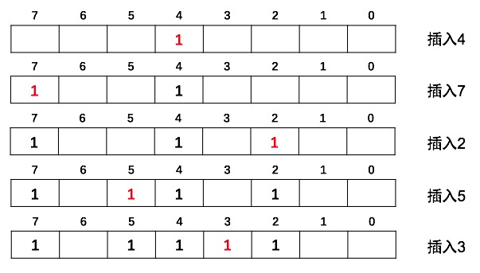 </div>

> * 假设有100亿个数(10,000,000,000)，如果使用int(4字节)数组实现位图，每个int可以表示32个数，那么可以使用100亿/8，大约1GB左右的空间就能存下所有100亿个数
> * **注意，由于位图每位只有0和1，所以只能表示1个元素是否存在，如果数组包含相同元素，位图没有办法记录。位图很适合在海量数值中查找某个数值是否存在。如果希望用位图记录一个数字是否多次出现，可以用2bit位图（00不存在，01存在，10出现多次，11无意义）**

```c++
#define BITWORD 32
#define SHIFT 5   
#define MASK 0x1F //000..0011111(31)
#define N 10000000

int a[1+N/BITWORD];//一个int 32位（32位、64位平台）

/*将第i位设置为1，i>=0*/
void set(int i)
{
    //右移1位相当于除以2，右移SHIFT位相当于除以2^5=32，a[i >> SHIFT]相当于找到了i所在的那个int数组中的元素（32位）
    //i & MASK相当于 i % 32得到余数，1 << (i & MASK)将从右至左的(i & MASK)偏移量位设为1
    a[i >> SHIFT] |= (1 << (i & MASK));
}

/*将第i位设置为0*/
void clr(int i)
{
    //右移1位相当于除以2，右移SHIFT位相当于除以2^5=32，a[i >> SHIFT]相当于找到了i所在的那个int数组中的元素
    //1 << (i & MASK)是i的bit位偏移位置，对其取反就是该位置为0，其余位置为1
    a[i >> SHIFT] &= ~(1 << (i & MASK));
}

/*返回第i位的状态*/
int test(int i)
{
    return a[i >> SHIFT] & (1 << (i & MASK));
}
```

<br>
<br>

## 统计不同号码的个数

已知某文件内包含一些电话号码，每个号码为8位数字，统计不同号码的个数

### 解答

8位数字表示的最大数为99999999，可以理解为从[0,99999999]的数字，用位图解决，则每个数字对应一个bit，只需要约12MB，依次读入每个号码，然后将位图相应位置设为1，最后统计位图中1的位数的个数

<br>
<br>

## 查找某个数是否在40亿个数当中

给40亿个不重复的unsigned int的整数，没排过序，然后再给一个数，如何快速判断这个数是否在40亿个数当中？

### 解答

unsigned int最多有2^32个数，用位图的方法，申请512MB的内存，一个bit位代表一个unsigned int，读入40亿个数，设置相应的bit位，读入要查询的数，查看相应bit位是否为1，为1表示存在，为0表示不存在

<br>
<br>

## 2.5亿整数中只出现一次的整数

在2.5亿个整数中找出只出现一次的整数，内存不足以容纳这2.5亿个整数

### 解答

**方案一**：采用2bit位图（每个数分配2bit，00表示不存在，01表示出现一次，10表示多次，11无意义），共需内存(2^32)\*2bit=1GB内存，然后依次扫描2.5亿个整数，查看Bitmap中对应位，如果是00则变为01，01变为10，10保持不变。扫描结束后，查看bitmap，把对应位是01的整数输出

**方案二**：也可以采用Hash映射的方法，划分成多个小文件。然后在小文件中利用hash_map找出不重复的整数

<br>
<br>

## 布隆过滤器

布隆过滤器可视为对位图的扩展

如果需要判断一个元素是否在一个集合中，位图的做法是申请一个N位（N为集合中最大整数）的数组，然后每一位对应一个特定整数

布隆过滤器的基本原理是位数组与Hash函数联合使用。具体而言，布隆过滤器是一个包含了m位的位数组，数组的每一位都初始化为0。然后定义k个不同的Hash函数，每个Hash函数都可以将集合中的元素映射到位数组中的某一位

**插入**：当向集合中插入一个元素时，根据k个Hash函数可以得到位数组中的k个位，将这些位全部设置为1

**查询**：当要查询某个元素是否属于集合时，就使用k个哈希函数得到此元素对应的k个位，如果所有点都是1，那么判断为元素在集合内（**注意，这种情况下只能说明元素可能在集合内，并不一定**），如果有0，则元素不在集合内（**因此，其实布隆过滤器的思想是“宁可误杀也不放过”，适用于黑名单网站的查询**）

<div align="center"> 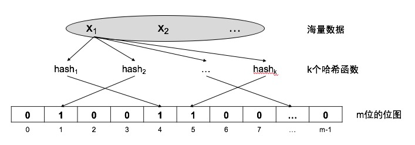 </div>

插入元素时，对任意一个元素x，第i个哈希函数映射的位置hi(x)会被置为1（1<=i<=k）

> **布隆过滤器的位数m通常要比集合中的最大元素小的多，可见，布隆过滤器是一种空间效率和时间效率很高的随机数据结构，但这种高效是有一定代价**：在判断一个元素是否属于某个集合时，有可能会把不属于这个集合的元素误认为属于这个集合。因此，布隆过滤器不适合那些“零错误”应用场合，而在能容忍低错误率的应用场合下，布隆过滤器通过极少的错误换取了存储空间的极大节省

<br>
<br>

## 倒排索引法

**倒排索引**也常被称为**反向索引**、**置入档案**、**反向档案**，是一种索引方法，用来存储在全文检索下某个单词在一个文档或者一组文档中的存储位置的映射。是**文档检索系统中最常用**的数据结构

> 适用范围：搜索引擎的关键字查询

假设存在3个文本T0、T1、T2：

```
T0 = "it is what it is"
T1 = "what is it"
T2 = "it is a banana"
```

能够得到下面的反向文件索引：

```
"a"：{2}
"banana"：{2}
"is"：{0,1,2}
"it"：{0,1,2}
"what"：{0,1}
```

当用户检索的条件为"what"、"is"和"it"时，将分别查询这三个关键词对应的文本集合，然后求对应集合的交集。可见，倒排索引在处理复杂的多关键字查询时，可在倒排表中先完成查询的并、交等逻辑运算，得到结果后再对记录进行存取

> 倒排索引是相对正向索引而言的，正向索引是用来存储每个文档的单词的列表、在正向索引中，文档占据了中心的位置，每个文档指向了一个它所包含的索引项的序列。也就是说文档指向了它包含的那些单词，而反向索引则是单词指向了包含它的文档

<br>
<br>

## C字符串处理函数

头文件 `#include<string.h>`

### 1）实现strlen

#### 迭代

```c
#include <cassert>

//字符串长度计算
int strlen(const char *str)
{
    assert(str);

    int len = 0;
    while(*str++)   len++;
    return  len;
}
```

#### 递归

> 如果要求不使用额外变量就需要用递归版

```c
#include <cassert>

//字符串长度计算
int strlen(const char *str)
{
    assert(str);

    return (*str == 0) ? 0 : 1 + strlen(str + 1);  
}
```

### 2）实现strcmp

```c
#include <cassert>

//字符串比较
int strcmp(const char *str1,const char *str2)
{
    assert(str1 && str2);

    //在判断是否相等时不一定要转换为unsigned char
    while((*str1 == *str2) && *str1){
        str1++;
        str2++;
    }

    if(*str1 == *str2)//说明上面循环退出时*str等于0
        return 0;

    //128种扩展ascii码使用最高位来标识，
    //所以在判断返回大于0还是小于0是，要转换为unsigned char，否则结果相反

    return *(unsigned char*)str1 > *(unsigned char*)str2 ? 1 : -1;
}
```

### 3）实现strcat

```c
#include <cassert>

//字符串拼接
char* strcat(char *strDest,const char *strSrc)
{
    assert(strDest && strSrc);

    char *p = strDest;
    while(*p) p++;

    while(*p++ = *strSrc++);
    return strDest;
}
```

### 4）实现strcpy

```c
#include <cassert>

//字符串拷贝
char* strcpy(char *strDest,const char *strSrc)
{
    assert(strDest && strSrc);

    char *p = strDest;
    while(*p++ = *strSrc++);
    return strDest;
}
```

<br>
<br>

## C内存处理函数

头文件 `#include<string.h>`

### 1）实现memcpy

> 实现的实际上是memmove，实际的memcpy是不考虑重叠的

重点在于处理重叠的情况：

```c
void* memcpy(void *dst,const void *src,size_t size)
{
    if(dst == NULL || src == NULL){
        return NULL;
    }

    char *pdst = (char*)dst;
    char *psrc = (char*)src;

    //有重叠，从高地址开始复制
    if(pdst > psrc && pdst < psrc + size){
        pdst = pdst + size - 1;
        psrc = psrc + size - 1;
        while(size--){
            *pdst-- == *psrc--;
        }
    }
    //没有重叠，从低地址开始复制
    else{
        while(size--){
            *pdst++ = *psrc++;
        }
    }

    return dst;
}
```

<br>
<br>

## Excel表列序号

[OJ链接](https://leetcode.com/problems/excel-sheet-column-number/description/)

给定一个Excel表格中的列名称，返回其相应的列序号。

例如，

```
    A -> 1
    B -> 2
    C -> 3
    ...
    Z -> 26
    AA -> 27
    AB -> 28 
    ...
```

示例 1:

```
输入: "A"
输出: 1
```

示例 2:

```
输入: "AB"
输出: 28
```

示例 3:

```
输入: "ZY"
输出: 701
```

### 解答

#### 1）从右往左

```c++
class Solution {
public:
    int titleToNumber(string s) {
        int res = 0,tp = 1;
        for(int i = s.length() - 1;i >= 0;i--){
            res += (s[i] - 'A' + 1) * tp;
            tp *= 26;
        }
        return res;
    }
};
```

#### 2）从左往右

```c++
class Solution {
public:
    int titleToNumber(string s) {
        int res = 0;
        for(char c : s){
            res = res * 26 + (c - 'A' + 1);
        }
        return res;
    }
};
```

<br>
<br>

## 阶乘后的零

[OJ链接](https://leetcode.com/problems/factorial-trailing-zeroes/description/)

给定一个整数 n，返回 n! 结果尾数中零的数量。

示例 1:

```
输入: 3
输出: 0
解释: 3! = 6, 尾数中没有零。
```

示例 2:

```
输入: 5
输出: 1
解释: 5! = 120, 尾数中有 1 个零.
```

说明: 你算法的时间复杂度应为对数级

### 解答

10=2\*5，因此，每一对(2,5)就可以产生一个0

由于每个偶数中就可以分解出一个因子2，因此n!中，2的个数肯定比5多，所以问题转换为求1~n中，可以分解出多少个因子5：

```
5,10,15,20,25,30,...,125,130,...
```

因此，n/5就可以就得有多少个数能分解出1个5

但是注意上面的25和125：

```
25 = 5 * 5;
125 = 5 * 5 * 5;
```

这些数中可以分解出多个5，因此，还需要求1~n中，能分解出多少个25，125...

```
25,50,75,100,125,150,...
//等价于1*(5*5),2*(5*5),3*(5*5),...,5*(5*5),...，这些数中的5还需要加1次

125,250,375,...
//等价于1*(5*5*5),2*(5*5*5),3*(5*5*5),...，这些数中的5又要多加1次

...
```

故，设num=5，每次累加n/num后，num就需要乘以5。知道num>n：

```c++
class Solution {
public:
    int trailingZeroes(int n) {
        long long num = 5;
        int count = 0;
        while(num <= n){
            count += (n / num);
            num *= 5;
        }
        return count;
    }
};
```

注意，num的类型为long long，原因在于使用int时可能溢出，例如：

```
当 n = 1808548329时，如果num为int，在num>n之前，num的值：

5
25
125
625
3125
15625
78125
390625
1953125
9765625
48828125
244140625
1220703125
1808548329       //这里开始溢出
452807053
-2030932031
-1564725563
766306777
-463433411

INT_MAX:2147483647
```

<br>
<br>

## 计数质数

[OJ链接](https://leetcode.com/problems/count-primes/description/)

统计所有小于非负整数 n 的质数的数量。

示例:

```
输入: 10
输出: 4
解释: 小于 10 的质数一共有 4 个, 它们是 2, 3, 5, 7 。
```

### 解答

创建一个bool数组state，[0,n)中非质数标位false，最后统计数组中为true的数量，即质数的数量

一个质数只能被1和该数本身整除，那么：

```
2*2,2*3,2*4,...  //4,6,8,...
3*3,3*4,3*5,...  //9,12,15,...
4*4,4*5,4*6,...  //16,20,24,...
...
```

都不是质数，因此，只需要设变量`i`为`2~m（i*i<n）`，然后`j`为`i~n（i*j<n）`，设置bool数组中下标为`i*j`的元素为false即可

可以将i和j看成：j个i，j不必从1开始，因为如果j从1开始，可以互换i和j的概念，理解成i个j。比如说i=4，j=2时，可以理解成4个2，那么当i=2，j=4时，已经求过了，所以j从i开始

除此之外，如果state[i]为false，可以直接跳到i+1处理，因为如果state[i]为true，那么之前肯定存在一个数m\*n=i，然后将i设置为了false。那么i\*i,i\*(i+1),i\*(i+2),...的序列也肯定和之前的一个序列重合，比如当i=2时，设置了i=4为false，那么当i=4就不用处理了，因为4,8,12,...与i=2时的序列的一部分重合

```c++
class Solution {
public:
    int countPrimes(int n) {
        if(n <= 2)  return 0;
        
        bool *state = new bool[n];
        for(int i = 0;i < n;i++)    state[i] = true;
        state[0] = false;
        state[1] = false;
        for(int i = 2;i * i < n;i++)
            if(state[i])
                for(int j = i;i * j < n;j++)
                    state[i * j] = false;
 
        
        int count = 0;
        for(int i = 2;i < n;i++)
            if(state[i])
                count++;
        return count;
    }
};
```

<br>
<br>

## 完美平方数

[OJ链接](https://leetcode.com/problems/perfect-squares/description/)

给定正整数 n，找到若干个完全平方数（比如 `1, 4, 9, 16, ...`）使得它们的和等于 n。你需要让组成和的完全平方数的个数最少。

示例 1:

```
输入: n = 12
输出: 3 
解释: 12 = 4 + 4 + 4.
```

示例 2:

```
输入: n = 13
输出: 2
解释: 13 = 4 + 9.
```

### 解答

完美平方数：1,4,9,16,25,...

求一个数n最少由多少个完美平方数组成，假设q为sqrt(n)：

* 如果这些数里面包含1，那么求出n-1\*1最少由多少个完美平方数组成，然后加1就是结果
* 否则，如果这些数里面包含2，那么求出n-2\*2最少由多少个完美平方数组成，然后加1就是结果
* ...
* 否则，如果这些数里面包含q,那么求出n-q\*q最少由多少个完美平方数组成，然后加1就是结果

因此，这是一个动态规划问题。F(n) = min{F(n),F(n-1)+1,F(n-4)+1,...,F(n-q\*q)+1}。如果递归求解会存在重复子问题，因此使用一个数组state保存状态，“从小到大”求出F(1)到F(n)，结果就是state[n]

```c++
class Solution {
public:
    int numSquares(int n) {
        vector<int> state(n + 1,INT_MAX);
        state[0] = 0;
        
        for(int i = 1;i <= n;i++){
            int q = sqrt(i);
            if(q * q == i)  state[i] = 1;
            else{
                for(int j = 1;j <= q;j++){
                    if(state[i - j * j] + 1 < state[i])
                        state[i] = state[i - j * j] + 1;
                }
            }
        }
        
        return state[n];
    }
};
```

<br>
<br>

## 3的幂

[OJ链接](https://leetcode-cn.com/problems/power-of-three/description/)

给定一个整数，写一个函数来判断它是否是 3 的幂次方。

示例 1:

```
输入: 27
输出: true
```

示例 2:

```
输入: 0
输出: false
```

示例 3:

```
输入: 9
输出: true
```

示例 4:

```
输入: 45
输出: false
```

进阶：

你能不使用循环或者递归来完成本题吗？

### 解答

#### 1）递归

```c++
class Solution {
public:
    bool isPowerOfThree(int n) {
        if(n <= 0)  return false;
        if(n == 1)  return true;
        if(n % 3 != 0)  return false;
        return isPowerOfThree(n/3);
    }
};
```

#### 2）迭代

```c++
class Solution {
public:
    bool isPowerOfThree(int n) {
        if(n < 0)  return false;
        
        while(n){
            if(n == 1)  return true;
            if(n % 3 != 0)  return false;
            n /= 3;
        }
        
        return false;
    }
};
```

#### 3）Discuss中不使用递归和迭代的方法

```c++
class Solution {
public:
    bool isPowerOfThree(int n) {
        // 1162261467 is 3^19,  3^20 is bigger than int  
        return ( n>0 &&  1162261467%n==0);
    }
};

//下列函数可以用以获取int中最大的3的幂的数
int getMaxPowerOfThree() {
    int max = 1;
    while (max * 3 > max) max *= 3;
    return max;
}
```

<br>
<br>

## 只出现1次的数字

[OJ链接](https://leetcode.com/problems/single-number/description/)

给定一个非空整数数组，除了某个元素只出现一次以外，其余每个元素均出现两次。找出那个只出现了一次的元素。

说明：

你的算法应该具有线性时间复杂度。 你可以不使用额外空间来实现吗？

示例 1:

```
输入: [2,2,1]
输出: 1
```

示例 2:

```
输入: [4,1,2,1,2]
输出: 4
```

### 解答

一个数和自身异或为0。0和任何数异或都得那个数。因此将所有数异或，出现2次的都为0，最终剩下只出现1次的数

```c++
class Solution {
public:
    int singleNumber(vector<int>& nums) {
        int res = 0;
        for(int i = 0;i < nums.size();i++){
            res ^= nums[i];
        }
        return res;
    }
};
```

<br>
<br>

## 颠倒二进制位

[OJ链接](https://leetcode.com/problems/reverse-bits/description/)

颠倒给定的 32 位无符号整数的二进制位。

示例:

```
输入: 43261596
输出: 964176192
解释: 43261596 的二进制表示形式为 00000010100101000001111010011100 ，
     返回 964176192，其二进制表示形式为 00111001011110000010100101000000 。
```

进阶:

如果多次调用这个函数，你将如何优化你的算法？

### 解答

结果res初始化为0，假设n的第i比特为1，那么反转后res的第31-i比特为1。因此，如果从右往左处理，n的第i比特为1，因为n还剩31-i比特需要处理，那么设置res最低位为1，每次将res左移1位，最终第31-i比特就是1：

```c++
class Solution {
public:
    uint32_t reverseBits(uint32_t n) {
        int mask = 1;
        uint32_t res = 0;
        for(int i = 1;i <= 32;i++){
            res = (res << 1);
            if(n & mask)
                res |= 1;
            mask = mask << 1;
        }
        return res;
    }
};
```

Discuss里面的一种解答：

```c++
class Solution {
public:
    uint32_t reverseBits(uint32_t n) {
        n = (n >> 16) | (n << 16);
        n = ((n & 0xff00ff00) >> 8) | ((n & 0x00ff00ff) << 8);
        n = ((n & 0xf0f0f0f0) >> 4) | ((n & 0x0f0f0f0f) << 4);
        n = ((n & 0xcccccccc) >> 2) | ((n & 0x33333333) << 2);
        n = ((n & 0xaaaaaaaa) >> 1) | ((n & 0x55555555) << 1);
        return n;
    }
};
```

<br>
<br>

## 输出二叉树的中序遍历序列

[OJ链接](https://leetcode.com/problems/binary-tree-inorder-traversal/description/)

给定一个二叉树，返回它的中序 遍历。

示例:

```
输入: [1,null,2,3]
   1
    \
     2
    /
   3

输出: [1,3,2]
```

进阶: 递归算法很简单，你可以通过迭代算法完成吗？

### 解答

#### 1）递归

```c++
/**
 * Definition for a binary tree node.
 * struct TreeNode {
 *     int val;
 *     TreeNode *left;
 *     TreeNode *right;
 *     TreeNode(int x) : val(x), left(NULL), right(NULL) {}
 * };
 */
class Solution {
public:
    vector<int> inorderTraversal(TreeNode* root) {
        vector<int> res;
        inorderTraversal(root,res);
        return res;
    }
private:
    void inorderTraversal(TreeNode *root,vector<int> &res){
        if(!root)   return;
        
        inorderTraversal(root->left,res);
        res.push_back(root->val);
        inorderTraversal(root->right,res);
        
        return;
    }
};
```

#### 2）迭代

```c++
/**
 * Definition for a binary tree node.
 * struct TreeNode {
 *     int val;
 *     TreeNode *left;
 *     TreeNode *right;
 *     TreeNode(int x) : val(x), left(NULL), right(NULL) {}
 * };
 */
class Solution {
public:
    vector<int> inorderTraversal(TreeNode* root) {
        vector<int> res;
        stack<TreeNode*> s;
        TreeNode *curr = root;
        while(curr || !s.empty()){
            if(curr){
                s.push(curr);
                curr = curr->left;
            }
            else{
                res.push_back(s.top()->val);
                curr = s.top()->right;
                s.pop();
            }
        }
        return res;
    }
};
```

<br>
<br>

## 有序数组转BST

[OJ链接](https://leetcode.com/problems/convert-sorted-array-to-binary-search-tree/description/)

将一个按照升序排列的有序数组，转换为一棵高度平衡二叉搜索树。

本题中，一个高度平衡二叉树是指一个二叉树每个节点 的左右两个子树的高度差的绝对值不超过 1。

示例:

```
给定有序数组: [-10,-3,0,5,9],

一个可能的答案是：[0,-3,9,-10,null,5]，它可以表示下面这个高度平衡二叉搜索树：

      0
     / \
   -3   9
   /   /
 -10  5
```

### 解答

要平衡，那么左右子树节点首先必须相等，因此最开始选择数组中间的元素作为根节点，数组左边的元素用来构造左子树，右边的元素用来构造右子树。由于数组有序，因此满足BST的性质。选择左边数组的中间元素作为左子节点，右边数组的中间元素作为右子节点，从而又保证了以左右子节点为根节点的树的左子树和右子树的元素相等。这样递归构造，最终可以保证平衡：

```c++
/**
 * Definition for a binary tree node.
 * struct TreeNode {
 *     int val;
 *     TreeNode *left;
 *     TreeNode *right;
 *     TreeNode(int x) : val(x), left(NULL), right(NULL) {}
 * };
 */
class Solution {
public:
    TreeNode* sortedArrayToBST(vector<int>& nums) {
        int l = 0,r = nums.size() - 1;
        return sortedArrayToBSTCore(nums,l,r);
    }
public:
    TreeNode* sortedArrayToBSTCore(vector<int> &nums,int l,int r){
        if(l > r)   return NULL;
        
        int mid = (l + r) >> 1;
        TreeNode *root = new TreeNode(nums[mid]);
        if(l < r){
            root->left = sortedArrayToBSTCore(nums,l,mid - 1);
            root->right = sortedArrayToBSTCore(nums,mid + 1,r);
        }
        
        return root;
    }
};
```

<br>
<br>

## 填充同一层的兄弟节点

[OJ链接](https://leetcode.com/problems/populating-next-right-pointers-in-each-node/description/)

给定一个二叉树

```
struct TreeLinkNode {
  TreeLinkNode *left;
  TreeLinkNode *right;
  TreeLinkNode *next;
}
```

填充它的每个 next 指针，让这个指针指向其下一个右侧节点。如果找不到下一个右侧节点，则将 next 指针设置为 `NULL`。

初始状态下，所有 next 指针都被设置为 `NULL`。

说明:

* 你只能使用额外常数空间。
* 使用递归解题也符合要求，本题中递归程序占用的栈空间不算做额外的空间复杂度。
* 你可以假设它是一个完美二叉树（即所有叶子节点都在同一层，每个父节点都有两个子节点）。

示例:

给定完美二叉树，

```
     1
   /  \
  2    3
 / \  / \
4  5  6  7
```

调用你的函数后，该完美二叉树变为：

```
     1 -> NULL
   /  \
  2 -> 3 -> NULL
 / \  / \
4->5->6->7 -> NULL
```

### 解答

题目要求使用常量空间，不然可以使用一个队列按层迭代遍历树，每遍历一层，将节点链接起来

那么不用队列如何实现？题目假设所有叶子节点都在同一层，并且每个非叶子节点都有两个孩子，那么假设有如下树结构：

```
            node
           /    \
        node    node
       /    \   /   \
     node node node node
    /  \  /  \ /  \  /  \
   n   n n   n n  n  n   n
```

假设对于树中的任意node，如果node不是叶子节点，那么可以将node的左子节点和右子节点连起来：

```c++
node->left->next = node->right;
```

如果这样处理，那么按前序遍历整棵树，处理之后：

```
            node
           /    \
        node----node
       /    \   /   \
     node-node node-node
    /  \  /  \ /  \  /  \
   n---n n---n n--n  n---n
```

这样的话，每一层的节点虽然能两两串起来，但是每对节点之间还是存在空隙，如第3层的中间两个节点没连接起来，最下层的第2个节点和第3个节点、第4个节点与第5个节点。。。

那么怎么处理这些节点的链接？比方说第三层的第2个节点怎么连到第三层的第3个节点，肯定是不能等到遍历到第3层的第2个节点才处理，因为这样的话它无法获取到第3层的第3个节点。所以在遍历到其父节点时就进行处理：

```
//node为第二层的第1个节点
node->right->next = node->next-left;
```

**所以在前序遍历过程中，每遍历到一个节点时，要处理2个链接**：

```c++
node->left->next = node->right;
node->right->next = node->next-left;
```

同样以前面的例子为例，整个处理过程如下：

```
//初始状态
            node
           /    \
        node    node
       /    \   /   \
     node node node node
    /  \  /  \ /  \  /  \
   n   n n   n n  n  n   n

//处理根节点
            node
           /    \
        node----node
       /    \   /   \
     node node node node
    /  \  /  \ /  \  /  \
   n   n n   n n  n  n   n

//处理根节点的左子节点
            node
           /    \
        node----node
       /    \   /   \
     node-node-node node
    /  \  /  \ /  \  /  \
   n   n n   n n  n  n   n

//...
            node
           /    \
        node----node
       /    \   /   \
     node-node-node node
    /  \  /  \ /  \  /  \
   n---n-n   n n  n  n   n

//...
            node
           /    \
        node----node
       /    \   /   \
     node-node-node node
    /  \  /  \ /  \  /  \
   n---n-n---n-n  n  n   n

//处理根节点的右子节点
            node
           /    \
        node----node
       /    \   /   \
     node-node-node-node
    /  \  /  \ /  \  /  \
   n---n-n---n-n  n  n   n

//...
            node
           /    \
        node----node
       /    \   /   \
     node-node-node-node
    /  \  /  \ /  \  /  \
   n---n-n---n-n--n--n   n

//...
            node
           /    \
        node----node
       /    \   /   \
     node-node-node-node
    /  \  /  \ /  \  /  \
   n---n-n---n-n--n--n---n
```

```c++
/**
 * Definition for binary tree with next pointer.
 * struct TreeLinkNode {
 *  int val;
 *  TreeLinkNode *left, *right, *next;
 *  TreeLinkNode(int x) : val(x), left(NULL), right(NULL), next(NULL) {}
 * };
 */
class Solution {
public:
    void connect(TreeLinkNode *root) {
        if(!root)
            return;
        
        if(root->left && root->right)
            root->left->next = root->right;
        
        if(root->right && root->next && root->next->left)
            root->right->next = root->next->left;
        
        if(root->left)
            connect(root->left);
        if(root->right)
            connect(root->right);
    }
};
```

<br>
<br>

## 两数相加

[OJ链接](https://leetcode.com/problems/add-two-numbers/description/)

给定两个非空链表来表示两个非负整数。位数按照逆序方式存储，它们的每个节点只存储单个数字。将两数相加返回一个新的链表。

你可以假设除了数字 0 之外，这两个数字都不会以零开头。

示例：

```
输入：(2 -> 4 -> 3) + (5 -> 6 -> 4)
输出：7 -> 0 -> 8
原因：342 + 465 = 807
```

### 解答

* **可以在新链表头结点之前创建一个辅助节点来便利处理**
* 要注意链表处理完后可能还有进位，此时还需创建一个节点

```c++
/**
 * Definition for singly-linked list.
 * struct ListNode {
 *     int val;
 *     ListNode *next;
 *     ListNode(int x) : val(x), next(NULL) {}
 * };
 */
class Solution {
public:
    ListNode *addTwoNumbers(ListNode *l1, ListNode *l2) {
        ListNode preHead(0), *p = &preHead;
        int extra = 0;
        while (l1 || l2 || extra) {
            int sum = (l1 ? l1->val : 0) + (l2 ? l2->val : 0) + extra;
            extra = sum / 10;
            p->next = new ListNode(sum % 10);
            p = p->next;
            l1 = l1 ? l1->next : l1;
            l2 = l2 ? l2->next : l2;
        }
        return preHead.next;
    }
};
```

<br>
<br>

## 删除链表倒数第n个节点

[OJ链接](https://leetcode.com/problems/remove-nth-node-from-end-of-list/description/)

给定一个链表，删除链表的倒数第 n 个节点，并且返回链表的头结点。

示例：

```
给定一个链表: 1->2->3->4->5, 和 n = 2.

当删除了倒数第二个节点后，链表变为 1->2->3->5.
```

说明：

给定的 n 保证是有效的。

进阶：

你能尝试使用一趟扫描实现吗？

### 解答

#### 1）双指针

使用两个指针，一个指针先走n+1步，然后两个指针一起走，这样当先走的指针为NULL时，后走的指针指向倒数第n+1个节点，然后删除倒数第n个节点即可：

```c++
/**
 * Definition for singly-linked list.
 * struct ListNode {
 *     int val;
 *     ListNode *next;
 *     ListNode(int x) : val(x), next(NULL) {}
 * };
 */
class Solution {
public:
    ListNode* removeNthFromEnd(ListNode* head, int n) {
        if(n <= 0)  return head;
        ListNode *prev = head,*behind = head;
        n = n + 1;//移动到倒数第n个节点的前一个节点
        while(n && prev){
            prev = prev->next;
            n--;
        }
        if(n){
            if(n > 1)   return head;    //n太大，直接返回
            //删除的是头节点
            behind = head;
            head = head->next;
            delete behind;
            return head;
        }
        while(prev){
            prev = prev->next;
            behind = behind->next;
        }
        ListNode *tp = behind->next->next;
        delete behind->next ;
        behind->next = tp;
        return head;
    }
};
```

#### 2）递归

使用递归找到倒数第n+1个节点，然后删除倒数第n个节点：

```c++
/**
 * Definition for singly-linked list.
 * struct ListNode {
 *     int val;
 *     ListNode *next;
 *     ListNode(int x) : val(x), next(NULL) {}
 * };
 */
class Solution {
public:
    ListNode* removeNthFromEnd(ListNode* head, int n) {
        if(n <= 0)  return head;
        removeNthFromEnd(head,&n);
        if(n == 0){
            ListNode *tp = head;
            head = head->next;
            delete tp;
        }
        return head;
    }
private:
    void removeNthFromEnd(ListNode* head,int *n){
        if(!head)   return;
        
        removeNthFromEnd(head->next,n);
        
        if((*n)-- == 0){
            ListNode *tp = head->next;
            head->next = tp->next;
            delete tp;
            return;
        }
    }
};
```

<br>
<br>

## 合并k个有序链表

[OJ链接](https://leetcode.com/problems/merge-k-sorted-lists/description/)

合并 k 个排序链表，返回合并后的排序链表。请分析和描述算法的复杂度

示例:

```
输入:
[
  1->4->5,
  1->3->4,
  2->6
]
输出: 1->1->2->3->4->4->5->6
```

### 解答

#### 1）建堆进行多路归并

假设链表个数为k，那么可以使用k个链表的头节点建立一个k个节点的最小堆，每次从堆中删除堆顶节点，然后将被删除的节点所在链表的下一个节点添加到堆中。每删除一个节点就将被删除的节点链入结果链表中

```c++
/**
 * Definition for singly-linked list.
 * struct ListNode {
 *     int val;
 *     ListNode *next;
 *     ListNode(int x) : val(x), next(NULL) {}
 * };
 */
class Solution {
public:
    struct Compare{
        bool operator()(const ListNode *n1,const ListNode *n2){
            return n1->val > n2->val;
        } 
    };
    
    ListNode* mergeKLists(vector<ListNode*>& lists) {
        int k = lists.size();
        
        vector<ListNode*> min;
        for(int i = 0;i < k;i++)
            if(lists[i])
                min.push_back(lists[i]);
        make_heap(min.begin(),min.end(),Compare());

        ListNode head(0),*curr = &head;
        while(!min.empty()){
            ListNode *next = min.front();
            pop_heap(min.begin(),min.end(),Compare());
            min.pop_back();
            curr->next = next;
            curr = next;
            if(curr->next){
                min.push_back(curr->next);
                push_heap(min.begin(),min.end(),Compare());
            }
        }
        
        return head.next;
    }
};
```

设n为k个链表的节点总数：

* **时间复杂度**：O(nlogk)
* **空间复杂度**：O(k)

#### 2）2路归并

假设有k个链表，每次将k个链表中，每2个链表进行合并，可以得到k/2个新的链表。接着对k/2个链表中的每2个链表进行合并，又可以得到k/4个新的链表...如此反复，最终合并到只有1个链表

```c++
/**
 * Definition for singly-linked list.
 * struct ListNode {
 *     int val;
 *     ListNode *next;
 *     ListNode(int x) : val(x), next(NULL) {}
 * };
 */
class Solution {
public:  
    ListNode* mergeKLists(vector<ListNode*>& lists) {
        int sz = lists.size();
        if(sz == 0) return NULL;
        if(sz == 1) return lists[0];
        
        vector<ListNode*> mergeLists;
        for(int i = 0;i < sz - 1;i += 2){
            ListNode *l1 = lists[i],*l2 = lists[i + 1];
            ListNode head(0) ,*curr = &head;
            while(l1 && l2){
                if(l1->val < l2->val){
                    curr->next = l1;
                    l1 = l1->next;
                }else{
                    curr->next = l2;
                    l2 = l2->next;
                }
                curr = curr->next;
            }
            if(l1)  curr->next = l1;
            else if(l2)  curr->next = l2;
            mergeLists.push_back(head.next);
        }
        
        if(sz % 2)  mergeLists.push_back(lists[sz - 1]);
        
        return mergeKLists(mergeLists);
    }
};
```

设n为k个链表的节点总数：

* **时间复杂度**：O(nlogk)
* **空间复杂度**：O(1)

[这题的方法汇总](https://leetcode.com/problems/merge-k-sorted-lists/solution/)

<br>
<br>

## 成对交换链表的节点

[OJ链接](https://leetcode.com/problems/swap-nodes-in-pairs/description/)

给定一个链表，两两交换其中相邻的节点，并返回交换后的链表。

示例:

```
给定 1->2->3->4, 你应该返回 2->1->4->3.
```

说明:

* 你的算法只能使用常数的额外空间。
* 你不能只是单纯的改变节点内部的值，而是需要实际的进行节点交换。

### 解答

两个两个节点进行处理，对于当前节点curr，如果有下一个节点，则进行交换。注意两点：
* 每次处理时，curr可能为空，所以循环要先判断curr是否为空
* 交换后，curr为当前处理两个节点的后一个节点，所以下一次处理前，curr只需往后移动1次
* 要注意每次不仅要处理当前2个节点与后续节点的链接，还要处理当前2个节点前面的节点与当前2个节点的链接

```c++
/**
 * Definition for singly-linked list.
 * struct ListNode {
 *     int val;
 *     ListNode *next;
 *     ListNode(int x) : val(x), next(NULL) {}
 * };
 */
class Solution {
public:
    ListNode* swapPairs(ListNode* head) {
        if(!head || !head->next)    return head;
        
        ListNode node(0);
        ListNode *curr = head,*prev = &node;
        while(curr && curr->next){
            ListNode *tp = curr->next;
            curr->next = curr->next->next;
            tp->next = curr;
            curr = curr->next;
            prev->next = tp;
            prev = tp->next;
        }
        return node.next;
    }
};
```

<br>
<br>

## 判断链表是否有环

[OJ链接](https://leetcode.com/problems/linked-list-cycle/description/)

给定一个链表，判断链表中是否有环。

进阶：

你能否不使用额外空间解决此题？

### 解答

使用1个快指针和1个慢指针，如果存在环，2个指针必然在环内相遇

```c++
/**
 * Definition for singly-linked list.
 * struct ListNode {
 *     int val;
 *     ListNode *next;
 *     ListNode(int x) : val(x), next(NULL) {}
 * };
 */
class Solution {
public:
    bool hasCycle(ListNode *head) {
        ListNode *slow = head,*fast = head;
        while(fast){
            if(fast->next){
                fast = fast->next->next;
                slow = slow->next;
                if(fast == slow)    return true;
            }
            else
                return false;
        }
        return false;
    }
};
```

<br>
<br>

## 链表节点排序

[OJ链接](https://leetcode.com/problems/sort-list/description/)

在 O(n log n) 时间复杂度和常数级空间复杂度下，对链表进行排序。

示例 1:

```
输入: 4->2->1->3
输出: 1->2->3->4
```

示例 2:

```
输入: -1->5->3->4->0
输出: -1->0->3->4->5
```

### 解答

分治，将大链表拆分成2个长度相等的小链表，递归处理，每次递归返回后，两个小链表已经有序，然后将2个小链表进行归并

每次将链表分成2个长度相等的链表时，需要找到中间节点，可以使用1个快指针和1个慢指针

#### 1）递归

递归是“从上往下”的思想，如果考虑递归调用的函数栈帧，那么空间复杂度为O(n)，不考虑则空间复杂度为O(1)

```c++
/**
 * Definition for singly-linked list.
 * struct ListNode {
 *     int val;
 *     ListNode *next;
 *     ListNode(int x) : val(x), next(NULL) {}
 * };
 */
class Solution {
public:
    ListNode* sortList(ListNode* head) {
        if(!head || !head->next)    return head;
        ListNode *slow = head,*fast = head;
        while(fast && fast->next && fast->next->next){
            fast = fast->next->next;
            slow = slow->next;
        }
        ListNode *l1 = head,*l2 = slow->next;
        slow->next = NULL;
        l1 = sortList(l1);
        l2 = sortList(l2);
        //归并
        ListNode node(0),*curr = &node;
        while(l1 && l2){
            if(l1->val < l2->val){
                curr->next = l1;
                l1 = l1->next;
            }
            else{
                curr->next = l2;
                l2 = l2->next;
            }
            curr = curr->next;
        }
        if(l1)      curr->next = l1;
        else if(l2) curr->next = l2;

        return node.next;
    }
};
```

#### 2）迭代

也可以[“从下往上”](https://leetcode.com/problems/sort-list/discuss/46712/Bottom-to-up(not-recurring)-with-o(1)-space-complextity-and-o(nlgn)-time-complextity)，避免函数栈帧的开销

```c++
/**
 * Merge sort use bottom-up policy, 
 * so Space Complexity is O(1)
 * Time Complexity is O(NlgN)
 * stable sort
*/
class Solution {
public:
    ListNode *sortList(ListNode *head) {
        if(!head || !(head->next)) return head;
        
        //get the linked list's length
        ListNode* cur = head;
        int length = 0;
        while(cur){
            length++;
            cur = cur->next;
        }
        
        ListNode dummy(0);
        dummy.next = head;
        ListNode *left, *right, *tail;
        for(int step = 1; step < length; step <<= 1){
            cur = dummy.next;
            tail = &dummy;
            while(cur){
                left = cur;
                right = split(left, step);
                cur = split(right,step);
                tail = merge(left, right, tail);
            }
        }
        return dummy.next;
    }
private:
    /**
     * Divide the linked list into two lists,
     * while the first list contains first n ndoes
     * return the second list's head
     */
    ListNode* split(ListNode *head, int n){
        //if(!head) return NULL;
        for(int i = 1; head && i < n; i++) head = head->next;
        
        if(!head) return NULL;
        ListNode *second = head->next;
        head->next = NULL;
        return second;
    }
    /**
      * merge the two sorted linked list l1 and l2,
      * then append the merged sorted linked list to the node head
      * return the tail of the merged sorted linked list
     */
    ListNode* merge(ListNode* l1, ListNode* l2, ListNode* head){
        ListNode *cur = head;
        while(l1 && l2){
            if(l1->val > l2->val){
                cur->next = l2;
                cur = l2;
                l2 = l2->next;
            }
            else{
                cur->next = l1;
                cur = l1;
                l1 = l1->next;
            }
        }
        cur->next = (l1 ? l1 : l2);
        while(cur->next) cur = cur->next;
        return cur;
    }
};
```

<br>
<br>

## 删除链表中等于给定值的所有节点

[OJ链接]()

删除链表中等于给定值 val 的所有节点。

示例:

```
输入: 1->2->6->3->4->5->6, val = 6
输出: 1->2->3->4->5
```

### 解答

```c++
/**
 * Definition for singly-linked list.
 * struct ListNode {
 *     int val;
 *     ListNode *next;
 *     ListNode(int x) : val(x), next(NULL) {}
 * };
 */
/**
 * Definition for singly-linked list.
 * struct ListNode {
 *     int val;
 *     ListNode *next;
 *     ListNode(int x) : val(x), next(NULL) {}
 * };
 */
class Solution {
public:
    ListNode* removeElements(ListNode* head, int val) {
        ListNode node(0),*curr = &node;
        node.next = head;
        while(curr->next){
            if(curr->next->val == val){
                ListNode *tp = curr->next;
                curr->next = curr->next->next;
                delete tp;
            }
            else
                curr = curr->next;
        }
        return node.next;
    }
};
```

<br>
<br>

## 回文链表

[OJ链接](https://leetcode.com/problems/palindrome-linked-list/description/)

请判断一个链表是否为回文链表。

示例 1:

```
输入: 1->2
输出: false
```

示例 2:

```
输入: 1->2->2->1
输出: true
```

进阶：

你能否用 O(n) 时间复杂度和 O(1) 空间复杂度解决此题？

### 解答

使用两个指针b和e，b指向链表的头节点，e指向链表的尾节点，如果b和e的值相等，那么b指向下一个节点，e指向前一个节点，直到b和e指向相同节点。关键是链表单向，因此使用递归来设置e：

```c++
/**
 * Definition for singly-linked list.
 * struct ListNode {
 *     int val;
 *     ListNode *next;
 *     ListNode(int x) : val(x), next(NULL) {}
 * };
 */
class Solution {
public:
    bool isPalindrome(ListNode* head) {
        if(!head)   return true;
        
        ListNode *b = head,*e = NULL;
        return isPalindrome(head,&b,&e);
    }
    
private:
    bool isPalindrome(ListNode* node,ListNode **b,ListNode **e){       
        if(node->next)
            if(!isPalindrome(node->next,b,e))
                return false;
        
        if(*b == *e)    
            return true;
        *e = node;
        if((*b)->val == (*e)->val){
            (*b) = (*b)->next;
            return true;
        }
        else
            return false;
    }
};
```

<br>
<br>

## 将链表偶数位置的节点移至尾部

[OJ链接](https://leetcode.com/problems/odd-even-linked-list/description/)

给定一个单链表，把所有的奇数节点和偶数节点分别排在一起。请注意，这里的奇数节点和偶数节点指的是节点编号的奇偶性，而不是节点的值的奇偶性。

请尝试使用原地算法完成。你的算法的空间复杂度应为 O(1)，时间复杂度应为 O(nodes)，nodes 为节点总数。

示例 1:

```
输入: 1->2->3->4->5->NULL
输出: 1->3->5->2->4->NULL
```

示例 2:

```
输入: 2->1->3->5->6->4->7->NULL 
输出: 2->3->6->7->1->5->4->NULL
```

说明:

* 应当保持奇数节点和偶数节点的相对顺序。
* 链表的第一个节点视为奇数节点，第二个节点视为偶数节点，以此类推。

### 解答

使用两个指针oddlist和evenlist指向奇数链表和偶数链表的表头节点。然后使用一个指针p1遍历原链表，每次将一个节点指向它的下下个节点，从而将奇数链表和偶数链表拆开

p1最后会指向原链表的最后一个结尾，这个节点可能是奇数链表的尾节点，也可能是偶数链表的尾节点。因此可以使用一个int变量odd做状态记录，通过odd判断p1是奇数链表的尾节点还是偶数链表的尾节点：

* 如果是奇数链表的尾节点，那么将这个节点的下一个节点设为偶数链表的头结点，处理完成
* 如果是偶数链表的尾节点，那么没有办法访问奇数链表的尾节点，因此使用另外一个指针p2，p2步伐p1慢，每次p1前移之前更新p2，因此在这种情况下p2指向奇数链表的尾节点，将其下一个节点设为偶数链表的头结点来完成处理

```c++
/**
 * Definition for singly-linked list.
 * struct ListNode {
 *     int val;
 *     ListNode *next;
 *     ListNode(int x) : val(x), next(NULL) {}
 * };
 */
class Solution {
public:
    ListNode* oddEvenList(ListNode* head) {
        if(!head)    return head;
        
        ListNode *oddlist = head,*evenlist = head->next,*p1 = head,*p2 = NULL;
        int odd = 1;
        while(p1->next){
            ListNode *tp = p1->next;
            p1->next = tp->next;
            p2 = p1;
            p1 = tp;
            odd = 1 - odd;
        }
        
        if(odd)//此时p1是奇数链表的尾节点
            p1->next = evenlist;
        else//此时p2是奇数链表的尾节点，因为odd不为1，说明上面while循环体至少被执行1次，所以p2不为NULL
            p2->next = evenlist;
        return oddlist;
    }
};
```

<br>
<br>

## 不含重复字符的最长子串

[OJ链接](https://leetcode.com/problems/longest-substring-without-repeating-characters/description/)

给定一个字符串，找出不含有重复字符的最长子串的长度。

示例：

给定 `"abcabcbb"` ，没有重复字符的最长子串是 `"abc"` ，那么长度就是3。

给定 `"bbbbb"` ，最长的子串就是 `"b"` ，长度是1。

给定 `"pwwkew"` ，最长子串是 `"wke"` ，长度是3。请注意答案必须是一个子串，`"pwke"` 是 子序列  而不是子串。

### 解答

> 如果是求不含重复字符的最长子序列，那么使用哈希表，但是重复出现的字符只算1次即可

分析字符串“abcabcbb”：

* 第一个字符肯定不含重复，所以最长子串为“a”，长度为1，继续下一个字符
* 字符b与a不重复，所以最长子串更新为“ab”，长度更新为2，继续下一个字符
* 字符c与a，b都不重复，所以最长子串更新为“abc”，长度更新为3，继续下一个字符
* 字符a与字符串"abc"中的字符a重复，所以如果存在一个包含当前字符a的子串，其长度大于“abc”，那么这个子串肯定不包含第一个字符a，所以去除第一个字符a，从子串“bca”继续分析
* ...

上述步骤中隐含一定的规律：

* 如果没有出现重复字符，这每次按1增加最长子串的长度
* 如果出现重复字符，需要从原来最长子串中重复字符处截断，以截断位置后面的字符串为基础继续分析

> 也就是说，如果没有找到重复元素，那么向右增加滑动窗口的长度，如果找到重复元素，那么从左边截断滑动窗口，截断位置为重复的字符在左边第一次出现的位置

使用一个数组作为hash_map记录字符最近一次出现的位置，每遍历到一个字符时，如果map中其位置为-1，表示这个字符之前未出现过，因此增加长度。如果出现过，并且这个字符出现在截断位置之前，那么说明这个字符并没有重复，因此也增加长度。如果出现过，但是在截断位置之后，说明发生重复，因此进行截断，并更新相应的变量

```c++
const int range = 256;

class Solution {
public:
    int lengthOfLongestSubstring(string s) {
        int state[range];
        int globalmax = 0,localmax = 0;
        int beginidx = 0;
        
        for(int i = 0;i < range;i++)    state[i] = -1;
        
        for(int idx = 0;idx < s.size();idx++){
            if(state[s[idx]] < 0 || state[s[idx]] < beginidx){
                localmax++;
                state[s[idx]] = idx;
                
                if(localmax > globalmax)    globalmax = localmax;
            }
            else{
                beginidx = state[s[idx]] + 1;
                localmax = idx - beginidx + 1;
                state[s[idx]] = idx;
            }
        }
        
        return globalmax;
    }
};
```

<br>
<br>

## 最长回文子串

[OJ链接](https://leetcode.com/problems/longest-palindromic-substring/description/)

给定一个字符串 s，找到 s 中最长的回文子串。你可以假设 s 的最大长度为1000。

示例 1：

```
输入: "babad"
输出: "bab"
注意: "aba"也是一个有效答案。
```

示例 2：

```
输入: "cbbd"
输出: "bb"
```

## 解答

### 方法一：动态规划

使用一个矩阵记录每个子串是不是回文，字符串的任意单个字符组成的字符串肯定都是回文，即矩阵的对角线都为true，判断任意子串是不是回文，即求`state[i][j]`，如果`i + 1 = j`，那么`state[i][j] = (s[i] == s[j])`，否则，`state[i][j] = (s[i] == s[j]) && state[i + 1][j - 1]`：

<div align="center">  </div>

下面的解法对状态进行了压缩，使用的是一维矩阵而不是二维矩阵，但是思想相同：

```c++
class Solution {
public:
    string longestPalindrome(string s) {
        if(s.length() <= 1) return s;
        
        int len = s.length();
        string res = "";
        //做了状态压缩
        bool *state = new bool[len];
        state[len - 1] = true;
        for(int i = len - 2;i >= 0;i--){
            for(int j = len - 1;j >= i;j--){
                if(i == j)
                    state[j] = true;
                else if(s[i] == s[j]){
                    if(i == j - 1)   state[j] = true;
                    else    state[j] = state[j - 1];
                }
                else 
                    state[j] = false;
                if(state[j] && (j - i + 1) > res.length())
                    res = s.substr(i,(j - i + 1));
            }
        }
        return res;
    }
};
```

### 方法二：从中心扩展

以字符串的每个字符为中心，向两边扩展，找出以每个字符为中心的回文，其中最长的就是结果

注意：字符串的中心可能是多个相同的字符，所以每次处理以连续的相同字符为中心

```c++
class Solution {
public:
    string longestPalindrome(string s) {
        if(s.length() <= 1) return s;
        
        string res = "";
        int j;
        for(int i = 0;i < s.length();i = j){
            //向右找到第一个不相同的字符，i~(j-1)为相同字符
            for(j = i + 1;j < s.length() && s[j] == s[i];j++) {}
            int len = longestPalindrome(s,i,j - 1);
            if(len > res.length())
                res = s.substr(i - (len - (j - i)) / 2,len);
        }
        return res;
    }
private:
    int longestPalindrome(const string &s,int i,int j){
        int l = i - 1,r = j + 1,len = s.length();
        int count = j - i + 1;
        while(l >= 0 && r < len && s[l--] == s[r++])
                count += 2;
        return count;
    }
};
```

<br>
<br>

## 多个字符串的最长公共前缀

[OJ链接](https://leetcode.com/problems/longest-common-prefix/description/)

编写一个函数来查找字符串数组中的最长公共前缀。

如果不存在公共前缀，返回空字符串 ""。

示例 1:

```
输入: ["flower","flow","flight"]
输出: "fl"
```

示例 2:

```
输入: ["dog","racecar","car"]
输出: ""
解释: 输入不存在公共前缀。
```

说明:

所有输入只包含小写字母 a-z 。

### 解答

#### 1）垂直扫描

首先判断所有字符串第一个字符是否相等，然后判断第二个，第三个...

```c++
class Solution {
public:
    string longestCommonPrefix(vector<string>& strs) {
        if(strs.size() == 0)    return "";
        if(strs.size() == 1)    return strs[0];
        
        string res = "";
        int i = 0;
        while(i < strs[0].length()){
            char c = strs[0][i];
            int j = 1;
            for(;j < strs.size() && i < strs[j].length();j++)
                if(strs[j][i] != c)
                    break;
            if(j < strs.size()) return res;
            else{
                res += c;
                i++;
            }
        }
        return res;
    }
};
```

#### 2）分治

将字符串分为2组，求出第一组的前缀和第二组的前缀，然后求两个前缀字符串的公共前缀：

<div align="center"> 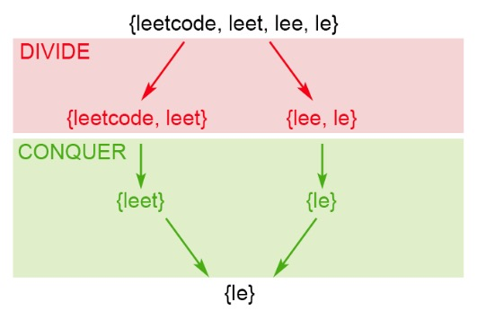 </div>

```c++
class Solution {
public:
    string longestCommonPrefix(vector<string>& strs) {
        if(strs.size() == 0)    return "";
        if(strs.size() == 1)    return strs[0];
        
        return longestCommonPrefix(strs,0,strs.size() - 1);
    }
private:
    string longestCommonPrefix(vector<string>& strs,int l,int r){
        if(l > r)   return "";
        if(l == r)  return strs[l];
        
        int mid = (l + r) >> 1;
        string s1 = longestCommonPrefix(strs,l,mid);
        string s2 = longestCommonPrefix(strs,mid + 1,r);
        return longestCommonPrefix(s1,s2);
    }
    
    string longestCommonPrefix(const string &s1,const string &s2){
        string res = "";
        int minLen = min(s1.length(),s2.length());
        for(int i = 0;i < minLen;i++){
            if(s1[i] != s2[i])  break;
            else   res += s1[i];
        }
        return res;
    }
};
```

#### 3）二分查找

以第一个字符串为模板，首先判断其前半部分是否是其余n-1个字符串的前缀；

* 如果是，则添加后半部分字符串的前半部分，使得前缀更长，继续判断是否是其余n-1个字符串的前缀
* 如果不是，则判断前半部分字符串的前半部分是否是其余n-1个字符串的前缀...

<div align="center"> 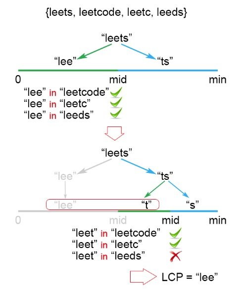 </div>

```c++
class Solution {
public:
    string longestCommonPrefix(vector<string>& strs) {
        if(strs.size() == 0)    return "";
        if(strs.size() == 1)    return strs[0];
        
        int l = 0,r = strs[0].length() - 1;
        string res = "";
        while(l <= r){
            int mid = (l + r) / 2;
            string prefix = strs[0].substr(0,mid + 1);
            if(longestCommonPrefix(strs,prefix)){
                l = mid + 1;
                res = prefix;
            }
            else
                r = mid - 1;
        }
        return res;
    }
private:
    bool longestCommonPrefix(vector<string>& strs,const string &s){
        int len = s.length();
        int i = 1;
        for(;i < strs.size() && strs[i].length() >= len;i++)
            for(int j = 0;j < len;j++)
                if(strs[i][j] != s[j])
                    return false;
        if(i < strs.size()) return false;
        return true;
    }
};
```

<br>
<br>

## 电话号码的字符组合

[OJ链接](https://leetcode.com/problems/letter-combinations-of-a-phone-number/description/)

给定一个仅包含数字 2-9 的字符串，返回所有它能表示的字母组合。
给出数字到字母的映射如下（与电话按键相同）。注意 1 不对应任何字母。


示例:

```
输入："23"
输出：["ad", "ae", "af", "bd", "be", "bf", "cd", "ce", "cf"].
```

说明:

尽管上面的答案是按字典序排列的，但是你可以任意选择答案输出的顺序。

### 解答


对于每个当前正在处理的数字，遍历这个数字的所有字母，将其添加到所有结果字符串的末尾，组成新的结果，然后处理下一个数字

<div align="center"> 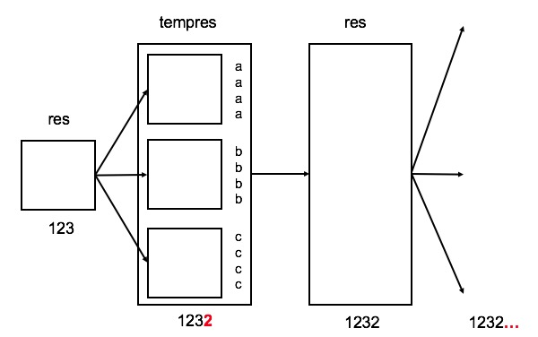 </div>

```c++
vector<string> letterCombinations(string digits) {
    vector<string> res;
    string charmap[10] = {"0", "1", "abc", "def", "ghi", "jkl", "mno", "pqrs", "tuv", "wxyz"};
    res.push_back("");
    for (int i = 0; i < digits.size(); i++)
    {
        vector<string> tempres;
        string chars = charmap[digits[i] - '0'];
        for (int c = 0; c < chars.size();c++)
            for (int j = 0; j < res.size();j++)
                tempres.push_back(res[j]+chars[c]);
        res = tempres;
    }
    return res;
}
```

<br>
<br>

## 子串查找

[OJ链接](https://leetcode.com/problems/implement-strstr/description/)

实现 [strStr()](https://baike.baidu.com/item/strstr/811469) 函数。

给定一个 haystack 字符串和一个 needle 字符串，在 haystack 字符串中找出 needle 字符串出现的第一个位置 (从0开始)。如果不存在，则返回  -1。

示例 1:

```
输入: haystack = "hello", needle = "ll"
输出: 2
```

示例 2:

```
输入: haystack = "aaaaa", needle = "bba"
输出: -1
```

说明:

当 `needle` 是空字符串时，我们应当返回什么值呢？这是一个在面试中很好的问题。

对于本题而言，当 `needle` 是空字符串时我们应当返回 0 。这与C语言的 [strstr()](https://baike.baidu.com/item/strstr/811469) 以及 Java的 [indexOf()](https://docs.oracle.com/javase/7/docs/api/java/lang/String.html#indexOf(java.lang.String)) 定义相符。

### 解答

#### 1）蛮力法

假设haystack长度为n, needle长度为m，遍历haystack的前n-m个字符，对于每个字符，如果等于needle的首字符则继续比较

**时间复杂度**：O(n\*m)

```c++
class Solution {
public:
    //
    int strStr(string haystack, string needle) {
        if(needle.size() == 0)
            return 0;
        
        char c = needle[0];
        int sz1 = haystack.size(),sz2 = needle.size();
        for(int i = 0 ;i <= sz1 - sz2;i++){
            if(haystack[i] == c){
                int j;
                for(j = 0;j < sz2;j++){
                    if(haystack[i+j] != needle[j])
                        break;
                }
                if(j == needle.size())
                    return i;
            }
        }
        
        return -1;
    }
};
```

#### 2）KMP算法

[KMP算法——知乎海纳](https://www.zhihu.com/question/21923021)

**PMT(部分匹配表)：PMT中的值是字符串的前缀集合与后缀集合交集中最长串的长度**（注意，这里的前缀和后缀都不包括字符串本身）

那么PMT如何在字符串查找中运用？在字符串查找中，我们**为模版字符串创建PMT表，若模版字符串长度len，就有len个PMT值**。假设有如下例子：

* 主字符串：`"ababababca"`
* 模版字符串：`"abababca"`

模版字符串`“abababca”`相应的PMT值如下表：

<div align="center"> 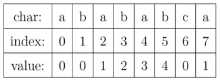 </div>

* 字符串`"a"`不包含前缀和后缀（因为前缀和后缀不包含字符串本身），所以PMT中相应的值为0
* 字符串`"ab"`包含前缀`{"a"}`，包含后缀`{"b"}`，没有交集，所以PMT中相应的值为0
* 字符串`"aba"`包含前缀`{"a","ab"}`，包含后缀`{"a","ba"}`交集为`"a"`，所以相应的PMT值为1
* ...

那么当字符串查找过程中在模板字符`j`位置开始不匹配时（如下图（a）），这意味着主字符串从 `i−j` 到 `i` 这一段是与模板字符串的 `0` 到 `j` 这一段是完全相同的（即字符串`"ababab"`）。通过查找PMT表我们知道，字符串`"ababab"`前缀集合与后缀集合交集中最长串(`"abab"`)的长度为4，这说明了主字符串中 `i` 指针之前的 `PMT[j − 1]（此处值为4）` 位就一定与模板字符串的第 `0` 位至第 `PMT[j − 1]（此处值为4）` 位是相同的。**这样一来，就可以将这些字符段的比较省略掉。具体的做法是，保持`i`指针不动，然后将`j`指针指向模式字符串的`PMT[j − 1]`位即可**（**这也是KMP的核心：通过使用PMT省略不必要字符段的比较**），从而进入图（b）的状态：

<div align="center"> 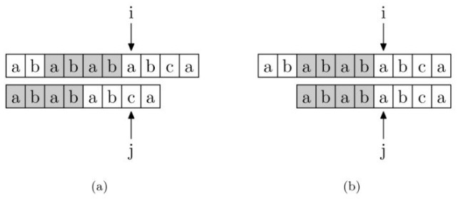 </div>

如果是在 `j` 位失配，那么影响 `j` 指针回溯的位置的其实是第 `j − 1` 位的 PMT 值，所以为了编程的方便，我们不直接使用PMT数组，而是将PMT数组向后偏移一位。我们把新得到的这个数组称为next数组：

<div align="center"> 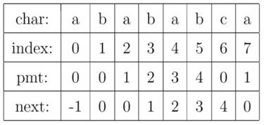 </div>

以下为KMP算法：

```c
int KMP(char *t, char *p) 
{
    int i = 0; 
    int j = 0;

    while (i < strlen(t) && j < strlen(p))
    {
        if (j == -1 || t[i] == p[j]) 
        {
            i++;
            j++;
        }
        else 
            j = next[j];
    }

    if (j == strlen(p))
       return i - j;
    else 
       return -1;
}
```

最后是如何求next数组？求next数组的过程完全可以看成字符串匹配的过程，即以模式字符串为主字符串，以模式字符串的前缀为目标字符串，一旦字符串匹配成功，那么当前的next值就是匹配成功的字符串的长度

具体来说，就是从模式字符串的第一位(注意，不包括第0位)开始对自身进行匹配运算。 在任一位置，能匹配的最长长度就是当前位置的next值。如下图所示：

<div align="center"> 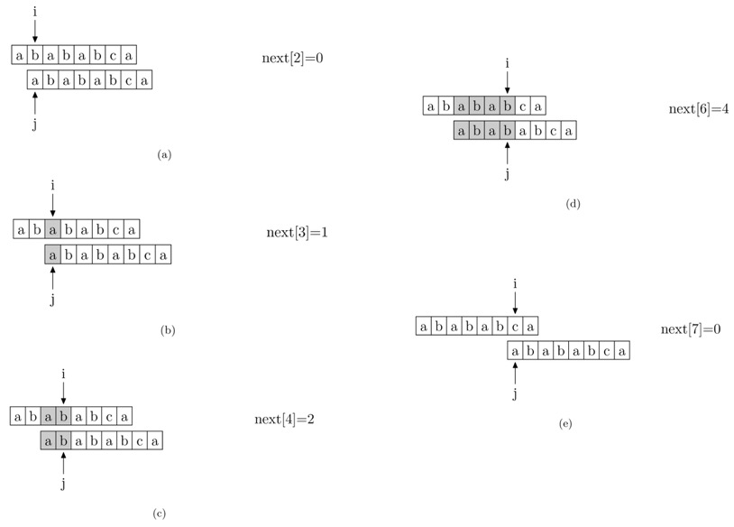 </div>

求next数组值的代码如下：

```c
void getNext(char *p, int *next)
{
    next[0] = -1;
    int i = 0, j = -1;

    while (i < strlen(p) - 1)
    {
        if (j == -1 || p[i] == p[j])
        {
            ++i;
            ++j;
            next[i] = j;
        }   
        else
            j = next[j];
    }
}
```

该题使用KMP的解法：

```c++
class Solution {
public:
    int strStr(string haystack, string needle) {
        int len1 = haystack.length(),len2 = needle.length();

        /*以下计算next数组的值*/
        vector<int> next(len2,-1);
        int i = 0,j = -1;
        while(i < len2 - 1){
            if(j == -1 || needle[i] == needle[j]){
                i++,j++;
                next[i] = j;
            }
            else
                j = next[j];
        }
        
        /*以下进行字符串查找*/
        i = 0,j = 0;
        while(i < len1 && j < len2){
            if(j == -1 || haystack[i] == needle[j])
                i++,j++;
            else
                j = next[j];
        }
        
        if(j == len2)   return i - j;
        else            return -1;
    }
};
```

<br>
<br>

## 报数

[OJ链接](https://leetcode.com/problems/count-and-say/description/)

报数序列是指一个整数序列，按照其中的整数的顺序进行报数，得到下一个数。其前五项如下：

```
1.     1
2.     11
3.     21
4.     1211
5.     111221

1 被读作  "one 1"  ("一个一") , 即 11
11 被读作 "two 1s" ("两个一"）, 即 21
21 被读作 "one 2",  "one 1" （"一个二" ,  "一个一") , 即 1211
```

给定一个正整数 n ，输出报数序列的第 n 项。

注意：整数顺序将表示为一个字符串。

示例 1:

```
输入: 1
输出: "1"
```

示例 2:

```
输入: 4
输出: "1211"
```

### 解答

统计每个数字出现的次数，在下一个不同数字出现时，将这个数字的结果添加到结果字符串中，然后统计下一个数字

```c++
class Solution {
public:
    string countAndSay(int n) {
        if(n <= 0)  return "";
        else if(n == 1) return "1";
        
        string res = "1";
        while(--n){
            string s = "";
            char c = res[0];
            int count = 1;
            for(int i = 1;i < res.length();i++){
                if(res[i] == c) count++;
                else{
                    s += to_string(count) + c;
                    c = res[i];
                    count = 1;
                }
            }
            s += to_string(count) + c;
            res = s;
        }
        
        return res;
    }
};
```

<br>
<br>

## 字母异位词分组

[OJ链接](https://leetcode.com/problems/group-anagrams/description/)

给定一个字符串数组，将字母异位词组合在一起。字母异位词指字母相同，但排列不同的字符串。

示例:

```
输入: ["eat", "tea", "tan", "ate", "nat", "bat"],
输出:
[
  ["ate","eat","tea"],
  ["nat","tan"],
  ["bat"]
]
```

说明：

* 所有输入均为小写字母。
* 不考虑答案输出的顺序。

### 解答

#### 1）排序后映射

可以比较每个字符串排序后的字符串，字符异位的字符串排序后肯定是同一个字符串

因此，使用一个map存储“排序后字符串”和“异位字符串集合”的映射，key的类型是string，表示排序后的字符串，value是vector\<string\>，表示每个一组异位词

对于每个字符串，排序后进行查找，如果找到则插入，否则向map中插入一个新的映射

假设参数字符串数组包含N个字符串，最长的字符串包含K个字符

* **时间复杂度**：O(N\*K\*log(K))
* **空间复杂度**：O(N\*K)

```c++
class Solution {
public:
    vector<vector<string>> groupAnagrams(vector<string>& strs) {
        vector<vector<string>> res;
        map<string,vector<string>> mp;
        
        for(int i = 0;i < strs.size();i++){
            string tp = strs[i];
            sort(tp.begin(),tp.end());
            
            if(mp.find(tp) == mp.end()){
                vector<string> v;
                v.push_back(strs[i]);
                mp.insert(pair<string,vector<string>>(tp,v));
            }
            else{
                mp.find(tp)->second.push_back(strs[i]);
            }
        }
        
        for(auto e : mp){
            res.push_back(e.second);
        }
        
        return res;
    }
};
```

#### 2）设计hash

同样使用一个map，但是不对字符串进行排序，因此可以提高效率，关键是如何设计key，可以使两个字符颠倒的字符串得到相同的key？

由于所有字符颠倒的字符串肯定包含相同的字符，并且每个字符的计数也相同，因此可以对26个小写字母与（题目规定了字符串的字符为小写）进行计数，对于字符串"aabc"，包含2个'a'，1个'b'和1个'c'。因此key可以设计成"#2#1#1#0#0...#0"，这样对于字符串”abac“也会得到相同的key

假设参数字符串数组包含N个字符串，最长的字符串包含K个字符

* **时间复杂度**：O(N\*K)
* **空间复杂度**：O(N\*K)

[参考](https://leetcode.com/problems/group-anagrams/solution/)

<br>
<br>

## 有效的括号

[OJ链接](https://leetcode.com/problems/valid-parentheses/description/)

给定一个只包括 '('，')'，'{'，'}'，'['，']' 的字符串，判断字符串是否有效。

有效字符串需满足：

1. 左括号必须用相同类型的右括号闭合。
2. 左括号必须以正确的顺序闭合。

注意空字符串可被认为是有效字符串。

示例 1:

```
输入: "()"
输出: true
```

示例 2:

```
输入: "()[]{}"
输出: true
```

示例 3:

```
输入: "(]"
输出: false
```

示例 4:

```
输入: "([)]"
输出: false
```

示例 5:

```
输入: "{[]}"
输出: true
```

### 解答

使用一个栈，当出现‘(’,'{','['时，将字符压入栈中。当出现‘)’,'}',']'时，判断栈是否为空，不为空的话判断栈顶的元素是否是对应匹配的左括号，如果是则找到一对匹配的括号，弹出。当遍历完字符串后，如果栈不为空，说明存在左括号缺少对应匹配的右括号，那么返回false，否则返回true

```
class Solution {
public:
    bool isValid(string s) {
        stack<char> stack;
        for(int i = 0;i < s.length();i++){
            switch(s[i]){
                case ')':
                    if(stack.empty() || stack.top() != '(')
                        return false;
                    stack.pop();
                    break;
                case '}':
                    if(stack.empty() || stack.top() != '{')
                        return false;
                    stack.pop();
                    break;
                case ']':
                    if(stack.empty() || stack.top() != '[')
                        return false;
                    stack.pop();
                    break;
                default:
                    stack.push(s[i]);
                    break;
            }
        }
        return stack.empty() ? true : false;
    }
};
```

<br>
<br>

## 数字字符串解码

[OJ链接](https://leetcode.com/problems/decode-ways/description/)

一条包含字母 `A-Z` 的消息通过以下方式进行了编码：

```
'A' -> 1
'B' -> 2
...
'Z' -> 26
```

给定一个只包含数字的非空字符串，请计算解码方法的总数。

示例 1:

```
输入: "12"
输出: 2
解释: 它可以解码为 "AB"（1 2）或者 "L"（12）。
```

示例 2:

```
输入: "226"
输出: 3
解释: 它可以解码为 "BZ" (2 26), "VF" (22 6), 或者 "BBF" (2 2 6) 。
```

### 解答

动态规划，考虑包含n个字符的字符串s[0,1,...,n-1]

* 如果将第一个字符单独解码，设字符串s[1,2,...,n-1]的解码方式有state1种
* 如果能将前两个字符一起解码，设字符串s[2,3,...,n-1]的解码方式有state2种

因此，可以得到一个状态转移方程：

* F(s[0,1,...,n-1]) = state1 (不能将前2个字符一起解码时)
* F(s[0,1,...,n-1]) = state1 + state2 (能将前2个字符一起解码时)
* **还有一种情况，就是如果字符串以‘0’开头，那么单独的‘0’或‘0X’这种形式都无法解码，所以F(s[0,1,...,n-1]) = 0**

```c++
class Solution {
public:
    int numDecodings(string s) {
        if(s.size() == 0)   return 0;
        else if(s.size() == 1)  return s[0] == '0' ? 0 : 1;
        
        int end = s.size() - 1;
        int state1 = s[end] == '0' ? 0 : 1 , state2 = 1;
        int res;
        for(int i = end - 1;i >= 0; i--){
            if(s[i] == '0') res = 0;
            else if(stoi(s.substr(i,2)) > 26)    res = state1;
            else    res = state1 + state2;
            state2 = state1;
            state1 = res;
        }
        return res;
    }
};
```

<br>
<br>

## 单词阶梯

[OJ链接](https://leetcode.com/problems/word-ladder/description/)

给定两个单词（beginWord 和 endWord）和一个字典，找到从 beginWord 到 endWord 的最短转换序列的长度。转换需遵循如下规则：

1. 每次转换只能改变一个字母。
2. 转换过程中的中间单词必须是字典中的单词。

说明:

* 如果不存在这样的转换序列，返回 0。
* 所有单词具有相同的长度。
* 所有单词只由小写字母组成。
* 字典中不存在重复的单词。
* 你可以假设 beginWord 和 endWord 是非空的，且二者不相同。

示例 1:

```
输入:
beginWord = "hit",
endWord = "cog",
wordList = ["hot","dot","dog","lot","log","cog"]

输出: 5

解释: 一个最短转换序列是 "hit" -> "hot" -> "dot" -> "dog" -> "cog",
     返回它的长度 5。
```

示例 2:

```
输入:
beginWord = "hit"
endWord = "cog"
wordList = ["hot","dot","dog","lot","log"]

输出: 0

解释: endWord "cog" 不在字典中，所以无法进行转换。
```

### 解答

#### 1）BFS

<div align="center"> 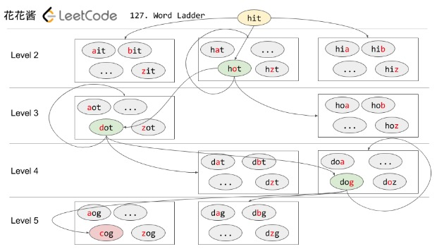 </div>

```c++
class Solution {
public:
    int ladderLength(string beginWord, string endWord, vector<string>& wordList) {
        if(beginWord.size() != endWord.size())  return 0;
        
        unordered_set<string> dict(wordList.begin(),wordList.end());
        if(dict.find(endWord) == dict.end())    return 0;
        
        deque<string> q;    //for BFS
        q.push_back(beginWord);
        dict.erase(beginWord);
        
        int length = beginWord.size();
        int step = 0;
        
        while(!q.empty()){
            ++step;
            for(int level = q.size();level > 0;level--){//一层一层处理
                string s = q.front();
                q.pop_front();
                for(int i = 0;i < length;i++){
                    char c = s[i];
                    for(int j = 'a';j <= 'z';j++){
                        s[i] = j;
                        if(s == endWord)    return step + 1;
                        else if(dict.find(s) == dict.end()) continue;
                        q.push_back(s);
                        dict.erase(s);
                    }
                    s[i] = c;
                }
            }
        }
        
        return 0;
    }
};
```

#### 2）双向BFS

<div align="center"> 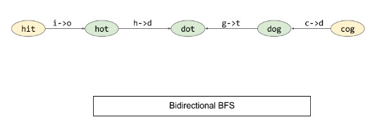 </div>

```c++
class Solution {
public:
    int ladderLength(string beginWord, string endWord, vector<string>& wordList) {
        if(beginWord.size() != endWord.size())  return 0;
        
        unordered_set<string> dict(wordList.begin(),wordList.end());
        if(dict.find(endWord) == dict.end())    return 0;
        
        //双向BFS，所以需要两个队列，但是每次需要查找一个字符串是否在另一个队列中，
        //所以使用unordered_set替代deque
        unordered_set<string> bq = {beginWord};
        unordered_set<string> eq = {endWord};
        dict.erase(beginWord);
        dict.erase(endWord);
        
        int length = beginWord.size();
        int step = 0;
        
        while(!bq.empty() && !eq.empty()){
            if(bq.size() > eq.size())//每次从首端和尾端选择节点较少的一层处理
                std::swap(bq,eq);
        
            step++;
            unordered_set<string> q;
            
            for(auto s : bq){//一层一层处理
                for(int i = 0;i < length;i++){
                    char c = s[i];
                    for(int j = 'a';j <= 'z';j++){
                        s[i] = j;
                        if(eq.find(s) != eq.end())  return step + 1;
                        else if(dict.find(s) == dict.end()) continue;
                        q.insert(s);
                        dict.erase(s);
                    }
                    s[i] = c;
                }
            }
            
            std::swap(q,bq);
        }
        
        return 0;
    }
};
```

<div align="center"> 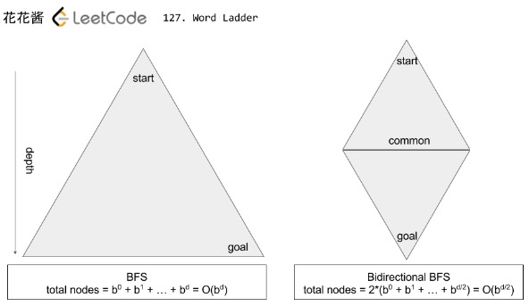 </div>

[参考](http://zxi.mytechroad.com/blog/searching/127-word-ladder/)

<br>
<br>

## 分割回文串

[OJ链接](https://leetcode.com/problems/palindrome-partitioning/description/)

给定一个字符串 s，将 s 分割成一些子串，使每个子串都是回文串。

返回 s 所有可能的分割方案。

示例:

```
输入: "aab"
输出:
[
  ["aa","b"],
  ["a","a","b"]
]
```

### 解答

#### 1）DFS

对于字符串str,遍历从下标0开始的每一个子串：

* 如果子串[0,i]是回文，则将子串添加到路径，递归处理剩余子串[i+1,n]
* 如果子串[0,i]不是回文，处理下一个子串[0,i+1]
* 如果字符串str为空，表示已经递归处理(DFS)到结尾，那么将这条路径添加到结果中
* 每处理完一条路径，递归返回时，需要将之前添加到路径结尾的回文串[0,i]弹出

> DFS会求重复子问题，比如”aabcd“，判断"a"是回文时，递归处理"abcd"时判断"a"是回文，进而 会求"bcd"；往后在判断"aa"是回文时，也会递归处理“bcd”

```c++
class Solution {
public:
    vector<vector<string>> partition(string s) {
        vector<vector<string>> res;
        vector<string> path;
        
        dfs(s,path,res);
        
        return res;
    }
    
    void dfs(string s,vector<string> &path,vector<vector<string>> &res){
        if(s.empty())   res.push_back(path);
        
        for(int len = 1;len <= s.size();len++){
            string substr = s.substr(0,len);
            if(isPalindrome(substr)){
                path.push_back(substr);
                dfs(s.substr(len),path,res);
                path.pop_back();
            }
        }
    }
    
private:
    bool isPalindrome(const string &str){
        int l = 0,r = str.size() - 1;
        while(l < r){
            if(str[l++] == str[r--])    continue;
            else return false;
        }
        return true;
    }
};
```

#### 2）动态规划

> 这种解法结合[单词拆分II](#单词拆分ii)一起分析，是求类似问题的通用解法

对于`“aaabc”`：

* 如果`“aaabc”`是回文，那么单独构成一个解
* 如果`“aabc”`是回文，那么递归求出`“a”`的结果，在结果的每个解后面`push_back`回文`"aabc"`，得到了一组解
* 如果`“abc”`是回文，那么递归求出`“aa”`的结果，在结果的每个解后面`push_back`回文`"abc"`，得到了一组解
* ...
* 如果`“c”`是回文，那么递归求出`“aabc”`的结果，在结果的每个解后面`push_back`回文`"aabc"`，得到了一组解

在递归过程中，为了防止求重复子问题，使用`mem`保存状态，即每个子问题的解，如果后续需要求相同子问题的解，可以从`mem`中直接取出结果

```c++
class Solution {
public:
    vector<vector<string>> partition(string s) {
        unordered_map<int,vector<vector<string>>> mem;
        partition(s,s.length() - 1,mem);
        return mem[s.length() - 1];
    }
private:
    void partition(const string &s,int r,unordered_map<int,vector<vector<string>>> &mem){
        if(mem.find(r) != mem.end())    return;
        
        if(isPalindrome(s.substr(0,r + 1)))
            mem[r].push_back(vector<string>({s.substr(0,r + 1)}));
        
        for(int len = r;len >= 1;len--){//右边子串的长度
            int leftLen = r + 1 - len;
            const string &right = s.substr(leftLen,len);
            if(isPalindrome(right)){
                partition(s,leftLen - 1,mem);
                for(vector<string> left : mem[leftLen - 1]){
                    left.push_back(right);
                    mem[r].push_back(left);
                }
            }
        }
    }
    
    bool isPalindrome(const string &s){
        int i = 0,j = s.length() - 1;
        while(i < j && s[i] == s[j]){
            i++;
            j--;
        }
        return i >= j;
    }
};
```

<br>
<br>

## 单词拆分I

[OJ链接](https://leetcode.com/problems/word-break/description/)

给定一个非空字符串 s 和一个包含非空单词列表的字典 wordDict，判定 s 是否可以被空格拆分为一个或多个在字典中出现的单词。

说明：

* 拆分时可以重复使用字典中的单词。
* 你可以假设字典中没有重复的单词。

示例 1：

```
输入: s = "leetcode", wordDict = ["leet", "code"]
输出: true
解释: 返回 true 因为 "leetcode" 可以被拆分成 "leet code"。
```

示例 2：

```
输入: s = "applepenapple", wordDict = ["apple", "pen"]
输出: true
解释: 返回 true 因为 "applepenapple" 可以被拆分成 "apple pen apple"。
     注意你可以重复使用字典中的单词。
```

示例 3：

```
输入: s = "catsandog", wordDict = ["cats", "dog", "sand", "and", "cat"]
输出: false
```

### 解答

对于字符串“leetcode”：

* 如果字符串"l"存在于字典中，则字符串"leetcode"能否由字典中的单词构成取决于字符串“eetcode”能否由字典中的单词构成
* 如果字符串“l”不在字典中，则判断字符串“le”是否字典中，如果在，则字符串“leetcode”能否由字典中的单词构成取决于字符串“etcode”能否由字典中的单词构成
* 如果字符串“le”也不在字典中，那么判断字符串"lee"是否在字典中，如果在，则字符串“leetcode”能否由字典中的单词构成取决于字符串"tcode"能否由字典中的单词构成
* ...

令state[i]表示字符串中从下标i开始到结尾的子串能否由字典中的单词构成。对于"leetcode"：

* state[0]就表示“leetcode”能否由字典中的单词构成
* state[2]就表示“etcode”能否由字典中的单词构成
* state[8]就表示""能够由字典中的单词构成

假设substr(i,j)表示字符串s中下标i到下标j的子串，那么state[i] = dict.contain(substr(i,j)) && state[j + 1]

* **时间复杂度**：O(n^2)（n为字符串长度）
* **空间复杂度**：O(n + m)（n为字符串长度，m为字典中单词数）

```c++
class Solution {
public:
    bool wordBreak(string s, vector<string>& wordDict) {
        unordered_set<string> dict(wordDict.begin(),wordDict.end());
        bool *state = new bool[s.size() + 1];
        for(int i = 0;i < s.size();i++) state[i] = false;
        state[s.size()] = true;
        
        for(int idx = s.size() - 1;idx >= 0;idx--){
            for(int len = 1;len <= s.size() - idx && !state[idx];len++)
                if(dict.find(s.substr(idx,len)) != dict.end())
                    state[idx] = state[idx + len];
        }
        
        return state[0];
    }
};
```

<br>
<br>

## 单词拆分II

[OJ链接](https://leetcode.com/problems/word-break-ii/description/)

给定一个非空字符串 s 和一个包含非空单词列表的字典 wordDict，在字符串中增加空格来构建一个句子，使得句子中所有的单词都在词典中。返回所有这些可能的句子。

说明：

* 分隔时可以重复使用字典中的单词。
* 你可以假设字典中没有重复的单词。

示例 1：

```
输入:
s = "catsanddog"
wordDict = ["cat", "cats", "and", "sand", "dog"]
输出:
[
  "cats and dog",
  "cat sand dog"
]
```

示例 2：

```
输入:
s = "pineapplepenapple"
wordDict = ["apple", "pen", "applepen", "pine", "pineapple"]
输出:
[
  "pine apple pen apple",
  "pineapple pen apple",
  "pine applepen apple"
]
解释: 注意你可以重复使用字典中的单词。
```

示例 3：

```
输入:
s = "catsandog"
wordDict = ["cats", "dog", "sand", "and", "cat"]
输出:
[]
```

### 解答

对于字符串`s`，设其所有可能的句子为`f(s)`，字典为`dict`

* 如果`left = s`包含在`dict`中，设`right = s.substr(len)`，如果`f(right)`能够由`dict`构建为句子，那么`f(s) += append(s,f(right))`（`append`表示在`f(right)`的所有结果前加上`s + ' '`）
* 如果`left = s.substr(0,len - 1)`包含在`dict`中，设`right = s.substr(len - 1)`，如果`f(right)`能够由`dict`构建为句子，那么`f(s) += append(s,f(right))`
* 如果`left = s.substr(0,len - 2)`包含在`dict`中，设`right = s.substr(len - 2)`，如果`f(right)`能够由`dict`构建为句子，那么`f(s) += append(s,f(right))`
* ...

从上面可以看出，每个问题`f`可以转化成一个规模更小的子问题。但是在求子问题时可能会重复计算，因此，如果以前求过`f(right)`，那么当需要再次求`f(right)`时，为了避免重复计算，希望快速得到结果，因此使用`mem`记录每个已经求得的子问题的值，那么有2种方案：

1. **迭代(自下往上)**：首先求出最小的子问题，然后逐渐增大，直到求出`f(s)`。这种方案会保存每一个子问题的解，即使这个子问题的解可能并不会用到，因此可能消耗大量内存
2. **递归(自上往下)**：最先求得的还是最小的子问题，但是是从上往下进行递归调用。和迭代不同的是，只有`left`在`dict`中存在时，我们才会递归求`f(right)`，因此可以避免保存一些不必要的子问题的解，节约内存

比如下列例子：

```
//以下分别为s和dict
"aaaaaaaaaaaaaaaaaaaaaaaaaaaaaaaaaaaaaaaaaaaaaaaaaaaaaaaaaaaaaaaaaaaaaaaaaaabaaaaaaaaaaaaaaaaaaaaaaaaaaaaaaaaaaaaaaaaaaaaaaaaaaaaaaaaaaaaaaaaaaaaaaaaaaa"
["a","aa","aaa","aaaa","aaaaa","aaaaaa","aaaaaaa","aaaaaaaa","aaaaaaaaa","aaaaaaaaaa"]
```

* 如果使用**迭代**，那么从`s`最右边开始，会分别求出`"a"`、`"aa"`、`"aaa"`、`"aaaa"`，,...的解，然后保存
* 如果使用**递归**
    - 因为`left = s.substr(0,len - 1)`不在`dict`中，所以不会进一步求`"s"`的解
    - 因为`left = s.substr(0,len - 2)`不在`dict`中，所以不会进一步求`"ss"`的解
    - 因为`left = s.substr(0,len - 3)`不在`dict`中，所以不会进一步求`"sss"`的解
    - ...
    - 因为`left = s.substr(0,10)`在`dict`中，所以进一步求`right = s.substr(10)`的解
        + 最终会递归到求`right = "baaaa...."`的解，由于任意`right.substr(0,k)`都不再`dict`中，所以返回一个空结果，即`baaa....`不能由`dict`构成句子，那么最终结果也就是`s`也不能由`dict`构成句子

从上面结果可以看出，如果使用**迭代**，可能会保存很多不必要的子问题的解，而使用**递归**，因为只在必要时会求解子问题，所以保存的子问题的解一定是必要的。因此可以节约内存

> 下面的代码`mem`使用的是map而不是vector，因此vector不方便判断一个子问题是还未进行求解还是已经求过解但是解为空，当然vector也可以实现，但是需要一个额外的数组来标记一个子问题是否已经进行过计算。可读性可能没那么好

#### 1）迭代（Memory Limit Exceeded）

```c++
class Solution {
public:
    vector<string> wordBreak(string s, vector<string>& wordDict) {
        if(s.length() == 0)   return vector<string>();
        
        unordered_set<string> dict(wordDict.begin(),wordDict.end());
        
        int len = s.length();
        unordered_map<int,vector<string>> mem;
        if(dict.find(s.substr(len - 1)) != dict.end()) 
            mem[len - 1].push_back(s.substr(len - 1));
        
        for(int l = len - 2;l >= 0;l--){
            string substr = s.substr(l);
            if(dict.find(substr) != dict.end()) mem[l].push_back(substr);
            for(int r = len - 2;r >= l;r--){
                const string &left = s.substr(l,r - l + 1);
                if(dict.find(left) != dict.end()){
                    if(mem.find(r + 1) != mem.end())
                        for(const string &right : mem[r + 1])
                            mem[l].push_back(left + " " + right);
                }
            }
        }
        
        return mem[0];
    }
};
```

#### 2）递归

```c++
class Solution {
public:
    vector<string> wordBreak(string s, vector<string>& wordDict) {
        unordered_set<string> dict(wordDict.begin(),wordDict.end());
        unordered_map<int,vector<string>> mem(s.length());
        wordBreak(s,0,dict,mem);
        return mem[0];
    }
private:
    void wordBreak(const string &s,int l,unordered_set<string> dict,
                                    unordered_map<int,vector<string>> &mem){
        if(mem.find(l) != mem.end()) return;
        
        vector<string> res;
        if(dict.find(s.substr(l)) != dict.end())
            res.push_back(s.substr(l));
        
        for(int len = s.length() - l - 1;len >= 1;len--){
            const string &left = s.substr(l,len);
            int r = l + len;
            if(dict.find(left) != dict.end()){
                wordBreak(s,r,dict,mem);
                for(const string &right : mem[r])
                    res.push_back(left + " " + right);
            }
        }
        mem[l].insert(mem[l].end(),res.begin(),res.end());
    }
};
```

<br>
<br>

## 有效的字母异位词

[OJ链接](https://leetcode.com/problems/valid-anagram/description/)

给定两个字符串 s 和 t ，编写一个函数来判断 t 是否是 s 的一个字母异位词。

示例 1:

```
输入: s = "anagram", t = "nagaram"
输出: true
```

示例 2:

```
输入: s = "rat", t = "car"
输出: false
```

说明:

你可以假设字符串只包含小写字母。

进阶:

如果输入字符串包含 unicode 字符怎么办？你能否调整你的解法来应对这种情况？

### 解答

#### 1）排序

将两个字符串按字典序排序，然后判断是否相等

### 2）哈希表

使用哈希表，统计字符串s中各字符的出现次数，然后遍历字符串t，如果遇到一个s中的字符，则计数减1，如果字符不在s中，则返回false。最终如果哈希表中所有字符的计数都刚好减为0那么就是异位词：

```c++
class Solution {
public:
    bool isAnagram(string s, string t) {
        unordered_map<char,int> map;
        for(char c : s)
            map[c]++;
        
        for(char c : t){
            if(map[c] == 0) return false;
            else    map[c]--;
        }
        
        for(auto p : map)
            if(p.second > 0)
                return false;
        
        return true;
    }
};
```

<br>
<br>

## 翻转字符串

[OJ链接](https://leetcode.com/problems/reverse-string/description/)

请编写一个函数，其功能是将输入的字符串反转过来。

示例：

```
输入：s = "hello"
返回："olleh"
```

### 解答

```c++
class Solution {
public:
    string reverseString(string s) {
        int l = 0,r = s.length() - 1;
        while(l < r)
            swap(s[l++],s[r--]);
        return s;
    }
};
```

<br>
<br>

## 实现Trie树

[OJ链接](https://leetcode.com/problems/implement-trie-prefix-tree/description/)

实现一个 Trie (前缀树)，包含 insert, search, 和 startsWith 这三个操作。

示例:

```
Trie trie = new Trie();

trie.insert("apple");
trie.search("apple");   // 返回 true
trie.search("app");     // 返回 false
trie.startsWith("app"); // 返回 true
trie.insert("app");   
trie.search("app");     // 返回 true
```

说明:

* 你可以假设所有的输入都是由小写字母 a-z 构成的。
* 保证所有输入均为非空字符串。

### 解答

```c++
class TrieNode{
public:
    TrieNode(){ 
        memset(next,0,sizeof(next));
        word = false;
    }
    
    bool containChar(char c){return next[c - 'a'] == NULL ? false : true;}
    
    void putNext(char c,TrieNode *nd){next[c - 'a'] = nd;}
    
    TrieNode* getNext(char c) {return next[c - 'a'];}
    
    bool isWord() {return word;}
    
    void setWord() {word = true;} 
private:
    bool word;//从根节点到当前节点的所有字符组成的单词是否包含在字典中
    TrieNode* next[26];
};

class Trie {
public:
    /** Initialize your data structure here. */
    Trie() {
        root = new TrieNode();
    }
    
    /** Inserts a word into the trie. */
    void insert(string word) {
        TrieNode *curr = root;
        for(char c : word){
            if(curr->containChar(c))    curr = curr->getNext(c);
            else{
                TrieNode *newNode = new TrieNode();
                curr->putNext(c,newNode);
                curr = newNode;
            }
        }
        curr->setWord();
    }
    
    /** Returns if the word is in the trie. */
    bool search(string word) {
        TrieNode *curr = root;
        int len = 0;
        for(char c : word){
            if(!curr->containChar(c))   break;
            else    curr = curr->getNext(c);
            len++;
        }
        if(len != word.size())  return false;
        return curr->isWord();
    }
    
    /** Returns if there is any word in the trie that starts with the given prefix. */
    bool startsWith(string prefix) {
        TrieNode *curr = root;
        int len = 0;
        for(char c : prefix){
            if(!curr->containChar(c))   break;
            else    curr = curr->getNext(c);
            len++;
        }
        if(len != prefix.size())  return false;
        return true;
    }
private:
    TrieNode *root;
};

/**
 * Your Trie object will be instantiated and called as such:
 * Trie obj = new Trie();
 * obj.insert(word);
 * bool param_2 = obj.search(word);
 * bool param_3 = obj.startsWith(prefix);
 */
```

<br>
<br>

## 至少有K个重复字符的最长子串

[OJ链接](https://leetcode.com/problems/longest-substring-with-at-least-k-repeating-characters/description/)

找到给定字符串（由小写字符组成）中的最长子串 T ， 要求 T 中的每一字符出现次数都不少于 k 。输出 T 的长度

示例 1:

```
输入:
s = "aaabb", k = 3

输出:
3

最长子串为 "aaa" ，其中 'a' 重复了 3 次
```

示例 2:

```
输入:
s = "ababbc", k = 2

输出:
5

最长子串为 "ababb" ，其中 'a' 重复了 2 次， 'b' 重复了 3 次
```

### 解答

1. 遍历字符串，统计每个字符出现的次数
2. 找到字符串中第一个出现次数少于K的字符，这个字符显然不会出现在满足要求的子串中，因此它将字符串分割成2个子串
3. 递归处理，最长子串必定出现在左边或者右边

```c++
class Solution {
public:
    int longestSubstring(string s, int k) {
        vector<int> cases(26,0);
        for(char c : s) cases[c - 'a']++;
        
        int len = s.length();
        int idx = 0;
        while(idx < len && cases[s[idx] - 'a'] >= k) {idx++;}
        if(idx == len)  return len;
        
        int left = longestSubstring(s.substr(0,idx),k);
        //这里是个优化：跳过所有相连的、出现次数少于k次的字符
        while(idx < len && cases[s[idx] - 'a'] < k) {idx++;}
        int right = longestSubstring(s.substr(idx),k);
        
        return max(left,right);
    }
};
```

由于题目给出了字符串只包含小写字母，所有map直接使用了vector。如果没有限定字符串的字符范围，可以使用unordered_map<char,int>

<br>
<br>

## 单词搜索II

[OJ链接](https://leetcode.com/problems/word-search-ii/description/)

给定一个二维网格 board 和一个字典中的单词列表 words，找出所有同时在二维网格和字典中出现的单词。

单词必须按照字母顺序，通过相邻的单元格内的字母构成，其中“相邻”单元格是那些水平相邻或垂直相邻的单元格。同一个单元格内的字母在一个单词中不允许被重复使用。

示例:

```
输入: 
words = ["oath","pea","eat","rain"] and board =
[
  ['o','a','a','n'],
  ['e','t','a','e'],
  ['i','h','k','r'],
  ['i','f','l','v']
]

输出: ["eat","oath"]
```

说明:

你可以假设所有输入都由小写字母 a-z 组成。

提示:

* 你需要优化回溯算法以通过更大数据量的测试。你能否早点停止回溯？
* 如果当前单词不存在于所有单词的前缀中，则可以立即停止回溯。什么样的数据结构可以有效地执行这样的操作？散列表是否可行？为什么？ 前缀树如何？

### 解答

利用字典树Trie（[实现Trie树](#实现trie树)）来做, 就是将要搜索的单词先添加到字典树中, 然后从地图board的每一个元素搜索, 如果往上下左右搜索的时候其元素可以在字典树中找到, 那么就继续搜索下去, 并且如果搜索到某个结点的时候发现到这个结点构成了一个单词, 那么就将单词添加到结果集合中. 如果在字典树中无法找到这个元素, 那么就结束当前分支的搜索

另外还需要标记搜索过的点, 可以再开一个二维数组来标记, 也可直接在原矩阵上修改, 搜索完之后再改回来

```c++
class Solution {
public:
    vector<string> findWords(vector<vector<char>>& board, vector<string>& words) {
        if(board.empty() || words.empty())   return vector<string>();
        
        TrieNode *root = new TrieNode(),*nd;
         for(auto str: words)  
        {  
            nd = root;  
            for(auto ch: str)  
            {  
                if(!nd->next[ch-'a']) nd->next[ch-'a'] = new TrieNode();  
                nd = nd->next[ch-'a'];  
            }  
            nd->word = true;  
        }  
        
        vector<string> res;
        for(int i = 0;i < board.size();i++){
            for(int j = 0;j < board[0].size();j++){
                dfs(board,root->next[board[i][j]-'a'],i,j,"",res);
            }
        }
        return res;
    }
private:
    struct TrieNode
    {  
        vector<TrieNode*> next;  
        bool word;  
        TrieNode(): next(vector<TrieNode*>(26, NULL)), word(false){}  
    };
    
    void dfs(vector<vector<char>>& board,TrieNode *nd,int x,int y,string word,vector<string> &res){
        if(!nd || board[x][y] == '#')
            return;
        
        char c = board[x][y];
        word += c;
        if(nd->word){
            res.push_back(word);
            nd->word = false;    //防止重复
        }
        
        board[x][y] = '#';
        if(x - 1 >= 0)  
            dfs(board,nd->next[board[x - 1][y] - 'a'],x - 1,y,word,res);
        if(x + 1 < board.size())  
            dfs(board,nd->next[board[x + 1][y] - 'a'],x + 1,y,word,res);
        if(y - 1 >= 0)
            dfs(board,nd->next[board[x][y - 1] - 'a'],x,y - 1,word,res);
        if(y + 1 < board[0].size())
            dfs(board,nd->next[board[x][y + 1] - 'a'],x,y + 1,word,res);
        board[x][y] = c;
    }
};
```

<br>
<br>

## 判断字符串是否是回文串

[OJ链接](https://leetcode.com/problems/valid-palindrome/description/)

给定一个字符串，验证它是否是回文串，只考虑字母和数字字符，可以忽略字母的大小写。

说明：本题中，我们将空字符串定义为有效的回文串。

示例 1:

```
输入: "A man, a plan, a canal: Panama"
输出: true
```

示例 2:

```
输入: "race a car"
输出: false
```

### 解答

注意题目要求，**只考虑字母和数字，同时可以忽略大小写**，意味着其它无效字符会被忽略

使用两个变量l和r，一个从字符串左边出发，一个从右边出发，每次都找到一个数字或字母。因为忽略大小写，因此可以统一使用toupper转换为大写进行比较，相等则继续，直到l>=r，说明是一个有效回文。否则不是有效回文

```c++
class Solution {
public:
    bool isPalindrome(string s) {
        for(int l = 0,r = s.length() - 1;l < r;l++,r--) {
            while(!isalnum(s[l]) && l < r) {l++;}
            while(!isalnum(s[r]) && r > l) {r--;}
            if(toupper(s[l]) != toupper(s[r]))  return false;
        }
        return true;
    }
};
```

<br>
<br>

## 两数之和

[OJ链接](https://leetcode.com/problems/two-sum/description/)

给定一个整数数组和一个目标值，找出数组中和为目标值的两个数。

你可以假设每个输入只对应一种答案，且同样的元素不能被重复利用。

示例:

```
给定 nums = [2, 7, 11, 15], target = 9

因为 nums[0] + nums[1] = 2 + 7 = 9
所以返回 [0, 1]
```

### 解答

将元素值和下标记录在哈希表中，对于一个数num，可以快速查询哈希表中是否存在target-num，存在则找到答案

边遍历边查询，边向哈希表中添加元素，这样方便处理含相同元素的情况

```c++
class Solution {
public:
    vector<int> twoSum(vector<int>& nums, int target) {
        unordered_map<int,int> map;
        vector<int> res;
        for(int i = 0;i < nums.size();i++){
            if(map.find(target - nums[i]) != map.end()){
                res.push_back(map[target - nums[i]]);
                res.push_back(i);
                return res;
            }
            map[nums[i]] = i;
        }
        return res;
    }
};
```

<br>
<br>

## 两个排序数组的中值

[OJ链接](https://leetcode.com/problems/median-of-two-sorted-arrays/description/)

给定两个大小为 m 和 n 的有序数组 nums1 和 nums2 。

请找出这两个有序数组的中位数。要求算法的时间复杂度为 O(log (m+n)) 

示例 1:

```
nums1 = [1, 3]
nums2 = [2]

中位数是 2.0
```

示例 2:

```
nums1 = [1, 2]
nums2 = [3, 4]

中位数是 (2 + 3)/2 = 2.5
```

### 解答

#### 1）归并

使用一个辅助数组，使用归并排序的合并方法将两个数组合并，排成一个按序排序的数组，然后求中值：

```c++
class Solution {
public:
    double findMedianSortedArrays(vector<int>& nums1, vector<int>& nums2) {
        int idx1 = 0,idx2 = 0,idx = 0,sz1 = nums1.size(),sz2 = nums2.size();
        vector<int> nums(sz1 + sz2,0);
        while(idx1 != sz1 && idx2 != sz2){
            if(nums1[idx1] < nums2[idx2])   nums[idx++] = nums1[idx1++];
            else nums[idx++] = nums2[idx2++];
        }
        while(idx1 != sz1)  nums[idx++] = nums1[idx1++];
        while(idx2 != sz2)  nums[idx++] = nums2[idx2++];
        
        if((sz1 + sz2) % 2 == 0)
            return (double)(nums[(sz1 + sz2 - 1) / 2] + nums[(sz1 + sz2) / 2]) / 2;
        else
            return nums[(sz1 + sz2) / 2];
    }
};
```

* **时间复杂度**：O(m + n)
* **空间复杂度**：O(m + n)

时间复杂度不满足题目要求，但是这种方法也能accept


#### 2）归并（不使用辅助空间）

还是使用归并排序合并的思想，但是不使用辅助数组，根据两个数组的大小判断中值的下标，然后归并过程中递增下标，直到到达中值的下标。这样可以避免使用额外空间

```c++
class Solution {
public:
    double findMedianSortedArrays(vector<int>& nums1, vector<int>& nums2) {
        int idx1 = 0,idx2 = 0,sz1 = nums1.size(),sz2 = nums2.size();
        int end1 = (sz1 + sz2 - 1) / 2, end2 = (sz1 + sz2) % 2 ? -1 : (sz1 + sz2) / 2,begin = 0;
        int num1,num2;
        
        while(idx1 != sz1 && idx2 != sz2){
            if(begin == end1){
                num1 = nums1[idx1] < nums2[idx2] ? nums1[idx1] : nums2[idx2];
                if(end2 == -1)   return num1;
            }
            if(begin == end2){
                num2 = nums1[idx1] < nums2[idx2] ? nums1[idx1] : nums2[idx2];
                return (double)(num1 + num2) / 2;
            }
            if(nums1[idx1] < nums2[idx2])   idx1++;
            else    idx2++;
            begin++;
        }
        
        while(idx1 != sz1){
            if(begin == end1){
                num1 = nums1[idx1];
                if(end2 == -1)   return num1;
            }
            if(begin == end2){
                num2 = nums1[idx1];
                return (double)(num1 + num2) / 2;
            }
            idx1++;
            begin++;
        }
        while(idx2 != sz2){
            if(begin == end1){
                num1 = nums2[idx2];
                if(end2 == -1)   return num1;
            }
            if(begin == end2){
                num2 = nums2[idx2];
                return (double)(num1 + num2) / 2;
            }
            idx2++;
            begin++;
        }
        
        return 0;//nums1和nums2都为空
    }
};
```

* **时间复杂度**：O(m + n)
* **空间复杂度**：O(1)

时间复杂度不满足题目要求，但是这种方法也能accept

#### 3）二分法

要求O(log(m+n))的时间复杂度，那么必须使用二分法，那么如何进行二分？考虑将数组`num1`分为2部分```[part1,part3]```，将数组num2分为2部分```[part2,part4]```，然后假设`part1`包含`sz1`个元素，`part2`包含`sz2`个元素。那么我们肯定是要找到`part1`和`part2`，使得：

```sz1+sz2 = len/2，len为两个数组总长```

可以以`len/2`为长度总和，以`part1`为基准：

* 当`part1`变大时，`sz1`扩大，那么`sz2`必须减小，因此`part2`要减小
* 当`part1`变小时，`sz1`减小，那么`sz2`必须扩大，因此`part2`要扩大

现在问题是根据什么标准来扩大或减小`part1`？这里设4个变量：

1. `part1`中最右边的元素（即`part1`最大的元素）为`l1`
2. `part3`中最左边的元素（即`part3`最小的元素）为`r1`
3. `part2`中最右边的元素（即`part2`最大的元素）为`l2`
4. `part4`中最左边的元素（即`part4`最小的元素）为`r2`

由于`part1`和`part2`必须为数组`nums1`和`nums2`组成数组的前半部分，那么必须满足：

```
l1 <= r1（已经满足）
l1 <= r2
l2 <= r1
l2 <= r2（已经满足）
```

因此，可以根据中间两个条件是否满足来扩大或减小`part1`

```c++
class Solution {
public:
    double findMedianSortedArrays(vector<int>& nums1, vector<int>& nums2) {
        if(nums2.size() < nums1.size())
            return findMedianSortedArrays(nums2,nums1);
        
        int sz = nums1.size() + nums2.size();
        int sz1l = 0,sz1r = nums1.size();
        int sz1 = 0,sz2 = 0;
        while(sz1 <= nums1.size()){
            sz1 = (sz1l + sz1r) / 2;
            sz2 = sz / 2 - sz1; 
            int l1 = sz1 == 0 ? INT_MIN : nums1[sz1 - 1];
            int r1 = sz1 == nums1.size() ? INT_MAX : nums1[sz1];
            int l2 = sz2 == 0 ? INT_MIN : nums2[sz2 - 1];
            int r2 = sz2 == nums2.size() ? INT_MAX : nums2[sz2];
            if(l1 > r2)
                sz1r = sz1 - 1;
            else if(l2  > r1)
                sz1l = sz1 + 1;
            else{
                if(sz % 2 == 0){
                    l1 = l1 > l2 ? l1 : l2;
                    r1 = r1 < r2 ? r1 : r2;
                    return (double)(l1 + r1) / 2;
                }
                else{
                    r1 = r1 < r2 ? r1 : r2;
                    return r1;
                }
            }
                
        }
        
        return -1;
    }
};
```

* **时间复杂度**：O(log(min(m,n)))
* **空间复杂度**：O(1)

<br>
<br>

## 盛最多水的容器

[OJ链接](https://leetcode.com/problems/container-with-most-water/description/)

给定 n 个非负整数 a1，a2，...，an，每个数代表坐标中的一个点 (i, ai) 。画 n 条垂直线，使得垂直线 i 的两个端点分别为 (i, ai) 和 (i, 0)。找出其中的两条线，使得它们与 x 轴共同构成的容器可以容纳最多的水。

注意：你不能倾斜容器，n 至少是2。

### 解答

使用两个指针`l`和`r`，分别指向最左边的垂直线和最右边的垂直线，因此`r-1`就是容器的宽，`min(height[l],height[r])`就是容器的高，可以求出盛水量，为了盛更多的水，需要更大的面积，`l`和`r`向中间移动时，宽会变小，那么要得到更大的面积，高必须增加，因此选择`l`和`r`中高度较小者向中间移动，直到碰到一个更高的垂直线，此时判断是否更新最大盛水量。这个过程一直持续到`l>=r`

```c++
class Solution {
public:
    int maxArea(vector<int>& height) {
        int l = 0,r = height.size() - 1;
        int res = 0;
        while(l < r){
            int minHeight = min(height[l],height[r]);
            res = max(res , (r - l) * minHeight);
            while(l < r && height[l] <= minHeight)  l++;
            while(l < r && height[r] <= minHeight)  r--;
        }
        return res;
    }
};
```

<br>
<br>

## 三数之和

[OJ链接](https://leetcode.com/problems/3sum/description/)

给定一个包含 n 个整数的数组 nums，判断 nums 中是否存在三个元素 a，b，c ，使得 a + b + c = 0 ？找出所有满足条件且不重复的三元组。

注意：答案中不可以包含重复的三元组。

```
例如, 给定数组 nums = [-1, 0, 1, 2, -1, -4]，

满足要求的三元组集合为：
[
  [-1, 0, 1],
  [-1, -1, 2]
]
```

### 解答

* 先排序
* 以数组中每个元素为三个数中的第一个，在其后找到满足条件的剩下2个
    - 因为已经排序，为了避免重复，所以相同元素只处理一次（也就是说，如果`nums[i] == nums[i - 1]`，说明以`nums[i]`为第一个元素的情况已经处理过，那么跳过，继续处理下一个数）
* 为了找出剩余2个满足要求`target = 0 - nums[i]`的数，使用两个指针l和r，令`sum = nums[l] + nums[r]`
    - 如果`sum > target`，则将`r`向左移动至第一个不等的元素处
    - 如果`sum < target`，则将`l`向右移动至第一个不等的元素处
    - 否则，满足要求，添加到结果中，并将`l`和`r`都移动至第一个不等的元素处

```c++
class Solution {
public:
    vector<vector<int>> threeSum(vector<int>& nums) {
        if(nums.size() < 3) return vector<vector<int>>();
        
        sort(nums.begin(),nums.end());
    
        vector<vector<int>> res;
        
        for(int i = 0;i < nums.size() - 2;i++){
            if(i == 0 || nums[i] != nums[i - 1]){
                int target = 0 - nums[i];
                int l = i + 1,r = nums.size() - 1;
                while(l < r){
                    int sum = nums[l] + nums[r];
                    if(sum < target){
                        while(l < r && nums[l + 1] == nums[l])    l++;
                        l++;
                    }
                    else if(sum > target){
                        while(l < r && nums[r - 1] == nums[r])    r--;
                        r--;
                    }  
                    else{
                        vector<int> triplet = {nums[i],nums[l],nums[r]};
                        res.push_back(triplet);
                        while(l < r && nums[l + 1] == nums[l])    l++;
                        while(l < r && nums[r - 1] == nums[r])    r--;
                        l++;r--;
                    }
                }
            }
        }
        
        return res;
    }
};
```

<br>
<br>

## 删除排序数组中的重复项

[OJ链接](https://leetcode.com/problems/remove-duplicates-from-sorted-array/description/)

给定一个排序数组，你需要在原地删除重复出现的元素，使得每个元素只出现一次，返回移除后数组的新长度。

不要使用额外的数组空间，你必须在原地修改输入数组并在使用 O(1) 额外空间的条件下完成。

示例 1:

```
给定数组 nums = [1,1,2], 

函数应该返回新的长度 2, 并且原数组 nums 的前两个元素被修改为 1, 2。 

你不需要考虑数组中超出新长度后面的元素。
```

示例 2:

```
给定 nums = [0,0,1,1,1,2,2,3,3,4],

函数应该返回新的长度 5, 并且原数组 nums 的前五个元素被修改为 0, 1, 2, 3, 4。

你不需要考虑数组中超出新长度后面的元素。
```

### 解答

#### 1）计数

在遍历时，统计冗余元素的个数，对于位置`i`的元素，如果`i`之前如果所有冗余元素个数为`count`，那么位置`i`的元素向前移动`count`

```c++
class Solution {
public:
    int removeDuplicates(vector<int>& nums) {
        int count = 0;//冗余元素的个数
        for(int i = 1;i < nums.size();i++){
            if(nums[i] == nums[i  - 1]) count++;
            else    nums[i - count] = nums[i];
        }
        return nums.size() - count;
    }
};
```

#### 2）双指针

使用2个下标：`i`，`j`

假设`i`及`i`之前的数组无重复元素，`j`为遍历数组时的下标，若找到一个与`i`不等的的元素，则将其拷贝到`i+1`位置，并更新`i`的值为`i+1`

```c++
class Solution {
public:
    int removeDuplicates(vector<int>& nums) {
        int i = 0,j = 0;
        while(++j < nums.size())
            if(nums.at(j) != nums.at(i))
                nums.at(++i) = nums.at(j);
        return nums.size() == 0 ? 0 : i + 1;
    }
};
```

<br>
<br>

## 删除数组中值为val的元素

[OJ链接](https://leetcode.com/problems/remove-element/description/)

给定一个数组 nums 和一个值 val，你需要原地移除所有数值等于 val 的元素，返回移除后数组的新长度。

不要使用额外的数组空间，你必须在原地修改输入数组并在使用 O(1) 额外空间的条件下完成。

元素的顺序可以改变。你不需要考虑数组中超出新长度后面的元素。

示例 1:

```
给定 nums = [3,2,2,3], val = 3,

函数应该返回新的长度 2, 并且 nums 中的前两个元素均为 2。

你不需要考虑数组中超出新长度后面的元素。
```

示例 2:

```
给定 nums = [0,1,2,2,3,0,4,2], val = 2,

函数应该返回新的长度 5, 并且 nums 中的前五个元素为 0, 1, 3, 0, 4。

注意这五个元素可为任意顺序。

你不需要考虑数组中超出新长度后面的元素
```

### 解答

#### 1）计数

如果值为val的元素有m个，那么相当于所有在val后面的元素都要前移，最终后面留下m个位置

遍历数组，每出现一次val时，计数count增加一，如果元素的值不为val，那么前移count步

```c++
class Solution {
public:
    int removeElement(vector<int>& nums, int val) {
        int count = 0;
        for(int i = 0;i < nums.size();i++){
            if(nums[i] == val)  count++;
            else if(count != 0)    nums[i - count] = nums[i];
        }
        
        return nums.size() - count;
    }
};
```

#### 2）双指针

使用两个指针`i`和`j`，`j`用于遍历数组中的所有元素，`i`及`i`之前的元素都不等于`val`，因此初始化`i`为`-1`，在`j`进行遍历时，如果元素不等于`val`，那么存入位置`++i`

```c++
class Solution {
public:
    int removeElement(vector<int>& nums, int val) {
        int i = -1;
        for(int j = 0;j < nums.size();j++)
            if(nums[j] != val)
                nums[++i] = nums[j];
        return i + 1;
    }
};
```

<br>
<br>

## 下一个排列

[OJ链接](https://leetcode.com/problems/next-permutation/description/)

实现获取下一个排列的函数，算法需要将给定数字序列重新排列成字典序中下一个更大的排列。

如果不存在下一个更大的排列，则将数字重新排列成最小的排列（即升序排列）。

必须原地修改，只允许使用额外常数空间。

以下是一些例子，输入位于左侧列，其相应输出位于右侧列。

```
1,2,3 → 1,3,2
3,2,1 → 1,2,3
1,1,5 → 1,5,1
```

### 解答

考虑到要查找的序列只能比当前序列“稍微大一点”，因此应该调整数组右边部分的序列，如果右边部分为“降序”，则继续往左找，直到找到一个数，使得这个数和右边“降序”序列中的其中一个交换，可以得到一个更大的序列

```
[2,3]   //当右边降序序列为[3]时，2小于3，所以交换2,3得到的序列[3,2]更大
[1,3,2] //当右边降序序列为[3,2]时，1小于2，所以交换1,2得到的序列[2,3,1]更大
```

但是在上面`[1,3,2]`的例子中，得到的`[2,3,1]`并不是最终结果，因为3,1是递减的，换成递增可以得到一个比当前序列更小，但仍比原始序列更大的序列，即`[2,1,3]`，所以在交换后需要对右边序列进行一次排序。但是由于一开始我们是在右边序列中，找出比1大的最小的一个元素，也就是2，所以交换后，右边序列仍然是降序的，因此排序只需要反转右边的序列就行，需要O(n)的时间复杂度

* 时间复杂度：O(n)
* 空间复杂度：O(1)

```c++
class Solution {
public:
    void nextPermutation(vector<int>& nums) {
        if(nums.size() <= 1)    return;
        int sz = nums.size();
    
        int idx1 = sz - 2;
        for(;idx1 >= 0 && nums[idx1] >= nums[idx1 + 1];idx1--)    ;
        
        if(idx1 == -1){
            for(int i = idx1 + 1,j = sz - 1;i < j;)
                swap(nums[i++],nums[j--]);
            return;
        }
        
        int idx2 = idx1 + 1;
        for(int i = idx2;i < sz;i++){
            if(nums[i] > nums[idx1]) idx2 = i;
            else    break;
        }
        
        swap(nums[idx1],nums[idx2]);

        for(int i = idx1 + 1,j = sz - 1;i < j;)
            swap(nums[i++],nums[j--]);
    }
};
```

<br>
<br>

## 有效数独

[OJ链接](https://leetcode.com/problems/valid-sudoku/description/)

判断一个 9x9 的数独是否有效。只需要根据以下规则，验证已经填入的数字是否有效即可。

1. 数字 1-9 在每一行只能出现一次。
2. 数字 1-9 在每一列只能出现一次。
3. 数字 1-9 在每一个以粗实线分隔的 3x3 宫内只能出现一次。

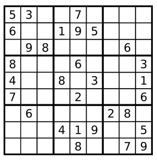

数独部分空格内已填入了数字，空白格用 '.' 表示

说明:

* 一个有效的数独（部分已被填充）不一定是可解的。
* 只需要根据以上规则，验证已经填入的数字是否有效即可。
* 给定数独序列只包含数字 1-9 和字符 '.' 。
* 给定数独永远是 9x9 形式的。

### 解答

按照数独的要求：

1. 每行不能包含相同的数字
2. 每列不能包含相同的数字
3. 9个3\*3的子格不能包含相同的数字

因此，可以分别对3个条件进行检测，如果都满足，那么返回true，否则返回false

问题是怎么判断一行，一列，或者一个3\*3的子格是否不包含重复的数字？

由于数字范围是0~9，因此可以创建一个数组nums，记录每个数字是否出现，如果出现1，则将nums[1]设为1，某个数已经出现过，即nums[i]!=0，说明数字重复出现，因此返回false

```c++
class Solution {
public:
    bool isValidSudoku(vector<vector<char>>& board) {
        if(board.size() != 9 && board[0].size() != 9)   return false;
        
        int nums[10],i,j,m;
        //1.检测每行是否满足要求
        for(i = 0;i < 9;i++){
            for(m = 0;m < 10;m++)   nums[m] = 0;
            for(j = 0;j < 9;j++){
                if(board[i][j] == '.')  continue;
                else if(board[i][j] >= '0' && board[i][j] <= '9'){
                    if(nums[board[i][j] - '0'] == 0)    nums[board[i][j] - '0'] = 1;
                    else    return false;
                }
                else    return false;
            }
        }
        
        //2.检测每列是否满足要求
        for(j = 0;j < 9;j++){
            for(m = 0;m < 10;m++)    nums[m] = 0;
            for(i = 0;i < 9;i++){
                if(board[i][j] == '.')  continue;
                if(nums[board[i][j] - '0'] == 0)    nums[board[i][j] - '0'] = 1;
                else return false;
            }
        }
        
        //3.检测9个子格是否满足要求
        int x,y;
        for(i = 0;i < 9;i += 3){
            for(j = 0;j < 9;j += 3){
                //检查每个3*3子格
                for(m = 0;m < 10;m++)    nums[m] = 0;
                for(x = i;x < i + 3;x++){
                    for(y = j;y < j + 3;y++){
                        if(board[x][y] == '.')  continue;
                        if(nums[board[x][y] - '0'] == 0)    nums[board[x][y] - '0'] = 1;
                        else return false;
                    }
                }
            }
        }
        
        return true;
    }
};
```

<br>
<br>

## 和为target的数字组合

[OJ链接](https://leetcode.com/problems/combination-sum/description/)

给定一个无重复元素的数组 `candidates` 和一个目标数 `target` ，找出 `candidates`中所有可以使数字和为 `target` 的组合。`candidates` 中的数字可以无限制重复被选取。

说明：

* 所有数字（包括 target）都是正整数。
* 解集不能包含重复的组合。 

示例 1:

```
输入: candidates = [2,3,6,7], target = 7,
所求解集为:
[
  [7],
  [2,2,3]
]
```

示例 2:

```
输入: candidates = [2,3,5], target = 8,
所求解集为:
[
  [2,2,2,2],
  [2,3,3],
  [3,5]
]
```

### 解答

对于每个数字，可以选择要或者不要，使用一个数组set来保存选择要的数字

在做下一次选择时，可能有两种情况：

1. set中的数字和已经等于target，此时将set存入结果中
2. 如果1不成立，并且到达结尾，此时不存储set，返回上一层调用（如果先进行了排序，那么如果target已经小于当前元素，也返回上一层调用，此时不必递归到结尾）

由于允许重复使用一个数字，如果选择使用这个数字，因为可能会重复选择，所以继续在当前位置处理。如果不选择使用这个数字，则继续处理下一个数字

可以先对数组进行排序，如果加上当前数字的总和已经超过target，则停止这个路径的处理。通过剪枝，去掉不可能的子集

> 每一条路径不满足要求时，在回溯继续尝试下一路径前，需要弹出set中保存的上一路径的节点

```c++
class Solution {
public:
    vector<vector<int>> combinationSum(vector<int>& candidates, int target) {
        std::sort(candidates.begin(),candidates.end());
        vector<vector<int>> res;
        vector<int> set;
        dfs(candidates,target,0,res,set);

        return res;
    }
private:
    void dfs(const vector<int> &candidates,int target,int idx,vector<vector<int>> &res,vector<int> &set){
        if(!target){
            res.push_back(set);
            return;
        }
        if(idx == candidates.size())    return;

        if(target >= candidates[idx]){
            dfs(candidates,target,idx + 1,res,set);
            set.push_back(candidates[idx]);
            dfs(candidates,target - candidates[idx],idx,res,set);
            set.pop_back();
        }
    }
};
```

<br>
<br>

## 和为target的数字组合II

[OJ链接](https://leetcode.com/problems/combination-sum-ii/description/)

给定一个数组 `candidates` 和一个目标数 `target` ，找出 `candidates` 中所有可以使数字和为 `target` 的组合。`candidates` 中的每个数字在每个组合中只能使用一次。

说明：

* 所有数字（包括目标数）都是正整数。
* 解集不能包含重复的组合。 

示例 1:

```
输入: candidates = [10,1,2,7,6,1,5], target = 8,
所求解集为:
[
  [1, 7],
  [1, 2, 5],
  [2, 6],
  [1, 1, 6]
]
```

示例 2:

```
输入: candidates = [2,5,2,1,2], target = 5,
所求解集为:
[
  [1,2,2],
  [5]
]
```

### 解答

> 和上一题不同，这一题中，候选数组中可能包含相同的元素；并且每个元素只能使用一次

对于一个数字，同样是使用或不使用两种选择，考虑候选数组[10,1,2,7,6,1,5]，排序后，数组为[1,1,2,5,6,7,10]，如果只通过递归来处理每个数使用或不使用这两种情况，那么当：

* 第一个1使用，第二个1不使用
* 第一个1不使用，第二个1使用

这两种情况就会产生冗余

因此，在DFS过程中，首先选择要当前元素，然后DFS，DFS返回后弹出当前元素。和前一题不同的是，下一个DFS需要跳过当前元素后面所有相同的元素，因为如果弹出当前元素，但是DFS又处理后面相同的元素，那么就会像上面一样出现冗余

```c++
class Solution {
public:
    vector<vector<int>> combinationSum2(vector<int>& candidates, int target) {
        if(candidates.empty())  return vector<vector<int>>();
        
        vector<vector<int>> res;
        vector<int> set;
        
        sort(candidates.begin(),candidates.end());
        
        dfs(candidates,target,res,set,0);
        
        return res;
    }

private:
    void dfs(vector<int> &candidates,int target,vector<vector<int>> &res,vector<int> &set,int idx){
        if(target == 0){
            res.push_back(set);
            return;
        }

        if(target >= candidates[idx]){
            set.push_back(candidates[idx]);
            dfs(candidates,target - candidates[idx],res,set,idx + 1);
            set.pop_back();
            while(idx < candidates.size() - 1 && candidates[idx + 1] == candidates[idx])    idx++;
            if(idx != candidates.size() - 1)
                dfs(candidates,target,res,set,idx + 1);
        }
    }
};
```

<br>
<br>

## 缺失的第一个正数

[OJ链接](https://leetcode.com/problems/first-missing-positive/discuss/)

给定一个未排序的整数数组，找出其中没有出现的最小的正整数。

示例 1:

```
输入: [1,2,0]
输出: 3
```

示例 2:

```
输入: [3,4,-1,1]
输出: 2
```

示例 3:

```
输入: [7,8,9,11,12]
输出: 1
```

说明:

你的算法的时间复杂度应为O(n)，并且只能使用常数级别的空间。

### 解答

假设对于大小为n（n>0）的数组，这n个数可以分为以下几种情况：

1. n个数都小于等于0
2. n个数都大于n
3. 存在一个或多个位于[1,n]的数

对于情况1，要查找的第一个缺失的正数就是1；对于情况2，要查找的第一个缺失的正数也是1；问题是对于情况3应该怎么考虑

假设这些位于[1,n]的数i，在数组中的位置为i-1，而小于等于0的数，以及大于n的数，在数组剩余位置：

* 如果数组所有的数都在[1,n]，那么每个元素都在其值减1的位置，此时要找的第一个缺失的整数就是n+1
* 否则，**数组中，必然存在一个位置idx，其元素值不等于idx+1**，而范围[1,n]就是正数序列最开始的n个数，因此，从左往右查找第一个下标加1不等于值的位置，那么要找的第一个缺失的正数就是该位置的下标加1

剩下的就是将范围在[1,n]的元素放置到正确的位置了。

> **使数组大小为n，刚好可以放下前n个正数，由于0不是正数，那么将数组下标i的槽存放正数i+1。经过这样的处理后，第一个不满足上述关系的槽应该存放的那个正数，就是第一个缺失的正数**

```c++
class Solution {
public:
    int firstMissingPositive(vector<int>& nums) {
        int n = nums.size();
        for(int i = 0;i < n;i++){
            while(nums[i] > 0 && nums[i] <= n && nums[i] != (i+1) && nums[nums[i] - 1] != nums[i]){
                int tp = nums[nums[i] - 1];
                nums[nums[i] - 1] = nums[i];
                nums[i] = tp;
            }
        }
        
        for(int i = 0;i < n;i++){
            if(nums[i] != i + 1)    return i + 1;
        }
        
        return n + 1;
    }
};
```

<br>
<br>

## 接雨水

给定 n 个非负整数表示每个宽度为 1 的柱子的高度图，计算按此排列的柱子，下雨之后能接多少雨水。

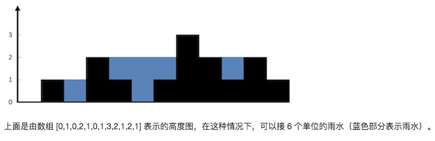

示例:

```
输入: [0,1,0,2,1,0,1,3,2,1,2,1]
输出: 6
```

### 解答

#### 1）暴力法

**把问题缩小到一个柱子上，考虑柱子i上能接多少雨水**。这取决于i左右两边最高的柱子：

* 假设包括柱子i在内的所有i左边的柱子中，最大者为max_left
* 包括i在内的所有右边的柱子中，最大者为max_right
 
那么柱子i上能接的雨水量就是min(max_left,max_right)-height[i]。因此遍历每个柱子，然后遍历左边求出max_left，遍历右边求出max_right，然后将每个柱子能接的雨水量加入结果中

```c++
class Solution {
public:
    int trap(vector<int>& height) {
        int water = 0,sz = height.size();
        for(int bar = 0;bar < sz;bar++){
            int max_left = 0,max_right = 0;
            for(int left_bar = bar;left_bar >= 0;left_bar--)
                if(height[left_bar] > max_left) max_left = height[left_bar];
            for(int right_bar = bar;right_bar < sz;right_bar++)
                if(height[right_bar] > max_right)   max_right = height[right_bar];
            water += min(max_left,max_right) - height[bar];
        }
        
        return water;
    }
};
```

* **时间复杂度**：O(n^2)
* **空间复杂度**：O(1)

#### 2）优化暴力法

方法一在求max_left和max_right时，需要遍历柱子i的左边和右边，如果可以优化这个过程，在O(1)时间求出max_left和max_right，就能将O(n^2)的时间复杂度降到O(n)

考虑使用两个数组，max_lefts和max_rights，对于max_lefts来说，下标i表示[0,i]的柱子中最高柱子的高度。那么max_lefts[i+1] = max(max_lefts[i],height[i+1])。因此只需要遍历一遍所就能求出max_lefts。同样，对于max_rights来说，下标i表示[i,sz-1]的柱子中最高柱子的高度...

```c++
class Solution {
public:
    int trap(vector<int>& height) {
        if(height.size() <= 2)  return 0;
        
        int water = 0,sz = height.size();
        vector<int> max_lefts(sz,0),max_rights(sz,0);
        max_lefts[0] = height[0],max_rights[sz - 1] = height[sz - 1];
        
        for(int bar1 = 1,bar2 = sz - 2;bar1 < sz && bar2 >= 0;bar1++,bar2--){
            max_lefts[bar1] = max(max_lefts[bar1 - 1],height[bar1]);
            max_rights[bar2] = max(max_rights[bar2 + 1],height[bar2]);
        }
        
        for(int bar = 0;bar < sz;bar++){
            int max_left = max_lefts[bar],max_right = max_rights[bar];
            water += min(max_left,max_right) - height[bar];
        }
        
        return water;
    }
};
```

* **时间复杂度**：O(n)
* **空间复杂度**：O(n)

#### 3）栈

用栈保存每个柱子的下标，当一个柱子的高度<=栈顶的柱子的高度时，将这个柱子(的下标)压入栈中。因此，在遇到一个比栈顶柱子要高的柱子前，栈中柱子的高度从栈底到栈顶是一个降序序列，那么栈中每个柱子都是后一个柱子储水量的边界柱子。当遇到一个柱子高于栈顶柱子时，说明栈顶柱子出现了第一个左右边界柱子，那么计算其储水量，加入结果中。此时，相当于区间内最低的坑已经储上了水，因此可以将栈顶元素弹出，如此反复计算，直到栈顶元素大于等于新的柱子，然后将新的柱子(的下标)压入栈中，处理下一个柱子

```c++
class Solution {
public:
    int trap(vector<int>& height) {
        stack<int> s;
        int water = 0,sz = height.size();
        for(int bar = 0;bar < sz;bar++){
            while(!s.empty() && height[bar] > height[s.top()]){
                int low_bar = s.top();
                s.pop();
                if(s.empty()) break;
                int left_bound = s.top();
                water += (bar - left_bound - 1) * (min(height[bar],height[left_bound]) - height[low_bar]); 
            }
            s.push(bar);
        }
        
        return water;
    }
};
```

* **时间复杂度**：O(n)
* **空间复杂度**：O(n)

#### 4）双指针

使用两个变量max_left和max_right，分别表示左边柱子的最高者和右边柱子的最高者，初始化为最左边柱子的高度和最右边柱子的最高者

另外使用两个指针left_bar和right_bar，分别表示左边的一个柱子和右边的一个柱子，初始化为最左边的柱子和最右边的柱子。现在不考虑中间的柱子怎么样，只分析这两个指针所表示的柱子

假设left_bar和right_bar中高度较低者为left_bar：

* 如果left_bar比max_left要低，那么left_bar上面能储水max_left-left_bar
* 否则，left_bar比左边的柱子都要高，那么需要更新max_left的值

经过上面的处理后，递增left_bar，继续处理下一个柱子

同理，如果高度较低者为right_bar：

* 如果right_bar比max_right要低，那么right_bar上面能储水max_right-right_bar
* 否则，right_bar比右边的柱子都要高，那么需要更新max_right的值

经过上面的处理后，递减right_bar，继续处理下一个柱子

这里可能有个疑问：为什么增加储水量时不考虑另外一个边界？原因在于每次更新max_left或max_right时，都是left_bar和right_bar中高度较低者，因此，另外一边必然存在一个边界大于max_left或max_right

```c++
class Solution {
public:
    int trap(vector<int>& height) {
        int water = 0,sz = height.size();
        int left_bar = 0,right_bar = sz - 1;
        int max_left = 0,max_right = 0;
        
        while(left_bar < right_bar){
            if(height[left_bar] < height[right_bar]){
                if(height[left_bar] < max_left) water += max_left - height[left_bar];
                else    max_left = height[left_bar];
                left_bar++;
            }
            else{
                if(height[right_bar] < max_right) water += max_right - height[right_bar];
                else    max_right = height[right_bar];
                right_bar--;
            }
        }
        
        return water;
    }
};
```

* **时间复杂度**：O(n)
* **空间复杂度**：O(1)

<br>
<br>

## 不含重复元素数组的全排列

[OJ链接](https://leetcode.com/problems/permutations/description/)

给定一个没有重复数字的序列，返回其所有可能的全排列。

示例:

```
输入: [1,2,3]
输出:
[
  [1,2,3],
  [1,3,2],
  [2,1,3],
  [2,3,1],
  [3,1,2],
  [3,2,1]
]
```

### 解答

和“字符的全排列”一样，数组中的每个元素和后面的元素交换，然后继续处理剩余数组。处理完后恢复交换之前的状态

```c++
class Solution {
public:
    vector<vector<int>> permute(vector<int>& nums) {
        vector<vector<int>> res;
        
        permute(nums,0,res);
        
        return res;
    }
private:
    void permute(vector<int> &nums,int idx,vector<vector<int>> &res){
        if(idx == nums.size())
            res.push_back(nums);
        
        for(int i = idx;i < nums.size();i++){
            int tp = nums[i];
            nums[i] = nums[idx];
            nums[idx] = tp;
            
            permute(nums,idx + 1,res);
            
            tp = nums[i];
            nums[i] = nums[idx];
            nums[idx] = tp;
        }
    }    
};
```

<br>
<br>

## 含重复元素数组的全排列

[OJ链接](https://leetcode.com/problems/permutations-ii/description/)

给定一个可包含重复数字的序列，返回所有不重复的全排列。

示例:

```
输入: [1,1,2]
输出:
[
  [1,1,2],
  [1,2,1],
  [2,1,1]
]
```

### 解答

用一个set保存已经交换过的元素

比如对于序列[1,1,2]

* 当处理第一个1时，由于set中没有1，所以处理以1开头的排列
* 当处理第二个1时，由于set已经包含了1，即已经处理过相同的排列，所以不交换
* 当处理2时，由于set不包含1，即没有处理以2开头的排列，所以1与2交换

```c++
class Solution {
public:
    vector<vector<int>> permuteUnique(vector<int>& nums) {
        vector<vector<int>> res;
        
        permuteUnique(nums,0,res);
        
        return res;
    }
    
private:
    void permuteUnique(vector<int>& nums,int idx,vector<vector<int>> &res){
        if(idx == nums.size()){
            res.push_back(nums);
        }
        
        set<int> s;
        for(int i = idx;i < nums.size();i++){
            if(s.find(nums[i]) != s.end()) continue;
            
            s.insert(nums[i]);
            
            swap(nums[i],nums[idx]);
            
            permuteUnique(nums,idx + 1,res);
            
            swap(nums[i],nums[idx]);
        }
    }
};
```

<br>
<br>

## 合并区间

[OJ链接](https://leetcode.com/problems/merge-intervals/description/)

给出一个区间的集合，请合并所有重叠的区间。

示例 1:

```
输入: [[1,3],[2,6],[8,10],[15,18]]
输出: [[1,6],[8,10],[15,18]]
解释: 区间 [1,3] 和 [2,6] 重叠, 将它们合并为 [1,6].
```

示例 2:

```
输入: [[1,4],[4,5]]
输出: [[1,5]]
解释: 区间 [1,4] 和 [4,5] 可被视为重叠区间。
```

### 解答

先对区间按start进行排序，这保证了每个区间不可能出现在前一个区间之前

排序后，对区间进行合并。假设前k个区间已经合并成m个区间，对于区间k+1：

* 区间k+1的start在合并好的m-1区间的范围内，那么根据区间m-1的end和区间k+1的end判断是否更新区间m-1的end值
* 区间k+1的start在合并好的m-1区间的后面，那么区间k+1单独成为一个独立的区间，添加到合并的m个区间中

```c++
/**
 * Definition for an interval.
 * struct Interval {
 *     int start;
 *     int end;
 *     Interval() : start(0), end(0) {}
 *     Interval(int s, int e) : start(s), end(e) {}
 * };
 */
class Solution {
public:
    vector<Interval> merge(vector<Interval>& intervals) {
        if(intervals.empty())   return vector<Interval>();
        
        //lambda：[capture list] (parameter list) -> return type {function body}
        sort(intervals.begin(),intervals.end(),[](const Interval &i1,const Interval &i2){return i1.start < i2.start;});
        
        vector<Interval> res;
        res.push_back(intervals[0]);
        for(int i = 1;i < intervals.size();i++){
            if(intervals[i].start <= res.back().end)    
                res.back().end = max(intervals[i].end,res.back().end);
            else
                res.push_back(intervals[i]);
        }
        
        return res;
    }
};
```

<br>
<br>

## 跳步游戏

[OJ链接](https://leetcode.com/problems/jump-game/description/)

给定一个非负整数数组，你最初位于数组的第一个位置。

数组中的每个元素代表你在该位置可以跳跃的最大长度。

判断你是否能够到达最后一个位置。

示例 1:

```
输入: [2,3,1,1,4]
输出: true
解释: 从位置 0 到 1 跳 1 步, 然后跳 3 步到达最后一个位置。
```

示例 2:

```
输入: [3,2,1,0,4]
输出: false
解释: 无论怎样，你总会到达索引为 3 的位置。但该位置的最大跳跃长度是 0 ， 所以你永远不可能到达最后一个位置。
```

### 解答

贪心，遍历数组中的每个位置，使用变量rest记录剩余可以前进的步数

如果当前位置可以前进的步长大于剩余步长，则更新rest

每前进一步rest减一，当rest为0时，更新rest为当前位置可以前进的步长。如果在到达最后位置之前，rest减为0，并且当前位置可以前进的步长也为0，说明无法继续前进，因此返回false

> 整个过程一直更新rest，保存能前进的最大步长

```c++
class Solution {
public:
    bool canJump(vector<int>& nums) {
        if(nums.empty())    return true;
        
        int rest = 0;//步长为非负数，这里初始化为0
        
        int i;
        for(i = 0;i < nums.size();i++){
            if(rest == 0 || nums[i] > --rest)   rest = nums[i];
            if(rest == 0 && i < nums.size() - 1)   return false;
        }
    
        return true;
    }
};
```

<br>
<br>

## 跳步游戏II

[OJ链接](https://leetcode.com/problems/jump-game-ii/description/)

给定一个非负整数数组，你最初位于数组的第一个位置。

数组中的每个元素代表你在该位置可以跳跃的最大长度。

你的目标是使用最少的跳跃次数到达数组的最后一个位置。

示例:

```
输入: [2,3,1,1,4]
输出: 2
解释: 跳到最后一个位置的最小跳跃数是 2。
     从下标为 0 跳到下标为 1 的位置，跳 1 步，然后跳 3 步到达数组的最后一个位置。
```

说明:

假设你总是可以到达数组的最后一个位置。

### 解答

#### 1）动态规划

假设现在位于位置`i`，并且可以跳跃最多`nums[i]`步，那么可以选择跳`1,2,3,...,nums[i]`步，设`dp[i]`表示从位置`i`到达终点的最少步数，那么`dp[i] = min{dp[i + 1] + 1,dp[i + 2] + 1,dp[i + 3] + 1,...,dp[i + nums[i]] + 1}`，我们最终就是要求得`dp[0]`，因为`dp[0]`取决于`dp[1],dp[2],...,`所以从后往前求，并且维护`dp`数组，防止求重复子问题

```c++
class Solution {
public:
    int jump(vector<int>& nums) {
        int sz = nums.size();
        
        vector<int> dp(sz,INT_MAX);
        dp[sz - 1] = 0;
        
        for(int i = sz - 2;i >= 0;i--){
            if(nums[i] >= sz - 1 - i)   dp[i] = 1;
            else{
                for(int j = 1;j <= nums[i];j++)
                    if(dp[i + j] != INT_MAX)//如果dp[i + j]等于INT_MAX，表明跳j步无法到达终点
                        dp[i] = min(dp[i],dp[i + j] + 1);
            }
        }
        
        return dp[0];
    }
};
```

* 时间复杂度：O(n^2)（最后一个例子会超时）

#### 2）BFS

从起点开始，如果从该位置跳跃最大步数无法到达终点，那么将该位置能到达的点加入到队列，所有从起点能到达的点为一层，然后判断下一层的所有点是否能到达终点，如果不能，那么将下一层所有点能够到达的点加入到队列，从而产生新的一层。最终直到某一层存在能够到达终点的点

* 为了防止重复添加，使用一个标记数组`flags`，如果某个节点已经加入到队列，那么`flags`中这个节点标记为`1`，因此，最多只会向队列添加`n`个节点
* 还有一点需要注意。对于每个点，应该从该点所能跳跃的最大步开始尝试。对于点`i`，设该位置能跳跃的最大步为`nums[i]`，那么应该先尝试跳跃`nums[i]`步，如果不能到达终点，那么判断点`i + nums[i]`是否已经加入到队列中，如果没有则加入，**如果已经加入，那么停止尝试跳`nums[i] - 1,nums[i] - 2,...,1`步，因为如果从`i`跳`nums[i]`步不能到达终点，那么跳更小的步数肯定也不能到达。同时，如果`i + nums[i]`已经添加到了队列中，那么`i + nums[i] - 1,i + nums[i] - 2,...,i + 1`肯定也已经添加到了队列中**

* 时间复杂度：O(n)

```c++
class Solution {
public:
    int jump(vector<int>& nums) {
        if(nums.size() == 1)    return 0;
        
        int target = nums.size() - 1,res = 0;
        deque<int> d;
        d.push_back(0);
        vector<int> flags(nums.size(),0);   //防止重复添加节点
        flags[0] = 1;
        
        while(!d.empty()){
            int level = d.size();   //这一层的节点数
            while(level--){
                int src = d.front();
                d.pop_front();
                for(int i = nums[src];i >= 1;i--){
                    if(src + i >= target)        
                        return ++res;
                    else if(flags[src + i] == 1)
                        break;
                    else {
                        d.push_back(src + i);
                        flags[src + i] = 1;
                    }
                }
            }
            res++;
        }
        
        return -1;//无法到达
    }
};
```

<br>
<br>

## 含重复元素集合的所有子集

[OJ链接](https://leetcode.com/problems/subsets-ii/description/)

给定一个可能包含重复元素的整数数组 nums，返回该数组所有可能的子集（幂集）。

说明：解集不能包含重复的子集。

示例:

```
输入: [1,2,2]
输出:
[
  [2],
  [1],
  [1,2,2],
  [2,2],
  [1,2],
  []
]
```

### 解答

为了方便处理相同元素，先排序

考虑`[1,2,2,3]`，假设对于每个元素还是有2种选择：要或者不要，那么在处理数字2时就会出现重复：

* 包含第1个`2`，不包含第2个`2`
* 不包含第1个`2`，包含第2个`2`

因此需要防止重复，也就是在DFS到第1个`2`时，应该怎么处理？

* 首先将`2`添加到路径中，然后DFS后一个元素（在这里就是第2个`2`）
* DFS返回后，将第1个`2`从路径中删除
* 如果此时DFS后一个元素（在这里就是第2个`2`），那么就会和第一次DFS产生冗余。因为只要包含相同元素，那么选择不要相同元素的第1个元素肯定会和选择要相同元素的第1个元素，而不要其后的某个元素产生重复。因此，每次将一个元素从路径中删除时，应该跳到后面第一个不相等的元素进行DFS

```c++
class Solution {
public:
    vector<vector<int>> subsetsWithDup(vector<int>& nums) {
        sort(nums.begin(),nums.end());
        
        vector<vector<int>> res;
        vector<int> path;
        
        dfs(nums,0,res,path);
        
        return res;
    }
private:
    void dfs(vector<int> &nums,int idx,vector<vector<int>> &res,vector<int> &path){
        if(idx == nums.size()){
            res.push_back(path);
            return;
        }
        
        path.push_back(nums[idx]);
        dfs(nums,idx + 1,res,path);
        path.pop_back();
        //跳过相同的元素
        while(idx + 1 < nums.size() && nums[idx] == nums[idx + 1])  idx++;
        dfs(nums,idx + 1,res,path);  
    }
};
```

<br>
<br>

## 二叉树中与target距离为K的结点

[OJ链接](https://leetcode.com/problems/all-nodes-distance-k-in-binary-tree/description/)

给定一个二叉树（具有根结点 `root`）， 一个目标结点 `target` ，和一个整数值 `K` 。

返回到目标结点 `target` 距离为 `K` 的所有结点的值的列表。 答案可以以任何顺序返回。

示例 1：

```
输入：root = [3,5,1,6,2,0,8,null,null,7,4], target = 5, K = 2

输出：[7,4,1]
```

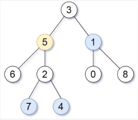

提示：

1. 给定的树是非空的，且最多有 `K` 个结点。
2. 树上的每个结点都具有唯一的值 `0 <= node.val <= 500` 。
3. 目标结点 `target` 是树上的结点。
4. `0 <= K <= 1000`.

### 解答

使用DFS(前序)遍历二叉树，得到从`root`到`target`的路径，假设路径如下：

```
     root
      /
    nd1
      \
       nd2
        \
        target
```

那么所有与`target`距离为`K`的节点就是：

1. 以`target`为根节点的子树中，深度为`K`的节点
2. 以`nd2->left`为根节点的子树中，深度为`K-2`的节点
3. 以`nd1->left`为根节点的子树中，深度为`K-3`的节点
4. 以`root->right`为根节点的子树中，深度为`K-4`的节点
5. 除此之外，在`root`到`target`的路径上的节点，也可以满足要求。比如`K=1`时，`nd2`要添加到结果中，`K=2`时，`nd1`要添加到结果中...

这个过程可以通过BFS完成

* 时间复杂度：O(n)（DFS时每个节点最多遍历一次，BFS时每个节点最多也只遍历一次）
* 空间复杂度：O(n)（需要使用一个vector保存路径，BFS时需要一个队列保存节点）

```c++
/**
 * Definition for a binary tree node.
 * struct TreeNode {
 *     int val;
 *     TreeNode *left;
 *     TreeNode *right;
 *     TreeNode(int x) : val(x), left(NULL), right(NULL) {}
 * };
 */
class Solution {
public:
    vector<int> distanceK(TreeNode* root, TreeNode* target, int K) {
        vector<TreeNode*> path;
        vector<int> res;
        //使用dfs获取root到target的路径,返回false时，路径不存在，即输入不合法
        if(!dfs(root,target,path))  return res;
        
        //使用bfs将以第一个参数为根节点的子树中，深度为K的节点添加到结果res中
        bfs(target,res,K);
        for(int i = path.size() - 2;i >= 0 && K > 0;i--){
            TreeNode *nd = path[i],*child = nd->left == path[i + 1] ? nd->right : nd->left;   
            if(--K == 0)    res.push_back(nd->val); 
            bfs(child,res,K - 1);
        }
        
        return res;
    }
private:
    bool dfs(TreeNode *root,TreeNode *target,vector<TreeNode*> &path){
        if(!root)   return false;
        
        path.push_back(root);
        
        if(root == target)
            return true;
        
        if(dfs(root->left,target,path))     return true;
        if(dfs(root->right,target,path))    return true;
        
        path.pop_back();
        
        return false;
    }
    
    void bfs(TreeNode *root,vector<int> &res,int k){
        if(!root || k < 0)  return;
        
        deque<TreeNode*> d;
        d.push_back(root);
        
        while(!d.empty() && k--){
            for(int count = d.size();count > 0;count--){
                TreeNode *nd = d.front();
                d.pop_front();
                if(nd->left)    d.push_back(nd->left);
                if(nd->right)   d.push_back(nd->right);
            }
        }
        
        for(TreeNode *nd : d)   res.push_back(nd->val);
    }
};
```

<br>
<br>

## 数组表示的数字加1

[OJ链接](https://leetcode.com/problems/plus-one/description/)

给定一个非负整数组成的非空数组，在该数的基础上加一，返回一个新的数组。

最高位数字存放在数组的首位， 数组中每个元素只存储一个数字。

你可以假设除了整数 0 之外，这个整数不会以零开头。

示例 1:

```
输入: [1,2,3]
输出: [1,2,4]
解释: 输入数组表示数字 123。
```

示例 2:

```
输入: [4,3,2,1]
输出: [4,3,2,2]
解释: 输入数组表示数字 4321。
```

### 解答

从数组最后一个数往前处理，如果数字等于9，那么变为0，然后进位，前一位因此也需要进行加1处理，直到某个数字小于9或者已经处理完数组的所有数字。如果所有数字都是9，那么需要在数组最前面添加一个1，可以将首元素改为1，然后压入一个0

```c++
class Solution {
public:
    vector<int> plusOne(vector<int>& digits) {
        int jw = 0,sz = digits.size();
        int i = sz - 1;
        while(i >= 0 && digits[i] == 9){
            digits[i] = 0;
            i--;
        }
        if(i >= 0)  digits[i] += 1;
        else{
            digits[0] = 1;
            digits.push_back(0);
        }
        
        return digits;
    }
};
```

<br>
<br>

## 矩阵置零

[OJ链接](https://leetcode.com/problems/set-matrix-zeroes/description/)

给定一个 m x n 的矩阵，如果一个元素为 0，则将其所在行和列的所有元素都设为 0。请使用原地算法。

示例 1:

```
输入: 
[
  [1,1,1],
  [1,0,1],
  [1,1,1]
]
输出: 
[
  [1,0,1],
  [0,0,0],
  [1,0,1]
]
```

示例 2:

```
输入: 
[
  [0,1,2,0],
  [3,4,5,2],
  [1,3,1,5]
]
输出: 
[
  [0,0,0,0],
  [0,4,5,0],
  [0,3,1,0]
]
```

进阶:

* 一个直接的解决方案是使用  O(mn) 的额外空间，但这并不是一个好的解决方案。
* 一个简单的改进方案是使用 O(m + n) 的额外空间，但这仍然不是最好的解决方案。
* 你能想出一个常数空间的解决方案吗？

### 解答

#### 1）使用辅助空间

如果元素matrix\[i\]\[j\]为0，需要将第i行和第j列设置为0。如果直接在原矩阵上设置，那么如果第i行或第j列后面的元素会被覆盖，导致后续无法判断。可以使用一个额外的矩阵flags保存源矩阵，遍历flags，如果某个元素为0，那么将matrix中对应元素所在的行和列设置为0

**空间代价**：$)

```c++
class Solution {
public:
    void setZeroes(vector<vector<int>>& matrix) {
        vector<vector<int>> flags = matrix;
        
        for(int i = 0;i < flags.size();i++){
            for(int j = 0;j < flags[i].size();j++){
                if(flags[i][j] == 0){
                    for(int m = 0;m < matrix.size();m++)    matrix[m][j] = 0;
                    for(int n = 0;n < matrix[0].size();n++) matrix[i][n] = 0;
                }
            }
        }
    }
};
```

#### 2）辅助空间优化

方法一的空间代价为 $)，考虑能否减少。可以使用两个数组rows和columns，如果元素matrix\[i\]\[j\]为0，那么
将第i行和第j列设置为0，即，

**空间代价**： $)

```c++
class Solution {
public:
    void setZeroes(vector<vector<int>>& matrix) {
        if(matrix.empty())  return;
        
        vector<int> rows(matrix.size(),-1),columns(matrix[0].size(),-1);
        
        for(int i = 0;i < matrix.size();i++)
            for(int j = 0;j < matrix[i].size();j++)
                if(matrix[i][j] == 0){
                    rows[i] = 0;
                    columns[j] = 0;
                }
        
        for(int i = 0;i < rows.size();i++){
            if(rows[i] == 0)
                for(int j = 0;j < columns.size();j++)
                    matrix[i][j] = 0;
        }
        for(int j = 0;j < columns.size();j++){
            if(columns[j] == 0)
                for(int i = 0;i < rows.size();i++)
                    matrix[i][j] = 0;
        }
    }
};
```

#### 3）原地修改

可以使用第0行和第0列存储状态，从而避免空间开销

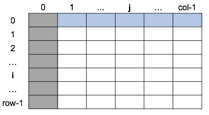

```c++
class Solution {
public:
    void setZeroes(vector<vector<int>>& matrix) {
        bool col0 = false;
        int rows = matrix.size();
        int columns = rows > 0 ? matrix[0].size() : 0;
        
        for(int i = 0;i < rows;i++){
            if(matrix[i][0] == 0) col0 = true;
            for(int j = 1;j < columns;j++){
                if(matrix[i][j] == 0)
                    matrix[i][0] = matrix[0][j] = 0;
            }
        }
        
        for(int j = 1;j < columns;j++)
            if(matrix[0][j] == 0)
                for(int i = 1;i < rows;i++)
                    matrix[i][j] = 0;
        
        for(int i = 0;i < rows;i++)
            if(matrix[i][0] == 0)
                for(int j = 1;j < columns;j++)
                    matrix[i][j] = 0;
        
        if(col0)
            for(int i = 0;i < rows;i++)
                matrix[i][0] = 0;
    }
};
```

**空间代价**： $)

<br>
<br>

## 颜色分类

[OJ链接](https://leetcode.com/problems/sort-colors/description/)

给定一个包含红色、白色和蓝色，一共 n 个元素的数组，原地对它们进行排序，使得相同颜色的元素相邻，并按照红色、白色、蓝色顺序排列。

此题中，我们使用整数 0、 1 和 2 分别表示红色、白色和蓝色。

注意:

不能使用代码库中的排序函数来解决这道题。

示例:

```
输入: [2,0,2,1,1,0]
输出: [0,0,1,1,2,2]
```

进阶：

* 一个直观的解决方案是使用计数排序的两趟扫描算法。
首先，迭代计算出0、1 和 2 元素的个数，然后按照0、1、2的排序，重写当前数组。
* 你能想出一个仅使用常数空间的一趟扫描算法吗？

### 解答

#### 1）2趟扫描

* 第一次：计算出每种颜色的数量
* 第二次：根据每种颜色的数量修改数组

```c++
class Solution {
public:
    void sortColors(vector<int>& nums) {
        int redcount = 0, whitecount = 0;
        
        for(int i = 0;i < nums.size();i++){
            if (nums[i] == 0)       redcount++;
            else if(nums[i] == 1)   whitecount++;
        }
        
        for(int i = 0;i<nums.size();i++){
            if(redcount-- > 0)          nums[i] = 0;
            else if(whitecount-- > 0)   nums[i] = 1;
            else                        nums[i] = 2;
        }
    }
};
```

#### 2）1趟扫描

使用3个指针：`l`，`m`，`r`。`l`左边的元素都为`0`，将其初始化为`0`，`r`右边的元素都为`2`，将其初始化为`nums.size() - 1`

首先往右移动`l`、往左移动`r`，使这2个指针到达正确的位置。然后初始化`m`为`l`，使用`m`从左往右遍历中间的元素，因此`nums[m]`可能有3个值：

* 如果`nums[m] == 1`，那么不需要交换，直接右移`m`
* 如果`nums[m] == 0`，因为`l`位置的值为`1`，因此交换`m`和`l`位置的值，然后右移`l`和`m`
* 如果`nums[m] == 2`，`m`位置的值可能为`0`也可能为`1`，因此交换`m`和`r`位置的值，然后左移`r`。但是需不需要右移`m`？不需要。因为如果交换后`m`位置的值为1，那么下次遍历会递增`m`；如果交换后`m`位置的值为0，那么还要与`l`位置的值进行交换。因此`m`保持不动

```c++
class Solution {
public:
    void sortColors(vector<int>& nums) {
        int l = 0,r = nums.size() - 1;
        while(l < nums.size() && nums[l] == 0)  l++;
        while(r >= 0 && nums[r] == 2)   r--;
        int m = l;
        while(m <= r){
            if(nums[m] == 0)  swap(nums[m++],nums[l++]);
            else if(nums[m] == 1) m++;
            else if(nums[m] == 2) swap(nums[m],nums[r--]);
        }
    }
};
```

<br>
<br>

## 最小覆盖子串

[OJ链接](https://leetcode.com/problems/minimum-window-substring/description/)

给定一个字符串 S 和一个字符串 T，请在 S 中找出包含 T 所有字母的最小子串。

示例：

```
输入: S = "ADOBECODEBANC", T = "ABC"
输出: "BANC"
```

说明：

* 如果 S 中不存这样的子串，则返回空字符串 ""
* 如果 S 中存在这样的子串，我们保证它是唯一的答案

### 解答

首先使用一个map统计字符串t中每个字符出现的次数，要解决这个问题，就是要找到s的子串中，包含所有map中的字符，并且字符出现次数大于等于该字符在map中计数的子串。满足要求的最短子串就是答案

使用一个变量total记录字符串t的长度，这个长度将用于判断滑动窗口中是否包含所有t中的字符。使用一个变量min表示满足要求的子串的最小长度，一个变量start表示该子串的起始下标。我们按如下假设遍历s进行处理：

* 当遇到一个t中的字符时，将其map中的计数减1（可能小于0，因为s中可能包含多个这样的字符）
    - 如果减1之前计数大于0，说明这个字符应该含入滑动窗口中，此时total减1
    - 如果减1之前计数小于等于0，说明这个字符在s中出现了很多次，此时total不变
* 当遇到一个不在t中出现的字符时，跳过

显然，当total为0时，我们找到了一个满足要求的滑动窗口，这个滑动窗口中，包含了所有t中的字符。因此，我们比较这个滑动窗口的长度与min的值，如果小于min，说明找到了一个新的滑动窗口，因此更新min和start

既然当total为0时，找到了一个满足要求的滑动窗口，那么下一步该怎么做？注意到我们找到的第一个滑动窗口是位于最左边，此时map中一些字符的计数可能小于0，因为t中的某些字符在该滑动窗口中出现了很多次。此时我们从左边开始释放字符，目的是希望在右边能找到一个新的相同字符，从而得到一个新的满足要求的滑动窗口。但是从左边开始，第一个在t中的字符可能是一个冗余的字符（即map中的计数小于0），因此释放了这个字符后，滑动窗口中还是拥有满足条件的字符，那么此时回收应该只增加其在map中的计数，但是不需要从右边开始滑动窗口（即不增加total）。因此，只有当遇到一个在t中，并且map中计数为0的字符，才需要将total加1。因为map计数为0说明滑动窗口中这个字符的数量“恰好”满足要求，因此可以开始从右边滑动窗口，也就是说，我们还应该从右边找到1个这样字符，使得map中其计数递减后，又变为0。

```c++
class Solution {
public:
    string minWindow(string s, string t) {
        unordered_map<char,int> map;
        for(char c : t) map[c]++;
        
        int start = 0,i = 0,min = INT_MAX;
        int total = t.length();
        for(int j = 0;j < s.length();j++){
            if(map.find(s[j]) != map.end())//如果遇到一个t中的字符
                if(map[s[j]]-- > 0)
                    total--;
            while(total == 0){//说明当前滑动窗口覆盖了t中的所有字符
                if(j - i + 1 < min){
                    min = j - i + 1;
                    start = i; //更新start的位置
                }
                //从滑动窗口左边回收字符，寻找下一个满足条件的滑动窗口
                //如果t中某些字符在滑动窗口中出现了多次，对于map中的计数会<0
                //如果++没有大于0，说明是遇到一个在滑动窗口中出现多次的字符
                //因此不增加total
                if(map.find(s[i]) != map.end()){
                    if(++map[s[i]] > 0)
                        total++;
                }
                i++;
            }
        }
        
        return min == INT_MAX ? "" : s.substr(start,min);
    }
};
```

<br>
<br>

## 柱状图中最大的矩形

[OJ链接](https://leetcode.com/problems/largest-rectangle-in-histogram/description/)

给定 n 个非负整数，用来表示柱状图中各个柱子的高度。每个柱子彼此相邻，且宽度为 1 。

求在该柱状图中，能够勾勒出来的矩形的最大面积

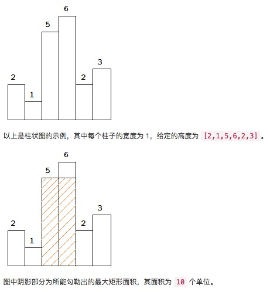

示例:

```
输入: [2,1,5,6,2,3]
输出: 10
```

### 解答

使用一个栈保存高度：

1. 升序时，压入栈中
2. 发生降序时，从栈顶弹出元素，计算，并且根据计算结果更新最大矩阵的值。重复这个过程直到栈中的高度重新保持升序

以题目中的示例，当遇到1，2，0(这个是添加到heights末尾的元素，为的是保证最后一次计算)时会进行计算，每次会计算的面积以图中的虚线表示：

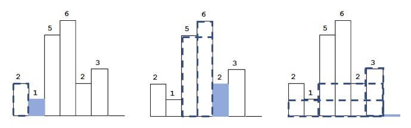

```c++
class Solution {
public:
    int largestRectangleArea(vector<int>& heights) {
        heights.push_back(0);   //保证最后一次处理
        stack<int> s;
        int max_area = 0;
        for(int i = 0;i < heights.size();i++){
            while(!s.empty() && heights[i] <= heights[s.top()]){
                int height = heights[s.top()];
                s.pop();
                int idx = s.empty() ? -1 : s.top();
                int width = i - idx - 1;
                if(width * height > max_area)   max_area = width * height;
            }
            s.push(i);
        }
        
        return max_area;
    }
};
```

<br>
<br>

## 合并两个有序数组

[OJ链接](https://leetcode.com/problems/merge-sorted-array/description/)

给定两个有序整数数组 nums1 和 nums2，将 nums2 合并到 nums1 中，使得 num1 成为一个有序数组。

说明:

* 初始化 nums1 和 nums2 的元素数量分别为 m 和 n。
* 你可以假设 nums1 有足够的空间（空间大小大于或等于 m + n）来保存 nums2 中的元素。

示例:

```
输入:
nums1 = [1,2,3,0,0,0], m = 3
nums2 = [2,5,6],       n = 3

输出: [1,2,2,3,5,6]
```

### 解答

如果从前往后合并，那么可能会覆盖nums1中还未合并的元素，因此从后往前合并。

使用3个变量，end1指向nums1中需要合并的尾元素的位置，end2指向nums2中需要合并的尾元素的位置，end指向nums1的末尾。每次从end1和end2指向元素中选出较大者，插入end位置：

```c++
class Solution {
public:
    void merge(vector<int>& nums1, int m, vector<int>& nums2, int n) {
        if(nums1.empty() || nums2.empty() || m < 0 || n < 0)  return ;
        
        int end1 = m - 1,end2 = n - 1,end = nums1.size() - 1;
        while(end1 >= 0 && end2 >= 0){
            if(nums1[end1] >= nums2[end2])
                nums1[end--] = nums1[end1--];
            else
                nums1[end--] = nums2[end2--];
        }
        
        while(end2 >= 0)
            nums1[end--] = nums2[end2--];
    }
};
```

<br>
<br>

## 买卖股票的最佳时机

[OJ链接](https://leetcode.com/problems/best-time-to-buy-and-sell-stock/description/)

给定一个数组，它的第 i 个元素是一支给定股票第 i 天的价格。

如果你最多只允许完成一笔交易（即买入和卖出一支股票），设计一个算法来计算你所能获取的最大利润。

注意你不能在买入股票前卖出股票。

示例 1:

```
输入: [7,1,5,3,6,4]
输出: 5
解释: 在第 2 天（股票价格 = 1）的时候买入，在第 5 天（股票价格 = 6）的时候卖出，最大利润 = 6-1 = 5 。
     注意利润不能是 7-1 = 6, 因为卖出价格需要大于买入价格。
```

示例 2:

```
输入: [7,6,4,3,1]
输出: 0
解释: 在这种情况下, 没有交易完成, 所以最大利润为 0。
```

### 解答

遍历数组，如果遇到一个更小的价格，那么更新买入的价钱，否则，如果价格大于买入价格，则执行一次计算，判断是否是更大利润：

```c++
class Solution {
public:
    int maxProfit(vector<int>& prices) {
        int buy = INT_MAX,sell,maxprofit = 0;
        for(int i = 0;i < prices.size();i++){
            if(prices[i] < buy) buy = prices[i];
            else if(prices[i] > buy){ 
                sell = prices[i];       
                if(sell - buy > maxprofit)  maxprofit = sell - buy;
            }
        }
        return maxprofit;
    }
};
```

<br>
<br>

## 买卖股票的最佳时机II

[OJ链接](https://leetcode.com/problems/best-time-to-buy-and-sell-stock-ii/description/)

给定一个数组，它的第 i 个元素是一支给定股票第 i 天的价格。

设计一个算法来计算你所能获取的最大利润。你可以尽可能地完成更多的交易（多次买卖一支股票）。

注意：你不能同时参与多笔交易（你必须在再次购买前出售掉之前的股票）。

示例 1:

```
输入: [7,1,5,3,6,4]
输出: 7
解释: 在第 2 天（股票价格 = 1）的时候买入，在第 3 天（股票价格 = 5）的时候卖出, 这笔交易所能获得利润 = 5-1 = 4 。
     随后，在第 4 天（股票价格 = 3）的时候买入，在第 5 天（股票价格 = 6）的时候卖出, 这笔交易所能获得利润 = 6-3 = 3 。
```

示例 2:

```
输入: [1,2,3,4,5]
输出: 4
解释: 在第 1 天（股票价格 = 1）的时候买入，在第 5 天 （股票价格 = 5）的时候卖出, 这笔交易所能获得利润 = 5-1 = 4 。
     注意你不能在第 1 天和第 2 天接连购买股票，之后再将它们卖出。
     因为这样属于同时参与了多笔交易，你必须在再次购买前出售掉之前的股票。
```

示例 3:

```
输入: [7,6,4,3,1]
输出: 0
解释: 在这种情况下, 没有交易完成, 所以最大利润为 0。
```

### 解答

每次如果遇到一个更小的价格，那么更新买入的价格buy。否则，如果遇到一个更大的价格，那么立即结算，将利润加入到结果中，并且更新买入的价格。如果不立即卖出，当遇到一个更大的价格时再卖出，结果也是相同的，但是这样无法预测往后是否会出现更高的价格，所以立即卖出更方便实现。如果不卖出，当遇到一个更小价格时，会更新买入的价格buy，那么这一笔利润就浪费了

> 总的来说就是累加所有上升的走势

```c++
class Solution {
public:
    int maxProfit(vector<int>& prices) {
        int buy = INT_MAX,maxprofit = 0;
        for(int i = 0;i < prices.size();i++){
            if(prices[i] < buy) buy = prices[i];
            else if(prices[i] > buy){
                maxprofit += prices[i] - buy;
                buy = prices[i];
            }
        }
        return maxprofit;
    }
};
```

<br>
<br>

## 买卖股票的最佳时机III

给定一个数组，它的第 i 个元素是一支给定的股票在第 i 天的价格。

设计一个算法来计算你所能获取的最大利润。你最多可以完成 两笔 交易。

注意: 你不能同时参与多笔交易（你必须在再次购买前出售掉之前的股票）。

示例 1:

```
输入: [3,3,5,0,0,3,1,4]
输出: 6
解释: 在第 4 天（股票价格 = 0）的时候买入，在第 6 天（股票价格 = 3）的时候卖出，这笔交易所能获得利润 = 3-0 = 3 。
     随后，在第 7 天（股票价格 = 1）的时候买入，在第 8 天 （股票价格 = 4）的时候卖出，这笔交易所能获得利润 = 4-1 = 3 。
```

示例 2:

```
输入: [1,2,3,4,5]
输出: 4
解释: 在第 1 天（股票价格 = 1）的时候买入，在第 5 天 （股票价格 = 5）的时候卖出, 这笔交易所能获得利润 = 5-1 = 4 。   
     注意你不能在第 1 天和第 2 天接连购买股票，之后再将它们卖出。   
     因为这样属于同时参与了多笔交易，你必须在再次购买前出售掉之前的股票。
```

示例 3:

```
输入: [7,6,4,3,1] 
输出: 0 
解释: 在这个情况下, 没有交易完成, 所以最大利润为 0。
```

### 解答

#### 1）动态规划

设`dp(i,k)`表示前`i`天最多完成`k`（这里“最多”完成2笔，所以`k`不会大于2）笔交易的最大利润

> "最多"完成2笔交易，那么也可以只完成1笔交易，或者不进行交易。同一天可以买进卖出、买进卖出...，但是这样和没进行交易没有区别。总之，`dp(i,k)`总是有意义的

对于第`i`天，我们有2种选择，进行交易或者不交易（即卖出或者不卖出）：

* 如果不卖出，那么`dp(i,k) = dp(i - 1,k)`
* 如果卖出，那么`dp(i,k) = max{prices[i] - prices[j] + dp(j,k - 1)}`（`0 ≤ j ≤ i`），也就是下列情况中的最大值：
    - ~~在第`i`天最后一次买入：`prices[i] - prices[i] + dp(i,k - 1) = dp(i,k - 1)`（**这种情况其实可以省略，因为当第`i`天不进入买入又卖出时，利润肯定不会小于第`i`天买进，然后又在第`i`天卖出，因为同一天买进卖出没有利润，反而浪费了一笔可以进行的交易**）~~
    - 在第`i - 1`天最后一次买入：`prices[i] - prices[i - 1] + dp(i - 1,k - 1)`
    - 在第`i - 2`天最后一次买入：`prices[i] - prices[i - 2] + dp(i - 2,k - 1)`
    - 在第`i - 3`天最后一次买入：`prices[i] - prices[i - 3] + dp(i - 3,k - 1)`
    - ...
    - 在第`1`天最后一次买入：`prices[i] - prices[1] + dp(1,k - 1)`
    - 在第`0`天最后一次买入：`prices[i] - prices[0] + dp(0,k - 1)`

所以`dp(i,k) = max{dp(i - 1,k),max{prices[i] - prices[j] + dp(j,k - 1)}}`（`0 ≤ j < i`）

* 时间复杂度：O(k \* n^2)（199 / 200 个通过测试用例）
* 空间复杂度：O(k \* n)

```c++
class Solution {
public:
    int maxProfit(vector<int>& prices) {
        if(prices.size() <= 1)  return 0;
        
        int sz = prices.size();
        vector<vector<int>> dp(prices.size(),vector<int>(3,0));
        
        for(int i = 1;i < sz;i++)
            for(int k = 1;k <= 2;k++){
                int _max = 0;//max{prices[i] - prices[j] + dp(j,k - 1)}
                for(int j = 0;j < i;j++)
                    _max = max(_max,prices[i] - prices[j] + dp[j][k - 1]);
                dp[i][k] = max(dp[i - 1][k],_max);
            }
        
        return dp[sz - 1][2];
    }
};
```

#### 2）时间优化

设`dp(i,k)`表示前`i`天最多完成`k`（这里“最多”完成2笔，所以`k`不会大于2）笔交易的最大利润

对于第`i`天，我们有2种选择，进行交易或者不交易（即卖出或者不卖出）：

* 如果不卖出，那么`dp(i,k) = dp(i - 1,k)`
* 如果卖出，那么`dp(i,k) = max{prices[i] - prices[j] + dp(j,k - 1)}`（`0 ≤ j < i`）

和前面不同的时，我们希望快速求得上面第二种情况的值，即：**前`i`天最多完成`k`笔交易，并且第`i`天卖出时的最大利润**。可以设为`local(i,k)`，有`local(i,k) = max{prices[i] - prices[j] + dp(j,k - 1)}`（`0 ≤ j < i`）。可以分析最后一次买入的时间

* 如果最后一次买入是在第`i - 1`天，那么`local(i,k) = prices[i] - prices[i - 1] + dp(i - 1,k - 1)`
* 如果最后一次买入在第`i - 1`天以前，现在不管最后一次买入是在第`i - 1`天前的哪一天，我们可以假设第`i - 1`天前买入后，在第`i - 1`天卖了又买入，这样计算得到的结果相同。所以`local(i,k) = prices[i] - prices[i - 1] + local(i - 1,k)`

因此:

* `local(i,k) = prices[i] - prices[i - 1] + max{dp(i - 1,k - 1),local(i - 1,k)}`
* `dp(i,k) = max{dp(i - 1,k),local(i,k)}`

复杂度分析：

* 时间复杂度：O(k \* n)
* 空间复杂度：O(k \* n)

```c++
class Solution {
public:
    int maxProfit(vector<int>& prices) {
        if(prices.size() <= 1)  return 0;
        
        int sz = prices.size();
        vector<vector<int>> dp(prices.size(),vector<int>(3,0));
        vector<vector<int>> local(prices.size(),vector<int>(3,0));
        
        for(int i = 1;i < sz;i++)
            for(int k = 1;k <= 2;k++){
                local[i][k] = prices[i] - prices[i - 1] + max(dp[i - 1][k - 1],local[i - 1][k]);
                dp[i][k] = max(dp[i - 1][k],local[i][k]);
            }
        
        return dp[sz - 1][2];
    }
};
```

#### 3）优化空间

通过观察状态转移方程，每个状态只受前一个状态影响，因此可以进行状态压缩，优化空间。要注意的是，`local[i][k]`可能依赖于`dp[i - 1][k - 1]`。因此，如果`k`从小增大，那么当前行的`dp`值会覆盖前一行的`dp`值。因此获取到的`dp[i - 1][k - 1]`会不正确。所以状态压缩后，`k`要改成从大减小

* 时间复杂度：O(k \* n)（由于这里k=2,所以时间复杂度为O(n)）
* 空间复杂度：O(k)（由于这里k=2,所以空间复杂度为O(1)）

```c++
class Solution {
public:
    int maxProfit(vector<int>& prices) {
        if(prices.size() <= 1)  return 0;

        vector<int> dp(3,0);
        vector<int> local(3,0);
        
        for(int i = 1;i < prices.size();i++)
            for(int k = 2;k > 0;k--){
                local[k] = prices[i] - prices[i - 1] + max(dp[k - 1],local[k]);
                dp[k] = max(dp[k],local[k]);
            }
        
        return dp[2];
    }
};
```

<br>
<br>

## 买卖股票的最佳时机IV

给定一个数组，它的第 i 个元素是一支给定的股票在第 i 天的价格。

设计一个算法来计算你所能获取的最大利润。你最多可以完成 k 笔交易。

注意: 你不能同时参与多笔交易（你必须在再次购买前出售掉之前的股票）。

示例 1:

```
输入: [2,4,1], k = 2
输出: 2
解释: 在第 1 天 (股票价格 = 2) 的时候买入，在第 2 天 (股票价格 = 4) 的时候卖出，这笔交易所能获得利润 = 4-2 = 2 。
```

示例 2:

```
输入: [3,2,6,5,0,3], k = 2
输出: 7
解释: 在第 2 天 (股票价格 = 2) 的时候买入，在第 3 天 (股票价格 = 6) 的时候卖出, 这笔交易所能获得利润 = 6-2 = 4 。
     随后，在第 5 天 (股票价格 = 0) 的时候买入，在第 6 天 (股票价格 = 3) 的时候卖出, 这笔交易所能获得利润 = 3-0 = 3 。
```

### 解答

解法和[买卖股票的最佳时机III](#买卖股票的最佳时机iii)相同。但是要注意一点，`k`可能很大，当`k ≥ 天数/2`时，问题实际转化成了[买卖股票的最佳时机II](#买卖股票的最佳时机ii)。此时累积所有增长的走势即可。否则，可能因为`k`过大而无法分配O(k)的内存空间

> 为什么是`k ≥ 天数/2`？  
> 假设天数为n，可以描绘出股价的走势曲线，那么为了获取最高利润，至少需要多少笔交易？走势曲线中有多少个上升的曲线，就需要多少笔交易。那么当股价一天涨一天跌一天涨...，即呈锯齿状时，上升的曲线数量最多，等于下降的曲线数量-1或下降的曲线数量或下降的曲线数量加1。所以是`k ≥ 天数/2`

* 当`k ≥ 天数/2`时
    - 时间复杂度：O(n)
    - 空间复杂度：O(1)
* 当`k ＜ 天数/2`时
    - 时间复杂度：O(k \* n)
    - 空间复杂度：O(k)

```c++
class Solution {
public:
    int maxProfit(int k, vector<int>& prices) {
        if(prices.size() <= 1 || k == 0)  return 0;
        
        int max_profit = 0;
        
        if (k >= prices.size() / 2) {
            for (int i = 1; i < prices.size(); ++i) {
                if (prices[i] - prices[i - 1] > 0)
                    max_profit += prices[i] - prices[i - 1];
            }
        }
        else{
            vector<int> dp(k + 1,0);
            vector<int> local(k + 1,0);

            for(int i = 1;i < prices.size();i++)
                for(int m = k;m > 0;m--){
                    local[m] = prices[i] - prices[i - 1] + max(dp[m - 1],local[m]);
                    dp[m] = max(dp[m],local[m]);
                }
            max_profit = dp[k];
        }
        
        return max_profit;
    }
};
```

<br>
<br>

## 最长连续序列

[OJ链接](https://leetcode.com/problems/longest-consecutive-sequence/description/)

给定一个未排序的整数数组，找出最长连续序列的长度

要求算法的时间复杂度为 O(n)

示例:

```
输入: [100, 4, 200, 1, 3, 2]
输出: 4
解释: 最长连续序列是 [1, 2, 3, 4]。它的长度为 4。
```

### 解答

#### 1）排序

先排序，排序完成后遍历一遍数组就能找出最长连续序列

```c++
class Solution {
public:
    int longestConsecutive(vector<int>& nums) {
        sort(nums.begin(),nums.end());
        int res = 0,sz = nums.size();
        for(int i = 0;i < sz;i++){
            int j = i,len = 1;
            while(j + 1 < sz){
                if(nums[j + 1] == nums[j] + 1)  len++;
                else if(nums[j + 1] != nums[j]) break;
                j++;
            }
            if(len > res)   res = len;
            i = j; //j + 1已经不连续，所以i再++就到了第一个不连续的位置
        }
        return res;
    }
};
```

* **时间复杂度**：O(nlogn)（accept，但不符合要求）
* **空间复杂度**：O(1)

#### 2）hash表

[参考](https://www.youtube.com/watch?v=rc2QdQ7U78I)

使用一个hash表，key表示数，value表示以key为边界的连续序列的长度，很显然，当插入一个数字num时：

* 如果num已经存在hash表中，那么以前已经处理过，那么忽略
* 否则，又分为几种情况：
    - 如果num-1在hash表中，表明num刚好和num-1结尾的序列相连，因此组成一个新的最大连续序列，此时更新区间左边界和右边界（即num）hash表项的value，即最大连续序列的长度
    - 如果num+1在hash表中，表明num刚好和num+1开头的序列相连，因此组成一个新的最大连续序列，此时更新区间左边界（即num）和右边界hash表项的value，即最大连续序列的长度
    - 如果num-1和num+1都在hash表中，说明num将两个连续序列相连，因此更新左边区间左边界hash项的value，以及右区间右边界hash项的value

每次得到一个新的连续序列时，与结果判定，如果更大，那么更新结果。下图为[1,2,3,6,5,4]的示例：

<div align="center">  </div>

```c++
class Solution {
public:
    int longestConsecutive(vector<int>& nums) {
        unordered_map<int,int> map;
        
        int sz = nums.size(),res = 0;
        for(int i = 0;i < sz;i++){
            int idx = nums[i];
            if(map.find(idx) == map.end()){ //只处理没有处理过的数
                auto itr_l = map.find(idx - 1);
                auto itr_r = map.find(idx + 1);
                if(itr_l == map.end() && itr_r == map.end())//不与任何一个区间相连
                    map[idx] = 1;
                else if(itr_l != map.end() && itr_r != map.end()){//连接2个区间
                    int left = itr_l->second,right = itr_r->second;
                    map[idx - left] = left + right + 1;
                    map[idx + right] = left + right + 1;
                    map[idx] = left + right + 1;
                }
                else if(itr_l != map.end()){
                    int left = itr_l->second;
                    map[idx - left] = left + 1;
                    map[idx] = left + 1;
                }
                else{
                    int right = itr_r->second;
                    map[idx + right] = right + 1;
                    map[idx] = right + 1;
                }
                
                if(map[idx] > res)  res = map[idx];
            }
        }
        
        return res;
    }
};
```

* **时间复杂度**：O(n)
* **空间复杂度**：O(n)

<br>
<br>

## 加油站

[OJ链接](https://leetcode.com/problems/gas-station/description/)

在一条环路上有 N 个加油站，其中第 i 个加油站有汽油 gas[i] 升。

你有一辆油箱容量无限的的汽车，从第 i 个加油站开往第 i+1 个加油站需要消耗汽油 cost[i] 升。你从其中的一个加油站出发，开始时油箱为空。

如果你可以绕环路行驶一周，则返回出发时加油站的编号，否则返回 -1。

说明: 

* 如果题目有解，该答案即为唯一答案。
* 输入数组均为非空数组，且长度相同。
* 输入数组中的元素均为非负数。

示例 1:

```
输入: 
gas  = [1,2,3,4,5]
cost = [3,4,5,1,2]

输出: 3

解释:
从 3 号加油站(索引为 3 处)出发，可获得 4 升汽油。此时油箱有 = 0 + 4 = 4 升汽油
开往 4 号加油站，此时油箱有 4 - 1 + 5 = 8 升汽油
开往 0 号加油站，此时油箱有 8 - 2 + 1 = 7 升汽油
开往 1 号加油站，此时油箱有 7 - 3 + 2 = 6 升汽油
开往 2 号加油站，此时油箱有 6 - 4 + 3 = 5 升汽油
开往 3 号加油站，你需要消耗 5 升汽油，正好足够你返回到 3 号加油站。
因此，3 可为起始索引。
```

示例 2:

```
输入: 
gas  = [2,3,4]
cost = [3,4,3]

输出: -1

解释:
你不能从 0 号或 1 号加油站出发，因为没有足够的汽油可以让你行驶到下一个加油站。
我们从 2 号加油站出发，可以获得 4 升汽油。 此时油箱有 = 0 + 4 = 4 升汽油
开往 0 号加油站，此时油箱有 4 - 3 + 2 = 3 升汽油
开往 1 号加油站，此时油箱有 3 - 3 + 3 = 3 升汽油
你无法返回 2 号加油站，因为返程需要消耗 4 升汽油，但是你的油箱只有 3 升汽油。
因此，无论怎样，你都不可能绕环路行驶一周。
```

### 解答

* 假如从位置`i`开始，`i+1，i+2...`，一路开过来一路油箱都没有空。说明什么？说明从`i`到`i+1，i+2，...`肯定是正积累。
* 现在突然发现开往位置`j`时油箱空了。这说明什么？说明从位置`i`开始没法走完全程(废话)。那么，我们要从位置`i+1`开始重新尝试吗？不需要！为什么？因为前面已经知道，位置`i`肯定是正积累，那么，如果从位置`i+1`开始走更加没法走完全程了，因为没有位置`i`的正积累了。同理，也不用从`i+2，i+3，...`开始尝试。所以我们可以放心地从位置`j+1`开始尝试

```c++
class Solution {
public:
    int canCompleteCircuit(vector<int>& gas, vector<int>& cost) {
        int start = 0;      //起始位置
        int remain = 0;     //当前剩余燃料
        int debt = 0;       //前面没能走完的路上欠的债
        
        for(int i = 0;i < gas.size();i++){
            remain += gas[i] - cost[i];
            if(remain < 0){
                start = i + 1;
                debt += remain;
                remain = 0;
            }
        }
        
        return debt + remain >= 0 ? start : -1;
    }
};
```

<br>
<br>

## 岛屿的数量

[OJ链接](https://leetcode.com/problems/number-of-islands/description/)

给定一个由 '1'（陆地）和 '0'（水）组成的的二维网格，计算岛屿的数量。一个岛被水包围，并且它是通过水平方向或垂直方向上相邻的陆地连接而成的。你可以假设网格的四个边均被水包围。

示例 1:

```
输入:
11110
11010
11000
00000

输出: 1
```

示例 2:

```
输入:
11000
11000
00100
00011

输出: 3
```

### 解答

如果遇到1，计数加1，使用DFS遍历，为了防止重复，在DFS遍历过程中将1改为非1的任意字符

```c++
class Solution {
public:
    int numIslands(vector<vector<char>>& grid) {
        int count = 0;
        for(int row = 0;row < grid.size();row++){
            for(int col = 0;col < grid[0].size();col++){
                if(grid[row][col] == '1'){
                    count++;
                    dfs(grid,row,col);
                }
            }
        }
        /* 如果不想改动grid，可以将所有的'#'变回'1' 
        for(int row = 0;row < grid.size();row++){
            for(int col = 0;col < grid[0].size();col++){
                if(grid[row][col] == '#'){
                    grid[row][col] = '1';
                }
            }
        }
        */
        return count;
    }
    
private:
    void dfs(vector<vector<char>>& grid,int row,int col){
        if(row < 0 || col < 0 || row >= grid.size() || col >= grid[0].size() || grid[row][col] != '1')   return;
        //没越界，并且为'1'
        grid[row][col] = '#';
        dfs(grid,row - 1,col);
        dfs(grid,row + 1,col);
        dfs(grid,row,col - 1);
        dfs(grid,row,col + 1);
    }
};
```

<br>
<br>

## 结构体与联合

### 1）实现一个函数确定主机字节序

* **大端**：高序字节存储在低地址，低序字节存储在高地址
* **小端**：高序字节存储在高地址，低序字节存储在低地址

```c
//返回1表示大端，0表示小端，-1表示unknown
int bigEndian() {
    union {
        short s;   //short在16位、32位、64位下都是2字节
        char c[2];
    }un;
    un.s = 0x0102;
    if (un.c[0] == 1 && un.c[1] == 2)       return 1;
    else if (un.c[0] == 2 && un.c[1] == 1)  return 0;
    else                                    return -1;
}
```

### 2）实现计算结构体成员偏移量的宏

```c
#define offsetof(type,mem)  unsigned long(&(((type *)0)->mem))
```

<br>
<br>

## 判断数组是否包含重复元素

[OJ链接](https://leetcode.com/problems/contains-duplicate/description/)

给定一个整数数组，判断是否存在重复元素。

如果任何值在数组中出现至少两次，函数返回 true。如果数组中每个元素都不相同，则返回 false。

示例 1:

```
输入: [1,2,3,1]
输出: true
```

示例 2:

```
输入: [1,2,3,4]
输出: false
```

示例 3:

```
输入: [1,1,1,3,3,4,3,2,4,2]
输出: true
```

### 解答

使用一个set存储元素，如果某个元素在set中，说明出现重复

```c++
class Solution {
public:
    bool containsDuplicate(vector<int>& nums) {
        unordered_set<int> s;
        for(int e : nums){
            if(s.find(e) != s.end())
                return true;
            else
                s.insert(e);
        }
        return false;
    }
};
```

Discuss中一行的方法：

```c++
class Solution {
public:
    bool containsDuplicate(vector<int>& nums) {
        return nums.size() > set<int>(nums.begin(), nums.end()).size();        
    }
};
```

<br>
<br>

## 旋转数组

[OJ链接](https://leetcode.com/problems/rotate-array/description/)

给定一个数组，将数组中的元素向右移动 k 个位置，其中 k 是非负数。

示例 1:

```
输入: [1,2,3,4,5,6,7] 和 k = 3
输出: [5,6,7,1,2,3,4]
解释:
向右旋转 1 步: [7,1,2,3,4,5,6]
向右旋转 2 步: [6,7,1,2,3,4,5]
向右旋转 3 步: [5,6,7,1,2,3,4]
```

示例 2:

```
输入: [-1,-100,3,99] 和 k = 2
输出: [3,99,-1,-100]
解释: 
向右旋转 1 步: [99,-1,-100,3]
向右旋转 2 步: [3,99,-1,-100]
```

说明:

* 尽可能想出更多的解决方案，至少有三种不同的方法可以解决这个问题。
* 要求使用空间复杂度为 O(1) 的原地算法。

### 解答

将数组旋转一次，可以将前面的数和后面k个数交换位置。但这两个区间的数也会反序，因此再对两个区间做一次反序

```c++
class Solution {
public:
    void rotate(vector<int>& nums, int k) {
        k = k % nums.size(); 
        if(k == 0)  return;
        int sz = nums.size();
        int l = 0,r = sz - 1;
        while(l < r) {  swap(nums[l++],nums[r--]);}
        l = 0,r = k - 1;
        while(l < r) {swap(nums[l++],nums[r--]);}
        l = k,r = sz - 1;
        while(l < r) {swap(nums[l++],nums[r--]);}
    }
};
```

<br>
<br>

## 将数组中的零移到尾部

[OJ链接](https://leetcode.com/problems/move-zeroes/description/)

给定一个数组 nums，编写一个函数将所有 0 移动到数组的末尾，同时保持非零元素的相对顺序。

示例:

```
输入: [0,1,0,3,12]
输出: [1,3,12,0,0]
```

说明:

1. 必须在原数组上操作，不能拷贝额外的数组。
2. 尽量减少操作次数。

### 解答

对0计数，遍历到非0数时，根据0的计数决定向前移动多少。最后根据0的计数将数组尾端的相应个数的元素赋值为0

```c++
class Solution {
public:
    void moveZeroes(vector<int>& nums) {
        int count = 0;
        for(int i = 0;i < nums.size();i++){
            if(nums[i] == 0)    count++;
            else if(count != 0) nums[i - count] = nums[i];
        }
        
        int end = nums.size() - 1;
        while(count--)
            nums[end--] = 0;
    }
};
```

<br>
<br>

## 寻找数组中重复的数

[OJ链接](https://leetcode.com/problems/find-the-duplicate-number/description/)

给定一个包含 n + 1 个整数的数组 nums，其数字都在 1 到 n 之间（包括 1 和 n），可知至少存在一个重复的整数。假设只有一个重复的整数，找出这个重复的数。

示例 1:

```
输入: [1,3,4,2,2]
输出: 2
```

示例 2:

```
输入: [3,1,3,4,2]
输出: 3
```

说明：

1. 不能更改原数组（假设数组是只读的）。
2. 只能使用额外的 O(1) 的空间。
3. 时间复杂度小于 O(n^2) 。
4. 数组中只有一个重复的数字，但它可能不止重复出现一次。

### 解答

#### 1）二分查找

假设1~n的中间元素是mid，遍历数组：

* 如果小于等于mid的个数大于mid，说明重复数字出现在1~mid中
* 如果小于等于mid的个数小于等于mid，说明重复数组出现在mid+1~n中

每轮需要遍历n+1个元素，但是每次可以将范围缩小一半，因此时间复杂度小于O(n^2)

```c++
class Solution {
public:
    int findDuplicate(vector<int>& nums) {
        int l = 1,r = nums.size() - 1;//l和r初始化成1和n
        while(l < r){
            int mid = (l + r) >> 1;
            int count = 0;//小于等于mid的数的个数
            for(int i = 0;i < nums.size();i++)
                if(nums[i] <= mid)   count++;
            if(count <= mid)
                l = mid + 1;
            else if(count > mid)
                r = mid;
        }
        
        return l;
    }
};
```

* 时间复杂度：O(nlogn)
* 空间复杂度：O(1)

#### 2）交换

遍历数组中的每个数num，如果num不等于当前下标加1。那么将这个数与下标为num - 1的数交换，直到num等于当前下标加1。如果num - 1位置的数和num相等，表示出现重复，因此返回num

```c++
class Solution {
public:
    int findDuplicate(vector<int>& nums) {
        for(int i = 0;i < nums.size();i++){
            int tp;
            while(nums[i] != i + 1){
                if(nums[nums[i] - 1] != nums[i]){
                    tp = nums[nums[i] - 1];
                    nums[nums[i] - 1] = nums[i];
                    nums[i] = tp;
                }
                else
                    return nums[i];
            }
        }
        
        return -1;//输入数据无效
    }
};
```

* 时间复杂度：O(n)
* 空间复杂度：O(1)
* 会修改数组

#### 3）循环检测

n+1个元素，下标范围是[0,n]，元素值的范围是[1,n]

可以将元素值看作是下一位置的下标。一开始在位置0，读取位置0元素的值，然后走到相应的位置，读取该位置元素的值，继续走到下一位置...

由于元素范围是[1,n]，因此位置0的元素会映射到位置[1,n]中的某一个，并且位置[1,n]中的n个值，也会映射到位置[1,n]中。那么就有n+1个元素映射到[1,n]中的n个位置。因此势必存在至少2个位置的值，会映射到同一个位置，也就是出现环。那么环的入口位置就是重复出现的元素，从而转换成求环的入口节点

例如：

```
 0 1 2,3
[1,2,3,1]

那么从位置0开始出发：0->1->2->3
                    /|\    |
                     |-----|

位置1为环的入口，因此重复元素为1
```


```c++
class Solution {
public:
    int findDuplicate(vector<int>& nums) {
        int slow = 0,fast = 0;
        
        do{
            slow = nums[slow];          //slow每次走1步
            fast = nums[nums[fast]];    //fast每次走2步
        }while(slow != fast);
        
        int count = 0;//环长
        do{
            fast = nums[fast];
            count++;
        }while(fast != slow);
        
        slow = 0,fast = 0;
        while(count--)  fast = nums[fast];
        while(slow != fast){
            slow = nums[slow];
            fast = nums[fast];
        }
        
        return slow;//or fast
    }
};
```

* 时间复杂度：O(n)
* 空间复杂度：O(1)
* 不会修改数组

<br>
<br>

## 细胞自动机的下一个状态

[OJ链接]()

给定一个包含 m × n 个格子的面板，每一个格子都可以看成是一个细胞。每个细胞具有一个初始状态 live（1）即为活细胞， 或 dead（0）即为死细胞。每个细胞与其八个相邻位置（水平，垂直，对角线）的细胞都遵循以下四条生存定律：

1. 如果活细胞周围八个位置的活细胞数少于两个，则该位置活细胞死亡；
2. 如果活细胞周围八个位置有两个或三个活细胞，则该位置活细胞仍然存活；
3. 如果活细胞周围八个位置有超过三个活细胞，则该位置活细胞死亡；
4. 如果死细胞周围正好有三个活细胞，则该位置死细胞复活；

根据当前状态，写一个函数来计算面板上细胞的下一个（一次更新后的）状态

### 解答

如果直接在原矩阵上做0和1的变换，会影响后面的细胞的状态分析

#### 1）使用额外的矩阵空间

创建一个 m × n 的辅助空间，将下一个状态保存在辅助矩阵中

#### 2）原地修改

如果要在原矩阵上修改，那么需要保留原来的状态，使得后面的分析不受影响，因此可以利用int右起第2位作为新的状态，当分析完所有细胞的新的状态后，再遍历一遍数组，每个元素右移一位得到新状态

```c++
class Solution {
public:
    void gameOfLife(vector<vector<int>>& board) {
        if(board.empty())   return;
        
        int rows = board.size(),cols = board[0].size();   
        for(int i = 0;i < rows;i++){
            for(int j = 0;j < cols;j++){
                int count = board[i][j] & 1 == 1 ? -1 : 0;
                for(int m = max(i - 1,0);m <= min(i + 1,rows - 1);m++)
                    for(int n = max(j - 1,0);n <= min(j + 1,cols - 1);n++)
                        if(board[m][n] & 1 == 1)    count++;
                if(count == 3 || (board[i][j] == 1 && count == 2))
                    board[i][j] |= 2;
            }
        }
        
        for(int i = 0;i < rows;i++)
            for(int j = 0;j < cols;j++)
                board[i][j] >>= 1;
    }
};
```

<br>
<br>

## 最长升序子序列

[OJ链接](https://leetcode.com/problems/longest-increasing-subsequence/description/)

给定一个无序的整数数组，找到其中最长上升子序列的长度。

示例:

```
输入: [10,9,2,5,3,7,101,18]
输出: 4 
解释: 最长的上升子序列是 [2,3,7,101]，它的长度是 4。
```

说明:

* 可能会有多种最长上升子序列的组合，你只需要输出对应的长度即可。
* 你算法的时间复杂度应该为 O(n^2) 。

进阶: 你能将算法的时间复杂度降低到 O(n log n) 吗?

### 解答

#### 1）动态规划

n个元素的数组nums可以按照起始元素划分成n类子数组：第1类子数组以nums[0]为首元素，第2类子数组以nums[1]为首元素...，如果能找到每一类子数组中，最长的升序序列，那么数组nums的最长升序序列就是n类子数组中最长升序序列最长的那个。即，假设第i类子数组的最长升序序列的长度为fun(i)

那么 max{fun(1),fun(2),...,f(n)}就是答案

那么如何求fun(i)？以第1类子数组（首元素为num[0]的所有子数组）为例，既然nums[0]为首元素，要找到最长升序序列，下一个元素必定比nums[0]大，假设第一个大于nums[0]的元素为nums[j]，如果最长升序序列包含nums[j]，那么f(1) = 1+fun(j+1);否则，继续找到下一个比nums[0]大的元素nums[k]，如果最长升序序列包含nums[k]，那么f(1) = 1+fun(k+1);否则，...，因为nums[0]后任意一个比nums[0]大的元素都可能是最长升序序列的元素，所以要取这些结果中最大的一个

使用一个数组state保存每个fun(i)，因为以最后一个元素为首元素的子数组只有1个，即该元素本身，所以最长升序序列的长度为1，即fun(n) = 1，可以从后向前求解fun(n-1),fun(n-2),...,fun(1)

* 时间复杂度：O(n^2)
* 空间复杂度：O(n)

```c++
class Solution {
public:
    int lengthOfLIS(vector<int>& nums) {
        if(nums.empty())    return 0;
        
        vector<int> state(nums.size(),1);
        for(int i = nums.size() - 2;i >= 0;i--){
            for(int j = i + 1;j < nums.size();j++){
                if(nums[i] < nums[j] && state[i] < state[j] + 1)
                    state[i] = state[j] + 1;
            }
        }
        
        int max = 1;
        for(int e : state)
            if(e > max) max = e;
        
        return max;
    }
};
```

#### 2）方法二

[参考](https://leetcode.com/problems/longest-increasing-subsequence/discuss/74855/Short-C++-STL-based-solution:-O(n-log-n)-time-O(1)-space-with-explanation)

使用一个数组S保存最长升序序列的状态，它始终保持升序，每个元素插入S中时，替换掉S中大于等于这个插入元素的第一个元素，如果插入的元素大于S的最后一个元素，那么扩展S

举个例子：

```
nums = [5,6,7,1,2,8,3,4,0,5,9]
```

当处理到7时，因为前3个元素升序，所以组成一个升序序列：

```
S = [5,6,7]
```

当处理1时，它终止了序列持续上升的趋势，可能会引导出一个新的更长的升序序列。因此替换掉大于等于它的第一个元素5：

```
S = [1,6,7]
```

接着处理2：

```
S = [1,2,7]
```

处理8时，需要扩展升序序列：

```
S = [1,2,7,8]
```

然后处理3：

```
S = [1,2,3,8]
```

处理4：

```
S = [1,2,3,4]
```

处理最后3个元素:

```
S = [0,2,3,4,5,9]
```


* 时间复杂度：O(nlogn)（只需遍历1遍数组，并且每次更新S可以使用二分查找）
* 空间复杂度：O(1)（因为只需遍历一遍数组，所以可以直接在nums的前部进行修改，从而不需要额外的空间）

```c++
int lengthOfLIS(vector<int>& nums) {
    if (nums.size() == 0)
        return nums.size();

    vector<int>::iterator m = nums.begin();  // m will mark the virtual "S.end()".
    for (int& val : nums) {
        //lower_bound使用二分查找，查找[nums.begin(),m)区间内第一个大于等于val的元素
        //返回相应迭代器
        auto it = lower_bound(nums.begin(), m, val);
        *it = val;
        if (it == m)
            m++;
    }
    
    return m - nums.begin();
}
```

<br>
<br>

## 找钱

[OJ链接](https://leetcode.com/problems/coin-change/description/)

给定不同面额的硬币 coins 和一个总金额 amount。编写一个函数来计算可以凑成总金额所需的最少的硬币个数。如果没有任何一种硬币组合能组成总金额，返回 -1。

示例 1:

```
输入: coins = [1, 2, 5], amount = 11
输出: 3 
解释: 11 = 5 + 5 + 1
```

示例 2:

```
输入: coins = [2], amount = 3
输出: -1
```

说明：你可以认为每种硬币的数量是无限的。

### 解答

设`state[i]`表示总金额为`i`时，最少需要找的硬币数。那么只需要分析面额小于等于`i`的硬币`j（0 < j ≤ i）`

对于某个面额符合要求的硬币`j`，可以选择找或者不找：

* 如果找，并且`state[i - j]`有意义（即总金额为`i - j`时，至少存在一种找钱的方法），那么`state[i] = 1 + state[i - j]`
* 如果不找，那么继续分析下一个复合面额的硬币`j`

因此，`state[i] = min{state[i],1 + state[i - j]}`（`0 < j ≤ i`，且`state[i - j]`有意义）

```c++
class Solution {
public:
    int coinChange(vector<int>& coins, int amount) {
        if(coins.empty() || amount == -1)  return -1;
        
        vector<int> state(amount + 1,-1);
        state[0] = 0;
        
        for(int price = 1;price <= amount;price++){
            for(int i = 0;i < coins.size();i++)
                if(coins[i] <= price && state[price - coins[i]] != -1)
                    if(state[price] == -1 || state[price] > state[price - coins[i]] + 1)
                        state[price] = state[price - coins[i]] + 1;
        }
        
        return state[amount];
     }
};
```

<br>
<br>

## 摆动排序

[OJ链接](https://leetcode.com/problems/wiggle-sort-ii/description/)

给定一个无序的数组 nums，将它重新排列成 nums[0] < nums[1] > nums[2] < nums[3]... 的顺序。

示例 1:

```
输入: nums = [1, 5, 1, 1, 6, 4]
输出: 一个可能的答案是 [1, 4, 1, 5, 1, 6]
```

示例 2:

```
输入: nums = [1, 3, 2, 2, 3, 1]
输出: 一个可能的答案是 [2, 3, 1, 3, 1, 2]
```

说明：你可以假设所有输入都会得到有效的结果。

进阶：你能用 O(n) 时间复杂度和 / 或原地 O(1) 额外空间来实现吗？

### 解答

先不管题目中对时间复杂度和空间复杂度的要求，看看这个问题有什么方法

假设数组已经按要求排好序，我们可以将元素分成两组：

1. 奇数组（odd group）：包含所有下标为奇数的元素
2. 偶数组（even group）：包含所有下标为偶数的元素

从“摆动序列”的性质可知，**奇数组中的每个元素，都比排好序的数组中它的左右邻居大**。只要能满足这个性质，就是一个正确的结果。但是，如果对于奇数组和偶数组只有这一条性质，那么想要解决这个问题还是无从下手。因此，可以对两个组添加一条性质：**所有奇数组中的元素都大于等于偶数组中的元素**。在添加这一条性质之后，我们依然可以通过转化使得前一条性质依然成立

**证明**：

假设有

```
奇数组 = [...,a,...]
偶数组 = [...,b,...]

并且 a < b
```

假设```a```的邻居为```c```和```d```，```b```的邻居为```e```和```f```，根据第一条性质有：

```
c < a 并且 d < a
b < e 并且 b < f
```

那么此时可以将```a```和```b```进行交换，交换后a变大为b，b变小为a，因此上述性质依然成立。经过大量这种交换后，最终奇数组中的任一元素都会大于等于偶数组中的所有元素。性质二描述了一种全局关系状态

有了性质二，就可以按下列2个步骤解决：

1. **Partition**：将数组分成**奇数组(L)**和**偶数组(S)**，```S```拥有```m```（```(n+1)/2```）个元素，```L```拥有剩余的元素。并且两组中的元素符合性质二。L中的元素不会比S中的多
2. **Placement**：将S中的元素放置到偶数下标，将L中的元素放置到奇数下标。但是S和L中可能包含重复元素，因此有可能放置后两个相邻元素相等从而产生错误。所以放置时需要一些技巧


**首先，如果数组能够排成“摆动序列“，那么```S```和```L```中重复的元素不会超过```S```的大小，即```m```** ： 假设重复的元素超过了m，当数组排成”摆动序列后“，因为它们相等，所以这些重复元素不能成为彼此的邻居，那么它们就必须占据所有偶数下标或者所有奇数下标。然而，即使这样也还是会有残余的元素没有位置，因为所有奇数下标的数量和所有偶数下标的数量都不会超过m

**然后，如果将来自S中的重复元素放置在尽可能小的偶数下标，将来自L中的重复元素放置在尽可能大的奇数下标，那么重复元素就不会出现相邻的情况**。假设这个重复元素在S中的总数为k1，在L中的总数为k2，```k = k1 + k2```为重复元素的总数

* 如果数组大小n为偶数：
    - 那么k <= m = n/2。在放置后，那么S中该重复元素最后一个的下标为```2 * (k1 - 1)```，L中该重复元素最后一个的下标为```(n - 1) - 2 * (k2 - 1)```。如果前一个下标比后一个下标至少小1，那么重复元素就不会相邻。这是成立的：```2 * (k1 - 1) + 1 < (n - 1) - 2 * (k2 - 1) <==> k1 + k2 < [n/2] + 1 and k1 + k2 = k <= n/2 = [n/2] < [n/2] + 1```
* 如果数组大小n为奇数：
    - 如果```k = (n + 1)/2```，只有当```k2 = 0```时，才能排序成”摆动序列“。例如，所有S中重复元素占据所有偶数下标。
    - 否则有```k1 + k2 = k < (n + 1)/2 = [n/2] + 1```
    无论哪种情况下，这样的放置策略都会分散重复元素，使得它们不会相邻

一旦所有重复元素按上面的策略放置后，将所有S和L中的其余元素分别放置到剩余偶数下标和剩余奇数下标，最终得到了一个”摆动序列“

#### 1）O(nlogn)时间 O(n)空间

排序，将元素分为上述L和S两组。因为放置时可能占用了未遍历到的位置，所以使用一个预留数组，在进行遍历处理之前保存元素

```c++
class Solution {
public:
    void wiggleSort(vector<int>& nums) {
        //m为偶数下标的个数
        int n = nums.size(), m = (n + 1) >> 1;
        vector<int> copy = nums;
        sort(copy.begin(),copy.end());

        //处理偶数组
        //i: [m-1,...,0]（数组的前半部分，即偶数组的元素，共m个），先遍历到的是中间元素
        //j: [0,2,4...]（放置的下标，从左往右放置，中间元素在左边）
        for (int i = m - 1, j = 0; i >= 0; i--, j += 2) nums[j] = copy[i];
        //处理奇数组
        //i: [n-1,...,m]（数组的后半部分，即奇数组的元素），先遍历到的不是中间元素
        //j: [1,3,5...]（放置的下标，从左往右放置，中间元素在右边）
        for (int i = n - 1, j = 1; i >= m; i--, j += 2) nums[j] = copy[i];
    }
};
```

#### 2）O(n)时间 O(n)空间

由于只需要将元素划分成S和L，因此没必要对数组进行排序，使用基于partition的方法找到中值，将数组分为S和L两部分，可以将排序的时间复杂度从O(nlogn)降到O(n)，从而整个时间复杂度变成O(n)

#### 3）O(n)时间 O(1)空间

```c++
class Solution {
public:
    void wiggleSort(vector<int>& nums) {
        //m为偶数下标的个数
        int n = nums.size(), m = (n + 1) >> 1;
        //lambda，将下标i进行映射
        auto mapping=[n](int i)->int{return (1 + 2 * i) % (n | 1);};
        //获取中值
        auto miditr = nums.begin() + m - 1;
        nth_element(nums.begin(), miditr , nums.end());
        int median = *miditr;
    
        //j:          [0,1,2,3,...] （j > k时终止）
        //mapping[j]: [1,3,5,...,0,2,4,...]
        //
        //i:          [0,1,2,3,...]
        //mapping[i]: [1,3,5,...,0,2,4,...]
        //k:          [n-1,n-2,...]
        //mapping[k]: [...,4,2,0,...,5,3,1]
        for (int i = 0, j = 0, k = n - 1; j <= k;) {
            if (nums[mapping(j)] > median) //找到一个比中值大的数
                swap(nums[mapping(i++)], nums[mapping(j++)]);
            else if(nums[mapping(j)] < median)  //找到一个比中值小的数，这里j不变
                swap(nums[mapping(j)], nums[mapping(k--)]);
            else   //找到一个和中值相等的元素
                j++;
        }
    }
};
```

[参考](https://leetcode.com/problems/wiggle-sort-ii/discuss/77682/step-by-step-explanation-of-index-mapping-in-java)

<br>
<br>

## 矩阵中的最长递增路径

[OJ链接](https://leetcode.com/problems/longest-increasing-path-in-a-matrix/description/)

给定一个整数矩阵，找出最长递增路径的长度。

对于每个单元格，你可以往上，下，左，右四个方向移动。 你不能在对角线方向上移动或移动到边界外（即不允许环绕）。

示例 1:

```
输入: nums = 
[
  [9,9,4],
  [6,6,8],
  [2,1,1]
] 
输出: 4 
解释: 最长递增路径为 [1, 2, 6, 9]。
```

示例 2:

```
输入: nums = 
[
  [3,4,5],
  [3,2,6],
  [2,2,1]
] 
输出: 4 
解释: 最长递增路径是 [3, 4, 5, 6]。注意不允许在对角线方向上移动。
```

### 解答

假设`state[i][j]`表示以`第i行，第j列`元素为起点的最长序列的长度。那么最终我们就是要求所有`state[i][j]`中的最大值。如果知道其中某个`state[i][j]`怎么求，那么问题也就解决了

既然`state[i][j]`表示以`第i行，第j列`元素为起点的最长序列的长度，那么`state[i][j]`肯定是以元素`matrix[i][j]`为起点的4个方向(`上下左右`)上最长的序列长度。以向上的序列为例：

* 如果`matrix[i - 1][j] >= matrix[i][j]`：那么只包含当前元素，最长序列长度为1
* 如果`matrix[i - 1][j] < matrix[i][j]`：那么最长序列的长度就是`state[i - 1][j] + 1`

因此，可以求出4个方向上的递增序列的长度，那么`state[i][j]`就是4个序列中最长序列的长度

* 为了防止求重复的子问题，使用`state`数组保存中间值
* 注意，不会产生无限循环，比如：如果求`matrix[i][j]`，需要依赖`matrix[i-1][j]`。那么求`matrix[i - 1][j]`肯定不需要依赖`matrix[i][j]`，因为只有满足递增性质时，才会发生递归

```c++
class Solution {
public:
    int longestIncreasingPath(vector<vector<int>>& matrix) {
        if(matrix.empty())  return 0;
        
        int rows = matrix.size(),cols = matrix[0].size();
        vector<vector<int>> states(rows,vector<int>(cols,0));
        
        int res = 1;
        for(int i = 0;i < rows;i++)
            for(int j = 0;j < cols;j++){
                int path = longestIncreasingPath(matrix,states,i,j);
                if(path > res)  res = path;
            }
        
        return res;
    }
private:
    int longestIncreasingPath(vector<vector<int>> &matrix,vector<vector<int>> &states,int row,int col){
        if(states[row][col] != 0)   return states[row][col];
        
        int rows = matrix.size(),cols = matrix[0].size();
        int left,right,up,down;
        states[row][col] = 1;
        //left
        if(col > 0 && matrix[row][col - 1] > matrix[row][col]){
            left = longestIncreasingPath(matrix,states,row,col - 1) + 1;
            if(left > states[row][col])  states[row][col] = left; 
        }
        //right
        if(col < cols - 1 && matrix[row][col + 1] > matrix[row][col]){
            right = longestIncreasingPath(matrix,states,row,col + 1) + 1;
            if(right > states[row][col])  states[row][col] = right; 
        }
        //up
        if(row > 0 && matrix[row - 1][col] > matrix[row][col]){
            up = longestIncreasingPath(matrix,states,row - 1,col) + 1;
            if(up > states[row][col])  states[row][col] = up; 
        }
        //down
        if(row < rows - 1 && matrix[row + 1][col] > matrix[row][col]){
            down = longestIncreasingPath(matrix,states,row + 1,col) + 1;
            if(down > states[row][col])  states[row][col] = down; 
        }
        
        return states[row][col];
    }
};
```

<br>
<br>

## 数组的三元升序子序列

[OJ链接](https://leetcode.com/problems/increasing-triplet-subsequence/description/)

给定一个未排序的数组，请判断这个数组中是否存在长度为3的递增的子序列。

正式的数学表达如下:

> 如果存在这样的 i, j, k,  且满足 0 ≤ i < j < k ≤ n-1，  
> 使得 arr[i] < arr[j] < arr[k] ，返回 true ; 否则返回 false 。

要求算法时间复杂度为O(n)，空间复杂度为O(1) 。

示例:

```
输入 [1, 2, 3, 4, 5],
输出 true.

输入 [5, 4, 3, 2, 1],
输出 false.
```

### 解答

维护一个二元升序子序列，即使用一个变量small，和一个变量big。遍历数组：

* 如果一个数小于或等于small，则更新small
* 如果大于small，但是小于等于big，则更新big
* 如果大于big，那么就找到一个三元升序子序列

这个地方可能不太好理解的是：如果在更新完small后，出现了一个大于big的数，那么判断为找到了一个三元升序子序列。这种情况下，big的最后一次更新在small前，small，big和最后大于big的这个数的位置顺序是：big,small,大于big的数。这个顺序不是一个三元升序序列，但是我们判断结果是找到了三元升序子序列，这个解决是对的，但是上面这3个数并不是正确的升序序列

几个例子，假设初始数组如下：

```
2,3,1,4
```

处理到3时：

```
small = 2
big = 3
```

处理1。因为1小于small，所以更新small：

```
small = 1
big = 3
```

处理4。因为4大于big，所以判断为找到了三元升序子序列

此时3个数为1,3,4，但是在数组中对应的顺序是3,1,4。那为什么结果是对的？因为我们判断为true的条件是是：找到一个大于big的数。因为当找到一个大于small的数时，才会更新big，虽然这里最后更新了small，但是在最后一次更新big之前，肯定更新过small，所以数组中确实是存在升序的三元子序列。也就是说，真正的三元升序子序列是2,3,4

```c++
class Solution {
public:
    bool increasingTriplet(vector<int>& nums) {
        if(nums.size() < 3) return false;
        
        int min = INT_MAX,max = INT_MAX;
        for(int e : nums){
            if(e <= min) min = e;
            else if(e <= max)    max = e;
            else    return true;
        }
        
        return false;
    }
};
```

<br>
<br>

## 出现频率最高的k个数字

[OJ链接](https://leetcode.com/problems/top-k-frequent-elements/description/)

给定一个非空的整数数组，返回其中出现频率前 k 高的元素。

例如，

给定数组 `[1,1,1,2,2,3]` , 和 k = 2，返回 `[1,2]`。

注意：

* 你可以假设给定的 k 总是合理的，1 ≤ k ≤ 数组中不相同的元素的个数。
* 你的算法的时间复杂度必须优于 O(n log n) , n 是数组的大小。

### 解答

首先统计每个元素的频率，即出现次数

然后创建桶数组，下标表示元素的频率，每个桶也是一个数组，内含出现频率为相应值的元素。例如bucket[i]表示出现频率为i的桶，内含所有出现i次的元素

按频率”从高到低“输出k个数字

```c++
class Solution {
public:
    vector<int> topKFrequent(vector<int>& nums, int k) {
        //统计每个元素出现的次数
        unordered_map<int,int> map;
        for(int num : nums)
            map[num]++;
        
        //桶的下标表示元素出现的次数,所以下标越大出现越频繁
        vector<vector<int>> bucket(nums.size() + 1);
        for(auto p : map)
            bucket[p.second].push_back(p.first);
        
        vector<int> res;
        //从后面的桶往前面遍历
        for(int i = bucket.size() - 1;i >= 0 && res.size() < k;--i){
            //遍历桶中的每个数
            for(int num : bucket[i]){
                res.push_back(num);
                if(res.size() == k)
                    break;
            }
        }
        
        return res;
    }
};
```

<br>
<br>

## 两个数组的交集II

[OJ链接](https://leetcode.com/problems/intersection-of-two-arrays-ii/description/)

给定两个数组，写一个方法来计算它们的交集。

例如:


给定 `nums1 = [1, 2, 2, 1]`, `nums2 = [2, 2]`, 返回 `[2, 2]`.

注意：

* 输出结果中每个元素出现的次数，应与元素在两个数组中出现的次数一致。
* 我们可以不考虑输出结果的顺序。

跟进:

* 如果给定的数组已经排好序呢？你将如何优化你的算法？（**归并处理**）
* 如果 nums1 的大小比 nums2 小很多，哪种方法更优？
* 如果nums2的元素存储在磁盘上，内存是有限的，你不能一次加载所有的元素到内存中，你该怎么办？（**哈希成多个小文件，小文件分治求交集**）

### 解答

使用一个hash表统计一个数组中每个数字出现的次数，然后遍历另外一个数组，如果某个数组出现在哈希表中则添加到结果中，由于可以包含重复数字，所以需要计数每个数字出现的次数：

```c++
class Solution {
public:
    vector<int> intersect(vector<int>& nums1, vector<int>& nums2) {
        unordered_map<int,int> countMap;
        
        vector<int> res;
        for(int num : nums1)  countMap[num]++;
        
        for(int num : nums2)
            if(countMap[num]-- > 0)
                res.push_back(num);
        
        return res;
    }
};
```

<br>
<br>

## 有序矩阵中第K小的元素

[OJ链接](https://leetcode.com/problems/kth-smallest-element-in-a-sorted-matrix/description/)

给定一个 n x n 矩阵，其中每行和每列元素均按升序排序，找到矩阵中第k小的元素。
请注意，它是排序后的第k小元素，而不是第k个元素

示例:

```
matrix = [
   [ 1,  5,  9],
   [10, 11, 13],
   [12, 13, 15]
],
k = 8,

返回 13。
```

说明: 

可以假设 k 的值永远是有效的, 1 ≤ k ≤ n^2 

### 解答

#### 1）优先队列

使用一个优先队列，这个队列中的元素个数等于矩阵的行数

将矩阵的第0列元素插入队列，此时队列头部的元素为matrix\[0\]\[0\]，是矩阵中最小的元素，对其执行出队操作，此时将matrix\[0\]\[1\]插入队列

由于优先队列使用堆实现，因此队列头部始终是最小的元素。每一个元素出队时，将其所在行的后一个元素插入队列。由于矩阵元素的性质，这样可以保证优先队列中始终包含当前所有剩余元素中最小的元素。那么只需做K次出队操作，第K个出队的元素就是答案

```c++
class Solution {
public:
    struct compare{
        bool operator()(const pair<int,pair<int,int>> &p1,const pair<int,pair<int,int>> &p2){
            return p1.first > p2.first;
        }
    };
    int kthSmallest(vector<vector<int>>& matrix, int k) {
        //template <class T, class Sequence = vector<T>, class Compare = less<typename Sequence::value_type> >
        priority_queue<pair<int,pair<int,int>>,vector<pair<int,pair<int,int>>>,compare> pq;
        
        for(int i = 0;i < matrix.size();i++)    
            pq.push(make_pair(matrix[i][0],make_pair(i,0)));
        
        int res,cols = matrix[0].size();
        while(k--){
            res = pq.top().first;
            int i = pq.top().second.first,j = pq.top().second.second;
            pq.pop();
            if(j < cols - 1)
                pq.push(make_pair(matrix[i][j + 1],make_pair(i,j+1)));
        }  
        
        return res;
    }
};
```

#### 2）二分查找

**基于值**的二分查找：首先找到矩阵所有元素中的最小值和最大值，求其中值，然后记录矩阵中小于该值的元素个数，根据这个计数结果与K进行比较来增大最小值或减小最大值

```c++
class Solution {
public:
    int kthSmallest(vector<vector<int>>& matrix, int k) {
        if(matrix.empty())  return -1;
        
        int rows = matrix.size();
        int cols = matrix[0].size();
        int small = matrix[0][0],large = matrix[rows - 1][cols - 1],median;
        while(small < large){
            median = (small + large) >> 1;
            int count = 0;
            for(int i = 0;i < rows;i++)
                count += std::upper_bound(matrix[i].cbegin(),matrix[i].cend(),median) - matrix[i].cbegin();
            if(count < k)
                small = median + 1;
            else
                large = median;
        }
        return small;
    }
};
```

使用题目开头给出的矩阵为例子:

```
matrix = [
   [ 1,  5,  9],
   [10, 11, 13],
   [12, 13, 15]
],
k = 8,
```

上述代码会按下列步骤执行：

```
s            m           l 
1 , ...... , 8 , ...... ,15

count = 2 小于 k = 8, 因此 s = m + 1 = 9

s          m        l 
9 , ... , 12 , ... ,15

count = 6 小于 k = 8, 因此 s = m + 1 = 13

s    m    l 
13 , 14 , 15

count = 8 等于 k = 8, 因此 l = m = 14

s|m  l
13 , 14

count = 8 等于 k = 8, 因此 l = m = 13

此时 s = l = 13循环终止，结果为13
```

<br>
<br>

## 四数之和

[OJ链接](https://leetcode.com/problems/4sum/description/)

给定一个包含 n 个整数的数组 `nums` 和一个目标值 `target`，判断 `nums` 中是否存在四个元素 a，b，c 和 d ，使得 a + b + c + d 的值与 `target` 相等？找出所有满足条件且不重复的四元组。

注意：答案中不可以包含重复的四元组。

示例：

```
给定数组 nums = [1, 0, -1, 0, -2, 2]，和 target = 0。

满足要求的四元组集合为：
[
  [-1,  0, 0, 1],
  [-2, -1, 1, 2],
  [-2,  0, 0, 2]
]
```

### 解答

其实总体思路和[三数之和](#三数之和)一样

* 先排序，然后以数组中每个元素为4个候选数之一，找出其余3个元素。为了防止重复，相邻的重复元素只处理一次
* 在选好第一个数`a`后，分别将该元素后的每一个元素`b`作为剩余3个候选数之一，在`b`后找到剩余的2个候选数。为了防止重复，相邻的重复元素`b`只处理一次
* 为了找到最后2个数，使用2个指针`l`和`r`，分别指向剩余元素的第一个和最后一个，根据`nums[i] + nums[r]`与`target - a - b`的大小来更新`l`和`r`。当找到了组复合要求的解时，可能`l`后面和`r`前面的元素是重复元素，因此需要跳过所有重复元素，防止冗余

> 作为一个优化。在选择`a`和`b`时，由于数组已经排好序，`a`肯定不能超过`target / 4`，`b`肯定不能超过`(target - a) / 3`，因此可以对后面的分支进行剪枝，提前结束循环

```c++
class Solution {
public:
    vector<vector<int>> fourSum(vector<int>& nums, int target) {
        sort(nums.begin(),nums.end());
        
        vector<vector<int>> res;
        int sz = nums.size();
        for(int i = 0;i < sz - 3 && nums[i] <= target / 4;i++){
            if(i > 0 && nums[i - 1] == nums[i]) continue;
            for(int j = i + 1;j < sz - 2 && nums[j] <= (target - nums[i]) / 3;j++){
                if(j > i + 1 && nums[j] == nums[j - 1]) continue;
                int l = j + 1,r = sz - 1,_target = target - nums[i] - nums[j];
                while(l < r){
                    //cout << "i:" << i << "  j:" << j << "  l:" << l << "  r:" << r << endl;
                    if(nums[l] + nums[r] > _target)         r--;
                    else if(nums[l] + nums[r] < _target)    l++;
                    else{
                        res.push_back(vector<int>{nums[i],nums[j],nums[l],nums[r]});
                        while(l < r && nums[l + 1] == nums[l])  l++;
                        while(l < r && nums[r - 1] == nums[r])  r--;
                        l++,r--;
                    }
                }
            }
        }
        
        return res;
    }
};
```

<br>
<br>

## 四数之和II

[OJ链接](https://leetcode.com/problems/4sum-ii/description/)

给定四个包含整数的数组列表 A , B , C , D ,计算有多少个元组 ```(i, j, k, l)``` ，使得 ```A[i] + B[j] + C[k] + D[l] = 0```

为了使问题简单化，所有的 A, B, C, D 具有相同的长度 N，且 0 ≤ N ≤ 500 。所有整数的范围在 -2^28 到 2^28 - 1 之间，最终结果不会超过 2^31 - 1 。

例如:

```
输入:
A = [ 1, 2]
B = [-2,-1]
C = [-1, 2]
D = [ 0, 2]

输出:
2

解释:
两个元组如下:
1. (0, 0, 0, 1) -> A[0] + B[0] + C[0] + D[1] = 1 + (-2) + (-1) + 2 = 0
2. (1, 1, 0, 0) -> A[1] + B[1] + C[0] + D[0] = 2 + (-1) + (-1) + 0 = 0
```

### 解答

每个数组中选取一个数，总共4个数构成一个排列，判断这4个数相加的结果是否等于0，因为每个数组的元素个数为n，那么总共有n^4种路径

#### 1）暴力法

通过上面的分析，可以使用4个循环，针对每条路径（每种排列），判断是否符合要求，符合则计数加1

```c++
class Solution {
public:
    int fourSumCount(vector<int>& A, vector<int>& B, vector<int>& C, vector<int>& D) {
        int count = 0;
        for(int num1 : A)
            for(int num2 : B)
                for(int num3 : C)
                    for(int num4 : D)
                        if(num1 + num2 + num3 + num4 == 0)
                            count ++;
        return count;  
    }
};
```

* **时间复杂度**：O(n^4)
* **空间复杂度**：O(1)

这种方法显然会超时：**28/48 test cases passed**

#### 2）空间换时间1

如果使用一个集合保存最后一个数组的数，那么只需求出前3个数的所有排列，然后判断集合中有多少个数等于-num1-num2-num3，那么计数就加多少。这样通过O(n)的空间换取O(n)的时间：

```c++
class Solution {
public:
    int fourSumCount(vector<int>& A, vector<int>& B, vector<int>& C, vector<int>& D) {
        int count = 0;
        
        unordered_multiset<int> set;
        for(int num4 : D)   set.insert(num4);
        
        for(int num1 : A)
            for(int num2 : B)
                for(int num3 : C)
                        count += set.count(-num1-num2-num3);
        return count;  
    }
};
```

* **时间复杂度**（忽略set.count）：O(n^3)
* **空间复杂度**：O(n)

这种方法还是会超时：**40/48 test cases passed**

#### 3）空间换时间2

进一步，可以使用set保存前2个数组所有元素相加的和，那么只需2层循环遍历后2个数组，然后计算在集合中有多少个元素等于-num3-num4就可以再用O(n)的空间复杂度换O(n)的时间复杂度：

```c++
class Solution {
public:
    int fourSumCount(vector<int>& A, vector<int>& B, vector<int>& C, vector<int>& D) {
        int count = 0;
        
        unordered_multiset<int> set;
        
        for(int num1 : A)
            for(int num2 : B)
                set.insert(num1+num2);
        
        for(int num3 : C)
            for(int num4 : D)
                count += set.count(-num3-num4);
        
        return count;  
    }
};
```

* **时间复杂度**（忽略set.count）：O(n^2)
* **空间复杂度**：O(n^2)

这种方法依然会超时：**47/48 test cases passed**

#### 4）空间换时间3

观察发现，上面使用的是set，在计数时调用了count函数，这个函数还是会遍历相同的元素，因此存在一定开销。可以将set换成map，key为num1+num2的值，value为相同key的排列数。所以避免了调用count

```c++
class Solution {
public:
    int fourSumCount(vector<int>& A, vector<int>& B, vector<int>& C, vector<int>& D) {
        int count = 0;
        
        unordered_map<int,int> map;
        
        for(int num1 : A)
            for(int num2 : B)
                map[num1+num2]++;
        
        for(int num3 : C)
            for(int num4 : D){
                auto itr = map.find(-num3-num4);
                if(itr != map.end())
                    count += itr->second;
            }
        
        return count;  
    }
};
```

* **时间复杂度**：O(n^2)
* **空间复杂度**：O(n^2)

<br>
<br>

## 打家劫舍

[OJ链接](https://leetcode.com/problems/house-robber/description/)

你是一个专业的小偷，计划偷窃沿街的房屋。每间房内都藏有一定的现金，影响你偷窃的唯一制约因素就是相邻的房屋装有相互连通的防盗系统，如果两间相邻的房屋在同一晚上被小偷闯入，系统会自动报警。

给定一个代表每个房屋存放金额的非负整数数组，计算你在不触动警报装置的情况下，能够偷窃到的最高金额。

示例 1:

```
输入: [1,2,3,1]
输出: 4
解释: 偷窃 1 号房屋 (金额 = 1) ，然后偷窃 3 号房屋 (金额 = 3)。
     偷窃到的最高金额 = 1 + 3 = 4 。
```

示例 2:

```
输入: [2,7,9,3,1]
输出: 12
解释: 偷窃 1 号房屋 (金额 = 2), 偷窃 3 号房屋 (金额 = 9)，接着偷窃 5 号房屋 (金额 = 1)。
     偷窃到的最高金额 = 2 + 9 + 1 = 12 。
```

### 解答

动态规划，如果state[i]表示从1~i的房屋能偷窃到的最高金额，那么第i间房屋可以选择偷窃或者不偷窃：

* 如果偷窃，state[i] = nums[i] + state[i - 2]
* 如果不偷窃，state[i] = state[i - 1];

因此，state[i] = max(nums[i] + state[i - 2],state[i - 1])

#### 1）无状态压缩

```c++
class Solution {
public:
    int rob(vector<int>& nums) {
        if(nums.empty())    return 0;
        if(nums.size() == 1)  return nums[0];
        
        vector<int> state(nums.size() + 1,0);
        state[1] = nums[0];
        for(int idx = 1;idx < nums.size();idx++){
            int i = idx + 1;
            state[i] = max(state[i - 1],nums[idx] + state[i - 2]);
        }
        
        return state[nums.size()];
    }
};
```

#### 2）状态压缩

从状态转移方程可以指定，每个状态只依赖于前面两个2状态，因此只需要用2个变量保存状态，不需要使用一个数组

```c++
class Solution {
public:
    int rob(vector<int>& nums) {
        if(nums.empty())    return 0;
        if(nums.size() == 1)  return nums[0];
        
        int include = nums[0],exclude = 0,res = include;
        for(int i = 1;i < nums.size();i++){
            int tp = max(include,nums[i] + exclude);
            if(tp > res)    res = tp;
            exclude = include;
            include = tp;
        }
        return res;
    }
};
```

<br>
<br>

## 打家劫舍II

[OJ链接](https://leetcode.com/problems/house-robber-ii/description/)

你是一个专业的小偷，计划偷窃沿街的房屋，每间房内都藏有一定的现金。这个地方所有的房屋都围成一圈，这意味着第一个房屋和最后一个房屋是紧挨着的。同时，相邻的房屋装有相互连通的防盗系统，如果两间相邻的房屋在同一晚上被小偷闯入，系统会自动报警。

给定一个代表每个房屋存放金额的非负整数数组，计算你在不触动警报装置的情况下，能够偷窃到的最高金额。

示例 1:

```
输入: [2,3,2]
输出: 3
解释: 你不能先偷窃 1 号房屋（金额 = 2），然后偷窃 3 号房屋（金额 = 2）, 因为他们是相邻的。
```

示例 2:

```
输入: [1,2,3,1]
输出: 4
解释: 你可以先偷窃 1 号房屋（金额 = 1），然后偷窃 3 号房屋（金额 = 3）。
     偷窃到的最高金额 = 1 + 3 = 4 。
```

### 解答

[前一题](#打家劫舍)可以求出从房子0~i中能偷窃到的最高金额。这一题不同的是，最后一个房子和第一个房子相连，房子呈环状分布。因此，在这种场景下，最后一个房子和第一个房子也和其它相邻的房子一样存在约束。即：

* 如果盗窃了最后一个房子，那么不能盗窃第一个房子
* 如果盗窃了第一个房子，那么不能盗窃最后一个房子

如果能将环打破，那么就可以通过前一题求解。对于任一两个相邻的房子i和i+1。我们可以将问题分解成以下2个问题：

* 不偷窃房子i，可以偷窃（可以不代表一定要偷窃）房子i+1
* 不偷窃房子i+1，可以偷窃（可以不代表一定要偷窃）房子i

最终解由上面2个问题解的较大者，而上面2个问题都将环打破，因此可以使用前一题的解法分别求出上面2个问题的解，然后进一步求出最终结果

下面的代码i和i+1分别对应最后一个房子和第一个房子

```c++
class Solution {
public:
    int rob(vector<int>& nums) {
        if(nums.size() == 1)    return nums[0];
        return max(rob(nums,0,nums.size() - 2),rob(nums,1,nums.size() - 1));
    }
private:
    int rob(vector<int> &nums,int i,int j){
        if(i > j)   return 0;
        //dp[i] = max{dp[i - 1],nums[i] + dp[i - 2]}
        int include = nums[i],exclude = 0,res = include;
        for(int m = i + 1;m <= j;m++){
            int tp = max(include,nums[m] + exclude);
            if(tp > res)    res = tp;
            exclude = include;
            include = tp;
        }
        return res;
    }
};
```

<br>
<br>

## 打家劫舍III

[OJ链接](https://leetcode.com/problems/house-robber-iii/description/)

小偷又发现一个新的可行窃的地点。 这个地区只有一个入口，称为“根”。 除了根部之外，每栋房子有且只有一个父房子。 一番侦察之后，聪明的小偷意识到“这个地方的所有房屋形成了一棵二叉树”。 如果两个直接相连的房子在同一天晚上被打劫，房屋将自动报警。

在不触动警报的情况下，计算小偷一晚能盗取的最高金额。

示例 1:

```
     3
    / \
   2   3
    \   \ 
     3   1
```

能盗取的最高金额 = 3 + 3 + 1 = 7.

示例 2:

```
     3
    / \
   4   5
  / \   \ 
 1   3   1
```

能盗取的最高金额 = 4 + 5 = 9.

### 解答

假设func(root)为问题的解，即能从以root为根节点的树中盗窃到的最大金额。那么以root房子开始分析，可以选择偷窃root房子，也可以选择不偷窃

* 如果偷窃root房子，那么func(root) = root->val + func(root->left->left) + func(root->left->right) + func(root->right->left) + func(root->right->right)
* 如果不偷窃root房子，那么func(root) = func(root->left) + func(root->right)

最终结果就是上面2这的较大者

```c++
/**
 * Definition for a binary tree node.
 * struct TreeNode {
 *     int val;
 *     TreeNode *left;
 *     TreeNode *right;
 *     TreeNode(int x) : val(x), left(NULL), right(NULL) {}
 * };
 */
class Solution {
public:
    int rob(TreeNode* root) {
        if(!root)   return 0;
        
        pair<int,int> res = robCore(root);
        return res.first;
    }
private:
    pair<int,int> robCore(TreeNode* root){
        if(!root)   return pair<int,int>(0,0);
        
        //first：可能偷窃子树的根节点；second：不偷窃子树的根节点
        pair<int,int> left = robCore(root->left);
        pair<int,int> right = robCore(root->right);
        
        int include = root->val + left.second + right.second;   //偷窃当前节点
        int exclude = left.first + right.first;                 //不偷窃当前节点
        
        return pair<int,int>(max(include,exclude),exclude);
    }
};
```

<br>
<br>

## 0~n中缺失的数字

[OJ链接](https://leetcode.com/problems/missing-number/description/)

给定一个包含 0, 1, 2, ..., n 中 n 个数的序列，找出 0 .. n 中没有出现在序列中的那个数。

示例 1:

```
输入: [3,0,1]
输出: 2
```

示例 2:

```
输入: [9,6,4,2,3,5,7,0,1]
输出: 8
```

说明:

你的算法应具有线性时间复杂度。你能否仅使用额外常数空间来实现?

### 解答

#### 1）排序

将每个数交换到下标i+1的位置，最后遍历一遍数组，如果某个下标的元素，不等于该下标加1，那么缺失的数就是这个下标加1，如果所有位置的元素都等于下标加1，那么缺失0：

```c++
class Solution {
public:
    int missingNumber(vector<int>& nums) {
        for(int i = 0;i < nums.size();i++){
            while(nums[i] != i + 1){
                if(nums[i] != 0 && nums[nums[i] - 1] != nums[i])
                    swap(nums[i],nums[nums[i] - 1]);
                else
                    break;
            }
        }
        for(int i = 0;i < nums.size();i++)
            if(nums[i] != i + 1)
                return i + 1;
        return 0;
    }
};
```

#### 2）高斯公式

求0\~n的和，然后计算数组中所有元素的和，相减就是缺失的数

```c++
class Solution {
public:
    int missingNumber(vector<int>& nums) {
        int exceptSum = nums.size() * (nums.size() + 1) / 2;
        int actualSum = 0;
        for(int e : nums)   actualSum += e;
        return exceptSum - actualSum;
    }
};
```

这个方法在数字量大的时候感觉会溢出

#### 3）异或

将0\~n异或，然后与所有数组中的元素异或，因为两个相同的数异或为0，那么最后会剩下缺失的那个数：

```c++
class Solution {
public:
    int missingNumber(vector<int>& nums) {
        int missing = nums.size();
        for(int i = 0;i < nums.size();i++)
            missing ^= i ^ nums[i];
        return missing;
    }
};
```

<br>
<br>

## Fizz Buzz

[OJ链接](https://leetcode.com/problems/fizz-buzz/description/)

写一个程序，输出从 1 到 n 数字的字符串表示。

1. 如果 n 是3的倍数，输出“Fizz”；
2. 如果 n 是5的倍数，输出“Buzz”；
3. 如果 n 同时是3和5的倍数，输出 “FizzBuzz”。

示例：

```
n = 15,

返回:
[
    "1",
    "2",
    "Fizz",
    "4",
    "Buzz",
    "Fizz",
    "7",
    "8",
    "Fizz",
    "Buzz",
    "11",
    "Fizz",
    "13",
    "14",
    "FizzBuzz"
]
```

### 解答

```c++
class Solution {
public:
    vector<string> fizzBuzz(int n) {
        vector<string> res;
        for(int i = 1;i <= n;i++){
            if(i % 15 == 0) res.push_back("FizzBuzz");
            else if(i % 5 == 0) res.push_back("Buzz");
            else if(i % 3 == 0) res.push_back("Fizz");
            else    res.push_back(to_string(i));
        }
        return res;
    }
};
```

<br>
<br>

## 天际线问题

[OJ链接](https://leetcode.com/problems/the-skyline-problem/description/)

城市的天际线是从远处观看该城市中所有建筑物形成的轮廓的外部轮廓。现在，假设您获得了城市风光照片（图A）上显示的所有建筑物的位置和高度，请编写一个程序以输出由这些建筑物形成的天际线（图B）

<div align="center"> 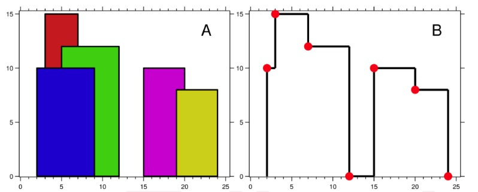 </div>

每个建筑物的几何信息用三元组 [Li，Ri，Hi] 表示，其中 Li 和 Ri 分别是第 i 座建筑物左右边缘的 x 坐标，Hi 是其高度。可以保证 0 ≤ Li, Ri ≤ INT_MAX, 0 < Hi ≤ INT_MAX 和 Ri - Li > 0。您可以假设所有建筑物都是在绝对平坦且高度为 0 的表面上的完美矩形。

例如，图A中所有建筑物的尺寸记录为：[ [2 9 10], [3 7 15], [5 12 12], [15 20 10], [19 24 8] ] 。

输出是以 [ [x1,y1], [x2, y2], [x3, y3], ... ] 格式的“关键点”（图B中的红点）的列表，它们唯一地定义了天际线。关键点是水平线段的左端点。请注意，最右侧建筑物的最后一个关键点仅用于标记天际线的终点，并始终为零高度。此外，任何两个相邻建筑物之间的地面都应被视为天际线轮廓的一部分。

例如，图B中的天际线应该表示为：[ [2 10], [3 15], [7 12], [12 0], [15 10], [20 8], [24, 0] ]。

说明:

* 任何输入列表中的建筑物数量保证在 [0, 10000] 范围内。
* 输入列表已经按升序排列在左边的 x 位置 Li 。
* 输出列表必须按 x 位排序。
* 输出天际线中不得有连续的相同高度的水平线。例如 [...[2 3], [4 5], [7 5], [11 5], [12 7]...] 是不正确的答案；三条高度为 5 的线应该在最终输出中合并为一个：[...[2 3], [4 5], [12 7], ...]

### 解答

[参考](https://www.youtube.com/watch?v=8Kd-Tn_Rz7s&vl=zh)

**扫描线的方法**

将大楼的左上角点称为“入”点，右上角的点称为“出”点。从左往右扫描，每当遇到一个点：

* 如果是一个“入”点，并且该点是当前最高的点，那么就将该点加入结果中
* 如果是一个“出”点，那么就需要将自己（该大楼）移除，如果删除后最高的大楼低于被删除大楼的高度，那么就将扫描线与删除后最高的大楼（即第二高的大楼）的交点加入结果中（如果删除前和删除后最高的大楼相同，那么不做额外处理）

<div align="center"> 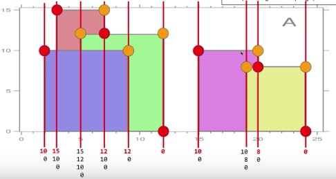 </div>

可以通过将高度改为对应负值来标识一个“出”点

注意几种特殊情况：

* 当一个大楼的右边与另一个大楼的最左边挨着，即第一个大楼的“出”点x坐标与第二个大楼的“入”点x坐标相等。此时扫描线应该先处理后一个大楼的“入”点，否则会添加一个错误的点。因为“出”点的高度用负值标识，所有”入“点都是正值，所以排序的时候，x相同时高度更高的点排在前面即可满足这种要求：

<div align="center"> 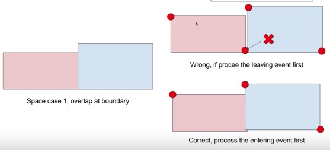 </div>

* 当两个大楼的”入“点或”出“点的x坐标相同时，即两个大楼的左边挨着，或者右边挨着时
    - 如果左边挨着：那么要从最高的大楼开始处理，否则会添加3个点
    - 如果右边挨着；那么要从最低的大楼开始处理，否则也会添加3个点（上面将”出“点高度用对应的负值标识，这样的处理在排序时，也能满足这个要求）

<div align="center"> 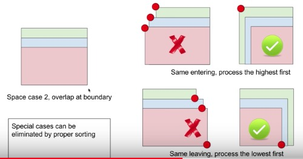 </div>

<br>

```c++
class Solution {
public:
    vector<pair<int, int>> getSkyline(vector<vector<int>>& buildings) {
        multiset<int> hs; //包含所有已处理过的左上角和右上角点的高度
        
        vector<pair<int,int>> es;//保存所有待处理点
        for(const auto &p : buildings){
            es.emplace_back(p[0],p[2]);  //左上角（“入”点）
            es.emplace_back(p[1],-p[2]); //右上角，高度取负值用以标识是个“出”点
        }
        
        auto comp = [](const pair<int,int> &p1,const pair<int,int> p2){
            //如果两个点x相同，则更高的点排在前面
            if(p1.first == p2.first)    return p1.second > p2.second;
            //如果两个点x不同，则x更小的排在前面
            return  p1.first < p2.first;
        };
        
        //对所有点排序，因为要用线段扫描，所以按x轴排序，x相同的点，较低的排前面
        sort(es.begin(),es.end(),comp); 
        
        vector<pair<int,int>> res;
        
        //遍历每个建筑的两个顶点
        for(const auto &p : es){
            int x = p.first; //x左标
            bool entering = p.second > 0; //是不是个“入”点
            int h = abs(p.second);  //得到实际高度
            
            if(entering){// 如果是一个“入”点
                if(h > maxHeight(hs))
                    res.emplace_back(x,h);
                hs.insert(h);
            } else { // 如果是一个“出”点
                hs.erase(hs.equal_range(h).first);//有多个相同时，删除任意一个即可
                if(h > maxHeight(hs))
                    res.emplace_back(x,maxHeight(hs));
            }
        }
        
        return res;
    }
    
private:
    int maxHeight(const multiset<int> &hs) const {
        if(hs.empty())  return 0;
        return *hs.rbegin();
    }
};
```

<br>
<br>

## LRU缓存机制

[OJ链接](https://leetcode.com/problems/lru-cache/description/)

运用你所掌握的数据结构，设计和实现一个  LRU (最近最少使用) 缓存机制。它应该支持以下操作： 获取数据 get 和 写入数据 put 。

获取数据 get(key) - 如果密钥 (key) 存在于缓存中，则获取密钥的值（总是正数），否则返回 -1。
写入数据 put(key, value) - 如果密钥不存在，则写入其数据值。当缓存容量达到上限时，它应该在写入新数据之前删除最近最少使用的数据值，从而为新的数据值留出空间。

进阶:

你是否可以在 O(1) 时间复杂度内完成这两种操作？

示例:

```
LRUCache cache = new LRUCache( 2 /* 缓存容量 */ );

cache.put(1, 1);
cache.put(2, 2);
cache.get(1);       // 返回  1
cache.put(3, 3);    // 该操作会使得密钥 2 作废
cache.get(2);       // 返回 -1 (未找到)
cache.put(4, 4);    // 该操作会使得密钥 1 作废
cache.get(1);       // 返回 -1 (未找到)
cache.get(3);       // 返回  3
cache.get(4);       // 返回  4
```

### 解答

[参考](https://www.youtube.com/watch?v=q1Njd3NWvlY)

* 需要实现O(1)的查找，那么需要用到hash表
* 因为LRU，所以get的节点要移动到队列首部，put需要将节点添加到队列首部，需要在O(1)内完成，那么应该使用链表

最后，在get时如何获取到链表中的节点？我们将hash表的value设置成连接节点的迭代器，因此通过key就能找到相应节点的迭代器。因为get时，可能删除链表中间的某个节点，要在O(1)内完成，那么使用双链表（STL的list）

那么链表节点是只保存value还是保存(key,value)？答案是后者，因为当缓存满时，需要删除链表结尾的节点，同时需要删除hash表中对应的项，因此需要获取节点的key

总的来说，就是hash表和list的两层结构：

<div align="center"> 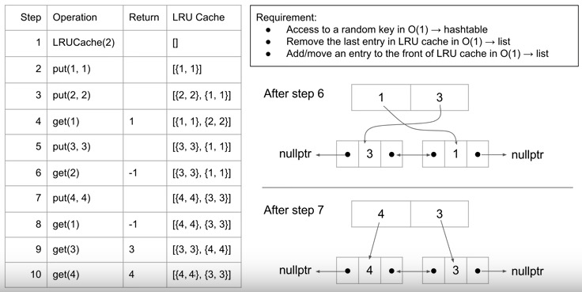 </div>

代码如下：

```c++
class LRUCache {
public:
    LRUCache(int capacity) : hashtable() , ls() , cap(capacity) , curr(0) {}
    
    int get(int key) {
        if(hashtable.find(key) == hashtable.end())  return -1;
        auto itr = hashtable[key];
        if(itr == ls.begin())
            return itr->second;
        else{
            ls.push_front(pair<int,int>(itr->first,itr->second));
            auto new_itr = ls.begin();
            hashtable[key] = new_itr;
            ls.erase(itr);
            return ls.front().second;
        }
        return 1;
    }
    
    void put(int key, int value) {
        if(hashtable.find(key) != hashtable.end()){
            ls.erase(hashtable[key]);
            ls.push_front(pair<int,int>(key,value));
            auto new_itr = ls.begin();
            hashtable[key] = new_itr;
            return;
        }
        if(curr == cap){
            hashtable.erase(ls.back().first);
            ls.pop_back();
            curr--;
        }    
        ls.push_front(pair<int,int>(key,value));
        auto new_itr = ls.begin();
        hashtable[key] = new_itr;
        curr++;
    }
private:
    unordered_map<int,list<pair<int,int>>::iterator> hashtable;
    list<pair<int,int>> ls;
    int cap;
    int curr;
};

/**
 * Your LRUCache object will be instantiated and called as such:
 * LRUCache obj = new LRUCache(capacity);
 * int param_1 = obj.get(key);
 * obj.put(key,value);
 */
```

<br>
<br>

## 扁平化嵌套列表迭代器

[OJ链接](https://leetcode.com/problems/flatten-nested-list-iterator/description/)

给出一个嵌套的整数列表，实现一个扁平化遍历该链表的迭代器

例如：

给定列表 ```[[1,1],2,[1,1]]```,

通过重复调用 next 直到 hasNext 返回false，next 返回的元素的顺序应该是: ```[1,1,2,1,1]```

### 解答

<div align="center"> 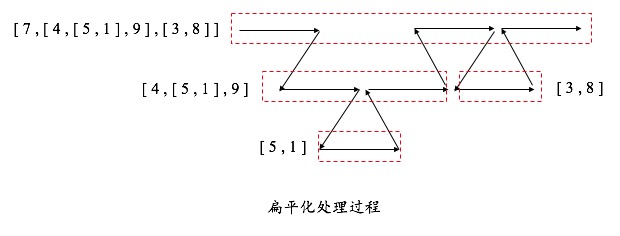 </div>

上图给出了一个扁平化处理过程，从处理过程上看，当遇到一个嵌套list时，会进入嵌套的list处理该list，当嵌套list处理完成后，会返回外层list继续处理。这个过程是一个递归的处理过程，因此可以使用两个栈，一个栈begin保存每层list的当前迭代器，另一个栈end保存每层list的尾后迭代器，用于判断何时一层list处理结束。begin.top()和end.top()是同一层list的当前迭代器和尾后迭代器

```c++
/**
 * // This is the interface that allows for creating nested lists.
 * // You should not implement it, or speculate about its implementation
 * class NestedInteger {
 *   public:
 *     // Return true if this NestedInteger holds a single integer, rather than a nested list.
 *     bool isInteger() const;
 *
 *     // Return the single integer that this NestedInteger holds, if it holds a single integer
 *     // The result is undefined if this NestedInteger holds a nested list
 *     int getInteger() const;
 *
 *     // Return the nested list that this NestedInteger holds, if it holds a nested list
 *     // The result is undefined if this NestedInteger holds a single integer
 *     const vector<NestedInteger> &getList() const;
 * };
 */
class NestedIterator {
public:
    NestedIterator(vector<NestedInteger> &nestedList) {
        //将最外层的list收尾迭代器压入栈
        begin.push(nestedList.begin());
        end.push(nestedList.end());
    }

    int next() {
        if(hasNext()) return (begin.top()++)->getInteger();
        return 0;
    }

    bool hasNext() {
        while(begin.size()){//说明至少还有一层list未处理完
            //该层list遍历完毕，弹出两个迭代器继续处理外层list
            if(begin.top() == end.top()){
                begin.pop();
                end.pop();
            }
            else{//该层list还有剩余，继续处理该层
                auto itr = begin.top();
                if(itr->isInteger())  return true;
                //遇到一个嵌套list，前移迭代器，准备压入嵌套list的迭代器，处理嵌套层
                begin.top()++;
                begin.push(itr->getList().begin());
                end.push(itr->getList().end());
            }
        }
        return false;
    }
private:
    stack<vector<NestedInteger>::iterator> begin,end;
};

/**
 * Your NestedIterator object will be instantiated and called as such:
 * NestedIterator i(nestedList);
 * while (i.hasNext()) cout << i.next();
 */
```

<br>
<br>

## 实现O(1)的插入删除与随机获取

[OJ链接](https://leetcode.com/problems/insert-delete-getrandom-o1/description/)

设计一个支持在平均 时间复杂度 O(1) 下，执行以下操作的数据结构。

1. `insert(val)`：当元素 val 不存在时，向集合中插入该项。
2. `remove(val)`：元素 val 存在时，从集合中移除该项。
3. `getRandom`：随机返回现有集合中的一项。每个元素应该有相同的概率被返回。

示例 :

```
// 初始化一个空的集合。
RandomizedSet randomSet = new RandomizedSet();

// 向集合中插入 1 。返回 true 表示 1 被成功地插入。
randomSet.insert(1);

// 返回 false ，表示集合中不存在 2 。
randomSet.remove(2);

// 向集合中插入 2 。返回 true 。集合现在包含 [1,2] 。
randomSet.insert(2);

// getRandom 应随机返回 1 或 2 。
randomSet.getRandom();

// 从集合中移除 1 ，返回 true 。集合现在包含 [2] 。
randomSet.remove(1);

// 2 已在集合中，所以返回 false 。
randomSet.insert(2);

// 由于 2 是集合中唯一的数字，getRandom 总是返回 2 。
randomSet.getRandom();
```

### 解答

使用数组vector存储元素，使用map存储数字的`(值,下标)`

* 插入一个元素时，直接插入vector尾部，并且将相应的`(值,下标)`插入map
* 删除一个元素时，在map中查找这个元素在vector中的下标，然后将vector尾部元素移至即将被删除的元素所在的位置。更新map中尾元素的下标，并且删除vector尾元素，删除map中与被删除元素有关的项

```c++
class RandomizedSet {
public:
    /** Initialize your data structure here. */
    RandomizedSet() {
        //srand(time(0));
    }
    
    /** Inserts a value to the set. Returns true if the set did not already contain the specified element. */
    bool insert(int val) {
        if(map.find(val) != map.end())  return false;
        nums.emplace_back(val);
        map[val] = nums.size() - 1;
        return true;
    }
    
    /** Removes a value from the set. Returns true if the set contained the specified element. */
    bool remove(int val) {
        if(map.find(val) == map.end())  return false;
        int idxOfval = map[val];
        int last = nums.back();
        nums[idxOfval] = last;
        map[last] = idxOfval;
        map.erase(val);
        nums.pop_back();
        return true;
    }
    
    /** Get a random element from the set. */
    int getRandom() {
        return nums[rand() % nums.size()];
    }
private:
    vector<int> nums;               //存储元素
    unordered_map<int,int> map;     //存储元素在nums中的下标
};

/**
 * Your RandomizedSet object will be instantiated and called as such:
 * RandomizedSet obj = new RandomizedSet();
 * bool param_1 = obj.insert(val);
 * bool param_2 = obj.remove(val);
 * int param_3 = obj.getRandom();
 */
```

<br>
<br>

## 100亿个整数的中位数

100亿个整数，内存足够，如何找到中位数？内存不足，如何找到中位数？

### 解答

> 内存足够的话可以使用基于partition的方法

内存不足时，可以使用2种方法

#### 1）二分查找

是在整数中查找，那么范围有了。因此可以对这个范围进行二分，找有多少个数小于mid，有多少个数大于mid，然后递归

#### 2）分桶

化大为小。把所有数划分到各个小区间（称作“桶”），把每个数映射到对应的区间里（比如以整数的最高5位作为桶的下标），统计每个区间中数的个数。数一遍各个区间，看中位数落在哪个区间。如果中位数所在的区间能够一次载入内存，那么载入内存查找。否则，继续将这个区间进行划分，直到中位数所在的区间能一次载入内存为止

<br>
<br>

## K个一组翻转链表

[OJ链接](https://leetcode.com/problems/reverse-nodes-in-k-group/description/)

给出一个链表，每 k 个节点一组进行翻转，并返回翻转后的链表。

k 是一个正整数，它的值小于或等于链表的长度。如果节点总数不是 k 的整数倍，那么将最后剩余节点保持原有顺序。

示例 :

给定这个链表：`1->2->3->4->5`

当 k = 2 时，应当返回: `2->1->4->3->5`

当 k = 3 时，应当返回: `3->2->1->4->5`

说明 :

* 你的算法只能使用常数的额外空间。
* 你不能只是单纯的改变节点内部的值，而是需要实际的进行节点交换。

### 解答

实现一个函数使用递归对k个节点组成的链表进行翻转。返回翻转后的头结点、翻转后的未节点last、k个节点的下一个节点`next`（即下次处理的k个节点的头节点）

使用一个指针`curr`指向已经处理过的链表的尾节点，那么每翻转一次后需要4步更新：

1. 设置`curr`的next指针指向经过翻转的k个节点链表的头结点
2. 更新`curr`指向`last`节点
3. 设置`curr`的next指针指向还未处理的节点链表的头节点（这一步是有必要的，虽然下一次处理会更改`curr`的next指针指向后面经过翻转的k个节点链表的头结点，但是如果已经是最后一次处理，那么这次处理后`curr`的next指针会指向前一个节点）
4. 更新头结点`head`为`next`，继续下一次处理

```c++
/**
 * Definition for singly-linked list.
 * struct ListNode {
 *     int val;
 *     ListNode *next;
 *     ListNode(int x) : val(x), next(NULL) {}
 * };
 */
class Solution {
public:
    ListNode* reverseKGroup(ListNode* head, int k) {
        ListNode pHead(0),*curr = &pHead;
        while(head){
            ListNode *last = NULL,*next = NULL;
            curr->next = reverseKNode(head,k - 1,&last,&next);
            curr = last;
            if(curr)    curr->next = next;
            head = next;
        }
        return pHead.next;
    }
private:
    ListNode* reverseKNode(ListNode* node,int k,ListNode **last,ListNode **next){
        if(!node)   return NULL;
        
        if(k == 0){
            *last = node;
            *next = node->next;
            return node;
        }
        
        ListNode *head = reverseKNode(node->next,k - 1,last,next);
        
        if(*last){//当剩余节点不够k个时，last始终为NULL，因此不翻转剩余不足k个的节点
            (*last)->next = node;
            *last = node;
        }
        
        return *last ? head : node;
    }
};
```

<br>
<br>

## 最长有效括号

[OJ链接](https://leetcode.com/problems/longest-valid-parentheses/description/)

给定一个只包含 `'('` 和 `')'` 的字符串，找出最长的包含有效括号的子串的长度。

示例 1:

```
输入: "(()"
输出: 2
解释: 最长有效括号子串为 "()"
```

示例 2:

```
输入: ")()())"
输出: 4
解释: 最长有效括号子串为 "()()"
```

### 解答

使用一个栈

* 如果遇到`'('`，那么将下标压入栈中
* 如果遇到`')'`，说明可能出现一次匹配，那么查看栈是否为空（即左边是否存在`'('`与该`')'`匹配）
    - 如果栈为空，说明前面的匹配被该`')'`终止，`')'`后面的括号不可能和`')'`前面的括号产生匹配，所以更新匹配的起始下标`start`
    - 如果栈不为空，那么弹出一个`'('`，并且根据弹出后栈是否为空来更新`res`
        + 如果弹出后栈不为空，那么从当前栈顶`'('`的位置之后，到当前的`')'`为有效的匹配串
        + 如果弹出后栈顶为空，那么从`start`后到当前的`')'`为有效的匹配串

```c++
class Solution {
public:
    int longestValidParentheses(string s) {
        if(s == "") return 0;
        
        int res = 0,start = -1;
        stack<int> st;
        
        for(int i = 0;i < s.length();i++){
            switch(s[i]){
                case '(':
                    st.push(i);
                    break;
                case ')':
                    if(st.empty())
                        start = i;
                    else{
                        st.pop();
                        if(st.empty())
                            res = max(res,i - start);
                        else
                            res = max(res,i - st.top());
                    }
                    break;
            }
        }
        
        return res;
    }
};
```

<br>
<br>

## 所有单词相连的子串

[OJ链接](https://leetcode.com/problems/substring-with-concatenation-of-all-words/description/)

给定一个字符串 s 和一些长度相同的单词 words。在 s 中找出可以恰好串联 words 中所有单词的子串的起始位置。

注意子串要与 words 中的单词完全匹配，中间不能有其他字符，但不需要考虑 words 中单词串联的顺序。

示例 1:

```
输入:
  s = "barfoothefoobarman",
  words = ["foo","bar"]
输出: [0,9]
解释: 从索引 0 和 9 开始的子串分别是 "barfoor" 和 "foobar" 。
输出的顺序不重要, [9,0] 也是有效答案。
```

示例 2:

```
输入:
  s = "wordgoodstudentgoodword",
  words = ["word","student"]
输出: []
```

### 解答

使用map存储每个单词以及单词的次数，使用一个变量`count`表示单词的总数，遍历字符串，判断以每个字符开始的子串是否是满足要求的子串

words中的单词长度相同，设为len。因此要判断是否满足要求，即判断相连的count个长度为len的子串是否都在map中。由于子串出现的次数必须和map中单词的次数相等，因此查找时每找到一个单词，map中单词的计数减1

```c++
class Solution {
public:
    vector<int> findSubstring(string s, vector<string>& words) {
        if(s == "" || words.empty()) return vector<int>();
        
        unordered_map<string,int> dict;
        for(string s : words)   dict[s]++;
    
        int len = words[0].length(),totalLen = words.size() * len;
        int end = s.length() - totalLen;
        vector<int> res;
        for(int i = 0;i <= end;i++){
            int count = words.size(),j = i;
            unordered_map<string,int> tmpDict = dict;
            while(count--){
                if(tmpDict[s.substr(j,len)]-- <= 0)
                    break;
                j += len;
            }
            if(j - i == totalLen)    res.push_back(i);
        }
        
        return res;
    }
};
```

<br>
<br>

## 查找插入位置

[OJ链接](https://leetcode.com/problems/search-insert-position/description/)

给定一个排序数组和一个目标值，在数组中找到目标值，并返回其索引。如果目标值不存在于数组中，返回它将会被按顺序插入的位置。

你可以假设数组中无重复元素。

示例 1:

```
输入: [1,3,5,6], 5
输出: 2
```

示例 2:

```
输入: [1,3,5,6], 2
输出: 1
```

示例 3:

```
输入: [1,3,5,6], 7
输出: 4
```

示例 4:

```
输入: [1,3,5,6], 0
输出: 0
```

### 解答

二分查找，注意如果没找到应该返回`l`：

```c++
class Solution {
public:
    int searchInsert(vector<int>& nums, int target) {
        int l = 0,r = nums.size() - 1;
        while(l <= r){
            int mid = (l + r) >> 1;
            if(nums[mid] < target)       l = mid + 1;
            else if(nums[mid] > target)  r = mid - 1;
            else                         return mid;
        }
        
        return l;
    }
};
```

<br>
<br>

## 字符串相乘

给定两个以字符串形式表示的非负整数 num1 和 num2，返回 num1 和 num2 的乘积，它们的乘积也表示为字符串形式。

示例 1:

```
输入: num1 = "2", num2 = "3"
输出: "6"
```

示例 2:

```
输入: num1 = "123", num2 = "456"
输出: "56088"
```

说明：

1. `num1` 和 `num2` 的长度小于110。
2. `num1` 和 `num2` 只包含数字 `0-9`。
3. `num1` 和 `num2` 均不以零开头，除非是数字 0 本身。
4. 不能使用任何标准库的大数类型（比如 BigInteger）或直接将输入转换为整数来处理。

### 解答

使用两个指针`i`和`j`分别指向变量`num1`和`num2`，一个数组`sum`保存结果。显然，我们就是要将`num1[i] * num2[j]`和结果数组`sum`中相应的位相加，然后对10取模后保存，再使用一个变量`carray`保存进位信息。关键是`num1[i] * num2[j]`应该和数组`sum`中哪一位相加

* 首先，`num1`和`num2`相乘结果的位数，不可能超过`num1`和`num2`位数的和。因为当`num1`和`num2`每一位都为`9`时，相乘的结果最大，此时结果的位数等于两个数的位数之和
* 然后，`num1[i] * num2[j]`最多只有`2`位。这个`2`位或`1`位数应该与数组`sum`的某一位相加。假设`num1`中`i`后面有`m`位，`num2`中`j`后面有n位，那么就应该与`sum`中倒数第`m + n + 1`位相加。因为`sum`数组的大小为`num1`和`num2`的位数和，因此，应该与`sum[i + j + 1]`相加

<div align="center"> 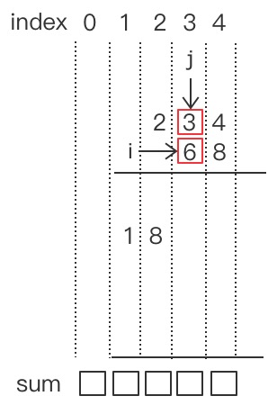 </div>

> 要特别注意`0`和`'0'`的区别

时间复杂度：O(n \* m)（n和m分别为字符串num1和num2的长度）

```c++
class Solution {
public:
    string multiply(string num1, string num2) {
        string sum(num1.length() + num2.length(),'0');
        
        for(int i = num1.length() - 1;i >= 0;i--){
            int carry = 0; //进位
            for(int j = num2.length() - 1;j >= 0;j--){
                int tp = (sum[i + j + 1] - '0') + (num1[i] - '0') * (num2[j] - '0') + carry;
                sum[i + j + 1] = tp % 10 + '0';
                carry = tp / 10;
            }
            sum[i] = carry + '0'; //这里第一次处理sum的第i位，所以直接复制就行，不需要累加
        }
        
        for(int i = 0;i < sum.length();i++)
            if(sum[i] != '0')
                return sum.substr(i);
        
        return "0";
    }
};
```

<br>
<br>

## N皇后II

[OJ链接](https://leetcode.com/problems/n-queens-ii/description/)

n 皇后问题研究的是如何将 n 个皇后放置在 n×n 的棋盘上，并且使皇后彼此之间不能相互攻击

给定一个整数 n，返回 n 皇后不同的解决方案的数量

示例:

```
输入: 4
输出: 2
解释: 4 皇后问题存在如下两个不同的解法。
[
 [".Q..",  // 解法 1
  "...Q",
  "Q...",
  "..Q."],

 ["..Q.",  // 解法 2
  "Q...",
  "...Q",
  ".Q.."]
]
```

### 解答

找出所有排列，然后筛选出满足条件的排列

#### 1）先排列后筛选

就是[八皇后](#八皇后)的解法，找出所有排列，对于每个排列，判断排列中任意两个皇后是否能相互攻击，如果任意2个皇后都不能攻击，则计数加1

时间复杂度：O(n! \* n^2)

```c++
class Solution {
public:
    int totalNQueens(int n) {
        if(n <= 0)  return 0;
        
        int res = 0;
        vector<int> arr;    //排列
        for(int i = 0;i < n;i++)    arr.push_back(i);
        
        dfs(arr,0,res);
        
        return res;
    }
private:
    void dfs(vector<int> &arr,int i,int &res){
        if(i == arr.size()){
            if(valid(arr))
                res++;
            return;
        }
        
        dfs(arr,i + 1,res);
        for(int j = i + 1;j < arr.size();j++){
            swap(arr[i],arr[j]);
            dfs(arr,i + 1,res);
            swap(arr[i],arr[j]);
        }
    }
    
    bool valid(const vector<int> &arr){
        for(int i = 0;i < arr.size() - 1;i++)
            for(int j = i + 1;j < arr.size();j++)
                if(j - i == abs(arr[j] - arr[i]))
                    return false;
        return true;
    }
};
```

#### 2）边排列边筛选

[参考](https://www.youtube.com/watch?v=Xa-yETqFNEQ)

如果能在排列过程中完成筛选，那么就可以提升效率

<div align="center"> 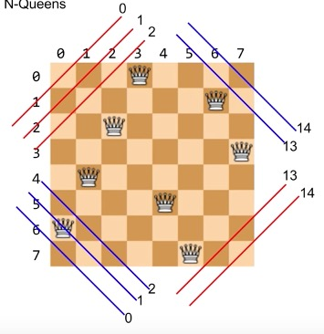 </div>

如上图所示，对于`n`阶的矩阵，红线和蓝线分别有`2 * n - 1`条。在排列过程中，如果选择了一个位置，那么将这个位置对应的红线和蓝线标记为`1`，这意味着往后不能再选择该红线和蓝线上的位置。因此，在判断是否添加一个位置时，如果该位置对应的红线或蓝线已经标记为`1`，说明之前已经添加了一个该条线上的位置，所以不能添加当前位置。如果对应的红线和蓝线都没标记为`1`，则添加该位置，并将对应的红线和蓝线标记为`1`。在DFS递归返回后，选择当前层的下一个位置之前，将对应的红线和蓝线标记清除，即置为`0`

对于位置`(x,y)`：

* 该位置对应红线的下标为：`x + y`
* 该位置对应的蓝线的下标为：`x - y + (n - 1)`

时间复杂度；O(n!)

```c++
class Solution {
public:
    int totalNQueens(int n) {
        if(n <= 0)  return 0;
        
        int res = 0;
        vector<int> arr;
        for(int i = 0;i < n;i++)    arr.push_back(i);
        vector<char> lineRed(2 * n - 1,0);     //红线是否已标记
        vector<char> lineBlue(2 * n - 1,0);    //蓝线是否已标记
        
        dfs(arr,lineRed,lineBlue,0,n,res);
        
        return res;
    }
private:
    void dfs(vector<int> &arr,vector<char> &lineRed,vector<char> &lineBlue,int i,int n,int &res){
        if(i == n){
            res++;
            return;
        }
        
        for(int j = i;j < n;j++){
            swap(arr[i],arr[j]);
            
            int y = i,x = arr[i];
            int idxOfLineRed = x + y;               //当前点所在的红线的下标
            int idxOfLineBlue = x - y + (n - 1);    //当前点所在的蓝线的下标
            if(lineRed[idxOfLineRed] == 0 && lineBlue[idxOfLineBlue] == 0){
                lineRed[idxOfLineRed] = 1;
                lineBlue[idxOfLineBlue] = 1;
                dfs(arr,lineRed,lineBlue,i + 1,n,res);
                lineRed[idxOfLineRed] = 0;
                lineBlue[idxOfLineBlue] = 0;
            }
            
            swap(arr[i],arr[j]);
        }
    }
};
```

<br>
<br>

## N皇后

[OJ链接](https://leetcode.com/problems/n-queens/description/)

n 皇后问题研究的是如何将 n 个皇后放置在 n×n 的棋盘上，并且使皇后彼此之间不能相互攻击

给定一个整数 n，返回所有不同的 n 皇后问题的解决方案

每一种解法包含一个明确的 n 皇后问题的棋子放置方案，该方案中 'Q' 和 '.' 分别代表了皇后和空位

示例:

```
输入: 4
输出: [
 [".Q..",  // 解法 1
  "...Q",
  "Q...",
  "..Q."],

 ["..Q.",  // 解法 2
  "Q...",
  "...Q",
  ".Q.."]
]
解释: 4 皇后问题存在两个不同的解法。
```

### 解答

和[N皇后II](#n皇后ii)不同的是，前者是求出满足条件的排列数量，这里要求输出所有符合要求的排列。但是方法都是相同，前者是找到一个符合要求的排列时计数加1，这里是找到一个符合要求的排列时，根据排列设置矩阵，然后将矩阵添加到结果中

#### 1）先排列后筛选

时间复杂度：O(n! \* n^2)

```c++
class Solution {
public:
    vector<vector<string>> solveNQueens(int n) {
        if(n <= 0)  return vector<vector<string>>();
        
        vector<vector<string>> res;
        vector<int> arr;    //排列
        for(int i = 0;i < n;i++)    arr.push_back(i);
        
        dfs(arr,0,res);
        
        return res;
    }
private:
    void dfs(vector<int> &arr,int i,vector<vector<string>> &res){
        if(i == arr.size()){
            if(valid(arr)){
                int n = arr.size();
                string s(n,'.');
                vector<string> matrix(n,s);
                for(int i = 0;i < n;i++)    matrix[i][arr[i]] = 'Q';
                res.push_back(matrix);
            }
            return;
        }
        
        dfs(arr,i + 1,res);
        for(int j = i + 1;j < arr.size();j++){
            swap(arr[i],arr[j]);
            dfs(arr,i + 1,res);
            swap(arr[i],arr[j]);
        }
    }
    
    bool valid(const vector<int> &arr){
        for(int i = 0;i < arr.size() - 1;i++)
            for(int j = i + 1;j < arr.size();j++)
                if(j - i == abs(arr[j] - arr[i]))
                    return false;
        return true;
    }
};
```

#### 2）边排列边筛选

时间复杂度：O(n!)

```c++
class Solution {
public:
    vector<vector<string>> solveNQueens(int n) {
        if(n <= 0)  return vector<vector<string>>();
        
        vector<vector<string>> res;
        vector<int> arr;
        for(int i = 0;i < n;i++)    arr.push_back(i);
        vector<char> lineRed(2 * n - 1,0);     //红线是否已标记
        vector<char> lineBlue(2 * n - 1,0);    //蓝线是否已标记
        
        dfs(arr,lineRed,lineBlue,0,n,res);
        
        return res;
    }
private:
    void dfs(vector<int> &arr,vector<char> &lineRed,vector<char> &lineBlue,int i,int n,vector<vector<string>> &res){
        if(i == n){
            int n = arr.size();
            string s(n,'.');
            vector<string> matrix(n,s);
            for(int i = 0;i < n;i++)    matrix[i][arr[i]] = 'Q';
            res.push_back(matrix);
            return;
        }
        
        for(int j = i;j < n;j++){
            swap(arr[i],arr[j]);
            
            int y = i,x = arr[i];
            int idxOfLineRed = x + y;               //当前点所在的红线的下标
            int idxOfLineBlue = x - y + (n - 1);    //当前点所在的蓝线的下标
            if(lineRed[idxOfLineRed] == 0 && lineBlue[idxOfLineBlue] == 0){
                lineRed[idxOfLineRed] = 1;
                lineBlue[idxOfLineBlue] = 1;
                dfs(arr,lineRed,lineBlue,i + 1,n,res);
                lineRed[idxOfLineRed] = 0;
                lineBlue[idxOfLineBlue] = 0;
            }
            
            swap(arr[i],arr[j]);
        }
    }
};
```

<br>
<br>

## 单词转换的最少次数

[OJ链接](https://www.lintcode.com/problem/edit-distance/description)

给出两个单词word1和word2，计算出将word1 转换为word2的最少操作次数。

你总共三种操作方法：

* 插入一个字符
* 删除一个字符
* 替换一个字符

例如：给出 word1=`"mart"` 和 word2=`"karma"` 返回 `3`

### 解答

假设`state[i][j]`表示单词`word1.substr(0,i + 1)`转换成单词`word2.substr(0,j + 1)`的最少操作数：

* 当`word1[i] == word2[j]`时，`state[i][j] = state[i - 1][j - 1]`
* 否则，可以进行三种操作：
    - 在`word1.substr(0,i + 1)`后面插入一个`word2[j]`，此时`state[i][j] = 1 + state[i][j - 1]`
    - 将`word1.substr(0,i + 1)`最后一个字符删除，此时`state[i][j] = 1 + state[i - 1][j]`
    - 将`word1.substr(0,i + 1)`最后一个字符替换成`word2[j]`，此时`state[i][j] = 1 + state[i - 1][j - 1]`
    所以当`word1[i] != word2[j]`时，`state[i][j]`等于上面三者中的最小值

```c++
class Solution {
public:
    /**
     * @param word1: A string
     * @param word2: A string
     * @return: The minimum number of steps.
     */
    int minDistance(string &word1, string &word2) {
        // write your code here
        if(word1 == "" || word2 == "")
            return word1 == "" ? word2.length() : word1.length();
            
        int len1 = word1.length(),len2 = word2.length();
        vector<vector<int>> state(len1,vector<int>(len2,0));
        
        state[0][0] = word1[0] == word2[0] ? 0 : 1;
        
        for(int j = 1;j < len2;j++)
            state[0][j] = word1[0] == word2[j] ? j : 1 + state[0][j - 1];
        for(int i = 1;i < len1;i++)
            state[i][0] = word1[i] == word2[0] ? i : 1 + state[i - 1][0];
        
        for(int i = 1;i < len1;i++){
            for(int j = 1;j < len2;j++){
                if(word1[i] == word2[j])
                    state[i][j] = state[i - 1][j - 1];
                else{
                    int times1 = 1 + state[i][j - 1];       //插入
                    int times2 = 1 + state[i - 1][j];       //删除
                    int times3 = 1 + state[i - 1][j - 1];   //替换
                    state[i][j] = min(min(times1,times2),times3);
                }
            }
        }
        
        return state[len1 - 1][len2 - 1];
    }
};
```

<br>
<br>

## 装载货物的最少货车数量

N个货物需要装车，每个车最多能装重量300的货物，货物的重量在区间[100,300]内，给出N个货物的重量，求最少需要多少量车？

例子：

```
输入：
130 140 150 160
输出：
2

输入：
130 140 150 160 100 100 100
输出：
3

输入：
100 100 100 100 100 100 200 200 200
输出：
4
```

### 解答

> 仅供参考，没有经过大量测试用例的验证

先装大重量的货物，然后根据货车剩余能装载货物的重量从剩余小重量的货物中按重量从大到小（为的是尽可能的”装满“），找到能放上货车的货物。如果某个货物已经用于填充某个大重量货物所在的货车，当遍历到这个货物时，直接跳过，因为该货物已经使用过。所以用一个数组state记录每个货物使用与否：

```c++
#include <iostream>
#include <sstream>
#include <vector>

using namespace std;

int solution(vector<int> &weights){
    vector<int> state(weights.size(),0);
    int res = 0;
    for(int i = weights.size() - 1;i >= 0;i--){
        if(state[i] == 1)  continue;
        int curr = weights[i];
        res++;
        for(int j = i - 1;j >= 0;j--){
            if(state[j] == 0 && weights[j] + curr <= 300) {
                curr += weights[j];
                state[j] = 1;
            }
        }
    }
    return res;
}

int main()
{
    //注意怎么处理输入
    string line;
    while(getline(cin,line)){
        stringstream s(line);
        int weight;
        vector<int> weights;
        while(s >> weight){
            weights.push_back(weight);
        }
        cout << solution(weights) << endl;
    }

    return 0;
}


```

<br>
<br>

## 手写实现智能指针

实现一个根据引用计数管理资源的智能指针

### 解答

> 仅供参考

#### 1）不使用辅助类

```c++
/****************************************************************
 *
 *       SharedPtr<T>               T                  int
 *       -------------        --------------       ----------
 *      | ptr | count |   -->|              |  |->|          |
 *       --|------|---    |   --------------   |   ----------
 *         |      |       |                    |
 *         |------|-------|                    |
 *                |                            |
 *                |----------------------------|
 *
 ****************************************************************/

template <typename T>
class SharedPtr{
public:
    /* 构造函数 */
    SharedPtr() : ptr(new T()),count(new int(1)) {}
    explicit SharedPtr(T *src) : ptr(src),count(new int(1)) {}
    explicit SharedPtr(T value) : ptr(new T(value)),count(new int(1)) {}
    /* 拷贝构造函数 */
    SharedPtr(const SharedPtr &rhs) : ptr(rhs.ptr) , count(rhs.count)
    {
        ++(*count); //增加引用计数
    }
    /* 拷贝赋值运算符 */
    SharedPtr& operator= (const SharedPtr &rhs)
    {
        //能处理自赋值
        ++(*(rhs.count));     //递增rhs管理的资源的引用计数
        if(--(*count) == 0) {  //递减自身管理的资源的引用计数
            delete ptr;
            delete count;
        }
        ptr = rhs.ptr;
        count = rhs.count;
        return *this;
    }
    /* 析构函数 */
    ~SharedPtr() {
        if(--(*count) == 0) {
            delete ptr;
            delete count;
        }
    }

    /* 获取资源 */
    T* get() const {return ptr;}
private:
    T *ptr;     //原始指针
    int *count; //引用计数
};
```

#### 2）使用辅助类

```c++
/****************************************************************
 *
 *       SharedPtr<T>         RefPtr<T>              T
 *       -----------        --------------       ----------
 *      |    ptr    |   -->| _src | count |  -->|          |
 *       -----|-----    |   ---|----------   |   ----------
 *            |---------|      |-------------|
 *
 ****************************************************************/

template <typename> class SharedPtr;

//辅助类
template <typename T>
class RefPtr
{
    friend class SharedPtr<T>;

    RefPtr() : _src(new T()),count(1) {}
    RefPtr(T *src) : _src(src),count(1) {}
    RefPtr(T value) : _src(new T(value)),count(1) {}
    ~RefPtr() { delete _src; }

    int count;  //引用计数
    T *_src;    //原始指针
};

template <typename T>
class SharedPtr{
public:
    /* 构造函数 */
    SharedPtr() : ptr(new RefPtr<T>()) {}
    explicit SharedPtr(T *src) : ptr(new RefPtr<T>(src)) {}
    explicit SharedPtr(T value) : ptr(new RefPtr<T>(value)) {}
    /* 拷贝构造函数 */
    SharedPtr(const SharedPtr &rhs) : ptr(rhs.ptr)
    {
        ++(ptr->count); //增加引用计数
    }
    /* 拷贝赋值运算符 */
    SharedPtr& operator= (const SharedPtr &rhs)
    {
        //能处理自赋值
        ++(rhs.ptr->count);     //递增rhs管理的资源的引用计数
        if(--(ptr->count) == 0) //递减自身管理的资源的引用计数
            delete ptr;
        ptr = rhs.ptr;
        return *this;
    }
    /* 析构函数 */
    ~SharedPtr() {
        if(--(ptr->count) == 0)
            delete ptr;
    }

    /* 获取资源 */
    T* get() const {return ptr->_src;}
private:
    RefPtr<T> *ptr;    //辅助类对象指针
};
```

<br>
<br>

## 第K个排列

[OJ链接](https://leetcode.com/problems/permutation-sequence/description/)

给出集合 `[1,2,3,…,n]`，其所有元素共有 n! 种排列。

按大小顺序列出所有排列情况，并一一标记，当 n = 3 时, 所有排列如下：

1. `"123"`
2. `"132"`
3. `"213"`
4. `"231"`
5. `"312"`
6. `"321"`

给定 n 和 k，返回第 k 个排列。

说明：

* 给定 n 的范围是 [1, 9]。
* 给定 k 的范围是 [1, n!]。

示例 1:

```
输入: n = 3, k = 3
输出: "213"
```

示例 2:

```
输入: n = 4, k = 9
输出: "2314"
```

### 解答

#### 1）方法一

基于[下一个排列](#下一个排列)的方法

可以在O(n)时间内求出下一个排列，因此初始化`res = "123..."`，调用k - 1次求下一个排列的方法，就可以得到第k个排列：

* 时间复杂度：O(n \* k)（k可能很大）
* 空间复杂度：O(1)

```c++
class Solution {
public:
    string getPermutation(int n, int k) {
        string res(n,'0');
        for(int i = 0;i < n;i++)
            res[i] += (i + 1);
        
        while(--k)  nextPermutation(res);
        
        return res;
    }
private:
    void nextPermutation(string &s){
        int idx1,idx2,len = s.length();
        for(int i = len - 2;i >= 0;i--){
            if(s[i] < s[i + 1]){
                idx1 = i;
                break;
            }
        } 
        
        for(int i = len - 1;i > idx1;i--){
            if(s[i] > s[idx1]){
                idx2 = i;
                break;
            }
        }
        
        swap(s[idx1],s[idx2]);
        
        int l = idx1 + 1,r = len - 1;
        while(l < r)    swap(s[l++],s[r--]);
    }
};
```

#### 2）方法二

当n为4时，可以按最高位划分成4组数：

```
1 + (2,3,4)
2 + (1,3,4)
3 + (1,2,4)
4 + (1,2,3)
```

因此，如果知道每组数有多少个，那么就可以判断第k个排列在哪一组，从而可以设置结果的最高位数字。进一步，对于剩下的3个数字，也可以固定最高位，然后进一步判断要求的排列在哪一组，从而可以设置结果的次高位数字...，一直处理直到结果的所有位都被设置。为了判断每组数有多少个，要先求出`1!,2!,...,(n - 1)!`

* 时间复杂度：O(n \* n)（每次设置结果字符串中的一个数字，就需要O(n)的时间从list中删除这个数字，不过当k为0后，设置的每个数字都是list的开头数字，所以只需O(1)的时间就能删除）
* 空间复杂度：O(1)

```c++
class Solution {
public:
    string getPermutation(int n, int k) {
        list<int> nums;
        vector<int> factorial(n,1);
        string res(n,'0');
        for(int i = 0;i < n;i++){
            nums.push_back(i + 1);
            factorial[i] = i > 0 ? factorial[i - 1] * i : 1;
        }
        
        k--;
        for(int i = 0;i < n;i++){
            int idx = k / factorial[n - 1 - i];
            list<int>::iterator itr = nums.begin();
            while(idx--)    itr++;
            res[i] += *itr;
            nums.erase(itr);
            k = k % factorial[n - 1 - i];
        }
        
        return res;
    }
};
```

<br>
<br>

## 旋转链表

[OJ链接](https://leetcode.com/problems/rotate-list/description/)

给定一个链表，旋转链表，将链表每个节点向右移动 k 个位置，其中 k 是非负数。

示例 1:

```
输入: 1->2->3->4->5->NULL, k = 2
输出: 4->5->1->2->3->NULL
解释:
向右旋转 1 步: 5->1->2->3->4->NULL
向右旋转 2 步: 4->5->1->2->3->NULL
```

示例 2:

```
输入: 0->1->2->NULL, k = 4
输出: 2->0->1->NULL
解释:
向右旋转 1 步: 2->0->1->NULL
向右旋转 2 步: 1->2->0->NULL
向右旋转 3 步: 0->1->2->NULL
向右旋转 4 步: 2->0->1->NULL
```

### 解答

首先计算出链表的长度`len`，然后`k = k % len`计算出右边需要移动到左边的节点数，即链表被分为2部分：

```
(len - k) -> (k)
```

为了翻转链表得到：

```
(k) -> (len - k) 
```

因此问题转换为求链表的倒数第k + 1个节点

```c++
/**
 * Definition for singly-linked list.
 * struct ListNode {
 *     int val;
 *     ListNode *next;
 *     ListNode(int x) : val(x), next(NULL) {}
 * };
 */
class Solution {
public:
    ListNode* rotateRight(ListNode* head, int k) {
        if(!head || k < 0)  return head;
        
        int len = 0;
        ListNode *p = head;
        while(p){
            ++len;
            p = p->next;
        }
        
        k = k % len;
        
        int first = k;
        ListNode *p1 = head,*p2 = head;
        while(first-- > 0)  p1 = p1->next;
        while(p1->next){
            p1 = p1->next;
            p2 = p2->next;
        }
        
        p1->next = head;
        head = p2->next;
        p2->next = NULL;
        
        return head;
    }
};
```

<br>
<br>

## 左上角到右下角的路径数II

[OJ链接](https://leetcode.com/problems/unique-paths-ii/description/)

一个机器人位于一个 m x n 网格的左上角 （起始点在下图中标记为“Start” ）。

机器人每次只能向下或者向右移动一步。机器人试图达到网格的右下角（在下图中标记为“Finish”）。

现在考虑网格中有障碍物。那么从左上角到右下角将会有多少条不同的路径？

网格中的障碍物和空位置分别用 `1` 和 `0` 来表示。

说明：m 和 n 的值均不超过 100。

示例 1:

```
输入:
[
  [0,0,0],
  [0,1,0],
  [0,0,0]
]
输出: 2
解释:
3x3 网格的正中间有一个障碍物。
从左上角到右下角一共有 2 条不同的路径：
1. 向右 -> 向右 -> 向下 -> 向下
2. 向下 -> 向下 -> 向右 -> 向右
```

### 解答

使用`state(i,j)`表示从起点到`(i,j)`的路径数，那么：

* 如果`(i,j)`为障碍物，`state(i,j) = 0`
* 否则，可以从`(i - 1,j)`往下走1步到达`(i,j)`，也可以从`(i,j - 1)`往右走一步到达`(i,j)`，因此`state(i,j) = state(i - 1,j) + state(i,j - 1)`

以下解法进行了状态压缩（使用一维矩阵）：

```c++
class Solution {
public:
    int uniquePathsWithObstacles(vector<vector<int>>& obstacleGrid) {
        if(obstacleGrid.empty())    return 0;
        
        int rows = obstacleGrid.size(),cols = obstacleGrid[0].size();
        vector<int> state(cols);
        state[0] = obstacleGrid[0][0] == 1 ? 0 : 1;
        for(int j = 1;j < cols;j++){
            if(obstacleGrid[0][j] == 1)     state[j] = 0;
            else                            state[j] = state[j - 1];
        }
        
        for(int i = 1;i < rows;i++){
            if(obstacleGrid[i][0] == 1) state[0] = 0;
            for(int j = 1;j < cols;j++){
                if(obstacleGrid[i][j] == 1) state[j] = 0;
                else                        state[j] += state[j - 1];
            }
        }
        
        return state[cols - 1];
    }
};
```

<br>
<br>

## 左上角到右下角的最短路径

[OJ链接](https://leetcode.com/problems/minimum-path-sum/description/)

给定一个包含非负整数的 m x n 网格，请找出一条从左上角到右下角的路径，使得路径上的数字总和为最小。

说明：每次只能向下或者向右移动一步。

示例:

```
输入:
[
  [1,3,1],
  [1,5,1],
  [4,2,1]
]
输出: 7
解释: 因为路径 1→3→1→1→1 的总和最小。
```

### 解答

使用`state(i,j)`表示从起点到`(i,j)`的最短路径，那么：

* 当`i`和`j`都为0时，`state(i,j) = state(0,0) = grid[0][0]` 
* 当`i`为0，`j`不为0时，`state(i,j) = state(0,j) = state(0,j - 1) + grid[0][j]`
* 当`i`不为0，`j`为0时，`state(i,j) = state(i,0) = state(i - 1,0) + grid[i][0]`
* 当`i`和`j`都不为0时，`state(i,j) = min(state(i - 1,j),state(i,j - 1)) + grid[i][j]`

以下解法进行了状态压缩（使用一维矩阵）：

```c++
class Solution {
public:
    int minPathSum(vector<vector<int>>& grid) {
        if(grid.empty())    return 0;
        
        int rows = grid.size(),cols = grid[0].size();
        vector<int> state(cols);
        state[0] = grid[0][0];
        for(int j = 1;j < cols;j++)
            state[j] = state[j - 1] + grid[0][j];
        
        for(int i = 1;i < rows;i++){
            state[0] += grid[i][0];
            for(int j = 1;j < cols;j++)
                state[j] = min(state[j - 1],state[j]) + grid[i][j];
        }
        
        return state[cols - 1];
    }
};
```

<br>
<br>

## 1~n中所有k个数的组合

[OJ链接](https://leetcode.com/problems/combinations/description/)

给定两个整数 n 和 k，返回 1 ... n 中所有可能的 k 个数的组合。

示例:

```
输入: n = 4, k = 2
输出:
[
  [2,4],
  [3,4],
  [2,3],
  [1,2],
  [1,3],
  [1,4],
]
```

### 解答

从1开始dfs，假设还需选择`m`个数，每个数可以选或者不选：

* 如果不选，那么从剩余的数中选择`m`个数
* 如果选，那么从剩余的数中选择`m-1`个数

如果已经选择了k个数（m等于0），那么将这组数添加到结果中

```c++
class Solution {
public:
    vector<vector<int>> combine(int n, int k) {
        if(k <= 0 || n < k)     return vector<vector<int>>();
        
        vector<vector<int>> res;
        vector<int> path;
        dfs(n,1,k,path,res);
        
        return res;
    }
private:
    void dfs(int n,int num,int k,vector<int> &path,vector<vector<int>> &res){
        if(k == 0){
            res.push_back(path);
            return;
        }
        
        //剩余可选的数不够k个
        if(k > n - num + 1)     return;
        
        path.push_back(num);
        dfs(n,num + 1,k - 1,path,res);
        path.pop_back();
        dfs(n,num + 1,k,path,res);
    }
};
```

<br>
<br>

## 简化路径

[OJ链接](https://leetcode.com/problems/simplify-path/description/)

给定一个文档 (Unix-style) 的完全路径，请进行路径简化。

例如，

path = `"/home/"`, => `"/home"`
path = `"/a/./b/../../c/"`, => `"/c"`

边界情况:

* 你是否考虑了 路径 = `"/../"` 的情况？在这种情况下，你需返回 `"/"` 。
* 此外，路径中也可能包含多个斜杠 `'/'` ，如 `"/home//foo/"` 。在这种情况下，你可忽略多余的斜杠，返回 `"/home/foo"` 。

### 解答

根据`'/'`将路径分割成多个路径组成部分`part`：

* 如果`part`等于`"."`或`""`，那么处理下一个组成部分
* 否则，如果`part`等于`".."`，将上一个组成部分删除
* 否则，将组成部分保存在一个vector或者stack中

最后，根据vector或stack中的路径组成部分，生成简化后的路径

> Java里面有现成的split函数可以根据符号分割字符串，C++要自己实现分割

```c++
class Solution {
public:
    string simplifyPath(string path) {
        if(path == "")  return "/";
        vector<string> v;
        string res = "";
        int first = path[0] == '/' ? 0 : -1;
        for(int i = first + 1;i <= path.length();i++){
            if(path[i] == '/' || i == path.length()){
                string part = path.substr(first + 1,i - first - 1);
                if(part == ".."){
                    if(!v.empty())
                        v.pop_back();
                }
                else if(part != "." && part != "")
                    v.push_back(part);
                first = i;
            }
        }
        
        for(const string &part : v)
            res += '/' + part;
        if(res == "")   return "/";
        return res;
    }
};
```

<br>
<br>

## 旋转数组中查找数字II

[OJ链接](https://leetcode.com/problems/search-in-rotated-sorted-array-ii/description/)

假设按照升序排序的数组在预先未知的某个点上进行了旋转。

( 例如，数组 `[0,0,1,2,2,5,6]` 可能变为 `[2,5,6,0,0,1,2]` )。

编写一个函数来判断给定的目标值是否存在于数组中。若存在返回 `true`，否则返回 `false`。

示例 1:

```
输入: nums = [2,5,6,0,0,1,2], target = 0
输出: true
```

示例 2:

```
输入: nums = [2,5,6,0,0,1,2], target = 3
输出: false
```

进阶:

* 这是 [旋转数组中查找数字](#旋转数组中查找数字) 的延伸题目，**本题中的 nums  可能包含重复元素**
* 这会影响到程序的时间复杂度吗？会有怎样的影响，为什么？

### 解答

相比于前一题，这一题可能包含重复

总的思路还是不变，不过要处理一种特殊情况，即`nums[l] == nums[r] && nums[l] == nums[mid]`时，此时无法确定`mid`在左半部分还是右半部分。因此，当出现这种情况时，在区间`[l,r]`中，执行顺序查找

```c++
class Solution {
public:
    bool search(vector<int>& nums, int target) {
        int l = 0,r = nums.size() - 1;
        while(l <= r){
            int mid = (l + r) / 2;
            if(nums[mid] == target) return true;
            if(nums[l] < nums[r]){
                if(nums[mid] < target)   l = mid + 1;
                else                     r = mid - 1;
            }
            else{
                if(nums[l] == nums[r] && nums[l] == nums[mid]){//无法知道mid在左边还是右边
                    for(int i = l;i <= r;i++)
                        if(nums[i] == target)
                            return true;
                    return false;
                }
                else{ //能确定mid的位置
                    if(nums[mid] >= nums[l]){//mid在左边
                        if(target > nums[r] && target < nums[mid])  r = mid - 1;
                        else    l = mid + 1;
                    }
                    else{//mid在右边
                        if(target > nums[mid] && target < nums[l])  l = mid + 1;
                        else    r = mid - 1;
                    }
                }
            }
        }
        return false;
    }
};
```

<br>
<br>

## 删除有序链表中的重复节点II

[OJ链接](https://leetcode.com/problems/remove-duplicates-from-sorted-list-ii/description/)

给定一个排序链表，删除所有含有重复数字的节点，只保留原始链表中 没有重复出现 的数字。

示例 1:

```
输入: 1->2->3->3->4->4->5
输出: 1->2->5
```

示例 2:

```
输入: 1->1->1->2->3
输出: 2->3
```

### 解答

[前一题](#删除有序链表中的重复节点)是将重复出现的节点删除，只保留1个，这一题要求删除所有重复出现的节点

使用一个辅助节点`tp`链接到链表头部`head`的前面，一个指针`curr`指向已经处理过的链表的尾部，因此`curr`初始化为`&tp`。对于剩余未处理的部分，使用一个指针`p`指向未处理部分的第一个节点，如果存在`p->next`，并且`p->next`的值与`p`相同，说明出现重复节点，那么`delete p`，并更新`p`为`p->next`。如此处理直到`p->next`为NULL或`p->next`的值与`p`的值不等。经过这样的处理后，如果`curr->next`和`p`相等，说明`p`节点不是重复节点，因此更新`curr`为`p`；否则，更新`curr->next`为`p->next`，并且`delete p`，然后处理`p`后链表剩余部分

```c++
/**
 * Definition for singly-linked list.
 * struct ListNode {
 *     int val;
 *     ListNode *next;
 *     ListNode(int x) : val(x), next(NULL) {}
 * };
 */
class Solution {
public:
    ListNode* deleteDuplicates(ListNode* head) {
        ListNode tp(0),*curr = &tp;
        tp.next = head;
        while(curr->next){
            ListNode *p = curr->next,*del;
            while(p->next && p->next->val == p->val){
                del = p;
                p = p->next;
                delete del;
            }
            if(curr->next != p){
                curr->next = p->next;
                delete p;
            }
            else
                curr = curr->next;
        }
        return tp.next;
    }
};
```

<br>
<br>