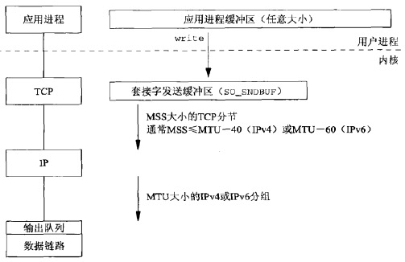
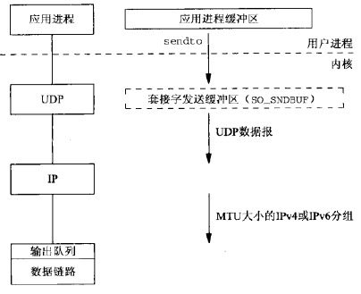

<!-- GFM-TOC -->
* [一.套接字编程简介](#一套接字编程简介)
    * [1.端口号与套接字](#1端口号与套接字)
        * [1.1 端口号](#11-端口号)
        * [1.2 套接字](#12-套接字)
        * [1.3 TCP并发服务器中的套接字对](#13-tcp并发服务器中的套接字对)
    * [2.套接字地址结构](#2套接字地址结构)
        * [2.1 值-结果参数](#21-值-结果参数)
        * [2.2 字节操纵函数](#22-字节操纵函数)
        * [2.3 字节序](#23-字节序)
        * [2.4 地址转换](#24-地址转换)
* [六.I/O复用](#六io复用)
    * [1.select](#1select)
        * [1.1 描述符就绪条件](#11-描述符就绪条件) 
        * [1.2 select的优缺点](#12-select的优缺点)
    * [2.pselect](#2pselect)
    * [3.poll](#3poll)
        * [3.1 事件](#31-事件) 
        * [3.2 poll的优缺点](#32-poll的优缺点) 
    * [4.epoll](#4epoll) 
        * [4.1 工作模式](#41-工作模式) 
        * [4.2 epoll的优缺点](#42-epoll的优缺点)  
* [七.套接字选项](#七套接字选项)
    * [1.获取及设置套接字选项的函数](#1获取及设置套接字选项的函数)
    * [2.套接字选项分类](#2套接字选项分类)
        * [2.1 通用套接字选项](#21-通用套接字选项)
        * [2.2 IPv4套接字选项](#22-ipv4套接字选项)
        * [2.3 IPv6套接字选项](#23-ipv6套接字选项)
        * [2.4 TCP套接字选项](#24-tcp套接字选项)
<!-- GFM-TOC -->


<br>
<br>
<br>

# 一.套接字编程简介

## 1.端口号与套接字

### 1.1 端口号

IANA(因特网已分配数值权威机构)维护着一个端口号分配状况的清单。该清单一度作为RFC多次发布；端口号被划分成3段：

* **众所周知的端口(0\~1023)**：这些端口由IANA分配和控制。可能的话，相同端口号就分配给TCP、UDP和SCTP的同一给定服务。（如，不论TCP还是UDP端口号80都被赋予Web服务器，尽管它目前的所有实现都单纯的使用TCP）
* **已登记的端口(1024\~49151)**：这些端口不受IANA控制，不过由IANA登记并提供它们的使用情况清单，以方便整个群体。可能的话，相同端口号也分配给TCP和UDP的同一给定服务。49151这个上限的引入是为了给临时端口留出范围
* **动态、私用的端口(49152\~65535)**：IANA不管这些端口。就是我们所称的临时端口

<div align="center">  </div>

### 1.2 套接字

一个**TCP套接字对**是一个定义该连接的两个端点的四元组

```
{本地IP,本地TCP端口号,外地IP,外地TCP端口号}
```

**套接字对唯一标识一个网络上的每个TCP连接**

标识每个端点的两个值（IP地址和端口号）通常称为一个套接字

### 1.3 TCP并发服务器中的套接字对

1. **服务器端在21号端口监听，等待来自客户端的连接**

<div align="center">  </div>

使用记号{\*:21,\*:\*}指出服务器的套接字对

* 第一个星号：服务器在任意本地接口的端口21上等待连接请求
* 第二个和第三个星号：等到任意IP，任意端口的连接

2. **主机206.168.112.219上的第一个客户发起一个连接，临时端口1500**：

<div align="center">  </div>

3. **连接建立后，服务器fork一个子进程处理该客户的请求**：

<div align="center">  </div>

4. **主机206.168.112.219上一个新的客户发起一个连接，服务器fork另一个子进程处理新客户的请求（由于临时端口不同，所有和前一个连接不是相同的连接）**：

<div align="center">  </div>

## 2.套接字地址结构

大多数套接字函数都需要一个指向套接字地址结构的指针作为参数。每个协议族都定义了自己的套接字地址结构

**套接字地址结构仅在给定主机上使用：虽然结构中的某些字段用在不同主机之间的通信中，但是结构本身并不在主机之间传递**

<div align="center">  </div>

* **sockaddr_in**
    * IPv4地址和TCP或UDP端口号在套接字地址结构中总是以**网络字节序**来存储
    * POSIX规范只需要这个结构中的下列3个字段
        - sin_family：可以是任何无符号整数类型。在支持长度字段的实现中，通常是8位无符号整数，在不支持长度字段的实现中，则是16位无符号整数
        - sin_addr：in_addr_t必须至少是32位的无符号整数类型
        - sin_port：in_port_t必须至少是16位的无符号整数类型
    * sin_zero字段未曾使用
    * **长度是16**
* **sockaddr_in6**
    * 如果系统支持长度字段，那么SIN6_LEN常值必须定义
    * **长度是28**
* **sockaddr_storage**相比于**sockaddr**的优势：
    - 如果系统支持的任何套接字地址结构有对齐的需要，那么sockaddr_storage能够满足最苛刻的对齐要求
    - sockaddr_storage足够大，能够容纳系统支持的任何套接字地址结构
* **sockaddr_storage**结构中除了上图中的两个字段，其它字段都是透明的，必须强制转换成其它类型套接字地址结构才能访问其它字段

[套接字地址结构所在头文件](https://github.com/arkingc/note/blob/master/%E8%AE%A1%E7%AE%97%E6%9C%BA%E7%BD%91%E7%BB%9C/%E6%8E%A5%E5%8F%A3%E4%B8%8E%E5%A4%B4%E6%96%87%E4%BB%B6.md#%E7%B1%BB%E5%9E%8B)

### 2.1 值-结果参数

**1）从进程到内核传递套接字地址结构**：bind、connect、sendto

<div align="center">  </div>

**2）从内核到进程传递套接字地址结构**：accept、recvfrom、getsockname、getpeername
* **值**：告诉内核该结构的大小，内核在写结构时不至于越界
* **结果**：告诉进程内核在该结构中实际存储了多少信息（如果套接字地址结构是**固定长度**的，那么从内核返回的值总是那个固定长度，如IPv4的sockaddr_in长度是16，IPv6的sockaddr_in6长度是28；对于**可变长度**的套接字地址结构，返回值可能小于结构的最大长度）

<div align="center">  </div>

> 这里只是使用“套接字地址结构的长度”作为例子，来解释“值-结果”参数，还有其它的”值-结果“参数

### 2.2 字节操纵函数

操纵多字节字段的函数有2组：

```c
/***********************************************************************
 *  第一组：起源于4.2BSD，几乎所有现今支持套接字函数的系统仍然提供
 **********************************************************************/
#include <strings.h>
void bzero(void *dest,size_t nbytes);
void bcopy(const void *src,void *dest,size_t nbytes);
int bcmp(const void *ptr1,const void *ptr2,size_t nbytes);

/***********************************************************************
 *  第二组：起源于ANSI C，支持ANSI C函数库的所有系统都提供
 **********************************************************************/
#include <string.h>
void* memset(void *dest,int c,size_t len);
void* memcpy(void *dest,const void *src,size_t nbytes);
int memcmp(const void *ptr1,const void *ptr2,size_t nbytes);
```

* bzero相比于memset只有2个参数
* bcopy能够正确处理源“字节串”与目标“字节串”重叠，memcpy不行（可以用memmove）

>bzero和memset可用于**套接字地址结构**的初始化

### 2.3 字节序

* **小端字节序**：低序字节存储在起始地址
* **大端字节序**：高序字节存储在起始地址

<div align="center">  </div>

* **主机字节序**：某个给定系统所用的字节序
* **网络字节序**：网络协议必须指定一个网络字节序。举例来说，在每个TCP分节中都有16位的端口号和32位的IPv4地址。发送协议栈和接收协议栈必须就这些多字节字段各个字节的传送顺序达成一致（**网际协议使用大端字节序**传送这些多字节整数）

从理论上说，具体实现可以按主机字节序存储套接字地址结构中的各个字段，等到需要在这些字段和协议首部相应字段之间移动时，再在主机字节序和网络字节序之间进行转换，让我们免于操心转换细节。然而由于历史原因和POSIX规范的规定，**套接字地址结构中的某些字段必须按照网络字节序进行维护**

#### 主机字节序与网络字节序的转换函数

```c
#include <netinet/in.h>

/***********************************************
 * 主机字节序 -> 网络字节序
 ***********************************************/
uint16_t htons(uint16_t host16bitvalue);
uint32_t htonl(uint32_t host32bitvalue);

/***********************************************
 * 网络字节序 -> 主机字节序
 ***********************************************/
uint16_t ntohs(uint16_t net16bitvalue);
uint32_t ntohl(uint32_t net32bitvalue);
```

### 2.4 地址转换

有两组函数可以完成**ASCII字符串与网络字节序的二进制值之间网际地址的转换**：

```c
#include<arpa/inet.h>

/********************************************************************
 * 第一组：只支持IPv4；
 *        strptr：指向C字符串，表示点分十进制的地址
 *        addrptr/inaddr：网络字节序二进制值
 *        inet_addr函数：如今已废弃，新代码应该使用inet_aton（该函数出错时，
 *                      返回INADDR_NONE，32位均为1，因此255.255.255.255
 *                      不能由该函数处理）
 *        inet_ntoa函数：参数传入的是结构而不是结构的指针；
 *                      返回值所指字符串在静态区，故函数不可重入
 ********************************************************************/
int inet_aton(const char *strptr,struct in_addr *addrptr);//字符串有效返回1，否则0
int_addr_t inet_addr(const char *strptr);
char* inet_ntoa(struct in_addr inaddr);

 /**************************************************************
 * 第二组：既支持IPv4也支持IPv6；
 *        两个函数的family参数既可以是AF_INET，也可以是AF_INET6。如果
 *        以不被支持的地址族作为family参数，将返回一个错误，并将errno置
 *        为EAFNOSUPPORT；
 *        strptr：指向C字符串，表达式格式
 *        addrptr：网络字节序二进制值，数值格式
 *        len：strptr指向的内存区的大小，防止溢出
 ***************************************************************/
int inet_pton(int family,const char *strptr,void *addrptr);//成功返回1，字符串无效返回0，出错-1
const char* inet_ntop(int family,const void *addrptr,char *strptr,size_t len);
```

<br>

# 六.I/O复用

**I/O复用是一种机制，一个进程可以监视多个描述符，一旦某个描述符就绪（一般是读就绪或写就绪），能够通知程序进行相应的读写操作。**

目前支持I/O复用的系统调用有```select、pselect、poll、epoll```，本质上这些I/O复用技术都是同步I/O，在读写事件就绪后需要进程自己负责进行读写，即读写过程是进程阻塞的

**与多进程和多线程相比，I/O复用技术的最大优势是系统开销小，系统不必创建进程/线程，也不必维护这些进程/线程，从而大大减小了系统的开销**

## 1.select

```c
/********************************************************************
 * 参数：
 *     maxfdp1：指定待测试的描述符个数，值为待测试的最大描述符加1（参数名的由来）
 *     readset：读描述符集
 *     writeset：写描述符集
 *     exceptset：异常描述符集。目前支持的异常条件只有两个
 *         1）某个套接字的带外数据到达
 *         2）某个已设置为分组模式的伪终端存在可从其主端读取的控制状态信息
 *     timeout：(告知)内核等待任意描述符就绪的超时时间，超时函数返回0
 *         1）永远等待下去：设为空指针
 *         2）等待一段固定时间
 *         3）立即返回(轮询)：timeval结构中的时间设为0
 * 描述符集说明：
 *     1）select使用的描述符集，通常是一个整数数组，其中每个整数中的一位对应一个描述符
 *     2）如果对三个描述符集中的某个不感兴趣，可以设为空指针，如果都设为空指针，会得到
 *        一个比Unix的sleep函数更精确的定时器（sleep以秒为最小单位）
 *     3）<sys/select.h>中定义的FD_SETSIZE常值是数据类型fd_set中的描述符总数，其
 *        值通常是1024，不过很少用到这么多描述符，maxfdp1参数迫使我们计算
 * 返回值：
 *     正数：跨所有描述符集的已就绪描述符的“数目”
 *     0：超时
 *     -1：出错
 ********************************************************************/
#include <sys/select.h>
#include <sys/time.h>
int select(int maxfdp1,fd_set *readset,fd_set *writeset,fd_set exceptset,const struct timeval *timeout);

/********************************************************************
 * 设置描述符集
 * 
 * 描述符集是“值-结果“参数，select调用返回时，结果将指示哪些描述符已就绪。函数返回后，使用FD_ISSET宏来测试fd_set数据类型中的描述符。描述符集内任何与未就绪福描述符
 * 对应的位返回时均清为0。因此，每次重新调用select函数时，都得再次把所有描述符集
 * 内所关心的位设置为1
 ********************************************************************/
void FD_ZERO(fd_set *fdset);            //清除fdset的所有位
void FD_SET(int fd,fd_set *fdset);      //打开fdset中的fd位
void FD_CLR(int fd,fd_set *fdset);      //清除fdset中的fd位
int FD_ISSET(int fd,fd_set *fdset);     //检查fdset中的fd位是否置位
```

### 1.1 描述符就绪条件

* **套接字可读**：
    - 套接字接收缓冲区中的数据(字节数)大于等于套接字接收缓冲区**低水位标记**的当前大小
    - 连接的读半部关闭（也就是接收了FIN的TCP连接），对这样的套接字读不会阻塞并返回0(EOF)
    - 监听套接字已完成的连接数不为0。对其accept通常不阻塞
    - 套接字上有一个错误，对其读不会阻塞并返回-1，同时把errno设为确切错误条件
* **套接字可写**：
    - 套接字发送缓冲区中的可用空间(字节数)大于等于套接字发送缓冲区**低水位标记**的当前大小，并且或者该套接字已连接，或者该套接字不需要连接(如UDP套接字)
    - 连接的写半部关闭，对这样的套接字写将产生SIGPIPE信号
    - 使用非阻塞式connect的套接字已建立连接，或者connect以失败告终
    - 套接字上有一个错误，对其写将不会阻塞并返回-1，同时把errno设为确切错误条件
* **套接字有异常条件待处理**

<div align="center">  </div>

> 设置低水位标记
> * 可以使用SO_RCVLOWAT套接字选项设置套接字接收缓冲区低水位标记（对于TCP和UDP，默认值为1）
> * 可以使用SO_SNDLOWAT套接字选项设置套接字发送缓冲区低水位标记（对于TCP和UDP，默认值为2048）

### 1.2 select的优缺点

* **优点**：
    - **跨平台支持好**，目前几乎在所有平台上支持
* **缺点**：
    - **最大的缺点是，进程打开的fd有限**（由FD_SETSIZE和内核决定，一般为1024），这对于连接数量比较大的服务器来说根本不能满足（可以选择多进程的解决方案，虽然Linux上创建进程的代价比较小，但也不可忽视，加上进程间数据同步远比不上线程间同步的效率，所以也不是一直完美的方案）
    - **函数返回后需要轮询描述符集，寻找就绪描述符，效率不高**
    - **用户态和内核态传递描述符结构时copy开销大**

## 2.pselect

```c
/********************************************************************
 * 参数：
 *     maxfd1：指定待测试的描述符个数，值为待测试的最大描述符加1（参数名的由来）
 *     readset：读描述符集
 *     writeset：写描述符集
 *     exceptset：异常描述符集。目前支持的异常条件只有两个
 *         1）某个套接字的带外数据到达
 *         2）某个已设置为分组模式的伪终端存在可从其主端读取的控制状态信息
 *     timeout：(告知)内核等待任意描述符就绪的超时时间，超时函数返回0
 *         1）永远等待下去：设为空指针
 *         2）等待一段固定时间
 *         3）立即返回(轮询)：timeval结构中的时间设为0
 *     sigmask：
 * 返回值：
 *     正数：跨所有描述符集的已就绪描述符的“数目”
 *     0：超时
 *     -1：出错
 ********************************************************************/
#include <sys/select.h>
#include <signal.h>
#include <time.h>
int pselect(int maxfd1,fd_set *readset,fd_set *writeset,fd_set *exceptset,
    const struct timespec *timeout,const sigset_t *sigmask);
```

pselect相对于通常的select有2个变化：

1. **使用timespec结构，而不是timeval结构**。timespec的第二个成员是纳秒级，2而timeval的第二个成员是微妙级
2. **增加了第6个参数：一个指向信号掩码的指针**。该参数运行程序先禁止递交某些信号，再测试由这些当前被禁止信号的信号处理函数设置的全局变量，然后调用pselect，告诉它重新设置信号掩码

## 3.poll

```c
/********************************************************************
 * 参数：
 *     fds：
 *     nfds：读描述符集合
 *     timeout：(告知)内核等待任意描述符就绪的超时时间，超时函数返回0
 *         1）永远等待下去：INFTIM（一个负值）
 *         2）等待一段固定时间：>0
 *         3）立即返回(轮询)：0
 * 返回值：
 *     正数：所有已就绪描述符的“数目”
 *     0：超时
 *     -1：出错
 ********************************************************************/
#include <poll.h>
int poll(struct pollfd *fds,unsigned int nfds,int timeout);

/********************************************************************
 * 如果不再关心某个特定描述符，可以把与之对应的pollfd结构的fd成员设置成一个负值
 * poll函数将忽略这样的pollfd结构的events成员，返回时将其revents成员的值置为0
 ********************************************************************/
struct pollfd{
    int fd;         //监视的描述符
    short events;   //该描述符上监视的事件
    short revents;  //该描述符上发生的事件
};
```

### 3.1 事件

poll中每个描述符有一个监视的事件以及一个发生的事件，在pollfd结构中是类型为short的成员。两个成员中的每一个都由指定某个特定条件的一位或多位构成：

<div align="center">  </div>

* **第一部分是处理输入的4个常值**
* **第二部分是处理输出的3个常值**
* **第三部分是处理错误的3个常值**

对于TCP和UDP而言，以下条件将引起poll返回特定的revent：

* 所有正规TCP数据和所有UDP数据都被认为是**普通数据**
* TCP的带外数据被认为是**优先级带数据**
* TCP连接读半部关闭时（如收到一个来自对端的FIN），被认为是**普通数据**，随后读操作返回0
* TCP连接存在错误既可认为是**普通数据**，也可认为是**错误**。随后的读操作返回-1，并设置error（可用于处理诸如接收到RST或发生超时等条件）
* 在监听套接字上有新连接可用，既可认为是**普通数据**也可认为是**优先级带数据**

### 3.2 poll的优缺点

* **优点**：
    - **没有最大监视描述符数量的限制**：分配一个pollfd结构的数组并把该数组中元素的数目通知内核成了调用者的责任。内核不再需要知道类似fd_set的固定大小的数据类型
* **缺点**：
    - 和select一样，调用返回后需要**轮询所有描述符来获取已经就绪的描述符**
    - **用户态和内核态传递描述符结构时copy开销大**

## 4.epoll

```c
/********************************************************************
 * 创建一个epoll句柄
 * 参数：
 *     size：告诉内核监听的数量，并不是监听数量的最大值，是对内核初始分配内部数
 *           据结构的一个建议
 * 返回值：
 *     创建的epoll句柄
 ********************************************************************/
int epoll_create(int size);

/********************************************************************
 * 对指定描述符fd执行op操作
 * 参数：
 *     epfd：epoll_create得到的epoll句柄
 *     op：操作
 *         1）EPOLL_CTL_ADD：添加
 *         2）EPOLL_CTL_DEL：删除
 *         3）EPOLL_CTL_MOD：修改
 *     fd：需要监听的fd
 *     event：告知内核需要监听的事件
 *         1）EPOLLIN：对应的描述符可读
 *         2）EPOLLOUT：对应的描述符可写
 *         3）EPOLLPRI：对应的描述符有紧急数据可读（带外数据）
 *         4）EPOLLERR：对应的描述符发生错误
 *         5）EPOLLHUP：对应的描述符被挂断
 *         6）EPOLLET：将epoll设为边缘触发模式
 *         7）EPOLLONESHOT：只监听一次事件，监听完后，如果需要再次监听这个socket，
 *                          需要再次把这个socket加入到epoll队列
 * 返回值：
 *     
 ********************************************************************/
int epoll_ctl(int epfd,int op,int fd,struct epoll_event *event);

struct epoll_event{
    __uint32_t events;
    epoll_data_t data;
};

/********************************************************************
 * 等待epoll句柄上的I/O事件，最多返回maxevents个事件
 * 参数：
 *     epfd：epoll_create得到的epoll句柄
 *     events：从内核得到事件的集合
 *     maxevents：返回事件的最大数量（不能大于创建epoll句柄时的size参数）
 *     timeout：超时参数
 *         1）立即返回：0
 *         2）永久阻塞？：-1
 * 返回值：
 *     >0：返回需要处理的事件数目
 *     0：超时
 ********************************************************************/
int epoll_wait(int epfd,struct epoll_event *events,int maxevents,int timeout);
```

### 4.1 工作模式

**epoll对描述符的操作有两种模式，当epoll_wait检测到描述符事件发生时，向应用程序通常此事件**：

* **水平触发(LT)模式(默认)**：
    - 应用程序可以不立即处理该事件。下次调用epoll_wait时，会再次向应用程序通知此事件
    - 支持阻塞或非阻塞套接口
* **边缘触发(ET)模式**：
    - 应用程序必须立即处理该事件。如果不处理，下次调用epoll_wait时，不再向应用程序通知此事件
    - 只支持非阻塞套接口（以免一个文件句柄的阻塞读/阻塞写操作把处理多个文件描述符的任务饿死）

**ET模式在很大程度上减少了epoll事件被重复触发的次数，因此效率要比LT模式高**

### 4.2 epoll的优缺点：

* **优点**
    * **监视的描述符数量不受限制**，所支持的FD上限是最大可以打开文件的数目
    * **I/O效率不会随着监视fd数量的增长而下降**：epoll不同于select和poll轮询的方式，而是通过每个fd定义的回调函数来实现的，只有就绪的fd才会执行回调函数
    * **用户态和内核态消息传递的开销小**：利用mmap()减少复制开销

> 如果没有大量的“idle连接”或“dead连接”，epoll的效率并不会比select/poll高很多
> * 当连接数少并且连接都十分活跃的情况下，select和poll的性能可能比epoll好
> * 当遇到大量的"idle连接"，epoll的效率会大大高于select/poll

<br>

# 七.套接字选项

## 1.获取及设置套接字选项的函数

* **getsockopt和setsockopt函数**
* **fcntl函数**
* **ioctl函数**

#### 1）getsockopt和setsockopt函数

<div align="center">  </div>

* **sockfd**：一个打开的套接字描述符
* **level**：系统中解释选项的代码。或为通用套接字代码，或为某个特定于协议的代码（IPv4、IPv6、TCP或SCTP）
* **optname**：选项名
* **optval**：setsockopt从optval中取得选项待设置的新值，getsockopt则把已获取的选项当前值存放到optval中（给标志选项调用getsockopt函数时，\*optval是一个整数。\*optval中返回的值为0表示相应选项被禁止，不为0表示相应选项被启用；给标志选项调用setsockopt函数需要一个不为0的\*optval值来启用选项，一个为0的\*optval值来禁止选项）
* **optlen**：指明optval所指结构的大小

## 2.套接字选项分类

**套接字选项粗分为两大基本类型**：

* 某个特性相关的**标志选项**
* 可以设置或检查的特定**值选项**

### 2.1 通用套接字选项

这些选项是协议无关的。它们由内核中的协议无关代码处理，而不是由诸如IPv4之类特殊的协议模块处理。不过其中有些选项只能应用到某些特定类型的套接字中。举例来说，尽管SO_BROADCAST套接字选项是“通用”的，它却只能应用于数据报套接字

#### 1）SO_ERROR(可以获取，不能设置)

当一个套接字上发生错误时，源自Berkeley的内核中的协议模块将该套接字的名为so_error的变量设为标准的Unix Exxx值中的一个，称它为套接字的待处理错误。内核会通知进程这个错误。进程然后可以通过该套接字选项获取so_error的值。由getsockopt返回的整数值就是该套接字的待处理错误。so_error随后由内核复位为0

#### 2）SO_KEEPALIVE

设置该选项后，如果2小时（可以通过修改内核来改这个时间）内在该套接字的任一方向上都没有数据交换，TCP就自动给对端发送一个“保持存活探测分节”。对端可以做出3种响应：

1. 以期望的ACK响应。应用进程得不到通知（因为一切正常） 
2. 响应RST分节，告知本端TCP：对端已崩溃且已重新启动。该套接字的待处理错误被置为ECONNRESET，套接字本身则被关闭
3. 没有任何响应（源自Berkeley的TCP将另外发送8个探测分节，两两相隔75s，试图得到一个响应。TCP在发出第一个探测分节后11分15秒内若没有得到任何响应则放弃），该套接字的待处理错误将被置为ETIMEOUT，套接字本身则被关闭；如果套接字收到一个ICMP错误作为某个探测分节的响应，那就返回相应的错误，套接字本身也被关闭（这种情形下一个场景ICMP错误是目的主机不得达，待处理错误会被置为EHOSTUNREACH）

#### 3）SO_LINGER

**该选项指定close函数对面向连接的协议如何操作**。默认操作是close函数立即返回，但是如果有数据残留在套接字发送缓冲区中，系统将试着把这些数据发送给对端。SO_LINGER套接字选项使得我们可以改变这个默认设置

选项要求在用户进程与内核间传递如下结构：

```c++
//头文件：<sys/socket.h>
struct linger{
	int l_onoff;   /* 0=off, nozero=on */
	int l_linger;  /* 延滞时间，POSIX指定单位为s */
};
```

对setsockopt的调用将根据其中两个结构成员的值形成下列3种情况之一：

1. **l_onoff为0**：此时l_linger值会被忽略。关闭该选项，默认设置生效，即close立即返回（**图7.7**）
2. **l_onoff非0，且l_linger为0**：TCP将终止连接，丢弃保留在套接字发送缓冲区中的任何数据，并发送一个RST给对端，而没有通常的四分组连接终止序列，这么一来避免了TIME_WAIT状态，然而存在以下可能性：在2MSL秒内创建该连接的另一个化身，导致来自刚被终止的连接上的旧的重复分节被不正确地传送到新的化身上
3. **l_onoff非0，且l_linger非0**：当套接字关闭时，内核将拖延一段时间。如果在套接字发送缓冲区中仍残留有数据，那么进程将投入睡眠，直到 a）所有数据都已经发送完且均被对方确认；b）延滞时间到；（如果套接字被设置为非阻塞，那么将不等待close完成，即使延滞时间非0也是如此）当使用SO_LINGER选项的这个特性时，应用进程检查close的返回值是非常重要的，因为如果在数据发送完并被确认前延滞时间到的话，close将返回EWOULDBLOCK错误，且套接字发送缓冲区中的任何残留数据都被丢弃。这种组合可能存在下列几种情况：
	* close直到数据和FIN已被服务器主机的TCP确认后才返回（问题是，在服务器应用进程读剩余数据之前，服务器主机可能崩溃，并且客户应用进程永远不会知道。因此，close成功返回只是告诉我们先前发送的数据(和FIN)已由对端TCP确认，而不能告诉我们对端应用进程是否已读取数据）（**图7.8**）
	* 延滞时间偏低，在接收到服务器主机的TCP确认前close返回（**图7.9**）

<div align="center">  </div>

让客户知道服务器已读取其数据的一个方法是改为调用shutdown(并设置它的第二个参数为SHUT_WR)而不是调用close，并等待对端close连接的服务器端：

<div align="center">  </div>

下图汇总了对shutdown的两种可能调用和对close的三种可能调用，以及它们对TCP套接字的影响：

<div align="center">  </div>

#### 4）SO_RCVBUF和SO_SNDBUF

每个套接字都有一个发送缓冲区和一个接收缓冲区。这两个套接字选项允许我们改变这两个缓冲区的大小

* **TCP的流量控制**：对于TCP来说，套接字接收缓冲区中可用空间的大小限定了TCP通告对端的窗口大小。TCP套接字接收缓冲区不可能溢出，因为不允许对端发出超过本端所通告窗口大小的数据。如果对端无视窗口大小而发出了超过该窗口大小的数据，本端TCP将丢弃它们

<div align="center">  </div>

* 对于UDP来说，当接收到的数据报装不进套接字接收缓冲区时，该数据报就被丢弃。UDP是没有流量控制的：较快的发送端可以很容易地淹没较慢的接收端，导致接收端的UDP丢弃数据报，事实上较快的发送端甚至可以淹没本机的网络接口，导致数据报被本机丢弃

<div align="center">  </div>

### 2.2 IPv4套接字选项

### 2.3 IPv6套接字选项

### 2.4 TCP套接字选项