|基本套接字编程|高级套接字编程|附录|
|:--:|:--:|:--:|
|[一.套接字编程简介](#ch1)<br>[二.基本TCP套接字编程](#ch2)<br>[三.基本UDP套接字编程](#ch3)<br>[四.I/O复用](#ch4)<br>[五.套接字选项](#ch5)<br>[六.名字与数值转换](#ch6)|[七.高级I/O函数](#ch7)<br>[八.Unix域协议](#ch8)<br>[九.非阻塞式I/O](#ch9)<br>[十.线程](#ch10)<br>[十一.客户/服务器程序设计范式](#ch11)|[TCP回射服务器程序](#fl1)<br>[UDP回射服务器程序](#fl2)<br>[类型与头文件映射表](#fl3)<br>[函数与头文件映射表](#fl4)|

<br>
<br>

<h2 id="ch1"></h2>

* [一.套接字编程简介](#一套接字编程简介)
    * [1.端口号与套接字](#1端口号与套接字)
        * [1.1 端口号](#11-端口号)
        * [1.2 套接字](#12-套接字)
        * [1.3 TCP并发服务器中的套接字对](#13-tcp并发服务器中的套接字对)
    * [2.套接字地址结构](#2套接字地址结构)
        * [2.1 值-结果参数](#21-值-结果参数)
        * [2.2 字节操纵函数](#22-字节操纵函数)
        * [2.3 字节序](#23-字节序)
            - htons和htonl（主机字节序 -> 网络字节序）
            - ntohs和ntohl（网络字节序 -> 主机字节序）
        * [2.4 地址转换](#24-地址转换)
            - 只支持IPV4：
                + inet_aton和inet_addr（ASCII地址 -> 对应网络字节序）
                + inet_ntoa（网络字节序 -> 对应的ASCII地址）
            - 既支持IPV4也支持IPV6：
                + inet_pton（ASCII地址 -> 对应网络字节序）
                + inet_ntop（网络字节序 -> 对应的ASCII地址）

<h2 id="ch2"></h2>

* [二.基本TCP套接字编程](#二基本tcp套接字编程) 
    * [1.连接管理](#1连接管理)
    * [2.缓冲区](#2缓冲区)
    * [3.相关函数](#3相关函数)
        - 1）[socket](#1socket函数)
        - 2）[connect](#2connect函数)
        - 3）[bind](#3bind函数)
        - 4）[listen](#4listen函数)
        - 5）[accept](#5accept函数)
        - 6）[close](#6close函数)
        - 7）[shutdown](#7shutdown函数)
        - 8）[getsockname和getpeername](#8getsockname和getpeername函数)

<h2 id="ch3"></h2>

* [三.基本UDP套接字编程](#三基本udp套接字编程)
    * [1.缓冲区](#1缓冲区)
    * [2.相关函数](#2相关函数)
        - 1）[recvfrom和sendto](#1recvfrom与sendto函数)
        - 2）[connect](#2连接的udp套接字)

<h2 id="ch4"></h2>

* [四.I/O复用](#四io复用)
    * [1.select](#1select)
        * [1.1 描述符就绪条件](#11-描述符就绪条件) 
        * [1.2 select的优缺点](#12-select的优缺点)
        * [1.3 使用select实现TCP回射服务器](#13-使用select实现tcp回射服务器)
    * [2.pselect](#2pselect)
    * [3.poll](#3poll)
        * [3.1 事件](#31-事件) 
        * [3.2 poll的优缺点](#32-poll的优缺点) 
    * [4.epoll](#4epoll) 
        * [4.1 工作模式](#41-工作模式) 
        * [4.2 epoll的优缺点](#42-epoll的优缺点)

<h2 id="ch5"></h2>

* [五.套接字选项](#五套接字选项)
    * [1.获取及设置套接字选项的函数](#1获取及设置套接字选项的函数)
        - 1）[getsockopt和setsockopt](#1getsockopt和setsockopt函数)（设置或获取套接字选项）
        - 2）[fcntl](#2fcntl函数)（设置或获取影响套接字描述符的标志）
        - 3）ioctl
    * [2.套接字选项分类](#2套接字选项分类)
        * [2.1 通用套接字选项](#21-通用套接字选项)
            - 1）[SO_ERROR](#1so_error可以获取不能设置)
            - 2）[SO_KEEPALIVE](#2so_keepalive)
            - 3）[SO_LINGER](#3so_linger)
            - 4）[SO_RCVBUF和SO_SNDBUF](#4so_rcvbuf和so_sndbuf)
            - 5）[SO_RCVLOWAT和SO_SNDLOWAT](#5so_rcvlowat和so_sndlowat)
            - 6）[SO_REUSEADDR和SO_REUSEPORT](#6so_reuseaddr和so_reuseport)
        * [2.2 TCP套接字选项](#22-tcp套接字选项)
            - 1）[TCP_MAXSEG](#1tcp_maxseg)
            - 2）[TCP_NODELAY](#2tcp_nodelay)

<h2 id="ch6"></h2>

* [六.名字与数值转换](#六名字与数值转换)
    * [1.主机名字与IP地址之间的转换](#1主机名字与ip地址之间的转换)
        - 1）[gethostbyname](#1gethostbyname函数)（IPV4）
        - 2）[gethostbyaddr](#2gethostbyaddr函数)（IPV4）
    * [2.服务名字与端口号之间的转换](#2服务名字与端口号之间的转换)
        - 1）[getservbyname](#1getservbyname函数)
        - 2）[getservbyport](#2getservbyport函数)
    * [3.主机与服务名字转IP地址与端口号](#3主机与服务名字转ip地址与端口号)
        - 1）[getaddrinfo与freeaddrinfo](#1getaddrinfo函数)（协议无关）
        - getaddrinfo的封装函数：
            + 2）[host_serv](#2host_serv函数)
            + 3）[tcp_connect](#3tcp_connect函数)
            + 4）[tcp_listen](#4tcp_listen函数)
            + 5）[udp_client](#5udp_client函数)
            + 6）[udp_connect](#6udp_connect函数)
            + 7）[udp_server](#7udp_server函数)
    * [4.IP地址与端口号转主机与服务名字](#4ip地址与端口号转主机与服务名字)
        - 1）[getnameinfo](#getnameinfo函数)
    * [5.其它网络相关信息](#5其它网络相关信息)
        - 1）getXXXent
        - 2）setXXXent
        - 3）endXXXent

<h2 id="ch7"></h2>

* [七.高级I/O函数](#七高级io函数)
    * [1.套接字超时](#1套接字超时) 
    * [2.排队的数据量](#2排队的数据量)
    * [3.Unix I/O函数](#3unix-io函数)
        - 1）[recv和send](#1recv和send函数)
        - 2）[readv和writev](#2readv和writev函数)
        - 3）[recvmsg和sendmsg](#3recvmsg和sendmsg函数)
        - [5组I/O函数的对比](#5组io函数的对比)
    * [4.标准I/O函数](#4标准io函数)

<h2 id="ch8"></h2>

* [八.Unix域协议](#八unix域协议)
    * [1.Unix域套接字地址结构](#1unix域套接字地址结构)
    * [2.相关函数](#1socketpair函数)
        - 1）[socketpair](#1socketpair函数)
    * [3.描述符传递](#3描述符传递)

<h2 id="ch9"></h2>

* [九.非阻塞式I/O](#九非阻塞式io)
    * [1.非阻塞读和写](#1非阻塞读和写)
    * [2.非阻塞connect](#2非阻塞connect)
    * [3.非阻塞accept](#3非阻塞accept)

<h2 id="ch10"></h2>

* [十.线程](#十线程)
    * [1.相关函数](#1相关函数)
        - 1）[pthread_create函数](#1pthread_create函数)
        - 2）[pthread_join函数](#2pthread_join函数)
        - 3）[pthread_self函数](#3pthread_self函数)
        - 4）[pthread_detach函数](#4pthread_detach函数)
        - 5）[pthread_exit函数](#5pthread_exit函数)
        - 6）[pthread_equal函数](#6pthread_equal函数)
        - 7）[pthread_cancel函数](#7pthread_cancel函数)
        - 8）[pthread_cleanup_push和pthread_cleanup_pop函数](#8pthread_cleanup_push和pthread_cleanup_pop函数)
    * [2.线程安全的函数](#2线程安全的函数)
    * [3.线程特定数据](#3线程特定数据)
        - 1）[pthread_once和pthread_key_create函数](#1pthread_once和pthread_key_create函数)
        - 2）[pthread_getspecific和pthread_setspecific函数](#2pthread_getspecific和pthread_setspecific函数)
        - 3）[pthread_key_delete函数](#3pthread_key_delete函数)
    * [4.互斥锁](#4互斥锁)
    * [5.条件变量](#5条件变量)

<br>
<br>
<br>
<br>

# 一.套接字编程简介

## 1.端口号与套接字

### 1.1 端口号

IANA(因特网已分配数值权威机构)维护着一个端口号分配状况的清单。该清单一度作为RFC多次发布；端口号被划分成3段：

* **众所周知的端口(0\~1023)**：这些端口由IANA分配和控制。可能的话，相同端口号就分配给TCP、UDP和SCTP的同一给定服务。（如，不论TCP还是UDP端口号80都被赋予Web服务器，尽管它目前的所有实现都单纯的使用TCP）
* **已登记的端口(1024\~49151)**：这些端口不受IANA控制，不过由IANA登记并提供它们的使用情况清单，以方便整个群体。可能的话，相同端口号也分配给TCP和UDP的同一给定服务。49151这个上限的引入是为了给临时端口留出范围
* **动态、私用的端口(49152\~65535)**：IANA不管这些端口。就是我们所称的临时端口

<div align="center"> 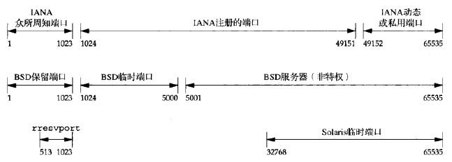 </div>

### 1.2 套接字

一个**TCP套接字对**是一个定义该连接的两个端点的四元组

```
{本地IP,本地TCP端口号,外地IP,外地TCP端口号}
```

**套接字对唯一标识一个网络上的每个TCP连接**

标识每个端点的两个值（IP地址和端口号）通常称为一个套接字

### 1.3 TCP并发服务器中的套接字对

1. **服务器端在21号端口监听，等待来自客户端的连接**

<div align="center"> 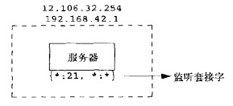 </div>

使用记号{\*:21,\*:\*}指出服务器的套接字对

* 第一个星号：服务器在任意本地接口的端口21上等待连接请求
* 第二个和第三个星号：等到任意IP，任意端口的连接

2. **主机206.168.112.219上的第一个客户发起一个连接，临时端口1500**：

<div align="center"> 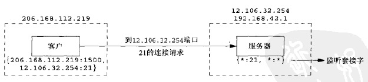 </div>

3. **连接建立后，服务器fork一个子进程处理该客户的请求**：

<div align="center"> 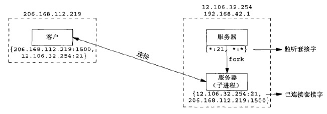 </div>

4. **主机206.168.112.219上一个新的客户发起一个连接，服务器fork另一个子进程处理新客户的请求（由于临时端口不同，所有和前一个连接不是相同的连接）**：

<div align="center">  </div>

## 2.套接字地址结构

大多数套接字函数都需要一个指向套接字地址结构的指针作为参数。每个协议族都定义了自己的套接字地址结构

**套接字地址结构仅在给定主机上使用：虽然结构中的某些字段用在不同主机之间的通信中，但是结构本身并不在主机之间传递**

<div align="center">  </div>

* **sockaddr_in**
    * IPv4地址和TCP或UDP端口号在套接字地址结构中总是以**网络字节序**来存储
    * POSIX规范只需要这个结构中的下列3个字段
        - sin_family：可以是任何无符号整数类型。在支持长度字段的实现中，通常是8位无符号整数，在不支持长度字段的实现中，则是16位无符号整数
        - sin_addr：in_addr_t必须至少是32位的无符号整数类型
        - sin_port：in_port_t必须至少是16位的无符号整数类型
    * sin_zero字段未曾使用
    * **长度是16**
* **sockaddr_in6**
    * 如果系统支持长度字段，那么SIN6_LEN常值必须定义
    * **长度是28**
* **sockaddr_storage**相比于**sockaddr**的优势：
    - 如果系统支持的任何套接字地址结构有对齐的需要，那么sockaddr_storage能够满足最苛刻的对齐要求
    - sockaddr_storage足够大，能够容纳系统支持的任何套接字地址结构
* **sockaddr_storage**结构中除了上图中的两个字段，其它字段都是透明的，必须强制转换成其它类型套接字地址结构才能访问其它字段

[套接字地址结构所在头文件](#fl3)

### 2.1 值-结果参数

**1）从进程到内核传递套接字地址结构**：bind、connect、sendto

<div align="center"> 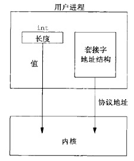 </div>

**2）从内核到进程传递套接字地址结构**：accept、recvfrom、getsockname、getpeername
* **值**：告诉内核该结构的大小，内核在写结构时不至于越界
* **结果**：告诉进程内核在该结构中实际存储了多少信息（如果套接字地址结构是**固定长度**的，那么从内核返回的值总是那个固定长度，如IPv4的sockaddr_in长度是16，IPv6的sockaddr_in6长度是28；对于**可变长度**的套接字地址结构，返回值可能小于结构的最大长度）

<div align="center"> 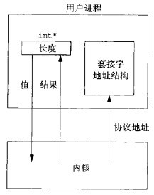 </div>

> 这里只是使用“套接字地址结构的长度”作为例子，来解释“值-结果”参数，还有其它的”值-结果“参数

### 2.2 字节操纵函数

操纵多字节字段的函数有2组：

```c
/***********************************************************************
 *  第一组：起源于4.2BSD，几乎所有现今支持套接字函数的系统仍然提供
 **********************************************************************/
#include <strings.h>
void bzero(void *dest,size_t nbytes);
void bcopy(const void *src,void *dest,size_t nbytes);
int bcmp(const void *ptr1,const void *ptr2,size_t nbytes);

/***********************************************************************
 *  第二组：起源于ANSI C，支持ANSI C函数库的所有系统都提供
 **********************************************************************/
#include <string.h>
void* memset(void *dest,int c,size_t len);
void* memcpy(void *dest,const void *src,size_t nbytes);
int memcmp(const void *ptr1,const void *ptr2,size_t nbytes);
```

* bzero相比于memset只有2个参数
* bcopy能够正确处理源“字节串”与目标“字节串”重叠，memcpy不行（可以用memmove）

>bzero和memset可用于**套接字地址结构**的初始化

### 2.3 字节序

* **小端字节序**：高序字节存储在高地址，低序字节存储在低地址
* **大端字节序**：高序字节存储在低地址，低序字节存储在高地址

<div align="center"> 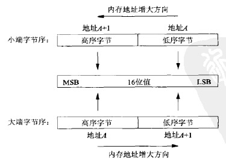 </div>

* **主机字节序**：某个给定系统所用的字节序
* **网络字节序**：网络协议必须指定一个网络字节序。举例来说，在每个TCP分节中都有16位的端口号和32位的IPv4地址。发送协议栈和接收协议栈必须就这些多字节字段各个字节的传送顺序达成一致（**网际协议使用大端字节序**传送这些多字节整数）

从理论上说，具体实现可以按主机字节序存储套接字地址结构中的各个字段，等到需要在这些字段和协议首部相应字段之间移动时，再在主机字节序和网络字节序之间进行转换，让我们免于操心转换细节。然而由于历史原因和POSIX规范的规定，**套接字地址结构中的某些字段必须按照网络字节序进行维护**

#### 主机字节序与网络字节序的转换函数

```c
#include <netinet/in.h>

/***********************************************
 * 主机字节序 -> 网络字节序
 ***********************************************/
uint16_t htons(uint16_t host16bitvalue);
uint32_t htonl(uint32_t host32bitvalue);

/***********************************************
 * 网络字节序 -> 主机字节序
 ***********************************************/
uint16_t ntohs(uint16_t net16bitvalue);
uint32_t ntohl(uint32_t net32bitvalue);
```

### 2.4 地址转换

有两组函数可以完成**ASCII字符串与网络字节序的二进制值之间的转换**：

```c
#include<arpa/inet.h>

/********************************************************************
 * 第一组：只支持IPv4；
 *        strptr：指向C字符串，表示点分十进制的地址
 *        addrptr/inaddr：网络字节序二进制值
 *        inet_addr函数：如今已废弃，新代码应该使用inet_aton（该函数出错时，
 *                      返回INADDR_NONE，32位均为1，因此255.255.255.255
 *                      不能由该函数处理）
 *        inet_ntoa函数：参数传入的是结构而不是结构的指针；
 *                      返回值所指字符串在静态区，故函数不可重入
 ********************************************************************/
int inet_aton(const char *strptr,struct in_addr *addrptr);//字符串有效返回1，否则0
int_addr_t inet_addr(const char *strptr);
char* inet_ntoa(struct in_addr inaddr);

 /**************************************************************
 * 第二组：既支持IPv4也支持IPv6；
 *        两个函数的family参数既可以是AF_INET，也可以是AF_INET6。如果
 *        以不被支持的地址族作为family参数，将返回一个错误，并将errno置
 *        为EAFNOSUPPORT；
 *        strptr：指向C字符串，表达式格式
 *        addrptr：网络字节序二进制值，数值格式
 *        len：strptr指向的内存区的大小，防止溢出
 ***************************************************************/
int inet_pton(int family,const char *strptr,void *addrptr);//成功返回1，字符串无效返回0，出错-1
const char* inet_ntop(int family,const void *addrptr,char *strptr,size_t len);
```

<br>
<br>

# 二.基本TCP套接字编程

<div align="center"> 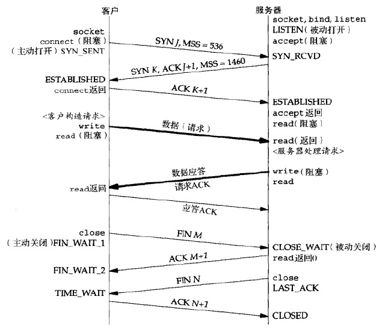 </div>

TCP提供了可靠传输，当TCP向另一端发送数据时，要求对端返回一个确认。如果没有收到确认，TCP就重传数据并等待更长时间。在数次重传失败后，TCP才放弃，如此在尝试发送数据上所花的总时间一般为4~10分钟（依赖于具体实现）

在上图中，服务器对客户端请求的确认伴随其应答一起发送给客户端，即**捎带**（通常在服务器处理请求并产生应答的时间少于200ms时发生。如果服务器耗用更长时间，譬如说1s，那么会先确认然后应答）

> 如果类似上图这样，连接的整个目的仅仅是发送一个单分节的请求和接收一个单分节的应答，那么使用TCP有8个分节的开销。如果改用UDP，那么只需交换两个分组：一个承载请求，一个承载应答。然后从TCP切换到UDP将丧失TCP提供给应用进程的全部可靠性，迫使可靠服务的一大堆细节从(TCP)传输层转移到(UDP)应用进程。TCP提供的拥塞控制也必须由UDP应用进程来处理

## 1.连接管理

连接建立的前2次握手中，每一个SYN可以包含多个TCP选项：

* [MSS选项](#1tcp_maxseg)：向对端通告**最大分节大小**，即MSS，也就是愿意接收的最大数据量。发送端TCP使用接收端的MSS值作为所发送分节的最大大小（可以通过TCP_MAXSEG套接字选项提取和设置）
* [窗口规模选项](#4so_rcvbuf和so_sndbuf)：TCP首部中接收窗口首部为16位，意味着能通告对端的最大窗口大小是65535。然而这个值现今已不够用，窗口规模选项用于指定TCP首部中接收窗口必须扩大(即左移)的位数(0~14)，因此所提供的最大窗口接近1GB(65535x2^14)（**使用前提是两个端系统都支持该选项**）

## 2.缓冲区

每一个TCP套接字有一个发送缓冲区，可以使用SO_SNDBUF套接字选项更改该缓冲区的大小。当某个进程调用write时，内核从该应用进程的缓冲区中复制所有数据到所写套接字的发送缓冲区

<div align="center"> 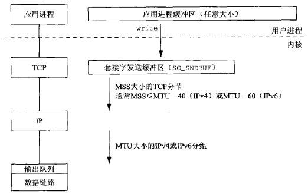 </div>

如果该套接字的发送缓冲区容不下该应用进程的所有数据（或是应用进程的缓冲区大于套接字的发送缓冲区，或者套接字的发送缓冲区中已有其他数据），该应用进程将被投入睡眠（这里假设是默认情况下，默认情况下套接字是阻塞的）。内核将不从write系统调用返回，直到应用进程缓冲区中的所有数据都复制到套接字发送缓冲区。因此，**从写一个TCP套接字的write调用成功返回仅仅表示我们可以重新使用原来的应用进程缓冲区，并不表明对端的TCP或应用进程已接收到数据**

TCP套接字提取发送缓冲区中的数据并把它发给对端TCP，对端TCP必须确认收到的数据，**伴随来自对端的ACK的不断到达，本端TCP至此才能从套接字发送缓冲区中丢弃已确认的数据。TCP必须为已发送的数据保留一个副本，直到它被对端确认为止**

MSS的目的之一就是试图避免分片，较新的实现还使用了路径MTU发现功能。每个数据链路都有一个输出队列，如果队列已满，那么新到的分组将被丢弃，并沿协议栈向上返回一个错误：从数据链路到IP，再从IP到TCP。TCP将注意到这个错误，并在以后某个时刻重传相应的分节。应用进程并不知道这种暂时的情况

### 1）低水位标记

* **接收**缓冲区低水位标记：控制当接收缓冲区中有多少数据时，可以从缓冲区读取数据
* **发送**缓冲区低水位标记：控制当发送缓冲区中有多少可用空间时，可以向缓冲区写数据

### 2）设置低水位标记

* 可以使用SO_RCVLOWAT套接字选项设置套接字**接收**缓冲区低水位标记（对于TCP和UDP，默认值为1）
* 可以使用SO_SNDLOWAT套接字选项设置套接字**发送**缓冲区低水位标记（对于TCP和UDP，默认值为2048）

## 3.相关函数

### 1）socket函数

<div align="center"> 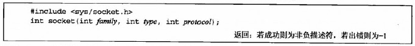 </div>

* **family**：指定协议族，也往往被称为协议域

<div align="center"> 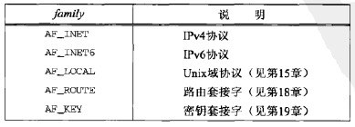 </div>

* **type**：指明套接字的类型

<div align="center"> 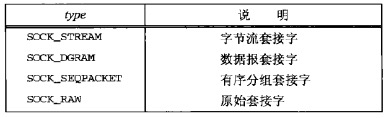 </div>

* **protocol**：协议类型常值。设为0的话表示选择所给定family和type组合的系统默认值

<div align="center"> 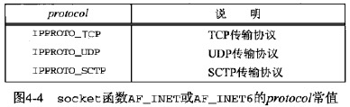 </div>

family和type的有效组合如下：

<div align="center"> 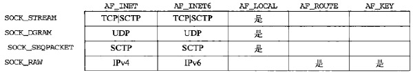 </div>

### 2）connect函数

<div align="center"> 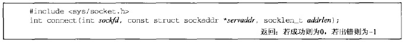 </div>

* **sockfd**：客户端套接字描述符
* **servaddr**：包含服务器IP地址和端口号的套接字地址结构
* **addrlen**：套接字地址结构的大小

**调用connect前不必非得调用bind，如果没有bind，内核会确定源IP并选择一个临时端口作为源端口**

如果是TCP套接字，调用**connect将激发TCP三路握手过程**，函数会阻塞进程，直到成功或出错才返回。出错可能有下列情况：

1. **返回ETIMEDOUT错误**：以4.4BSD为例，内核会先发送一个SYN，若无响应则等待6s后再发送一个，若仍无响应则等待24s后再发送一个。若总共等待了75s后仍未收到响应则返回该错误
2. **返回ECONNREFUSED错误**：服务器对客户响应一个RST，表明服务器在客户指定的端口上没有进程在等待与之连接（除此之外，产生RST还有两个条件：1）TCP想取消一个已有连接；2）TCP接收到一个根本不存在的连接上的分节）
3. **返回EHOSTUNREACH或ENETUNREACH错误**：客户发出的SYN在中间的某个路由引发一个“目的地
不可达”ICMP错误，内核会报错该消息，并按情况1中的间隔继续发送SYN，若在规定时间内仍未收到响应，则把报错的信息作为这两种错误之一返回给进程

**connect失败则该套接字不可再用，必须关闭，不能对这样的套接字再次调用connect函数。必须close后重新调用socket**

### 3）bind函数

bind把一个本地协议地址赋予一个套接字

<div align="center"> 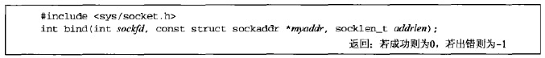 </div>

调用bind可以指定IP地址或端口，可以两者都指定，也可以都不指定：

<div align="center"> 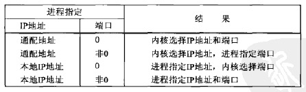 </div>

* 如果指定端口号为0，内核在bind被调用时选择一个临时端口
* 如果指定IP地址为通配地址（对IPv4来说，通配地址由常值INADDR_ANY来指定，值一般为0），内核将等到套接字已连接(TCP)或已在套接字上发出数据报(UDP)时才选择一个本地IP地址

**如果让内核来为套接字选择一个临时端口号，函数bind并不返回所选择的值。第二个参数有const限定词，它无法返回所选的值。如果想得到内核所选择的临时端口值，必须调用getsockname函数**

bind返回的一个常见错误是EADDRINUSE("Address already in use")

### 4）listen函数

listen做2件事：

* 当socket创建一个套接字时，套接字被假设为一个主动套接字，listen将其转成一个被动套接字，指示内核应接受指向该套接字的连接请求
* **第二个参数规定了内核应为相应套接字排队的最大连接个数**

<div align="center"> 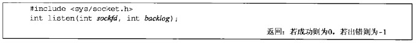 </div>

内核为任一给定的监听套接字维护两个队列，两个队列之和不超过backlog：

* **未完成连接队列**
* **已完成连接队列**

<div align="center"> 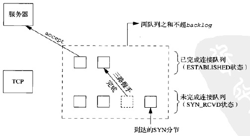 </div>

当进程调用accept时，如果已连接队列不为空，那么队头项将返回给进程，否则进程将投入睡眠，直到TCP在该队列中放入一项才唤醒它

不要把backlog指定为0，因为不同的实现对此有不同的解释。如果不想让任何客户连接到监听套接字上，那就关掉该监听套接字

设置backlog的一种方法是使用一个常值，但是增大其大小需要重新编译服务器程序；另一种方法是通过读取一个环境变量来设置该值，该环境变量具有一个默认值；（如果设定的backlog比内核支持的值要大，那么内核会悄然把所指定的偏大值截成自身支持的最大值）

**SYN到达时，如果队列已满，TCP忽略该SYN分节**：这么做是因为这种情况是暂时的，这种处理方式希望通过重传机制，在客户端下一次重传时，队列中已经存在可用空间。如果服务器立即响应RST，客户的connect调用就会立即返回一个错误，强制应用程序处理这种情况。另外，客户也无法区分RST是意味着“该端口没有服务器在监听”还是意味着“队列已满”

### 5）accept函数

accept用于从已完成连接队列队头返回下一个已完成连接，如果已完成连接队列为空，那么进程被投入睡眠

<div align="center"> 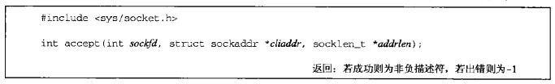 </div>

* **sockfd**：监听套接字描述符
* **cliaddr**：已连接的对端客户的套接字地址结构
* **addrlen**：调用时指示内核能向cliaddr写入的最大字节数，返回时内核指明实际写入的字节数

如果对返回客户协议地址不感兴趣，可以把cliaddr和addrlen均置为空指针

### 6）close函数

<div align="center"> 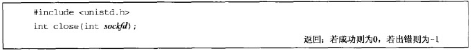 </div>

close一个TCP套接字的默认行为是把套接字标记为关闭，立即返回调用进程，然后TCP将尝试发送已排队等待发送到对端的任何数据，发送完毕后是正常的TCP连接终止序列

close会将套接字描述符的引用计数减1，如果引用计数仍大于0，则不会引起TCP的四次挥手终止序列

### 7）shutdown函数

<div align="center"> 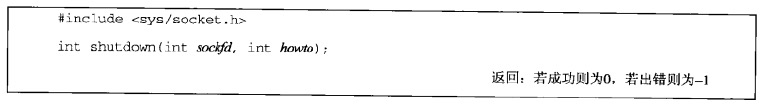 </div>

* **howto**
    - `SHUT_RD`：**关闭连接的读这一半**，套接字接收缓冲区中的现有数据都被丢弃。进程不能再对这样的套接字调用任何读函数（对一个TCP套接字这样调用shutdown函数后，由该套接字接收的来自对端的任何数据都被确认，然后悄然丢弃）
    - `SHUT_WR`：**关闭连接的写这一半**（**对于TCP，称为半关闭**），套接字发送缓冲区中的数据将被发送掉，后跟TCP的正常连接终止序列。进程不能再对这样的套接字调用任何写函数
    - `SHUT_RDWR`：**连接的读半部和写半部都关闭**。等价于调用2次shutdown，分别指定SHUT_RD与SHUT_WR

**shutdown与close的区别**：

1. **关闭套接字的时机不同**
    * close把描述符的引用计数减1，仅在该计数变为0时才关闭套接字
    * shutdown不管引用计数就能激发TCP的正常连接终止序列
2. **全关闭与半关闭**
    * close终止读和写两个方向的数据传送
    * shutdown可以只关闭一个方向的数据传送（具体见上面的howto参数）

### 8）getsockname和getpeername函数

这两个函数与TCP连接建立过程中套接字地址结构的信息获取相关

<div align="center"> 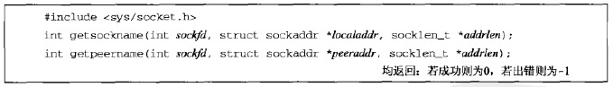 </div>

* **getsockname用于返回与某个套接字关联的本地协议地址**：
    - 没调用bind的TCP客户上，connect返回后，获取由内核赋予该连接的本地IP地址和端口号
    - 以端口号0调用bind后，获取由内核赋予的本地端口号
    - 获取某个套接字的地址族
    - 绑定通配IP的服务器上，accept返回后，获取由内核赋予该连接的本地IP地址，此时sockfd不是监听套接字描述符
* **getpeername用于返回与某个套接字关联的外地协议地址**：
    - 当一个服务器是由调用过accept的某个进程通过调用exec执行程序时，它能获取客户身份的唯一途径便是调用getpeername。例如inetd fork并exec某个TCP服务器程序：

<div align="center"> 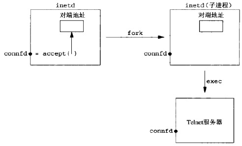 </div>

<br>
<br>

# 三.基本UDP套接字编程

典型的UDP客户/服务器程序的函数调用：

<div align="center"> 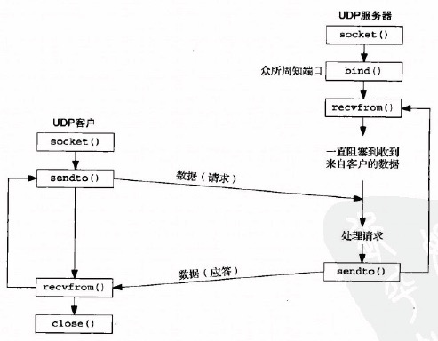 </div>

## 1.缓冲区

发送缓冲区用虚线表示，因为实际上并不存在。任何UDP套接字都有发送缓冲区大小（同样可以使用SO_SNDBUF套接字选项更改），不过**该缓冲区仅表示能写到该套接字的UDP数据报的大小上限**。如果应用进程写一个大于套接字发送缓冲区大小的数据报，内核将返回该进程一个EMSGSIZE错误。

<div align="center"> 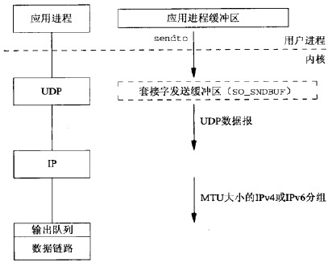 </div>

因为UDP是不可靠的，不必保存应用进程数据的一个副本，所以不需一个真正的发送缓冲区。（应用进程的数据在沿协议栈向下传递时，通常被复制到某种格式的一个内核缓冲区中，然而当该数据被发送之后，这个副本就被数据链路层丢弃了）

如果某个UDP应用进程发送大数据报，那么它们相比TCP应用数据更有可能被分片，因为TCP会把应用数据划分成MSS大小的块，而UDP却没有对等的手段

从写一个UDP套接字的write调用成功返回，表示所写的数据报或其所有片段已被加入数据链路层的输出队列。如果该队列没有足够的空间存放该数据报或它的某个片段，内核通常会返回一个ENOBUFS错误给它的应用进程（不幸的是，有些UDP的实现不返回这种错误，这样甚至数据报未经发送就被丢弃的情况应用进程也不知道）

### 1）低水位标记

* **接收**缓冲区低水位标记：控制当接收缓冲区中有多少数据时，可以从缓冲区读取数据
* **发送**缓冲区低水位标记：控制当发送缓冲区中有多少可用空间时，可以向缓冲区写数据

### 2）设置低水位标记

* 可以使用SO_RCVLOWAT套接字选项设置套接字**接收**缓冲区低水位标记（对于TCP和UDP，默认值为1）
* 可以使用SO_SNDLOWAT套接字选项设置套接字**发送**缓冲区低水位标记（对于TCP和UDP，默认值为2048）

## 2.相关函数

### 1）recvfrom与sendto函数

<div align="center"> 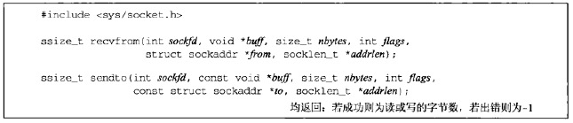 </div>

* **recvfrom**：
    - **from**：指向一个将由该函数在返回时填写数据报发送者的协议地址的套接字地址结构
    - **addrlen(指针)**：在from指向的套接字地址结构中填写的字节数
* **sendto**：
    - **to**：指向一个含有数据报接收者的协议地址的套接字地址结构
    - **addrlen(整数)**：指定to指向的套接字地址结构的大小

**recvfrom的from参数可以是一个空指针，此时addrlen也必须是一个空指针，表示并不关心数据发送者的协议地址**

**写一个长度为0的数据报是可行的。在UDP情况下，这会形成一个只包含一个IP首部（对于IPv4通常为20字节，对于IPv6通常为40字节）和一个8字节UDP首部而没有数据的IP数据报。这也意味着对于数据报协议，recvfrom返回0值是可接受的：它并不像TCP套接字上read返回0值那样表示对端已关闭连接。既然UDP是无连接的，因此也就没有诸如关闭一个UDP连接之类的事情**

**接收缓冲**：UDP层中隐含有排队发生。事实上每个UDP套接字都有一个接收缓冲区，到达该套接字的每个数据报都进入这个套接字接收缓冲区。当进程调用recvfrom时，缓冲区中的下一个数据报以FIFO顺序返回给进程、这样，在进程能够读该套接字中任何已排好队的数据报之前，如果有多个数据报到达该套接字，那么相继到达的数据报仅仅加到该套接字的接收缓冲区中。这个缓冲区的大小是有限的

**对于一个UDP套接字，如果其进程首次调用sendto时，它没有绑定一个本地端口，那么内核就在此时为它选择一个临时端口**

<div align="center">  </div>

圆点指明了客户发送UDP数据报时，必须指定或选择的4个值

* 客户必须给sendto调用指定**服务器的IP地址和端口号**
* **客户的IP地址和端口号**可以(调用bind)指定也可以不指定
    - **如果客户没有捆绑具体的IP和端口号，内核会自动选择**：
        + 临时**端口**是在第一次调用sendto时一次性选定，不能改变
        + **IP地址**却可以随客户发送的每个UDP数据报而变动
    - **如果客户绑定了一个IP地址**：
        + 在这种情况下，如果内核决定外出数据报必须从另一个数据链路发出，IP数据报将会包含一个不同于外出链路IP地址的源IP地址

在一个未绑定(指定)端口号和IP地址的UDP套接字上调用connect时，会给该套接字指派一个IP地址和临时端口

TCP和UDP服务器上获取**源IP**、**源端口号**、**目的IP**、**目的端口号**的方法：

<div align="center"> 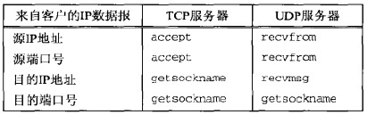 </div>

* 非连接状态下，同一套接字可以给多个服务器发送数据报
* 服务器上同一套接字可以从若干不同客户端接收数据报

> recvfrom和sendto都可以用于TCP，尽管通常没有理由这样做

### 2）连接的UDP套接字

<div align="center">  </div>

* **sockfd**：客户端套接字描述符
* **servaddr**：包含服务器IP地址和端口号的套接字地址结构
* **addrlen**：套接字地址结构的大小

给UDP套接字调用connect并不会像TCP一样触发三路握手，内核只是**检查是否存在立即可知的错误，记录对端的IP地址和端口号，然后立即返回**

已连接的UDP套接字与默认的未连接UDP套接字有3个不同：

* 限制了一个已连接套接字能且仅能与一个对端交换数据
    - 1）**不能再给输出操作指定目的IP地址和端口号，即不使用sendto而改用write或send**
    - 2）**不必使用recvfrom以获悉数据报的发送者，而改用read、recv或recvmsg**（发源地不是该套接字早先connect到的协议地址的数据报不会投递到该套接字）
* 接收异步错误
    - 3）**由已连接UDP套接字引发的异步错误会返回给它们所在的进程。未连接时不接收任何异步错误**

一个拥有**已连接UDP套接字**的进程，可出于下列2个目的再次调用connect：

* **指定新的IP地址和端口号**
* **断开套接字**：调用connect时，把套接字地址结构的地址族成员设置为AF_UNSPEC

TCP要再次调用connect必须先close套接字再重新调用socket创建套接字描述符

**连接与不连接的性能**：当应用进程在**一个未连接的UDP套接字上调用sendto时，源自Berkeley的内核暂时连接该套接字，发送数据报，然后断开该连接**。因此，当应用进程要给同一目的地址发送多个数据报时，使用连接套接字可以获得更高的效率

<br>
<br>

# 四.I/O复用

**I/O复用是一种机制，一个进程可以监视多个描述符，一旦某个描述符就绪（一般是读就绪或写就绪），能够通知程序进行相应的读写操作。**

目前支持I/O复用的系统调用有```select、pselect、poll、epoll```，本质上这些I/O复用技术都是同步I/O，在读写事件就绪后需要进程自己负责进行读写，即读写过程是进程阻塞的

**与多进程和多线程相比，I/O复用技术的最大优势是系统开销小，系统不必创建进程/线程，也不必维护这些进程/线程，从而大大减小了系统的开销**

## 1.select

<div align="center"> 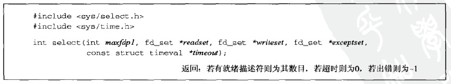 </div>

* 参数
    - `maxfdp1`：指定待测试的描述符个数，值为待测试的最大描述符加1（参数名的由来）
    - `readset`：读描述符集
    - `writeset`：写描述符集
    - `exceptset`：异常描述符集。目前支持的异常条件只有两个：
        + 1）某个套接字的带外数据到达
        + 2）某个已设置为分组模式的伪终端存在可从其主端读取的控制状态信息
    - `timeout`：(告知)内核等待任意描述符就绪的超时时间，超时函数返回0
        + 永远等待下去：设为空指针
        + 等待一段固定时间
        + 立即返回(轮询)：timeval结构中的时间设为0
        ```c
        struct timeval{
            long tv_sec;    /* 秒 */
            long tv_usec;   /* 微妙 */
        };
        ```
* **描述符集说明**：
    - 1）select使用的描述符集，通常是一个整数数组，其中每个整数中的一位对应一个描述符
    - 2）如果对三个描述符集中的某个不感兴趣，可以设为空指针，如果都设为空指针，会得到一个比Unix的sleep函数更精确的定时器（sleep以秒为最小单位）
    - 3）`<sys/select.h>`中定义的`FD_SETSIZE`常值是数据类型fd_set中的描述符总数，其值通常是`1024`，不过很少用到这么多描述符，`maxfdp1`参数迫使我们计算

**操作描述符集**：描述符集是“值-结果“参数，select调用返回时，结果将指示哪些描述符已就绪。函数返回后，使用FD_ISSET宏来测试fd_set数据类型中的描述符。**描述符集内任何与未就绪描述符对应的位返回时均清为0。因此，每次重新调用select函数时，都得再次把所有描述符集内所关心的位设置为1**

```c
void FD_ZERO(fd_set *fdset);            //清除fdset的所有位
void FD_SET(int fd,fd_set *fdset);      //打开fdset中的fd位
void FD_CLR(int fd,fd_set *fdset);      //清除fdset中的fd位
int FD_ISSET(int fd,fd_set *fdset);     //检查fdset中的fd位是否置位
```

### 1.1 描述符就绪条件

* **套接字可读**：
    - 套接字接收缓冲区中的数据(字节数)大于等于套接字接收缓冲区**低水位标记**的当前大小
    - 连接的读半部关闭，对这样的套接字读不会阻塞并返回0(EOF)
    - 监听套接字已完成的连接数不为0。对其accept通常不阻塞
    - 套接字上有一个错误，对其读不会阻塞并返回-1，同时把errno设为确切错误条件
* **套接字可写**：
    - 套接字发送缓冲区中的可用空间(字节数)大于等于套接字发送缓冲区**低水位标记**的当前大小，并且或者该套接字已连接，或者该套接字不需要连接(如UDP套接字)
    - 连接的写半部关闭，对这样的套接字写将产生SIGPIPE信号
    - 使用非阻塞式connect的套接字已建立连接，或者connect以失败告终
    - 套接字上有一个错误，对其写将不会阻塞并返回-1，同时把errno设为确切错误条件
* **套接字有异常条件待处理**

<div align="center"> 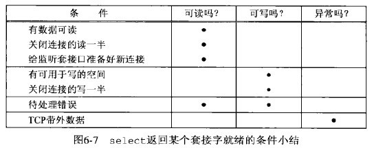 </div>

> 设置低水位标记
> * 可以使用SO_RCVLOWAT套接字选项设置套接字接收缓冲区低水位标记（对于TCP和UDP，默认值为1）
> * 可以使用SO_SNDLOWAT套接字选项设置套接字发送缓冲区低水位标记（对于TCP和UDP，默认值为2048）

### 1.2 select的优缺点

* **优点**：
    - **跨平台支持好**，目前几乎在所有平台上支持
* **缺点**：
    - **最大的缺点是，进程打开的fd有限**（由`FD_SETSIZE`和内核决定，一般为1024），这对于连接数量比较大的服务器来说根本不能满足（可以选择多进程的解决方案，虽然Linux上创建进程的代价比较小，但也不可忽视，加上进程间数据同步远比不上线程间同步的效率，所以也不是一种完美的方案）
    - **函数返回后需要轮询描述符集，寻找就绪描述符，效率不高**
    - **用户态和内核态传递描述符结构时copy开销大**

**增大描述符集大小的唯一方法是：先增大`FD_SETSIZE`的值，再重新编译内核，不重新编译内核而改变其值是不够的**

### 1.3 使用select实现TCP回射服务器

[代码](https://github.com/arkingc/unpv13e/blob/master/tcpcliserv/tcpservselect01.c)

**使用select实现TCP回射服务器，该服务器具有以下特点**：

* **单服务器进程处理所有用户请求**（换而言之非fork）
* **所能处理的最大客户数目的限制是以下两个值中的较小者：**
    - **FD_SETSIZE**
    - **内核允许本进程打开的最大描述符数**

client数组记录与客户端通信的描述符，rset是记录客户端描述符的描述符集

#### 1）初始状态

创建监听套接字并在指定地址进行监听

<div align="center"> 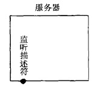 </div>

client和rset状态如下：

<div align="center"> 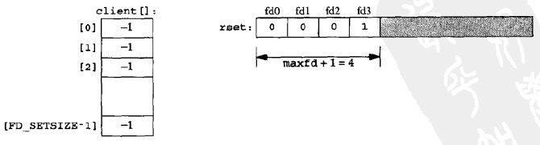 </div>

#### 2）第一个客户与服务器建立连接时

监听描述符变为可读，服务器于是调用accept。由accept返回的新的已连接描述符将是4

<div align="center"> 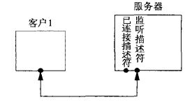 </div>

client和rset状态如下：

<div align="center"> 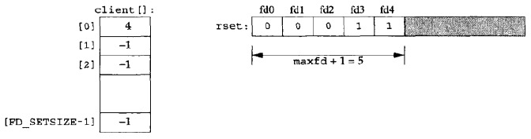 </div>

#### 3）第二个客户与服务器建立连接时

监听描述符变为可读，服务器于是调用accept。由accept返回的新的已连接描述符将是5

<div align="center">  </div>

client和rset状态如下：

<div align="center"> 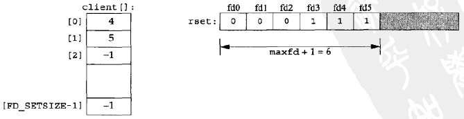 </div>

#### 4）第一个客户终止与服务器的连接

客户TCP发送一个FIN，使得服务器中的描述符4变为可读、当服务器读这个已连接套接字时，read将返回0。于是关闭该套接字并更新相应的数据结构

<div align="center"> 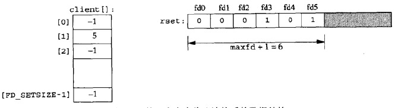 </div>

总之，当有客户到达时，在client数组中的第一个可用项（即值为-1的第一个项）中记录其已连接套接字的描述符。还必须把这个已连接描述符加到读描述符集中

## 2.pselect

<div align="center"> 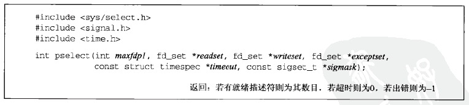 </div>

* 参数
    - `maxfdp1`：指定待测试的描述符个数，值为待测试的最大描述符加1（参数名的由来）
    - `readset`：读描述符集
    - `writeset`：写描述符集
    - `exceptset`：异常描述符集。目前支持的异常条件只有两个
        + 1）某个套接字的带外数据到达
        + 2）某个已设置为分组模式的伪终端存在可从其主端读取的控制状态信息
    - `timeout`：(告知)内核等待任意描述符就绪的超时时间，超时函数返回0
        + 永远等待下去：设为空指针
        + 等待一段固定时间
        + 立即返回(轮询)：timespec结构中的时间设为0
        ```c
        //和select不同，pselect的timeout参数使用timespec结构，而不是timeval结构，
        //timespec的第二个成员是纳秒级，而timeval的第二个成员是微妙级
        struct timespec{
            time_t tv_sec;    /* 秒 */
            long   tv_nsec;   /* 纳秒 */
        };
        ```
    - `sigmask`：该参数运行程序先禁止递交某些信号，再测试由这些当前被禁止信号的信号处理函数设置的全局变量，然后调用pselect，告诉它重新设置信号掩码

pselect相对于通常的select有2个变化：

1. **使用timespec结构，而不是timeval结构**，timespec的第二个成员是纳秒级，而timeval的第二个成员是微妙级
2. **增加了第6个参数：一个指向信号掩码的指针**。该参数运行程序先禁止递交某些信号，再测试由这些当前被禁止信号的信号处理函数设置的全局变量，然后调用pselect，告诉它重新设置信号掩码

## 3.poll

<div align="center">  </div>

* 参数：
    - `fdarray`：指向pollfd数组的指针，每个pollfd结构包含了描述符及其相应事件
        ```c
        struct pollfd{
            int   fd;       //监视的描述符
            short events;   //该描述符上监视的事件
            short revents;  //该描述符上发生的事件
        };
        ```
    - `nfds`：pollfd数组的元素个数（即监视的描述符总数）
    - `timeout`：(告知)内核等待任意描述符就绪的超时时间，超时函数返回0
        + `INFTIM`（一个负值）：永远等待下去
        + `>0`：等待一段固定时间
        + `0`：立即返回(轮询)

**如果不再关心某个特定描述符，可以把与之对应的pollfd结构的fd成员设置成一个负值。poll函数将忽略这样的pollfd结构的events成员，返回时将其revents成员的值置为0**

### 3.1 事件

poll中每个描述符有一个监视的事件以及一个发生的事件，在pollfd结构中是类型为short的成员。两个成员中的每一个都由指定某个特定条件的一位或多位构成：

<div align="center"> 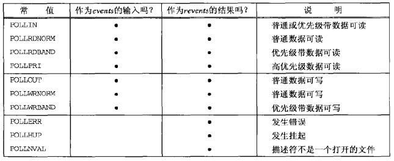 </div>

* 第一部分是**输入**事件的**4个**常值
* 第二部分是**输出**事件的**3个**常值
* 第三部分是**错误**事件的**3个**常值

对于TCP和UDP而言，以下条件将引起poll返回特定的revent：

* 所有正规TCP数据和所有UDP数据都被认为是**普通数据**
* TCP的带外数据被认为是**优先级带数据**
* TCP连接读半部关闭时（如收到一个来自对端的FIN），被认为是**普通数据**，随后读操作返回0
* TCP连接存在错误既可认为是**普通数据**，也可认为是**错误**。随后的读操作返回-1，并设置error（可用于处理诸如接收到RST或发生超时等条件）
* 在监听套接字上有新连接可用，既可认为是**普通数据**也可认为是**优先级带数据**

### 3.2 poll的优缺点

* **优点**：
    - **没有最大监视描述符数量的限制**：分配一个pollfd结构的数组并把该数组中元素的数目通知内核成了调用者的责任。内核不再需要知道类似fd_set的固定大小的数据类型
* **缺点**：
    - 和select一样，调用返回后需要**轮询所有描述符来获取已经就绪的描述符**
    - **用户态和内核态传递描述符结构时copy开销大**

## 4.epoll

```c
#include <sys/epoll.h>
int epoll_create(int size);
int epoll_ctl(int epfd,int op,int fd,struct epoll_event *event);
int epoll_wait(int epfd,struct epoll_event *events,int maxevents,int timeout);
```

* **epoll_create函数**：创建一个epoll句柄。它会占用1个`fd`，在用完epoll后，须调用close()关闭
    - **参数**
        + `size`：告诉内核监听描述符的数量，并不是监听数量的最大值，是对内核初始分配内部数据结构的一个建议
    - **返回值**：创建的epoll句柄
* **epoll_ctl函数**：对描述符`fd`执行`op`操作
    - **参数**
        + `epfd`：epoll_create得到的epoll句柄
        + `op`：操作
            * **EPOLL_CTL_ADD**：注册新的`fd`到`epfd`中
            * **EPOLL_CTL_DEL**：从`epfd`中删除一个fd
            * **EPOLL_CTL_MOD**：修改已注册`fd`的监听事件
        + `fd`：操作的描述符
        + `event`：告知内核**需要监听的事件**。`epoll_event`结构的`events`成员可以是下列宏的集合：
            * **EPOLLIN**：对应的描述符可读
            * **EPOLLOUT**：对应的描述符可写
            * **EPOLLPRI**：对应的描述符有紧急数据可读（带外数据）
            * **EPOLLERR**：对应的描述符发生错误
            * **EPOLLHUP**：对应的描述符被挂断
            * **EPOLLET**：将epoll设为**边缘触发模式**（默认为**水平(LT)触发模式**）
            * **EPOLLONESHOT**：只监听一次事件，监听完后，如果需要再次监听，需再次将描述符加入到epoll队列
            ```c
            struct epoll_event{
                __uint32_t    events;
                epoll_data_t  data;
            };

            //一般用法是直接把socket赋给fd即可。
            //但是，有了void*指针，就可以在注册socket的时候，传进我们想要的参数，
            //wait出来的时候，用我们自己的函数进行处理
            typedef union epoll_data{
                void         *ptr;
                int          fd;
                __uint32_t   u32;
                __uint64_t   u64;
            } epoll_data_t;
            ```
    - **返回值**：
        + `0`：成功
        + `-1`：失败
* **epoll_wait函数**：等待epoll句柄上的I/O事件，最多返回maxevents个事件
    - **参数**
        + epfd：epoll_create得到的epoll句柄
        + events：从内核得到事件的集合
        + maxevents：返回事件的最大数量（不能大于创建epoll句柄时的size参数）
        + timeout：超时参数
            * `0`：立即返回
            * `-1`：永久阻塞？
    - **返回值**：
        + `>0`：返回需要处理的事件数目
        + `0`：超时

### 4.1 工作模式

**epoll对描述符的操作有两种模式，当epoll_wait检测到描述符事件发生时，向应用程序通知此事件**：

* **水平触发(LT)模式**（**默认**）：
    - 应用程序可以不立即处理该事件。下次调用epoll_wait时，会再次向应用程序通知此事件
    - 同时支持block和no-block socket
* **边缘触发(ET)模式**（高速工作方式）：
    - 应用程序必须立即处理该事件。如果不处理，下次调用epoll_wait时，不再向应用程序通知此事件
    - 只支持no-block socket（以免一个文件句柄的阻塞读/阻塞写操作把处理多个文件描述符的任务饿死）

**ET模式在很大程度上减少了epoll事件被重复触发的次数，因此效率要比LT模式高**

### 4.2 epoll的优缺点：

* **优点**
    * **监视的描述符数量不受限制**，所支持的`fd`上限是最大可以打开文件的数目（一般远大于2048，和系统内存关系较大，可以使用`cat /proc/sys/fs/file-max`查看）
    * **I/O效率不会随着监视fd数量的增长而下降**：epoll不同于select和poll轮询的方式，而是通过每个fd定义的回调函数来实现的，只有就绪的fd才会执行回调函数
    * **用户态和内核态消息传递的开销小**

> 如果没有大量的“idle连接”或“dead连接”，epoll的效率并不会比select/poll高很多
> * 当连接数少并且连接都十分活跃的情况下，select和poll的性能可能比epoll好
> * 当遇到大量的"idle连接"，epoll的效率会大大高于select/poll

<br>
<br>

# 五.套接字选项

## 1.获取及设置套接字选项的函数

#### 1）getsockopt和setsockopt函数

<div align="center"> 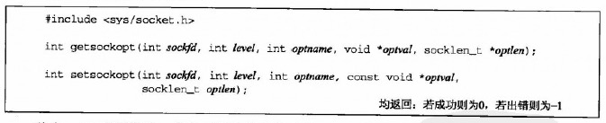 </div>

* **sockfd**：一个打开的套接字描述符
* **level**：系统中解释选项的代码。或为通用套接字代码，或为某个特定于协议的代码（IPv4、IPv6、TCP或SCTP）
* **optname**：选项名
* **optval**：选项的值
    - getsockopt把已获取的选项当前值存放到optval中。此时\*optval是一个整数。\*optval中返回的值为0表示相应选项被禁止，不为0表示相应选项被启用
    - setsockopt从optval中取得选项待设置的新值。不为0的\*optval值来启用选项，一个为0的\*optval值来禁止选项
* **optlen**：指明optval所指结构的大小

**level**和**optname**可以取下图中的值：

<div align="center"> 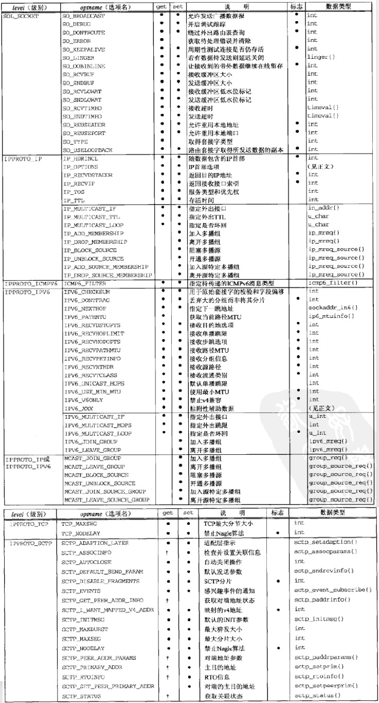 </div>

#### 2）fcntl函数

该函数可执行各种**描述符控制操作**，在网络编程中主要关注对套接字描述符的控制操作

<div align="center">  </div>

* **fd**：套接字描述符
* **cmd**：作用于该描述符上的命令
    - **F_GETFL**：获取文件标志（**影响套接字描述符的两个标志**：O_NONBLOCK(非阻塞式I/O)、O_ASYNC(信号驱动式I/O)）
    - **F_SETFL**：设置文件标志（**影响套接字描述符的两个标志**：O_NONBLOCK(非阻塞式I/O)、O_ASYNC(信号驱动式I/O)）
    - **F_SETOWN**：该命令允许我们指定用于接收SIGIO和SIGURG信号的套接字属主（进程ID或进程组ID），SIGIO信号是套接字被设置为信号驱动式I/O后产生的，SIGURG信号是在新的带外数据到达套接字时产生的
        + SIGIO和SIGURG与其他信号的不同之处在于：这两个信号仅在已使用F_SETOWN命令给相关套接字指派了属主后才会产生
        + F_SETOWN命令的整数类型arg参数既可以是一个正整数，指出接收信号的进程ID，也可以是一个负整数，其绝对值指出接收信号的进程组ID。F_GETOWN命令把套接字属主作为fcntl函数的返回值返回，它既可以是进程ID，也可以是进程组ID(一个除-1以外的负值)
        + 指定接收信号的套接字属主为一个进程或一个进程组的差别在于：前者仅导致单个进程接收信号，而后者则导致整个进程组中的所有进程接收信号
    - **F_GETOWN**：返回套接字的当前属主

例如，使用fcntl开启非阻塞式I/O对的典型代码如下：

```c
int flags;

if((flags = fcntl(fd,F_GETFL,0)) < 0)
    err_sys("F_GETFL error");
//设置某个文件状态标志的唯一正确的方法是：先取得当前标志，与新标志逻辑或后再设置标志
flags |= O_NONBLOCK;
if(fcntl(fd,F_SETFL,flags) < 0)
    err_sys("F_SETFL error");
```

## 2.套接字选项分类

**套接字选项粗分为两大基本类型**：

* 启用或禁止某个特性相关的**标志选项**
* 可以设置或检查的特定**值选项**

### 2.1 通用套接字选项

这些选项是协议无关的。它们由内核中的协议无关代码处理，而不是由诸如IPv4之类特殊的协议模块处理。不过其中有些选项只能应用到某些特定类型的套接字中。举例来说，尽管SO_BROADCAST套接字选项是“通用”的，它却只能应用于数据报套接字

#### 1）SO_ERROR(可以获取，不能设置)

> 获取套接字上发生的错误

当一个套接字上发生错误时，源自Berkeley的内核中的协议模块将该套接字的名为so_error的变量设为标准的Unix Exxx值中的一个，称它为套接字的待处理错误。内核会通知进程这个错误。进程然后可以通过该套接字选项获取so_error的值。由getsockopt返回的整数值就是该套接字的待处理错误。so_error随后由内核复位为0

#### 2）SO_KEEPALIVE

> 可以处理[服务器主机崩溃](#4服务器主机崩溃)

设置该选项后，如果2小时（可以通过修改内核来改这个时间）内在该套接字的任一方向上都没有数据交换，TCP就自动给对端发送一个“保持存活探测分节”。对端可以做出3种响应：

1. 以期望的ACK响应。应用进程得不到通知（因为一切正常） 
2. 响应RST分节，告知本端TCP：对端已崩溃且已重新启动。该套接字的待处理错误被置为ECONNRESET，套接字本身则被关闭
3. 没有任何响应（源自Berkeley的TCP将另外发送8个探测分节，两两相隔75s，试图得到一个响应。TCP在发出第一个探测分节后11分15秒内若没有得到任何响应则放弃），该套接字的待处理错误将被置为ETIMEOUT，套接字本身则被关闭；如果套接字收到一个ICMP错误作为某个探测分节的响应，那就返回相应的错误，套接字本身也被关闭（这种情形下一个常见ICMP错误是目的主机不得达，待处理错误会被置为EHOSTUNREACH）

#### 3）SO_LINGER

> 控制close的返回时机

**该选项指定close函数对面向连接的协议如何操作**。默认操作是close函数立即返回，但是如果有数据残留在套接字发送缓冲区中，系统将试着把这些数据发送给对端。SO_LINGER套接字选项使得我们可以改变这个默认设置

选项要求在用户进程与内核间传递如下结构：

```c++
//头文件：<sys/socket.h>
struct linger{
	int l_onoff;   /* 0=off, nozero=on */
	int l_linger;  /* 延滞时间，POSIX指定单位为s */
};
```

对setsockopt的调用将根据其中两个结构成员的值形成下列3种情况之一：

1. **l_onoff为0**：此时l_linger值会被忽略。关闭该选项，默认设置生效，即close立即返回（**图7.7**）
2. **l_onoff非0，且l_linger为0**：TCP将终止连接，丢弃保留在套接字发送缓冲区中的任何数据，并发送一个RST给对端，而没有通常的四分组连接终止序列，这么一来避免了TIME_WAIT状态，然而存在以下可能性：在2MSL秒内创建该连接的另一个化身，导致来自刚被终止的连接上的旧的重复分节被不正确地传送到新的化身上
3. **l_onoff非0，且l_linger非0**：当套接字关闭时，内核将拖延一段时间。如果在套接字发送缓冲区中仍残留有数据，那么进程将投入睡眠，直到 a）所有数据都已经发送完且均被对方确认；b）延滞时间到；（如果套接字被设置为非阻塞，那么将不等待close完成，即使延滞时间非0也是如此）当使用SO_LINGER选项的这个特性时，应用进程检查close的返回值是非常重要的，因为如果在数据发送完并被确认前延滞时间到的话，close将返回EWOULDBLOCK错误，且套接字发送缓冲区中的任何残留数据都被丢弃。这种组合可能存在下列几种情况：
	* close直到数据和FIN已被服务器主机的TCP确认后才返回（问题是，在服务器应用进程读剩余数据之前，服务器主机可能崩溃，并且客户应用进程永远不会知道。因此，close成功返回只是告诉我们先前发送的数据(和FIN)已由对端TCP确认，而不能告诉我们对端应用进程是否已读取数据）（**图7.8**）
	* 延滞时间偏低，在接收到服务器主机的TCP确认前close返回（**图7.9**）

<div align="center"> 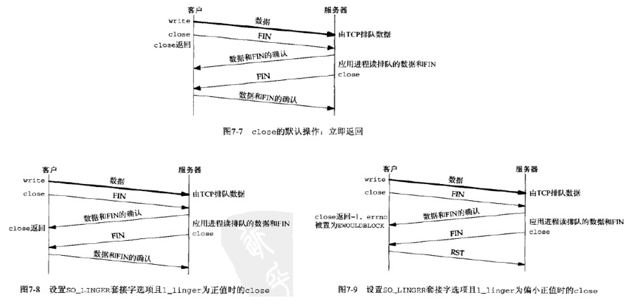 </div>

让客户知道服务器已读取其数据的一个方法是改为调用shutdown(并设置它的第二个参数为SHUT_WR)而不是调用close，并等待对端close连接的服务器端：

<div align="center"> 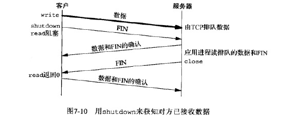 </div>

下图汇总了对shutdown的两种可能调用和对close的三种可能调用，以及它们对TCP套接字的影响：

<div align="center"> 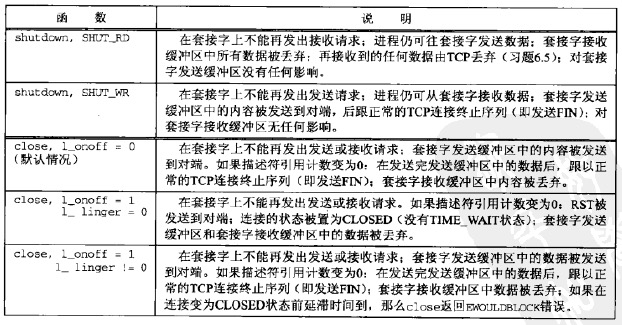 </div>

#### 4）SO_RCVBUF和SO_SNDBUF

> 修改套接字发送缓冲区或接收缓冲区的大小

每个套接字都有一个发送缓冲区和一个接收缓冲区。这两个套接字选项允许我们改变这两个缓冲区的默认大小

* **TCP的流量控制**：对于TCP来说，套接字接收缓冲区中可用空间的大小限定了TCP通告对端的窗口大小。TCP套接字接收缓冲区不可能溢出，因为不允许对端发出超过本端所通告窗口大小的数据。如果对端无视窗口大小而发出了超过该窗口大小的数据，本端TCP将丢弃它们

* 对于UDP来说，当接收到的数据报装不进套接字接收缓冲区时，该数据报就被丢弃。UDP是没有流量控制的：较快的发送端可以很容易地淹没较慢的接收端，导致接收端的UDP丢弃数据报，事实上较快的发送端甚至可以淹没本机的网络接口，导致数据报被本机丢弃

**TCP的窗口规模选项是在建立连接时用SYN分节与对端互换得到的**：

* 对于客户，这意味着SO_RCVBUF选项必须在调用connect之前设置
* 对于服务器，这意味着该选项必须在调用listen之前给监听套接字设置

给已连接套接字设置该选项对于可能存在的窗口规模选项没有任何影响，因为accept直到TCP的三路握手完成才会创建并返回已连接套接字。这就是必须给监听套接字设置该选项的原因。（套接字缓冲区的大小总是由新创建的已连接套接字从监听套接字继承而来）

#### 5）SO_RCVLOWAT和SO_SNDLOWAT

> 控制接收缓冲区中有多少数据时可读、发送缓存区中有多少空闲空间时可写

每个套接字还有一个接收低水位标记和一个发送低水位标记。比如，可以由select函数使用

* **接收低水位标记**是让select返回“可读”时套接字接收缓冲区中所需的数据量（对于TCP、UDP、SCTP套接字，其默认值是1）
* **发送低水位标记**是让select返回“可写”时套接字发送缓冲区中所需的可用空间（对于TCP套接字，其默认值通常是2048；UDP也使用发送低水位标记，然而**由于UDP并不为应用程序传递给它的数据报保留副本，因此UDP套接字的发送缓冲区中可用空间的字节数从不改变，只要一个UDP套接字的发送缓冲区大小大于该套接字的低水位标记，该UDP套接字就总是可写的。UDP并没有发送缓冲区，只有发送缓冲区大小这个属性**）

#### 6）SO_REUSEADDR和SO_REUSEPORT

> 地址和端口复用

**SO_REUSEADDR套接字选项能起到4个不同的功用**：

1. **允许启动一个监听服务器并捆绑其众所周知端口，即使以前建立的将该端口用作本地端口的连接仍然存在**。这个条件通常是这样产生的：
    * a）启动一个监听服务器
    * b）连接请求到达，派生一个子进程来处理这个客户
    * c）监听服务器终止，但子进程继续为现有连接上的客户提供服务
    * d）重启监听服务 
2. **允许在同一端口上启动同一服务器的多个实例，只要每个实例捆绑一个不同的本地IP地址即可**
3. **允许单个进程捆绑同一端口到多个套接字上，只要每次捆绑指定不同的本地IP地址即可**
4. **允许完全重复的捆绑：当一个IP地址和端口已捆绑到某个套接字上时，如果传输协议支持，同样的IP地址和端口还可以捆绑到到另一个套接字上**（一般来说该特性仅支持UDP套接字，用于多播）

4.4BSD随多播支持的添加引入了SO_REUSEPORT这个套接字选项，它并未在SO_REUSEADDR上重载所需多播语义，而是引入了以下语义：

* 允许完全重复的捆绑，不过只有在想要捆绑同一IP地址和端口的每个套接字都指定了本套接字选项才行
* 如果被捆绑的IP地址是一个多播地址，那么SO_REUSEADDR和SO_REUSEPORT被认为是等效的

SO_REUSEPORT的问题在于并非所有系统都支持。在那些不支持该选项但是支持多播的系统上，改用SO_REUSEADDR以允许合理的完全重复的捆绑

> SO_REUSEADDR有一个潜在的安全问题。举例来说，假设存在一个绑定了通配地址和端口5555的套接字，如果指定SO_REUSEADDR，我们就可以把相同的端口捆绑到不同的IP地址上，譬如说就是所在主机的主IP地址。此后目的地端口为5555及新绑定IP地址的数据报将被递送到新的套接字，而不是递送到绑定了通配地址的已有套接字。这些数据报可以是TCP的SYN分节、STP的INIT块或UDP数据报。对于大多数众所周知的服务如HTTP、FTP和Telnet来说，这不成问题，因为这些服务器绑定的是保留端口。这种情况下，后来的试图捆绑这些端口更为明确的实例（也就是盗用这些端口）的任何进程都需要超级用户特权。然而NFS可能是一个问题，因为它的通常端口2049并不是保留端口

### 2.2 TCP套接字选项

TCP有两个套接字选项，他们的级别为IPPROTO_TCP

#### 1）TCP_MAXSEG

**该选项允许我们获取或设置TCP连接的最大分节大小(MSS)**。返回值是我们的TCP可以发送给对端的最大数据量，它通常是由对端使用SYN分节通告的MSS，除非我们的TCP选择使用一个比对端通告的MSS小些的值。如果该值在相应套接字的连接建立之前取得，那么返回值是未从对端收到MSS选项的情况下所用的默认值。（如果用上譬如说时间戳选项的话，那么实际用于连接中的最大分节大小可能小于该套接字选项的返回值，因为时间戳选项在每个分节中要占用12字节的TCP选项容量）

如果TCP支持路径MTU发现功能，那么它将发送的每个分节的最大数据量还可能在连接存活期内改变。如果到对端的路径发生变动，该值就会有所调整

#### 2）TCP_NODELAY

**开启该选项将禁止TCP的Nagle算法，默认情况下是启动的**

**Nagle算法的目的在于防止一个连接在任何时刻有多个小分组待确认。如果某个给定连接上有待确认数据，那么原本应该作为用户写操作在该连接上立即发送相应小分组的行为就不会发生，直到现有数据被确认为止**

考虑一个例子，在Rlogin或Telnet的客户端键入6个字符的串“hello!”，每个字符间间隔正好是250ms。到服务器端的RTT为600ms，而且服务器立即发回每个字符的回显。假设对客户端字符的ACK是和字符回显一同发回给客户端的，并且忽略客户端发送的对服务器端回显的ACK，下图展示了禁止Nagle算法和开启时的情况，在开启时，会感觉到明显的延迟：

<div align="center"> 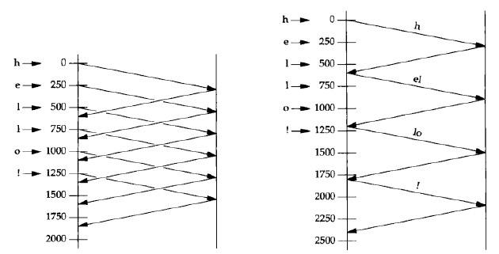 </div>

Nagle算法常常与另一个TCP算法联合使用：**ACK延滞算法**，该算法使得TCP在接收到数据后不立即发送ACK，而是等待一小段时间（典型值为50ms~200ms），然后才发送ACK。TCP期待在这一小段时间内自身有数据发送回对端，被延滞的ACK就可以由这些数据捎带，从而省掉一个TCP分节（这种情形对于Rlogin和Telnet客户来说通常可行，因为他们的服务器一般都回显客户发送来的每个字符，这样对客户端字符的ACK完全可以在服务器对该字符的回显中捎带返回；然而对于服务器不在相反方向产生数据以便捎带ACK的客户来说，ACK延滞算法存在问题。这些客户可能觉察到明显的延迟）

<br>
<br>

# 六.名字与数值转换

DNS中的资源记录：

* **A**：A记录把一个主机名映射成一个32位的IPV4地址
* **AAAA**：AAAA记录把一个主机名映射成一个128位的IPV6地址
* **PTR**：称为“指针记录”，把IP地址映射成主机名
* **MX**：把一个主机指定为给定主机的“邮件交换器”
* **CNAME**：常见用法是为常用的服务指派CNAME记录。如果人们使用这些服务名而不是真实的主机名，那么相应的服务挪到另一个主机时他们也不必知道

以下是主机freebsd的4个DNS记录：

<div align="center"> 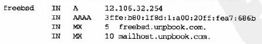 </div>

## 1.主机名字与IP地址之间的转换

**可以通过DNS获取名字和地址信息**

<div align="center"> 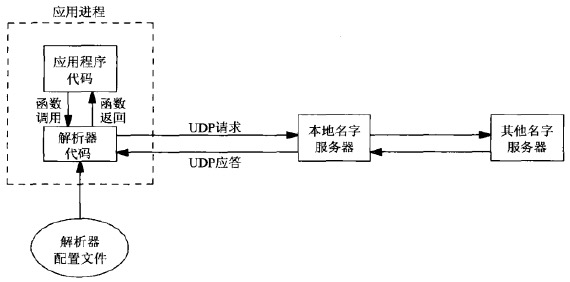 </div>

* 解析器代码通过读取其系统相关配置文件(通常是`/etc/resolv.conf`)确定本组织机构的名字服务器的所在位置
* 解析器使用UDP向本地名字服务器发出查询，如果本地名字服务器不知道答案，通常会使用UDP在整个因特网上查询其它名字服务器（如果答案太长，超出了UDP消息的承载能力，本地名字服务器和解析器会自动切换到TCP）

**不使用DNS也可能获取名字和地址信息，有下列替代方法**：

1. 静态主机文件（通常是`/etc/hosts`文件）
2. 网络信息系统（NIS）
3. 轻权目录访问协议（LDAP）

系统管理员如何配置一个主机以使用不同类型的名字服务是实现相关的，但这些差异对开发人员来说，通常是透明的，只需调用诸如gethostbyname和gethostbyaddr这样的解析器函数

### 1）gethostbyname函数

<div align="center"> 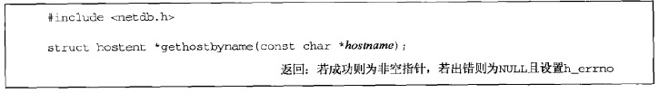 </div>

函数的局限是**只能返回IPv4地址**，返回的指针指向hostent结构，该结构含有所查找主机的所有IPv4地址：

```c++
struct hostent{
    char *h_name;           //规范主机名
    char **h_aliases;       //主机别名
    int h_addrtype;         //主机地址类型：AF_INET
    int h_length;           //地址长度：4
    char **h_addr_list;     //IPv4地址
};
```

<div align="center"> 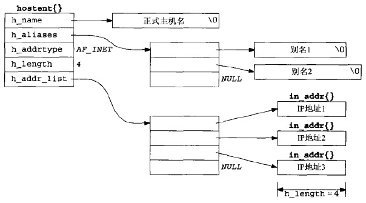 </div>

当发生错误时，函数会设置全局变量h_errno为定义在\<netdb.h\>中的下列常值：

* **HOST_NOT_FOUND**：
* **TRY_AGAIN**：
* **NO_RECOVERY**：
* **NO_DATA**(等同于**NO_ADDRESS**)：表示指定的名字有效，但没有A记录（只有MX记录的主机名就是这样的一个例子）

如今多数解析器提供hstrerror函数，该函数以某个h_errno值作为唯一参数，返回一个指向相应错误说明的const char *指针

### 2）gethostbyaddr函数

该函数试图由一个二进制的IP地址找到相应的主机名，与gethostbyname的行为相反

<div align="center"> 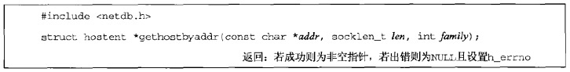 </div>

* **addr**：实际上是一个指向存放IPv4地址的某个in_addr结构的指针
* **len**：addr指向的in_addr结构的大小（对于IPv4地址为4）
* **family**：AF_INET

函数同样返回一个指向hostent结构的指针，但是不同于gethostbyname，这里我们感兴趣的通常是存放规范主机名的h_name字段

## 2.服务名字与端口号之间的转换

### 1）getservbyname函数

从服务名字到端口的映射关系通常保存在`/etc/services`文件中，因此如果程序中使用服务名字而非端口号时，即使端口号发生变动，仅需修改这个文件，而不必重新编译应用程序

<div align="center">  </div>

* **servname**：服务名参数，必须指定
* **protoname**：协议，如果指定了，那么指定的服务必须有匹配的协议（如果protoname未指定而servname服务支持多个协议，那么返回哪个端口号取决于实现）

函数成功时返回指向servent结构的指针：

```c++
struct servent{
    char *s_name;       //规范服务名
    char **s_aliases;   //服务别名
    int s_port;         //服务对应的端口号（网络字节序）
    char *s_proto;      //使用的协议
};
```

### 2）getservbyport函数

<div align="center"> 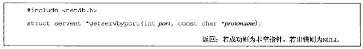 </div>

* **port**：端口号，必须为网络字节序
* **protoname**：指定协议（有些端口号在TCP上用于一种服务，在UDP上却用于完全不同的另一种服务）

## 3.主机与服务名字转IP地址与端口号

### 1）getaddrinfo函数

getaddrinfo与协议无关，并且能处理**名字到地址**、**服务到端口**这两种转换。返回的不再是地址列表，返回的addrinfo结构中包含了一个指向sockaddr结构的指针，这些sockaddr结构随后可由套接字函数直接使用，因此将协议相关性完全隐藏在函数的内部

<div align="center">  </div>

* **hostname**：主机名或IP地址串
* **service**：服务名或端口号数串
* **hints**：可以是空指针。非空时指向的addrinfo结构包含了一些对期望返回的信息类型的限制
* **result**：指向addrinfo结构的指针，**返回值**
    * 如果与hostname参数关联的地址有多个，那么适用于所请求地址族的每个地址都返回一个对应的结构
    * 如果service参数指定的服务支持多个套接字类型，那么每个套接字类型都可能返回一个对应的结构

```c++
//调用者可以通过hints设置的字段有：ai_flags、ai_family、ai_socktype、ai_protocol
//如果hints参数是一个空指针，函数就假设ai_flags、ai_family、ai_socktype为0，ai_protocol为AF_UNSPEC
struct addrinfo{
    int ai_flags;               //0个或多个或在一起的AI_xxx值
    int ai_family;              //某个AF_xxx值
    int ai_socktype;            //某个SOCK_xxx值
    int ai_protocol;            //0或IPPROTO_xxx
    socklen_t ai_addrlen;       //ai_addr的长度
    char *ai_canonname;         //指向规范主机名的指针
    struct sockaddr *ai_addr;   //指向套接字地址结构的指针
    struct addrinfo *ai_next;   //指向链表中下一个addrinfo结构的指针
};

//ai_flags成员可用的标志值及含义如下：
AI_PASSIVE：套接字将用于被动打开
AI_CANONNAME：告知getaddrinfo函数返回主机的规范名字
AI_NUMERICHOST：防止任何类型的名字到地址映射，hostname参数必须是一个地址串
AI_NUMERICSERV：防止任何类型的名字到服务映射，service参数必须是一个十进制端口号数串
AI_V4MAPPED：如果同时指定ai_family的值为AF_INET6，那么如果没有可用的AAAA记录，就返回与A记录对应的IPv4映射的IPv6地址
AI_ALL：如果同时指定了AI_V4MAPPED，那么返回与AAAA记录对应的IPv6地址、与A记录对于的IPv4映射的IPv6地址
AI_ADDRCONFIG：按照所在主机的配置选择返回地址类型
```

如果函数成功，result指向的变量已被填入一个指针，指向的是由ai_next成员串起来的addrinfo结构链表（这些结构的先后顺序没有保证）：

<div align="center">  </div>

常见的使用：

* **TCP或UDP客户同时指定hostname和service**
    - **TCP客户**在一个循环中针对每个返回的IP地址，逐一调用socket和connect，直到有一个连接成功，或者所有地址尝试完毕
    - 对于**UDP客户**，由getaddrinfo填入的套接字地址结构用于调用sendto或connect。如果客户能够判断第一个地址看来不工作（或者在已连接的UDP套接字上收到出错消息，或者在未连接的套接字上经历消息接收超时），那么可以尝试其余地址
* **典型的服务器只指定service而不指定hostname，同时在hints结构中指定AI_PASSIVE标志**。返回的套接字地址结构中应含有一个值为INADDR_ANY(对于IPv4)或IN6ADDR_ANY_INIT(对于IPv6)的IP地址
    - 函数返回后，**TCP服务器**调用socket、bind和listen。如果服务器想要malloc另一个套接字地址结构以从accept获取客户的地址，那么返回的ai_addrlen值给出了这个套接字地址结构的大小
    - **UDP服务器**将调用socket、bind和recvfrom。如果想要malloc另一个套接字地址结构以从recvfrom获取客户的地址，那么返回的ai_addrlen值给出了这个套接字地址结构的大小
    - 以上假设服务器仅处理一个套接字，如果**使用select或poll让服务器处理多个套接字**，服务器将遍历由getaddrinfo返回的整个addrinfo结构链表，并为每个结构创建一个套接字，再使用select或poll

如果**客户或服务器**清楚自己只处理一种类型的套接字，那么应该把hints结构的ai_socktype成员设置成SOCK_STREAM或SOCK_DGRAM

下表示是getaddrinfo函数及其行为和结果汇总：

<div align="center">  </div>

如果发生**错误**，函数getaddrinfo返回错误值，该值可以作为函数**gai_strerror**的参数。调用gai_strerror函数可以得到一个描述错误信息的C字符串指针：

<div align="center">  </div>

常见的错误说明如下表：

<div align="center">  </div>

getaddrinfo函数返回的所有**存储空间都是动态获取**的，包括addrinfo结构、ai_addr结构和ai_canonname字符串，可以通过调用**freeaddrinfo**返**还给系统**：

<div align="center">  </div>

* **ai**：指向由getaddrinfo返回的第一个addrinfo结构（这个链表中所有的结构以及由它们指向的任何动态存储空间都被释放掉）

> 尽管getaddrinfo函数确实比gethostbyname和getservbyname要“好”：1）能编写协议无关的代；2）单个函数能同时处理主机名和服务名；3）所有返回信息动态分配而非静态分配；但是它仍没有像期待的那样好用：必须先分配一个hints结构，把它清零后填写需要的字段，再调用getaddrinfo，然后遍历一个链表逐一尝试每个返回地址

### 2）host_serv函数

host_serv封装了函数getaddrinfo，不要求调用者分配并填写一个hints结构，该结构中的**地址族**和**套接字类型**字段作为参数：

<div align="center">  </div>

[函数源码](https://github.com/arkingc/unpv13e/blob/master/lib/host_serv.c#L4)

### 3）tcp_connect函数

tcp_connect执行TCP客户的通常步骤：创建一个TCP套接字并连接到一个服务器

<div align="center">  </div>

[函数源代码](https://github.com/arkingc/unpv13e/blob/master/lib/tcp_connect.c#L5)

[时间获取程序——使用tcp_connect的客户端](https://github.com/arkingc/unpv13e/blob/master/names/daytimetcpcli.c)

### 4）tcp_listen函数

tcp_listen执行TCP服务器的通常步骤：创建一个TCP套接字，给它捆绑服务器的众所周知的端口，并允许接受外来的连接请求：

<div align="center">  </div>

[函数源代码](https://github.com/arkingc/unpv13e/blob/master/lib/tcp_listen.c#L5)

* [时间获取程序——使用tcp_listen的服务器](https://github.com/arkingc/unpv13e/blob/master/names/daytimetcpsrv1.c)（不可指定协议）
* [时间获取程序——使用tcp_listen的服务器](https://github.com/arkingc/unpv13e/blob/master/names/daytimetcpsrv2.c)（可指定协议）

### 5）udp_client函数

创建未连接UDP套接字：

<div align="center">  </div>

* **saptr**：指向的套接字地址结构保存有服务器的IP地址和端口号，用于稍后调用sendto
* **lenp**：saptr所指的套接字地址结构的大小。不能为空指针，因为任何sendto和recvfrom调用都需要知道套接字地址结构的长度

[函数源代码](https://github.com/arkingc/unpv13e/blob/master/lib/udp_client.c#L5)

[时间获取程序——使用udp_client的客户端](https://github.com/arkingc/unpv13e/blob/master/names/daytimeudpcli1.c)（可指定协议）

### 6）udp_connect函数

创建一个已连接UDP套接字：

<div align="center">  </div>

因为已连接套接字改用write代替sendto，所以相比于udp_client，省略了套接字地址结构及长度参数

[函数源代码](https://github.com/arkingc/unpv13e/blob/master/lib/udp_connect.c#L5)

### 7）udp_server函数

<div align="center">  </div>

[时间获取程序——使用udp_server的服务器](https://github.com/arkingc/unpv13e/blob/master/names/daytimeudpsrv2.c)（可指定协议）

## 4.IP地址与端口号转主机与服务名字

### getnameinfo函数

getaddrinfo的互补函数

<div align="center">  </div>

* **sockaddr**：指向套接字地址结构，包含了待转换为可读字符串的协议地址
* **addrlen**：sockaddr指向的套接字地址结构的大小
* **host**：指向存储转换得到的”主机名“信息的buf（调用者预先分配）
* **hostlen**：host指向的buf的大小（不想获得”主机名“信息则设为0）
* **serv**：指向存储转换得到的”服务名“信息的buf（调用者预先分配）
* **servlen**：serv指向的buf的大小（不想获得”服务名“信息则设为0）
* **flags**：标志，见下表

<div align="center">  </div>

## 5.其它网络相关信息

应用进程可能想要查找4类与网络相关的信息：**主机**、**网络**、**协议**、**服务**。大多数查找针对的是主机，一小部分查找针对的是服务，更小一部分查找针对的是网络和协议。所有4类信息都可以放在一个文件中，每类信息各定义有3个访问函数：

1. 函数getXXXent读出文件中的下一个表项，必要的话首先打开文件
2. 函数setXXXent打开（如果尚未打开的话）并回绕文件
3. 函数endXXXent关闭文件

每类信息都定义了各自的结构：hostent、netent、protoent、servent。这些结构定义在头文件`<netdb.h>`中

<div align="center">  </div>

* **只有主机和网络信息可通过DNS获取**，协议和服务信息总是从相应文件中读取
* 如果使用DNS查找主机和网络信息，只有键值查找函数才有意义。如果调用gethostent，那么它仅仅读取/etc/hosts文件并避免访问DNS

<br>
<br>

# 七.高级I/O函数

下图汇总5组I/O函数进行了汇总：

<div align="center">  </div>

## 1.套接字超时

**套接字I/O操作上设置超时的方法有3种**：

1. 调用alarm，它再指定超时期满时产生SIGALRM信号。**但**涉及信号处理，信号处理在不同实现上存在差异，而且可能干扰进程中现有的alarm信号（**适用于任何描述符**）
2. 在select中阻塞等待I/O，以此替代直接阻塞在read或write调用上（**适用于任何描述符**）
3. 使用较新的SO_RCVTIMEO和SO_SNDTIMEO套接字选项。**但**并非所有实现都支持这两个套接字选项（**仅使用于套接字描述符**）
    * SO_RCVTIMEO仅应用于(该描述符上的所有)读操作
    * SO_SNDTIMEO仅应用于(该描述符上的所有)写操作

上述3个技术都适用于输入和输出操作（read、write、recvfrom、sendto等）。但是对于connect（connect的**内置超时相当长，典型值为75s**）：

* [alarm可以为connect设置超时](https://github.com/arkingc/unpv13e/blob/master/lib/connect_timeo.c#L7)，但：
    - 总能减少connect的超时期限，但是无法延长内核现有的超时期限（比如能比75小，但是不能更大）
    - 使用了系统调用的可中断能力，使得它们能够在内核超时发生之前返回，前提是：执行的是系统调用，并且能够直接处理由它们返回的EINTR错误
    - 在多线程中正确使用信号非常困难
* select用来在connect上设置超时的先决条件是相应套接字处于非阻塞模式
* 3中的两个套接字选项对connect不适用

使用3种套接字超时技术处理UDP客户端永久阻塞于recvfrom的问题：

* [使用SIGALRM为recvfrom设置超时](https://github.com/arkingc/unpv13e/blob/master/advio/dgclitimeo3.c#L6)
* [使用select为recvfrom设置超时](https://github.com/arkingc/unpv13e/blob/master/advio/dgclitimeo1.c#L4)（[readable_timeo函数](https://github.com/arkingc/unpv13e/blob/master/lib/readable_timeo.c#L5)）
* [使用SO_RCVTIMEO套接字选项为recvfrom设置超时](https://github.com/arkingc/unpv13e/blob/master/advio/dgclitimeo2.c#L4)

## 2.排队的数据量

有时我们想要在不真正读取数据的前提下知道一个套接字上已有多少数据排队等着读取。**有3个技术可用于获悉已排队的数据量**：

1. 如果获悉已排队数据量的目的在于避免读操作阻塞在内核中（因为没有数据可读时我们还有其它事情可做），那么**可以使用非阻塞式I/O**
2. 如果既想查看数据，又想数据仍留在接收队列中以供本进程其它部分稍后读取，可以使用[MSG_PEEK标志](#1recv和send函数)。如果想这样做，但是不能肯定是否真有数据可读，那么可以结合非阻塞套接字使用该标志，也可以组合使用MSG_DONTWAIT标志和MSG_PEEK标志
    * 就一个字节流套接字而言，其接受队列中的数据量可能在两次相继的recv调用之间发生变化
    * 就一个UDP套接字而言，即使另有数据报在两次调用之间加入接收队列，两个调用的返回值也完全相同（假设没有其他进程共享该套接字并从中读取数据）
3. 一些支持ioctl的FIONREAD命令。该命令的第3个ioctl参数是指向某个整数的一个指针，内核通过该整数返回的值就是套接字接收队列的当前字节数

## 3.Unix I/O函数

这部分介绍的函数称为Unix I/O。它们围绕描述符工作，**通常作为Unix内核中的系统调用实现**

### 1）recv和send函数

这两个函数与标准的read和write的不同在于第4个参数：

<div align="center">  </div>

* **flag**：或为0或为下图中一个或多个常值的逻辑或：

<div align="center">  </div>

* **MSG_DONTROUTE**：告知内核目的主机在某个直接连接的本地网络上，因而无需执行路由表查找
* **MSG_DONTWAIT**：在无需打开相应套接字的非阻塞标志下，把单个I/O操作临时指定为非阻塞
* **MSG_PEEK**：允许我们查看已经可读取的数据，而且系统不在recv或recvfrom返回后丢弃这些数据
* **MSG_WAITALL**：告知内核不要在尚未读入请求数目的字节之前让一个读操作返回（**即使指定了这个标志，如果发生：a）捕获一个信号；b）连接被终止；c）套接字发生一个错误；那么相应的读函数仍有可能返回比所请求字节数要少的数据**）

**flags参数在设计上存在一个基本问题：它是值传递的，而不是一个值-结果参数。因此它只能用于从进程向内核传递标志。内核无法向进程传递标志**。对于TCP/IP协议这一点不成问题，因为TCP/IP几乎从不需要从内核向进程传回标志。然而随着OSI协议被加到4.3BSD Reno中，却提出了随输入操作向进程返送MSG_EOR标志的需求。4.3BSD Reno做出的决定是保持常用输入函数(recv和recvfrom)的参数不变，而改变recvmsg和sendmsg的msghdr结构。这个决定同时意味着如果一个进程需要由内核更新标志，它就必须调用recvmsg，而不是recv或recvfrom

### 2）readv和writev函数

与标准的read和write不同在于：readv和writev允许单个系统调用读入到或写出自一个或多个缓冲区，这些操作分别称为**分散读**和**集中写**，因为来自读操作的输入数据被分散到多个应用缓冲区中，而来自多个应用缓冲区的输出数据则被集中提供给单个写操作：

<div align="center">  </div>

* **filedes**：文件描述符
* **iov**：指向某个iovec结构数组的一个指针，iovec结构定义在`<sys/uio.h>`中：
* **opvcnt**：iov数组中元素个数

```c++
struct iovec{
    void *iov_base; //buf的起始地址
    size_t iov_len; //buf的大小
};
```

`iovec`结构和缓冲区的关系：

<div align="center">  </div>

* `writev`函数从缓冲区中聚集输出数据的顺序是：iov\[0\]、iov\[1\]直至iov\[iovcnt-1\]
* `readv`函数则将读入的数据按同样的顺序散步到缓冲区中

**iovec结构数组中元素的个数存在某个限制，取决于具体实现**。4.3BSD和Linux均最多允许1024个，而HP-UX最多允许2100个。**POSIX要求在头文件`<sys/uio.h>`中定义`IOV_MAX`常值，其值至少为16**

**这两个函数可用于任何描述符，writev是一个原子操作**

### 3）recvmsg和sendmsg函数

这两个函数是最通用的I/O函数

<div align="center">  </div>

* **msg**：指向一个msghdr结构，这个结构封装了大部分参数：

```c++
struct msghdr{
    /*************************************************************************
     * msg_name和msg_namelen用于套接字未连接的场合（譬如UDP套接字）。它们类似recvfrom
     * 和sendto的第5个和第6个参数：msg_name指向一个套接字地址结构，调用者在其中存放接收者
     * 或发送者的协议地址
     * 如果无需指明协议地址（TCP或已连接UDP套接字）。msg_name应置为空指针
     * namelen对于sendmsg是一个值参数，对于recvmsg却是一个值-结果参数
     *************************************************************************/
    void *msg_name;             /*protocol address*/
    socklen_t msg_namelen;      /*size of protocol address*/
    /*************************************************************************
     * msg_iov和msg_iovlen指定输入或输出缓冲区数组，类似readv或writev的第二个和
     * 第3个参数
     *************************************************************************/
    struct iovec *msg_iov;      /*scatter/gather array*/
    int msg_iovlen;             /*elements int msg_iov*/
    /*************************************************************************
     * msg_control和msg_controllen指定可选的辅助数据(控制信息)的位置和大小
     * msg_controllen对于recvmsg是一个值-结果参数
     *************************************************************************/
    void *msg_control;          /*ancillary data (cmsghdr struct)*/
    socklen_t msg_controllen;   /*length of ancillary data*/
    int msg_flags;              /*flags returned by recvmsg()*/
};
```

对于recvmsg和sendmsg，必须区别它们的两个标志变量：flags和msghdr结构的msg_flags成员

* 只有recvmsg使用msg_flags成员。recvmsg被调用时，flags参数被复制到msg_flags成员
* sendmsg则忽略msg_flags成员，因为它直接使用flags参数驱动发送处理过程

下表汇总了内核为输入和输出函数检查的flags参数值以及recvmsg可能返回的msg_flags：

<div align="center">  </div>

msghdr结构中的msg_control字段指向一个**辅助数据**，**辅助数据由一个或多个辅助数据对象构成。每个辅助数据对象用一个cmsghdr结构表示**，msg_control指向第一个辅助数据对象，msg_controllen指定了辅助数据(即所以辅助数据对象)的总长度，cmsg_len是包括这个结构在内的字节数：

<div align="center">  </div>

cmsg_level和cmsg_type的取值和说明如下表：

<div align="center">  </div>

下面5个宏可以对应用程序屏蔽可能出现的填充字节，以简化对辅助数据的处理：

<div align="center">  </div>

下面以一个例子说明msghdr结构：

* 假设进程即将对一个UDP套接字调用recvmsg，在调用前为这个套接字设置了IP_RECVDSTADDR套接字选项，以接收所读取UDP数据报的目的IP地址。调用时，msghdr结构如下

<div align="center">  </div>

* 接着假设从198.6.38.100端口2000到达一个170字节的UDP数据报，它的目的地址是我们的UDP套接字，目的IP地址为206.168.112.96。recvfrom返回时，msghdr结构如下：

<div align="center">  </div>

### 5组I/O函数的对比

<div align="center">  </div>

## 4.标准I/O函数

执行I/O的另一个方法是使用标准I/O函数库，这个函数库由ANSI C标准规范，意在便于移植到支持ANSI C的非Unix系统上。标准I/O函数库处理直接使用Unix I/O函数时必须考虑的一些细节，譬如自动缓冲输入流和输出流。不幸的是，对于流的缓冲处理可能导致同样必须考虑的一组新的问题

标准I/O函数库可用于套接字，不过需要考虑以下几点：

* 通过调用fdopen，可以从任何一个描述符创建出一个标准I/O流。类似地，通过调用fileno，可以获取一个给定标准I/O流对应的描述符
* TCP和UDP套接字是全双工的。标准I/O流也可以是全双工的：只要以r+类型(读写)打开流即可，但是在这样的流上：
    * 必须在调用一个**输出函数**之后，插入一个fflush、fseek、fsetpos或rewind调用才能接着调用一个**输入函数**
    * 必须在调用一个**输入函数**之后，插入一个fflush、fseek、fsetpos或rewind调用才能接着调用一个**输出函数**，除非输入函数遇到一个EOF
    * 但是，fflush、fseek、fsetpos函数都调用lseek，而lseek用在套接字上只会失败

解决上述全双工问题的最简单方法是为一个给定套接字打开两个标准I/O流：一个用于读，一个用于写。但是**存在缓冲区问题**（[使用这种方式改写的str_echo函数](https://github.com/arkingc/unpv13e/blob/master/advio/str_echo_stdio02.c#L4)）

**标准I/O函数库执行以下3类缓冲**：

1. **完全缓冲**：意味着只在出现下列情况时才发生I/O：**缓冲区满**、**进程显示调用fflush**、**进程调用exit终止自身**
2. **行缓冲**：意味着只在出现下列情况时才发生I/O：**碰到一个换行符**、**进程调用fflush**、**进程调用exit终止自身**
3. **不缓冲**：意味着**每次调用标准I/O输出函数都发生I/O**

标准I/O函数库的大多数Unix实现使用如下规则：

* **标准错误**输出总是**不缓冲**
* **标准输入**和**标准输出完全缓冲**，除非他们**指代终端设备**（这种情况下**行缓冲**）
* 所有**其他I/O流**都是**完全缓冲**，除非他们**指代终端设备**（这种情况下**行缓冲**）

<br>
<br>

# 八.Unix域协议

Unix域协议并不是一个实际的协议族，而是在**单个主机上**执行客户/服务器通信的一种方法

Unix域提供**两类套接字**：字节流套接字(类似TCP)、数据报套接字(类似UDP)

使用Unix域套接字有以下**3个理由**：

1. Unix域套接字往往比通信两端位于同一主机的TCP套接字快出一倍
2. Unix域套接字可用于在同一主机上的不同进程之间传递描述符
3. Unix域套接字较新的实现把客户的凭证(用户IP和组ID)提供给服务器，从而能够提供额外的安全检查措施

## 1.Unix域套接字地址结构

定义在头文件<sys/un.h>中：

```c++
struct sockaddr_un{
    sa_family_t sun_family;     /*AF_LOCAL*/
    char sun_path[104];         /*null-terminated pathname*/
};
```

Unix域中用于标识客户和服务器的协议地址是普通文件系统中的路径名。这些路径名不是普通Unix文件：除非把它们和Unix域套接字关联起来，否则无法读写这些文件

sun_path数组中的路径名必须以空字符结尾。未指定地址以空字符串作为路径名指示（即sun_path[0]值为0的地址结构），它等价于IPv4的INADDR_ANY常值和IPv6的IN6ADDR_ANY_INIT常值

SUN_LEN宏以一个指向sockaddr_un结构的指针为参数并返回该结构的长度，其中包括路径名中非空字节数

[Unix域套接字bind一个路径名](https://github.com/arkingc/unpv13e/blob/master/unixdomain/unixbind.c)

## 2.相关函数

### 1）socketpair函数

socketpair函数创建2个随后连接起来的套接字：

<div align="center">  </div>

* **family**：必须为AF_LOCAL
* **type**：既可以是SOCK_STREAM，也可以是SOCK_DGRAM（使用SOCK_STREAM得到的结果称为流管道，它是全双工的）
* **protocol**：必须为0
* **sockfd**：新创建的两个套接字描述符作为sockfd[0]和sockfd[1]返回（这样创建的2个套接字不曾命名，也就是说其中没有涉及隐式的bind调用）

### 2）其它

用于Unix域套接字时，套接字函数中存在一些差异和限制。尽量列出POSIX的要求，并指出并非所有实现目前都已达到这个级别：

1. 由bind创建的路径名默认**访问权限**应为0777，并按当前umask值进行修正
2. 与Unix域套接字关联的**路径名**应该是一个绝对路径，而不是一个相对路径
3. 在connect调用中指定的路径名必须是一个当前绑定在某个打开的Unix域套接字上的路径名，而且它们的套接字类型也必须一致。出错条件包括：
    * 该路径名已存在却不是一个套接字
    * 该路径名已存在且是一个套接字，不过没有与之关联的打开的描述符
    * 该路径名已存在且是一个打开的套接字，不过类型不符
4. 调用connect连接一个Unix域套接字涉及的权限测试等同于调用open以只写方式访问相应的路径名
5. Unix域字节流套接字类似TCP套接字：它们都为进程提供一个无记录边界的字节流接口
6. 如果对于某个Unix域字节流套接字的connect调用发现这个监听套接字的队列已满，调用就立即返回一个ECONNREFUSED错误（对于TCP，监听套接字会忽略新到达的SYN，而TCP连接发起端将数次发送SYN进行重试）
7. Unix域数据报套接字类似于UDP套接字：都提供一个保留记录边界的不可靠的数据报服务
8. 在一个未绑定的Unix域套接字上发送数据报不会自动给这个套接字捆绑一个路径名（在一个未绑定的UDP套接字上发送UDP数据报导致给这个套接字捆绑一个临时端口）。类似的，对于某个Unix域数据报套接字的connect调用不会给本套接字捆绑一个路径名

* [Unix域字节流协议的回射服务器](https://github.com/arkingc/unpv13e/blob/master/unixdomain/unixstrserv01.c)
* [Unix域字节流协议的回射客户端](https://github.com/arkingc/unpv13e/blob/master/unixdomain/unixstrcli01.c)
* [Unix域数据报协议的回射服务器](https://github.com/arkingc/unpv13e/blob/master/unixdomain/unixdgserv01.c)
* [Unix域数据报协议的回射客户端](https://github.com/arkingc/unpv13e/blob/master/unixdomain/unixdgcli01.c)

## 3.描述符传递

当前的Unix系统提供了用于从一个进程向任一其他进程传递任一打开的描述符的方法。两个进程之间无需存在亲缘关系。这种技术要求首先在这两个进程之间创建一个Unix域套接字，然后使用sendmsg跨这个套接字发送一个特殊消息。这个消息由内核来专门处理，会把打开的描述符从发送进程传递到接收进程

在两个进程之间传递描述符涉及以下步骤：

1. 创建一个字节流的或数据报的Unix域套接字
    * 如果目标是fork一个子进程，让子进程打开待传递的描述符，再把它传递回父进程，那么父进程可以预先调用socketpair创建一个用于在父子进程之间交换描述符的流管道
    * 如果进程之间没有亲缘关系，那么服务器进程必须创建一个Unix域字节流套接字，bind一个路径名到该套接字，以允许客户进程connect到该套接字。然后客户可以向服务器发送一个打开某个描述符的请求，服务器再把该描述符通过Unix域套接字传递回客户（客户和服务器之间也可以使用Unix数据报套接字，但是这么做没什么好处，而且数据报还存在被丢弃的可能）
2. 发送进程调用返回描述符的任一Unix函数打开一个描述符
3. 发送进程创建一个msghdr结构，其中含有待传递的描述符。POSIX规定描述符作为辅助数据（msghdr结构的msg_control成员）发送。**发送进程在调用sendmsg之后但在接收进程调用recvmsg之前关闭了该描述符，对于接收进程它仍保持打开状态。发送一个描述符会使该描述符的引用计数加1**
4. 接收进程调用recvmsg接收描述符。这个描述符在接收进程中的描述符号不同于它在发送进程中的描述符号是正常的。传递一个描述符不是传递一个描述符号，而是涉及在接收进程中创建一个新的描述符，这个新描述符和发送进程中的描述符指向内核中相同的文件表项

**客户和服务器之间必须存在某种应用协议，以便描述符的接收进程预先知道何时期待接收。如果接收进程调用recvfrom时没有分配用于接收描述符的空间，而且之前已有一个描述符被传递并正等着被读取，这个早先传递的描述符就会被关闭。另外，在期待接收描述符的recvmsg调用中应该避免使用MSG_PEEK标志**

描述符传递的例子：

* [mycat程序](https://github.com/arkingc/unpv13e/blob/master/unixdomain/mycat.c)（描述符接收端）
    - [my_open函数](https://github.com/arkingc/unpv13e/blob/master/unixdomain/myopen.c#L4)
    - [read_fd函数](https://github.com/arkingc/unpv13e/blob/master/lib/read_fd.c#L5)
* [openfile程序](https://github.com/arkingc/unpv13e/blob/master/unixdomain/openfile.c)（描述符发送端）
    - [write_fd函数](https://github.com/arkingc/unpv13e/blob/master/lib/write_fd.c#L5)

<br>
<br>

# 九.非阻塞式I/O

可能阻塞的**套接字调用**可分为以下4类：

* **输入操作**：包括read、readv、recv、recvfrom和recvmsg
    - **阻塞**：如果套接字的接收缓冲区中没有数据可读，进程将被投入睡眠
    - **非阻塞**：如果输入操作不能被满足，相应调用将立即返回一个EWOULDBLOCK错误
* **输出操作**：包括write、writev、send、sendto和sendmsg
    - **阻塞**：如果套接字的发送缓冲区中没有空间，进程将被投入睡眠
    - **非阻塞**：如果发送缓存区中根本没空间，返回一个EWOULDBLOCK错误；如果有一些空间，返回值是内核能够复制到该缓冲区中的字节数，也称为”不足计数“
* **发起连接**：用于TCP的connect
    - **阻塞**：connect将阻塞到3路握手的前2路完成（即至少阻塞1个RTT）
    - **非阻塞**：如果对于一个非阻塞的TCP套接字调用connect，并且连接不能立即建立，那么照样会发起连接，但会返回一个EINPROGRESS错误
* **接受连接**：accept
    - **阻塞**：如果尚无新的连接到达，调用进程将被投入睡眠
    - **非阻塞**：如果尚无新的连接到达，调用将立即返回一个EWOULDBLOCK错误

**通过将套接字描述符设置为非阻塞，从而使得相应的套接字调用为非阻塞**

**不仅限于套接字描述符，将任意文件描述符设置为非阻塞有2种方法**：

1. **如果调用`open`获得描述符，则可指定`O_NONBLOCK`标志**
2. **对于已经打开的一个描述符，可调用`fcntl`，由该函数打开`O_NONBLOCK`文件状态标志**

## 1.非阻塞读和写

使用select版的str_cli函数存在一个问题：如果套接字发送缓冲区已满，writen调用将会阻塞。在进程阻塞于writen调用期间，可能有来自套接字接收缓冲区的数据可供读取。类似的，如果从套接字中有一行输入文本可读，那么一旦标准输出比网络还慢，进程照样可能阻塞于后续的write调用

问题在于如果进程同时在多个流上进行读写，如果因为其中的一个流阻塞，但是其它流可读写，阻塞就会降低效率，可以实现[select加非阻塞式I/O版的str_cli函数](https://github.com/arkingc/unpv13e/blob/master/nonblock/strclinonb.c)

这个版本的str_cli具有下列特点：相比于使用select加阻塞式I/O版的str_cli，性能提升不大，但是代码量成倍增长（select加阻塞式I/O版的str_cli虽然相比于最初的停等版str_cli代码量也有所增长，但是性能提升了几十倍）

可以使用[多进程版的str_cli](https://github.com/arkingc/unpv13e/blob/master/nonblock/strclifork.c)（在这个版本中，每个进程只处理2个流，从一个复制到另一个。不需要非阻塞式I/O，因为如果从输入流没有数据可读，往相应的输出流就没有数据可写），每个进程处理一些流，而不是让单个进程处理多个流，从而可以简化代码，同时保证效率

以下为本书作者使用一个Solaris客户主机向RTT为175毫秒的服务器主机复制2000行文本，不同版本str_cli函数的效率：

* 354.0s，停等版本
* 12.3s，select加阻塞式I/O版本
* 6.9s，select加非阻塞式I/O版本
* 8.7s，fork版本
* 8.5s，[线程化版本](https://github.com/arkingc/unpv13e/blob/master/threads/strclithread.c)

## 2.非阻塞connect

如果对于一个非阻塞的TCP套接字调用connect，并且连接不能立即建立，那么照样会发起连接，但会返回一个EINPROGRESS错误。接着使用select检查这个连接或成功或失败的已建立条件。非阻塞的connect有3个用途：

1. **可以把3路握手叠加在其他处理上**（完成一个connect要花一个RTT，而RTT波动范围很大，这段时间内也许有想要执行的其他处理工作可执行）
2. **同时建立多个连接**（这个用途已随web浏览器变得流行起来）
3. 既然使用select等待连接建立，**可以给select指定一个时间限制，缩短connect的超时**（许多实现有着75s到数分钟的connect超时时间）

使用非阻塞式connect时，必须处理下列细节：

* 尽管套接字非阻塞，如果连接到的服务器在同一个主机上，那么当我们调用connect时，连接通常立刻建立。因此，必须处理这种情况
* 源自Berkeley的实现对于select和非阻塞connect有以下两个规则：
    - **当连接成功建立时，描述符变为可写**
    - 当连接建立遇到错误时，描述符变为既可读又可写

[非阻塞connect](https://github.com/arkingc/unpv13e/blob/master/lib/connect_nonb.c)

**非阻塞connect是网络编程中最不易移植的部分（比如，一个移植性问题是如何判断连接成功建立）**

> **被中断的connect**：对于一个正常的阻塞式套接字，如果其上的connect调用在TCP三路握手完成前被中断（譬如捕获了某个信号）：如果connect调用不由内核自动重启，那么它将返回EINTR。不能再次调用connect等待未完成的连接继续完成，否则会返回EADDRINUSE错误。只能调用select像处理非阻塞式connect那样处理

* 非阻塞connect：[web客户程序](https://github.com/arkingc/unpv13e/blob/master/nonblock/web.c)
    - [头文件](https://github.com/arkingc/unpv13e/blob/master/nonblock/web.h)
    - [home_page函数](https://github.com/arkingc/unpv13e/blob/master/nonblock/home_page.c#L4)
    - [start_connect函数](https://github.com/arkingc/unpv13e/blob/master/nonblock/start_connect.c#L4)
    - [write_get_cmd函数](https://github.com/arkingc/unpv13e/blob/master/nonblock/write_get_cmd.c#L4)
* [多线程web客户程序](https://github.com/arkingc/unpv13e/blob/master/threads/web01.c)（可以避免使用非阻塞connect，需要使用Solaris线程等待任一线程终止）
* [多线程web客户程序](https://github.com/arkingc/unpv13e/blob/master/threads/web03.c)（可以避免使用非阻塞connect，使用[条件变量](#5条件变量)避免使用Solaris线程）

## 3.非阻塞accept

在一个服务器中，当有一个已完成的连接准备好被accept时，select将作为**可读**描述符返回该连接的监听套接字。因此通常情况下，如果使用select在某个监听套接字上等待一个外来连接，那就没有必要把该监听套接字设置为非阻塞，因为如果select告诉我们该套接字上已有连接就绪，那么随后的accept调用不应该阻塞

但是，对于一个繁忙的服务器，它可能无法在select返回监听套接字的可读条件后就马上调用accept。如果在这期间，有来自客户端的RST分节到达（也就是说，客户在connect返回后，立即发送一个RST，随后关闭该套接字，可以通过[这个程序](https://github.com/arkingc/unpv13e/blob/master/nonblock/tcpcli03.c#L4)模拟）。在源自Berkeley的实现上，接收到RST会使这个已完成的连接被服务器TCP驱逐出队列，假设这之后队列中没有其它已完成的连接，因此accept会使服务器阻塞，直到其它某个客户建立一个连接为止。但是在此期间，服务器单纯阻塞在accept调用上，无法处理任何其他已就绪的描述符

解决办法是：

* 当使用select获悉某个监听套接字上何时有已完成连接准备好被accept时，总是把这个监听套接字设置为非阻塞
* 在后续的accept调用中忽略以下错误：EWOULDBLOCK(源自Berkeley的实现，客户终止连接时)、ECONNABORTED(POSIX实现，客户终止连接时)、EPROTO(SVR4实现，客户终止连接时)和EINTR(如果有信号被捕获)

<br>
<br>

# 十.线程

当一个进程需要另一个实体来完成某事时，Unix上大多数网络服务器通过fork一个子进程来处理。但是**fork调用存在一些问题**：

* **fork是昂贵的**。fork要把父进程的内存映像复制到子进程，并在子进程中复制所有描述符。尽管现在使用**写时拷贝**技术，避免在子进程切实需要自己的副本之前把父进程的数据空间拷贝到子进程。但是fork仍然是昂贵哦的
* **fork返回之后父子进程之间信息的传递需要进程间通信(IPC)机制**。调用fork之前，父进程向尚未存在的子进程传递信息相当容易，因为子进程将从父进程数据空间及所有描述符的一个副本开始运行。然而从子进程往父进程返回信息却比较费力

**线程有助于解决上述问题，它被称为“轻量级进程”，创建可能比进程的创建快10~100倍。但是，伴随这种简易性而来的是同步问题**

**线程之间的资源共享**：

* **同一进程内的线程共享**
    - 相同的全局内存
    - 进程指令
    - 大多数数据
    - 打开的文件（即描述符）
    - 信号处理函数和信号设置
    - 当前工作目录
    - 用户ID和组ID
* **线程之间不共享**
    - 线程ID
    - 寄存器集合（包括程序计数器和栈指针）
    - 栈（用于存放局部变量和返回地址）
    - errno
    - 信号掩码
    - 优先级

> 这一章介绍的是POSIX线程，也称为Pthread。POSIX线程作为POSIX.1c标准的一部分在1995年得到标准化，大多数UNIX版本将来会支持这类线程。所有Pthread函数都以pthread_打头

## 1.相关函数

### 1）pthread_create函数

该函数用于创建一个POSIX线程。**当一个程序由exec启动执行时，称为“初始线程”或“主线程”的单个线程就创建了。其余线程则由pthread_create函数创建**

<div align="center">  </div>

* **tid**：线程ID，数据类型为pthread_t，往往是unsigned int，如果线程成功创建，其ID就通过tid指针返回
* **attr**：线程属性，包括：优先级、初始栈大小、是否应该成为一个守护线程等。设置为空指针时表示采用默认设置
* **func**：该线程执行的函数
* **arg**：该线程执行函数的参数，参数为一个无类型指针，如果需要向函数传递的参数有一个以上，那么需要把这些参数放到一个结构中，然后把这个结构的地址作为参数传入

**如果发生错误，函数返回指示错误的某个正值，不会设置errno变量**

**创建的线程通过调用指定的函数开始执行，然后显示地（通过调用pthread_exit）或隐式地（通过让该函数返回）终止**

**线程创建时，并不能保证哪个线程会先运行**

### 2）pthread_join函数

pthread_join类似于进程中的waitpid，用于等待一个给定线程的终止

<div align="center">  </div>

* **tid**：等待终止的线程ID。和进程不同的是，无法等待任意线程，所以不能通过指定ID参数为-1来企图等待任意线程终止
* **status**：如果该指针非空，来自所等待线程的返回值（一个指向某个对象的指针）将存入由status指向的位置

对于一个非脱离状态的线程，如果没有其它线程调用pthread_join等待线程终止，那么线性终止后的资源无法回收，会造成资源浪费，进而影响同一进程创建的线程数量

```c++
#include "apue.h"
#include <pthread.h>

void *
thr_fn1(void *arg)
{
    printf("thread 1 returning\n");
    return((void *)1);
}

void *
thr_fn2(void *arg)
{
    printf("thread 2 exiting\n");
    pthread_exit((void *)2);
}

int
main(void)
{
    int         err;
    pthread_t   tid1, tid2;
    void        *tret;

    err = pthread_create(&tid1, NULL, thr_fn1, NULL);
    if (err != 0)
        err_exit(err, "can't create thread 1");
    err = pthread_create(&tid2, NULL, thr_fn2, NULL);
    if (err != 0)
        err_exit(err, "can't create thread 2");
    err = pthread_join(tid1, &tret);
    if (err != 0)
        err_exit(err, "can't join with thread 1");
    printf("thread 1 exit code %ld\n", (long)tret);
    err = pthread_join(tid2, &tret);
    if (err != 0)
        err_exit(err, "can't join with thread 2");
    printf("thread 2 exit code %ld\n", (long)tret);
    exit(0);
}
```

上述程序输出如下：

```
thread 1 returning
thread 2 exiting
thread 1 exit code 1
thread 2 exit code 2
```

### 3）pthread_self函数

线程可以使用pthread_self获取自身的线程ID，类似于进程中的getpid

<div align="center">  </div>

**新线程不应该根据主线程调用`pthread_create`函数时传入的`tid`参数来获取自身ID，而是应该调用pthread_self，因为新线程可能在主线程调用`pthread_create`返回之前运行，如果读取`tid`，看到的是未经初始化的内容**

### 4）pthread_detach函数

<div align="center">  </div>

该函数把指定的线程转变为**脱离状态**，通常由想让自己脱离的线程调用：```pthread_detach(pthread_self());```

一个线程或者是**可汇合**的，或者是**脱离**的：

* **可汇合**：一个可汇合线程终止时，它的线程ID和退出状态将保存到另一个线程对它调用pthread_join。如果一个线程需要知道另一个线程什么时候终止，那就最好保持第二个线程的可汇合状态
* **脱离**：脱离的线程像守护进程，当它们终止时，所有相关资源都被释放，不能等待它们终止

### 5）pthread_exit函数

线程终止的**一个方法**：

<div align="center">  </div>

* **status**：不能指向一个局部于调用线程的对象，因为线程终止时这样的对象也消失

让一个线程终止的**其它**方法：

1. **线程执行的函数返回**，在`pthread_create`参数中，这个函数的返回值是一个void\*指针，它指向相应线程的终止状态
2. **被同一进程的其它线程调用`pthread_cancel`取消**（该函数只是发起一个请求，目标线程可以选择忽略取消或控制如何被取消）
3. **任何线程调用`return` `exit`、`_Exit`、`_exit`终止时，整个进程就终止了，其中包括它的任何线程**

> 如果主线程调用了`pthread_exit`，而非`exit`或`return`，那么其它线程将继续运行

下列程序status指向一个栈上的结构，这个栈上的对象被后来的线程覆盖：

```c
#include "apue.h"
#include <pthread.h>

struct foo {
    int a, b, c, d;
};

void
printfoo(const char *s, const struct foo *fp)
{
    printf("%s", s);
    printf("  structure at 0x%lx\n", (unsigned long)fp);
    printf("  foo.a = %d\n", fp->a);
    printf("  foo.b = %d\n", fp->b);
    printf("  foo.c = %d\n", fp->c);
    printf("  foo.d = %d\n", fp->d);
}

void *
thr_fn1(void *arg)
{
    struct foo  foo = {1, 2, 3, 4};

    printfoo("thread 1:\n", &foo);
    pthread_exit((void *)&foo);
}

void *
thr_fn2(void *arg)
{
    printf("thread 2: ID is %lu\n", (unsigned long)pthread_self());
    pthread_exit((void *)0);
}

int
main(void)
{
    int         err;
    pthread_t   tid1, tid2;
    struct foo  *fp;

    err = pthread_create(&tid1, NULL, thr_fn1, NULL);
    if (err != 0)
        err_exit(err, "can't create thread 1");
    err = pthread_join(tid1, (void *)&fp);
    if (err != 0)
        err_exit(err, "can't join with thread 1");
    sleep(1);
    printf("parent starting second thread\n");
    err = pthread_create(&tid2, NULL, thr_fn2, NULL);
    if (err != 0)
        err_exit(err, "can't create thread 2");
    sleep(1);
    printfoo("parent:\n", fp);
    exit(0);
}

```

mac上输出如下：

```
thread 1:
  structure at 0x700000080ed0
  foo.a = 1
  foo.b = 2
  foo.c = 3
  foo.d = 4
parent starting second thread
thread 2: ID is 123145302839296
parent:
  structure at 0x700000080ed0
[1]    34604 segmentation fault  ./badexit2
```


### 6）pthread_equal函数

<div align="center">  </div>

线程ID是用`pthread_t`数据类型来表示的，实现的时候可以用一个结构来表示该数据类型，所以可移植的操作系统实现不能把它作为整数处理。因此必须使用一个函数来对两个线程ID进程比较

> Linux 3.2.0使用无符号长整型表示`pthread_t`数据类型。Solaris 10将其表示为无符号整形。FreeBSD 8.0和Mac OS X 10.6.8用一个指向`pthread`结构的指针来表示`pthread_t`数据类型

### 7）pthread_cancel函数

<div align="center">  </div>

该函数可以被某一线程调用，用来请求取消同一进程中的其它线程

* 函数只是发起取消请求，目标线程可以忽略取消请求或控制如何被取消（即执行一些清理函数）

### 8）pthread_cleanup_push和pthread_cleanup_pop函数

以下函数被线程调用时，可以添加或清除清理函数：

<div align="center">  </div>

> 这2个函数可以被实现为宏，通常pthread_cleanup_push会带有一个`{`，而pthread_cleanup_pop会带有1个'}'。因此，在使用时，2个函数应该配对出现

**下列情况会调用清理函数**：

* 线程调用`pthread_exit`时
* 线程响应取消请求时
* 用非零`execute`参数调用`pthread_cleanup_pop`时

**以下情况不会调用清理函数**；

* 线程通过`return`或`exit`终止时
* `execute`参数为0时

不管`excute`参数是否为0，`pthread_cleanup_pop`函数都会将线程清理函数栈的栈顶函数删除

以下为一个测试程序：

```c
#include <stdio.h>
#include <pthread.h>

int exceptionFun()
{
    pthread_exit((void *)0);    //会调用clean
    //return 0;                 //会不会调用clean取决于exceptionFun外的pthread_cleanup_pop的参数
    //exit(0);                  //不会调用clean
    //_Exit(0);                 //不会调用clean
}

void clean(void *arg)
{
    printf("clean function\n");
}

void* thr1(void *arg)
{
    printf("thread 1 created\n");

    pthread_cleanup_push(clean,NULL);

        //pthread_exit((void *)0);  //会调用clean，第2个线程会启动
        //return 0;                 //不会调用clean，且第2个线程不会启动
        //exit(0);                  //不会调用clean，且第2个线程不会启动
        //_Exit(0);                 //不会调用clean，且第2个线程不会启动

    pthread_cleanup_pop(1);         //pthread_cleanup_pop(0)时，如果没有在push和pop之间退出，那么不会执行clean
                                    //否则，根据退出时调用的是pthread_exit，return...决定
}

void* thr2(void *arg)
{
    printf("thread 2 created\n");

    pthread_cleanup_push(clean,NULL);

        exceptionFun();

    pthread_cleanup_pop(1);
}

int main()
{
    pthread_t tid;
    pthread_create(&tid,NULL,thr1,NULL);
    pthread_join(tid,NULL);
    pthread_create(&tid,NULL,thr2,NULL);
    pthread_join(tid,NULL);
    return 0;
}
```

## 2.线程安全的函数

**多线程并发服务器中，要特别注意线程的同步问题**

比如，在调用[pthread_create函数](#1pthread_create函数)时，要特别注意向子线程传递参数的方式。下面程序的注释中有说明：

[使用线程的TCP回射服务器](https://github.com/arkingc/unpv13e/blob/master/threads/tcpserv01.c)

以下程序是一种更具移植性的方法；

[使用线程的TCP回射服务器](https://github.com/arkingc/unpv13e/blob/master/threads/tcpserv02.c)

除了下图列出的函数外，POSIX.1要求由POSIX.1和ANSI C标准定义的所有函数都是线程安全的：

<div align="center">  </div>

POSIX未就网络编程API函数的线程安全性作出任何规定。表中最后5行来源于Unix98。gethostbyname和gethostbyaddr具有不可重入性质。尽管一些厂家定义了这两个函数以_r结尾其名字的线程安全版本，不过这些线程安全函数没有标准可循，应该避免使用

## 3.线程特定数据

把一个未线程化的程序转换成使用线程的版本时，有时会碰到因其中有函数使用静态变量而引起同步问题，如使用[my_read函数](https://github.com/arkingc/unpv13e/blob/master/lib/readline.c#L21)的[readline函数](https://github.com/arkingc/unpv13e/blob/master/lib/readline.c#L45)，在my_read函数中为了加速性能而使用了3个静态变量。解决这个问题有下列方法：

1. **使用线程特定数据**（使线程变为线程安全的一个常用技巧）
    * 优点
        - 调用顺序无需变动，所有变动都体现在库函数中而非调用这些函数的应用程序中
    * 缺点
        - 函数转换成了只能在支持线程的系统上工作的函数
2. **改变调用顺序，由调用者把readline的所有调用参数封装在一个结构中，并在该结构中存储静态变量**
    * 优点
        - 新函数在支持线程和不支持线程的系统上都可以使用
    * 缺点
        - 调用readline的所有应用程序都必须修改
3. **改变接口的结构，避免使用静态变量**
    * 优点
        - 函数是线程安全的
    * 缺点
        - 相当于忽略了性能加速，回到了[readline低效的老版本](https://github.com/arkingc/unpv13e/blob/master/test/readline1.c#L15)

第一种方法——**使用线程特定数据**是使得现有函数变为线程安全的一个常用技巧

**每个系统支持有限数量的线程特定数据元素，POSIX要求这个限制不小于128(每个进程)**，**系统**为**每个进程**维护一个称之为Key结构的数组，如下图：

<div align="center">  </div>

 * **标志**：指示这个数组元素是否正在使用（所有标志初始化为”不在使用“）

除了**进程范围**的Key结构数组外，**系统**还在**进程内**维护关于每个线程的多条信息，记录在Pthread结构（由系统维护）中：

<div align="center">  </div>

pKey数组的所有元素都被初始化为空指针。这128个指针是和进程内的128个可能的索引（称为”键“）逐一关联的值

[使用线程特定数据的readline函数](https://github.com/arkingc/unpv13e/blob/master/threads/readline.c)

一般步骤如下：

* 定义了一个全局静态的`pthread_key_t`变量，表示键
* 其中一个线程调用pthread_key_create从进程的`key`数组创建一个未使用的键（为了防止被多次调用，可以使用pthread_once）
* 所有线程可以使用这个新键通过pthread_getspecific索引自己的`pkey`数组的相应位置
    - 如果返回一个空指针，说明相应的线程特定数据元素不存在，可以调用malloc分配，然后调用pthread_setspecific将这个新分配的线程特定数据的指针保存在`pkey`数组中
    - 如果返回一个非空指针，那么可以使用这个线程特定数据
* 调用pthread_key_create函数时指定的析构函数会释放保存在每个线程`pkey`数组中的线程特定数据

### 1）pthread_once和pthread_key_create函数

<div align="center">  </div>

**pthread_key_create函数**：

* **keyptr**：创建一个新的线程特定数据元素时，系统搜索其Key结构数组找到第一个不在使用的元素，元素的索引（0~127）记录在keyptr成员中，**作为返回值**。随后，线程可以利用记录在keyptr中的索引，在Pthread结构pkey数组的对应索引位置处存储一个指针，这个指针指向malloc动态分配的内存
* **destructor**：指向析构函数的函数指针，当一个线程终止时，系统扫描该线程的pKey数组，为每个非空的pkey指针调用相应的析构函数，释放其指向的动态内存。如果为NULL，表明没有析构函数与该键关联

**下列情况会调用析构函数**：

* 当线程调用`pthread_exit`时
* 当线程执行返回，正常退出时
* 线程取消时，只有在最后的清理处理程序返回之后，析构函数才会被调用

**下列情况不会调用析构函数**：

* 线程调用了`exit`、`_exit`、`_Exit`或`abort`时
* 出现其他非正常的退出时

线程退出时，线程特定数据的析构函数将按照操作系统实现中定义的顺序被调用。当所有的析构函数都调用完成之后，系统会检查是否还有非空的线程特定数据值与键关联，如果有的话，再次调用析构函数。这个过程将会一直重复到线程所有的键都为空，或者已经做了`PTHREAD_DESTRUCTOR_ITERATIONS`中定义的最大次数的尝试

**pthread_once函数**：

* **onceptr**：onceptr参数指向的变量中的值，确保init参数所指的函数在进程范围内只被调用一次
* **init**：进程范围内，对于一个给定的键，pthread_key_create只能被调用一次。所以init可以指向一个pthread_key_create函数，通过onceptr参数确保只调用一次

### 2）pthread_getspecific和pthread_setspecific函数

<div align="center">  </div>

* pthread_getspecific函数返回对应指定键的指针
* pthread_setspecific函数在Pthread结构中把对应指定键的指针设置为指向分配的内存

### 3）pthread_key_delete函数

<div align="center">  </div>

该函数用来取消键与线程特定数据值之间的关联。它并不会激活与键关联的析构函数。要释放任何与键关联的线程特定数据值的内存，需要在应用程序中采取额外的步骤

## 4.互斥锁

多线程编程中，[多个线程可能修改相同的变量，导致错误发生](https://github.com/arkingc/unpv13e/blob/master/threads/example01.c)。互斥锁可以用于保护共享变量：访问共享变量的前提条件是持有该互斥锁，**按照Pthread，互斥锁的类型为pthread_mutex_t的变量**

* **如果某个互斥锁变量是静态分配的，必须把它初始化为常值PTHREAD_MUTEX_INITIALIZER**
* **如果在共享内存区中分配一个互斥锁，必须通过调用pthread_mutex_init函数在运行时初始化**

### 1）pthread_mutex_lock和pthread_mutex_unlock函数

<div align="center">  </div>

* **mptr**
    - **pthread_mutex_lock**锁住mptr指向的互斥锁
    - **pthread_mutex_unlock**将mptr指向的互斥锁解锁

[使用互斥锁解决修改相同变量的问题](https://github.com/arkingc/unpv13e/blob/master/threads/example02.c)（本书作者测试这个程序和前面有问题的版本运行的时间，差别是10%，说明互斥锁并不会带来太大的开销）

## 5.条件变量

条件变量可以在某个条件发生之前，将线程投入睡眠

**按照Pthread，条件变量是类型为pthread_cond_t的变量**

### 1）pthread_cond_wait和pthread_cond_signal函数

<div align="center">  </div>

* **pthread_cond_wait**函数等待cptr指向的条件变量，投入睡眠之前会释放mptr指向的互斥锁，唤醒后会重新获得mptr指向的互斥锁
* **pthread_cond_signal**唤醒等待cptr指向的条件变量

为什么每个条件变量都要关联一个互斥锁呢？因为”条件“（这里不是指条件变量）通常是线程之间共享的某个变量的值。允许不同线程设置和测试该变量要求有一个与该变量关联的互斥锁

### 2）pthread_cond_broadcast和pthread_cond_timedwait函数

<div align="center">  </div>

* **pthread_cond_broadcast**：有时候一个线程应该唤醒多个线程，这种情况下它可以调用该函数唤醒在相应条件变量上的所有线程
* **pthread_cond_timedwait**：允许线程设置一个阻塞时间的限制。如果超时，返回ETIME错误。这个时间值是一个绝对时间，而不是一个时间增量。也就是说abstime参数是函数应该返回时刻的系统时间——从1970年1月1日UTC时间以来的秒数和纳秒数

<br>

<h2 id="ch11"></h2>

# 十一.客户/服务器程序设计范式

* [客户端程序](https://github.com/arkingc/unpv13e/blob/master/server/client.c)
* 服务器处理客户端请求的函数：[web_child](https://github.com/arkingc/unpv13e/blob/master/server/web_child.c)
* CPU使用统计函数：[pr_cpu_time](https://github.com/arkingc/unpv13e/blob/master/server/pr_cpu_time.c)

服务器的设计：

* **单进程服务器**
    - **1**）**TCP迭代服务器**
        + [主程序](https://github.com/arkingc/unpv13e/blob/master/server/serv00.c)
* **多进程服务器**
    - **2**）**TCP并发服务器，每个客户一个子进程**
        + [主程序](https://github.com/arkingc/unpv13e/blob/master/server/serv01.c)
    - **3**）**TCP预先派生子进程服务器**，[accept无上锁保护](#accept无上锁保护)
        + [主程序](https://github.com/arkingc/unpv13e/blob/master/server/serv02.c)
        + 服务器派生子进程函数：[child_make](https://github.com/arkingc/unpv13e/blob/master/server/child02.c#L5)
        + 子进程执行的函数：[child_main](https://github.com/arkingc/unpv13e/blob/master/server/child02.c#L19) 
    - **4**）**TCP预先派生子进程服务器**，[accept使用文件上锁保护](#accept使用文件上锁保护)
        + [主程序](https://github.com/arkingc/unpv13e/blob/master/server/serv03.c)
        + 服务器派生子进程函数：[child_make](https://github.com/arkingc/unpv13e/blob/master/server/child03.c#L4)
        + 锁的初始化函数：[my_lock_init](https://github.com/arkingc/unpv13e/blob/master/server/lock_fcntl.c#L9)
        + 上锁函数：[my_lock_wait](https://github.com/arkingc/unpv13e/blob/master/server/lock_fcntl.c#L44)
        + 解锁函数：[my_lock_release](https://github.com/arkingc/unpv13e/blob/master/server/lock_fcntl.c#L57)
    - **5**）**TCP预先派生子进程服务器**，[accept使用线程互斥锁上锁保护](#accept使用线程互斥锁上锁保护)
        + [主程序](https://github.com/arkingc/unpv13e/blob/master/server/serv04.c)
        + 服务器派生子进程函数：[child_make](https://github.com/arkingc/unpv13e/blob/master/server/child04.c#L4)
        + 锁的初始化函数：[my_lock_init](https://github.com/arkingc/unpv13e/blob/master/server/lock_pthread.c#L8)
        + 上锁函数：[my_lock_wait](https://github.com/arkingc/unpv13e/blob/master/server/lock_pthread.c#L32)
        + 解锁函数：[my_lock_release](https://github.com/arkingc/unpv13e/blob/master/server/lock_pthread.c#L38)
    - **6**）**TCP预先派生子进程服务器**，[传递描述符](#传递描述符)
        + [主程序](https://github.com/arkingc/unpv13e/blob/master/server/serv05.c)
        + 服务器派生子进程函数：[child_make](https://github.com/arkingc/unpv13e/blob/master/server/child05.c#L15)
        + 为每个子进程维护的信息结构：[Child](https://github.com/arkingc/unpv13e/blob/master/server/child.h)
* **多线程服务器**
    - **7**）**TCP并发服务器**，[每个客户一个线程](#每个客户一个线程)
        + [主程序](https://github.com/arkingc/unpv13e/blob/master/server/serv06.c)
    - **8**）**TCP预先创建线程服务器**，[每个线程各自accept](#每个线程各自accept)
        + [主程序](https://github.com/arkingc/unpv13e/blob/master/server/serv07.c)
        + [头文件](https://github.com/arkingc/unpv13e/blob/master/server/pthread07.h)
        + 服务器创建线程的函数：[thread_make](https://github.com/arkingc/unpv13e/blob/master/server/pthread07.c#L5)
        + 线程执行的函数：[thread_main](https://github.com/arkingc/unpv13e/blob/master/server/pthread07.c#L14)
    - **9**）**TCP预先创建线程服务器**，[主线程统一accept](#主线程统一accept)
        + [主程序](https://github.com/arkingc/unpv13e/blob/master/server/serv08.c)
        + [头文件](https://github.com/arkingc/unpv13e/blob/master/server/pthread08.h)
        + 服务器创建线程的函数：[thread_make](https://github.com/arkingc/unpv13e/blob/master/server/pthread08.c#L5)
        + 线程执行的函数：[thread_main](https://github.com/arkingc/unpv13e/blob/master/server/pthread08.c#L14)

不同版本服务器的性能：

<div align="center">  </div>

每个服务器子进程/线程处理的客户数的分布：

<div align="center">  </div>

通过各个版本的比较，可以得出**几点总结性的意见**：

* 当系统负载较轻时，每来一个客户请求现场派生一个子进程为之服务的传统并发服务器模型就足够了。这个模型甚至可以与inetd结合使用，也就是inetd处理每个连接的接收
* **预先创建一个子进程池或一个子线程池的设计范式能够把进程控制CPU时间降低10倍或以上**（**一个优化是：监视闲置子进程个数，随着所服务客户数的动态变化而增加或减少这个数目**）
* 某些实现允许多个子进程或线程阻塞在同一个accept调用中，另一些实现却要求为accept调用安置某些类型的锁加以保护
* 让所有子进程或线程自行调用accept通常比让父进程或主线程独自调用accept并把描述符传递给子进程或线程来得简单而快速
* 由于潜在的select冲突，让所有子进程或线程阻塞在同一个accept调用中比让它们阻塞在同一select调用中更可取

## 多进程服务器

### accept无上锁保护

* 优点
    - 无须引入父进程执行fork的开销就能处理新到的客户
* 缺点
    - 父进程必须在服务器启动阶段猜测需要预先派生多少子进程。如果某个时刻客户数恰好等于子进程总数，那么新到的客户将被忽略，直到至少有一个子进程重新可用
    - 存在**惊群问题**：所有N个子进程均被唤醒，但其中只有最先运行的子进程获得客户连接，其余N-1个子进程继续恢复睡眠，这会引入CPU开销。惊群问题会随预先分配的子进程数量的增加而越突出
    - 允许多个进程在引用同一个监听套接字的描述符上调用accept的做法仅仅适用于在内核中实现accept的源自Berkeley的内核。作为一个库函数实现accept的System V内核可能不允许这么做

惊群问题的规模与影响：

<div align="center">  </div>

#### 内核如何实现多个子进程在同一监听描述符上调用accept？

> 以下为4.4BSD上的实现

父进程在派生任何子进程之前创建监听套接字，每次调用fork时，所有描述符也被复制：

<div align="center">  </div>

描述符只是本进程引用file结构的proc结构中一个数组中某个元素的下标而已。子进程中一个给定描述符引用的file结构正是父进程中同一个描述符引用的file结构。每个file结构都有一个引用计数

当打开一个文件或套接字时，内核将为之构造一个file结构，这个file结构被作为打开操作返回值的描述符引用，引用计数的初值为1；以后每当调用fork以派生子进程或对打开操作返回的描述符调用dup以赋复制描述符时，该file结构的引用计数就递增

> **select冲突**：当多个进程在引用同一个套接字的描述符上调用select时会发生冲突，例如多个子进程在同一监听套接字上调用select，将该版本服务器从阻塞在accept上转为阻塞在select上。因为在socket结构中为存放本套接字就绪之时应该唤醒哪些进程而分配的仅仅是一个进程ID的空间。如果有多个进程在等待同一个套接字，那么内核必须唤醒的是阻塞在select调用中的所有进程，因为它不知道哪些进程受刚变得就绪的这个套接字影响。因此，**如果有多个进程阻塞在引用同一实体的描述符上，那么最好直接阻塞在诸如accept之类的函数而不是select之中**

### accept使用文件上锁保护

* 优点
    - 在SVR4系统上照样可以工作，因此保证每次只有一个进程阻塞在accept调用中
* 缺点
    - 围绕accept的上锁增加了服务器的进程控制CPU时间
    - 上锁涉及文件系统操作，可能比较耗时

### accept使用线程互斥锁上锁保护

* 优点
    - 上锁不涉及文件系统操作，比上一版快
    - 不仅适用于同一进程内各线程之间的上锁，而且适用于不同进程之间的上锁
        + 不同进程之间使用线程上锁要求：
            * 1）互斥锁变量必须存放在由所有进程共享的内存区中
            * 2）必须告知线程函数库这是在不同进程之间共享的互斥锁

### 传递描述符

* 优点
    - 父进程accept，将接受的已连接套接字传递给子进程，绕过了为所有子进程的accept调用提供上锁保护的可能需求
* 缺点
    - 从父进程到子进程传递描述符，需要跟踪子进程空闲状态，会使代码较为复杂

## 多线程服务器

### 每个客户一个线程

* 优点
    - 比每个客户一个进程的版本快很多倍

### 每个线程各自accept

* 优点
    - 比为每个客户现场创建一个线程的版本更快，**所有版本中最快**

### 主线程统一accept

* 优点
    - 相比于多进程传递描述符的版本，主线程不必将描述符传递到其它线程，只需知道描述符的值（描述符传递实际传递的并非值，而是套接字的引用，将返回一个不同于原值的描述符，因而套接字的引用计数也被递增）
* 缺点
    - 比每个线程各自accept的版本慢，原因在于该版本同时需要互斥锁和条件变量，前者只需互斥锁

<br>
<br>

# 附1.回射服务器程序

<h2 id="fl1"></h2>

## 1.TCP回射服务器程序

<table>
<tr>
    <td rowspan="10" align="center"> <b>TCP回射服务器</b> </td>
    <td rowspan="2" align="center"> v1 </td>
    <td align="center"> <a href = "https://github.com/arkingc/unpv13e/blob/master/tcpcliserv/tcpcli01.c">客户端</a> </td>
    <td align="center"> <a href = "https://github.com/arkingc/unpv13e/blob/master/lib/str_cli.c">str_cli函数</a>(阻塞于标准输入时无法处理来自服务器子进程的FIN分节) </td>
</tr>
<tr>
    <td align="center"> <a href = "https://github.com/arkingc/unpv13e/blob/master/tcpcliserv/tcpserv01.c">服务器</a>(多进程) </td>
    <td align="center"> <a href = "#1客户端正常终止">服务器会产生僵尸子进程</a> </td>
</tr>
<tr>
    <td rowspan="1" align="center"> v2 </td>
    <td align="center"> <a href = "https://github.com/arkingc/unpv13e/blob/master/tcpcliserv/tcpserv02.c">服务器</a>(多进程) </td>
    <td align="center"> <a href = "#11-使用wait版sig_chld函数处理子进程sigchld信号">处理服务器僵尸子进程，会中断服务器系统调用</a> </td>
</tr>
<tr>
    <td rowspan="1" align="center"> v3 </td>
    <td align="center"> <a href = "https://github.com/arkingc/unpv13e/blob/master/tcpcliserv/tcpserv03.c">服务器</a>(多进程) </td>
    <td align="center"> 处理服务器被中断的系统调用，无法同时处理多个SIGCHLD信号 </td>
</tr>
<tr>
    <td rowspan="2" align="center"> v4 </td>
    <td align="center"> <a href = "https://github.com/arkingc/unpv13e/blob/master/tcpcliserv/tcpcli04.c">客户端</a> </td>
    <td align="center"> <a href = "#12-使用waitpid版sig_chld函数处理子进程sigchld信号">正常终止时引起服务器5个子进程终止</a> </td>
</tr>
<tr>
    <td align="center"> <a href = "https://github.com/arkingc/unpv13e/blob/master/tcpcliserv/tcpserv04.c">服务器</a>(多进程) </td>
    <td align="center"> <a href = "#12-使用waitpid版sig_chld函数处理子进程sigchld信号">同时处理多个SIGCHLD信号</a> </td>
</tr>
<tr>
    <td rowspan="3" align="center"> select </td>
    <td align="center"> <a href = "https://github.com/arkingc/unpv13e/blob/master/select/tcpcli01.c">客户端</a> </td>
    <td align="center"> <a href = "https://github.com/arkingc/unpv13e/blob/master/select/strcliselect01.c">str_cli函数</a>(解决v1版的问题，但无法处理重定向、无法处理I/O缓冲) </td>
</tr>
<tr>
    <td align="center"> <a href = "https://github.com/arkingc/unpv13e/blob/master/select/tcpcli02.c">客户端</a> </td>
    <td align="center"> <a href = "https://github.com/arkingc/unpv13e/blob/master/select/strcliselect02.c">str_cli函数</a>(解决前一版的问题) </td>
</tr>
<tr>
    <td align="center"> <a href = "#13-使用select实现tcp回射服务器">服务器</a>(单进程) </td>
    <td align="center"> 重写v4版服务器，使用单进程减少了多进程的开销 </td>
</tr>
<tr>
    <td rowspan="1" align="center"> poll </td>
    <td align="center"> <a href = "https://github.com/arkingc/unpv13e/blob/master/tcpcliserv/tcpservpoll01.c">服务器</a>(单进程) </td>
    <td align="center"> 重写v4版服务器，使用单进程减少了多进程的开销 </td>
</tr>

<tr>
    <td align="center"> <b>总结</b> </td>
    <td colspan="3" align="center"> <b>v1-v4：正确处理服务器终止的子进程</b> </td>
</tr>
</table>

<br>
<br>

* [1.客户端正常终止](#1客户端正常终止)
    * [1.1 使用wait版sig_chld函数处理子进程SIGCHLD信号](#11-使用wait版sig_chld函数处理子进程sigchld信号)
    * [1.2 使用waitpid版sig_chld函数处理子进程SIGCHLD信号](#12-使用waitpid版sig_chld函数处理子进程sigchld信号)
* [2.accept返回前连接终止](#2accept返回前连接终止)
* [3.服务器子进程终止](#3服务器子进程终止)
    * [3.1 继续对收到RST分节的套接字写](#31-继续对收到rst分节的套接字写)
* [4.服务器主机崩溃](#4服务器主机崩溃)
* [5.服务器主机崩溃后重启](#5服务器主机崩溃后重启)
* [6.服务器主机关机](#6服务器主机关机)

<br>
<br>

## 1.客户端正常终止

ctrl+d键入EOF，客户端fget返回空指针，str\_cli函数返回，在客户端main函数中继续执行str\_cli之后的指令，通过exit退出

客户端进程终止会关闭进程所有打开的描述符，因此打开的套接字由内核关闭。这会导致客户端发起TCP的4次挥手过程

服务器子进程收到FIN时，readline返回0，导致str_echo函数返回服务器子进程的main函数，调用exit终止：

* 1）子进程打开的所有描述符随之关闭。由子进程来关闭已连接套接字会引发TCP连接终止序列的最后两次挥手；
* 2）子进程终止时，给父进程发生一个SIGCHLD信号，这一版本的服务器没有在代码中捕获这个信号，而该信号的默认行为是被忽略。因此子进程进入僵尸状态

<div align="center">  </div>

> 问题：服务器子进程会变成僵尸进程

### 1.1 使用wait版sig_chld函数处理子进程SIGCHLD信号

在服务器代码listen调用之后增加：

```c
Signal(SIGCHLD,sig_chld);//封装了C函数库的signal函数
```

sig_chld函数如下：

```c
void
sig_chld(int signo)
{
    pid_t   pid;
    int     stat;

    pid = wait(&stat);
    printf("child %d terminated\n", pid);
    return;
}
```

当SIGCHLD信号递交时，父进程阻塞于accept调用。sig_chld函数执行（信号处理函数），其wait调用取到子进程的PID和终止状态，打印信息并返回

**由于信号是在父进程阻塞于慢系统调用(accept)时由父进程捕获的，如果内核不自动重启被中断的系统调用(accept)，内核就会使accept返回一个EINTR错误(被中断的系统调用)。而父进程不能处理该错误，于是终止**（在调用C函数库提供的signal函数时，如果没有设置SA_RESTART标志，有些系统不会重启被中断的系统调用，而有些系统会自动重启被中断的系统调用，这里主要是强调编写捕获信号的网络程序时，必须认清被中断的系统调用且处理它们）

connect不能重启，当connect被一个捕获的信号中断而且不自动重启时，我们必须调用select来等待连接完成

> 问题：服务器父进程accept系统调用被子进程的SIGCHLD信号处理函数中断，返回EINTR错误，父进程无法处理，导致父进程终止  
> 慢系统调用：可能永久阻塞的系统调用。当阻塞于某个慢系统调用的一个进程捕获某个信号且相应信号处理函数返回时，该系统调用可能返回一个EINTR错误。有些内核自动重启某些被中断的系统调用。不过为了便于移植，当我们编写捕获信号的程序时（多数并发服务器捕获SIGCHLD），我们必须对慢系统调用返回EINTR有所准备

### 1.2 使用waitpid版sig_chld函数处理子进程SIGCHLD信号

假设对1.1中的服务器进行了修改，使服务器可以处理系统调用被SIGCHLD信号中断的情况，那么现在的服务器是否已经没有其它问题了？问题在sig_chld函数中的wait调用，它无法处理多个同时到达的SIGCHLD信号

```c
/*******************************************************************
 * 参数：
 *     statloc：子进程的终止状态（可以通过3个宏来检查终止状态，辨别子进程
 *              是正常终止、由某些信号杀死、还是仅仅由作业控制停止）
 *     pid：waitpid可以指定想等待的进程，-1表示等待第一个终止的子进程
 *     options：常用的选项是WNOHANG，它告知内核在没有已终止子进程时不要阻塞
 * 返回：
 *     已终止子进程的进程ID
 * 行为：
 *     wait：wait阻塞到现有子进程第一个终止为止
 *     waitpid：waitpid就等待哪个进程以及是否阻塞给了我们更多的控制
 *******************************************************************/
#include <sys/wait.h>
pid_t wait(int *statloc);
pid_t waitpid(pid_t pid,int *statloc,int options);
```

现在考虑下面的例子：客户端发起5个到服务器的连接，并且仅用第一个连接进行“回射”：

<div align="center">  </div>

当回射结束在终端输入EOF(ctrl+d)时，程序退出，因此5和客户端有关的描述符都将被内核关闭，因此5个连接基本在同一时刻引发5个FIN，这会导致服务器处理5个连接的5个子进程基本在同一时刻终止，因此又导致差不多在同一时刻有5个SIGCHLD信号递交给父进程：

<div align="center">  </div>

看看现在系统上的进程：

<div align="center">  </div>

可以发现，这种情况下，仍然有两个服务器子进程没有得到处理（这个结果是不确定的，依赖于FIN到达服务器主机的时机，信号处理函数可能调用1、2、3次甚至4次），成为了僵尸进程。这是由于Unix信号一般是不排队的（即在信号处理函数调用时到达的信号不排队，如果到达多个，这些信号被解阻塞后，只被递交一次）。解决这个问题的办法是使用waitpid代替wait

```c
void
sig_chld(int signo)
{
    pid_t   pid;
    int     stat;

    //不同于前一个wait版的sig_chld函数，这个版本调用waitpid
    while ( (pid = waitpid(-1, &stat, WNOHANG)) > 0)
        printf("child %d terminated\n", pid);
    return;
}
```

> 问题：wait无法处理多个同时发起的SIGCHLD信号

## 2.accept返回前连接终止

accept返回前连接终止的情况在较忙的服务器（典型的如Web服务器）上已出现过，这种情况如下图所示：

<div align="center">  </div>

三路握手完成从而连接建立之后，客户TCP却发送了一个RST(复位)。在服务器端看来，就在该连接已由TCP排队，等着服务器进程调用accept的时候RST到达。在这之后，服务器进程才调用accept

如何处理这种终止的连接依赖于不同的实现：

* 源自Berkeley的实现完全在内核中处理中止的连接，服务器进程根本看不到
* 大多数SVR4实现返回一个错误给服务器进程，作为accept的返回结果，不过错误本身取决于实现。这些SVR4实现返回一个EPROTO(协议错误)errno值，而POSIX指出返回的errno值必须是ECONNABORTED(软件引起的连接终止)。POSIX作出修改的理由在于：流子系统中发生某些致命的协议相关事件时，也会返回EPROTO。如果返回相同的错误，服务器就不知道是该再次调用accept还是不该了

## 3.服务器子进程终止

假设在客户端与服务器建立起一条连接之后，当客户端调用fget阻塞于控制台输入时，服务器处理客户端请求的子进程被杀死，这个时候客户端会发生什么

<div align="center">  </div>

kill掉服务器子进程后，子进程打开的所有描述符都被关闭。导致向客户发送一个FIN，而客户TCP则响应一个ACK，这就是TCP连接终止工作的前半部分

此时，在客户端上再键入一行文本，客户端输出以下内容后退出：

<div align="center">  </div>

当键入一行新文本时，str_cli调用writen，客户TCP连接把数据发送给服务器。TCP允许这么做。因为客户端TCP接收到FIN只是表示服务器进程已关闭了连接的服务器端，从而不再往其中发送任何数据而已。FIN的接收并没有告诉客户TCP服务器进程已经终止（本例中确实是终止了）

当服务器TCP接收到来自客户的数据时，既然先前打开那个套接字的进程已经关闭，于是响应一个RST（可以使用tcpdump来观察分组，验证该RST确实发送了）

然而客户端进程看不到这个RST，因为它在调用writen后立即调用readline，并且由于前面接收的FIN，所调用的readline立即返回0（表示EOF）。客户端此时并未预期收到EOF，于是以出错消息“serve terminated prematurely”(服务器过早终止)退出（上述讨论还取决于时序。客户端调用readline既可能发生在服务器的RST被客户收到之前，也可能发生在收到之后。如果发生在收到RST之前(如本例所示)，那么结果是客户得到一个未预期的EOF；否则结果是由readline返回一个ECONNRESET(“connection reset by peer”，对方复位连接错误)）

> 问题：当FIN到达套接字时，客户正阻塞在fgets调用上，客户实际上在应对两个描述符——套接字和用户输入，它不能单纯阻塞在这两个源中某个特定源的输入上，而是应该阻塞在任何一个源的输入上，正是select和poll的目的之一

### 3.1 继续对收到RST分节的套接字写

当一个进程向某个已收到RST的套接字执行写操作时（客户可能在读回任何数据之前执行两次针对服务器的写操作），**内核向该进程发送一个SIGPIPE信号。该信号的默认行为是终止进程**，因此进程必须捕获它以免不情愿地被终止

不论进程是捕获了该信号并从其信号处理函数返回，还是简单地忽略该信号，**写操作都将返回EPIPE错误**

```c
//tcpcliserv/str_cli11.c

//这个str_cli函数用来模拟对收到RST分节的套接字进行写
void
str_cli(FILE *fp, int sockfd)
{
    char    sendline[MAXLINE], recvline[MAXLINE];

    while (Fgets(sendline, MAXLINE, fp) != NULL) {

        Writen(sockfd, sendline, 1);
        sleep(1);
        Writen(sockfd, sendline+1, strlen(sendline)-1);

        if (Readline(sockfd, recvline, MAXLINE) == 0)
            err_quit("str_cli: server terminated prematurely");

        Fputs(recvline, stdout);
    }
}
```

## 4.服务器主机崩溃

启动客户端与服务器，并且在客户端键入一行文本确认连接正常工作。然后从网络上断开服务器主机，并在客户端键入另一行文本（这也模拟了当客户发送数据时服务器主机不可达的情形，即建立连接后某些中间路由器不工作）

可以使用tcpdump观察网络，会发现**客户TCP持续重传数据分节，试图从服务器上接收一个ACK**：

* 源自Berkeley的实现重传该数据分节12次，共等待9分钟才放弃重传
 
当客户TCP最后终于放弃时，给客户进程返回一个错误。既然客户阻塞在readline调用上，该调用将返回一个错误。假设服务器主机已崩溃，从而对客户的数据分节根本没有响应，那么所返回的错误是ETIMEDOUT。然而如果某个中间路由器判断服务器主机已不可达，从而响应一个“destination unreachable”(目的地不可达)ICMP消息，那么所返回的错误是EHOSTUNREACH或ENETUNREACH

* **尽管最终会发现服务器已经崩溃或不可达，但是必须等待一个时间，因此需要对readline调用设置一个超时**
* **只有在向服务器主机发送数据时才能检测出它已经崩溃。如果想实现自动检测，需要使用SO_KEEPALIVE套接字选项**

## 5.服务器主机崩溃后重启

和“4.服务器主机崩溃”不同的是，前者是在服务器崩溃时客户端向服务器发送数据，而这里是假设连接建立后，服务器崩溃，然后重启后，客户端再向服务器发送数据（假设客户端套接字并没有使用SO_KEEPALIVE套接字选项，因此在发送数据前，客户端并不知道服务器已经崩溃）

**服务器主机崩溃后重启时，由于它的TCP丢失了崩溃前的所有连接信息，因此服务器TCP对于所收到的来自客户的数据分节响应一个RST。客户TCP收到RST时，正阻塞于readline调用，导致该调用返回ECONNRESET错误**

## 6.服务器主机关机

UNIX系统关机时，init进程通常进行以下操作：

1. 先给所有进程发送SIGTERM信号(能被捕获)
2. 等待一段固定的时间(往往在5到20秒之间)（这么做留给所有运行的进程一小段时间来清除和终止）
3. 给所有仍在运行的进程发送SIGKILL信号(不能被捕获)

如果服务器进程不捕获SIGTERM信号并终止，服务器将由SIGKILL信号终止。当服务器子进程终止时，它的所有打开着的描述符都被关闭，随后发生的步骤与"[3.服务器子进程终止](#3服务器子进程终止)"一样

<br>
<br>

<h2 id="fl2"></h2>

## 2.UDP回射服务器程序

<table>
<tr>
    <td rowspan="7" align="center"> <b>UDP回射服务器</b> </td>
    <td rowspan="2" align="center"> v1 </td>
    <td align="center"> <a href = "https://github.com/arkingc/unpv13e/blob/master/udpcliserv/udpcli01.c">客户端</a> </td>
    <td align="center"> <a href = "https://github.com/arkingc/unpv13e/blob/master/lib/dg_cli.c">dg_cli函数</a>(v1)<br>问题一：任何进程可向客户端发数据，会与服务器的回射数据报混杂<br>问题二：客户数据报或服务器应答丢失会使客户永久阻塞于recvfrom<br>
    <a href = "#2服务器进程未运行">问题三：服务器未启动会使客户端阻塞于recvfrom</a></td>
</tr>
<tr>
    <td align="center"> <a href = "https://github.com/arkingc/unpv13e/blob/master/udpcliserv/udpserv01.c">服务器</a>(单进程) </td>
    <td align="center"> <a href = "https://github.com/arkingc/unpv13e/blob/master/lib/dg_echo.c">dg_echo函数</a> </td>
</tr>
<tr>
    <td rowspan="1" align="center"> v2 </td>
    <td align="center"> <a href = "https://github.com/arkingc/unpv13e/blob/master/udpcliserv/udpcli02.c">客户端</a> </td>
    <td align="center"> <a href = "https://github.com/arkingc/unpv13e/blob/master/udpcliserv/dgcliaddr.c">dg_cli函数</a>(v2)<br> <a href = "#11-验证收到的数据">处理问题一，验证接收到的响应。但无法处理服务器多宿(多个IP)的情况</a> </td>
</tr>
<tr>
    <td rowspan="1" align="center"> v3 </td>
    <td align="center"> <a href = "https://github.com/arkingc/unpv13e/blob/master/udpcliserv/udpcli04.c">客户端</a>(connect版) </td>
    <td align="center"> <a href = "https://github.com/arkingc/unpv13e/blob/master/udpcliserv/dgcliconnect.c">dg_cli函数</a>(v3)<br> </td>
</tr>
<tr>
    <td rowspan="2" align="center"> v4 </td>
    <td align="center"> <a href = "https://github.com/arkingc/unpv13e/blob/master/udpcliserv/udpcli06.c">客户端</a> </td>
    <td align="center"> <a href = "https://github.com/arkingc/unpv13e/blob/master/udpcliserv/dgcliloop1.c">dg_cli函数</a>(v4)：写2000个1400字节的UDP数据报给服务器<br>问题：UDP缺乏流量控制，服务器接收速率慢时，缓冲区被发送端淹没<br></td>
</tr>
<tr>
    <td align="center"> <a href = "https://github.com/arkingc/unpv13e/blob/master/udpcliserv/udpserv06.c">服务器</a>(单进程) </td>
    <td align="center"> <a href = "https://github.com/arkingc/unpv13e/blob/master/udpcliserv/dgecholoop1.c">dg_echo函数</a> </td>
</tr>
<tr>
    <td rowspan="1" align="center"> v5 </td>
    <td align="center"> <a href = "https://github.com/arkingc/unpv13e/blob/master/udpcliserv/udpserv07.c">服务器</a>(单进程) </td>
    <td align="center"> <a href = "https://github.com/arkingc/unpv13e/blob/master/udpcliserv/dgecholoop2.c">dg_echo函数</a>(增大接收缓冲区的大小)</td>
</tr>
<tr>
    <td align="center"> <b>总结</b> </td>
    <td colspan="3" align="center"> <b>v1：问题二、三的根本原因是UDP数据传输不可靠</b>（可使用<a href="#1套接字超时">套接字超时</a>来处理）<br><b>v4-v5：UDP缺乏流量控制，服务器接收的数据报数目不定，依赖诸多因素</b>  </td>
</tr>
</table>

<br>
<br>

* [1.客户端无法验证收到的数据报](#1客户端无法验证收到的数据报)
    * [1.1 验证收到的数据](#11-验证收到的数据)
* [2.服务器进程未运行](#2服务器进程未运行) 

<br>
<br>

## 1.客户端无法验证收到的数据报

v1版本的客户端程序的dg_cli函数调用recvfrom，最后两个参数是NULL，即不关心发送给客户端的数据报来自哪，因此任何进程可以给客户端发送数据报，这些数据报会和服务器正常的回射数据报混杂

### 1.1 验证收到的数据

v2版的dg_cli函数对发送到客户端的数据报的套接字地址结构进行了验证，但是仍然存在问题：如果服务器运行在一个只有单个IP地址的主机上，这个新版本的客户工作正常。然而如果服务器主机是多宿的，客户就有可能失败

假设服务器主机为freebsd4，IP为：

```
host freebsd4
freebsd4.unpbook.com has address 172.24.37.94
freebsd4.unpbook.com has address 135.197.17.100
```

假设客户端指定的服务器ip为 ```135.197.17.100``` ，并且这个服务器IP与客户机不在同一子网（这样指定服务器的IP是允许的。大多数IP实现接收目的地址为主机任一IP地址的数据报，而不管数据报到达的接口，称之为弱端系统模型）

recvfrom返回的IP地址不是发送数据报的目的IP地址。当服务器发送应答时，IP地址是 ```172.24.37.94``` 。主机freebsd4内核中的路由功能为之选择 ```172.24.37.94``` 作为外出接口。因此客户端recvfrom返回的IP和发送数据时指定的IP ```135.135.197.17.100``` 不同，因此识别这个数据报不是来自服务器的数据报，被忽略掉

有下列2个解决办法：

1. 得到由recvfrom返回的IP地址后，客户通过在DNS中查找服务器主机的名字来验证该主机的域名
2. UDP服务器给服务器主机上配置的每个IP地址创建一个套接字，用bind捆绑每个IP地址到各自的套接字，然后在所有这些套接字上使用select，再从可读的套接字给出应答。既然用于给出应答的套接字上绑定的IP地址就是客户请求的目的IP地址，这就保证应答的源地址与请求的目的地址相同

## 2.服务器进程未运行

如果不启动服务器，在客户端键入一行文本后，客户将永远阻塞于recvfrom调用，等待一个永远不出现的服务器应答

启动UDP回射服务器客户端，指定服务器IP为本主机，然后键入hello，由于服务器并没有启动，所以没有回射信息，客户此时阻塞于recvfrom：

<div align="center">  </div>

本地使用tcpdump抓包：

<div align="center">  </div>

从抓取到的数据包可以看出，客户端向localhost的9877号端口发送数据，然后由于相应服务器未启动，所以localhost发送一个ICMP消息，响应目的主机不可达，我们称这个ICMP错误为**异步错误**，该错误由sendto引起，但是sendto本身却成功返回（sendto的成功返回仅仅表示在接口输出队列中具有存放所形成IP数据报的空间）。由于sendto成功返回，但是ICMP错误直到后来才返回，所以称其为异步

从上图可以看出，ICMP消息的目的地并不是客户端（图中并没有指定目的端口）。**对于一个UDP套接字，由它引发的异步错误却并不返回给他，除非它已连接**：

 * 考虑在单个UDP套接字上连续发送3个数据报给3个不同的服务器（即3个不同的IP地址）。该客户随后进入一个调用recvfrom读取应答的循环。其中有2个数据报被正确推送，但是第3个主机没有运行服务器。第三个主机于是以一个ICMP端口不可达错误响应。这个ICMP出错消息包含引起错误的数据报的IP首部和UDP首部。发送这3个数据报的客户需要知道引发该错误的数据报的目的地址以区分究竟是哪一个数据报引发了错误。但是内核如何把该信息返回给客户进程？recvfrom可以返回的信息仅有errno值，它没有办法返回出错数据报的目的IP地址和目的UDP端口号。因此作出决定：仅在进程已将其UDP套接字连接到恰恰一个对端后，这些异步消息才返回给进程

<br>
<br>

# 附2.头文件映射表

<h2 id="fl3"></h2>

## 1.类型与头文件映射表

<table>
<tr>
    <td rowspan="6"> 整形 </td>
    <td rowspan="6"> &lt;sys/types.h&gt; </td>
    <td> int8_t </td>
    <td> 带符号的8位整数 </td>
</tr>
<tr>
    <td> uint8_t </td>
    <td> 无符号的8位整数 </td>
</tr>
<tr>
    <td> int16_t </td>
    <td> 带符号的16位整数 </td>
</tr>
<tr>
    <td> uint16_t </td>
    <td> 无符号的16位整数 </td>
</tr>
<tr>
    <td> int32_t </td>
    <td> 带符号的32位整数 </td>
</tr>
<tr>
    <td> uint32_t </td>
    <td> 无符号的32位整数 </td>
</tr>

<tr>
    <td rowspan="2"> 时间 </td>
    <td rowspan="1"> &lt;sys/time.h&gt; </td>
    <td> timeval </td>
    <td> 时间结构，包含“秒”和“微妙”成员 </td>
</tr>
<tr>
    <td rowspan="1"> &lt;time.h&gt; </td>
    <td> timespec </td>
    <td> 时间结构，包含“秒”和“纳秒”成员 </td>
</tr>

<tr>
    <td rowspan="8"> 套接字地址结构相关 </td>
   <td rowspan="3"> &lt;sys/socket.h&gt; </td>
    <td> <b>sockaddr</b> </td>
   <td> <b>通用套接字地址结构</b> </td>
</tr>
<tr>
   <td> sa_family_t </td>
   <td> 套接字地址结构的地址族 </td>
</tr>
<tr>
    <td> socklen_t </td>
    <td> 套接字地址结构的长度，一般为uint32_t  </td>
</tr>
<tr>
    <td rowspan="5"> &lt;netinet/in.h&gt; </td>
   <td> <b>sockaddr_in</b> </td>
    <td> <b>IPv4套接字地址结构</b> </td> 
</tr>
<tr>
    <td> <b>sockaddr_in6</b> </td>
    <td> <b>IPv6套接字地址结构</b> </td>   
</tr>
<tr>
    <td> <b>sockaddr_storage</b> </td>
    <td> <b>新版通用套接字地址结构</b> </td>
</tr>
<tr>
    <td> in_addr_t </td>
   <td> IPv4地址，一般为uint32_t </td>
</tr>
<tr>
    <td> in_port_t </td>
    <td> TCP或UDP端口，一般为uint16_t </td>
</tr>
</table>

<br>

<h2 id="fl4"></h2>

## 2.函数与头文件映射表

<table>
<tr>
    <td rowspan="6"> <b>字节操纵</b> </td>
    <td rowspan="3"> &lt;strings.h&gt; </td>
    <td> <b>bzero</b> </td>
</tr>
<tr>
    <td> <b>bcopy</b> </td>
</tr>
<tr>
    <td> <b>bcmp</b> </td>
</tr>
<tr>
    <td rowspan="3"> &lt;string.h&gt; </td>
    <td> <b>memset</b> </td>
</tr>
<tr>
    <td> <b>memcpy</b></td>
</tr>
<tr>
    <td> <b>memcmp</b> </td>
</tr>

<tr>
    <td rowspan="4"> <b>字节序转换</b> </td>
    <td rowspan="4"> &lt;netinet/in.h&gt; </td>
    <td> <b>htons</b> </td>
</tr>
<tr>
    <td> <b>htonl</b> </td>
</tr>
<tr>
    <td> <b>ntohs</b> </td>
</tr>
<tr>
    <td> <b>ntohl</b> </td>
</tr>

<tr>
    <td rowspan="5"> <b>地址转换</b> </td>
    <td rowspan="5"> &lt;arpa/inet.h&gt; </td>
    <td> <b>inet_aton</b> </td>
</tr>
<tr>
    <td> <b>inet_addr</b> </td>
</tr>
<tr>
    <td> <b>inet_ntoa</b> </td>
</tr>
<tr>
    <td> <b>inet_pton</b> </td>
</tr>
<tr>
    <td> <b>inet_ntop</b> </td>
</tr>

<tr>
    <td rowspan="10"> <b>基本套接字编程</b> </td>
    <td rowspan="9"> &lt;sys/socket.h&gt; </td>
    <td> <a href="#1socket函数">socket</a> </td>
</tr>
<tr>
    <td> <a href="#2connect函数">connect</a> </td>
</tr>
<tr>
    <td> <a href="#3bind函数">bind</a> </td>
</tr>
<tr>
    <td> <a href="#4listen函数">listen</a> </td>
</tr>
<tr>
    <td> <a href="#5accept函数">accept</a> </td>
</tr>
<tr>
    <td> <a href="#1recvfrom与sendto函数">recvfrom</a> </td>
</tr>
<tr>
    <td> <a href="#1recvfrom与sendto函数">sendto</a> </td>
</tr>
<tr>
    <td> <a href="#8getsockname和getpeername函数">getsockname</a> </td>
    <td> <b>根据套接字获取本地协议地址</b> </td>
</tr>
<tr>
    <td> <a href="#8getsockname和getpeername函数">getpeername</a> </td>
    <td> <b>根据套接字获取外地协议地址</b> </td>
</tr>
<tr>
    <td rowspan="1"> &lt;unistd.h&gt; </td>
    <td> <a href="#6close函数">close</a> </td>
</tr>

<tr>
    <td rowspan="6"> <b>I/O复用</b> </td>
    <td rowspan="2"> &lt;sys/select.h&gt; </td>
    <td> <b>select</b> </td>
</tr>
<tr>
    <td> <b>pselect</b> </td>
</tr>
<tr>
    <td rowspan="1"> &lt;sys/poll.h&gt; </td>
    <td> <b>poll</b> </td>
</tr>
<tr>
    <td rowspan="3"> &lt;sys/epoll.h&gt; </td>
    <td> <b>epoll_create</b> </td>
</tr>
<tr>
    <td> <b>epoll_ctl</b> </td>
</tr>
<tr>
    <td> <b>epoll_wait</b> </td>
</tr>

<tr>
    <td rowspan="6"> <b>名字与数值转换</b> </td>
    <td rowspan="6"> &lt;netdb.h&gt; </td>
    <td> <a href="#1gethostbyname函数">gethostbyname</a> </td>
    <td> <b>主机名字转IP地址(只支持IPv4)</b> </td>
</tr>
<tr>
    <td> <a href="#2gethostbyaddr函数">gethostbyaddr</a> </td>
    <td> <b>IP地址转主机名字(只支持IPv4)</b> </td>
</tr>
<tr>
    <td> <a href="#1getservbyname函数">getservbyname</a> </td>
    <td> <b>服务名字转端口号</b> </td>
</tr>
<tr>
    <td> <a href="#2getservbyport函数">getservbyport</a> </td>
    <td> <b>端口号转服务名字</b> </td>
</tr>
<tr>
    <td> <a href="#1getaddrinfo函数">getaddrinfo</a> </td>
    <td> <b>主机与服务名字转IP地址与端口号</b> </td>
</tr>
<tr>
    <td> <a href="#getnameinfo函数">getnameinfo</a> </td>
    <td> <b>IP地址与端口号转主机与服务名字</b> </td>
</tr>

<tr>
    <td rowspan="6"> <b>高级I/O函数</b> </td>
    <td rowspan="4"> &lt;sys/socket.h&gt; </td>
    <td> <a href="#1recv和send函数">recv</a> </td>
</tr>
<tr>
    <td> <a href="#1recv和send函数">send</a> </td>
</tr>
<tr>
    <td> <a href="#3recvmsg和sendmsg函数">recvmsg</a> </td>
</tr>
<tr>
    <td> <a href="#3recvmsg和sendmsg函数">sendmsg</a> </td>
</tr>
<tr>
    <td rowspan="2"> &lt;sys/uio.h&gt; </td>
    <td> <a href="#2readv和writev函数">readv</a> </td>
</tr>
<tr>
    <td> <a href="#2readv和writev函数">writev</a> </td>
</tr>

<tr>
    <td rowspan="1"> <b>Unix域套接字</b> </td>
    <td rowspan="1"> &lt;sys/socket.h&gt; </td>
    <td> <a href="#1socketpair函数">socketpair</a> </td>
</tr>

<tr>
    <td rowspan="15"> <b>线程</b> </td>
    <td rowspan="15"> &lt;pthread.h&gt; </td>
    <td> <a href="#1pthread_create函数">pthread_create</a> </td>
    <td> <b>线程的基本操作</b>：创建线程 </td>
</tr>
<tr>
    <td> <a href="#2pthread_join函数">pthread_join</a> </td>
    <td> <b>线程的基本操作</b>：等待指定的线程终止 </td>
</tr>
<tr>
    <td> <a href="#3pthread_self函数">pthread_self</a> </td>
    <td> <b>线程的基本操作</b>：线程获取自身ID </td>
</tr>
<tr>
    <td> <a href="#4pthread_detach函数">pthread_detach</a> </td>
    <td> <b>线程的基本操作</b>：将线程转变为脱离状态 </td>
</tr>
<tr>
    <td> <a href="#5pthread_exit函数">pthread_exit</a> </td>
    <td> <b>线程的基本操作</b>：线程显示终止 </td>
</tr>
<tr>
    <td> <a href="#1pthread_once和pthread_key_create函数">pthread_once</a> </td>
    <td> <b>用于线程特定数据</b> </td>
</tr>
<tr>
    <td> <a href="#1pthread_once和pthread_key_create函数">pthread_key_create</a> </td>
    <td> <b>用于线程特定数据</b> </td>
</tr>
<tr>
    <td> <a href="#2pthread_getspecific和pthread_setspecific函数">pthread_getspecific</a> </td>
    <td> <b>用于线程特定数据</b> </td>
</tr>
<tr>
    <td> <a href="#2pthread_getspecific和pthread_setspecific函数">pthread_setspecific</a> </td>
    <td> <b>用于线程特定数据</b> </td>
</tr>
<tr>
    <td> <a href="#1pthread_mutex_lock和pthread_mutex_unlock函数">pthread_mutex_lock</a> </td>
    <td> <b>互斥锁</b> </td>
</tr>
<tr>
    <td> <a href="#1pthread_mutex_lock和pthread_mutex_unlock函数">pthread_mutex_unlock</a> </td>
    <td> <b>互斥锁</b> </td>
</tr>
<tr>
    <td> <a href="#1pthread_cond_wait和pthread_cond_signal函数">pthread_cond_wait</a> </td>
    <td> <b>条件变量</b> </td>
</tr>
<tr>
    <td> <a href="#1pthread_cond_wait和pthread_cond_signal函数">pthread_cond_signal</a> </td>
    <td> <b>条件变量</b> </td>
</tr>
<tr>
    <td> <a href="#2pthread_cond_broadcast和pthread_cond_timedwait函数">pthread_cond_broadcast</a> </td>
    <td> <b>条件变量</b> </td>
</tr>
<tr>
    <td> <a href="#2pthread_cond_broadcast和pthread_cond_timedwait函数">pthread_cond_timedwait</a> </td>
    <td> <b>条件变量</b> </td>
</tr>
</table>

<br>

## 4.常见错误表

### 1）套接字错误

|错误|描述|
|:--:|:--:|
|ETIMEOUT|TCP请求未接受到响应，超时|
|ECONNRESET|[服务器主机崩溃重启](#5服务器主机崩溃后重启)后接收到客户端的请求，响应RST分节，客户端接收后设置套接字错误为该值|
|EHOSTUNREACH|目的主机不可达|

上面的错误会引起套接字被关闭

### 2）其它错误

| 错误 | 描述 |
|:--:|:--:|
|EAGAIN|通常发生在非阻塞I/O中，如果数据未准备好，I/O操作会返回这个错误，提示再试一次|
|EINTR|表示系统调用被一个捕获的信号中断，发生该错误可以继续读写套接字|