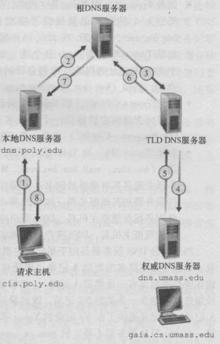

<!-- GFM-TOC -->
* [第一章.计算机网络和因特网](#第一章计算机网络和因特网)
* [第二章.应用层](#第二章应用层)
    * [1.应用程序体系结构](#1应用程序体系结构)
    * [2.套接字与端口号](#2套接字与端口号)
        * [2.1 套接字](#21-套接字)
        * [2.2 端口号](#22-端口号)
    * [3.因特网提供的运输服务](#3因特网提供的运输服务)
    * [4.应用层协议](#4应用层协议)
        * [4.1 HTTP(超文本传输协议)](#41-http超文本传输协议)
        * [4.2 FTP(文件传输协议)](#42-ftp文件传输协议)
        * [4.3 电子邮件协议](#43-电子邮件协议)
        * [4.4 DNS(域名系统)](#44-dns域名系统)
        * [4.5 P2P应用](#45-p2p应用)
* [第三章.传输层](#第三章传输层)
* [第四章.网络层](#第四章网络层)
* [第五章.链路层和局域网](#第五章链路层和局域网)
<!-- GFM-TOC -->

||通讯实体|通讯结构|
|:--:|:--:|:--:|
|应用层|应用程序|报文(message)|
|运输层|进程|:--:|
|网络层|||
|链路层|||

# 第一章.计算机网络和因特网

# 第二章.应用层

## 1.应用程序体系结构

1. **客户机/服务器(C/S)体系结构**
2. **P2P体系结构**

## 2.套接字与端口号

### 2.1 套接字

网络应用由成对进程组成，进程通过一个称为套接字的软件接口在网络上发生和接收报文

**套接字是同一台主机内应用层与运输层之间的接口，也可称为应用程序和网络之间的应用程序编程接口**

### 2.2 端口号

**通常在一台主机上能够运行许多网络应用程序。IP地址可以标识一台主机，端口号则是用来标识这台主机上的特定进程**

## 3.因特网提供的运输服务

当创建一个新的因特网应用时，首先要做出的决定是选择UDP还是TCP，它们能为应用程序提供下列服务：

* **TCP**
    * 面向连接的服务
    * 可靠数据传输服务 
* **UDP**
    *  无连接的服务
    *  不可靠数据传输服务（不保证到达，也不保证有序到达）

除此之外，TCP具有拥塞控制机制，拥塞控制不一定能为应用程序带来直接好处，但能对整个网络带来好处。UDP没有拥塞控制

## 4.应用层协议

### 4.1 HTTP(超文本传输协议)

使用**TCP**作为运输层协议

**无状态协议**：服务器向客户机发送被请求的文件时，并不存储任何关于该客户机的状态信息。假如某个特定的客户机在短短的几秒钟内两次请求同一个对象，服务器并不会因为刚刚为该用户提供了该对象就不再做出反应，而是重新发送该对象

* HTTP客户机：web浏览器
* HTTP服务器：web服务器，包含web对象（HTML文件、JPEG文件、java小程序、视频片段等）

连接类型：

* **非持久连接**：每个请求/响应对是经一个单独的TCP连接发送
* **持久连接**：所有请求/响应对使用同一个TCP连接发送

HTTP默认情况下使用持久连接

如果使用非持久连接，在将TCP握手第三步与一个HTTP请求报文结合起来发送，服务器接收请求后响应一个对象。因此，传输一个对象消耗2个RTT。（可以同时建立多个连接并行传输）但是，由于TCP连接会分配缓冲区和变量，大量使用非持久连接会给服务器造成压力

如果使用持久连接，则客户机接收到请求对象后服务器不会发送一个TCP连接关闭请求。这个连接服务于所有web对象的传输（流水线发送），如果经过一个时间间隔仍为被使用，则HTTP服务器关闭连接

#### 1）HTTP报文格式(请求报文)

“Host”：请求的目标主机  
“Connection:close”：浏览器告诉服务器不希望麻烦地使用持久连接，而是要求服务器在发送完请求后关闭连接  
“User-agent”：用户代理，即向服务器发送请求的浏览器的类型（服务器可以正确地为不同类型的用户代理发送相同对象的不同版本）  
“Accept-language”：用户想得到该对象的语法版本

**方法字段：**

* **GET**：绝大部分HTTP请求报文使用GET方法
* **POST**：用户提交表单时（如向搜索引擎提供关键字），但提交表单不一定要用POST方法
* **HEAD**：类似于GET，区别在于服务器返回的响应报文中不包含请求对象（常用于故障跟踪）
* **PUT**：用于向服务器上传对象
* **DELETE**：用于删除服务器上的对象

#### 2）HTTP报文格式(响应报文)

“Connection:close”：告诉客户机在报文发生完后关闭了TCP连接  
“Date”：报文生成、发生时的日期  
“Last-Modified”：web对象最后修改的日期  

**状态信息：**

* **200 OK**：请求成功，信息包含在返回的响应报文中
* **301 Moved Permanently**：请求的对象已经被永久转移了，新的URL定义在响应报文的Location首部中。客户机软件自动用新的URL获取对象
* **304 Not Modified**：条件GET的响应报文中的状态码，web服务器告诉web缓存响应对象未被修改
* **400 Bad Request**：请求不能被服务器理解
* **404 Not Found**：被请求的文档不在服务器上
* **505 HTTP Version Not Supported**：服务器不支持请求报文使用的HTTP协议版本

>Telnet：HTTP响应报文查看工具

#### 3）cookie

**用于识别用户**，可能出于下列意图：

* 服务器想限制用户的访问
* 服务器想把内容与用户身份关联起来

cookie包含4个组成部分：

1. 在HTTP响应报文中有一个Set-cookie首部行
2. 在HTTP请求报文中有一个Cookie首部行
3. 在用户端系统中保留有一个cookie文件，由用户的浏览器管理
4. 在web站点有一个后端数据库

#### 4）web缓存

web缓存器也叫代理服务器，用于缓存web对象。用户可以配置其浏览器，使得所有HTTP请求首先指向web缓存器

如果web缓存器没有请求的对象，会与初始服务器直接建立一条TCP连接，web缓存器进一步发送HTTP请求，获取对象，当接收到对象后，首先在本地缓存，然后生成一个HTTP响应报文，发送给客户机（**因此，web缓存器既是客户机，又是服务器**）

web缓存器类似于内存与处理器之间的cache，它能从整体上大大降低因特网上的web流量，从而改善所有应用的性能

**条件GET**：web缓存器使用条件GET向web服务器确认某个对象是否已经被修改（不是最新的对象）。如果1)请求报文使用GET方法，2)并且包含一个If-modified-since:首部行，那么这个HTTP请求报文就是一个条件GET

如果相应对象未被修改，web服务器返回一个实体为空的响应报文(也就是说并没有包含请求对象)，状态码为“304 Not Modified”

### 4.2 FTP(文件传输协议)

FTP使用两个并行的TCP连接来传输文件：

1. **控制连接(持久)**：传输控制信息，如用户标识、口令、改变远程目录命令、文件获取上传的命令
2. **数据连接(非持久)**：传输实际文件

FTP客户机发起向FTP服务器的控制连接，然后在该连接上发送用户标识和口令、改变远程目录的命令。FTP服务器收到命令后，发起一个到客户机的数据连接，在该连接上准确地传送一个文件并关闭连接

**有状态的协议**：FTP服务器在整个会话期间保留用户的状态信息。服务器必须把特定的用户账号和控制连接联系起来

### 4.3 电子邮件协议

电子邮件系统有3个主要组成部分：**用户代理、邮件服务器、简单邮件传输协议(SMTP)**

* 每个用户在邮件服务器上有一个邮箱，保存该用户发送和接收的邮件
* 如果邮件未发送成功，会保存在邮件服务器上，通常30分钟左右再进行尝试，几天后仍不成功则删除，并以邮件形式通知发送方
* SMTP传输邮件之前，需要将报文主体编码为ASCII码，传输后需要解码（HTTP传输不需要）
* SMTP一般不使用中间邮件服务器发送邮件，即使两个邮件服务器位于地球的两端
* SMTP会把邮件中所有对象封装在一个报文中，而HTTP则是每个报文封装一个web对象

#### 1）多用途因特网邮件扩展(MIME)

普通的邮件报文主体为ASCII编码的数据，报文首部适合于发生普通的ASCII文本，但是不能充分满足多媒体报文或携带非ASCII文本格式(非英文字符)的报文需求。需要额外的首部行提供对发送这些文件的支持

MIME中包含2支持发送上述文件的首部：

* Content-Transfer-Encoding：指出所用编码类型，接收方可以根据这个字段还原
* Content-Type：文件类型，接收方可以根据这个首部采取一些适当动作（如解压）

#### 2）接收方邮件拉取

SMTP是一个”推协议“，不能用于接收方代理从邮件服务器上拉取邮件，拉取邮件需要使用**POP3(第三版的邮局协议)**、**IMAP(因特网邮件访问协议)**或**HTTP**

**POP3(第三版的邮局协议)**：当用户打开一个到邮件服务器端口110上的TCP连接后，POP3就开始工作了，包含3个阶段

* 特许：用户发送用户名和口令鉴别身份
* 事务处理：用户代理取回报文（还能标记报文、获取邮件统计信息）
* 更新：客户机发出了quit命令后，结束了POP3会话，邮件服务器会删除被标记为删除的报文

使用POP3拉取时，可以设置为”拉取并删除“或”拉取并保留“

**IMAP(因特网邮件访问协议)**：POP3不能提供远程文件夹功能，IMAP可以，IMAP服务器把每个报文与一个文件夹联系起来，IMAP为用户提供了创建文件夹以及在文件夹之间移动邮件的命令。除此之外，还提供在远程文件夹中查询邮件、按指定条件查询匹配文件的命令。与POP3不同，IMAP服务器维护了IMAP会话的用户状态信息

**基于web的电子邮件**：当使用web浏览器发送接收邮件时，推送到邮件服务器和从邮件服务器拉取邮件使用的是HTTP协议

### 4.4 DNS(域名系统)

DNS运行于**UDP**之上，使用**53号端口**，它提供下列服务：

1. **主机名到IP地址的转换(主要)**
2. **主机别名**：有着复杂主机名的主机可以拥有一个或多个别名，应用程序可以调用DNS来获得主机别名对应的规范主机名以及主机的IP地址
3. **邮件服务器别名**：qq.com与foxmail.com，DNS可以解析邮件服务器别名获得规范名和IP地址
4. **负载分配**：繁忙的站点被冗余分布在多台服务器上，这些服务器有不同IP地址，IP地址集合对应于一个规范主机名，当客户机通过主机名获取IP地址时，DNS服务器用包含全部这些地址的报文进行回答，但在每个回答中选择这些地址排放的顺序，从而将负载分配到不同服务器

#### 1）DNS服务器

由于集中设计(单一DNS服务器)具有下列问题：

* 单点故障
* 通信容量：单个DNS服务器承受所有查询负载
* 远距离的集中式数据库：单个DNS服务器不可能”邻近“所有查询客户机

所以DNS服务器使用分布式设计方案：

* **根DNS服务器**：因特网上有13个根DNS服务器(标号A到M)，大部分位于北美洲
* **顶级域(TLD)DNS服务器**
* **权威DNS服务器**

除此之外，DNS服务器还有**本地DNS服务器**。严格来说，本地DNS服务器本部属于DNS服务器的层次结构，但对DNS层次结构很重要。**一台主机具有一台或多台本地DNS服务器的IP地址，本地DNS服务器起着代理的作用，将请求转发到DNS服务器层次结构中**

#### 2）DNS查询步骤

**递归查询+迭代查询（1为递归查询，3,4,5为迭代查询）**

**递归查询**

**DNS缓存**：在查询链中，当一个DNS服务器接收到一个DNS回答时，DNS服务器能将回答中的信息缓存在本地存储，以便加速后序可能的相同查询。由于主机IP和主机名之间的映射不是永久的，DNS服务器会在一段时间后丢弃缓存（本地DNS服务器可以缓存TLD服务器的IP地址，因为允许直接绕过查询链中的根DNS服务器）

#### 3）DNS记录和报文

所有DNS服务器共同存储着**资源记录**，资源记录格式如下：

**(Name,Value,Type,TTL)**

* **Type=A**：此时Name是主机名，Value是对应IP地址
* **Type=NS**：Name是域(如foo.com)，Value是知道如何获取该域中主机IP地址的权威DNS服务器的主机名
* **Type=CNAME**：Value是别名为Name的主机对应的规范主机名
* **Type=MX**：Value是别名为Name的邮件服务器的规范主机名

如果一台DNS服务器是某个特定主机名的权威DNS服务器，那么会有一条包含该主机名的类型A记录（不是权威服务器，也可能在缓存中包含A记录）  
如果DNS服务器不是某个主机名的权威DNS服务器，那么会包含一条类型NS记录，还将包含一条类型A记录，提供了在NS记录的Value字段中DNS服务器的IP地址

**DNS报文(查询和响应报文格式相同)**

>nslooup：从主机直接向某些DNS服务器发送DNS查询报文

**注册域名**

因特网名字和地址分配机构(ICANN)向各种注册登记机构授权，可以向这些机构申请注册域名：

1. 提供基本权威DNS服务器和辅助权威服务器的域名和IP
2. 注册登记机构会将NS和A类型的记录输入TLD服务器
3. 确保自身在提供的权威DNS服务器中输入了相应类型的记录

#### 4）DDos带宽洪泛攻击

如，攻击者向每个DNS根服务器连续不断地发送大量的分组，从而使得大多数合法的DNS请求得不到回答

DNS根服务器配置分组过滤器可以拦截这些分组，本地DNS服务器缓存了顶级域名服务器的IP地址，也能绕过DNS根服务器，防止攻击

### 4.5 P2P应用

不同于C/S架构，P2P架构中，每个主机即使客户机也是服务器，称作对等方，由于文件分布存储在多个对等方中，因此文件分发速度更快

**P2P中文件的搜索方式**

* **集中式索引**：使用一个集中式索引服务器存储索引，是一种P2P和C/S混合的体系结构，文件分发是P2P的，搜索是C/S的
* **查询洪泛**：建立在Gnutella协议基础上，索引全面分布在对等方区域中，对等方向相邻对等方发出文件查询请求，相邻对等方进一步转发查询请求
* **层次覆盖**：结合以上两种，与因特网高速连接并具有高可用性的对等方被指派为超级对等方，新的对等方与超级对等方之一建立TCP连接，将其可供共享的所有文件告诉超级对等方，超级对等方维护着一个索引，超级对等方之间通过TCP连接，可以转发查询

# 第三章.传输层

# 第四章.网络层

# 第五章.链路层和局域网
